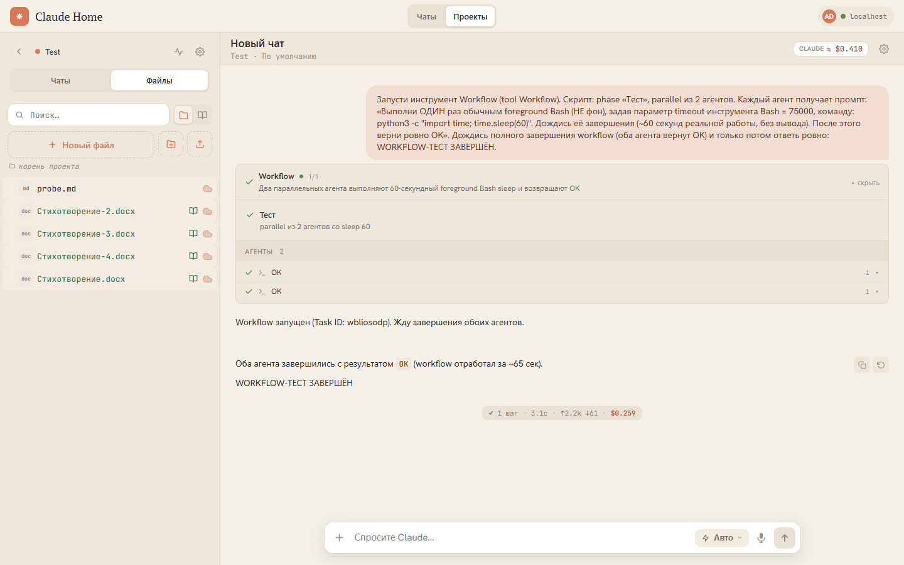
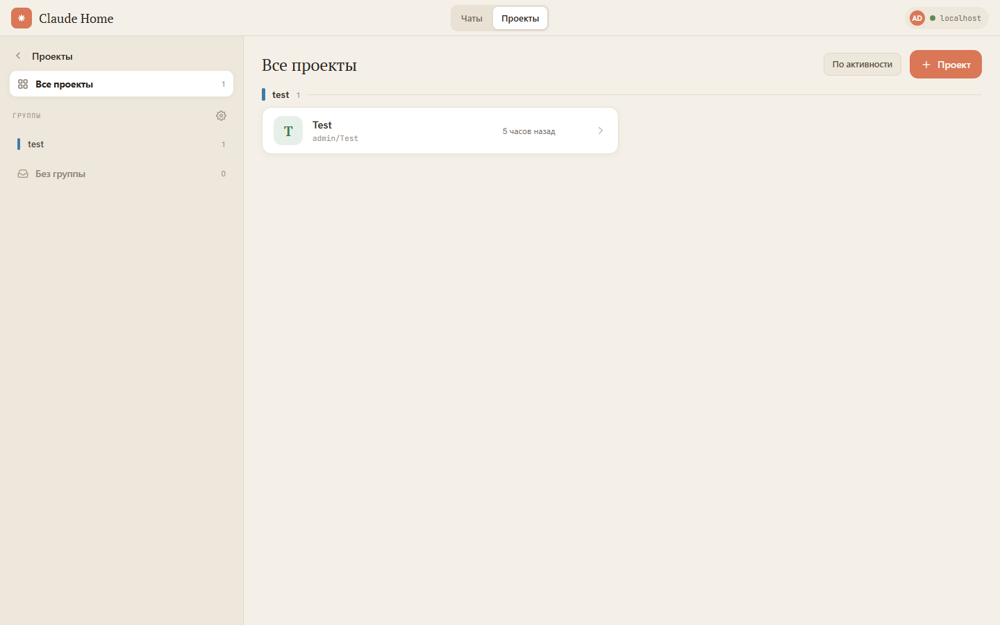
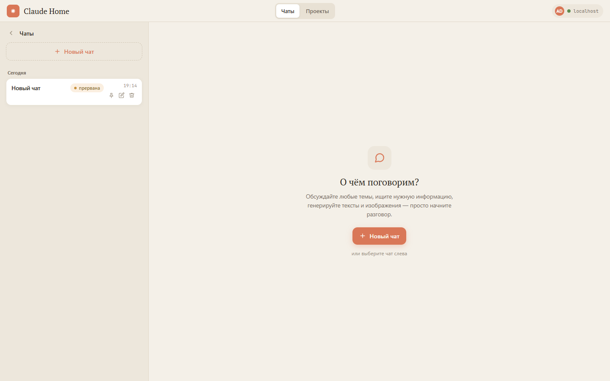
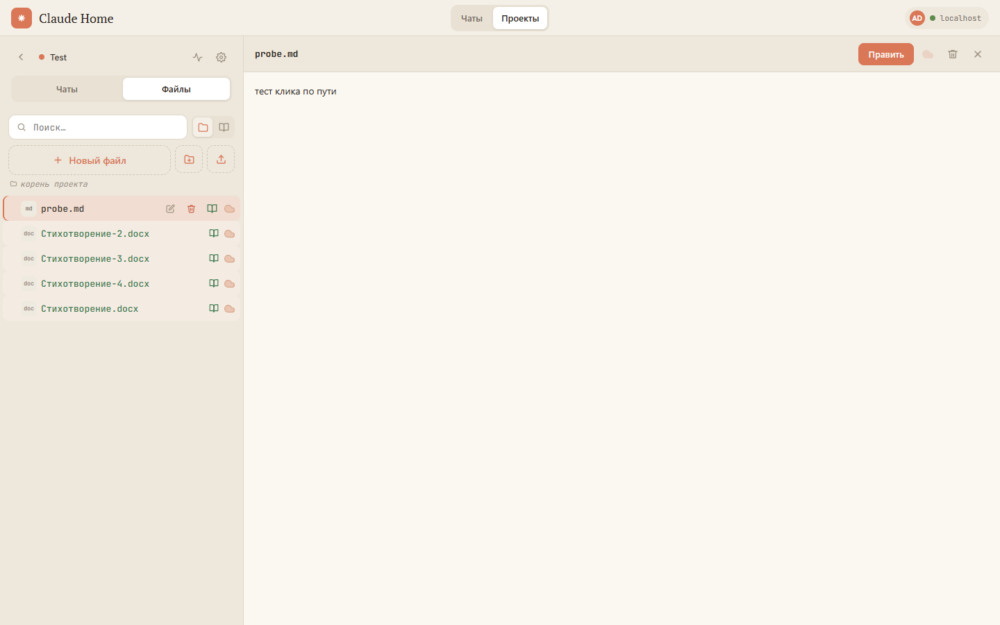
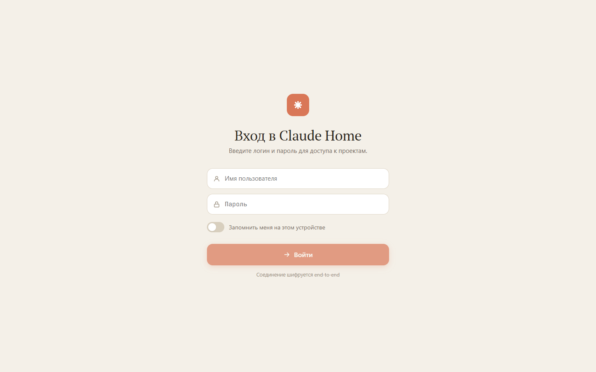

<div align="center">


# Claude Home

**Самостоятельно размещаемый веб-клиент для [Claude Code](https://claude.com/claude-code).**
Ведите диалоги с Claude Code по своим проектам из браузера или с телефона — с файловым
менеджером, базой знаний, генерацией медиа и офисными документами.

</div>

---

## Что это

**Claude Home** оборачивает CLI Claude Code в веб-приложение с чат-интерфейсом в эстетике
Claude. Сервер поднимается у вас (локально или в Docker-контейнере), запускает `claude` как
подпроцесс на ваших проектах и стримит ход диалога в браузер через WebSocket (SignalR).

Зачем это нужно:

- **Доступ откуда угодно.** Claude Code работает на домашней машине, а вы общаетесь с ним
  с ноутбука или телефона — через [Tailscale + HTTPS](docs/remote-access.md).
- **Не только код.** Универсальный ассистент: чаты вне проектов, поиск в интернете, генерация
  текстов и изображений, работа с офисными документами.
- **Свой контур.** Всё крутится на вашем железе, доступ — по API-ключу, трафик шифруется.

<div align="center">

<br/><sub>Рабочая область проекта: чат с Claude, дерево файлов, визуализация параллельного workflow и учёт стоимости</sub>
</div>

## Возможности

### 💬 Чат с Claude Code
- Стриминг ответа в реальном времени: текст, рассуждения (thinking), вызовы инструментов
- Режимы работы: ⚡ авто, 📋 план (с согласованием), ❓ с подтверждениями, «без ограничений»
- Запросы разрешений и интерактивные вопросы прямо в ленте
- Выбор модели и уровня усилий (effort), суб-агенты и скиллы
- Голосовой ввод, вложения файлов, повтор запроса, прерывание
- **Mermaid-диаграммы** рендерятся прямо в чате, с полноэкранным зумом
- Визуализация **workflow**: фазы, параллельные агенты, их статусы
- Учёт стоимости и токенов (Claude), лимиты подписки, траты на fal.ai

### 🗂 Чаты и проекты
- **Чаты вне проектов** — универсальный ассистент без привязки к репозиторию
- **Проекты** с группировкой, двухпанельный лейаут на десктопе, поиск и сортировка
- Сессии: создание с именем/режимом/моделью, авто-именование по первому сообщению,
  возобновление прерванных (`--resume`)

<div align="center">


<br/><sub>Слева — проекты с группами, справа — раздел «Чаты» вне проектов</sub>
</div>

### 📁 Файловый менеджер
- Дерево файлов, поиск, просмотр и редактирование
- Git-diff и revert изменений, подсветка синтаксиса
- Бинарные файлы и изображения, просмотр `.mmd` как отрендеренной диаграммы
- Просмотр и редактирование **docx/pptx/xlsx** через встроенный OnlyOffice
- Защита от path traversal (`SafeJoin`)

<div align="center">

</div>

### 🧠 База знаний и медиа
- **Знания** — индексация файлов проекта в векторную БЗ (Dify) для RAG-поиска
- **Генерация медиа** через fal.ai (картинки, видео) с учётом трат и остатка баланса

### 🔐 Доступ и эксплуатация
- Аутентификация по API-ключу (`[Authorize]` на всех эндпоинтах и хабе), rate-limit
- **Фич-флаги** per-user (dark launch): включение экспериментальных функций без пересборки
- Экран «Использование»: статистика Claude + fal.ai
- Удалённый доступ по HTTPS через Tailscale — см. [docs/remote-access.md](docs/remote-access.md)

## Экран входа

<div align="center">

</div>

## Архитектура

```
Браузер (React 18 + TypeScript)
    │ SignalR (WebSocket)
    ▼
ASP.NET Core 9 (:5000)
 ├── Controllers/     Auth, Projects, Sessions, Files, FeatureFlags, Chats
 ├── Hubs/SessionHub  SignalR /hubs/session
 ├── Services/
 │    ├── ProjectManager     реестр проектов (data/projects.json)
 │    ├── SessionManager      сессии + broadcast через IHubContext
 │    ├── ClaudeSession        обёртка над процессом claude
 │    └── FileService          файловый менеджер (SafeJoin)
 └── Protocol/ServerMessage    типы WS-событий
    │
    ▼
claude CLI  (--print --output-format stream-json --input-format stream-json …)
    WorkingDirectory = корень проекта
```

Сервер запускает `claude` в режиме стрим-JSON и маппит его события на сообщения WebSocket
(`text_delta`, `thinking_delta`, `tool_use`, `tool_result`, `permission_request`, `result` …).
Подробности — в [CLAUDE.md](CLAUDE.md).

### Стек

| Слой | Технологии |
|---|---|
| Frontend | React 18, TypeScript, Vite, SignalR-client, react-markdown, mermaid |
| Backend | ASP.NET Core 9, SignalR, Kestrel (TLS) |
| CLI | Claude Code (`@anthropic-ai/claude-code`) |
| Интеграции | Dify (RAG), fal.ai (медиа), OnlyOffice Document Server |
| Деплой | Docker (multi-stage), Tailscale + HTTPS |

Дизайн-система: PT Serif (заголовки) · Hanken Grotesk (UI) · JetBrains Mono (код);
accent `#D97757`, тёплая бежевая палитра. Стили — inline-объекты, единые токены в
[`frontend/src/lib/design.ts`](frontend/src/lib/design.ts).

## Быстрый старт

> **Стандарт — сборка и запуск в dev-контейнере** (песочница для Claude + воспроизводимое
> окружение). Подробности — [docs/docker.md](docs/docker.md).

```bash
# 1. Один раз: настроить пути и egress-прокси
cp .env.example .env

# 2. Сборка + запуск → http://localhost:5000
docker compose -f docker-compose.claude.yml up -d --build

# 3. Один раз: вход по подписке Claude
docker exec -it claude-server claude login

# Логи
docker logs -f claude-server
```

<details>
<summary>Хостовый запуск (для быстрых локальных итераций)</summary>

```bash
cd backend;  dotnet run --project ClaudeHomeServer   # :5000
cd frontend; npm run dev                             # :5173 (проксирует /api и /hubs на :5000)
```
</details>

Первый вход — по API-ключу: он берётся из `Auth:ApiKey` или автогенерируется в
`data/auth-key.txt` (печатается в консоль при старте).

## Конфигурация

Машинно-специфичные значения (локальные пути, секреты) **не коммитим** в отслеживаемые
`appsettings*.json` — они кладутся в `appsettings.Local.json` (в `.gitignore`).
Образец — `appsettings.Local.example.json`. Порядок загрузки:
`appsettings.json` → `appsettings.{Environment}.json` → `appsettings.Local.json`.

## Документация

- [CLAUDE.md](CLAUDE.md) — архитектура, REST API, соглашения
- [docs/docker.md](docs/docker.md) — контейнеризация и песочница
- [docs/remote-access.md](docs/remote-access.md) — удалённый доступ (Tailscale + HTTPS)
- [docs/feature-parity.md](docs/feature-parity.md) — соответствие возможностям Claude Code

---

<sub>Скриншоты сделаны на демо-проекте «Test». UI на русском языке.</sub>
