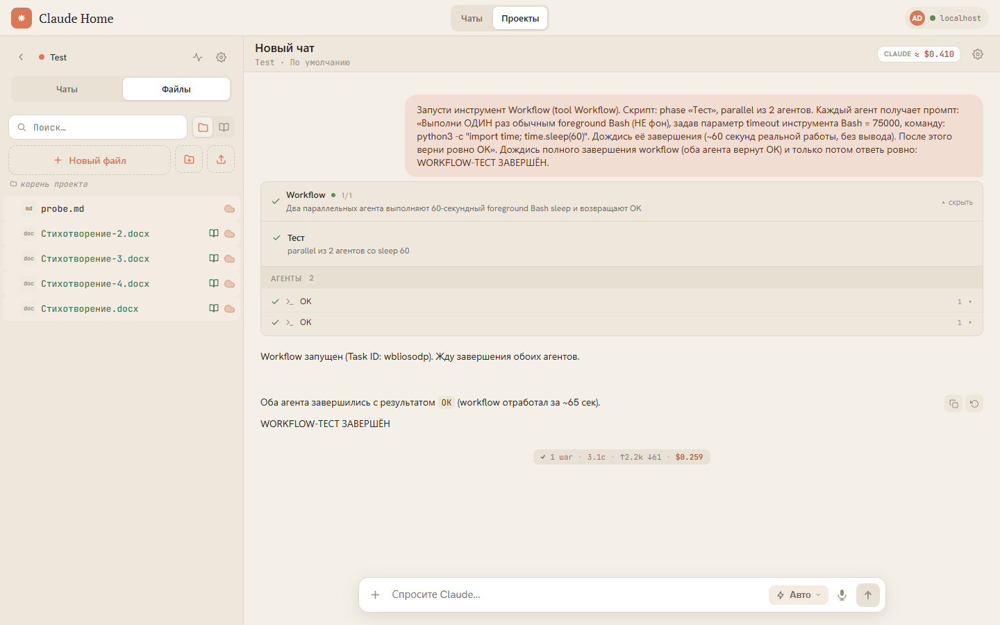
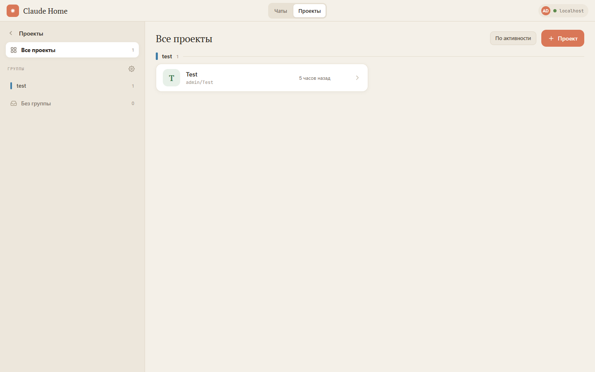
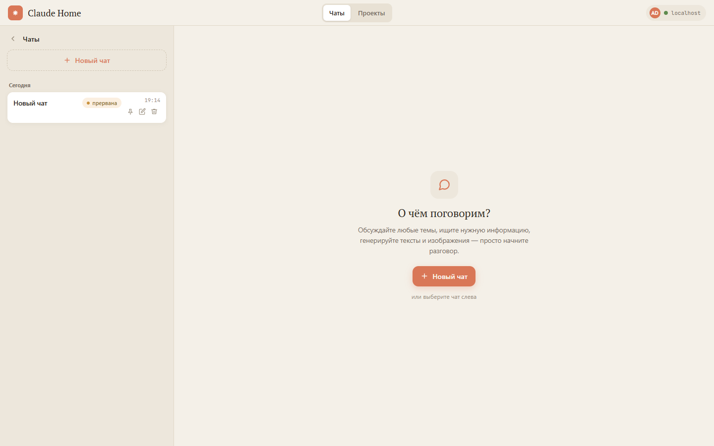
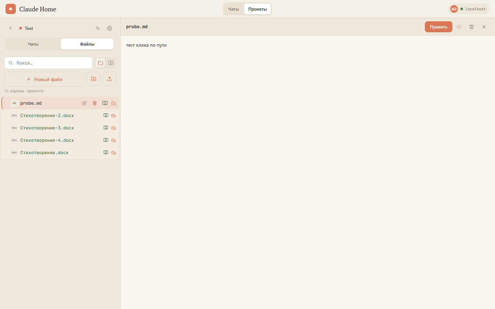
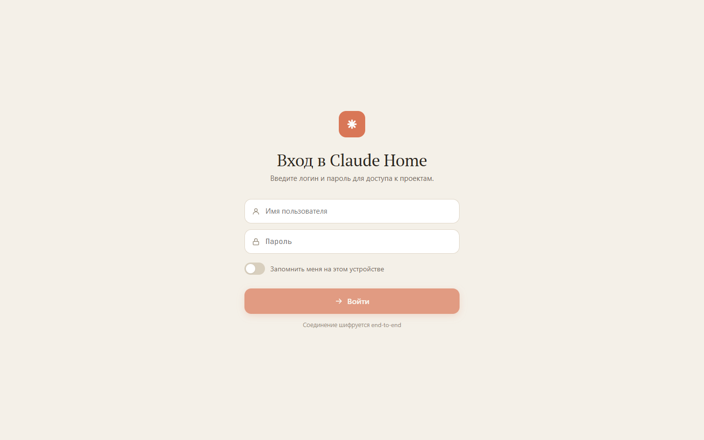

<div align="center">


# Home AI

**Самостоятельно размещаемый веб-интерфейс для агентных AI-ассистентов.**
Ведите диалоги по своим проектам из браузера или с телефона — с файловым менеджером,
задачами, персонами, базой знаний и офисными документами.

</div>

---

## Что это

**Home AI** оборачивает агентный CLI в веб-приложение с чат-интерфейсом. Сервер поднимается
у вас (локально или в Docker-контейнере), запускает ассистента как подпроцесс на ваших
проектах и стримит ход диалога в браузер через WebSocket (SignalR).

Рантайм один — CLI [Claude Code](https://claude.com/claude-code), но модель за ним не
обязана быть от Anthropic: GLM и DeepSeek подключаются оверрайдами окружения на каждый ход,
а фоновая мелочь (заголовки чатов, теги, сводки) уходит на локальный LLM-движок
(Ollama или llama-server, выбор по `LocalLlm:Provider`) или OpenRouter.
Какой моделью идёт каждое место — решает админ в настройках, см.
[architecture/llm-providers.md](docs/architecture/llm-providers.md).

Зачем это нужно:

- **Доступ откуда угодно.** Ассистент работает на домашней машине, а вы общаетесь с ним
  с ноутбука или телефона — через [Tailscale + HTTPS](docs/operations/remote-access.md).
- **Не только код.** Универсальный ассистент: чаты вне проектов, задачи и заметки, поиск
  в интернете, генерация текстов и изображений, работа с офисными документами.
- **Свой контур.** Всё крутится на вашем железе, доступ — по логину и паролю, трафик шифруется.

<div align="center">

<br/><sub>Рабочая область проекта: чат с Claude, дерево файлов, визуализация параллельного workflow и учёт стоимости</sub>
</div>

Вокруг чата собран рабочий контур: проекты с файловым менеджером и git-разницей, задачи
с напоминаниями, персоны-собеседники со своей памятью, заметки в markdown-хранилище,
семантический поиск по проекту, генерация медиа, бэкапы и телеметрия. Полный перечень
с деталями реализации — [docs/architecture/features.md](docs/architecture/features.md).

## С чего начать

Маршруты чтения — каждая строка ведёт в отдельный документ:

| Хочу | Читать |
|---|---|
| Запустить у себя | [operations/docker.md](docs/operations/docker.md) → [operations/remote-access.md](docs/operations/remote-access.md) |
| Понять устройство | [CLAUDE.md](CLAUDE.md) → [architecture/api.md](docs/architecture/api.md) → [architecture/sandbox.md](docs/architecture/sandbox.md) |
| Разобраться, что уже умеет | [architecture/features.md](docs/architecture/features.md) |
| Поправить интерфейс | [design/guidelines.md](docs/design/guidelines.md) — обязательна для любых правок UI |
| Понять работу с моделями | [architecture/llm-providers.md](docs/architecture/llm-providers.md) — провайдеры, три слота, таблица назначений |
| Подключить свой инструмент | [architecture/mcp-servers.md](docs/architecture/mcp-servers.md) |
| Настроить персон и память | [architecture/personas.md](docs/architecture/personas.md) |
| Поднять телеметрию | [observability/overview.md](docs/observability/overview.md) |
| Узнать, почему сделано так | [ADR-001: происхождение задач и чатов](docs/adr/ADR-001-task-and-chat-origin.md), [ADR-002: god-узлы графа кода](docs/adr/ADR-002-code-graph-god-nodes-in-prompt.md) |

Карта всего корпуса документации — [docs/README.md](docs/README.md): что лежит в каждом
разделе и куда класть новое.

## Как устроено

```
Браузер (React 18 + TypeScript, PWA)
    │ REST + SignalR (WebSocket)
    ▼
ASP.NET Core 10 (:5000)
 ├── Controllers/     чаты и сессии, проекты и файлы, персоны, задачи, заметки,
 │                    знания, модели и траты, бэкапы, админка
 ├── Hubs/SessionHub  стрим хода диалога в браузер
 ├── Services/
 │    ├── Llm/         провайдеры и запуск claude CLI (Claude/ClaudeSession)
 │    ├── Execution/   запуск процессов: на машине сервера или в docker-песочнице
 │    ├── Docs/ Git/ CodeGraph/ Memory/ Modules/ Prompts/ Spend/ Backup/
 │    └── …            проекты, сессии, файловый менеджер (SafeJoin)
 ├── Telemetry/       OpenTelemetry → Aspire (dev) / SigNoz (production)
 └── Protocol/        типы событий WebSocket
    │
    ▼
claude CLI  (--print --output-format stream-json --input-format stream-json …)
    WorkingDirectory = корень проекта
    ▲
    └── mcp/*-server — инструменты продукта: задачи, заметки, персоны, память,
        виджеты, граф кода, уведомления, рабочая область
```

Сервер запускает `claude` в режиме стрим-JSON и маппит его события на сообщения WebSocket
(`text_delta`, `thinking_delta`, `tool_use`, `tool_result`, `permission_request`, `result` …).
Инварианты, соглашения и карта кода — в [CLAUDE.md](CLAUDE.md).

### Стек

| Слой | Технологии |
|---|---|
| Frontend | React 18, TypeScript, Vite, SignalR-client, react-markdown, mermaid, dnd-kit |
| Backend | ASP.NET Core 10, SignalR, Kestrel (TLS), YARP |
| CLI | Claude Code (`@anthropic-ai/claude-code`) |
| Модели | Claude по подписке; GLM и DeepSeek env-оверрайдами; Ollama/llama-server и OpenRouter для фоновых задач |
| Интеграции | Dify (RAG), fal.ai (медиа), OnlyOffice Document Server |
| Телеметрия | OpenTelemetry, Aspire Dashboard (dev), SigNoz (production) |
| Деплой | Docker (multi-stage), Tailscale + HTTPS |

Дизайн-система: PT Serif (заголовки) · Hanken Grotesk (UI) · JetBrains Mono (код);
accent `#D97757`, тёплая бежевая палитра. Стили — inline-объекты, единые токены в
[`frontend/src/lib/design.ts`](frontend/src/lib/design.ts).

## Запуск

> **Стандарт — сборка и запуск в dev-контейнере** (песочница для Claude + воспроизводимое
> окружение). Подробности — [docs/operations/docker.md](docs/operations/docker.md).

```bash
# 1. Один раз: настроить пути и egress-прокси
cp .env.example .env

# 2. Сборка + запуск → http://localhost:5000
docker compose -f docker-compose.claude.yml up -d --build

# 3. Один раз: вход по подписке Claude
docker exec -it claude-server claude login

# Логи
docker logs -f claude-server
```

<details>
<summary>Хостовый запуск (для быстрых локальных итераций)</summary>

```bash
cd backend;  dotnet run --project ClaudeHomeServer   # :5000
cd frontend; npm run dev                             # :5173 (проксирует /api и /hubs на :5000)
```
</details>

Первый старт создаёт пользователя `admin` со случайным паролем и **один раз** печатает его
в консоль — сохраните его сразу, потом пароль меняется в настройках профиля.

## Конфигурация

Машинно-специфичные значения (локальные пути, секреты) **не коммитим** в отслеживаемые
`appsettings*.json` — они кладутся в `appsettings.Local.json` (в `.gitignore`).
Образец — `appsettings.Local.example.json`. Порядок загрузки:
`appsettings.json` → `appsettings.{Environment}.json` → `appsettings.Local.json`.

## Документация

- [docs/README.md](docs/README.md) — карта корпуса: что в каком разделе и куда класть новое
- [CLAUDE.md](CLAUDE.md) — карта кода, инварианты, соглашения
- [docs/architecture/features.md](docs/architecture/features.md) — что уже реализовано и как
- [docs/architecture/api.md](docs/architecture/api.md) — справочник REST-эндпоинтов

<details>
<summary>Ещё скриншоты</summary>

<div align="center">


<br/><sub>Слева — проекты с группами, справа — раздел «Чаты» вне проектов</sub>
</div>

<div align="center">

<br/><sub>Файловый менеджер: дерево, просмотр и правка, git-разница</sub>
</div>

<div align="center">

<br/><sub>Экран входа</sub>
</div>
</details>

---

<sub>Скриншоты сделаны на демо-проекте «Test». UI на русском языке.</sub>
