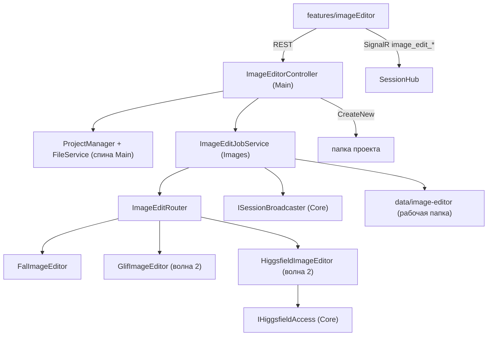

# ADR-016: Редактор картинок в проекте — архитектурный разрез

**Статус:** Черновик (предложено, код не писался)
**Дата:** 2026-09-25
**Входные артефакты:** макет [image-editor-v1.html](../mockups/image-editor-v1.html) и записка
[image-editor-proposal.md](../mockups/image-editor-proposal.md); продуктовые решения Андрея из
постановки задачи, включая дополнение от 2026-09-25 о персонаже (раздел 10).
**Смежные документы:** [image-generation.md](../features/image-generation.md) (драйверы и места),
[ADR-014](ADR-014-internal-subsystems.md) (правило зависимостей вертикалей),
[sandbox.md](../architecture/sandbox.md) (container-владельцы),
[mcp-registry.md](../architecture/mcp-registry.md) (встроенная интеграция Higgsfield).

## Контекст

Макет согласован: полноэкранный редактор открывается из дерева файлов проекта. В нём есть
пометки (кисть-маска, стрелка, рамка, подпись), от 1 до 4 вариантов, образцы, быстрые действия,
цена до запуска, сохранение результата новым файлом рядом с оригиналом и кнопка «Обсудить с
Claude», которая уходит в чат проекта. Всё за флагом `image-editor`, мобильная раскладка
обязательна. В MVP входит **персонаж**: сохранённый набор фото лица для серии сцен.

Что есть в коде сегодня (сверено 2026-09-25):

- Вертикаль `ClaudeHomeServer.Images` (отдельный `.csproj`): контракт `IImageGenerator`
  **только text-to-image** (`GenerateManyAsync(prompt, count, model)`), роутер
  `ImageGenerationService` с инвариантом «явно выбранного провайдера не подменяем», одно место
  `ImagePlaces.PersonaAvatar`, очередь догоняющей генерации. Отказ драйвера — пустой список,
  без причины.
- `FalImageService` синхронно зовёт `https://fal.run/{model}`, полей `image_url`/`mask_url`
  нет, загрузки в fal storage нет. `FalCostService` узнаёт цену **постфактум** по
  billing-events, прайса до запуска нет.
- Higgsfield у бэкенда есть только как MCP-прокси хода (`HiggsfieldToolset`) с инстансным
  OAuth-токеном (`HiggsfieldOAuthService.EnsureFresh()`, лежит в Main). Своего HTTP-клиента
  генерации нет.
- Библиотек обработки изображений (ImageSharp, SkiaSharp, System.Drawing) в решении нет.
- Файлы проекта: `FilesController` (`api/projects/{id}/files`), `POST upload` пишет через
  `FileMode.Create`, то есть **перезаписывает** существующий файл; `SafeJoinPublic` →
  `SafePath.Join`; после записи зовётся `NotifyMutated` (синк знаний).
- Вложения чата: `POST api/chats/{id}/files/upload` кладёт файл в
  `{chatRoot}/.cc-attachments/{guid}/`, затем путь уходит в `attachedPaths` метода хаба
  `SendMessage`. Программно подставить в композер можно только **текст** (`prefillComposer`,
  `cc-compose-prefill`), вложения живут в локальном state `WorkspacePage`.
- Паттерна «фоновая задача с job id, прогрессом и отменой через SignalR» нет. Есть разовое
  уведомление `image_backfilled` через `ISessionBroadcaster.ToOwner` (шов в Core, уже
  используется вертикалью Images).

Живой каталог fal (проверено 2026-09-25 через MCP fal: `get_model_schema`, `get_pricing`):

| Endpoint | Что умеет | Цена |
|---|---|---|
| `fal-ai/nano-banana-2/edit` | правка по тексту, `image_urls[]` (несколько образцов), `num_images` 1–4, `aspect_ratio`, очередь с `cancel_url` | $0.08 / картинка |
| `fal-ai/nano-banana-pro/edit` | то же, выше качество | $0.15 / картинка |
| `fal-ai/flux-pro/kontext`, `…/kontext/max/multi` | правка с сохранением объекта, multi — несколько образцов | $0.04 / $0.08 за картинку |
| `fal-ai/flux-pro/v1/fill` | инпейнт: `image_url` + `mask_url` (размеры обязаны совпадать), 1–4 | $0.05 / мегапиксель |
| `fal-ai/bria/background/remove`, `fal-ai/birefnet/v2` | убрать фон | $0.018 / генерация; $0.0008 / с вычислений |
| `fal-ai/bria/expand` | дорисовать за края | $0.04 / генерация |
| `fal-ai/clarity-upscaler` | улучшить качество | $0.03 / мегапиксель |
| `fal-ai/gpt-image-1.5/edit`, `microsoft/mai-image-2.5-pro/edit`, `alibaba/qwen-image-3/edit` | правка, заявлено сохранение лица | единицы непрозрачные (`units`/`credits`) |

Единицы цены у fal разные: картинки, мегапиксели, секунды вычислений и непрозрачные «units».
Это важно для раздела 4.

## Решение

### 1. Разрез слоёв

**Бэкенд редактора — расширение вертикали `Images`, новой вертикали не заводим.** Всё, что
нужно редактору, у `Images` уже есть: драйверы, настройки по местам, роутер, HTTP-клиенты fal
и glif, шов `ISessionBroadcaster`. Новая вертикаль рядом дублировала бы роутер или сразу
зависела бы от `Images` напрямую, а ADR-014 это запрещает. Критерий ADR-014 «положен ли свой
проект» выполняется: потребности закрываются Core плюс одним-двумя узкими швами.

Внутри `ClaudeHomeServer.Images`, неймспейс `ClaudeHomeServer.Services.Images.Editing`
(попадает под корень `Services.Images`, поэтому таблица `Boundaries` не меняется):

| Тип | Роль |
|---|---|
| `IImageEditor` | новый контракт драйвера правки (раздел 2), рядом со старым `IImageGenerator`, старый не трогаем |
| `ImageEditRequest` / `ImageEditResult` / `ImageEditCapabilities` / `ReferenceImage` | типы контракта |
| `ImageEditRouter` | выбор драйвера и модели по месту `image-editor`, режиму и возможностям; выдаёт **котировку** (раздел 4) |
| `ImageEditPriceCatalog` | оценка цены: прайс провайдера и фолбэк курируемого каталога |
| `ImageEditJobService` | реестр задач в памяти, запуск, отмена, SignalR-события через `ISessionBroadcaster` (раздел 7) |
| `ImageEditWorkspaceStore` | временные файлы сеанса правки в `data/image-editor/{ownerId}/{editId}/` (варианты, маски), TTL |
| `EditMarksPrompt` | детерминированный перевод структурных пометок в текст запроса (раздел 3) |
| `CharacterManifest` | формат `character.json` персонажа, чтение и валидация (раздел 10) |
| драйверы | `FalImageService` получает вторую реализацию `IImageEditor` (или отдельный `FalImageEditor` на тех же клиентах); позже `GlifImageEditor` и `HiggsfieldImageEditor` |

**В Main** (там же, где уже живут `ImageGenerationController` и `FilesController`):

- `Controllers/ImageEditorController.cs`, маршрут `api/projects/{projectId}/image-editor`.
  Контроллер в Main, потому что ему нужны спина и файловый слой: проверка владения проектом
  (`ProjectManager`), корень проекта, `FileService` (`SafePath.Join` плюс `NotifyMutated`).
  В вертикаль уходят уже **байты и абсолютный корень**, `ProjectManager` она не видит.
- Запись результата в проект — новый метод `FileService.CreateNewBinary(root, relPath, bytes)`
  с `FileMode.CreateNew` (раздел 5). Существующий `upload` не переиспользуем: он перезаписывает.
- Шов для Higgsfield (волна 2): `IHiggsfieldAccess { string? AccessToken(); }` в Core,
  реализация — адаптер над `HiggsfieldOAuthService` в Main. Вертикаль `Images` зависит
  только от интерфейса.

**Ручки** (все `[Authorize]`, каждая проверяет флаг `image-editor` **на сервере**, владение
проектом и владельца задачи):

| Метод и путь | Что делает |
|---|---|
| `GET  …/image-editor/caps` | режимы, доступные операции, провайдер места, лимиты (размер, число образцов) |
| `POST …/image-editor/quote` | котировка: провайдер, модель, оценка цены с источником; ничего не тратит |
| `POST …/image-editor/jobs` | запуск по котировке (multipart: исходник, маска, размеченная копия, образцы или пути образцов из проекта, пометки JSON) → `202 { jobId }` |
| `GET  …/image-editor/jobs/{jobId}` | состояние задачи для восстановления после переподключения |
| `DELETE …/image-editor/jobs/{jobId}` | отмена |
| `GET  …/image-editor/jobs/{jobId}/variants/{n}` | байты варианта из рабочей папки |
| `POST …/image-editor/save` | сохранить вариант в проект новым файлом, по галочке — историю (раздел 5) |
| `GET/POST …/image-editor/characters` | список персонажей проекта, создание; `PUT/DELETE …/characters/{slug}` (раздел 10) |

**Фронт** — новая папка `frontend/src/features/imageEditor/`:

- `ImageEditorPage.tsx` — полноэкранный экран; вход по маршруту
  `#/project/{id}/image-editor?path=…` (или `?folder=…` для «Нарисовать картинку»). Открытый
  вопрос 1 записки закрываем так: **отдельный экран поверх воркспейса**, а не панель, потому
  что холсту на телефоне нужна вся ширина.
- `EditorCanvas.tsx` — холст на двух слоях `<canvas>`: исходник и пометки. Масштаб и
  перемещение, инструменты кисть, стрелка, рамка, подпись, ластик. Экспорт трёх артефактов —
  раздел 3.
- `PromptPanel.tsx` (запрос, режим, число вариантов, цена, быстрые действия),
  `ReferencesTray.tsx` (образцы с ролью), `CharacterPicker.tsx` / `CharacterCreateDialog.tsx`,
  `VariantsCompare.tsx` (шторка и «до/после»), `StepsHistory.tsx` (колонка на десктопе, шторка
  на телефоне), `SaveDialog.tsx`, `EditorError.tsx`, `DiscussWithClaude.tsx`.
- `useImageEditJob.ts` — подписка на события задачи и рефетч на `onReconnected`.
- Вход из файлов: пункт «Редактировать» в `FileExplorer` у растровых картинок и в
  `FileViewer`, пункт «Нарисовать картинку» у папки. Всё под `useFeature(FLAGS.imageEditor)`.
- Контролы только из `components/ui/`, цвета — токены `C.*`, гейт `npm run lint:design`.



Правило ADR-014 соблюдено: `Images` зависит от Core (`ISessionBroadcaster`, новый
`IHiggsfieldAccess`), Main зависит от `Images`, стрелки `Images → Main` нет. Если подсистему
выключить (`Subsystems:images:Enabled=false`), контроллер получает `ImageEditJobService?` как
null и честно отвечает 503 с причиной (легальная форма ADR-014).

### 2. Провайдеры правки

**`IImageGenerator` не хватает** — ни входной картинки, ни маски, ни образцов, ни причины
отказа (экрану 8 нужно различать «сервис не ответил» и «не хватает кредитов»). Нужен **новый
контракт** `IImageEditor`. Старый не меняем: на нём держатся аватары и очередь.

```csharp
public interface IImageEditor
{
    string Key { get; }                              // тот же ключ, что у IImageGenerator
    bool Enabled { get; }
    ImageEditCapabilities Capabilities { get; }      // что драйвер умеет
    ImageEditModel? PickModel(ImageEditOp op, EditMode mode, EditTraits traits); // null — не умеет
    Task<ImageEditResult> RunAsync(ImageEditRequest req, IProgress<EditProgress> progress, CancellationToken ct);
    Task<bool> CancelRemoteAsync(string remoteId, CancellationToken ct); // лучшее усилие
}

enum ImageEditOp { Generate, Edit, Inpaint, Outpaint, RemoveBackground, Upscale }
enum EditMode { Auto, Fast, Precise, Photoreal }     // «Авто / Быстрая / Точная правка / Фотореализм»
record EditTraits(bool HasMask, int References, bool HasCharacter);
record ReferenceImage(byte[] Bytes, string ContentType, ReferenceRole Role, string? Label);
enum ReferenceRole { Character, Style, Object }      // раздел 10
record ImageEditRequest(ImageEditOp Op, string Prompt, ImageBytes? Source, ImageBytes? Mask,
    IReadOnlyList<ReferenceImage> References, int Count, string? AspectRatio,
    OutpaintSpec? Outpaint, string Model, CharacterRef? Character);
record ImageEditResult(EditOutcome Outcome, IReadOnlyList<GeneratedImage> Images,
    EditCost? ActualCost, bool? Charged, string? RemoteId, string? Error);
enum EditOutcome { Ok, Failed, InsufficientCredits, Rejected /* модерация */, Cancelled, Unavailable }
```

Отказ здесь — **результат с причиной, а не пустой список**. Исключение наружу летит только
при отмене снаружи, как и раньше.

Кто что может на бэкенде, без MCP хода:

| Провайдер | Правка по тексту | Маска | Образцы | 1–4 точно | Outpaint | Фон / апскейл | Цена до запуска | Итог |
|---|---|---|---|---|---|---|---|---|
| **fal** | да (`nano-banana-2/edit`, `kontext`) | да (`flux-pro/v1/fill`) | да, `image_urls[]` | да, `num_images` | да (`bria/expand`) | да | да, прайс API (`/v1/models/pricing`, тот же источник, что `get_pricing`) | **драйвер MVP**, покрывает всё |
| **glif** | агентом, `compose_project` | нет канала | да, через загрузку файлов | нет, только просьбой в тексте | нет | агентом, без гарантий | нет | волна 2, только режим «Авто» / творческие правки |
| **Higgsfield** | да (`generate_image` с `medias`) | не подтверждено | да, роли у медиа | да, `count` 1–4 | не подтверждено | не подтверждено | **да, `get_cost: true`** | волна 2, через шов `IHiggsfieldAccess`; платит **инстансный аккаунт админа** |

Транспорт fal для редактора — **очередь** (`queue.fal.run/{model}` → `status_url` /
`cancel_url`), а не синхронный `fal.run`: только она даёт отмену и стадии «в очереди / рисуем».
Входные картинки уходят как `data:` URI (размер ограничен лимитом ручки, по умолчанию 20 МБ на
файл) либо через загрузку в fal storage, если data URI упрётся в лимит тела запроса. Это
выясняется при реализации первой ручки.

**Новое место** `ImagePlaces.ImageEditor = "image-editor"` в `ImagePlaces.All`. Админ в
«Модели и расход → Применение → Картинки» выбирает провайдера места (`auto` | `fal` | `glif` |
`higgsfield`). Человек в редакторе выбирает только **режим** (`EditMode`), и тот
разворачивается в модель **внутри** провайдера места: `IImageEditor.PickModel`, таблица
«операция × режим × признаки → модель» у каждого драйвера. Так закрывается открытый вопрос 5:
четыре понятных режима для человека, провайдер выбирает админ.

**Инвариант «явно выбранного провайдера не подменяем» сохраняется и ужесточается.**
Закреплённый fal означает, что режимы выбирают модели только fal; операцию, которую fal не
умеет, UI показывает недоступной (`caps`). В режиме `auto` цепочка фильтруется по
возможностям (маска есть — только драйверы с `Mask`). Отличие от аватаров: **тихого фолбэка на
соседа с деньгами нет даже в `auto`**, потому что цена уже показана человеку и привязана к
котировке (раздел 4). Если первый провайдер в `auto` отказал, сервер возвращает отказ и
**новую котировку** соседа, а UI предлагает «Повторить через glif ≈ …» одним кликом.

### 3. Пометки → модель

**Рекомендация — гибрид, и решается он на фронте.** Исходник всегда уходит **чистым**, пометки
на него не запекаются: иначе штрихи и стрелки просачиваются в результат.

| Пометка | Канал в модель |
|---|---|
| кисть-маска | **отдельная маска**: бинарный PNG ровно в размер исходника (белое — менять). Операция становится `Inpaint`, модель — с `mask_url` (`flux-pro/v1/fill`). Для моделей без маски (nano-banana, kontext) маска идёт **дополнительным образцом**, а в запрос добавляется фраза «менять только область, отмеченную на второй картинке» |
| стрелка, рамка, подпись | **запечённая копия** (annotation-to-edit): исходник с нарисованными пометками уходит дополнительным образцом, плюс **текст из структуры**: «рамка в правой верхней четверти (x 62–88 %, y 10–35 %): сюда лампу» |
| ластик, «Очистить пометки» | чисто фронтовые |

Фронт экспортирует из холста четыре артефакта: `source` (исходные байты без перекодирования),
`mask.png`, `annotated.png` и `marks.json` (тип, координаты в долях 0…1, текст подписи).
Растровая работа идёт на фронте, потому что там уже есть `<canvas>`, а на бэкенде нет ни одной
библиотеки изображений, и заводить её ради этого не нужно. Бэкенд:

- `EditMarksPrompt` переводит `marks.json` в текст запроса детерминированно. Это чистая
  функция, её легко покрыть тестами;
- проверяет, что маска PNG и её размеры совпадают с исходником. Для этого читается заголовок
  IHDR, без библиотеки; у JPEG/WebP размеры берутся из маркеров SOF/VP8. Не совпало — 400;
- выбирает операцию: маска есть → `Inpaint`, иначе `Edit`.

Размеченная копия — тот же `annotated.png`, который уходит и в «Обсудить с Claude» (раздел 6):
Claude читает картинку глазами, модели правки получают её как образец.

### 4. Цена до запуска

**Котировка — отдельный шаг**: `POST …/quote` по параметрам (операция, режим, число вариантов,
маска, число образцов, размер исходника) возвращает
`{ quoteId, provider, model, estimate: { amount, unit, approx, source }, expiresAt }`.
`POST …/jobs` принимает `quoteId` и исполняет **ровно эту пару провайдер-модель**. Котировка
живёт 10 минут в памяти, фронт пересчитывает её с дебаунсом при смене числа вариантов или
режима.

Откуда берётся оценка, по убыванию точности:

1. **Higgsfield — `get_cost: true`** (препроверка без запуска), точно в кредитах. `source: "provider"`.
2. **fal — прайс API** по endpoint_id с кешем на 24 часа. Единицу пересчитываем честно:
   `images` × число вариантов, `megapixels` × размер результата, `generations` × 1. Для
   `compute seconds` и непрозрачных `units`/`credits` точной формулы нет — берём **p50 из
   собственных фактических списаний** (`FalCostService` уже достаёт их из billing-events), а
   без истории показываем «цена станет известна после запуска». `source: "catalog"` или `"history"`.
3. **glif** — препроверки нет: «≈ по прошлым запускам» либо «цена станет известна после
   запуска». Кнопка при этом остаётся доступной.

**Единица показывается провайдерская, своей валюты AI Home нет**: у fal «≈ $0.24 · 3
варианта», у glif и Higgsfield «≈ 12 кредитов Higgsfield». В текстах макета сейчас абстрактные
«кредиты» — это правка текстов для Софьи и Майи (открытый вопрос 4).

Факт после запуска: `ActualCost` из ответа провайдера (Higgsfield, glif) или догоняющим
`FalCostService` по `request_id`. Показываем «списано $0.26» у вариантов, расхождение с
оценкой отдельно не подсвечиваем. Строку «Кредиты не списаны» на экране ошибки показываем
**только** при `Charged == false`: у fal неуспешный запрос не тарифицируется, у glif и после
отмены это неизвестно, и тогда строка звучит «Списание уточняется у сервиса».

Расход редактора **впервые записываем в `SpendStore`** (сейчас серверная генерация туда не
попадает, см. §6 image-generation.md) через узкий шов в Core. Если подходящего
`ISpendCollector` не хватит, заводим `IMediaSpendSink`. Баланс для «на счёте остался 1
кредит» — из существующих `FalAccountService`/`GlifAccountService`, волна 2.

### 5. Сохранение в проект и история

**Оригинал не затирается по построению.** У ручки `save` **нет флага перезаписи вообще**, а
запись идёт через `FileService.CreateNewBinary` с `FileMode.CreateNew`: гонка двух
сохранений даёт `IOException` и следующий номер, а не перезапись.

Имена:

- правка `images/hero.png` → `images/hero.v2.png`. Суффикс `.vN` снимается перед подбором
  номера: `hero.v2.png` → `hero.v3.png`, а не `hero.v2.v2.png`. N = первый свободный начиная с 2;
- «Нарисовать картинку» → `{папка}/{имя из диалога}.png`, занято → `-2`, `-3`;
- расширение берётся **по фактическому content-type результата**: был `.jpg`, пришёл PNG →
  `hero.v2.png`, в диалоге это видно. Вектор (SVG) редактор не открывает, пункт
  «Редактировать» у `.svg` не показываем;
- имя из диалога проходит `Path.GetFileName`, затем `SafePath.Join`. Папка выбирается
  только внутри проекта;
- код, который ссылается на `hero.png`, **не трогаем никогда** (открытый вопрос 2).

**История правок** (галочка, по умолчанию выключена) — папка-спутник рядом с результатом:

```
images/hero.v2.history/
  history.json          # манифест, FormatVersion = 1
  step-0-original.png   # копия исходника на момент правки
  step-1.png            # только ПРИМЕНЁННЫЕ шаги, не все варианты
  step-1.mask.png       # маска шага, если была
```

`history.json`: `{ formatVersion, source, createdAt, steps: [{ index, parent, prompt, op, mode,
provider, model, marks, maskFile, references: [{ path|embedded, role }], characterSlug?,
variantsCount, chosenVariant, cost, createdAt }] }`. Непримененные варианты не храним —
это ответ на открытый вопрос 3: история нужна, чтобы повторить путь, а не как архив всех
попыток. Образцы из проекта хранятся ссылкой по пути, загруженные с компьютера — копией.

- **Container-владельцы:** бэкенд пишет только по хостовым путям (корень проекта лежит под
  `Sandbox:ProjectsRoot`), `IPathMapper` здесь не участвует. Права на файл — те же, что у
  существующего `upload`, нового поведения нет.
- **Бэкап:** файлы проекта в архив `data/` не входят, для них ничего не меняется. Новое
  хранилище `data/image-editor/` (рабочая папка сеансов) **исключаем из бэкапа** в
  `BackupPaths` — это кеш на 7 дней, а весить он может гигабайты. `BackupSchema.Version` не
  трогаем.
- **Git-шум:** `.gitignore` проекта не правим сами. В диалоге сохранения, если проект —
  git-репозиторий, рядом с галочкой истории пишем «Папка истории попадёт в git проекта».
- **Синк знаний (Dify):** `NotifyMutated` зовём, как любая запись. `*.history/` добавляем в
  исключения синка знаний: JSON манифеста в базе знаний — мусор.
- **Незаконченная правка** (человек ушёл до «Применить», открытый вопрос 8): шаги и варианты
  живут в рабочей папке `data/image-editor/{ownerId}/{editId}/` вместе с `session.json`.
  При повторном открытии того же файла редактор предлагает «Продолжить правку». TTL 7 дней,
  чистка — тик `ImageEditJobService`.

### 6. «Обсудить с Claude»

**Новой серверной механики не нужно, всё собирается из существующих вложений:**

1. Чат — **новый чат проекта** «Картинка: hero.png». Внутри одного сеанса редактора он
   переиспользуется: его `sessionId` лежит в `session.json`. В текущий открытый чат не пишем,
   он может быть занят чужой работой (открытый вопрос 6).
2. `annotated.png` загружается через `POST api/chats/{id}/files/upload` и оказывается в
   `.cc-attachments/{guid}/` в корне проекта. Исходник уже лежит в проекте, его путь идёт
   вторым вложением. Персонаж, если подключён, уходит путём к папке.
3. `SendMessage(sessionId, text, attachedPaths)`. Текст собирает фронт по шаблону: запрос
   человека, пометки словами (та же `marks.json` → текст, что и в разделе 3, фронт-копия с
   общим тест-вектором) и просьба **вернуть предложенный запрос отдельным блоком
   ```` ```image-prompt ````**. Claude работает в корне проекта со всеми материалами, это и
   закрывает «Claude видит материалы проекта» для пути обсуждения.
4. Ответ в редакторе: `DiscussWithClaude` подписывается на поток этого чата тем же способом,
   что `ChatPanel` (`onMessage` / `joinSession`), показывает текст и достаёт блок
   `image-prompt` **существующим разбором заборов рендера чата**, второго парсера не заводим.
   «Подставить в запрос» кладёт текст блока в поле, «Открыть чат» ведёт на чат.
5. Обратный путь «чат → редактор» (волна 2): рендер сообщений узнаёт блок `image-prompt` и
   рисует кнопку «Подставить в редактор», передача — через `sessionStorage`
   (`cc_pending_image_edit`, по образцу `cc_pending_chat_prompt`). Кнопка «Добавить about.jpg
   образцом» — то же самое для путей файлов из ответа.

**Прямая генерация тоже должна учитывать проект** (подсказка под полем запроса это обещает).
Модели fal и glif проект не видят, поэтому нужен шаг **обогащения запроса**:

- MVP — дешёвый one-shot через существующий `ICheapTextRunner` (место `image-prompt` в
  `LocalActionRouter`, исполнителя выбирает админ). На вход — связка контекста, которую
  собирает контроллер: имя проекта, выдержка `CLAUDE.md`/`README` (до 8 КБ), список картинок
  той же папки, `marks.json`, запрос. На выходе — английский запрос для модели. Инструментов у
  этого прогона нет, это осознанный компромисс;
- волна 2 — агентное обогащение с чтением файлов проекта (read-only прогон CLI в корне
  проекта) и выбором образцов из проекта.

Это **продуктовая развилка для Андрея**: MVP-обогащение знает о проекте меньше, чем обещает
подсказка. Вариант — смягчить текст подсказки до волны 2.

### 7. Долгие задачи генерации

**Асинхронная задача плюс SignalR-события, а не синхронный запрос.** Генерация занимает от 10
до 40 с у fal (p50/p90 у nano-banana-2/edit — 12 / 22 с без очереди) и до 360 с у glif.
Синхронный запрос на мобильной сети рвётся, а обрыв без `timeoutMs` уводит фронт в офлайн
(`lib/offline.ts`).

- `POST jobs` → `202 { jobId }`. `ImageEditJobService` запускает `Task` со связанным
  `CancellationTokenSource`, регистрирует его в реестре и гасит на остановке хоста.
- События в группу владельца через `ISessionBroadcaster.ToOwner`: `image_edit_progress
  { jobId, stage: queued|running|downloading, queuePosition? }`, `image_edit_completed { jobId,
  variants: [n…], cost? }`, `image_edit_failed { jobId, outcome, charged?, error, retryQuote? }`.
  Типы — record'ы в `Core/Protocol/ServerMessage.cs`.
- **Процентов у провайдеров нет** (fal отдаёт только `IN_QUEUE` / `IN_PROGRESS` / позицию в
  очереди). Проценты в макете рисуем **на фронте от ожидаемой длительности** модели, которую
  отдаёт котировка, и честно подписываем стадию («в очереди: 3»).
- Потерянное событие догоняется `GET jobs/{id}` на `onReconnected` и при монтировании.
- Отмена: `DELETE jobs/{id}` → токен → `CancelRemoteAsync` (у fal `cancel_url`, у glif отмены
  нет, опрос просто прекращается) → `Cancelled`, поле `charged` честное.
- Потолки: не больше 2 задач на владельца и 4 на инстанс. Сверх потолка — `429` с текстом, а
  не очередь: человек смотрит на экран и ждёт.
- Рестарт бэкенда: реестр в памяти теряется. `GET jobs/{id}` отвечает `410 { outcome:
  "interrupted" }`, уже скачанные варианты остаются в рабочей папке. Персистентную очередь (по
  образцу `ImageBackfillStore`) не заводим до реальной потребности.
- Ушёл из редактора: задача доживает, варианты лягут в рабочую папку. Уведомление «Варианты
  готовы» — волна 2 через `INotificationSender`.

### 8. Инварианты под угрозой и сторожа

| Инвариант | Угроза | Сторож / тест |
|---|---|---|
| Оригинал не перезаписывается | переиспользовать `upload` с `FileMode.Create`; флаг overwrite | тест: `save` при занятом `hero.v2.png` даёт `hero.v3.png`, байты оригинала и v2 не изменились; мутацией проверить, что `CreateNew` → `Create` краснеет |
| Path traversal | имя из диалога, путь образца из проекта, папка сохранения | тесты `../`, абсолютного пути, symlink наружу — на `save`, `jobs` (образцы по пути) и `characters` |
| Изоляция владельцев | чужой `jobId`, `quoteId`, `editId`, чужой проект | каждая ручка сверяет владельца задачи и проекта; тест «чужой jobId → 404» |
| Явный провайдер не подменяется | фолбэк роутера редактора | юнит `ImageEditRouter`: закреплён fal, fal отказал → отказ, glif не вызван; `auto` фильтрует по возможностям |
| Нет тихих трат | фолбэк в `auto` с другой ценой | тест: исполнение только по `quoteId`; отказ в `auto` возвращает `retryQuote`, а не второй вызов |
| Флаг гейтит сервер | ручки открыты при выключенном флаге | тест: флаг выключен → 404 на всех ручках |
| Граница вертикалей | `Images` тянется к `HiggsfieldOAuthService`/`ProjectManager` | существующие `SubsystemBoundaryTests` и IL-скан ловят сами, новых записей не требуется; шов `IHiggsfieldAccess` в Core |
| Отключаемость подсистемы | обязательный параметр от `Images` в контроллере Main | nullable-параметр + 503; тест с выключенной `images` |
| Старый контракт `IImageGenerator` | правка сигнатуры ради редактора | не трогаем; существующие тесты аватаров остаются зелёными |
| Маска совпадает с исходником | модель отвечает 422 после списания или криво | валидация IHDR/SOF на входе, тест на несовпадение → 400 |
| Бэкап не раздувается | `data/image-editor/` попадает в архив | тест на `BackupPaths.ShouldInclude` |
| Секреты не уходят на фронт | ключ fal в ссылке на вариант | варианты отдаются только своей ручкой из рабочей папки, внешние URL провайдера наружу не отдаются |
| Разбор заборов один | второй парсер ```` ``` ```` на фронте | ревью; блок `image-prompt` разбирает существующий код рендера |
| `tools/list` не зависит от хода | соблазн добавить MCP-инструмент «открыть редактор» | в этом ADR MCP-инструментов нет; если появятся — `McpToolsetStabilityTests` |
| Приватность лиц | фото персонажа уходит провайдеру и в чат | раздел 10 |
| Дизайн-система и мобила | самодельные контролы холста | `npm run lint:design`, прогон `designer` по согласию |

### 9. Разбивка на волны

**Волна 1 — MVP** (только fal в роли драйвера правки):

| Слой | Что входит | Объём |
|---|---|---|
| Images (бэк) | `IImageEditor` и типы, `FalImageEditor` (очередь, edit / fill / expand / bg-remove / upscale, образцы с ролями), `ImageEditRouter` + котировка + `ImageEditPriceCatalog` (fal pricing, кеш), `ImageEditJobService` + рабочая папка + TTL, `EditMarksPrompt`, `CharacterManifest`, место `image-editor` | ~1 800–2 200 строк + ~900 строк тестов, 5–6 дней |
| Main (бэк) | `ImageEditorController`, `FileService.CreateNewBinary`, персонажи (CRUD папки), флаг `image-editor`, обогащение запроса через `ICheapTextRunner`, исключение из бэкапа, события в `ServerMessage`, запись в `SpendStore` | ~700–900 строк + ~500 строк тестов, 3 дня |
| Фронт | экран редактора, холст с пометками и экспортом, панель запроса, образцы с ролями, персонажи, генерация с отменой, сравнение, шаги в сеансе, сохранение, ошибки, входы из файлов, мобильная раскладка, «Обсудить с Claude» в форме «отправить + ответ в редакторе + Открыть чат» | ~3 000–3 500 строк, 7–8 дней |
| Доки | `docs/features/image-editor.md`, правки `image-generation.md` (пути устарели после выноса в `ClaudeHomeServer.Images`), выжимка в CLAUDE.md | 0,5 дня |

**Волна 2:** история правок в проект (галочка, `history.json`), продолжение незаконченной
правки, драйверы glif и Higgsfield (шов `IHiggsfieldAccess`, `get_cost`), **Soul ID** для
персонажа, агентное обогащение запроса по файлам проекта, путь «чат → редактор» (кнопки в
ленте), баланс кредитов на экране ошибки, уведомление «Варианты готовы», полноэкранный режим
пометок на телефоне (открытый вопрос 9).

Волна 1 отдаёт главный сценарий (поправить → варианты → сохранить `v2`) и персонажа без
чужих аккаунтов. Волна 2 расширяет провайдеров и связность с чатом.

### 10. Персонажи

**Персонаж — папка в проекте**, а не запись в `data/`: он принадлежит проекту, виден в дереве
файлов, переносится вместе с проектом и доступен Claude в чате. Формат:

```
characters/<slug>/
  character.json
  face-01.jpg … face-10.jpg     # 3–10 фото, как загружены (без перекодирования)
```

```json
{
  "formatVersion": 1,
  "name": "Аня",
  "slug": "anya",
  "description": "девушка 25 лет, каре, веснушки",
  "photos": [
    { "file": "face-01.jpg", "primary": true, "angle": "front" },
    { "file": "face-02.jpg", "angle": "three-quarter" }
  ],
  "createdAt": "2026-09-25T12:00:00Z",
  "providers": {}
}
```

- `slug` — латиница из имени, коллизия → `-2`. Путь всегда через `SafePath.Join`.
- **Задел под Soul ID без переделки формата — словарь `providers`**, ключ — провайдер:
  `"higgsfield": { "soulId": "…", "status": "training|ready|failed", "trainedAt": "…",
  "photosHash": "sha256 набора" }`. В волне 1 словарь пуст, читатель обязан **игнорировать
  незнакомые ключи**. `photosHash` показывает, что набор фото поменялся после обучения, и
  тогда UI предлагает переобучить. Soul ID привязан к аккаунту Higgsfield, поэтому это
  привязка «персонаж ↔ провайдер», а не свойство фото. Словарь по провайдерам ровно это и
  выражает. `formatVersion` поднимаем только при ломающем изменении.
- Создание из редактора: «Персонаж → Создать», 3–10 фото (с компьютера или из проекта), имя.
  Запись идёт через `CreateNew`, существующую папку не перетираем. Подключение одним кликом:
  персонаж попадает в образцы с ролью `Character`, в запрос добавляется `description`.

**Роли образцов** — `ReferenceRole { Character, Style, Object }`, и роль уходит в модель
**явно**, двумя способами сразу:

1. порядок и подписи в запросе: `EditMarksPrompt` собирает «Image 1 — исходник. Images 2–4 —
   один и тот же человек (Аня): сохранить лицо и черты. Image 5 — образец стиля: взять палитру
   и манеру, не содержание. Image 6 — предмет: перенести этот объект». Для nano-banana и
   kontext это штатный способ адресовать образцы;
2. у провайдеров с ролями медиа (Higgsfield `medias[].role`, волна 2) роль маппится на их
   роль, а при `soulId` лицо идёт через него, а не через фото.

Сколько фото персонажа отправлять: у `nano-banana-2/edit` лимит `image_urls` в схеме не
указан. По умолчанию шлём **до 3 фото** (primary и два ракурса), чтобы оставить место
исходнику и другим образцам. Точный лимит проверяется при реализации драйвера и
записывается в `Capabilities.MaxReferences`.

**Выбор модели при персонаже.** `EditTraits.HasCharacter = true` сужает `PickModel` до
моделей, **держащих лицо по нескольким образцам**. На бэкенде сегодня доступно (fal, проверено
2026-09-25):

- `fal-ai/nano-banana-2/edit` — дефолт «Авто» с персонажем: несколько образцов, 1–4 варианта,
  $0.08;
- `fal-ai/nano-banana-pro/edit` — «Фотореализм» с персонажем, $0.15;
- `fal-ai/flux-pro/kontext/max/multi` — «Точная правка» с персонажем, несколько образцов, $0.08.

**`gpt_image_2_5` — модель Higgsfield**, она не из fal. На бэкенде она станет доступна только с
драйвером Higgsfield (волна 2). У fal есть `gpt-image-1.5/edit`, но цена в непрозрачных units
не даёт честной котировки, поэтому в MVP-каталог её не берём. Маска вместе с персонажем:
`flux-pro/v1/fill` лица по образцам не держит. Поэтому при маске и персонаже идём на
nano-banana с маской как образцом (раздел 3) и честно подписываем в UI «Точность границ
ниже».

**Риски персонажа:**

- **Биометрия в чужих руках.** Фото лица уходят провайдеру (fal, позже Higgsfield) при каждой
  генерации, в чат Claude — при «Обсудить», а при Soul ID — на обучение у Higgsfield. Нужна
  однократная плашка при создании персонажа: «Фото будут отправляться сервису рисования при
  каждой генерации». Фото **чужих** людей — ответственность человека, это тоже одна строка в
  диалоге. Решение по тексту — Софья.
- **Бэкап.** Папка персонажа — часть проекта, в архив `data/` она не входит. Но бэкап самого
  проекта (git, облако человека) унесёт лица туда же. В `data/` персонажей **не храним**
  намеренно: облачный архив инстанса не должен собирать лица всех владельцев. Рабочая папка
  `data/image-editor/` исключена из бэкапа (раздел 5), и копии фото персонажа из запроса там
  не задерживаются дольше TTL.
- **Git.** Фото лиц в публичном репозитории проекта — утечка. При создании персонажа в
  git-проекте показываем подсказку и предлагаем (не делаем молча) строку `characters/` в
  `.gitignore`.
- **Размер.** 10 фото с телефона дают 30–60 МБ. Лимит 10 файлов и 8 МБ на файл, большие
  фото уменьшаются **на фронте** до 2048 px по длинной стороне перед загрузкой (canvas, без
  серверной библиотеки). Оригинал с компьютера не храним, это осознанно.
- **Синк знаний.** `characters/**` исключаем из индексации Dify так же, как `*.history/`.
- **Удаление.** «Удалить персонажа» удаляет папку проекта. В волне 2 это ещё и повод
  предложить удалить Soul ID у Higgsfield: наш код копию на их стороне сам не чистит.

## Последствия

- Роутер редактора живёт рядом с роутером аватаров, но по другому правилу фолбэка («котировка,
  а не тихий переход»). Это расхождение документируется в `image-generation.md`, чтобы
  следующий автор их не «унифицировал».
- Появляется первый в продукте паттерн «фоновая задача с job id, стадиями и отменой через
  SignalR». Если он понадобится ещё где-то (видео, сборки), его стоит вынести в Core, но не
  раньше второго потребителя.
- Серверная генерация впервые попадает в `SpendStore`.
- В `data/` появляется `image-editor/` как кеш с TTL, исключённый из бэкапа.

## Открытые продуктовые вопросы (к Андрею и Софье)

1. Текст подсказки «Claude учитывает материалы проекта» до агентного обогащения (раздел 6).
2. Единица цены: провайдерская ($ / кредиты сервиса) вместо абстрактных «кредитов» макета.
3. Higgsfield в редакторе тратит **кредиты админа** за всех владельцев. Пускать всех или только
   admin? Предложение — конфиг `ImageEditor:HiggsfieldForAll`, по умолчанию `false`.
4. Тексты плашек про фото лиц и `.gitignore` для персонажей.
