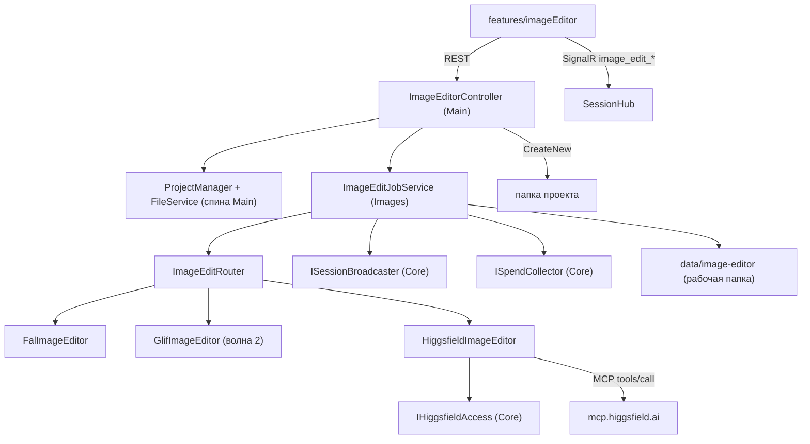

# ADR-017: Редактор картинок в проекте — архитектурный разрез

**Статус:** Черновик, редакция 2 от 2026-09-25 (предложено, код не писался)
**Дата:** 2026-09-25
**Входные артефакты:** макет [image-editor-v1.html](../mockups/image-editor-v1.html) и записка
[image-editor-proposal.md](../mockups/image-editor-proposal.md); продуктовые решения Андрея из
постановки задачи, включая дополнение от 2026-09-25 о персонаже (раздел 10) и поправку объёма
MVP от 2026-09-25: человек сам выбирает поставщика и модель, Higgsfield входит в первую волну
и доступен всем пользователям с учётом расхода per-user (разделы 2, 2а, 4, 9).
**Продолжение:** [ADR-018](ADR-018-image-editor-v2.md) — редактор v2 (2026-09-26): раздел 6
«Обсудить с Claude» заменён чатом картинки с генерацией агентом, раздел 5 дополнен «Сохранить
как…», тезис «библиотеки изображений на бэкенде нет» отменён (ImageSharp в `Images`).
**Смежные документы:** [image-generation.md](../features/image-generation.md) (драйверы и места),
[ADR-014](ADR-014-internal-subsystems.md) (правило зависимостей вертикалей),
[sandbox.md](../architecture/sandbox.md) (container-владельцы),
[mcp-registry.md](../architecture/mcp-registry.md) (встроенная интеграция Higgsfield).

## Контекст

Макет согласован: полноэкранный редактор открывается из дерева файлов проекта. В нём есть
пометки (кисть-маска, стрелка, рамка, подпись), от 1 до 4 вариантов, образцы, быстрые действия,
цена до запуска, сохранение результата новым файлом рядом с оригиналом и кнопка «Обсудить с
Claude», которая уходит в чат проекта. Всё за флагом `image-editor`, мобильная раскладка
обязательна. В MVP входит **персонаж**: сохранённый набор фото лица для серии сцен.

Что есть в коде сегодня (сверено 2026-09-25):

- Вертикаль `ClaudeHomeServer.Images` (отдельный `.csproj`): контракт `IImageGenerator`
  **только text-to-image** (`GenerateManyAsync(prompt, count, model)`), роутер
  `ImageGenerationService` с инвариантом «явно выбранного провайдера не подменяем», одно место
  `ImagePlaces.PersonaAvatar`, очередь догоняющей генерации. Отказ драйвера — пустой список,
  без причины.
- `FalImageService` синхронно зовёт `https://fal.run/{model}`, полей `image_url`/`mask_url`
  нет, загрузки в fal storage нет. `FalCostService` узнаёт цену **постфактум** по
  billing-events, прайса до запуска нет.
- Higgsfield у бэкенда есть только как MCP-прокси хода (`HiggsfieldToolset`) с инстансным
  OAuth-токеном (`HiggsfieldOAuthService.EnsureFresh()`, лежит в Main). Своего HTTP-клиента
  генерации нет. Публичного REST API под этот OAuth-токен тоже нет: у Higgsfield единственная
  дверь — MCP-эндпоинт `https://mcp.higgsfield.ai/mcp` (JSON-RPC `tools/call`). Выключатель
  интеграции один — кнопка «Отключить» у админа, после неё `EnsureFresh()` отдаёт `null`
  ([mcp-registry.md](../architecture/mcp-registry.md)).
- Учёт трат: `SpendRecord` (Core) знает `CostUsd`, `CostRub` и счётчик `Generations`; поля под
  кредиты нет. Генерации Higgsfield из чата пишутся `SpendMapping.RecordHiggsfieldGeneration`
  как `Generations = 1` без суммы. Запись идёт через `ISpendCollector` (Core), реализация —
  `SpendStore` в вертикали `ClaudeHomeServer.Spend`.
- Библиотек обработки изображений (ImageSharp, SkiaSharp, System.Drawing) в решении нет.
- Файлы проекта: `FilesController` (`api/projects/{id}/files`), `POST upload` пишет через
  `FileMode.Create`, то есть **перезаписывает** существующий файл; `SafeJoinPublic` →
  `SafePath.Join`; после записи зовётся `NotifyMutated` (синк знаний).
- Вложения чата: `POST api/chats/{id}/files/upload` кладёт файл в
  `{chatRoot}/.cc-attachments/{guid}/`, затем путь уходит в `attachedPaths` метода хаба
  `SendMessage`. Программно подставить в композер можно только **текст** (`prefillComposer`,
  `cc-compose-prefill`), вложения живут в локальном state `WorkspacePage`.
- Паттерна «фоновая задача с job id, прогрессом и отменой через SignalR» нет. Есть разовое
  уведомление `image_backfilled` через `ISessionBroadcaster.ToOwner` (шов в Core, уже
  используется вертикалью Images).

Живой каталог fal (проверено 2026-09-25 через MCP fal: `get_model_schema`, `get_pricing`):

| Endpoint | Что умеет | Цена |
|---|---|---|
| `fal-ai/nano-banana-2/edit` | правка по тексту, `image_urls[]` (несколько образцов), `num_images` 1–4, `aspect_ratio`, очередь с `cancel_url` | $0.08 / картинка |
| `fal-ai/nano-banana-pro/edit` | то же, выше качество | $0.15 / картинка |
| `fal-ai/flux-pro/kontext`, `…/kontext/max/multi` | правка с сохранением объекта, multi — несколько образцов | $0.04 / $0.08 за картинку |
| `fal-ai/flux-pro/v1/fill` | инпейнт: `image_url` + `mask_url` (размеры обязаны совпадать), 1–4 | $0.05 / мегапиксель |
| `fal-ai/bria/background/remove`, `fal-ai/birefnet/v2` | убрать фон | $0.018 / генерация; $0.0008 / с вычислений |
| `fal-ai/bria/expand` | дорисовать за края | $0.04 / генерация |
| `fal-ai/clarity-upscaler` | улучшить качество | $0.03 / мегапиксель |
| `fal-ai/gpt-image-1.5/edit`, `microsoft/mai-image-2.5-pro/edit`, `alibaba/qwen-image-3/edit` | правка, заявлено сохранение лица | единицы непрозрачные (`units`/`credits`) |

Единицы цены у fal разные: картинки, мегапиксели, секунды вычислений и непрозрачные «units».
Это важно для раздела 4.

Живой каталог Higgsfield (проверено 2026-09-25 через MCP: `models_explore`, `generate_image`
с `get_cost: true`), модели, которые принимают входную картинку:

| Модель | Что умеет | Роли `medias` | Цена (замер) |
|---|---|---|---|
| `nano_banana_2` (и `nano_banana_2_lite`) | правка по тексту, **настоящий инпейнт**: параметр `is_inpaint` | `image_references`, **`mask`** | 1.5 кредита за 2 картинки |
| `nano_banana_pro` | правка, выше качество, текст на картинке | `image_references` | — |
| `gpt_image_2_5` | правка по образцам, текст, `background: transparent` | `image_references` | 0.25 кредита за картинку (`quality: low`) |
| `flux_kontext` | правка с сохранением объекта, перенос стиля | `image_references` | — |
| `seedream_v5_pro` | правка по инструкции, `is_inpaint`, `remove_bg` | `image_references` | — |
| `flux_2_pro_outpaint`, `outpaint` | дорисовать за края (пиксели по сторонам) | `image_references` | — |
| `image_background_remover` | убрать фон | `image_references` | — |
| `topaz_image`, `bytedance_image_upscale` | улучшить качество, апскейл до 4K | `image_references` | — |
| `soul_2` | фотореалистичный персонаж по **Soul ID** (`soul_id`), вход — одна картинка | `image` ×1 | — |

Инструмента отмены задачи в каталоге нет (`generate_*`, `job_status`, `jobs_wait`,
`media_upload`/`media_confirm`, `models_explore`). `get_cost` отвечает текстом вида
«Cost preflight for nano_banana_2: 1.5 credits (1.5 exact)». Без явного `use_unlim: false`
сервер при наличии бесплатных генераций **ничего не запускает** и возвращает вопрос
`unlim_choice`.

## Решение

### 1. Разрез слоёв

**Бэкенд редактора — расширение вертикали `Images`, новой вертикали не заводим.** Всё, что
нужно редактору, у `Images` уже есть: драйверы, настройки по местам, роутер, HTTP-клиенты fal
и glif, шов `ISessionBroadcaster`. Новая вертикаль рядом дублировала бы роутер или сразу
зависела бы от `Images` напрямую, а ADR-014 это запрещает. Критерий ADR-014 «положен ли свой
проект» выполняется: потребности закрываются Core плюс одним-двумя узкими швами.

Внутри `ClaudeHomeServer.Images`, неймспейс `ClaudeHomeServer.Services.Images.Editing`
(попадает под корень `Services.Images`, поэтому таблица `Boundaries` не меняется):

| Тип | Роль |
|---|---|
| `IImageEditor` | новый контракт драйвера правки (раздел 2), рядом со старым `IImageGenerator`, старый не трогаем |
| `ImageEditRequest` / `ImageEditResult` / `ImageEditCapabilities` / `ReferenceImage` | типы контракта |
| `ImageEditCatalog` | каталог для фронта: доступные поставщики, их модели и возможности, умолчание админа (раздел 2) |
| `ImageEditRouter` | исполняет выбор человека «поставщик + модель» (или «Авто» внутри поставщика); выдаёт **котировку** (раздел 4) |
| `ImageEditPriceCatalog` | оценка цены: прайс провайдера и фолбэк курируемого каталога |
| `ImageEditJobService` | реестр задач в памяти, запуск, отмена, SignalR-события через `ISessionBroadcaster` (раздел 7) |
| `ImageEditWorkspaceStore` | временные файлы сеанса правки в `data/image-editor/{ownerId}/{editId}/` (варианты, маски), TTL |
| `EditMarksPrompt` | детерминированный перевод структурных пометок в текст запроса (раздел 3) |
| `CharacterManifest` | формат `character.json` персонажа, чтение и валидация (раздел 10) |
| `ImageEditSpend` | запись трат редактора в `ISpendCollector` per-user (раздел 4) |
| драйверы | `FalImageEditor` (на HTTP-клиентах `FalImageService`) и `HiggsfieldImageEditor` с MCP-клиентом `HiggsfieldMcpClient` (раздел 2а) — оба в волне 1; `GlifImageEditor` — волна 2 |

**В Main** (там же, где уже живут `ImageGenerationController` и `FilesController`):

- `Controllers/ImageEditorController.cs`, маршрут `api/projects/{projectId}/image-editor`.
  Контроллер в Main, потому что ему нужны спина и файловый слой: проверка владения проектом
  (`ProjectManager`), корень проекта, `FileService` (`SafePath.Join` плюс `NotifyMutated`).
  В вертикаль уходят уже **байты и абсолютный корень**, `ProjectManager` она не видит.
- Запись результата в проект — новый метод `FileService.CreateNewBinary(root, relPath, bytes)`
  с `FileMode.CreateNew` (раздел 5). Существующий `upload` не переиспользуем: он перезаписывает.
- Шов для Higgsfield (**волна 1**): `IHiggsfieldAccess` в Core,
  реализация `HiggsfieldAccessAdapter` над `HiggsfieldOAuthService` в Main. Вертикаль
  `Images` зависит только от интерфейса:

  ```csharp
  public interface IHiggsfieldAccess
  {
      string? AccessToken();   // EnsureFresh(): null — не подключён, отключён или токен не обновился
  }
  ```

  Одного метода хватает: «поставщик доступен» = `AccessToken() != null`, отдельный флаг
  `IsAvailable` врал бы между двумя вызовами. Токен берётся **на каждый запрос** к Higgsfield,
  а не один раз на задачу: задача живёт минуты, а обновление токена идёт само.
  `AdminOwnerId` через шов **не выходит** — вертикали он не нужен, а в записи трат ему не место
  (раздел 4).

**Ручки** (все `[Authorize]`, каждая проверяет флаг `image-editor` **на сервере**, владение
проектом и владельца задачи):

| Метод и путь | Что делает |
|---|---|
| `GET  …/image-editor/catalog` | доступные **сейчас** поставщики, их модели с возможностями (`caps`), единица цены, умолчание админа, лимиты (размер, число образцов) — раздел 2 |
| `POST …/image-editor/quote` | котировка по выбору человека: поставщик, модель, оценка цены с источником; ничего не тратит |
| `POST …/image-editor/jobs` | запуск по котировке (multipart: исходник, маска, размеченная копия, образцы или пути образцов из проекта, пометки JSON) → `202 { jobId }` |
| `GET  …/image-editor/jobs/{jobId}` | состояние задачи для восстановления после переподключения |
| `DELETE …/image-editor/jobs/{jobId}` | отмена |
| `GET  …/image-editor/jobs/{jobId}/variants/{n}` | байты варианта из рабочей папки |
| `POST …/image-editor/save` | сохранить вариант в проект новым файлом, по галочке — историю (раздел 5) |
| `GET/POST …/image-editor/characters` | список персонажей проекта, создание; `PUT/DELETE …/characters/{slug}` (раздел 10) |

**Фронт** — новая папка `frontend/src/features/imageEditor/`:

- `ImageEditorPage.tsx` — полноэкранный экран; вход по маршруту
  `#/project/{id}/image-editor?path=…` (или `?folder=…` для «Нарисовать картинку»). Открытый
  вопрос 1 записки закрываем так: **отдельный экран поверх воркспейса**, а не панель, потому
  что холсту на телефоне нужна вся ширина.
- `EditorCanvas.tsx` — холст на двух слоях `<canvas>`: исходник и пометки. Масштаб и
  перемещение, инструменты кисть, стрелка, рамка, подпись, ластик. Экспорт трёх артефактов —
  раздел 3.
- `PromptPanel.tsx` (запрос, «Поставщик ▾ → Модель ▾» в `ProviderModelPicker.tsx`, режим
  при модели «Авто», число вариантов, цена в единицах поставщика, быстрые действия),
  `ReferencesTray.tsx` (образцы с ролью), `CharacterPicker.tsx` / `CharacterCreateDialog.tsx`,
  `VariantsCompare.tsx` (шторка и «до/после»), `StepsHistory.tsx` (колонка на десктопе, шторка
  на телефоне), `SaveDialog.tsx`, `EditorError.tsx`, `DiscussWithClaude.tsx`.
- `useImageEditJob.ts` — подписка на события задачи и рефетч на `onReconnected`.
- Вход из файлов: пункт «Редактировать» в `FileExplorer` у растровых картинок и в
  `FileViewer`, пункт «Нарисовать картинку» у папки. Всё под `useFeature(FLAGS.imageEditor)`.
- Контролы только из `components/ui/`, цвета — токены `C.*`, гейт `npm run lint:design`.



Правило ADR-014 соблюдено: `Images` зависит от Core (`ISessionBroadcaster`,
`ISpendCollector`, новый `IHiggsfieldAccess`), Main зависит от `Images`, стрелки
`Images → Main` нет, стрелки `Images → Spend` тоже. Если подсистему
выключить (`Subsystems:images:Enabled=false`), контроллер получает `ImageEditJobService?` как
null и честно отвечает 503 с причиной (легальная форма ADR-014).

### 2. Провайдеры правки

**`IImageGenerator` не хватает** — ни входной картинки, ни маски, ни образцов, ни причины
отказа (экрану 8 нужно различать «сервис не ответил» и «не хватает кредитов»). Нужен **новый
контракт** `IImageEditor`. Старый не меняем: на нём держатся аватары и очередь.

```csharp
public interface IImageEditor
{
    string Key { get; }                              // тот же ключ, что у IImageGenerator
    bool Enabled { get; }
    ImageEditCapabilities Capabilities { get; }      // что драйвер умеет
    ImageEditModel? PickModel(ImageEditOp op, EditMode mode, EditTraits traits); // null — не умеет
    Task<ImageEditResult> RunAsync(ImageEditRequest req, IProgress<EditProgress> progress, CancellationToken ct);
    Task<bool> CancelRemoteAsync(string remoteId, CancellationToken ct); // лучшее усилие
}

enum ImageEditOp { Generate, Edit, Inpaint, Outpaint, RemoveBackground, Upscale }
enum EditMode { Auto, Fast, Precise, Photoreal }     // «Авто / Быстрая / Точная правка / Фотореализм»
record EditTraits(bool HasMask, int References, bool HasCharacter);
record ReferenceImage(byte[] Bytes, string ContentType, ReferenceRole Role, string? Label);
enum ReferenceRole { Character, Style, Object }      // раздел 10
record ImageEditRequest(ImageEditOp Op, string Prompt, ImageBytes? Source, ImageBytes? Mask,
    IReadOnlyList<ReferenceImage> References, int Count, string? AspectRatio,
    OutpaintSpec? Outpaint, string Model, CharacterRef? Character);
record ImageEditResult(EditOutcome Outcome, IReadOnlyList<GeneratedImage> Images,
    EditCost? ActualCost, bool? Charged, string? RemoteId, string? Error);
enum EditOutcome { Ok, Failed, InsufficientCredits, Rejected /* модерация */, Cancelled, Unavailable }
```

Отказ здесь — **результат с причиной, а не пустой список**. Исключение наружу летит только
при отмене снаружи, как и раньше.

Кто что может на бэкенде, без MCP хода:

| Провайдер | Правка по тексту | Маска | Образцы | 1–4 точно | Outpaint | Фон / апскейл | Цена до запуска | Итог |
|---|---|---|---|---|---|---|---|---|
| **fal** | да (`nano-banana-2/edit`, `kontext`) | да (`flux-pro/v1/fill`) | да, `image_urls[]` | да, `num_images` | да (`bria/expand`) | да | да, прайс API (`/v1/models/pricing`, тот же источник, что `get_pricing`) | **волна 1**, свой ключ fal |
| **Higgsfield** | да (`nano_banana_2`, `gpt_image_2_5`, `flux_kontext`) | **да**, роль `mask` + `is_inpaint` у `nano_banana_2` | да, `image_references` | да, `count` 1–4 | да (`flux_2_pro_outpaint`) | да (`image_background_remover`, `topaz_image`) | **да, `get_cost: true`**, точно в кредитах | **волна 1**, через шов `IHiggsfieldAccess`; платит **инстансный аккаунт админа**, учёт per-user (раздел 4) |
| **glif** | агентом, `compose_project` | нет канала | да, через загрузку файлов | нет, только просьбой в тексте | нет | агентом, без гарантий | нет | волна 2, творческие правки |

Транспорт fal для редактора — **очередь** (`queue.fal.run/{model}` → `status_url` /
`cancel_url`), а не синхронный `fal.run`: только она даёт отмену и стадии «в очереди / рисуем».
Входные картинки уходят как `data:` URI (размер ограничен лимитом ручки, по умолчанию 20 МБ на
файл) либо через загрузку в fal storage, если data URI упрётся в лимит тела запроса. Это
выясняется при реализации первой ручки.

**Поставщика и модель выбирает человек** (решение Андрея от 2026-09-25): в панели запроса два
выпадающих списка «Поставщик ▾ → Модель ▾». Настройка админа перестаёт быть единственным
вариантом и становится **значением по умолчанию**.

- **Новое место** `ImagePlaces.ImageEditor = "image-editor"` в `ImagePlaces.All`. Админ в
  «Модели и расход → Применение → Картинки» задаёт для места поставщика и модель, как для
  аватаров. Это то, что редактор предвыбирает при открытии. Значение `auto` у места означает
  «первый доступный поставщик по порядку `fal`, `higgsfield`, модель «Авто»».
- **Список поставщиков — только доступные сейчас.** Поставщик попадает в каталог, если его
  драйвер `Enabled`: у fal задан ключ, у Higgsfield `IHiggsfieldAccess.AccessToken() != null`.
  Ненастроенный или отключённый админом Higgsfield **не показывается вовсе**. Это не ошибка и
  не 500. Если умолчание админа указывает на недоступного поставщика, редактор предвыбирает
  первого доступного и ничего об этом не пишет: человек ещё ничего не выбрал и не потратил.
  Недоступны все поставщики — экран «Рисование не настроено, обратитесь к администратору»
  (админу — ссылка на настройки), кнопка запуска выключена.
- **Модель** — список моделей выбранного поставщика из его каталога плюс первый пункт
  **«Авто»**. «Авто» разворачивается в модель **внутри выбранного поставщика** через
  `IImageEditor.PickModel` по таблице «операция × режим × признаки → модель»; только при «Авто»
  показывается переключатель режима (`EditMode`: «Быстрая / Точная правка / Фотореализм»).
  При явной модели режима нет, модель исполняется как выбрана. Так закрывается открытый
  вопрос 5: у новичка «Авто» и режим, у знающего — конкретная модель.
- **Возможности (`caps`) — у модели, а не у поставщика.** Операции, которые выбранная модель
  не умеет (дорисовать за края у `nano_banana_2`, убрать фон у `flux_kontext`), UI показывает
  недоступными с подсказкой «Умеет: flux_2_pro_outpaint». Маску принимает любая модель правки:
  с каналом маски (`caps.mask = "native"`) — точно, без него (`"as-reference"`) — образцом по
  разделу 3 с подписью «Точность границ ниже». Модель, которая не проходит под текущие
  признаки (персонаж, число образцов), остаётся в списке серой, а не пропадает — иначе список
  «прыгает» при каждом действии на холсте.

**Ручка каталога** `GET …/image-editor/catalog` отдаёт одним ответом:

```json
{
  "default": { "provider": "fal", "model": "auto" },
  "providers": [
    {
      "key": "fal", "label": "fal.ai", "priceUnit": "usd",
      "models": [
        { "id": "auto", "label": "Авто", "modes": ["fast", "precise", "photoreal"] },
        { "id": "fal-ai/nano-banana-2/edit", "label": "Nano Banana 2",
          "caps": { "ops": ["generate", "edit"], "mask": "as-reference", "maxReferences": 3,
                    "maxCount": 4, "faceByReferences": true },
          "priceHint": { "amount": 0.08, "unit": "usd", "per": "image" } }
      ]
    },
    { "key": "higgsfield", "label": "Higgsfield", "priceUnit": "credits", "models": [ … ] }
  ],
  "limits": { "maxFileMb": 20, "maxReferences": 6 }
}
```

Каталог собирает `ImageEditCatalog` из **курируемого** списка моделей каждого драйвера (не из
сырого `models_explore` / fal-поиска): в редактор попадают только модели, которые драйвер умеет
вызвать с нашими ролями образцов и маской, и для каждой в коде записаны `caps`. Живой каталог
поставщика используется только для сверки. Модель пропала у поставщика — она пропадает из
нашего каталога (кеш сверки на 1 час), а не падает на запуске. Фронт берёт каталог при
открытии редактора и на `onReconnected`; админ отключил Higgsfield посреди сеанса — следующая
котировка отвечает `409 provider_unavailable`, фронт перечитывает каталог.

**Инвариант «явно выбранного провайдера не подменяем» сохраняется и становится проще:** теперь
«явно выбранный» — это выбор **человека** в двух списках, и его не подменяет никто, ни
админская настройка, ни роутер. «Авто» в списке моделей переключает модель только **внутри**
выбранного поставщика; перехода между поставщиками без клика человека нет нигде, даже когда
умолчание админа было `auto`. Отличие от аватаров: **тихого фолбэка на соседа с деньгами нет**,
потому что цена уже показана человеку и привязана к котировке (раздел 4). Если поставщик
отказал, сервер возвращает отказ и, если есть другой доступный поставщик с подходящей моделью,
**новую котировку** соседа, а UI предлагает «Повторить через Higgsfield ≈ 1.5 кредита» одним
кликом. Клик меняет выбор в списках — человек видит, куда ушёл.

### 2а. Драйвер Higgsfield на бэкенде

**Транспорт — MCP, но свой клиент бэкенда, а не MCP хода.** REST API под наш OAuth-токен у
Higgsfield нет, а MCP-эндпоинт `mcp.higgsfield.ai/mcp` и есть их API: JSON-RPC `tools/call`
по HTTP с `Authorization: Bearer {токен}`. `HiggsfieldMcpClient` в вертикали `Images` —
тонкий JSON-RPC-клиент (`initialize` не нужен: сервер отвечает без `Mcp-Session-Id`, это уже
держит сторож в `HiggsfieldToolsetTests`). Прокси хода `HiggsfieldToolset` не переиспользуем:
он привязан к сессии чата и белому списку хода, а редактору нужен вызов без чата. Общее у них
только имя тихого HTTP-клиента (`AddQuietHttpClient`) и токен через шов.

Цепочка одной задачи:

1. **Токен** — `IHiggsfieldAccess.AccessToken()` перед каждым вызовом. `null` → `Outcome =
   Unavailable`, текст «Higgsfield отключён администратором».
2. **Загрузка входов** — `media_upload` (presigned URL на каждый файл) → `PUT` байтов →
   `media_confirm` → `media_id`. Исходник, маска, размеченная копия и образцы грузятся
   параллельно, не больше 4 одновременно.
3. **Котировка** — `generate_image` с теми же параметрами плюс `get_cost: true`: задача не
   создаётся, ответ — точная сумма в кредитах. Разбор ответа — `structuredContent`, если есть,
   иначе текст по шаблону `(\d+(\.\d+)?) credits`. Не разобрался — котировка `approx` с
   `source: "unknown"` и текстом «цена станет известна после запуска», а не 500.
4. **Запуск** — `generate_image { model, prompt, medias: [{ role, value }], count, aspect_ratio,
   …параметры модели, use_unlim: false }`. **`use_unlim: false` всегда явно**: без него сервер
   при наличии бесплатных генераций ничего не запускает и возвращает вопрос `unlim_choice`, а
   задавать этот вопрос в редакторе некому. Бесплатные генерации админа редактор не тратит.
   Ответ — id заданий (по одному на вариант).
5. **Опрос** — `jobs_wait { jobs, timeout_seconds: 15 }` в цикле до терминального статуса,
   общий потолок задачи 6 минут. Стадии `queued / running` уходят в `image_edit_progress`.
6. **Результат** — URL картинок из ответа скачиваются **бэкендом** в рабочую папку сеанса,
   наружу ссылки Higgsfield не уходят (раздел 8).
7. **Отмена** — инструмента отмены у Higgsfield нет. `CancelRemoteAsync` возвращает `false`,
   опрос прекращается, задача становится `Cancelled` с `Charged = null`: «Списание
   уточняется у сервиса». Кредиты за отменённую задачу, скорее всего, списаны — запись трат
   делается по котировке (раздел 4).

Ошибки JSON-RPC и `isError: true` маппятся в `EditOutcome`: нехватка кредитов →
`InsufficientCredits`, модерация → `Rejected`, 401 после обновления токена и сетевые сбои →
`Unavailable`, неизвестная модель → `Failed` плюс сброс кеша каталога. Тексты у Higgsfield —
свободные строки, поэтому классификатор проверяется на **сохранённых образцах ответов**
(фикстуры в тестах), как `TurnErrorClassifier`.

**Модели Higgsfield для редактора** (курируемый список волны 1, `PickModel` для «Авто»):

| Операция / признак | «Авто» и режимы | Ещё в списке «Модель» |
|---|---|---|
| правка по тексту | `nano_banana_2` («Быстрая»), `gpt_image_2_5` («Точная правка», текст на картинке), `nano_banana_pro` («Фотореализм») | `flux_kontext`, `seedream_v5_pro` |
| маска (инпейнт) | `nano_banana_2` с ролью `mask` и `is_inpaint: true` — настоящий канал маски, не образец | `nano_banana_2_lite` |
| персонаж (лицо по образцам) | `nano_banana_2` / `nano_banana_pro` с 3 фото в `image_references` | `gpt_image_2_5` |
| маска **и** персонаж | `nano_banana_2`: маска ролью `mask`, фото ролью `image_references` — точнее, чем у fal (раздел 10) | — |
| дорисовать за края | `flux_2_pro_outpaint` (поля в пикселях по сторонам) | `outpaint` |
| убрать фон | `image_background_remover` | `gpt_image_2_5` с `background: transparent` |
| улучшить качество | `topaz_image` | `bytedance_image_upscale` |
| новая картинка без исходника | `nano_banana_2` | `gpt_image_2_5`, `nano_banana_pro` |

`soul_2` с `soul_id` в волну 1 не входит: без обученного Soul ID модель принимает одну
картинку и лицо по серии не держит. Она появится вместе с Soul ID (волна 2).

### 3. Пометки → модель

**Рекомендация — гибрид, и решается он на фронте.** Исходник всегда уходит **чистым**, пометки
на него не запекаются: иначе штрихи и стрелки просачиваются в результат.

| Пометка | Канал в модель |
|---|---|
| кисть-маска | **отдельная маска**: бинарный PNG ровно в размер исходника (белое — менять). Операция становится `Inpaint`, модель — с каналом маски (`mask_url` у fal `flux-pro/v1/fill`, роль `mask` у Higgsfield `nano_banana_2`). Для моделей без маски (nano-banana, kontext) маска идёт **дополнительным образцом**, а в запрос добавляется фраза «менять только область, отмеченную на второй картинке» |
| стрелка, рамка, подпись | **запечённая копия** (annotation-to-edit): исходник с нарисованными пометками уходит дополнительным образцом, плюс **текст из структуры**: «рамка в правой верхней четверти (x 62–88 %, y 10–35 %): сюда лампу» |
| ластик, «Очистить пометки» | чисто фронтовые |

Фронт экспортирует из холста четыре артефакта: `source` (исходные байты без перекодирования),
`mask.png`, `annotated.png` и `marks.json` (тип, координаты в долях 0…1, текст подписи).
Растровая работа идёт на фронте, потому что там уже есть `<canvas>`, а на бэкенде нет ни одной
библиотеки изображений, и заводить её ради этого не нужно. Бэкенд:

- `EditMarksPrompt` переводит `marks.json` в текст запроса детерминированно. Это чистая
  функция, её легко покрыть тестами;
- проверяет, что маска PNG и её размеры совпадают с исходником. Для этого читается заголовок
  IHDR, без библиотеки; у JPEG/WebP размеры берутся из маркеров SOF/VP8. Не совпало — 400;
- выбирает операцию: маска есть → `Inpaint`, иначе `Edit`.

Размеченная копия — тот же `annotated.png`, который уходит и в «Обсудить с Claude» (раздел 6):
Claude читает картинку глазами, модели правки получают её как образец.

### 4. Цена до запуска

**Котировка — отдельный шаг**: `POST …/quote` по выбору человека (поставщик, модель или «Авто» с
режимом) и параметрам (операция, число вариантов, маска, число образцов, размер исходника)
возвращает
`{ quoteId, provider, model, estimate: { amount, unit, approx, source }, expiresAt }`.
`POST …/jobs` принимает `quoteId` и исполняет **ровно эту пару провайдер-модель**. Котировка
живёт 10 минут в памяти, фронт пересчитывает её с дебаунсом при смене числа вариантов или
режима.

Откуда берётся оценка, по убыванию точности:

1. **Higgsfield — `get_cost: true`** (препроверка без запуска), точно в кредитах. `source: "provider"`.
   Препроверке нужны загруженные `media_id`, поэтому котировка Higgsfield дороже по времени:
   входы грузятся один раз на котировку, `media_id` кешируются в рабочей папке сеанса по хешу
   байтов и переиспользуются запуском. Дебаунс пересчёта у Higgsfield — 800 мс, у fal — 300.
2. **fal — прайс API** по endpoint_id с кешем на 24 часа. Единицу пересчитываем честно:
   `images` × число вариантов, `megapixels` × размер результата, `generations` × 1. Для
   `compute seconds` и непрозрачных `units`/`credits` точной формулы нет — берём **p50 из
   собственных фактических списаний** (`FalCostService` уже достаёт их из billing-events), а
   без истории показываем «цена станет известна после запуска». `source: "catalog"` или `"history"`.
3. **glif** — препроверки нет: «≈ по прошлым запускам» либо «цена станет известна после
   запуска». Кнопка при этом остаётся доступной.

**Единица показывается провайдерская, своей валюты AI Home нет** (решение Андрея): у fal
«≈ $0.24 · 3 варианта», у Higgsfield «≈ 1.5 кредита Higgsfield · 2 варианта». Пересчёта
кредитов в доллары нет: курс пришлось бы выдумывать. Единица едет в котировке (`unit:
"usd" | "credits"`) и в каталоге (`priceUnit`), фронт её не угадывает.

Факт после запуска: у fal — догоняющим `FalCostService` по `request_id`, у Higgsfield —
сумма котировки (`get_cost` точен, а поля фактической цены в ответе `jobs_wait` нет; если
при реализации оно найдётся — берём его). Показываем «Списано $0.26» или «Списано
1.5 кредита» у вариантов, расхождение с оценкой отдельно не подсвечиваем. Строку «Кредиты
не списаны» на экране ошибки показываем **только** при `Charged == false`: у fal неуспешный
запрос не тарифицируется, у Higgsfield после отмены и у glif это неизвестно, и тогда строка
звучит «Списание уточняется у сервиса».

**Учёт трат per-user при общем ключе админа.** Higgsfield в редакторе доступен **всем**
пользователям (решение Андрея), кредиты списываются с инстансного аккаунта админа, поэтому
каждая трата обязана лечь в учёт **на того, кто нажал кнопку**:

- Расход редактора **впервые записываем в `SpendStore`** через существующий шов
  `ISpendCollector` (Core) — нового шва не нужно. Пишет `ImageEditSpend` в вертикали
  `Images`: `OwnerId` = владелец задачи (кто запустил), **никогда не `AdminOwnerId`**
  аккаунта Higgsfield; `ProjectId` = проект редактора; `Provider`/`Source` = `fal` или
  `higgsfield`; `Model` = модель; `Label = "image-editor"`; `Generations` = число вариантов.
- **Кредиты — новое поле `SpendRecord.CostCredits` (double?)** и `DailySpendRow.CostCredits`,
  по образцу `CostRub`: отдельная валюта, ни с долларами, ни с рублями не складывается нигде.
  Сейчас генерации Higgsfield из чата пишутся без суммы, их запись не меняем (суммы там нет).
  Формат новый, но совместимый (поле nullable, старые строки читаются), `BackupSchema.Version`
  не трогаем.
- **Момент записи — принятие задачи поставщиком**, а не её успех: именно тогда уходят кредиты
  админа. У Higgsfield — по сумме котировки при получении id заданий; у fal — оценкой при
  принятии очереди, факт по `request_id` догоняет `FalCostService` компенсирующей записью на
разницу. Отмена и сбой
  после принятия запись **не отменяют**. Если при реализации найдётся признак возврата кредитов
  у Higgsfield — пишем компенсирующую запись с отрицательной суммой: журнал только
  дописывается, суммы за период остаются верными.
- **Задел под лимиты:** будущий лимит — это сумма `CostCredits` по `OwnerId` и `Source =
  higgsfield` за период, её даёт `SpendStore` уже сейчас. Место проверки тоже готово: котировка.
  Лимит вернёт там отказ до загрузки и запуска. Само ограничение в волну 1 не входит.

**Что видно человеку в «Списано».** В редакторе — цена у каждого набора вариантов. В «Модели и
расход» — свои траты редактора отдельной строкой источника, у Higgsfield в кредитах. Админ там
же видит разбивку по пользователям (существующий разрез `OwnerId`) — отсюда он узнаёт, кто
расходует его кредиты. **Баланс аккаунта админа не-админу не показываем**: на экране ошибки
при нехватке кредитов у Higgsfield не-админ видит «У Higgsfield закончились кредиты. Сообщите
администратору», админ — ссылку на пополнение (и остаток, если Higgsfield отдаёт его в тексте
отказа; отдельного инструмента баланса в их каталоге нет). Остаток fal — из `FalAccountService`,
волна 2.

### 5. Сохранение в проект и история

**Оригинал не затирается по построению.** У ручки `save` **нет флага перезаписи вообще**, а
запись идёт через `FileService.CreateNewBinary` с `FileMode.CreateNew`: гонка двух
сохранений даёт `IOException` и следующий номер, а не перезапись.

Имена:

- правка `images/hero.png` → `images/hero.v2.png`. Суффикс `.vN` снимается перед подбором
  номера: `hero.v2.png` → `hero.v3.png`, а не `hero.v2.v2.png`. N = первый свободный начиная с 2;
- «Нарисовать картинку» → `{папка}/{имя из диалога}.png`, занято → `-2`, `-3`;
- расширение берётся **по фактическому content-type результата**: был `.jpg`, пришёл PNG →
  `hero.v2.png`, в диалоге это видно. Вектор (SVG) редактор не открывает, пункт
  «Редактировать» у `.svg` не показываем;
- имя из диалога проходит `Path.GetFileName`, затем `SafePath.Join`. Папка выбирается
  только внутри проекта;
- код, который ссылается на `hero.png`, **не трогаем никогда** (открытый вопрос 2).

**История правок** (галочка, по умолчанию выключена) — папка-спутник рядом с результатом:

```
images/hero.v2.history/
  history.json          # манифест, FormatVersion = 1
  step-0-original.png   # копия исходника на момент правки
  step-1.png            # только ПРИМЕНЁННЫЕ шаги, не все варианты
  step-1.mask.png       # маска шага, если была
```

`history.json`: `{ formatVersion, source, createdAt, steps: [{ index, parent, prompt, op, mode,
provider, model, marks, maskFile, references: [{ path|embedded, role }], characterSlug?,
variantsCount, chosenVariant, cost, createdAt }] }`. Непримененные варианты не храним —
это ответ на открытый вопрос 3: история нужна, чтобы повторить путь, а не как архив всех
попыток. Образцы из проекта хранятся ссылкой по пути, загруженные с компьютера — копией.

- **Container-владельцы:** бэкенд пишет только по хостовым путям (корень проекта лежит под
  `Sandbox:ProjectsRoot`), `IPathMapper` здесь не участвует. Права на файл — те же, что у
  существующего `upload`, нового поведения нет.
- **Бэкап:** файлы проекта в архив `data/` не входят, для них ничего не меняется. Новое
  хранилище `data/image-editor/` (рабочая папка сеансов) **исключаем из бэкапа** в
  `BackupPaths` — это кеш на 7 дней, а весить он может гигабайты. `BackupSchema.Version` не
  трогаем.
- **Git-шум:** `.gitignore` проекта не правим сами. В диалоге сохранения, если проект —
  git-репозиторий, рядом с галочкой истории пишем «Папка истории попадёт в git проекта».
- **Синк знаний (Dify):** `NotifyMutated` зовём, как любая запись. `*.history/` добавляем в
  исключения синка знаний: JSON манифеста в базе знаний — мусор.
- **Незаконченная правка** (человек ушёл до «Применить», открытый вопрос 8): шаги и варианты
  живут в рабочей папке `data/image-editor/{ownerId}/{editId}/` вместе с `session.json`.
  При повторном открытии того же файла редактор предлагает «Продолжить правку». TTL 7 дней,
  чистка — тик `ImageEditJobService`.

### 6. «Обсудить с Claude»

> **Заменено [ADR-018 §1](ADR-018-image-editor-v2.md)** (чат картинки): кнопка «Обсудить с
> Claude» и блок `image-prompt` убраны. Раздел оставлен как история решения.

**Новой серверной механики не нужно, всё собирается из существующих вложений:**

1. Чат — **новый чат проекта** «Картинка: hero.png». Внутри одного сеанса редактора он
   переиспользуется: его `sessionId` лежит в `session.json`. В текущий открытый чат не пишем,
   он может быть занят чужой работой (открытый вопрос 6).
2. `annotated.png` загружается через `POST api/chats/{id}/files/upload` и оказывается в
   `.cc-attachments/{guid}/` в корне проекта. Исходник уже лежит в проекте, его путь идёт
   вторым вложением. Персонаж, если подключён, уходит путём к папке.
3. `SendMessage(sessionId, text, attachedPaths)`. Текст собирает фронт по шаблону: запрос
   человека, пометки словами (та же `marks.json` → текст, что и в разделе 3, фронт-копия с
   общим тест-вектором) и просьба **вернуть предложенный запрос отдельным блоком
   ```` ```image-prompt ````**. Claude работает в корне проекта со всеми материалами, это и
   закрывает «Claude видит материалы проекта» для пути обсуждения.
4. Ответ в редакторе: `DiscussWithClaude` подписывается на поток этого чата тем же способом,
   что `ChatPanel` (`onMessage` / `joinSession`), показывает текст и достаёт блок
   `image-prompt` **существующим разбором заборов рендера чата**, второго парсера не заводим.
   «Подставить в запрос» кладёт текст блока в поле, «Открыть чат» ведёт на чат.
5. Обратный путь «чат → редактор» (волна 2): рендер сообщений узнаёт блок `image-prompt` и
   рисует кнопку «Подставить в редактор», передача — через `sessionStorage`
   (`cc_pending_image_edit`, по образцу `cc_pending_chat_prompt`). Кнопка «Добавить about.jpg
   образцом» — то же самое для путей файлов из ответа.

**Прямая генерация тоже должна учитывать проект** (подсказка под полем запроса это обещает).
Модели fal и glif проект не видят, поэтому нужен шаг **обогащения запроса**:

- MVP — дешёвый one-shot через существующий `ICheapTextRunner` (место `image-prompt` в
  `LocalActionRouter`, исполнителя выбирает админ). На вход — связка контекста, которую
  собирает контроллер: имя проекта, выдержка `CLAUDE.md`/`README` (до 8 КБ), список картинок
  той же папки, `marks.json`, запрос. На выходе — английский запрос для модели. Инструментов у
  этого прогона нет, это осознанный компромисс;
- волна 2 — агентное обогащение с чтением файлов проекта (read-only прогон CLI в корне
  проекта) и выбором образцов из проекта.

Развилка закрыта решением Андрея: подсказка под полем запроса в волне 1 звучит **«Claude
учитывает описание проекта»** — ровно то, что делает MVP-обогащение (описание, `CLAUDE.md`,
`README`). Обещание «материалов проекта» вернётся в текст вместе с агентным обогащением
(волна 2). Обогащение одинаково для обоих поставщиков: оно стоит до драйвера.

### 7. Долгие задачи генерации

**Асинхронная задача плюс SignalR-события, а не синхронный запрос.** Генерация занимает от 10
до 40 с у fal (p50/p90 у nano-banana-2/edit — 12 / 22 с без очереди), у Higgsfield по их
подсказке 10–20 с на картинку плюс загрузка входов, и до 360 с у glif.
Синхронный запрос на мобильной сети рвётся, а обрыв без `timeoutMs` уводит фронт в офлайн
(`lib/offline.ts`).

- `POST jobs` → `202 { jobId }`. `ImageEditJobService` запускает `Task` со связанным
  `CancellationTokenSource`, регистрирует его в реестре и гасит на остановке хоста.
- События в группу владельца через `ISessionBroadcaster.ToOwner`: `image_edit_progress
  { jobId, stage: queued|running|downloading, queuePosition? }`, `image_edit_completed { jobId,
  variants: [n…], cost? }`, `image_edit_failed { jobId, outcome, charged?, error, retryQuote? }`.
  Типы — record'ы в `Core/Protocol/ServerMessage.cs`.
- **Процентов у провайдеров нет** (fal отдаёт только `IN_QUEUE` / `IN_PROGRESS` / позицию в
  очереди, Higgsfield — статус задания в `jobs_wait`). Проценты в макете рисуем **на фронте от ожидаемой длительности** модели, которую
  отдаёт котировка, и честно подписываем стадию («в очереди: 3»).
- Потерянное событие догоняется `GET jobs/{id}` на `onReconnected` и при монтировании.
- Отмена: `DELETE jobs/{id}` → токен → `CancelRemoteAsync` (у fal `cancel_url`, у Higgsfield и
  glif отмены нет, опрос просто прекращается) → `Cancelled`, поле `charged` честное. У
  Higgsfield кнопка отмены подписана «Остановить ожидание»: работу у поставщика она не
  останавливает, и кредиты, скорее всего, уже списаны.
- Потолки: не больше 2 задач на владельца и 4 на инстанс. Задачи Higgsfield всех
  пользователей идут в **один** аккаунт админа, поэтому потолок инстанса для них общий и
  отдельно не повышается. Сверх потолка — `429` с текстом, а
  не очередь: человек смотрит на экран и ждёт.
- Рестарт бэкенда: реестр в памяти теряется. `GET jobs/{id}` отвечает `410 { outcome:
  "interrupted" }`, уже скачанные варианты остаются в рабочей папке. Персистентную очередь (по
  образцу `ImageBackfillStore`) не заводим до реальной потребности.
- Ушёл из редактора: задача доживает, варианты лягут в рабочую папку. Уведомление «Варианты
  готовы» — волна 2 через `INotificationSender`.

### 8. Инварианты под угрозой и сторожа

| Инвариант | Угроза | Сторож / тест |
|---|---|---|
| Оригинал не перезаписывается | переиспользовать `upload` с `FileMode.Create`; флаг overwrite | тест: `save` при занятом `hero.v2.png` даёт `hero.v3.png`, байты оригинала и v2 не изменились; мутацией проверить, что `CreateNew` → `Create` краснеет |
| Path traversal | имя из диалога, путь образца из проекта, папка сохранения | тесты `../`, абсолютного пути, symlink наружу — на `save`, `jobs` (образцы по пути) и `characters` |
| Изоляция владельцев | чужой `jobId`, `quoteId`, `editId`, чужой проект | каждая ручка сверяет владельца задачи и проекта; тест «чужой jobId → 404» |
| Выбор человека не подменяется | фолбэк роутера редактора; умолчание админа поверх выбора | юнит `ImageEditRouter`: человек выбрал fal, fal отказал → отказ с `retryQuote` Higgsfield, драйвер Higgsfield **не вызван**; «Авто» выбирает модель только внутри выбранного поставщика; котировка с поставщиком, отличным от выбранного в запросе, невозможна |
| Нет тихих трат | фолбэк с другой ценой | тест: исполнение только по `quoteId`; отказ возвращает `retryQuote`, а не второй вызов |
| Траты Higgsfield пишутся на того, кто запустил | запись на `AdminOwnerId` аккаунта или на `""`; пропуск записи при отмене | тест: пользователь B запускает Higgsfield → одна запись `OwnerId = B`, `CostCredits` = котировка; отмена после принятия запись не убирает; `AdminOwnerId` не доступен вертикали по построению (шов его не отдаёт) |
| Изоляция трат между владельцами | сводка «Списано» и ручка задачи показывают чужие траты | тест: траты A не видны в сводке B; `GET jobs/{id}` чужой задачи → 404 без суммы |
| Валюты не складываются | кредиты попадают в `CostUsd` или суммируются с ним | тест `SpendStore`: запись с `CostCredits` не меняет `CostUsd`/`CostRub` в дневном агрегате; мутация «сложить в `CostUsd`» краснеет |
| Ненастроенный поставщик скрыт, а не 500 | `EnsureFresh() == null`, отключение админом посреди сеанса | тест: `AccessToken() == null` → Higgsfield нет в `catalog`; `quote`/`jobs` с `provider = higgsfield` → `409 provider_unavailable`, а не 500; нет ни одного доступного поставщика → `catalog` с пустым списком и 200 |
| Бесплатные генерации админа не тратятся | `generate_image` без `use_unlim` | тест на сериализацию запроса драйвера: `use_unlim: false` присутствует всегда; ответ `unlim_choice` маппится в `Failed`, а не в зависание |
| Разбор ответов Higgsfield устойчив | свободный текст `get_cost` и ошибок меняется у поставщика | фикстуры реальных ответов; неразобранная цена → `source: "unknown"`, неразобранная ошибка → `Failed` с текстом, не исключение |
| Флаг гейтит сервер | ручки открыты при выключенном флаге | тест: флаг выключен → 404 на всех ручках |
| Граница вертикалей | `Images` тянется к `HiggsfieldOAuthService`/`HiggsfieldToolset`/`ProjectManager`/`SpendStore` | существующие `SubsystemBoundaryTests` и IL-скан ловят сами, новых записей не требуется; швы `IHiggsfieldAccess` и `ISpendCollector` в Core |
| Отключаемость подсистемы | обязательный параметр от `Images` в контроллере Main | nullable-параметр + 503; тест с выключенной `images` |
| Старый контракт `IImageGenerator` | правка сигнатуры ради редактора | не трогаем; существующие тесты аватаров остаются зелёными |
| Маска совпадает с исходником | модель отвечает 422 после списания или криво | валидация IHDR/SOF на входе, тест на несовпадение → 400 |
| Бэкап не раздувается | `data/image-editor/` попадает в архив | тест на `BackupPaths.ShouldInclude` |
| Секреты не уходят на фронт | ключ fal в ссылке на вариант, токен Higgsfield в логе или ответе | варианты отдаются только своей ручкой из рабочей папки, внешние URL провайдера наружу не отдаются; `HiggsfieldMcpClient` логирует через тихий клиент без заголовков |
| Разбор заборов один | второй парсер ```` ``` ```` на фронте | ревью; блок `image-prompt` разбирает существующий код рендера |
| `tools/list` не зависит от хода | соблазн добавить MCP-инструмент «открыть редактор» | в этом ADR MCP-инструментов нет; если появятся — `McpToolsetStabilityTests` |
| Приватность лиц | фото персонажа уходит провайдеру и в чат | раздел 10 |
| Дизайн-система и мобила | самодельные контролы холста | `npm run lint:design`, прогон `designer` по согласию |

### 9. Разбивка на волны

**Волна 1 — MVP** (поставщики fal и Higgsfield, выбор человеком):

| Слой | Что входит | Объём |
|---|---|---|
| Images (бэк), общее | `IImageEditor` и типы, `ImageEditCatalog` (курируемые модели с `caps`, сверка с живым каталогом), `ImageEditRouter` (выбор человека, «Авто» внутри поставщика, `retryQuote`) + котировка + `ImageEditPriceCatalog`, `ImageEditJobService` + рабочая папка + TTL, `EditMarksPrompt`, `CharacterManifest`, `ImageEditSpend`, место `image-editor` | ~1 500–1 800 строк + ~800 строк тестов, 4–5 дней |
| Images (бэк), fal | `FalImageEditor`: очередь, edit / fill / expand / bg-remove / upscale, образцы с ролями, прайс с кешем | ~500–600 строк + ~250 строк тестов, 1,5 дня |
| Images (бэк), Higgsfield | `HiggsfieldMcpClient` (JSON-RPC, загрузка `media_upload`/`media_confirm`, `get_cost`, `generate_image`, опрос `jobs_wait`, скачивание), `HiggsfieldImageEditor` (курируемые модели, роли `image_references`/`mask`, классификатор отказов на фикстурах) | ~700–900 строк + ~400 строк тестов, 2,5–3 дня |
| Core + Spend | шов `IHiggsfieldAccess`, поле `CostCredits` в `SpendRecord` и `DailySpendRow`, свёртка и аналитика по нему | ~150–200 строк + ~150 строк тестов, 0,5–1 день |
| Main (бэк) | `ImageEditorController` (в том числе `catalog`, `409 provider_unavailable`), `HiggsfieldAccessAdapter`, `FileService.CreateNewBinary`, персонажи (CRUD папки), флаг `image-editor`, обогащение запроса через `ICheapTextRunner`, исключение из бэкапа, события в `ServerMessage` | ~800–1 000 строк + ~550 строк тестов, 3–3,5 дня |
| Фронт | экран редактора, холст с пометками и экспортом, панель запроса с «Поставщик ▾ → Модель ▾» и `caps` по модели, цена в единицах поставщика, образцы с ролями, персонажи, генерация с отменой («Остановить ожидание» у Higgsfield), сравнение, шаги в сеансе, сохранение, ошибки (в том числе «сообщите администратору»), входы из файлов, мобильная раскладка, «Обсудить с Claude», строка источника «Редактор картинок» в «Модели и расход» | ~3 300–3 900 строк, 8–9 дней |
| Доки | `docs/features/image-editor.md`, правки `image-generation.md` (пути устарели после выноса в `ClaudeHomeServer.Images`, второе правило фолбэка), выжимка в CLAUDE.md | 0,5 дня |

Итого волна 1: ~7 000–8 400 строк кода и ~2 150 строк тестов, **20–24 рабочих дня** одного
исполнителя. До поправки было ~5 500–6 600 строк и 16–17 дней: Higgsfield добавил около 4 дней
бэкенда (клиент, драйвер, учёт кредитов) и день фронта (выбор поставщика и модели). Бэк и
фронт идут параллельно после того, как зафиксированы контракты `catalog`/`quote`/`jobs`,
поэтому по календарю это ~2 недели на двоих.

**Волна 2:** история правок в проект (галочка, `history.json`), продолжение незаконченной
правки, драйвер glif, **Soul ID** для персонажа (`soul_2` + `soul_id`, обучение у Higgsfield),
лимиты трат Higgsfield per-user (формат учёта уже позволяет, раздел 4), агентное обогащение
запроса по файлам проекта и возврат подсказки «Claude учитывает материалы проекта», путь
«чат → редактор» (кнопки в ленте), баланс fal на экране ошибки, уведомление «Варианты готовы»,
полноэкранный режим пометок на телефоне (открытый вопрос 9).

Волна 1 отдаёт главный сценарий (поправить → варианты → сохранить `v2`) у двух поставщиков на
выбор и персонажа по фото. Волна 2 добавляет третьего поставщика, Soul ID, лимиты и связность
с чатом.

### 10. Персонажи

**Персонаж — папка в проекте**, а не запись в `data/`: он принадлежит проекту, виден в дереве
файлов, переносится вместе с проектом и доступен Claude в чате. Формат:

```
characters/<slug>/
  character.json
  face-01.jpg … face-10.jpg     # 3–10 фото, как загружены (без перекодирования)
```

```json
{
  "formatVersion": 1,
  "name": "Аня",
  "slug": "anya",
  "description": "девушка 25 лет, каре, веснушки",
  "photos": [
    { "file": "face-01.jpg", "primary": true, "angle": "front" },
    { "file": "face-02.jpg", "angle": "three-quarter" }
  ],
  "createdAt": "2026-09-25T12:00:00Z",
  "providers": {}
}
```

- `slug` — латиница из имени, коллизия → `-2`. Путь всегда через `SafePath.Join`.
- **Задел под Soul ID без переделки формата — словарь `providers`**, ключ — провайдер:
  `"higgsfield": { "soulId": "…", "status": "training|ready|failed", "trainedAt": "…",
  "photosHash": "sha256 набора" }`. В волне 1 словарь пуст, читатель обязан **игнорировать
  незнакомые ключи**. `photosHash` показывает, что набор фото поменялся после обучения, и
  тогда UI предлагает переобучить. Soul ID привязан к аккаунту Higgsfield, поэтому это
  привязка «персонаж ↔ провайдер», а не свойство фото. Словарь по провайдерам ровно это и
  выражает. `formatVersion` поднимаем только при ломающем изменении.
- Создание из редактора: «Персонаж → Создать», 3–10 фото (с компьютера или из проекта), имя.
  Запись идёт через `CreateNew`, существующую папку не перетираем. Подключение одним кликом:
  персонаж попадает в образцы с ролью `Character`, в запрос добавляется `description`.

**Роли образцов** — `ReferenceRole { Character, Style, Object }`, и роль уходит в модель
**явно**, двумя способами сразу:

1. порядок и подписи в запросе: `EditMarksPrompt` собирает «Image 1 — исходник. Images 2–4 —
   один и тот же человек (Аня): сохранить лицо и черты. Image 5 — образец стиля: взять палитру
   и манеру, не содержание. Image 6 — предмет: перенести этот объект». Для nano-banana и
   kontext это штатный способ адресовать образцы;
2. у провайдеров с ролями медиа (Higgsfield `medias[].role`, волна 1) роль маппится на их
   роль: исходник, персонаж, стиль и предмет — `image_references` в том же порядке, что и
   подписи в запросе, маска — `mask`. При `soulId` (волна 2) лицо идёт через него, а не
   через фото.

Сколько фото персонажа отправлять: у `nano-banana-2/edit` лимит `image_urls` в схеме не
указан. По умолчанию шлём **до 3 фото** (primary и два ракурса), чтобы оставить место
исходнику и другим образцам. Точный лимит проверяется при реализации драйвера и
записывается в `Capabilities.MaxReferences`.

**Выбор модели при персонаже.** `EditTraits.HasCharacter = true` сужает `PickModel` до
моделей, **держащих лицо по нескольким образцам** — внутри поставщика, которого выбрал
человек (проверено 2026-09-25):

- fal: `fal-ai/nano-banana-2/edit` — дефолт «Авто» с персонажем: несколько образцов, 1–4
  варианта, $0.08; `fal-ai/nano-banana-pro/edit` — «Фотореализм», $0.15;
  `fal-ai/flux-pro/kontext/max/multi` — «Точная правка», $0.08;
- Higgsfield: `nano_banana_2` — дефолт «Авто» с персонажем; `nano_banana_pro` —
  «Фотореализм»; `gpt_image_2_5` — «Точная правка» и текст на картинке (раздел 2а).

**`gpt_image_2_5` — модель Higgsfield**, она не из fal; с драйвером Higgsfield она входит в
волну 1. У fal есть `gpt-image-1.5/edit`, но цена в непрозрачных units не даёт честной
котировки, поэтому в fal-каталог редактора её не берём.

**Маска вместе с персонажем** у поставщиков разная, и это видно в UI. У fal
`flux-pro/v1/fill` лица по образцам не держит, поэтому при маске и персонаже fal идёт на
nano-banana с маской как образцом (раздел 3), а UI честно подписывает «Точность границ ниже».
У Higgsfield `nano_banana_2` принимает маску отдельной ролью `mask` рядом с фото персонажа, и
подписи не нужно. Роутер это не выравнивает и поставщика сам не меняет (раздел 2); подсказка
«У Higgsfield маска с персонажем точнее» — только текст рядом со списком поставщиков.

**Риски персонажа:**

- **Биометрия в чужих руках.** Фото лица уходят выбранному поставщику (fal или Higgsfield) при
  каждой генерации, в чат Claude — при «Обсудить», а при Soul ID (волна 2) — на обучение у
  Higgsfield. **У Higgsfield это аккаунт админа:** загруженные фото и результаты всех
  пользователей лежат в одной его истории генераций и видны админу там. Поэтому однократная
  плашка при создании персонажа обязательна, текст зафиксирован в «Решениях» ниже.
- **Бэкап.** Папка персонажа — часть проекта, в архив `data/` она не входит. Но бэкап самого
  проекта (git, облако человека) унесёт лица туда же. В `data/` персонажей **не храним**
  намеренно: облачный архив инстанса не должен собирать лица всех владельцев. Рабочая папка
  `data/image-editor/` исключена из бэкапа (раздел 5), и копии фото персонажа из запроса там
  не задерживаются дольше TTL.
- **Git.** Фото лиц в публичном репозитории проекта — утечка. При создании персонажа в
  git-проекте показываем подсказку и предлагаем (не делаем молча) строку `characters/` в
  `.gitignore`.
- **Размер.** 10 фото с телефона дают 30–60 МБ. Лимит 10 файлов и 8 МБ на файл, большие
  фото уменьшаются **на фронте** до 2048 px по длинной стороне перед загрузкой (canvas, без
  серверной библиотеки). Оригинал с компьютера не храним, это осознанно.
- **Синк знаний.** `characters/**` исключаем из индексации Dify так же, как `*.history/`.
- **Удаление.** «Удалить персонажа» удаляет папку проекта. В волне 2 это ещё и повод
  предложить удалить Soul ID у Higgsfield: наш код копию на их стороне сам не чистит.

## Последствия

- Роутер редактора живёт рядом с роутером аватаров, но по другому правилу фолбэка («котировка,
  а не тихий переход»). Это расхождение документируется в `image-generation.md`, чтобы
  следующий автор их не «унифицировал».
- Появляется первый в продукте паттерн «фоновая задача с job id, стадиями и отменой через
  SignalR». Если он понадобится ещё где-то (видео, сборки), его стоит вынести в Core, но не
  раньше второго потребителя.
- Серверная генерация впервые попадает в `SpendStore`, а в учёте появляется третья валюта —
  кредиты (`CostCredits`), отдельно от долларов и рублей.
- У бэкенда появляется второй, не-ходовой клиент Higgsfield MCP. Любой дрейф их контракта
  (переименование инструмента, формат `get_cost`) теперь ломает и чат, и редактор; сторож
  редактора — фикстуры ответов (раздел 8).
- Кредиты Higgsfield админа тратят все пользователи инстанса. До лимитов (волна 2) единственная
  защита — видимость: цена до запуска у человека и разбивка по пользователям у админа.
- В `data/` появляется `image-editor/` как кеш с TTL, исключённый из бэкапа.

## Решения Андрея и Софьи (2026-09-25)

Закрыто:

1. **Поставщик выбирает человек**: «Поставщик ▾ → Модель ▾», в списке только доступные;
   настройка админа места `image-editor` — умолчание (раздел 2).
2. **Higgsfield в MVP и для всех пользователей.** Кредиты списываются с аккаунта админа, каждая
   трата пишется per-user в `SpendStore` (`CostCredits`), цена видна до запуска через
   `get_cost`. Конфиг `ImageEditor:HiggsfieldForAll` из прошлой редакции не заводим. Лимиты —
   волна 2, формат учёта их уже позволяет (раздел 4). glif и Soul ID — волна 2.
3. **Подсказка под полем запроса:** «Claude учитывает описание проекта» (раздел 6).
4. **Цена — в единицах поставщика**, абстрактных «кредитов» макета нет: у fal «≈ $0.12», у
   Higgsfield «≈ 1.5 кредита Higgsfield» (раздел 4). Макет правится под это.
5. **Плашка про фото лиц** — однократно при создании персонажа, с галочкой согласия перед
   кнопкой «Создать»:
   «Фото будут отправляться выбранному сервису рисования при каждой генерации. У Higgsfield
   они попадут в общий аккаунт администратора. Загружайте фото чужих людей только с их
   согласия».

Открыто (тексты, Софья):

6. Подсказка про `.gitignore` для персонажей в git-проекте и подпись «Папка истории попадёт в
   git проекта» (персонажи — волна 1, история — волна 2).
