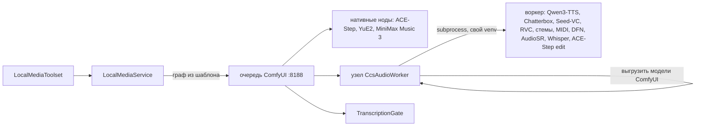

# ADR-020: Аудио в local-media — музыка и голос на GPU1 одной очередью

**Статус:** Принят, 2026-09-30.
**Дата:** 2026-09-30
**Основа:** решения Андрея от 2026-09-30 (задача трекера `220e59f3`): карта — GPU1 рядом с
ComfyUI и транскрибацией, работа по очереди; расширяем существующий MCP-сервер `local-media`,
отдельный не заводим; лицензии выбор не ограничивают (использование личное), NC-модели
помечаются в описании инструмента.
**Замеры:** `~/ai-data/audio-bench/results.jsonl`, образцы — проект «Аудиотесты» (`samples/`);
сводная таблица — [local-media.md](../features/local-media.md), раздел «Аудио».

## Контекст

GPU1 (RTX 3090, 24 ГБ) уже делят три потребителя: ComfyUI с картинками Qwen-Image и видео
MiniMax H3, конвейер транскрибации (WhisperX) и ручные прогоны стенда. Вместе они в память не
помещаются. Порядок держит одна очередь ComfyUI: транскрибация встаёт в неё узлом
`TranscriptionGate`, который выгружает модели ComfyUI и держит очередь, пока существует её
lock-файл.

Аудиомоделей нужно около десятка, и у каждой свои зависимости: Chatterbox требует torch 2.6,
DeepFilterNet — numpy<2 и Python 3.11, Basic Pitch — старый tensorflow, Applio — свежий
transformers, ACE-Step 1.5 — torch 2.10. В venv ComfyUI (torch 2.13, cu130) они не встают, а
ставить их туда рискованно: одно обновление ломает картинки и видео у всех.

Разведка ComfyUI 0.37: нативно есть ACE-Step 1.5 (`TextEncodeAceStepAudio1.5`, только генерация
по тексту и cover), YuE2 (`YuE2GenerateABC`, `YuE2GenerateMusic`, `SheetSage2AudioToABC`) и
MiniMax Music 3. Голоса, стемов, MIDI и реставрации в ядре нет.

## Решение

### 1. Два пути в одну очередь

- **Музыка по тексту — нативными нодами ComfyUI** по официальным шаблонам
  (`audio_ace_step1_5_xl_sft`, `audio_yue2_text2music`, `audio_minimax_music_3`).
- **Всё остальное — один узел `CcsAudioWorker`** (`deploy/comfyui/audio/ccs_audio_worker`).
  Он устроен как `TranscriptionGate`: заняв очередь, выгружает модели ComfyUI, запускает воркер
  отдельным процессом в venv модели и ждёт его. Процесс вышел — видеопамять свободна, следующая
  генерация сама загрузит свою модель. Отмена задачи в ComfyUI убивает группу процессов воркера.

Отвергнуто: **отдельная очередь аудио в бэкенде** (два владельца одной карты, гонки с
транскрибацией); **custom nodes моделей прямо в venv ComfyUI** (конфликт зависимостей, одно
обновление ломает картинки и видео); **долгоживущие серверы моделей** (держат видеопамять,
а карта нужна видео целиком).

### 2. Граница безопасности

«Произвольный граф снаружи не принимаем никогда» остаётся в силе. Узел сам держит белый список
операций (`OPS`) и берёт интерпретатор и скрипт только из машинного `workers.json`. Снаружи в
него попадают операция, параметры JSON (их повторно проверяет воркер), имена файлов, которые мы
сами загрузили в input ComfyUI (без `..` и абсолютных путей), и префикс результата. Воркер пишет
только в `output/ccs-local-media`, узел отдаёт наружу лишь файлы из этого каталога. Бэкенд
разбирает аргументы по белым спискам до постановки (`LocalMediaService.Audio`).

### 3. Веса — только при установке

Узел запускает воркеры с `HF_HUB_OFFLINE=1`. Скачивание внутри задачи держало бы всю очередь
GPU: на замере Seed-VC 10 минут ждал BigVGAN, заняв очередь. Веса ставит `install.sh` /
`warm_models.py`.

### 4. Инструменты (9 новых)

| Инструмент | Модели | Результат |
|---|---|---|
| `local_music_generate` | ACE-Step 1.5 XL-sft + LM 4B (по умолчанию), YuE2-3B int8 (**CC BY-NC**), MiniMax Music 3 | mp3; у YuE2 ещё партитура `.abc`, её можно поправить и передать обратно в `abc` |
| `local_music_edit` | ACE-Step 1.5 turbo (cover, repaint), xl-base (extract, lego, complete); YuE2 — cover по мелодии исходника нативными нодами ComfyUI | mp3 (у YuE2 ещё `.abc`) |
| `local_speech` | Qwen3-TTS 1.7B (описание голоса, диктор, клон), Chatterbox Multilingual (клон) | wav |
| `local_voice_convert` | Seed-VC (без обучения, речь и пение, GPL-3.0), RVC/Applio (моделью голоса) | wav/mp3 |
| `local_voice_train` | RVC/Applio | `voice.pth` + `voice.index` в проекте |
| `local_audio_separate` | BS-RoFormer (вокал/минус), HTDemucs ft/6s, Mel-RoFormer karaoke | стемы |
| `local_audio_to_midi` | Basic Pitch (ONNX, CPU) | `.mid` |
| `local_audio_enhance` | DeepFilterNet 3 (шум), AudioSR (верхние частоты), Matchering (мастеринг по референсу) | wav/mp3 |
| `local_transcribe` | faster-whisper large-v3-turbo (как у транскрибации) | `.txt`, `.srt`, `.lrc` |

Модель голоса RVC живёт **в проекте** (как любой результат), а не в реестре на сервере: вход
`local_voice_convert` — путь `.pth` или `job_id` задачи обучения. Изоляция та же, что у картинок.

**Тяжёлые** (одна на владельца): обучение голоса и правка трека моделью xl-base (20 ГБ весов fp32).

### 5. Время (`eta_seconds`)

ETA — функция длины (песни, текста, входного звука) по замерам стенда с холодной загрузкой
модели: каждая задача грузит модель заново, это и есть типичный случай. Длина входного звука
читается из заголовков WAV/FLAC/MP3/OGG (`AudioProbe`) без ffprobe. Где замера нет — `null`,
время не обещаем (правило local-media). Позиция в очереди и чужие задачи в ETA не входят.

### 6. Когда агенту звать аудио

Музыка и озвучка идут с тем же запретом «только по явной просьбе», что картинки и видео
(`ExplicitOnly`): облачные аналоги есть, GPU общая. Обработка звука (стемы, MIDI, реставрация,
смена голоса, распознавание) работает с файлами пользователя и облачной замены в чате не имеет —
у неё запрета нет (`AudioLocal`). **Открытый вопрос к Андрею:** включать ли музыку и озвучку в
умолчание флага `local-media-default`.

## Последствия

- Машинный тумблер `LocalMedia:AudioEnabled` (по умолчанию выключен): без узла и venv ComfyUI не
  примет граф, машина без аудиостека честно отказывает до постановки.
- Каждая аудио-задача платит холодную загрузку модели (4–20 с), зато видеопамять между
  задачами свободна для видео.
- Диск: ≈90 ГБ весов (музыка ≈40 ГБ, ACE-Step для правки ≈30 ГБ, голос и стемы ≈20 ГБ) плюс
  venv ≈25 ГБ.
- Обновление ComfyUI может поменять схемы нативных нод музыки — сторож `ComfyWorkflowsTests`
  (снимок `object_info`) это поймает.
