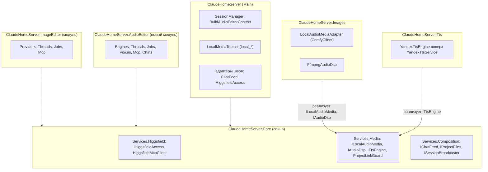

# ADR-021: Модуль «Звук» и общая панель генерации

- **Статус:** принят; модуль «Звук» реализован целиком — сервер и фронт (MF-remote, полоса и панель
  `sound`) — и прошёл ревью (ветка `feat/audio-editor`, 2026-10-01). Расхождения с исходным разрезом — раздел
  «Сверка с фактом (2026-10-01)» в конце; устаревшие места помечены по тексту
- **Основа:** разбор возможностей (задача `56858361`), макеты
  [audio-editor-v2](../mockups/audio-editor-v2-proposal.md) и
  [image-editor-v4-panel](../mockups/image-editor-v4-panel-proposal.md) с решениями Андрея,
  [ADR-019](ADR-019-image-editor-v3-in-chat.md) (нити, швы ядра, тулсет),
  [ADR-020](ADR-020-local-media-audio.md) (аудио в local-media), [ADR-014](ADR-014-internal-subsystems.md)
  (подсистемы и сторожа границ)

## Контекст

Андрей согласовал раздел «Звук» (режимы Голос / Музыка / Обработка) по образцу редактора картинок и
перенос настроек картинок в такую же боковую панель. Решения, которые этот ADR обязан выполнить:

1. Один раздел «Звук»; ~~«Голос» и «Музыка» — ярлыки (меню полосы, «＋» композера, empty-state ленты).~~
   **Изменено 01.10 (решение Андрея):** во всех трёх местах — один пункт «Звук». Он открывает полосу
   «Звук» и панель в последнем выбранном режиме («Голос» по умолчанию); режим выбирают в самой панели.
   В меню полос ярлык не второй пункт: его ключ равен id полосы, и пункт «Звук» сам запускает действие.
2. fal: отобранные 3–6 моделей на операцию плюс «Дополнительно» — автоформа по схеме модели.
3. Монтаж без ИИ в v1: обрезка, громкость и фейды, сведение стемов в новую версию. ~~Склейки нет.~~
   **Устарело 01.10:** склейка есть — решение Андрея, `IAudioDsp.ConcatAsync` и `audio_concat` (см. сверку).
4. «Звук» есть в личном чате (только облака: fal, Higgsfield, Яндекс). Библиотека «Голоса» — только в
   проектах.
5. Настройки — в боковой панели с вкладками («Настройки» / «Голоса», «Настройки» / «Персонажи»), каркас
   общий. В личном чате — та же панель правой колонкой. Панель открывается сама при выборе звука или
   картинки, пока человек не закрыл её в этом чате. Быстрые действия картинок — и в панели, и в редакторе.
6. Модели Higgsfield «Game pipeline only» не открываем: музыка и SFX — через fal и local.
7. **Отдельные проекты и модули с UI — сразу, как у «Заметок»** (указание Андрея 2026-10-01): своя
   бэкенд-сборка динамическим модулем, свой MF-remote, свои тесты, а не папка внутри существующего.

## Что показала сверка с кодом (влияет на разрез)

- **Общие швы картинок лежат в Core, но в namespace `ClaudeHomeServer.Services.ImageEditor`** — он же
  корень вертикали ImageEditor: `IHiggsfieldAccess`, `ILocalImageMedia`, `ProjectLinkGuard`,
  `ImageEditorAgentTools` (`Core/Services/ImageEditor/`). Сторож границ ссылку модуля звука на них
  пропустит: любой тип сборки Core для него спина (`SubsystemBoundaryTests.IsAllowed` →
  `IsCoreAssembly`, проверка сборки идёт раньше namespace). Но код звука, читающий
  `using ClaudeHomeServer.Services.ImageEditor`, вводит в заблуждение и ревьюера, и сторожа покрытия
  (`CollectTypesInNamespaceTree` собирает вертикаль по namespace). Поэтому этап 0 переносит общее в
  нейтральные namespace — это гигиена, а не условие сборки.
- **`HiggsfieldMcpClient` живёт внутри сборки модуля картинок** (`ClaudeHomeServer.ImageEditor/Providers/`,
  155 строк, ноль пакетов): транспорт `CallToolAsync` общий, картиночное в нём только
  `DownloadAsync → EditedImage`. Вот здесь граница реальна: модуль звука на сборку модуля картинок
  сослаться не может, клиент переезжает в Core.
- **`LocalImageMediaAdapter` ходит в ComfyUI напрямую** (`ComfyClient` + шаблоны), а не через
  `LocalMediaService`: поэтому результаты редактора не попадают в `.cc-attachments` через
  `LocalMediaCollector`. Аудио-адаптер обязан повторить это устройство, иначе результат ляжет дважды.
- **В бэкенде нет ffmpeg вовсе**: он вызывается только Python-воркерами ComfyUI
  (`deploy/comfyui/audio/workers/`). Длину звука сейчас читает `AudioProbe` (Images) из заголовков.
- **В личном чате правая зона панелей уже есть**: `ChatsPage` рисует `PanelZone side="right"` с
  `SESSION_KEYS` (`plan`, `agents`, `context`). Новой «колонки страницы» строить не нужно — нужен
  ключ панели, допущенный в эту зону, и контекст слота без проекта.
- **Ключи панелей — закрытый список** (`PANEL_KEYS` в `pages/workspace/panelCatalog.ts`), слот
  `workspace-panel-def` получает `WorkspacePanelDefCtx { projectId: string }` — без `sessionId` и без
  личного чата. `revealWorkspacePanel` объявлен в фиче картинок (`characters/panel.ts`), а не в ките.
- **Устаревшая строка в ходе**: `LocalMediaDefaultContributor` (`ProjectRule` и `PersonalRule`, сейчас
  строки 99 и 104) пишет «Звук и музыка — как раньше: локальных моделей для них нет».

## Решение

### 1. Сборки и слои

**Бэкенд — `ClaudeHomeServer.AudioEditor`, динамический модуль по образцу Notes и ImageEditor:**

- Namespace-корень `ClaudeHomeServer.Services.AudioEditor`, подсистема `AudioEditorSubsystem`
  (`IAppSubsystem`, Key `audioeditor`), флаг `audio-editor` (`FeatureFlagCatalog.All` + `FLAGS.audioEditor`).
- Main ссылается с `ReferenceOutputAssembly="false"` и двумя целями копирования (`Build` и `Publish`) в
  `modules/audio-editor/`; запись `DynamicModules` с ключом `audioeditor` в `appsettings.json`.
- Ссылка — **только на Core**, своих пакетов нет (`DynamicModulePackagesGuardTests`).
- Тесты — `ClaudeHomeServer.AudioEditor.Tests`; тесты контроллеров и `McpToolsetStabilityTests` — в
  `ClaudeHomeServer.Tests`, как у картинок.
- Папки модуля: `Controllers/`, `Threads/`, `Jobs/`, `Engines/` (драйверы поставщиков), `Catalog/`
  (отобранные модели и операции), `Voices/`, `Mcp/`, `Chats/` (блок хвоста хода), `Prefs/`, `Contracts/`.

**Фронт — отдельный MF-remote `frontend/modules/audio-editor`** (имя `aihome_audio_editor`, база
`/audio-editor-remote/`, dev-порт 5178 — 5173–5177 заняты хостом и remote'ами) над кодом `frontend/src/features/audioEditor`. Устройство — как у
`modules/notes`: асинхронная граница в `subsystem.tsx` (сначала `aihome_shell/kit`, потом манифест), фича
импортирует ядро только через `aihome_shell/kit`, eslint-граница `features/audioEditor/**`.

**Core-швы (новые и перенесённые).** Все — в нейтральных namespace, добавленных в
`CoreAllowedNamespaces` сторожа (`SubsystemBoundaryTests`, список namespace, которым разрешено жить в
Core):

| Шов | Namespace | Реализация | Что делает |
|---|---|---|---|
| `IHiggsfieldAccess` (перенос) | `Services.Higgsfield` | адаптер в Main (как сейчас) | токен Higgsfield на каждый запрос |
| `HiggsfieldMcpClient` (перенос из модуля картинок) | `Services.Higgsfield` | сам класс в Core | `CallToolAsync`, `PutAsync`, `DownloadBytesAsync`; картиночная обёртка `EditedImage` остаётся в ImageEditor |
| `ProjectLinkGuard` (перенос) | `Services.Media` | статика | путь внутри проекта без символических ссылок |
| `ILocalAudioMedia` (новый) | `Services.Media` | `LocalAudioMediaAdapter` в Images, прямо в `ComfyClient` | `Configured`, `Available`, `QueueLengthAsync`, `EtaSeconds(op, …)`, `SubmitAsync(LocalAudioRequest)`, `PollAsync`, `CancelAsync`; входы — байты, выходы — файлы с ролями |
| `ILocalMediaAdopter` (новый) | `Services.Media` | `LocalAudioAdopter` в AudioEditor, `LocalImageAdopter` в ImageEditor (каждый за своим флагом) | `AdoptAsync(LocalMediaAdoption, ct)`: после сборки задачи чата `LocalMediaService` (Images) отдаёт усыновителям файлы результата, модуль заводит нить и якорь в ленте — та же карточка, что у запуска кнопкой. Зовёт издатель, вне общего замка сборки и без токена запроса. Контракт отказа: молчаливый возврат (флаг выкл., чужой чат/проект, нет подходящих файлов) и исключения усыновитель наружу не пропускает — издатель их гасит, пишет в лог, результат задачи не портится. Форма нити — как у кнопки: стемы одной задачи — одна нить и версия с ролями `stem:*`, `count>1` у картинок — одна нить с вариантами; повтор той же задачи ничего не дублирует |
| `IAudioDsp` (новый) | `Services.Media` | `FfmpegAudioDsp` в Images | `ProbeAsync` (длина, частота, каналы), `PeaksAsync` (волна), `TrimFadeGainAsync`, `NormalizeAsync` (LUFS), `MixAsync` (стемы с громкостями), `ConvertAsync` (формат, частота) |
| `ITtsEngine` (новый) | `Services.Media` | `YandexTtsEngine` в Tts поверх `YandexTtsService` | голоса, роли, скорость, лимит 3000, цена в рублях |

Почему так:
- **Перенос, а не копия Higgsfield-клиента**: копия — две реализации авторизации и разбора ответа MCP,
  а `params`-обёртка 2026-09 уже показала, что формат у Higgsfield меняется.
- **ffmpeg — за швом в Images, не в модуле.** Запуск бинаря пакетом не является, но модулю нужен и
  `AudioProbe` (живёт в Images), и единая проверка «ffmpeg есть на хосте». Нет ffmpeg или нет Images —
  шов `null` / `Available=false`, операции без ИИ отвечают `503 dsp_unavailable`, как `raster_unavailable`
  у картинок. ~~Склейки (`concat`) в шве нет — решение 3.~~ **Устарело 01.10:** склейка в шве есть
  (2–20 кусков, стыки, выравнивание к −16 LUFS), итог — новая нить-черновик.
- **Валидация local-аудио не дублируется**: адаптер берёт белые списки и лимиты из
  `LocalMediaService.Audio` (языки, `IsHeavyAudio`, ETA-функции, `MaxSpeechTextLength`…) — их нужно
  сделать доступными адаптеру как статику, а не переписывать.
- **Яндекс — за `ITtsEngine`**, потому что Tts — отдельная вертикаль, прямая ссылка запрещена.

**Выносить ли общий стор нитей и каркас задач в Core — нет, сейчас не выносим.** Критерий выноса:
когда у второго модуля копия `ImageThreadStore` (591 строка) / исполнителя задач совпадёт больше чем на
70 % и при этом оба модуля стабильны — выносить генерик в Core отдельной задачей с тестами обоих модулей.
Обоснование: у звука версия многофайловая (стемы, `.abc`, `.srt`, `.pth`), выделение куска и сведение —
свои; генерик, написанный заранее, потащит риск в работающий редактор картинок. Общими остаются уже
объявленные швы ADR-019 §2 (`IChatFeed`, `module_record`, события `session/deleted` и `session/branched`).

### 2. Модель модуля звука

Повторяет картинки (ADR-019): область `AudioEditScope.Of` (проект или `personal`), нить
`data/audio-threads/{owner}/{session}.json` с ревизией и журналом, рабочая папка
`data/audio-editor/{owner}/{job}` (7 дней, вне бэкапа), префы `data/audio-editor-prefs/{owner}/{scope}.json`
**с отдельной записью на режим** (Голос / Музыка / Обработка), quote → job, `module_record` с
`module: "audioeditor"`, SignalR `audio_edit_progress / completed / failed`, `audio_thread_changed`,
`audio_prefs_changed`, `AudioThreadRecovery` после перезапуска.

Отличия от картинок:
- **Версия — набор файлов с ролями**: `main`, `stem:<имя>`, `score` (.abc), `subtitles` (.srt),
  `lyrics` (.lrc), `text`, `midi`, `model` (.pth), `index` (.index). Сохранение — `CreateNew` с
  версионированием имени, стемы — папкой `<имя>.stems/`.
- **Выделение куска** (`{ start, end }` на нить) — UI-состояние фронта, на бэкенд уходит параметрами
  операции. Сервер его не хранит.
- **Монтаж без ИИ — новая версия, а не «шаг» версии** (у картинок правка без ИИ — шаг). Обрезка, фейды,
  громкость и сведение стемов меняют длину и состав файлов, и сравнение A/B должно видеть их как версии.
- **Голоса** — `voices/<slug>/voice.json` + образцы + расшифровка; `Providers` (JsonObject) — кеш id у
  поставщиков: элемент Higgsfield, `custom_voice_id` MiniMax с датой последнего использования (клон
  удаляется через 7 дней — признак «проверить»), эмбеддинг Qwen-клона, пути `.pth` / `.index`.
  Пересоздание клона за деньги — только кнопкой человека с ценой.

  Движок сообщает об изменениях кеша списком `AudioVoiceCacheEntry(Provider, Id)`, а `VoiceLibrary.Remember`
  применяет его к `Providers`. Соглашение: **пустой `Id` — удалить запись этого поставщика**, а не записать
  пустую привязку. Так движок гасит протухшее (например, образец, который Higgsfield уже не знает), не
  получая прав на сам манифест голоса; отдельной операции «забыть» в шве нет намеренно. Новый поставщик в
  кеше обязан понимать пустой `Id` так же — иначе протухший id будет подставляться в каждый запуск.
- **Каталог** `AudioCatalog` — данные, а не код: операция → отобранные модели поставщика с `AudioCaps`
  (Ops, MaxTextChars, длительности, языки и признак RU, виды голоса, выходные файлы, Heavy, лицензия,
  единица цены). Модель fal вне отбора — одна строка каталога.
- **«Дополнительно»** у fal — по `get_model_schema` эндпоинта (кешируется на инстанс с TTL), у Higgsfield
  — по `models_explore type:audio`, у local — по описанию параметров движка в каталоге. Бэкенд
  пропускает в поставщика только ключи из схемы модели; неизвестный ключ — отказ с именем поля.

Драйверы `IAudioEngine` (Key, Label, PriceUnit, Enabled / Registered, Models, `RunAsync`,
`CancelRemoteAsync`, `IAudioQuoter`): `local` (`ILocalAudioMedia`, только проект), `fal` (REST
`queue.fal.run`), `higgsfield` (`generate_audio`, `list_voices`, `models_explore` через Core-клиент;
только TTS и клон, без «Game pipeline only»), `yandex` (`ITtsEngine`), `dsp` (`IAudioDsp`, «Без ИИ»).

### 3. Общая панель генерации на фронте

**Где живёт каркас — в хосте, в китe, а не в фиче и не в ui-kit целиком.**

- Примитивы без знания о генерации — в `frontend/src/components/ui/`: `Tabs` (`role="tablist"`),
  `Stepper` («− N +»), `ResizeHandle` за левый край (340–520 px). Проверить, что `Segmented` и `Modal`
  (шторка) закрывают остальное; новых самодельных контролов в фичах не заводить.
- Каркас `GenerationPanel` — `frontend/src/components/generation/` (шапка 42 px, вкладки, строка
  контекста, прокручиваемое тело, закреплённый низ, вид «корешок» 44 px, шторка на телефоне с режимом
  «опущена до цены»). Экспорт — через `lib/shell-kit/index.ts`, потому что оба MF-remote видят хост только
  через `aihome_shell/kit`. Контракт низа — ровно из макета:
  `{ reason, queue, count, maxCount, price: [итог, расшифровка], runLabel, onRun }`.
- Вертикаль отдаёт содержимое вкладок и данные низа; шапку, вкладки, корешок, шторку и ширину рисует
  каркас. Витрина `#/ui-kit` получает раздел «Панель генерации».

**Регистрация.** Обе вертикали вкладывают панель тем же слотом `workspace-panel-def` с ключами
`images` и `sound`. Изменения хоста:

1. `PANEL_KEYS` += `images`, `sound`; обе — `right`; обе в `WORKSPACE_KEYS` и **в зоне личного чата**
   (`CHAT_KEYS` / правая зона `ChatsPage` — сейчас там `SESSION_KEYS`). Ключ `characters` уходит после
   переноса персонажей во вкладку (этап 1б).
2. `WorkspacePanelDefCtx` получает `projectId: string | null` и `sessionId: string | null`;
   `isAvailable(projectId | null)`. Это меняет сигнатуру для существующего вклада «Персонажи» — правится
   в том же коммите.
3. `revealWorkspacePanel(key, tab?)` — в кит (из `features/imageEditor/characters/panel.ts`); в `detail`
   события `REVEAL_PANEL_EVENT` добавляется `tab`. Слушатель — и в `WorkspacePage`, и в `ChatsPage`.
4. **«Справа одна панель генерации»**: `images` и `sound` взаимоисключающие всегда; с остальными
   панелями — как сейчас решает зона (эксклюзивный режим на планшете, `compact`). Переписывать модель
   мультиколонок `panelStackState` ради макетного «справа одна панель» не надо: на ≥ 1100 px соседство с
   «Файлами» безопасно, а на узких окнах эксклюзив уже есть.

**Правило автооткрытия per-чат.** Признак «человек закрыл панель генерации в этом чате» — хост-стор
`genPanelDismissed` в `localStorage` по ключу `{sessionId}:{panelKey}`, общий для картинок и звука:

- выбор картинки или звука («Нарисовать новую», «Новый звук», ярлык «Звук», «Редактировать»
  из дерева, выбор версии в ленте) зовёт `autoRevealGenerationPanel(key, sessionId)`: открывает, если
  признака нет;
- ✕ в шапке и пункт рельса, закрывший панель, ставят признак; сводка в полосе и пункт рельса открывают
  панель всегда и признак **не снимают** (решение Андрея: закрыл — дальше только руками);
- выбор, сделанный агентом (`image_focus`, `audio_focus`), панель не открывает — только человек;
- серверных префов и `UpdatedAt` это не трогает (это настройка вида, как ширина панели). Удаление чата
  чистить не обязательно: ключи мелкие, но стор держит не больше 500 последних ключей.

**Правило вкладок каркаса (дополнение 2026-10-02, «Видео»).** Первая вкладка — то, что запускает чип полосы
(у «Картинок» и «Звука» это «Настройки», у «Видео» — «Сцена»); имя и значок задаёт вертикаль. Умолчание
`'settings'` в `followSelection` и `agentPickSlot` — только для панелей с такой вкладкой, поэтому **видео
всегда передаёт `tab` явно** (`'scene'` или `'film'`). Низ панели (`GenerationFoot`) — размеченное
объединение: счётчик (`count`/`maxCount`) и цена необязательны, а запуск имеет состояния покоя,
`progress`, `result` и пометку `stale`. Событие показа несёт прозрачные `preset` (заготовка для чужой
панели) и `returnTo` (ссылка «↩ К сцене / К фильму»): хост их не разбирает, смысл знает только
панель-получатель, сервер соседней вертикали о вызывающей панели не знает.

**Слот `emptySubmit` режима поля ввода** (`ComposerMode.emptySubmit`, `registryCore.ts`): запуск при ПУСТОМ
поле — кнопка отправки берёт его подпись и действие («↻ Ещё 2 · бесплатно» — повтор прошлого запуска). Вкладывает
сам режим (сегодня — режим картинок, `imageMode.tsx`); возвращает `{ label, run }` или `null`. Без вклада
(или с `null`) поведение прежнее: на пустом поле кнопка гаснет. Режим звука слот не вкладывает: повтор
запуска у него живёт на карточке в ленте и в кнопке панели.

### 4. Перенос картинок на панель — без поломки работающего редактора

Порядок (каждый шаг — отдельный коммит с зелёными тестами, без нового флага):

1. **Каркас и витрина** без потребителей: ui-kit, `GenerationPanel`, `genPanelDismissed`, расширение
   слота и ключи `images` / `sound` (пока без вкладов — `keyAvailable` их прячет).
2. **Вклад `images`** в модуле картинок: вкладка «Настройки» собирается из ТЕХ ЖЕ секций, что
   `strip/ImagesStrip.tsx → SettingsPanel` (вынести секции в общие компоненты фичи, а не копировать);
   «Персонажи» — существующий `CharactersPanel` без изменений. Кнопка-сводка полосы переключается на
   открытие панели **только при включённом под-флаге `image-editor-panel`** (dark launch, per-user), иначе
   работает старая карточка. Так прод не ломается, пока панель обкатывается.
   **Под-флаг снят 2026-10-01** (срез 1в): панель у всех, старая карточка настроек, Modal настроек
   на телефоне, Modal роли образца и панель `characters` удалены. Сохранённые оверрайды
   `image-editor-panel` в `users.json` безвредны: `FeatureFlagService` отдаёт только ключи каталога.
3. Операция и режим подбора (`EditMode` из API), закреплённый низ с запуском, автооткрытие, мобильная
   шторка.
4. Приёмка Верой (Playwright, обе темы, 360 / 800 / 1024 / десктоп, личный чат), снятие под-флага:
   удаляются карточка настроек, Modal на телефоне, Modal роли образца, панель `characters` и её ключ,
   компонент `ProviderModelPicker` (`currentModel` и `ProviderItems` выносятся). Быстрые действия
   в попапе «Редактор» **остаются**.

Под-флаг нужен именно здесь: это замена живого UI, а не новая фича. У звука под-флага нет — он весь за
`audio-editor`.

### 5. MCP-тулсет `audio-editor`

Маршрут `POST /mcp/audio-editor/{sessionId}`, контекст `BuildAudioEditorContext` во **всех трёх**
точках сборки `LlmSessionContext` в `SessionManager` (как `BuildImageEditorContext`, строки 4043, 5554,
5617), сервер едет в любой чат владельца по флагу `audio-editor` — проектный и личный.

| Инструмент | Контракт | При `AudioEditor:AgentLaunch=false` |
|---|---|---|
| `audio_state` | нити, версии с файлами, фокус, запуски, настройки по режимам, поставщики и модели с caps, голоса проекта | есть |
| `audio_focus` | `threadId` или `file`; `versionId` только с `threadId`; пусто — снять | есть |
| `audio_new` | черновик (`mode`, `folder`) | есть |
| `audio_voices` | дикторы поставщика: `provider`, `model`, `language?` (Higgsfield `list_voices`, Яндекс, local, fal) | есть |
| `audio_generate` | см. ниже | нет |
| `audio_concat` | склейка кусков (версии нитей чата, файлы проекта) в новую нить-черновик, без ИИ | нет |
| `audio_suggest_prompt` | ничего не запускает | есть |
| `audio_cancel` | только задача этого чата | нет |

**Схема `audio_generate` фиксированная**: `threadId` (обязателен), `versionId?`, `mode`
(`voice|music|process`), `op` (enum всех операций `AudioOp`, кроме монтажа без ИИ), `provider?`,
`model?`, `text?` (текст композера: что озвучить или стиль), `lyrics?`, `voice?` (slug из «Голосов» или id
диктора), `range?` `{ start, end }`, `durationSeconds?`, `count?` (1–4), `params?` (object — частные
параметры модели; валидируются на бэкенде по схеме модели с внятным отказом). Ни схема, ни описание
инструмента не зависят от выбранного поставщика, режима, фокуса или хода (`McpToolsetStabilityTests`).
**Изменение 01.10 (решение Андрея): монтаж без ИИ и склейка у агента есть** — «склей эти три реплики»
должно работать. Монтаж — `op` `trim | gainFade | normalize | mixStems` у `audio_generate` (шов
`IAudioAgentEdits`, реализация `AudioAgentEdits` поверх `DspAudioEngine` есть с `d77db024`; параметры
операции — в `params`: `fadeInSeconds`, `fadeOutSeconds`, `gainDb`, `targetLufs`, `stems`, `format`), склейка — отдельный
`audio_concat`: у неё другой вход (список кусков, а не нить), итог — новая нить, нет поставщика и цены;
имена не однокоренные. Оба бесплатны и лимит «2 запуска за ход» не расходуют, но делегированный ход
закрыт и для них. **Сохранения у агента нет**: сохраняет только человек. Частные параметры модели
проверяет тулсет по схеме движка (`IAudioEngine.ParamNames`): неизвестный ключ — отказ с именем поля.

**Закрытые открытые вопросы разбора — рекомендации:**

1. **Прямые `local_*` аудио-инструменты при включённом модуле — оставить, правило приоритета в хвосте
   хода; скрытие не делать.** Скрытие по флагу сессии формально допустимо (свойство сессии, не хода), но
   `local-media` — общий сервер с картинками и видео, и вычитание девяти инструментов по флагу
   `audio-editor` делает его `tools/list` зависимым от второго флага и ломает проверенную стабильность.
   Плюс `local_*` нужны там, где модуля нет. Правило — блок хвоста хода `audio-editor-state`
   (`InTurnTail`): «есть нить звука или сохранённый выбор в полосе «Звук» → озвучка, музыка и обработка —
   только `audio_*`; `local_*` аудио — по прямой просьбе человека». Одновременно правится
   `LocalMediaDefaultContributor`: устаревшая фраза заменяется ссылкой на блок «Звук» (при флаге) или на
   `local_*` (без него).
2. **Higgsfield `list_voices` агенту — да, но не в прокси Higgsfield, а через `audio_voices` модуля.**
   Белый список `HiggsfieldToolset` не расширяем: прямой `generate_audio` в обход модуля дал бы второй
   путь запуска без котировки, лимита 2 за ход и записи траты модулем. Описание Higgsfield
   `generate_audio`, отсылающее к недоступным инструментам, — отдельный мелкий дефект прокси (см. §8).
   **`generate_audio_batch` — нет**: варианты делаются `count` одиночных запросов, как у картинок; батч
   обходит потолки исполнителя.
3. **`local-media-default` для звука — да, тем же флагом, но только для генерации озвучки и музыки
   внутри модуля**: при флаге «Авто» в каталоге звука ставит `local` первым (в проекте, при
   `LocalMedia:AudioEnabled` и живом ComfyUI), облако при отказе — только с согласия, как у картинок.
   Обработка (`AudioLocal`) и так без запрета. Без флага порядок «Авто» — fal → Higgsfield → Яндекс →
   local (local последним: доступность мигает). Отдельный флаг не заводим.
   **Как сделано (02.10):** порядок «Авто» — одна точка, `AudioCatalog.AutoCandidates`: доступные
   поставщики, работающие в области, в порядке `ProviderOrder` (fal → Higgsfield → local, Яндекс — после
   них); при флаге владельца `local-media-default` local ставится первым. Её зовут котировка
   (`AudioEditJobService.QuoteAsync`, флаг читает `PrefersLocal` через `IFeatureFlagGate`) и каталог для
   фронта — поле `autoProviders`, по нему сводка полосы и панель показывают «Авто → local»; сами порядок
   фронт не считает. У local нет операции или он лежит — дальше прежний порядок, цена видна до запуска; в
   личном чате local нет (`ScopeRefusal`), порядок прежний. Явно выбранный поставщик флагом не
   подменяется. Агенту то же умолчание дополнительно повторяет текст хода
   (`LocalMediaDefaultContributor.ProjectAudioEditorRule`).

### 6. Инварианты под угрозой и сторожа

| Инвариант | Сторож / проверка |
|---|---|
| Граница: модуль ссылается только на Core; швы — в нейтральных namespace | запись `AudioEditor` в `Boundaries` без дубля (сверить число тестов до и после: дубль `ToHashSet` схлопывает молча); `typeof(AudioEditorSubsystem).Assembly` в статических конструкторах `SubsystemBoundaryTests`, `SubsystemBoundaryCoverageTests`, `IlBoundaryRegressionTests` — иначе проход вакуумный; новые Core-namespace (`Services.Higgsfield`, `Services.Media`) в `CoreAllowedNamespaces`; мутация: временная ссылка модуля звука на тип **из сборки** ImageEditor (не из Core) обязана покраснеть — ссылка на Core-тип в любом namespace сторожем не ловится по построению |
| Своих пакетов у модуля нет | `DynamicModulePackagesGuardTests` (добавить модуль) |
| Отключаемость: `DynamicModules[audioeditor].Enabled=false` и `Subsystems:AudioEditor:Enabled=false` — 404, не 500; выключенные Images / Tts / LocalMedia — драйвер `Enabled=false`, `IAudioDsp` нет — `503 dsp_unavailable` | `AudioEditorDisabledTests` по образцу `ImageEditorDisabledTests`; параметры конструкторов модуля от отключаемых вертикалей — только nullable |
| Состав `tools/list` не зависит от хода, фокуса, режима, поставщика | `McpToolsetStabilityTests` + сервер во всех трёх точках сборки контекста |
| Трата — при принятии задачи, на владельца, в своей валюте, `Initiator = Agent` у агента; local и «Без ИИ» — с нулём; сбой после принятия — минус | тесты исполнителя: `CostUsd` (fal), `CostCredits` (Higgsfield), `CostRub` (Яндекс, `Source = tts`), валюты не складываются; `Generations` = число запросов; **в `Label` — эндпоинт и единица тарификации** (`fal-ai/minimax/speech-2.8-hd · 68 симв.`) — новых полей `SpendRecord` не заводим, длина и единица живут в подписи, пока «Расход» не попросит разрез |
| Явный выбор поставщика не подменяется; сосед при отказе — только с той же операцией и видом голоса | тест котировки отказа: `RetryQuote` соседа не запускается сам; клон MiniMax не предлагается заменой на Qwen-клон |
| Не больше 2 запусков агентом за ход (общий лимит модуля), потолки 2 на владельца и 4 на инстанс, local — одна тяжёлая; делегированный ход fail-closed | тесты тулсета по образцу `ImageEditorToolset` |
| Сохраняет только человек, `CreateNew`, занятое имя — `409 name_taken` | тесты сохранения, включая папку стемов |
| Лицензия на версии | версия хранит `license` модели на момент запуска (YuE2 — CC BY-NC, Seed-VC и Matchering — GPL-3.0, Chatterbox HD — водяной знак, «не указана»); значок рисуется из версии, а не из текущего каталога — каталог может поменяться |
| Пути из запроса — только `ProjectLinkGuard.ResolveInside`; в личном чате проектные аргументы (`file`, `folder`, `voice` из библиотеки, local) отказывают до диска | тесты гейта личной области |
| Локальный проект (ADR-016) — только через `ProjectCapabilities` (`FilesOnServer`), инлайнового `IsLocal` нет; local-media там нет | тест гейта |

### 7. Этапы (вертикальные срезы)

Каждый этап заканчивается проверяемым результатом; бэкенд-шаги — Денис, фронт — Кира, приёмка UI —
Вера, ревью — Глеб. Этапы 2–7 — за флагом `audio-editor`.

| № | Срез | Файлы и папки | Готово, когда |
|---|---|---|---|
| 0 | **Нейтральные швы в Core** (рефакторинг без поведения) | `Core/Services/ImageEditor/{IHiggsfieldAccess,ProjectLinkGuard}.cs` → `Core/Services/Higgsfield/`, `Core/Services/Media/`; `ImageEditor/Providers/HiggsfieldMcpClient.cs` → `Core/Services/Higgsfield/` (картиночный `DownloadAsync` — расширением в модуле); адаптер в Main; `SubsystemBoundaryTests.CoreAllowedNamespaces` | `dotnet build` и тесты ImageEditor, `SubsystemBoundary*`, `IlBoundaryRegressionTests` зелёные; `HiggsfieldMcpClient` в сборке Core; в Core-namespace `Services.ImageEditor` не осталось того, что нужно звуку |
| 1а | **Каркас панели** | `components/ui/` (Tabs, Stepper, ResizeHandle), `components/generation/`, `lib/shell-kit/index.ts`, `pages/workspace/panelCatalog.ts`, `PanelZone`, `WorkspacePage.tsx`, `ChatsPage.tsx`, `registryCore.ts` (`WorkspacePanelDefCtx`, `REVEAL_PANEL_EVENT.tab`), стор `genPanelDismissed`, витрина `#/ui-kit` | витрина показывает колонку, корешок, шторку и опущенную шторку в обеих темах; vitest стора автооткрытия; `npx tsc -b`, `npm run lint:design` зелёные; поведение продукта не изменилось |
| 1б | **Картинки на панели** под под-флагом `image-editor-panel` | `features/imageEditor/strip/`, `characters/`, `composer/`, `manifest.tsx`, `FeatureFlagCatalog`, `featureFlags.ts` | с флагом: настройки и персонажи в панели, операция и режим подбора, запуск из низа, автооткрытие per-чат, личный чат — правая колонка; без флага — всё как сейчас; Вера прошла сценарии макета v4 |
| 1в | Снятие под-флага, удаление старого (**сделано 2026-10-01**) | карточка настроек, Modal'ы, ключ `characters`, `ProviderModelPicker` | флаг удалён из каталога и `FLAGS`; тесты и lint зелёные; «Что нового» |
| 2 | **Скелет модуля «Звук» + local** | `backend/ClaudeHomeServer.AudioEditor/`, `.Tests/`, Main csproj (цели копирования), `appsettings.json` (`DynamicModules`), `Core/Services/Media/ILocalAudioMedia.cs`, `Images/Services/LocalMedia/LocalAudioMediaAdapter.cs`; фронт `frontend/modules/audio-editor/`, `features/audioEditor/` (полоса, композер «Чат \| Звук», карточка нити с плеером и волной, панель `sound` с режимами) | в проекте: озвучка Qwen3-TTS, песня ACE-Step, стемы и денойз local становятся версиями нити; квота, прогресс, восстановление после рестарта; сторожа границ и отключаемости зелёные (мутацией доказано); модуль выключается без 500 |
| 3 | **fal** | `Engines/Fal*`, `Catalog/` (отбор 3–6 на операцию), кеш `get_model_schema`, автоформа «Дополнительно» | отобранные модели всех трёх режимов идут с ценой в своей единице; неизвестный ключ `params` — отказ; трата `CostUsd` с эндпоинтом и единицей в `Label`; личный чат работает без local |
| 4 | **Higgsfield и Яндекс** | `Engines/Higgsfield*` (через Core-клиент: `generate_audio` в `params`, `use_unlim:false`, `list_voices`, `models_explore`), `Core/Services/Media/ITtsEngine.cs`, `Tts/…/YandexTtsEngine.cs` | TTS и клон Higgsfield, 15 голосов и роли Яндекса; «Game pipeline only» серые с причиной; траты в кредитах и рублях не складываются |
| 5 | **Обработка и монтаж без ИИ** | `Core/Services/Media/IAudioDsp.cs`, `Images/…/FfmpegAudioDsp.cs`, `Engines/Dsp*`, микшер стемов, выделение куска ⇄ поле «Кусок» | обрезка, фейды, громкость, −14 LUFS, сведение N из M стемов дают новые версии; нет ffmpeg — `503 dsp_unavailable` и серые операции с причиной; проверка наличия ffmpeg на проде — у Марка |
| 6 | **MCP-тулсет и правила ленты** | `Mcp/AudioEditorToolset`, `Chats/AudioEditorStateContributor`, `SessionManager.BuildAudioEditorContext` (три точки), `LocalMediaDefaultContributor`, автоматически разрешённые инструменты в Core | `McpToolsetStabilityTests` зелёный; лимит 2 за ход и fail-closed покрыты; блок хвоста хода едет `InTurnTail`; карточки `audio_*` в ленте |
| 7 | **Библиотека «Голоса»** (только проекты) | `Voices/`, вкладка «Голоса», «＋ Голос» (из записей / по описанию / обучить RVC), «Где работает», пересоздание клона MiniMax с ценой | голос из библиотеки уходит во все поставщики с клоном; протухший клон MiniMax виден и пересоздаётся только кнопкой; в личном чате вкладка — пустое состояние |
| 8 | Документы и приёмка | `backend/ClaudeHomeServer.AudioEditor/CLAUDE.md` + выжимка в корневом `CLAUDE.md`, `docs/features/audio-editor.md`, `docs/architecture/api.md`, «Что нового» | `ProjectMapHygieneGuardTests` зелёный; Вера прошла сценарии макета v2 |

Порядок жёсткий только у 0 → 2 (швы до модуля) и 1а → 1б / 2 (каркас до панелей). 1б–1в и 2–5 можно
вести параллельно двумя исполнителями: они не пересекаются по файлам, кроме `panelCatalog.ts`
(ключи заводятся в 1а).

### 8. Попутные дефекты — отдельными задачами, не в фичу

| Дефект | Куда |
|---|---|
| `LocalMediaDefaultContributor`: «Звук и музыка — как раньше: локальных моделей для них нет» в `ProjectRule` и `PersonalRule` | **отдельная задача сейчас**, до фичи: модель уже сегодня уводит звук в облако при живых `local_*`. Текст правки без модуля: «Звук и музыка — `local_*` только по прямой просьбе; обработка файлов — без запрета». Этап 6 потом заменит его ссылкой на блок «Звук» |
| `worker_seedvc.py`: `pitch_shift` в режиме `speech` молча игнорируется | отдельная задача (воркер + проверка в `LocalMediaService.Audio`: либо применять, либо отказывать) — сломанная схема `local_voice_convert` живёт и без модуля |
| `worker_acestep.py`: `prompt` режется до 2000, бэкенд пропускает 4000 | отдельная задача: выровнять лимит в одну сторону, сторож — тест на совпадение констант |
| Описание Higgsfield `generate_audio` отсылает к `list_voices` / `generate_audio_batch`, которых нет в белом списке `HiggsfieldToolset` | отдельная мелкая задача: дописать в описание прокси оговорку, а не расширять белый список (§5, вопрос 2) |

Все четыре видны и без модуля, правятся мелко и не должны ждать фичу; модуль на них не опирается.

## Отвергнуто

- **Обобщить ImageEditor в «MediaEditor»**: инварианты картинок (пометки, маски, растр, лимиты по
  сторонам) завязаны на картинку, а риск лёг бы на работающую фичу.
- **Два модуля «Голос» и «Музыка»**: решение Андрея 1.
- **Звук папкой внутри модуля картинок или Main**: указание Андрея — отдельные проекты и модули с UI.
- **Схема `audio_generate`, собранная по поставщику или режиму**: ломает стабильность `tools/list`.
- **Скрывать `local_*` по флагу `audio-editor`**: §5, вопрос 1.
- **ffmpeg-операции у fal (`ffmpeg-api`)**: платно и с выгрузкой файлов наружу ради мгновенной локальной
  операции.

## Последствия

- Ядро получает два нейтральных namespace (`Services.Higgsfield`, `Services.Media`) — будущий модуль
  «Видео» берёт швы оттуда же, не трогая сторож.
- Хост получает общий каркас панели генерации; панель видео в будущем — третий вклад того же слота.
- Модуль картинок теряет `HiggsfieldMcpClient` (переезд), получает панель и временно живёт с под-флагом.
- На прод-хосте нужен ffmpeg для монтажа без ИИ (этап 5).

## Сверка с фактом (2026-10-01)

Серверная часть (этапы 0, 2–7) сверена с кодом ветки `feat/audio-editor` на `05824cbf`. Что
поменялось по ходу реализации и в разрезе выше было иначе или не было вовсе:

| Тема | Как в коде | Где |
|---|---|---|
| Склейка | есть: `IAudioDsp.ConcatAsync`, ручки `concat`, инструмент `audio_concat`; 2–20 кусков (версии нитей чата и файлы проекта), стык общий или на каждое место (`butt`, `pause`, `crossfade`), выравнивание к −16 LUFS; итог — новая нить-черновик с лицензиями всех кусков; в личном чате — только звук чата | `Jobs/AudioConcatService` |
| Монтаж у агента | реализован (`AudioAgentEdits` поверх `DspAudioEngine`): новая версия нити, бесплатно, лимит хода не тратит, делегированный ход закрыт и для него | `Mcp/AudioAgentEdits` |
| Входы операции | `Inputs` в настройках нити и префах режима отдельно от `Params`: язык, образец, кусок, куски склейки и стыки, голос, реплики; белый список `AudioOpInputs`, пути — `ProjectLinkGuard`; в `params` модели и запуск не попадают | `Prefs/AudioOpInputs` |
| Повтор у Higgsfield | единственный автоповтор — образец из кеша Higgsfield не знает (`IsMediaMissing`) и запуск не принят: кеш вычищается, образец грузится заново, повтор ровно один; после создания задания повторов нет | `Engines/HiggsfieldAudioEngine` |
| Внешние ссылки | скачивание результатов fal и Higgsfield и PUT образца в Higgsfield — только через Core `SafeMediaDownloader` (https, `SsrfGuard`, без прокси и редиректов у PUT); загрузчик — `init` | Core `SafeMediaDownloader`, `HiggsfieldMcpClient` |
| Поля-ссылки fal | `FalSchemaReader.IsLink` (`webhook*`, `callback*`, `url(s)`, `uri(s)`, `endpoint(s)`) — в `Reserved`: в `params` не принимаются, в «Дополнительно» не рисуются | `Schema/FalSchemaReader` |
| Потолки размеров | входной звук ручек, правок без ИИ, склейки и запуска агентом — 200 МиБ до чтения; тело запуска — 500 МиБ; образец `data:` URI у fal (клон MiniMax, Chatterbox, Qwen-клон) — 20 МБ с отказом до запроса; образец голоса в библиотеке — до 5 штук по 50 МБ | `AudioEditorEndpoints`, `DspAudioEngine`, `FalAudioEngine`, `VoiceStore` |
| Кеш id поставщиков | `AudioVoiceCacheEntry` с пустым `Id` — удалить запись поставщика (§2) | `Voices/VoiceLibrary` |
| Порядок «Авто» | fal → Higgsfield → local, Яндекс — после них; при `local-media-default` владельца local первым (в проекте, если доступен и умеет операцию); одна точка `AutoCandidates` для котировки и `autoProviders` каталога, явный поставщик не подменяется (§5, вопрос 3) | `Catalog/AudioCatalog`, `AudioAutoLocalTests` |
| Сверка запуска с котировкой | котировка хранит всё, от чего зависит цена: текст, подводку, слова, длительность и итог `params`; запуск с другими значениями — отказ «Котировка не соответствует запросу — запросите цену заново» до поставщика, котировка не сгорает; правило одно для всех поставщиков, включая local | `Jobs/AudioEditJobService` |
| `LocalMediaDefaultContributor` | устаревшая фраза из «Что показала сверка» и §8 заменена: при сервере `audio-editor` в ходе — ссылка на блок «Звук в этом чате», без него — прямые `local_*` | Images |

Сделано после сверки: фронт модуля (MF-remote `frontend/modules/audio-editor`, полоса и панель `sound`
с вкладками «Настройки» / «Голоса»), раздел звука в [api.md](../architecture/api.md), «Что нового».
Впереди — приёмка Верой (этап 8). Описание для человека — [audio-editor.md](../features/audio-editor.md),
инварианты модуля — `backend/ClaudeHomeServer.AudioEditor/CLAUDE.md`.
