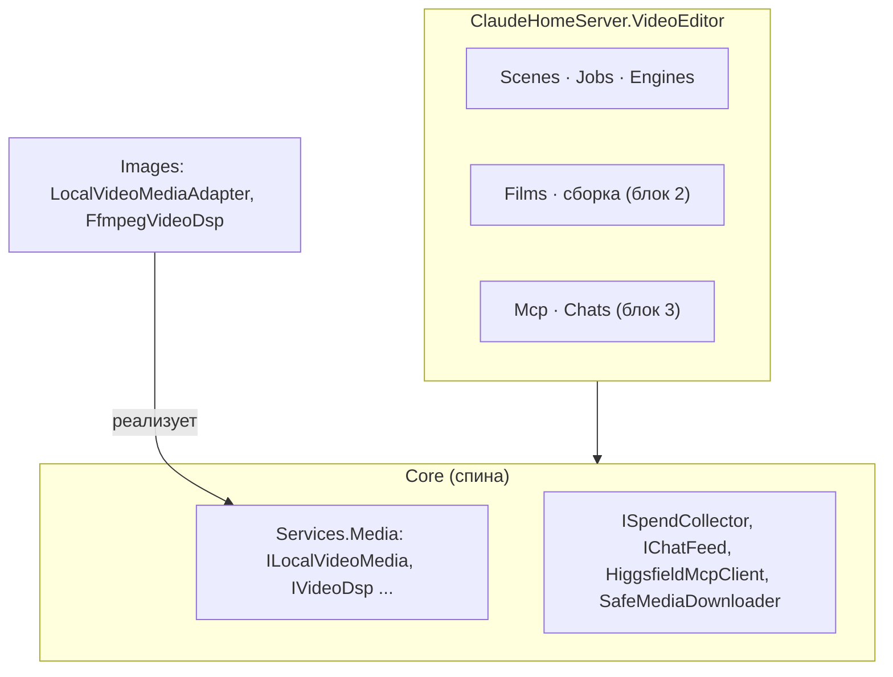

# ADR-022: Модуль «Видео» — сцены и фильм

- **Статус:** принят; реализация по блокам (1 — модуль и сцены, 2 — фильм и швы, 3 — агент, 4–5 — фронт).
  Ветка `feat/video-editor`, дата 2026-10-02
- **Основа:** архитектурный разрез Александра (задача `36c085f0`), макет
  [video-editor-v7](../mockups/video-editor-v7-proposal.md), [ADR-021](ADR-021-audio-editor-and-generation-panel.md)
  (каркас панели и образец вертикали), [ADR-014](ADR-014-internal-subsystems.md) (подсистемы, сторожа границ),
  [ADR-016](ADR-016-local-projects.md) (локальные проекты)

## Контекст

Андрей запускает редактор видео по макету v7. **Сцена** — один клип между кадром A и кадром B, у сцены есть
версии клипа; готовая сцена — самостоятельный mp4 в проекте. **Фильм** — список сцен со склейками (встык /
наплыв / затемнение) и музыкой, собирается без ИИ в `film.mp4`. Кадры — картинки редактора «Картинки»,
музыка — из редактора «Звук». Агент работает по сценам и может сам сохранять сцену и фильм в проект.

## Решения Андрея (входят в ADR)

1. Редактор называется **«Видео»**, ключ панели `videoEditor`, панель эфира переименована в **«Эфир»**.
   Namespace `ClaudeHomeServer.Services.VideoEditor`.
2. **Потолка трат агента нет.** Остаются правило «после сцены — спроси, подряд — только по „сними все“» в блоке
   хвоста хода, `Initiator = Agent` у трат и счётчик «Потрачено на фильм» как отображение.
3. Модуль пишет в проект только в `video/**` и `music/**`, включая кадры из «Картинок»
   (`video/<фильм>/кадры/`) и сочинённый трек (`music/`). Перезаписи нет, кроме `.film` под ревизией.
4. `.film` хранит снимок сцен (текст, кадры, модель) в формате §2.
5. Новый файл сцены сам встаёт в фильм с точкой «обновлена». Музыкой фильма становится первый готовый вариант.
   local в личном чате в v1 закрыт.
6. Тихие строки ленты: у человека «Вы сохранили/собрали/поправили …», у агента — тот же глагол без слова «Claude»
   («Сохранил/Собрал/Поправил …»): лицо даёт метка «✦ Claude» на фронте. Тексты — `VideoFeedTexts`.

## Что показала сверка с кодом

| Факт | Следствие |
|---|---|
| Ключ панели `video` и подпись «Видео» заняты панелью эфиров; namespace `Services.Video` занят | Ключ `videoEditor`, namespace `Services.VideoEditor`; эфир в рельсе — «Эфир» |
| Облачного видео в C# нет: у fal и Higgsfield только картинки и звук | Драйверы пишутся с нуля по образцу `FalAudioEngine` и `HiggsfieldAudioEngine` |
| Higgsfield умеет «кадр A → кадр B»: у многих моделей `models_explore type:video` есть роли `start_image` и `end_image` | Каталог Higgsfield собирается по ролям из живого ответа |
| Шва к local-media для видео нет, `LocalMediaService` — конкретный класс Images; шаблон `ImageToVideo` с `last_frame` есть | Новый шов `ILocalVideoMedia` в Core |
| ffmpeg зовёт только бэкенд на хосте и работает с `byte[]` | Для сборки — свой файловый `IVideoDsp` (блок 2) |
| «Новая версия картинки» — внутренние C#-события ImageEditor, наружу только SignalR | Связь кадров — шов и хаб событий в Core (блок 2) |
| `BackupSchema.Version = 9`, рабочие папки редакторов исключены константами Core | Видео — та же схема, версия остаётся 9 |

## Решение

### 1. Сборки и слои

Новая вертикаль — **динамический модуль `ClaudeHomeServer.VideoEditor`** по форме AudioEditor. Расширять Images,
ImageEditor или AudioEditor не стоит: у видео свои объекты (сцена, фильм), свой запуск (съёмка, сборка) и своё
отличие в правах — агент сохраняет.

- Namespace-корень `ClaudeHomeServer.Services.VideoEditor`, подсистема `VideoEditorSubsystem` (Key `videoeditor`),
  флаг `video-editor` (`Default: false`).
- Main ссылается с `ReferenceOutputAssembly="false"`, две цели копирования (`Build` и `Publish`) в
  `modules/video-editor/`, запись `DynamicModules[videoeditor]` в `appsettings.json`. Ссылка только на Core,
  своих пакетов нет.
- Папки: `Controllers/` (проектные и личные ручки, общее тело `VideoEditorEndpoints`, гейт `VideoEditScopeGate`),
  `Scenes/` (нити, фокус, жизненный цикл, восстановление), `Jobs/` (исполнитель съёмки), `Engines/`
  (`local`, `fal`, `higgsfield`), `Catalog/`, `Prefs/`, `Contracts/`; позже `Films/`, `Assembly/` (блок 2),
  `Mcp/`, `Chats/` (блок 3).
- Тесты — `ClaudeHomeServer.VideoEditor.Tests`; ручки, отключаемость и сторожа — в `ClaudeHomeServer.Tests`.



### 2. Модель данных и хранилища

**Область — `VideoEditScope.Of`**: единственная точка сопоставления «чат ↔ область». У проекта это id проекта,
у личного чата — константа `personal` на владельца. У личной области `Project == null`; всё, что читает диск
проекта (фильмы, сохранение, файлы-кадры, local), отказывает до `RootPath`.

| Что | Где | Бэкап |
|---|---|---|
| Нить сцены и фокус чата | `data/video-threads/{owner}/{session}.json`, ревизия на запись, `409` со свежим состоянием | да |
| Версии клипа — mp4 вариантов | рабочая папка `data/video-editor/{owner}/{job}/` | нет (`VideoEditorPaths.WorkspaceDirName`, строка в `BackupPaths`, тест) |
| Выбор человека (поставщик, модель, длительность, число) | `data/video-editor-prefs/{owner}/{scope}.json` | да |
| Описание фильма | файл проекта `video/<фильм>/<фильм>.film` | нет, это файл проекта |
| Траты по сценам фильма, пометки «✦ Claude» | `data/video-films/{owner}/{projectId}/{filmKey}.json` (блок 2) | да |

`BackupSchema.Version` остаётся 9: всё аддитивно.

**Кадр** — `image{threadId, versionId, follow}` (нить редактора картинок) или `file{path}` (картинка проекта; в
личном чате — загруженная в рабочую папку). **Версия клипа** несёт поставщика, модель, длительность, размер,
звук, лицензию, цену в своей валюте, `initiator` и снимок входов, по которому считается «кадр/текст изменён
после съёмки». Карточки ленты — `module_record` с `module: "videoeditor"`; жизненный цикл нити — на
`session/deleted` и `session/branched`.

**Волна правок после приёмки (2026-10-03).** «Устарел» — признак фильма целиком: `FilmStateDto.stale` (тот же
`FilmStaleness.IsStale`, что и `FilmSummaryDto.stale`). **Новый фильм — отдельная операция** `POST films`
(`FilmCreateRequest`), а не «первый патч по несуществующему пути»: патч всегда идёт под ревизией существующего файла, а
создание — `CreateNew` (занятое имя — `name_taken`, чужой фильм не затирается). Кадр личного чата отдаётся
`GET frames/{name}`, человеческое имя файла лежит рядом (`{id}.name`) и едет в `FrameRef.fileName`.

**Формат `.film`** — JSON с версией схемы, ссылается на **файлы**, не на нити. `items[].scene` — снимок сцены
для «Сценария» и «Переснять» из чата, где этой сцены нет. `builds[].sourceHash` — хеш сборки: признаки «устарел»
и «● обновлена» вычисляются из него. `cuts.length == items.length − 1`, иначе файл невалиден; неизвестная
`schema` — только чтение. Пометки «✦ Claude» и деньги в git не едут.

### 3. Швы между вертикалями

Все швы лежат в Core, namespace `Services.Media`. Параметры конструкторов модуля от отключаемых вертикалей —
только nullable.

| Связь | Шов | Реализация |
|---|---|---|
| Видео → local-media | **`ILocalVideoMedia`**: `Configured`, `Available`, `QueueLengthAsync`, `EtaSeconds`, `SubmitAsync`, `PollAsync`, `CancelAsync` | `LocalVideoMediaAdapter` в Images, напрямую в `ComfyClient` с шаблоном `ImageToVideo` (`last_frame`), **мимо `LocalMediaCollector`**; белые списки, лимиты и ETA — статикой из `LocalMediaService` |
| Видео → fal | шва нет, драйвер в модуле | `FalVideoEngine`: `queue.fal.run`, цена из `models/pricing` (единица — секунда), граница задачи ~20 мин, скачивание через `SafeMediaDownloader` с `VideoMaxBytes` (~300 МБ) |
| Видео → Higgsfield | Core `HiggsfieldMcpClient` + `IHiggsfieldAccess` | `HiggsfieldVideoEngine`: `get_cost` → `generate_video` (`params`, `use_unlim: false`, `medias` с ролями `start_image`/`end_image`) → `jobs_wait`; каталог — живой `models_explore type:video`, кеш 30 мин; повтор — только до создания задания |
| Видео ↔ Картинки, Звук, ffmpeg | `IImageFrameSource`, `IAudioTrackSource`, `IMediaEvents`, `IVideoDsp` | блок 2 |

Видео никогда не читает `data/image-threads` и `data/audio-threads` напрямую.

### 4. Сборка фильма (блок 2)

ffmpeg на хосте, всегда перекодирование; запуск `Heavy` под единым `BuildConcurrencyGate`; CPU, не GPU;
итог — `CreateNew` `film.mp4` → `film.v2.mp4`. Подробности блока — в его комментариях и CLAUDE.md модуля.

**Шов `IVideoDsp` — файловый** (клипы весят сотни МБ, `byte[]` не годится): `ProbeAsync`, `FilmstripAsync`,
`LastFrameAsync`, `AssembleAsync(FilmPlan, outPath, progress, ct)`; реализация `FfmpegVideoDsp` в Images, общий
`Detect` с `FfmpegAudioDsp`. План сборки: `trim` → `scale`+`pad` под общий размер → `fps` → `format=yuv420p`;
клип без звука получает `anullsrc` его длины; склейки — `xfade`+`acrossfade` (наплыв), `fade` (затемнение через
чёрное), `concat` (встык); музыка — `volume`+`afade`+`amix` без нормализации; выход `libx264 -preset veryfast`, `aac`,
`+faststart`, прогресс по `-progress pipe:1`. Наплыв и затемнение не длиннее половины меньшего соседа. Запись — во
временный файл рядом, переименование целой (`CreateNew`); отмена и отказ шва удаляют temp. Размер кадра — по
`aspect` (16:9 → 1280×720), частота 24.

**Слот и scope.** Спека сборки — `ProcessSpec { Heavy = true }`, слот единого `BuildConcurrencyGate.Instance`
берётся **до** старта процесса и держится до его выхода (внутри `FfmpegVideoDsp`, второго семафора нет); запуск —
`ILauncherFactory.Local` (системный local-запуск). Поверх слота — потолок модуля в `FilmBuildRegistry`: 1 сборка на
владельца, 2 на инстанс (ждущая слот считается). Лимиты: до 50 сцен, клип до 300 МБ, таймаут процесса
`VideoEditor:AssembleTimeoutMinutes` (20). Нет ffmpeg или выключены Images — `503 dsp_unavailable`. Сборка пишет
трату с нулём (`Label` «сборка фильма», источник `free`, провайдер `ffmpeg`).

**Проверка (блок 2, 2026-10-02).** Системный local-запуск **уходит в `ccs-agents.slice`**: `LauncherFactory.Local` —
это `LocalProcessRunner.Instance`, а он при `Execution:Isolation:Enabled` оборачивает КАЖДЫЙ запуск (тяжёлый или
нет) в `systemd-run --user --scope --slice=… --property=MemoryMax=…`. Свидетельство: живой тест
`VideoAssembleIsolationTests` запускает настоящую `FfmpegVideoDsp.AssembleAsync` и читает `/proc/<pid>/cgroup` —
`…/user@1000.service/ccs.slice/ccs-isotest.slice/ccs-run-….scope`, слот гейта занят (`Available == 0`) всё время
работы и возвращается при отмене. Отдельный `Process.Start` с `MemoryMax` не понадобился; `MemoryHigh` не ставится
(разбор 2026-09-22). Оговорка: в `appsettings.json` изоляция по умолчанию выключена — на боевом инстансе она
включается в `appsettings.Local.json`, без неё сборка идёт процессом напрямую и держится только слотом гейта.
**ffmpeg на бою:** Марк проверил боевой Linux (задача `b4c5d5fe`): ffmpeg 8.0.1 с `libx264`, `aac`, `xfade`,
`acrossfade`, `amix`, пробное кодирование прошло — риск «нет ffmpeg» закрыт.

**Связи с соседями (блок 2).** `IMediaEvents` — in-memory хаб в Core (падение подписчика гасится и логируется);
`ImageEditor` и `AudioEditor` публикуют `ImageVersionAdded` / `AudioVersionAdded` ПОСЛЕ записи версии в нить, из
асинхронного пути исполнителя, а не из синхронного `Report` прогресса. «Видео» подписано через
`FilmMediaSubscriber`: кадр с `follow` переходит на новую версию нити (клип уже снят — «Кадр изменён — переснять»,
тихая строка в ленте и запись в журнал хода); нить «Сочинить под фильм…» запоминается у фильма, первая готовая
версия ложится в `music/<фильм>.mp3` (`CreateNew`, занятое — `.v2`) и в `.film`. Кадры читаются швом
`IImageFrameSource` (нить ищется среди чатов владельца по `threadId`: чат нити не обязан быть чатом сцены),
музыка — `IAudioTrackSource`. Хранилищ соседей модуль не читает: сторож `VideoModuleIsolationGuardTests`.

### 5. Агент (блок 3)

Тулсет `video-editor`, состав `tools/list` зависит только от сессии, флага и `VideoEditor:AgentLaunch`.
Делегированный ход — fail-closed. **Потолка трат агента нет** (решение Андрея): правило «после сцены — спроси,
подряд — только по „сними все“» держит блок хвоста хода; траты пишутся с `Initiator = Agent`; счётчик «Потрачено
на фильм» — отображение. Агент пишет в проект только в `video/**` и `music/**` и только `CreateNew`; единственный
файл, переписываемый на месте, — `.film` под ревизией.

**Трата** пишется при принятии задачи поставщиком, на владельца, в своей валюте (`CostUsd` fal, `CostCredits`
Higgsfield, 0 local), с `Initiator`. Сбой после принятия — минус; остановленное до принятия не списывается.
**Тихого перехода на другого поставщика нет**: отказ возвращает `RetryQuote`, запускает его только человек.

**Реализация блока 3 (2026-10-02).** Тулсет `Mcp/VideoEditorToolset` (10 инструментов), блок хвоста хода
`Chats/VideoEditorStateContributor` (ключ `video-editor-state`, `InTurnTail`, порядок 707), сервер `video-editor` в трёх
точках сборки `LlmSessionContext` (`BuildVideoEditorContext`), автодопуск — `Core/Services/VideoEditor/VideoEditorAgentTools`.
Решения, которых в §5 не было:

- **Операции над сценами вынесены в `VideoSceneService`** (`Scenes/`): проверки папки и кадров, запись нити, якорь сцены
  в ленте и рассылка раньше жили в контроллере. Ручка человека и инструмент агента зовут один метод — иначе «те же
  карточки» держались бы на честном слове. Ревизию агент не передаёт (`null` — без сверки), `.film` правит только под
  ревизией из `video_state`.
- **Тихие строки ленты в одном лице**: человек — «Вы сохранили / Вы запустили / Вы поправили …», агент — «Claude
  сохранил …» (как у картинок).
- **Сервер в три точки, а не одну**: `StartNewSessionAsync` и обе ветки `EnsureProcessCoreAsync` (вне проекта и проект) —
  иначе после перезапуска процесса личный чат теряет сервер.
- **Состав `tools/list`**: десять при `VideoEditor:AgentLaunch` (по умолчанию), пять без него; в личном чате те же десять,
  фильмовые отвечают отказом на вызове. Сторож — `McpToolsetStabilityTests` (в том числе по исходнику: тело `ToolsFor`
  не читает фокус, сцены, нити и фильмы).
- **Матричный тест** `VideoEditorToolsetFeedParityTests`: каждый пишущий инструмент против настоящего контроллера
  модуля; мутация «инструмент пишет ленту сам» краснеет.
- **Приоритет `video_*`**: `local_*_to_video`, `generate_video` Higgsfield и fal не скрываются из состава — приоритет
  держит текст блока хвоста, а парную фразу в правиле «локальная модель по умолчанию» правит `LocalMediaDefaultContributor`
  (при доставленном сервере `video-editor` видео идёт через `video_shoot`, прямые генераторы — только по явной просьбе).

### 6. Инварианты и сторожа

| Инвариант | Что держит |
|---|---|
| Модуль ссылается только на Core | строка `VideoEditor` в `Boundaries` без дубля (число тестов растёт); `typeof(VideoEditorSubsystem).Assembly` в статических конструкторах трёх сторожей |
| Своих пакетов нет | `DynamicModulePackagesGuardTests` |
| Отключаемость: `DynamicModules[videoeditor].Enabled=false` и `Subsystems:VideoEditor:Enabled=false` — 404, не 500 | `VideoEditorDisabledTests` |
| Личная область: нет фильмов, нет local, нет проектных путей — отказ до `RootPath` | тесты гейта |
| Локальный проект (ADR-016) отказывает через `ProjectCapabilities` | тест гейта, инлайнового `IsLocal` нет |
| Трата при принятии, на владельца, своя валюта, `Initiator` | тесты исполнителя |
| После рестарта бегущий запуск → `interrupted`, готовые версии на месте | `VideoThreadRecovery` + тест |
| `recordType` ленты не удаляются никогда | константы `VideoThreadRecordTypes` с комментарием |
| Контракты не расходятся с ADR | `VideoContractExamplesTests` (примеры ниже ↔ DTO, туда и обратно) |

### 7. Расхождения v7 с кодом каркаса

Пункт рельса эфира — «Эфир», редактор — «Видео», ключ `videoEditor`. Остальные расхождения (вкладки с явным
`tab`, `ExecutorList`, расширение `GenerationFoot`, `preset`/`returnTo`, `ByClaude`) — на стороне фронта,
блоки 4–5.

### 8. Нарезка на блоки

1. Модуль и сцены (бэкенд). 2. Фильм, сборка, швы (бэкенд). 3. Агент (бэкенд). 4. Каркас и соседи (фронт).
5. Фича «Видео» (фронт). Первый коммит блока 1 — этот ADR и `Contracts/`, чтобы остальные шли параллельно.

## Контракты

JSON ниже — единственное описание формы для фронта и тест `VideoContractExamplesTests`: каждый пример
десериализуется в тип из заголовка и сериализуется обратно в тот же JSON; в тесте перечислены все типы, у каждого
обязан быть пример. Переименовал поле в коде — тест краснеет. Строки заголовков `####` — имена C#-типов
(в скобках — вариант примера). Даты — UTC, `camelCase`, `null` не выводится. Правка после КТ-1 — отдельным
коммитом `refactor(videoEditor): контракт …` и строкой в доклад.

Маршруты (`VideoEditorRoutes`; `Price.Unit` — `usd` | `credits` | `free`): проектные `api/projects/{projectId}/video-editor/sessions/{sessionId}/…` и общие
`…/catalog`, `…/prefs`, `…/quote`, `…/jobs`; личные `api/video-editor/chats/{sessionId}/…`. Хвосты: `state`,
`scenes`, `scenes/focus`, `scenes/{sceneId}/settings|current|save`, `scenes/{sceneId}/versions/{versionId}/file|poster`,
`films` (`GET` список, `POST` создать пустой фильм — `FilmCreateRequest` → 201 `FilmStateDto`, занятое имя — 409 `name_taken`), `films/state?path=`, `films/build?path=`; только личные — `frames/{name}` (`GET` байты кадра рабочей папки, `name` строго `<32 hex>.<png|jpg|webp>`, `Content-Type` по сигнатуре, чужой чат или файла нет — 404) и `frames/upload`
(`POST` multipart, поле `file`: png/jpg/webp по сигнатуре, до 20 МБ → `FrameRef` вида `file` с путём `frames/<id>.<ext>` и `fileName` — человеческим именем исходного файла
(лежит рядом с кадром, превью — `GET frames/<id>.<ext>`) в рабочей папке владельца; 404 — чужой чат, 400 — не картинка, 413 — больше лимита). В проектном чате кадр кладёт
фронт через `files/upload` в `video/<фильм>/кадры/`. Коды ошибок (`VideoEditorErrors`): `name_taken`,
`revision_conflict`, `dsp_unavailable`, `personal_scope_no_films`, `local_unavailable_personal`,
`project_local_unsupported`, `outside_allowed_folders`, `film_invalid`, `film_schema_unsupported`, а также общие
`invalid_request`, `provider_unavailable`, `quote_not_found`, `too_many_jobs`, `heavy_busy`, `chat_not_found`,
`scene_not_found`, `version_not_found`, `job_not_found`, `file_not_found`, `frame_unavailable`.
События: `video_thread_changed`, `video_film_changed`, `video_edit_progress|completed|failed`.
`recordType` ленты: `video_scene`, `video_launch_versions`, `video_saved`, `video_film_built`, `video_note`.

#### FrameRef (image)

```json
{ "kind": "image", "threadId": "t-1", "versionId": "v-3", "follow": true }
```

#### FrameRef (file)

```json
{ "kind": "file", "path": "video/утро/кадры/кадр-3.png", "fileName": "кадр-а.png" }
```

#### VideoSceneSettingsDto

```json
{
  "frameA": { "kind": "image", "threadId": "t-1", "versionId": "v-3", "follow": true },
  "frameB": { "kind": "file", "path": "video/утро/кадры/кадр-3.png" },
  "text": "Камера медленно приближается к окну",
  "provider": "fal",
  "model": "veo-3.1",
  "durationSec": 8,
  "aspect": "16:9",
  "sound": true,
  "count": 2
}
```

#### VideoClipVersionDto

```json
{
  "versionId": "ver-1",
  "number": 1,
  "jobId": "job-7",
  "variant": 0,
  "provider": "fal",
  "model": "veo-3.1",
  "durationSec": 8,
  "sizeBytes": 5242880,
  "hasSound": true,
  "license": "watermark",
  "cost": { "currency": "usd", "amount": 3.2 },
  "initiator": "human",
  "inputs": { "text": "Камера медленно приближается к окну", "frameA": "image:t-1:v-3", "frameB": "file:video/утро/кадры/кадр-3.png" },
  "createdAt": "2026-10-02T15:00:00Z"
}
```

#### VideoLaunchDto

```json
{
  "jobId": "job-7",
  "at": "2026-10-02T15:00:00Z",
  "status": "interrupted",
  "interrupted": true,
  "initiator": "agent",
  "provider": "higgsfield",
  "model": "kling3_0",
  "count": 2,
  "prompt": "Камера медленно приближается к окну",
  "license": "CC BY-NC",
  "error": "Сервер перезапущен"
}
```

#### VideoSceneStaleDto

```json
{ "text": false, "frameA": true, "frameB": false, "versionId": "ver-1" }
```

#### VideoFocusDto

```json
{ "sceneId": "scene-1", "filmPath": "video/утро/утро.film" }
```

#### VideoPrefsDto

```json
{ "provider": "fal", "model": "veo-3.1", "durationSec": 8, "aspect": "16:9", "sound": false, "count": 1 }
```

#### VideoCatalogDto

```json
{
  "providers": [
    {
      "key": "fal",
      "label": "fal.ai",
      "priceUnit": "usd",
      "available": false,
      "reason": "Нет ключа fal",
      "models": [
        { "id": "veo-3.1", "label": "Veo 3.1", "durations": [4, 6, 8], "aspects": ["16:9", "9:16"], "sound": true, "lastFrame": true, "license": "watermark" }
      ]
    }
  ],
  "autoModelId": "auto",
  "maxCount": 4,
  "autoProviders": ["local", "fal", "higgsfield"]
}
```

#### VideoSceneDto

```json
{
  "sceneId": "scene-1",
  "name": "Сцена 5",
  "folder": "video/утро",
  "settings": {
    "frameA": { "kind": "image", "threadId": "t-1", "versionId": "v-3", "follow": true },
    "frameB": { "kind": "file", "path": "video/утро/кадры/кадр-3.png" },
    "text": "Камера медленно приближается к окну",
    "provider": "fal",
    "model": "veo-3.1",
    "durationSec": 8,
    "aspect": "16:9",
    "sound": true,
    "count": 2
  },
  "versions": [
    {
      "versionId": "ver-1", "number": 1, "jobId": "job-7", "variant": 0, "provider": "fal", "model": "veo-3.1",
      "durationSec": 8, "sizeBytes": 5242880, "hasSound": true, "license": "watermark",
      "cost": { "currency": "usd", "amount": 3.2 }, "initiator": "human",
      "inputs": { "text": "Камера медленно приближается к окну", "frameA": "image:t-1:v-3", "frameB": "file:video/утро/кадры/кадр-3.png" },
      "createdAt": "2026-10-02T15:00:00Z"
    }
  ],
  "currentVersionId": "ver-1",
  "launches": [
    { "jobId": "job-7", "at": "2026-10-02T15:00:00Z", "status": "done", "interrupted": false, "initiator": "human", "provider": "fal", "model": "veo-3.1", "count": 2, "prompt": "Камера медленно приближается к окну", "license": "watermark", "error": "нет" }
  ],
  "stale": { "text": false, "frameA": true, "frameB": false, "versionId": "ver-1" },
  "savedFiles": [ { "versionId": "ver-1", "path": "video/утро/scene-02.mp4" } ],
  "filmRef": { "path": "video/утро/утро.film", "position": 1 },
  "createdAt": "2026-10-02T14:00:00Z"
}
```

#### VideoThreadsStateDto

```json
{
  "focus": { "sceneId": "scene-1", "filmPath": "video/утро/утро.film" },
  "revision": 12,
  "scenes": [
    {
      "sceneId": "scene-1", "name": "Сцена 1", "folder": "video/утро",
      "settings": { "frameA": { "kind": "file", "path": "a.png" }, "frameB": { "kind": "file", "path": "b.png" }, "text": "т", "provider": "local", "model": "minimax-h3", "durationSec": 5, "aspect": "16:9", "sound": false, "count": 1 },
      "versions": [], "currentVersionId": "ver-0", "launches": [],
      "stale": { "text": true, "frameA": false, "frameB": false, "versionId": "ver-0" },
      "savedFiles": [], "filmRef": { "path": "video/утро/утро.film", "position": 0 }, "createdAt": "2026-10-02T14:00:00Z"
    }
  ]
}
```

#### VideoStateDto

```json
{
  "threads": { "focus": { "sceneId": "scene-1", "filmPath": "video/утро/утро.film" }, "revision": 1, "scenes": [] },
  "catalog": { "providers": [], "autoModelId": "auto", "maxCount": 4, "autoProviders": ["fal"] },
  "prefs": { "provider": "fal", "model": "veo-3.1", "durationSec": 8, "aspect": "16:9", "sound": false, "count": 1 }
}
```

#### VideoSceneCreateRequest

```json
{ "folder": "video/утро", "settings": { "frameA": { "kind": "file", "path": "a.png" }, "frameB": { "kind": "file", "path": "b.png" }, "text": "т", "provider": "fal", "model": "veo-3.1", "durationSec": 8, "aspect": "16:9", "sound": true, "count": 1 }, "name": "Сцена 7", "revision": 3 }
```

#### VideoSceneFocusRequest

```json
{ "focus": { "sceneId": "scene-1", "filmPath": "video/утро/утро.film" }, "revision": 3 }
```

#### VideoSceneSettingsRequest

```json
{ "settings": { "frameA": { "kind": "file", "path": "a.png" }, "frameB": { "kind": "file", "path": "b.png" }, "text": "т", "provider": "fal", "model": "veo-3.1", "durationSec": 8, "aspect": "16:9", "sound": true, "count": 1 }, "revision": 3 }
```

#### VideoSceneCurrentRequest

```json
{ "versionId": "ver-1", "revision": 3 }
```

#### VideoJobDto

```json
{
  "jobId": "job-7", "scopeKey": "p-1", "status": "completed", "provider": "fal", "model": "veo-3.1", "count": 2,
  "variants": [1, 2], "cost": { "currency": "usd", "amount": 3.2 }, "outcome": "ok", "charged": true, "error": "нет",
  "queuePosition": 1, "etaSeconds": 120, "createdAt": "2026-10-02T15:00:00Z", "chatSessionId": "s-1", "sceneId": "scene-1",
  "initiator": "human", "license": "watermark"
}
```

#### VideoQuoteRequest

```json
{ "sessionId": "s-1", "sceneId": "scene-1", "provider": "fal", "model": "veo-3.1", "count": 2, "durationSec": 8, "aspect": "16:9", "sound": true }
```

#### VideoQuoteResponse

```json
{
  "quoteId": "q-1", "provider": "fal", "model": "veo-3.1", "count": 2, "durationSec": 8,
  "price": { "amount": 3.2, "unit": "usd", "approx": true, "source": "pricing", "eta": 240, "queueLength": 1 },
  "license": "watermark", "heavy": false, "expiresAt": "2026-10-02T15:10:00Z"
}
```

#### RetryQuote

```json
{
  "provider": "higgsfield", "model": "kling3_0",
  "quote": {
    "quoteId": "q-2", "provider": "higgsfield", "model": "kling3_0", "count": 1, "durationSec": 5,
    "price": { "amount": 12, "unit": "credits", "approx": false, "source": "get_cost", "eta": 120, "queueLength": 0 },
    "license": "commercial", "heavy": false, "expiresAt": "2026-10-02T15:10:00Z"
  },
  "reason": "fal недоступен"
}
```

#### VideoLaunchRequest

```json
{ "quoteId": "q-1", "sessionId": "s-1", "sceneId": "scene-1", "initiator": "agent", "params": { "cfg": 0.5 }, "seed": 42 }
```

#### VideoLaunchResult

```json
{
  "jobId": "job-7",
  "errorCode": "provider_unavailable",
  "error": "fal недоступен",
  "retry": {
    "provider": "higgsfield", "model": "kling3_0",
    "quote": {
      "quoteId": "q-2", "provider": "higgsfield", "model": "kling3_0", "count": 1, "durationSec": 5,
      "price": { "amount": 12, "unit": "credits", "approx": false, "source": "get_cost", "eta": 120, "queueLength": 0 },
      "license": "commercial", "heavy": false, "expiresAt": "2026-10-02T15:10:00Z"
    },
    "reason": "fal недоступен"
  }
}
```

#### SaveSceneRequest

```json
{ "sessionId": "s-1", "sceneId": "scene-1", "versionId": "ver-1", "folder": "video/утро", "fileName": "scene-02.mp4" }
```

#### SaveSceneResult

```json
{ "path": "video/утро/scene-02.mp4", "framePaths": ["video/утро/кадры/кадр-2.png", "video/утро/кадры/кадр-3.png"], "addedToFilm": true }
```

#### FilmDocument

```json
{
  "schema": 1,
  "aspect": "16:9",
  "items": [
    {
      "file": "video/утро/scene-02.v2.mp4",
      "trim": [0, 7.5],
      "scene": { "text": "Камера у окна", "frameA": "video/утро/кадры/кадр-2.png", "frameB": "video/утро/кадры/кадр-3.png", "provider": "fal", "model": "veo-3.1", "durationSec": 8 }
    },
    { "file": "video/утро/scene-03.mp4", "trim": [0, 5], "scene": { "text": "Выход", "frameA": "a.png", "frameB": "b.png", "provider": "local", "model": "minimax-h3", "durationSec": 5 } }
  ],
  "cuts": [ { "type": "fade", "sec": 1 } ],
  "music": { "file": "music/утро.mp3", "volume": 60, "fadeOut": 4 },
  "builds": [ { "file": "video/утро/film.mp4", "sourceHash": "ab12cd", "at": "2026-10-02T16:00:00Z" } ]
}
```

#### FilmSummaryDto

```json
{ "path": "video/утро/утро.film", "name": "утро", "itemCount": 2, "durationSec": 12.5, "stale": true, "valid": true }
```

#### FilmStateDto

```json
{
  "path": "video/утро/утро.film",
  "revision": "9f2c",
  "document": {
    "schema": 1, "aspect": "16:9",
    "items": [ { "file": "video/утро/scene-02.mp4", "trim": [0, 5], "scene": { "text": "т", "frameA": "a.png", "frameB": "b.png", "provider": "fal", "model": "veo-3.1", "durationSec": 5 } } ],
    "cuts": [],
    "music": { "file": "music/утро.mp3", "volume": 60, "fadeOut": 4 },
    "builds": []
  },
  "spent": { "usd": 6.4, "credits": 12, "gpuSeconds": 300 },
  "marks": [ { "index": 0, "claude": true, "updated": true, "stale": false } ],
  "build": { "state": "running", "progress": 0.4, "file": "video/утро/film.mp4", "error": "нет", "startedAt": "2026-10-02T16:00:00Z" },
  "stale": true
}
```

#### FilmCreateRequest

```json
{ "path": "video/утро/утро.film", "aspect": "16:9" }
```

#### FilmPatch

```json
{
  "expectedRevision": "9f2c",
  "ops": [
    { "op": "add", "file": "video/утро/scene-04.mp4", "index": 1, "scene": { "text": "т", "frameA": "a.png", "frameB": "b.png", "provider": "fal", "model": "veo-3.1", "durationSec": 5 } },
    { "op": "move", "from": 0, "to": 1 },
    { "op": "cut", "index": 0, "cutType": "dissolve", "sec": 0.5 },
    { "op": "trim", "index": 1, "trim": [0.5, 4] },
    { "op": "music", "music": { "file": "music/утро.mp3", "volume": 50, "fadeOut": 2 } },
    { "op": "remove", "index": 2 }
  ]
}
```

#### FilmBuildStatusDto

```json
{ "state": "waiting", "progress": 0.5, "file": "video/утро/film.mp4", "error": "нет", "startedAt": "2026-10-02T16:00:00Z" }
```

#### FilmMusicRequest

```json
{ "sessionId": "s-1" }
```

#### FilmMusicDraftDto

```json
{
  "threadId": "t-1",
  "durationSec": 5,
  "minDurationSec": 10,
  "actualDurationSec": 10,
  "durationNote": "Модели музыки снимают не короче 10 с",
  "styleText": "Камера медленно приближается к окну; Крупный план рук"
}
```

#### VideoThreadChangedMessage

```json
{
  "type": "video_thread_changed",
  "sessionId": "s-1",
  "scopeKey": "personal",
  "revision": 3,
  "state": { "focus": { "sceneId": "scene-1", "filmPath": "video/утро/утро.film" }, "revision": 3, "scenes": [] }
}
```

#### VideoFilmChangedMessage

```json
{
  "type": "video_film_changed",
  "sessionId": "s-1",
  "scopeKey": "p-1",
  "path": "video/утро/утро.film",
  "state": {
    "path": "video/утро/утро.film", "revision": "9f2c",
    "document": { "schema": 1, "aspect": "16:9", "items": [], "cuts": [], "music": { "file": "m.mp3", "volume": 60, "fadeOut": 4 }, "builds": [] },
    "spent": { "usd": 0, "credits": 0, "gpuSeconds": 0 }, "marks": [],
    "build": { "state": "done", "progress": 1, "file": "film.mp4", "error": "нет", "startedAt": "2026-10-02T16:00:00Z" },
    "stale": false
  }
}
```

## Отвергнуто

- Расширить AudioEditor или ImageEditor — у видео свои объекты и права; «MediaEditor» отвергнут ещё в ADR-021.
- Серверный потолок трат агента — решение Андрея: потолка нет, держат правило в блоке хвоста хода и видимость трат.
- Ссылка фильма на нити сцен — фильм обязан жить между чатами и в git, поэтому только файлы и снимок сцены.
