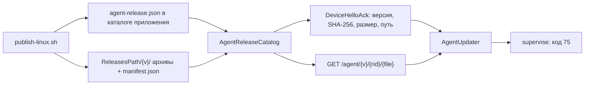

# Раздача и обновление агента устройства

Как агент локальных проектов ([ADR-016](../adr/ADR-016-local-projects.md), раздел «Раздача и
обновление агента») попадает на машину пользователя, как живёт там и как обновляется.
Решения и их обоснования — в ADR и в
[плане](../research/agent-distribution-plan-2026-09.md) (Р1–Р12); здесь — устройство и
операции. Код агента — `ClaudeHomeServer.DeviceAgent` (`Install/`, `Supervision/`, `Update/`,
`Versioning/`), раздача — `ClaudeHomeServer.Desktop/AgentReleaseCatalog.cs` и
`Controllers/AgentDownloadsController.cs`.

## Путь версии от выкатки до устройства



1. Выкатка (`scripts/ops/publish-linux.sh`) после сервера последовательно публикует агента
   под `win-x64` (zip) и `linux-x64` (tar.gz) и кладёт архивы с `manifest.json` в каталог
   релизов, а указатель текущей версии `agent-release.json` — в каталог приложения.
2. `AgentReleaseCatalog` читает указатель и манифесты, `DeviceExecChannel` кладёт в ответ на
   hello (`DeviceHelloAck`) `AgentMinVersion`, `AgentLatestVersion` и под RID, который агент
   объявил сам, — `AgentArchiveSha256`, `AgentArchiveSize`, `AgentArchivePath`.
3. Агент качает архив анонимной ручкой, сверяет размер и SHA-256 с ack, распаковывает в
   `versions/{v}` и между работой выходит с кодом 75; супервизор поднимает новую версию.

## Версия и совместимость

- **Версия агента — номер выкатки** `1.<git rev-list --count HEAD>.0`; грязное дерево даёт
  `1.N.0-dirty.<yyyyMMddHHmmss>`. Разбор и сравнение — `DeviceAgentVersion` (Core); хвост
  `+sha` из `InformationalVersion` — метаданные: в сравнении не участвует, в имя каталога и
  URL не попадает.
- **Каноническая версия (без `+sha`) — единственная форма на диске и в протоколе**: имя
  каталога `{ReleasesPath}/{v}`, поле `version` манифеста и указателя, `versions/{v}` на
  устройстве. Каталог релизов пропускает каталог и манифест, чья версия не каноническая.
- **Цель — ровно версия, которую назвал сервер** (`AgentLatestVersion`), в том числе ниже
  текущей: откатили сервер — откатится и агент.
- **Минимальная версия — константа кода** `DeviceAgentCompatibility.MinVersion` (сейчас
  `1.0.0`), а не настройка. Её поднимают вместе с ломающей правкой протокола. Агент ниже
  минимума (и агент с неразбираемой версией) получает отказ хода `DeviceExecRefusal.AgentOutdated`
  до открытия канала; `ProjectCapabilities` различает «агент обновляется» и «обновите агента».
  Сравнение с минимумом — только в `DeviceAgentCompatibility.IsOutdated`.

## Раскладка на устройстве

Каталоги — `AgentPaths.ForCurrentUser()`, всё в профиле пользователя, прав администратора не
нужно:

| | Windows | Linux |
|---|---|---|
| Конфиг | `%APPDATA%\AiHomeAgent` | `${XDG_CONFIG_HOME:-~/.config}/ai-home-agent` |
| Данные (корень установки) | `%LOCALAPPDATA%\AiHomeAgent` | `${XDG_DATA_HOME:-~/.local/share}/ai-home-agent` |

В конфиге — `agent.json` (сопряжение: сервер, устройство, отпечаток, выбранное хранилище
токена), `roots.json` (разрешённые корни проектов) и файл токена, если токен лежит в файле.
Корень установки:

```
versions/{v}/ai-home-agent(.exe)   распакованная версия целиком
versions/{v}/healthy               версия получила успешный ack на hello
versions/{v}/bad                   версия откачена (UTC-время внутри)
active                             имя активной версии
previous                           имя прошлой версии — цель отката
current -> versions/{v}            только Linux: симлинк, его запускает unit
bin/ai-home-agent.cmd              только Windows: шим команды по имени, читает active
supervisor.pid, supervisor.lock    работающий супервизор
logs/                              журнал супервизора и дочернего (файл + одна ротированная копия)
staging/                           недокачанные версии, чистится при старте
cli/                               управляемые копии claude CLI (ADR-016 §3)
claude-profile/                    CLAUDE_CONFIG_DIR ходов: транскрипты для --resume
turns/, journal/                   каталоги и журнал ходов
```

**Команда `ai-home-agent` по имени** (`CommandShim`): её копирует человек из подсказок UI
(`ai-home-agent roots add …`), а путь `versions/{v}` меняется с каждым обновлением, поэтому
в PATH лежит стабильный шим. Windows — `bin\ai-home-agent.cmd` читает `active` при каждом
запуске, каталог `bin` дописывается в PATH пользователя (`HKCU\Environment`, видят новые окна
терминала). Linux — симлинк `~/.local/bin/ai-home-agent` на `current/ai-home-agent`; каталога
нет в PATH — `install` говорит об этом, чужой файл на месте шима не трогается. Ставит `install`,
снимает `uninstall`; сбой шима установку не роняет.

Указатели `active`, `previous` и симлинк `current` меняются атомарно (запись в `.tmp` и
переименование поверх, примитив `VersionedDirectory`, общий с `ManagedCli`). Мусор в
указателе равен отсутствию версии: имя версии проверяется до того, как попадёт в путь.

**Хранилище токена** (`DeviceTokenStores.Choose`): Windows — DPAPI; Linux — Secret Service
через `secret-tool`, если он есть, иначе файл `0600`. С `install --always-on` на Linux токен
всегда в файле: при загрузке с linger связка ключей сеанса закрыта.

## Автозапуск

- **Windows** — значение `AiHomeAgent` в `HKCU\Software\Microsoft\Windows\CurrentVersion\Run`
  на `versions/{v}\ai-home-agent.exe supervise`. Без администратора; живёт, пока пользователь
  вошёл в систему. Запись переписывается при каждом переключении версии.
- **Linux** — unit `systemd --user` `~/.config/systemd/user/ai-home-agent.service`:
  `ExecStart=<корень>/current/ai-home-agent supervise`, `Restart=on-failure`. Linger
  (`loginctl enable-linger`) включается только с `install --always-on`; не разрешили —
  `install` печатает команду для администратора. Нет `systemd --user` (WSL1, контейнер) —
  файлы ставятся, агент сопрягается, а как запускать руками, печатается; это не ошибка.

## Контракт супервизора (заморожен)

`ai-home-agent supervise` поднимает дочерний `run` и переживает его выходы. Супервизор
обновляется **лениво** — при следующем входе или перезагрузке, когда автозапуск уже смотрит
на новую версию, — поэтому супервизор версии N обязан поднимать дочерний версии N+k.
Контракт — `Supervision/SupervisorContract.cs`, держит его тест
`SupervisorContractTests.Супервизор_поднимает_дочерний_новой_версии_из_фикстуры` (значения в
фикстуре записаны литералами):

| Элемент | Значение |
|---|---|
| Дочерний | `{root}/versions/{v}/ai-home-agent(.exe) run`, аргументы ровно `run`, рабочий каталог — каталог версии |
| Активная версия | файл `{root}/active` |
| Цель отката | файл `{root}/previous` |
| «Версия здорова» | файл `versions/{v}/healthy`, путь приходит дочернему в `AI_HOME_AGENT_HEALTHY_FILE`; пишется после успешного ack на hello |
| «Версия плохая» | файл `versions/{v}/bad` с UTC-временем |
| «Переключись» | код выхода **75**: перечитать `active` и поднять версию без паузы |
| Гибель вместе с супервизором | PID супервизора — в `AI_HOME_AGENT_SUPERVISOR_PID` (Windows — Job, Linux — PDEATHSIG) |

Поведение (`AgentSupervisor`):

- любой код, кроме 75, — перезапуск с бэкоффом 1 → 2 → 4 … → 60 с; дочерний, проживший 5 мин,
  сбрасывает бэкофф;
- версия без `healthy` за 60 с или упавшая до него — дочерний убивается, версия помечается
  `bad`, `active` возвращается на `previous`, автозапуск переписывается;
- версия с `bad` моложе суток не пробуется — сразу откат;
- откатываться некуда (нет `previous`, она не установлена или тоже плохая) — версия продолжает
  работать: агент, который ещё не дозвонился до сервера, лучше, чем никакого.

**Правка контракта ломает уже установленных агентов.** Новое поле — только аддитивно, так,
чтобы старый супервизор его не заметил; смена кода, имён файлов или аргументов запрещена.

## Самообновление

`AgentUpdater` (дочерний `run`):

1. Цель — `AgentLatestVersion` из ack. Совпала со своей — `idle`.
2. Путь из ack принимается только в форме `{версия}/{свой RID}/{имя архива}` (`.zip` или
   `.tar.gz`, без разделителей пути); размер — не больше 1 ГиБ.
3. Скачивание — в `staging`, размер и SHA-256 сверяются потоком с ack. Архив без совпадения
   отвергается, даже пришедший по TLS: хеш — из аутентифицированного канала устройства, архив —
   из анонимного.
4. Распаковка (оба распаковщика не пишут за пределы каталога) и перенос в `versions/{v}` одним
   `Directory.Move`.
5. **Переключение только между работой.** `ActivityRegistry` держит аренды ходов и запросов
   ретранслятора (координатор), терминалов и дев-серверов (`AgentLauncherFactory`). Пока он не
   пуст — `waiting-idle` с причиной («обновление ждёт: открыт терминал»); новые ходы при этом
   не блокируются. Пуст — реестр запечатывается, `active`/`current` и автозапуск
   переставляются, агент выходит с кодом 75.
6. Уборка оставляет активную, прошлую, свою версию и версию супервизора; версия супервизора
   неизвестна — не удаляется ничего.

Состояние (`idle` / `downloading` / `waiting-idle` / `failed` + целевая версия + причина)
уходит в `DeviceHello.AgentUpdate`; смена состояния повторяет hello, UI показывает его в
строке устройства. Сбой скачивания или проверки — `failed` и повтор по бэкоффу, `active` не
тронут. Версия с `bad` не пробуется, пока не пройдут сутки или сервер не назовёт другую.

## Установка и удаление

Команда из «Устройства → Подключить компьютер» (UI собирает её из `window.location.origin`):

- Windows: `& ([scriptblock]::Create((irm https://S/agent/install.ps1))) -Server https://S -Code КОД`
- Linux: `curl -fsSL https://S/agent/install.sh | sh -s -- --server https://S --code КОД`

Скрипты (`deploy/agent-install/`, в сервер встроены ресурсом) определяют RID, берут
`/agent/manifest.json`, качают архив, сверяют размер и SHA-256, распаковывают в
`versions/{v}` и зовут `ai-home-agent install --server … --code … [--name …] [--always-on]`.
`install` (`AgentInstaller`): сопряжение → хранилище токена → `active` (маркеры версии
сброшены) → команда по имени → автозапуск → отсоединённый запуск супервизора → ожидание `healthy` до 30 с.
Переустановка поверх работающего агента — новое сопряжение, старый супервизор гасится.
Коды выхода: 0 — готово, 2 — сопряжение не прошло, 20 — установлен, но окно установки не
отпустило процесс (запустится при следующем входе), 21 — запущен, но первого hello за 30 с не
было, 64 — неверные аргументы.

`uninstall [--purge]` (`AgentUninstaller`, Р12):

1. снимает автозапуск (первым: иначе `Restart=on-failure` поднял бы убитый процесс);
2. гасит супервизор по `supervisor.pid` (только если PID и правда агент), дочерний гибнет
   вместе с ним;
3. отзывает своё устройство — `DELETE /api/devices/self` под схемой устройства (токен +
   отпечаток; веб-JWT ручку не открывает, какое устройство — берётся из токена). Устройство
   становится надгробием, как при отзыве из веба. Сервер недоступен — печатается «отзови в
   веб-интерфейсе»;
4. стирает токен и `agent.json`, снимает команду `ai-home-agent` по имени;
5. `--purge` (с предупреждением) удаляет корень установки, каталог данных и конфиг: версии,
   копии CLI, журнал, профиль CLI с транскриптами локальных чатов. На Windows каталог
   запущенной версии может не удалиться — остаток убирается руками.

## Сервер: раздача

**Анонимные ручки** `AgentDownloadsController` (`[AllowAnonymous]`,
`[EnableRateLimiting("agent-download")]`, по IP, `DeviceAgent:DownloadRateLimit` запросов в
минуту, по умолчанию 30), `GET` и `HEAD`:

- `/agent/install.ps1`, `/agent/install.sh` — встроенные ресурсы, с диска не читаются;
- `/agent/manifest.json` — указатель текущей выкатки, не каталог;
- `/agent/{version}/{rid}/{file}` — `rid` из белого списка `DeviceAgentRids`
  (`win-x64`, `linux-x64`), `version` — из каталога, `file` — имя архива из её манифеста. Строки
  запроса только сравниваются, путь к диску строится из манифеста; иначе 404.

Сервер не раздаёт агента (нет каталога, нет указателя, указатель не совпал с манифестом,
выключена подсистема `Desktop`) — 503 с причиной `Сервер не раздаёт агента: …`, ack без
`AgentLatestVersion`, агенты не обновляются. Так работают дев-стенд и docker.

**Настройки** (машинные — в `appsettings.Local.json`):

| Ключ | Смысл |
|---|---|
| `DeviceAgent:ReleasesPath` | каталог релизов, на проде `/opt/ccs/agent-releases`; не задан — агент не раздаётся |
| `DeviceAgent:ReleasePointerPath` | путь указателя; не задан — `agent-release.json` рядом со сборкой сервера |
| `DeviceAgent:DownloadRateLimit` | потолок запросов раздачи в минуту с одного IP |

**Каталог релизов** живёт вне каталога приложения: `rsync --delete` выкатки его не видит.
Раскладка `{v}/manifest.json` и `{v}/agent-{v}-{rid}.{zip|tar.gz}`; формат указателя и
манифеста один:

```json
{ "version": "1.123.0",
  "archives": { "win-x64": { "file": "agent-1.123.0-win-x64.zip", "size": 1, "sha256": "…64 hex…" } } }
```

Каталог проверяет всё, что пришло с диска (RID из белого списка — незнакомые пропускаются,
SHA-256 — 64 hex, имя архива без разделителей пути, версия каноническая и равна имени
каталога), битый манифест выпадает целиком. Снимок кэшируется до смены mtime указателя —
выкатка пишет указатель последним.

**Выкатка** (`publish-linux.sh`): `AGENT_RELEASES` (по умолчанию
`$(dirname PUBLISH_DIR)/agent-releases`), `AGENT_ONLY=1` — только релиз агента (дев-стенд),
`SKIP_AGENT=1` — без агента, `AGENT_KEEP` — сколько версий хранить (по умолчанию 4). Сборка
агента упала — предупреждение, в staging копируется прошлый указатель, сервер выкатывается и
раздаёт прошлую версию агента. Ротация оставляет `AGENT_KEEP` каталогов, свежайших по
обратной лексикографической сортировке имён.

> **Известное расхождение (2026-09-26, дефект `c3a3d927`).** Для чистого дерева скрипт сейчас
> пишет версию с хвостом `+sha8` в имя каталога, манифест и `-p:Version`, а каталог релизов
> такую версию не принимает — боевая выкатка раздаёт агента, только когда дефект исправлен.
> Контракт — как описан выше: на диске и в протоколе каноническая версия, `+sha8` — только в
> `InformationalVersion`.

## Операции

**Откатить агента.** Штатный путь — откатить сервер: выкатка старого коммита выпускает его
версию агента и пишет её в указатель, агенты после рестарта сервера переподключаются, получают
в ack старую версию и уходят на неё (Р2). Без пересборки — вернуть указатель на версию, которая
ещё лежит в каталоге релизов:

```bash
cp /opt/ccs/agent-releases/1.N.0/manifest.json <каталог приложения>/agent-release.json
```

Каталог перечитается по mtime сразу, но агенты узнают версию только на следующем hello — при
переподключении к хабу (рестарт сервера) или смене своего состояния; принудительной рассылки
нет. Ротация хранит несколько последних версий: откат глубже `AGENT_KEEP` — только
пересборкой.

**Версия не запустилась на устройстве.** Супервизор откатил её сам и пометил `bad` на сутки;
причина — в `logs/` корня установки. В UI строка устройства показывает
«обновление не удалось: …».

**Выключить раздачу.** Убрать `DeviceAgent:ReleasesPath` или указатель — ручки ответят 503,
агенты останутся на своих версиях. Ходы продолжаются, пока версия агента не ниже
`MinVersion`.

**Удалить агента с машины.** `ai-home-agent uninstall` из каталога активной версии (или
`--purge`, чтобы стереть и данные). Устройство, до которого агент не дотянулся, отзывается в
веб-интерфейсе, раздел «Устройства».

## Остаточные риски

- Доверие к обновлению держат TLS с системными CA и SHA-256 из аутентифицированного канала
  устройства; отдельной подписи релизов и пининга сертификата нет — почему, в ADR-016.
- Windows Run живёт только при вошедшем пользователе; агент без входа — это служба и
  администратор, отдельный шаг.
- Грязные сборки на проде дают версию `-dirty`: безопасно (точное совпадение), но каждая такая
  выкатка — обновление всех устройств.
