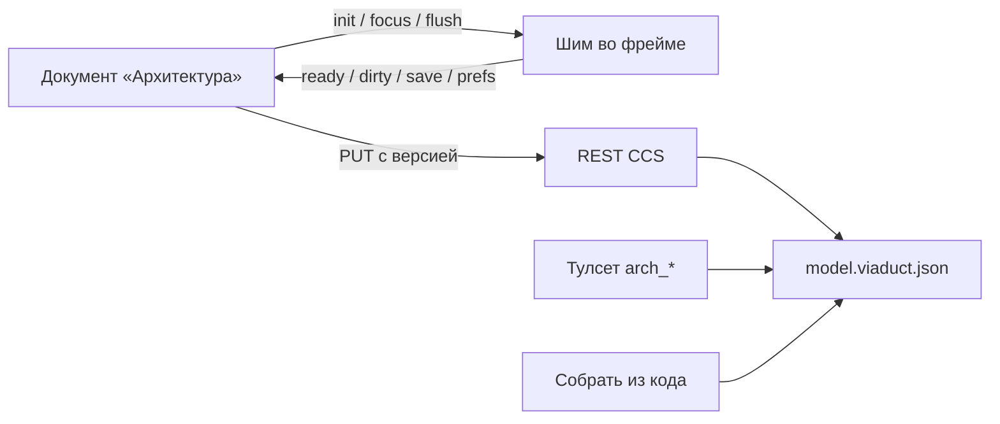

# Раздел «Архитектура» (C4-схема проекта в Viaduct)

Тип: features · Статус: пилот, включается конфигом модуля · Дата: 2026-09-26
Решение и лицензионные рамки — [ADR-016](../adr/ADR-016-viaduct-architecture-section.md);
установка и обновление сборки редактора — [viaduct-module.md](../operations/viaduct-module.md);
разведка и план серии — [viaduct-embed-plan.md](../research/viaduct-embed-plan.md).

## Что это для человека

Панель «Архитектура» в рельсе проекта (после «Графа») и документ в центре: C4-схема
проекта — система, контейнеры, компоненты и связи — в редакторе
[Viaduct Community](https://github.com/quietgridlabs/viaduct). Модель лежит обычным файлом
в проекте, поэтому её видно в git diff, её читают и правят персоны через MCP, а схему можно
собрать из кода одной кнопкой и дальше доводить руками.

## Где что живёт

| Что | Где |
|---|---|
| Файл модели | `docs/architecture/model.viaduct.json` в корне проекта (под git) — persist-обёртка стора Viaduct, с отступами для построчного diff |
| Метаданные | `docs/architecture/model.viaduct.meta.json` — кто и когда правил, время снимка графа у последней сборки из кода |
| Вертикаль | `backend/ClaudeHomeServer.Architecture` — динамический модуль (запись `architecture` в `DynamicModules`, грузит `ModuleLoader`): `ArchitectureSubsystem`, хранилище, генератор, MCP-тулсет, раздача Viaduct |
| REST | [ArchitectureController.cs](../../backend/ClaudeHomeServer.Architecture/Controllers/ArchitectureController.cs) — в вертикали; снимок графа кода приходит через Core-шов `IArchitectureCodeSource` (опциональный: CodeGraph выключен → `503 graph_unavailable`) |
| Фронт | исходники — `frontend/src/features/architecture/`; MF-remote — `frontend/modules/architecture` (тонкий entry `./subsystem`), раздаётся по `/architecture-remote/` |
| Мост | [scripts/viaduct-shim.js](../../scripts/viaduct-shim.js) — инжектится в `index.html` Viaduct при сборке |

REST (владелец проекта, `[Authorize]`):

- `GET /api/projects/{id}/architecture/model` — содержимое как есть + версия (SHA-256) + кто/когда;
- `PUT …/model` с `baseVersion` — устаревшая версия → `409 version_conflict` с текущим состоянием;
- `POST …/generate` — «Собрать из кода»; повреждённый файл → `model_corrupt`, генератор его не перезаписывает.

Подсистема отключаема (`Subsystems:architecture:Enabled`): выключена — модуль не
загружается (ModuleLoader не зовёт `Register` и не подключает контроллер), REST-маршрутов
и ветки `/modules/viaduct` нет, тулсета у хода нет. Фич-флага у раздела нет (снят 2026-09-26):
раздел в UI виден всем, как только оба вклада remote на месте, а тулсет у хода гейтят только
загрузка модуля, гейт подсистемы и привязка персоны. Гейт проверяет ModuleLoader до `Register`,
как у Notes. Старый override `architecture` в `data/users.json` безвреден: `GetEffective`
идёт по каталогу, неизвестные ключи игнорирует.

## Как устроено

- **Iframe-песочница** `sandbox="allow-scripts allow-downloads"`, без `allow-same-origin`:
  у фрейма opaque origin, ни куки, ни хранилищ CCS он не видит, токена и адресов API в нём нет.
  Модель приезжает сообщением `init`, хост принимает сообщения только от окна своего фрейма.
- **Шим** подменяет `localStorage`/`sessionStorage` фрейма in-memory, держит бандл до `init`,
  дебаунсит запись модели (1200 мс) и отдаёт её сообщением `save`; на `pagehide` и по
  `flush` отдаёт отложенное сразу. Настройки вида (`c4-*`) уезжают отдельным `prefs` и живут
  в localStorage страницы CCS под `viaduct-prefs:{projectId}`, в файл не пишутся.
- **Сохранение** — PUT с версией, от которой шли правки. Совпало по смыслу с файлом
  (канонический JSON) — PUT не шлём, иначе первая же гидратация редактора переформатировала
  бы файл. Каждые 30 с (и по фокусу окна) документ сверяет версию: чужая правка без своих
  несохранённых — тихая перезагрузка холста, со своими — плашка конфликта с выбором
  «Перезагрузить» / «Скачать мои правки».
- **Сборка из кода** — сканер проектов-маркеров (`.csproj`, `package.json`) + снимок графа
  кода → контейнеры и компоненты; правило свёртки путей — единственное место
  `ArchitecturePathFolding`. Слияние с лежащим файлом (`ArchitectureModelMerger`):
  найденный элемент (по стабильному id, затем по имени в том же родителе) не
  перезаписывается — описание, позиция, docs/sequence/flows сохраняются, дописываются только
  пустые `description`/`technology`; ручные элементы и связи не удаляются никогда, связи
  только добавляются.
- **MCP-тулсет `architecture`** (http-only, `POST /mcp/architecture/{sessionId}`):
  `arch_context`, `arch_search`, `arch_get_element`, `arch_create_element`,
  `arch_update_element`, `arch_delete_element`, `arch_set_connection`. Файл — в корне ПРОЕКТА,
  а не worktree сессии (иначе правка персоны не видна в разделе). Запись — со сверкой версии,
  как у REST. Создание: родитель строго на ступень выше, id — UUID (как у элементов
  редактора), позиция — первая свободная клетка сетки генератора (`FreeCell`), имя, занятое у
  того же родителя, — отказ. В проекте без файла модели первым создаётся system: заводится
  пустая модель той же формы, что пишет генератор (`ArchitectureModelMerger.EnsureShape`),
  запись идёт с `baseVersion = null` — второй «первый» создатель получает конфликт, а не
  затирает; не-system в пустом проекте — отказ. Удаление уносит вложенные, связи в обе
  стороны и документы; элемент ЛЮБОГО уровня с вложенными — только с `cascade: true`, иначе
  отказ с перечнем детей (нет прямых — перечисляются найденные потомки); холст,
  стоявший внутри удалённого, возвращается на уровень систем. Гейты состава — загрузка
  модуля, гейт подсистемы и Off-привязка персоны `tool:architecture`; профиль «Только чтение» видит
  пишущие инструменты, но вызов отклоняется. `DelegatedTurnGate` осознанно не ставится:
  правка модели — не делегирование и не рассылка.
- Запись файла сериализует общий `ArchitectureFileGate`: сохранение из редактора, сборка из
  кода и правка персоны не пишут файл вперемешку.

## Кнопка «Собрать архитектуру»

Одна кнопка собирает модель всех уровней в два прохода.

- **Проход 1 — детерминированный (бэк).** Контейнеры и компоненты — как у «Собрать из кода»
  выше. Плюс **кандидаты L1** — внешние системы и хранилища, найденные по косвенным
  признакам; каждый заводится элементом с тегом `кандидат`. Источники: `appsettings.json` и
  `appsettings.{Env}.json` (имена секций; `appsettings.Local.json` не сканируется — правило
  по имени файла), сервисы docker-compose без `build` (чужой образ), имена HTTP-клиентов.
  Значения конфигов не читаются никогда: адреса и ключи в модель не попадают.
- **Происхождение** каждого элемента пишется в meta рядом с моделью (генератор / редактор /
  персона). Элемент, заведённый сборкой и пропавший из кода, получает тег `нет в коде` (и
  отметку `missingSince`), вернулся — тег снимается. Удалённый руками элемент сборка не
  воскрешает (`userDeletedAt` в meta).
- **Галочка «С агентом» — проход 2.** После прохода 1 создаётся задача исполнителю-архитектору
  проекта: персона `Specialty == Planner` с доступом к `arch_*` на запись; такой нет — задача
  без персоны (обычный исполнитель Claude), а не отказ. Модель задачи — слот strong. Агент
  выверяет кандидатов и дополняет модель через тулсет `arch_*`. Двойной запуск ловится по
  метке задачи `arch-build`: 409 `build_in_progress` с `agentTaskId` идущей сборки; проверка
  идёт ДО прохода 1 (ранний отказ), окончательная — под замком при постановке. Шва агента нет —
  503 `agent_unavailable`, модель при этом собрана без агента.
- **Плашка прогресса** над холстом ведёт фазу задачи: `running` (исполнитель работает),
  `stalled` (задача не закрыта, но и не идёт — перезапустить или закрыть), `done`, `failed`.
- **«Стоп» исполнителя** ставит задаче пометку `interrupted_by_user` (не ошибка), новый ход
  в чате задачи её снимает.

## Известные ограничения

- **Командная реализация: остановленная человеком подзадача не уходит в `TeamTaskFailed`.**
  Пометка `interrupted_by_user` — не отказ, штаб такую подзадачу провалом не считает и ждёт
  продолжения.
- **Тег `кандидат` занимает один из трёх слотов тегов Viaduct** у элемента L1.
- **Правка, сделанная меньше чем за 1,2 с до перехода в другой проект, теряется.** Она ещё
  лежит в дебаунсе шима; при смене проекта стор отбрасывает сообщения от прежнего фрейма
  (метка `projectId` + `frameKey`) и очищает очередь сохранений. Это осознанная цена защиты
  от записи правки старого холста в файл чужого проекта.
- **Старые модели сохраняют имя «(корень)».** Компонент из файлов прямо в корне контейнера
  генератор теперь называет по контейнеру, но пересборка найденные элементы не
  переименовывает — ручные имена этим же правилом защищены от затирания. Переименовать
  старый «(корень)» — руками на холсте или через `arch_update_element`.
- **Статика `/modules/viaduct` — под тумблером подсистемы.** Выключенный или незагруженный модуль ветку не ставит: корень уходит в SPA-фолбэк CCS, ассеты с расширением получают 404. Подробности — [viaduct-module.md](../operations/viaduct-module.md).
- **На телефоне холст только для просмотра.** Мобила открывает список-обзор, схема — по
  кнопке, и режим «Только просмотр» включается сам: пальцем на 360 CSS px холст не правят.
- **Родного `readOnly` у Viaduct в локальном режиме нет**: «Только просмотр» значит «правки
  на холсте не сохраняются», холст при этом двигается; при выходе из просмотра холст с
  расхождением пересоздаётся из файла.
- **Конфликт двух окон** решается «последний проигрывает с плашкой», реалтайм-мержа нет.
- **Monaco (редакторы docs/sequence/контрактов) грузится с CDN и режется CSP** — канва C4 от
  этого не зависит; см. [viaduct-module.md](../operations/viaduct-module.md#известные-ограничения-к-задаче-шима).
