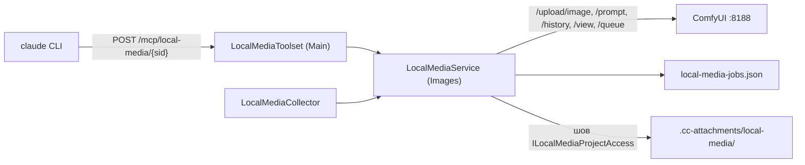

# Локальная генерация картинок и видео (`local-media`)

> Тулсет и гейты — [mcp-toolsets.md](../architecture/mcp-toolsets.md), раздел «local-media»;
> облачная генерация картинок продукта — [image-generation.md](image-generation.md).

MCP-сервер `local-media` даёт агенту в чате проекта наши модели на своей GPU: ComfyUI на
хосте `ai` (`comfyui-h3.service`, :8188, одна RTX 3090, **одна общая очередь** на фото и
видео). По форме он повторяет облачных соседей (fal, Higgsfield): генерация асинхронная,
вызов ставит задачу и сразу отдаёт `job_id`, результат ждут `local_jobs_wait`.

Агент идёт в `local-media` **только по явной просьбе** «локально», «нашими моделями»,
«бесплатно». По умолчанию генерация уходит в облако (glif, запасной fal-ai). Это правило
живёт в строке встроенного промпта (`ProjectManager.BuiltInSystemPrompt`, абзац про
медиа) и в описаниях самих инструментов.

## Модели и операции

| Инструмент | Модель | Что делает | Время |
|---|---|---|---|
| `local_generate_image` | Qwen-Image 2.1 (bf16) | картинка по тексту, 1–4 варианта, 7 соотношений сторон | ≈45 с на картинку (25 шагов) |
| `local_edit_image` | Qwen-Image 2.1, правка | правка по 1–16 референсам, первая картинка — холст | ≈60 с |
| `local_face_detail` | FaceDetailer (YOLOv8m + Qwen-Image) | доводка лиц на готовой картинке | ≈25 с |
| `local_text_to_video` | MiniMax H3 fl2va + turbo-LoRA 8 шагов | видео со звуком по тексту, 24 fps, 1–10 с | см. ниже |
| `local_image_to_video` | то же | видео от первого кадра, необязательно и до последнего (`last_frame`) | см. ниже |
| `local_reference_to_video` | MiniMax H3 ref2va + turbo-LoRA 4 шага | видео по референсам: 1–9 картинок, до 3 видео (2–15 с), до 3 звуков | не замерено |
| `local_video_upscale` | Latent Upscaler 3D + донастройка 3 шага | апскейл видео прошлой t2v/i2v-задачи до 1440p (2528×1440) или 2K (2688×1536) | см. ниже |
| `local_video_inpaint` | ref2va + Fun ControlNet Union, 4 шага | перерисовка области видео по маске (белое — заново), вне маски — исходник | см. ниже |
| `local_job_status`, `local_jobs_wait` | — | статус и ожидание (до 15 с за вызов, до 12 задач) | — |
| `local_models` | — | операции, размеры, длина очереди ComfyUI | — |

Время видео — зачётные прогоны замера d653be60 (одна RTX 3090, модели уже загружены).
Первый прогон после простоя, с загрузкой моделей, идёт примерно столько же; ожидание
очереди сверху.

| Операция | Размер | Длина | Обычный, с | `fast`, с |
|---|---|---|---|---|
| картинка → видео | 1344×768 | 5 с | 333 | 234 |
| картинка → видео | 1344×768 | 10 с | 943 | 585 |
| картинка → видео | 864×480 | 5 с | 94 | не замерено (берём обычный) |
| текст → видео | 1344×768 | 5 с | 310 | не замерено (берём обычный) |
| инпейнт | 864×480 | 5 с | 98 | — |
| апскейл 1440p по тайлам | ролик 1344×768 | 5 с | 915 | — |
| апскейл 1440p одним проходом | ролик 1344×768 | 5 с | 1065 | — |
| апскейл 2K по тайлам | ролик 1344×768 | — | не замерено | — |

`eta_seconds` в ответе на постановку считается только по этой таблице: короче 5 с — по
5-секундной точке, между 5 и 10 с у картинки → видео `full` — по прямой. Где точки нет
(`half` 10 с, текст → видео 10 с, инпейнт `full`, апскейл 2K, референсы), `eta_seconds` в
ответе нет, а в `local_models` у варианта стоит `null` — время не обещаем.

Размеры видео — `full` 1344×768 и `half` 864×480. У портретного кадра стороны меняются
местами: картинку не обрезаем. У видео по тексту и по референсам ориентацию задаёт
`orientation`. Длина клипа идёт по сетке H3 17k+5 кадров при 24 fps (5 с = 124 кадра,
10 с = 243).

### Режим fast

`fast=true` — режим AS бенча: нода `BlockSparseAttention` (sol-attn, tau 1.3, с 20 % шагов)
между Sage и MultiStream плюс `H3MultiStream.sparse_attention=true`. Без явного `fast`
действует `VideoFastDefault`, по умолчанию `true`: по замеру картинка та же на глаз, а
быстрее в 1,4–1,6 раза. Sparse меняет тайминг движения, поэтому для точного повтора ролика
по `seed` нужен явный `fast=false`.

### Апскейл по латенту

Видео по тексту и по кадру дополнительно сохраняют AV-латент: `LTXVSeparateAVLatent` плюс
два `SaveLatent` в `output/ccs-local-media/latents/{jobId}_{video|audio}_00001_.latent`.
Путь латента попадает в стор задачи, а в проект не пишется. `local_video_upscale` принимает
только `job_id` такой задачи этого владельца и проекта (размер `full`). Произвольный mp4 не
годится: латентный апскейлер работает только со своим латентом. Перед постановкой оба
латента скачиваются через `/view` и загружаются в **корень** input ComfyUI как
`ccs-local-media-{jobId}-{video|audio}.latent`. Корень обязателен: у `LoadLatent` нет
`VALIDATE_INPUTS`, он сверяет имя со списком файлов корня input, и подпапку валидация
отвергнет. Conditioning на целевом размере пересобирается из промпта и первого кадра
исходной задачи (имя кадра в input ComfyUI тоже лежит в сторе).

2K идёт только тайлами (`MMH3SplitUpscale`), 1440p — одним проходом или тайлами по
`Upscale1440Mode`, по умолчанию `tiled`: на замере он быстрее (915 с против 1065) при той же
картинке, а одному проходу видеопамяти хватает впритык.

### Инпейнт и референсы

Инпейнт принимает mp4 из проекта (или `job_id` готового видео). Размер видео должен быть из
белого списка (full/half в любой ориентации), длительность — не больше `MaxVideoSeconds`,
маска — PNG того же размера. Длительность и размер читаются из контейнера (`MediaProbe`,
атомы mvhd/tkhd/hdlr) без ffprobe.

Инпейнт — точечная правка: модель перерисовывает весь кадр (на замере вне маски менялось
лицо и сдвигалась рама, PSNR с исходником 19,8 дБ), поэтому после `VAEDecode` исходник
накладывается обратно. Маска расширяется на 8 px (`GrowMask`) и размывается
(`MaskToImage` → `ImageBlur` радиусом 15, sigma 5 → `ImageToMask`): так шов мягкий.
`ImageCompositeMasked` кладёт сгенерированное внутри маски на исходные кадры, обрезанные до
длины генерации (`ImageFromBatch`). Звук и fps берутся из исходника (`GetVideoComponents`),
сгенерированный звук не декодируется. Всё на core-нодах ComfyUI; `FeatherMask` не подходит,
он растушёвывает края кадра, а не границу маски. У референсов autogrow-входы
`MiniMaxH3ReferenceToVideo` нумеруются с нуля (`ref_images.ref_image_0`), звук каждого
референс-видео идёт в парный `ref_video_audios.ref_video_audio_N`. `identity=max`
(`ref_image_size=max`) держит референсы в 2048 px по короткой стороне и работает в разы
медленнее.

**Тяжёлые операции** — апскейл, инпейнт и референсы с `identity=max`. У владельца
одновременно идёт не больше одной такой задачи (`LocalMediaJob.Heavy`), лёгкие этим лимитом
не ограничены.

## Почему граф только из шаблонов

Граф ComfyUI собирается в коде (`ComfyWorkflows`) по образцу рабочих скриптов стенда:
`~/ComfyUI/qwen-image21-1gpu-api.json` и `run_gen.py`, `run_edit.py`, `run_facedetail.py`;
видео H3 — по эталонам `~/ComfyUI-h3-tools/workflows/` (генератор `build_workflows.py`,
все прошли `validate_prompt`). **Произвольный
граф снаружи не принимаем никогда.** Custom nodes ComfyUI (KJNodes, Impact) читают и пишут
файлы хоста, так что «свой граф от модели» равен выполнению кода на сервере. Снаружи в граф
попадают только проверенные значения: текст промпта (строкой, не структурой), seed, размер
из белого списка, число шагов в пределах 4–40, длина по сетке и имена файлов, которые мы
сами загрузили в input ComfyUI. Сторож — `ComfyWorkflowsTests`:

- список допустимых классов нод;
- сверка графов H3 с копиями эталонов стенда (`ClaudeHomeServer.Images.Tests/Images/ComfyReference/`)
  целиком, нода в ноду;
- валидатор всех шаблонов по снимку `object_info` стенда (`object_info_subset.json`): входы,
  типы связей, списки значений, диапазоны.

Валидатор заменяет `validate_prompt`, когда живая очередь занята. Снимок снят офлайн на CPU,
поэтому списки устройств и файлов input он не сверяет. Поменялась нода на стенде — обнови
эталон и подрезку снимка (классы из `AllowedClasses`).

Каждый `/prompt` уходит с `extra_data.preview_method = latent2rgb`. Без него превью TAEHV
под DynamicVRAM роняет процесс ComfyUI на H3, а процесс общий для всех.

## Куда ложится результат

Результат пишется в `.cc-attachments/local-media/{yyyy-MM-dd}/{jobId}-{n}.{png|mp4}` в папке
проекта чата: `SafePath.Join` плюс запрет символических ссылок (`ProjectLinkGuard`), затем
`NotifyMutated`. Каталог `.cc-attachments` скрыт из дерева файлов, из синка знаний и из git:
в проект не мусорим, а файл доступен через `GET /api/projects/{id}/files/stream?path=…`.
Нужен файл на виду — агент переносит его сам.

Ответ готовой задачи похож на ответ fal: `{"images":[{"url","content_type","width","height","path"}]}`
или `videos`. `url` указывает на тот же сервер, `path` — путь от корня проекта. Его можно
передать во вход следующей операции (как и `job_id` завершённой задачи этого проекта) и
показать в ответе картинкой ``. Показ ссылки из результата инструмента в ленте
(`MediaBlock`) делает фронт отдельной задачей.

## Лимиты и отказы

Настройки — секция `LocalMedia`, машинные значения только в `appsettings.Local.json`:

| Ключ | По умолчанию | Смысл |
|---|---|---|
| `Enabled` | `false` | машинный тумблер: сервер есть только там, где есть GPU |
| `ComfyUrl` | `http://127.0.0.1:8188` | ComfyUI слушает без авторизации, ходим только на loopback |
| `MaxQueuedPerOwner` | 2 | незавершённых задач одного пользователя |
| `MaxComfyQueue` | 4 | общая очередь ComfyUI (с чужими прогонами стенда); выше — честный отказ |
| `MaxVideoSeconds` | 10 | 15 с видео — это ≈30 мин GPU, в первой версии не даём |
| `VideoFastDefault` | `true` | `fast`, когда агент его не передал; по замеру та же картинка в 1,4–1,6 раза быстрее |
| `Upscale1440Mode` | `tiled` | донастройка апскейла до 1440p: `single` или `tiled`; tiled на замере быстрее и не впритык по видеопамяти |
| `PollIntervalMs` | 3000 | период опроса `/history` |
| `JobRetentionDays` | 7 | сколько помнить завершённые задачи (файлы остаются) |

Тумблер читается живьём: включение не требует рестарта, узел появится в конфиге хода со
следующим ходом. Отказ всегда приходит текстом (`isError`), с советом «попробуй позже или
сгенерируй в облаке», когда занята GPU.

## Изоляция

- Задачи хранятся в `data/local-media-jobs.json` и ключуются владельцем. Чужой `job_id`
  неотличим от несуществующего и во входе, и в статусе. Стор переживает рестарт бэкенда,
  пока задача стоит в очереди ComfyUI.
- Нужен проект, чьи файлы лежат на сервере. Вне проекта узла нет, у локального проекта
  (ADR-016) — отказ через `ProjectCapabilities.FilesOnServer`. ReadOnly-персоне сервер не
  положен: он пишет файлы.
- Входы берутся только из папки проекта чата. Картинки — до 30 МБ, видео и звук — до 90 МБ:
  потолок загрузки ComfyUI 100 МБ включает обёртку multipart.
- Латенты видео остаются в output ComfyUI, в сторе хранится только путь к ним.
- Фоновый `LocalMediaCollector` дописывает результат в проект, даже если агент закончил ход,
  не дождавшись видео.

## Устройство

Движок живёт в вертикали Images (`ClaudeHomeServer.Images/Services/LocalMedia/`): там
`ComfyClient`, `ComfyWorkflows`, стор, сервис и коллектор. Тулсет и адаптер шва
`LocalMediaProjectAccess` (проекты плюс `FileService`) — в Main. Выключенная подсистема
`images` означает отсутствие сервиса: тулсет честно отказывает, узла в конфиге хода нет.

## Вне рамок

Латенты видео (14–28 МБ на 5–10 с) и их копии в input ComfyUI копятся на стенде: срок
`JobRetentionDays` забывает задачу, но файлы ComfyUI не чистит. Уборка — отдельная задача.

ComfyUI слушает `0.0.0.0` без авторизации. Бэкенд ходит на 127.0.0.1, но сам порт стоит
закрыть (`--listen 127.0.0.1` или файрвол): это отдельная задача инфраструктуры.
