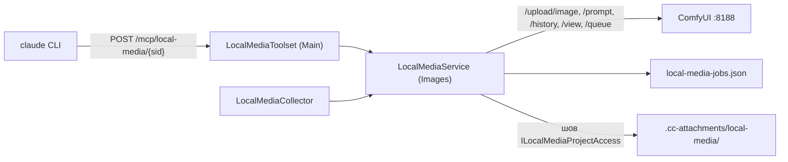

# Локальная генерация картинок, видео и звука (`local-media`)

> Тулсет и гейты — [mcp-toolsets.md](../architecture/mcp-toolsets.md), раздел «local-media»;
> облачная генерация картинок продукта — [image-generation.md](image-generation.md).

MCP-сервер `local-media` даёт агенту в чате проекта наши модели на своей GPU: ComfyUI на
хосте `ai` (`comfyui-h3.service`, :8188, одна RTX 3090, **одна общая очередь** на фото,
видео и звук — раздел «Аудио»). По форме он повторяет облачных соседей (fal, Higgsfield): генерация асинхронная,
вызов ставит задачу и сразу отдаёт `job_id`, результат ждут `local_jobs_wait`.

Без флага `local-media-default` агент идёт в `local-media` **только по явной просьбе**
«локально», «нашими моделями», «бесплатно», а по умолчанию генерация уходит в облако (glif,
запасной fal-ai). Это правило живёт в строке встроенного промпта
(`ProjectManager.BuiltInSystemPrompt`, абзац про медиа) и в описаниях самих инструментов. С
флагом локальная становится умолчанием — раздел «Умолчание за флагом `local-media-default`».

## Умолчание за флагом `local-media-default`

Флаг «Локальная модель по умолчанию» включается каждому пользователю отдельно в меню
«Экспериментальные функции» и по умолчанию выключен. С ним агент рисует картинки и видео
локальной моделью сам, без слова «локально». Сервис выбирается в таком порядке:

1. Сервис, названный в **текущей** просьбе («через fal», «в higgsfield», «локально»). Прошлые
   вызовы в чате не в счёт: если раньше рисовали локально, а сейчас попросили fal, берётся fal.
2. Поставщик, которого человек выбрал в полосе «Картинки» редактора.
3. Иначе — локальная модель. Облако (glif, fal-ai, higgsfield) — только если локальная
   недоступна и человек согласился. Согласие действует на одно действие и на следующие
   просьбы не переносится.

Запуская локальную, агент предупреждает о локальной генерации (бесплатно) и называет ожидаемое
время N с, если оно известно; в той же реплике предлагает переключиться на облако. N берётся
из котировки `image_generate` (`expectedSeconds`) или из ответа `local_*` (`eta_seconds`).
Если числа нет, агент его не называет и не придумывает.

**Кто умолчание не получает** (для них правило «только по явной просьбе» остаётся как было):

- ходы без живого человека (`TurnAudience.IsUnattended`): исполнитель задачи
  (`TaskExecution`), ход правила автоматизации персоны (`AutomationRuleId`), делегированный ход
  (`AgentDepth ≥ 1`). Иначе ночные исполнители заняли бы общую GPU;
- чаты, где сервера `local-media` нет: ReadOnly-персоны и локальные проекты
  ([ADR-016](../adr/ADR-016-local-projects.md)), а также машины, где выключены
  `LocalMedia:Enabled` или подсистема `images`;
- личный чат вне проекта без флага `image-editor`, с выключенным `ImageEditor:AgentLaunch` или
  без сервера редактора в ходе (провайдер с `TrimMcpServers` его отрезал, модуль выключен): там
  локальная картинка рисуется только драйвером `local` редактора. **Локального видео в
  личном чате нет вообще** — агент говорит об этом прямо и предлагает облако.

**Недоступна или занята — честный отказ, без тихой подмены.** Если ComfyUI лежит или очередь
полна, агент одним ответом сообщает, что локальная генерация сейчас недоступна (с указанием
причины), и предлагает облако с ценой, а запускает его только после согласия. Это инвариант
и на стороне сервера: явно выбранный админом поставщик `local` при лежащем ComfyUI отвечает
`provider_unavailable` с котировкой облака `retryQuote`, а не уходит молча в fal (правило
редактора — [ImageEditor/CLAUDE.md](../../backend/ClaudeHomeServer.ImageEditor/CLAUDE.md),
«Тихого перехода нет»).

### Как устроено

- Правило — хвостовая секция промпта `LocalMediaDefaultContributor` (вертикаль Images,
  `InTurnTail`, `Order 710` — сразу за блоком «Картинки в этом чате», на который она
  ссылается). В проекте и в личном чате текст разный: в личном нет `local-media` и видео.
- Секция включается только по **регистрации** локальных моделей (флаг, машинный тумблер,
  подсистема, сервер доставлен в ход). Живость ComfyUI (`Available`) в условие не входит
  намеренно: она мигает, и текст хвоста менялся бы от хода к ходу, обнуляя кэш промпта. О
  недоступности агент узнаёт из ответа инструмента.
- Три старых текста «локально — только по явной просьбе» (абзац о медиа во встроенном
  промпте, описания инструментов `local-media`, правила приоритета блока «Картинки» в проекте
  и в личном чате) ссылаются на секцию одной общей опорной фразой — её заголовком — и ставят
  запрет после этой оговорки. От флага эти тексты не зависят: без секции запрет действует как
  раньше. Согласованность держит `LocalMediaDefaultConsistencyTests`.
- **Выключение флага не отменяет правило в начатом чате.** Хвост с тем же содержимым повторно
  не шлётся, поэтому правило, раз попав в транскрипт, остаётся в истории чата и после
  выключения флага; отдельного текста-отмены нет. После компакции оно может пропасть — это
  безопасная сторона: агент возвращается к «только по явной просьбе». Новые чаты правила уже
  не получают.
- **Цена выкатки — один холодный ход на каждый активный чат**: меняются системный промпт и
  описания инструментов, кэш промпта у всех чатов пересчитывается один раз. Дальше тексты
  стабильны.

### Что не сделано

- Порог «карта занята» (`busy`, шаг 6 плана): агент не узнаёт заранее, что GPU загружена
  чужой работой, и получает отказ только при постановке. Вынесено отдельной задачей.
- Общую GPU от ходов без человека защищает только промпт: серверного отказа `local_*` для
  делегированных ходов, исполнителей и автоматики нет. Тоже шаг 6.
- Кнопки «в облако одним кликом» при отказе `409 provider_unavailable` в интерфейсе нет: облако предлагает агент
  словами.

## Модели и операции

| Инструмент | Модель | Что делает | Время |
|---|---|---|---|
| `local_generate_image` | Qwen-Image 2.1 (bf16) | картинка по тексту, 1–4 варианта, 7 соотношений сторон | ≈45 с на картинку (25 шагов) |
| `local_edit_image` | Qwen-Image 2.1, правка | правка по 1–16 референсам, первая картинка — холст | ≈60 с |
| `local_face_detail` | FaceDetailer (YOLOv8m + Qwen-Image) | доводка лиц на готовой картинке | ≈25 с |
| `local_text_to_video` | MiniMax H3 fl2va + turbo-LoRA 8 шагов | видео со звуком по тексту, 24 fps, 1–10 с | см. ниже |
| `local_image_to_video` | то же | видео от первого кадра, необязательно и до последнего (`last_frame`) | см. ниже |
| `local_reference_to_video` | MiniMax H3 ref2va + turbo-LoRA 4 шага | видео по референсам: 1–9 картинок, до 3 видео (2–15 с), до 3 звуков | не замерено |
| `local_video_upscale` | Latent Upscaler 3D + донастройка 3 шага | апскейл видео прошлой t2v/i2v-задачи до 1440p (2528×1440) или 2K (2688×1536) | см. ниже |
| `local_video_inpaint` | ref2va + Fun ControlNet Union, 4 шага | перерисовка области видео по маске (белое — заново), вне маски — исходник | см. ниже |
| `local_job_status`, `local_jobs_wait` | — | статус и ожидание (до 15 с за вызов, до 12 задач) | — |
| `local_models` | — | операции, размеры, длина очереди ComfyUI | — |

Время видео — зачётные прогоны замера d653be60 (одна RTX 3090, модели уже загружены).
Первый прогон после простоя, с загрузкой моделей, идёт примерно столько же; ожидание
очереди сверху.

| Операция | Размер | Длина | Обычный, с | `fast`, с |
|---|---|---|---|---|
| картинка → видео | 1344×768 | 5 с | 333 | 234 |
| картинка → видео | 1344×768 | 10 с | 943 | 585 |
| картинка → видео | 864×480 | 5 с | 94 | не замерено (берём обычный) |
| текст → видео | 1344×768 | 5 с | 310 | не замерено (берём обычный) |
| инпейнт | 864×480 | 5 с | 98 | — |
| апскейл 1440p по тайлам | ролик 1344×768 | 5 с | 915 | — |
| апскейл 1440p одним проходом | ролик 1344×768 | 5 с | 1065 | — |
| апскейл 2K по тайлам | ролик 1344×768 | — | не замерено | — |

`eta_seconds` (в ответе на постановку и в каждом статусе задачи) считается только по этой таблице: короче 5 с — по
5-секундной точке, между 5 и 10 с у картинки → видео `full` — по прямой. Где точки нет
(`half` 10 с, текст → видео 10 с, инпейнт `full`, апскейл 2K, референсы), `eta_seconds` в
ответе нет, а в `local_models` у варианта стоит `null` — время не обещаем.

Размеры видео — `full` 1344×768 и `half` 864×480. У портретного кадра стороны меняются
местами: картинку не обрезаем. У видео по тексту и по референсам ориентацию задаёт
`orientation`. Длина клипа идёт по сетке H3 17k+5 кадров при 24 fps (5 с = 124 кадра,
10 с = 243).

### Режим fast

`fast=true` — режим AS бенча: нода `BlockSparseAttention` (sol-attn, tau 1.3, с 20 % шагов)
между Sage и MultiStream плюс `H3MultiStream.sparse_attention=true`. Без явного `fast`
действует `VideoFastDefault`, по умолчанию `true`: по замеру картинка та же на глаз, а
быстрее в 1,4–1,6 раза. Sparse меняет тайминг движения, поэтому для точного повтора ролика
по `seed` нужен явный `fast=false`.

### Апскейл по латенту

Видео по тексту и по кадру дополнительно сохраняют AV-латент: `LTXVSeparateAVLatent` плюс
два `SaveLatent` в `output/ccs-local-media/latents/{jobId}_{video|audio}_00001_.latent`.
Путь латента попадает в стор задачи, а в проект не пишется. `local_video_upscale` принимает
только `job_id` такой задачи этого владельца и проекта (размер `full`). Произвольный mp4 не
годится: латентный апскейлер работает только со своим латентом. Перед постановкой оба
латента скачиваются через `/view` и загружаются в **корень** input ComfyUI как
`ccs-local-media-{jobId}-{video|audio}.latent`. Корень обязателен: у `LoadLatent` нет
`VALIDATE_INPUTS`, он сверяет имя со списком файлов корня input, и подпапку валидация
отвергнет. Conditioning на целевом размере пересобирается из промпта и первого кадра
исходной задачи (имя кадра в input ComfyUI тоже лежит в сторе).

2K идёт только тайлами (`MMH3SplitUpscale`), 1440p — одним проходом или тайлами по
`Upscale1440Mode`, по умолчанию `tiled`: на замере он быстрее (915 с против 1065) при той же
картинке, а одному проходу видеопамяти хватает впритык.

### Инпейнт и референсы

Инпейнт принимает mp4 из проекта (или `job_id` готового видео). Размер видео должен быть из
белого списка (full/half в любой ориентации), длительность — не больше `MaxVideoSeconds`,
маска — PNG того же размера. Длительность и размер читаются из контейнера (`MediaProbe`,
атомы mvhd/tkhd/hdlr) без ffprobe.

Инпейнт — точечная правка: модель перерисовывает весь кадр (на замере вне маски менялось
лицо и сдвигалась рама, PSNR с исходником 19,8 дБ), поэтому после `VAEDecode` исходник
накладывается обратно. Маска расширяется на 8 px (`GrowMask`) и размывается
(`MaskToImage` → `ImageBlur` радиусом 15, sigma 5 → `ImageToMask`): так шов мягкий.
`ImageCompositeMasked` кладёт сгенерированное внутри маски на исходные кадры, обрезанные до
длины генерации (`ImageFromBatch`). Звук и fps берутся из исходника (`GetVideoComponents`),
сгенерированный звук не декодируется. Всё на core-нодах ComfyUI; `FeatherMask` не подходит,
он растушёвывает края кадра, а не границу маски. У референсов autogrow-входы
`MiniMaxH3ReferenceToVideo` нумеруются с нуля (`ref_images.ref_image_0`), звук каждого
референс-видео идёт в парный `ref_video_audios.ref_video_audio_N`. `identity=max`
(`ref_image_size=max`) держит референсы в 2048 px по короткой стороне и работает в разы
медленнее.

**Тяжёлые операции** — апскейл, инпейнт и референсы с `identity=max`. У владельца
одновременно идёт не больше одной такой задачи (`LocalMediaJob.Heavy`), лёгкие этим лимитом
не ограничены.

### Дорисовка за края (редактор картинок)

«Дорисовать за края» в редакторе картинок идёт тем же шаблоном правки `ComfyWorkflows.EditImage`,
отдельного графа нет. Адаптер `LocalImageMediaAdapter` сам расширяет холст до модели: картинка
ложится на холст с полями, поля заливаются нейтральным серым `#808080` (тот же серый, что у
стирания кистью), размер результата — пропорция расширенного холста при площади 1328² и сторонах,
кратных 16 (`OutpaintSize`). Поля считает драйвер редактора по выбранной пропорции
(`OutpaintSpec.ForAspect`): холст растёт только по недостающей стороне, поровну с двух сторон;
если пропорция уже та же, холст растёт в полтора раза по обеим. Образцы в запрос не идут — образец
другой пропорции сбивает модель с полей.

Живой прогон 2026-09-28 (квадрат 1024 до 16:9 и до 9:16, по одному прогону ≈75 с): серые поля
достроены без видимых швов, серого в результате не осталось. Модель перерисовывает и центр
(это правка всего кадра, а не вклейка), но композиция и детали центра сохраняются.

## Аудио

Решение и причины — [ADR-020](../adr/ADR-020-local-media-audio.md), установка на стенд —
[deploy/comfyui/audio/README.md](../../deploy/comfyui/audio/README.md). Машинный тумблер —
`LocalMedia:AudioEnabled` (по умолчанию выключен): без узла `CcsAudioWorker` и venv моделей
ComfyUI граф не примет, и машина без аудиостека отказывает до постановки.

Музыка по тексту идёт нативными нодами ComfyUI, всё остальное — узлом `CcsAudioWorker` в той же
очереди. Узел выгружает модели ComfyUI, запускает воркер модели в его venv и ждёт; процесс вышел —
видеопамять свободна. Поэтому каждая задача платит холодную загрузку своей модели, и ETA считается
с ней.

| Инструмент | Модель (лицензия) | Что делает |
|---|---|---|
| `local_music_generate` | ACE-Step 1.5 XL-sft + LM 4B (MIT), YuE2-3B int8 (**CC BY-NC 4.0**), MiniMax Music 3 (Apache-2.0 у репака Comfy-Org; у оригинала лицензия не указана) | песня или инструментал 10–240 с; у YuE2 ещё партитура `.abc` |
| `local_music_edit` | ACE-Step 1.5 turbo / xl-base (MIT), YuE2-3B (**CC BY-NC 4.0**) | cover, repaint, extract, lego, complete; у YuE2 — cover по мелодии исходника (SheetSage2) с новыми словами |
| `local_speech` | Qwen3-TTS 1.7B (Apache-2.0), Chatterbox Multilingual (MIT) | озвучка по описанию голоса, диктором или клоном по образцу |
| `local_voice_convert` | Seed-VC (GPL-3.0), RVC/Applio (MIT) | смена голоса: по образцу (речь и пение) или моделью голоса |
| `local_voice_train` | RVC/Applio (MIT) | модель голоса `.pth` + `.index` в проект; тяжёлая |
| `local_audio_separate` | BS-RoFormer, HTDemucs ft/6s, Mel-RoFormer karaoke (audio-separator, MIT) | стемы |
| `local_audio_to_midi` | Basic Pitch (Apache-2.0) | ноты в `.mid` |
| `local_audio_enhance` | DeepFilterNet 3 (MIT/Apache-2.0), AudioSR (код MIT, веса Apache-2.0), Matchering (GPL-3.0) | шумодав, верхние частоты до 48 кГц (кусками по 20 с: целиком 120 с не влезает в 24 ГБ), мастеринг по референсу |
| `local_transcribe` | faster-whisper large-v3-turbo (MIT) | `.txt`, `.srt`, `.lrc` |

### Замеры (стенд, 2026-09-30)

Одна RTX 3090, холодная загрузка модели включена (так идёт каждая задача). VRAM — пик сверх
фона; у нативных графов ComfyUI (музыка) — абсолютный пик, ComfyUI держит веса целиком.
Качество: CER — доля ошибок по символам при обратном распознавании Whisper (у песен — по
вокалу после стемов), похожесть голоса — косинус эмбеддингов Resemblyzer (1,0 — тот же голос).
Образцы — проект «Аудиотесты», папка `samples/`; сырые замеры — `~/ai-data/audio-bench/results.jsonl`.

| Модель | Задача | Время | VRAM | RAM | Качество |
|---|---|---|---|---|---|
| ACE-Step 1.5 XL-sft + LM 4B | песня 180 с, русский | 74 с | ≈20 ГБ | 1,8 ГБ | CER слов 18 % |
| YuE2-3B int8 | песня 180 с, русский | 60 с | 6,8 ГБ | 3,8 ГБ | CER слов 13 % |
| MiniMax Music 3 fp16 + TE int8 | песня 175 с, русский | 267 с | 19,4 ГБ | 3,7 ГБ | CER слов 5 % |
| ACE-Step 1.5 turbo, правка | cover / repaint 15 с из 60 | 19 / 10 с | 10,7 ГБ | 5,4 ГБ | repaint: вне куска огибающая совпадает (1,00), внутри переписана (0,50) |
| YuE2-3B int8, cover | трек 60 с по мелодии, новые слова | 20 с | 6,6 ГБ | 3,7 ГБ | партитура мелодии `.abc` рядом |
| ACE-Step 1.5 xl-base (fp32), правка | extract / lego / complete, трек 60 с | 37 / 29 / 28 с | 16,1 ГБ | 14,3 ГБ | extract: огибающая с вокалом 0,70, с миксом 0,48 |
| Qwen3-TTS VoiceDesign | 26 с речи по описанию | 42 с | 5,5 ГБ | 3,8 ГБ | CER 2,7 % |
| Qwen3-TTS, 4 куска | 101 с речи (1345 знаков) | 76 с | 9,6 ГБ | 5,3 ГБ | CER 2,5 %, голос между кусками 0,97–0,98 |
| Qwen3-TTS Base, клон | 22 с речи | 31 с (+12 с без `reference_text`) | 5,5 ГБ | 4,0 ГБ | CER 0–0,7 %, похожесть 0,86–0,88 |
| Chatterbox Multilingual | 17 с речи, голос по умолчанию | 29 с | 4,0 ГБ | 4,9 ГБ | CER 3,1 % |
| Chatterbox Multilingual, клон | 22 с речи | 27 с | 5,0 ГБ | 4,8 ГБ | CER 1,4 %, похожесть 0,93 |
| Seed-VC, речь | 17 с по образцу 10 с | 14 с | 3,6 ГБ | 3,6 ГБ | похожесть 0,89, CER 9,6 % |
| Seed-VC, пение | 30 с вокала | 16 с | 4,2 ГБ | 2,3 ГБ | на слух |
| RVC (Applio), обучение | 101 с речи, 100 эпох | 233 с | 5,1 ГБ | 6,9 ГБ | — |
| RVC (Applio), смена голоса | 17 с речи | 11 с | 1,6 ГБ | 2,6 ГБ | похожесть 0,81, CER 4,8 % |
| BS-RoFormer (vocals) | трек 180 с | 72 с | 3,2 ГБ | 1,6 ГБ | SDR вокала 12,97 (данные авторов) |
| HTDemucs ft (4stems) | трек 180 с | 39 с | 1,6 ГБ | 3,1 ГБ | SDR 10,8 / 10,0 / 12,0 (авторы) |
| HTDemucs 6s (6stems) | трек 180 с | 23 с | 1,2 ГБ | 2,8 ГБ | — |
| Mel-RoFormer karaoke | трек 180 с | 74 с | 5,6 ГБ | 2,4 ГБ | — |
| Basic Pitch | вокал 180 с | 4–14 с (CPU) | — | 0,5 ГБ | 796 нот |
| DeepFilterNet 3 | речь 26 с | 5–19 с | 0,7 ГБ | 1,1 ГБ | шум в паузах −18 дБ, речь −1 дБ |
| Matchering | трек 180 с | 17 с (CPU) | — | 1,2 ГБ | −11,2 → −11,9 LUFS к референсу −13,6 |
| Whisper large-v3-turbo | вокал 180 с / речь 101 с | 6,5 / 4,8 с | 2,4 ГБ | 1,6 ГБ | LRC построчно |
| AudioSR basic | 30 с / 120 с (16 → 48 кГц) | 53 / 85 с | 13,5 / 15 ГБ | 7,6 ГБ | полоса 12–16 кГц: −67 → −29 дБ (оригинал −22) |

**Выбор по функциям.** Песня — ACE-Step по умолчанию (быстро, 50+ языков, инструментал);
самый разборчивый вокал — MiniMax Music 3, но он в 3,5 раза медленнее; YuE2 — быстрее всех и
даёт партитуру для правки, но NC. Озвучка по описанию — Qwen3-TTS (у Chatterbox
описаний нет). Клон — оба: Qwen3-TTS разборчивее, Chatterbox ближе по тембру и быстрее;
окончательно — на слух по образцам. Смена голоса без обучения — Seed-VC (тембр), с обучением —
RVC (разборчивость).

### Время (`eta_seconds`)

Формулы — `LocalMediaService.Audio` по таблице выше: у музыки от длины песни, у озвучки — от
числа знаков (~12 знаков на секунду речи), у обработки — от длины входного звука. Длина входа
читается из заголовков WAV/FLAC/MP3/OGG (`AudioProbe`). Замерены все операции; ETA нет только
тогда, когда длину входа прочитать не удалось.

### Входы и результат

- Вход — звук из проекта (WAV, MP3, FLAC, OGG до 90 МБ и `MaxAudioInputSeconds`, по умолчанию
  600 с) или `job_id` прошлой задачи: берётся её первый звуковой файл. Конкретный стем — путём.
- Модель голоса RVC живёт в проекте (`{jobId}-voice.pth` и `{jobId}-voice.index`); вход
  `local_voice_convert` — путь или `job_id` задачи обучения. Индекс faiss проверяется по коду типа
  в заголовке (`IwFl`, `IxF2`…), модель — как zip.
- Файлы воркера сохраняют смысловой хвост: `{jobId}-vocals.mp3`, `{jobId}-drums.mp3`,
  `{jobId}-voice.pth` — по нему агент отличает стемы. Ответ задачи несёт `audio` (звук) и `files`
  (MIDI, тексты, модель голоса, партитура).
- Партитура YuE2 (генерация и cover) приходит текстом `PreviewAny` из истории ComfyUI и пишется в
  `{jobId}-score.abc`; поправленную передают в `abc` у `local_music_generate`.

### Грабли стенда

Подробно — [README установки](../../deploy/comfyui/audio/README.md). Главное: веса скачиваются
только при установке (воркеры идут с `HF_HUB_OFFLINE=1`, иначе докачка держит всю очередь GPU);
ручные прогоны — отдельным юнитом systemd, а не из шелла агента (лимит памяти `ccs-agents.slice`).

## Почему граф только из шаблонов

Граф ComfyUI собирается в коде (`ComfyWorkflows`) по образцу рабочих скриптов стенда:
`~/ComfyUI/qwen-image21-1gpu-api.json` и `run_gen.py`, `run_edit.py`, `run_facedetail.py`;
видео H3 — по эталонам `~/ComfyUI-h3-tools/workflows/` (генератор `build_workflows.py`,
все прошли `validate_prompt`). **Произвольный
граф снаружи не принимаем никогда.** Custom nodes ComfyUI (KJNodes, Impact) читают и пишут
файлы хоста, так что «свой граф от модели» равен выполнению кода на сервере. Снаружи в граф
попадают только проверенные значения: текст промпта (строкой, не структурой), seed, размер
из белого списка, число шагов в пределах 4–40, длина по сетке и имена файлов, которые мы
сами загрузили в input ComfyUI. Сторож — `ComfyWorkflowsTests`:

- список допустимых классов нод;
- сверка графов H3 с копиями эталонов стенда (`ClaudeHomeServer.Images.Tests/Images/ComfyReference/`)
  целиком, нода в ноду;
- валидатор всех шаблонов по снимку `object_info` стенда (`object_info_subset.json`): входы,
  типы связей, списки значений, диапазоны.

Валидатор заменяет `validate_prompt`, когда живая очередь занята. Снимок снят офлайн на CPU,
поэтому списки устройств и файлов input он не сверяет. Поменялась нода на стенде — обнови
эталон и подрезку снимка (классы из `AllowedClasses`).

Каждый `/prompt` уходит с `extra_data.preview_method = latent2rgb`. Без него превью TAEHV
под DynamicVRAM роняет процесс ComfyUI на H3, а процесс общий для всех.

## Куда ложится результат

Результат пишется в `.cc-attachments/local-media/{yyyy-MM-dd}/{jobId}-{n}.{png|mp4}` в папке
проекта чата: `SafePath.Join` плюс запрет символических ссылок (`ProjectLinkGuard`), затем
`NotifyMutated`. Каталог `.cc-attachments` скрыт из дерева файлов, из синка знаний и из git:
в проект не мусорим, а файл доступен через `GET /api/projects/{id}/files/stream?path=…`.
Нужен файл на виду — агент переносит его сам.

Ответ готовой задачи похож на ответ fal: `{"images":[{"url","content_type","width","height","path"}]}`
или `videos`. `url` указывает на тот же сервер, `path` — путь от корня проекта. Его можно
передать во вход следующей операции (как и `job_id` завершённой задачи этого проекта) и
показать в ответе картинкой ``. Показ ссылки из результата инструмента в ленте
(`MediaBlock`) делает фронт отдельной задачей.

## Время и статистика в статусе

`local_job_status` и каждый элемент `jobs` у `local_jobs_wait` несут поля времени. Все они
аддитивные: неизвестное значение не выводится вовсе (ключа нет, `null`-заглушек нет), а задачи
старого формата стора читаются как раньше.

| Ключ | Когда есть | Смысл |
|---|---|---|
| `elapsed_seconds` | всегда | секунд с постановки задачи; у завершённой — до её конца, дальше не растёт |
| `eta_seconds` | если операция замерена | ожидаемое время прогона по таблице замеров выше. **ETA есть не у всех операций**: у референсов, апскейла 2K и незамеренных размеров и длин ключа нет |
| `progress_estimate` | статус `running` и есть `eta_seconds` | целое 0–95: доля ETA, прошедшая с начала прогона |
| `stats` | статус `completed` или `failed` | блок статистики, ключи ниже |

**`progress_estimate` — грубая оценка СНИЗУ, а не процент выполнения.** ComfyUI по HTTP
прогресса не отдаёт; число считается как `min(с начала прогона / eta_seconds, 0,95) × 100`.
Отсчёт идёт от первого наблюдения статуса `running`, а не от постановки: иначе ожидание в
очереди съело бы оценку. Потолок 95 держится, даже если прогон идёт дольше ETA: «готово»
сообщает только статус. Живой прогресс по шагам — Фаза 2 (WebSocket ComfyUI).

Ключи `stats`:

| Ключ | Откуда | Смысл |
|---|---|---|
| `queue_wait_seconds` | часы бэкенда | от постановки до начала прогона |
| `run_seconds` | история ComfyUI | длительность прогона: `execution_success` (или `execution_error`) минус `execution_start` |
| `total_seconds` | часы бэкенда | от постановки до завершения задачи у нас |
| `steps` | заявка | шаги сэмплера (пока только у `local_generate_image`) |
| `frames` | заявка | кадров видео |
| `width`, `height` | заявка / файл | у видео — заданный размер, у картинок — размер первого файла результата |
| `duration_seconds` | заявка | длина видео, с |
| `cached_nodes` | история ComfyUI | сколько нод графа ComfyUI взял из кэша и не исполнял заново |

`run_seconds` считается **только по меткам истории ComfyUI**: часы ComfyUI (он может стоять
на другой машине) с часами бэкенда не сравниваются нигде. Начало прогона в сторе
(`StartedAt`) уточняется по завершении как «конец у нас минус `run_seconds`», если это
раньше первого наблюдения `running`. Опрос редкий, поэтому `queue_wait_seconds` и
`total_seconds` точны с шагом опроса, а у задачи, которую добрал коллектор после рестарта,
они включают и простой бэкенда.

## Лимиты и отказы

Настройки — секция `LocalMedia`, машинные значения только в `appsettings.Local.json`:

| Ключ | По умолчанию | Смысл |
|---|---|---|
| `Enabled` | `false` | машинный тумблер: сервер есть только там, где есть GPU |
| `ComfyUrl` | `http://127.0.0.1:8188` | ComfyUI слушает без авторизации, ходим только на loopback |
| `MaxQueuedPerOwner` | 2 | незавершённых задач одного пользователя |
| `MaxComfyQueue` | 4 | общая очередь ComfyUI (с чужими прогонами стенда); выше — честный отказ |
| `MaxVideoSeconds` | 10 | 15 с видео — это ≈30 мин GPU, в первой версии не даём |
| `VideoFastDefault` | `true` | `fast`, когда агент его не передал; по замеру та же картинка в 1,4–1,6 раза быстрее |
| `Upscale1440Mode` | `tiled` | донастройка апскейла до 1440p: `single` или `tiled`; tiled на замере быстрее и не впритык по видеопамяти |
| `PollIntervalMs` | 3000 | период опроса `/history` |
| `JobRetentionDays` | 7 | сколько помнить завершённые задачи (файлы в проекте остаются, латенты в ComfyUI удаляются) |
| `ComfyInputDir` | пусто | хостовый каталог input ComfyUI — для чистки (раздел «Хранение и чистка») |
| `ComfyOutputDir` | пусто | хостовый каталог output ComfyUI — для чистки |

Тумблер читается живьём: включение не требует рестарта, узел появится в конфиге хода со
следующим ходом. Отказ всегда приходит текстом (`isError`), с советом «попробуй позже или
сгенерируй в облаке», когда занята GPU.

## Изоляция

- Задачи хранятся в `data/local-media-jobs.json` и ключуются владельцем. Чужой `job_id`
  неотличим от несуществующего и во входе, и в статусе. Стор переживает рестарт бэкенда,
  пока задача стоит в очереди ComfyUI.
- Нужен проект, чьи файлы лежат на сервере. Вне проекта узла нет, у локального проекта
  (ADR-016) — отказ через `ProjectCapabilities.FilesOnServer`. ReadOnly-персоне сервер не
  положен: он пишет файлы.
- Входы берутся только из папки проекта чата. Картинки — до 30 МБ, видео и звук — до 90 МБ:
  потолок загрузки ComfyUI 100 МБ включает обёртку multipart.
- Латенты видео остаются в output ComfyUI, в сторе хранится только путь к ним.
- Фоновый `LocalMediaCollector` дописывает результат в проект, даже если агент закончил ход,
  не дождавшись видео.

## Хранение и чистка

Задача оставляет в ComfyUI три вида файлов: входы в `input/ccs-local-media/{jobId}-*`
(у апскейла ещё копии латентов в корне input — `ccs-local-media-{jobId}-{video|audio}.latent`),
копии результата в `output/ccs-local-media/{jobId}_*` (сам результат уже в проекте) и у видео
по тексту и по кадру — латенты в `output/ccs-local-media/latents/{jobId}_{video|audio}_*.latent`
(14–28 МБ на задачу). Всё это убирает `LocalMediaCleanup` — его зовёт фоновый
`LocalMediaCollector` после каждого прохода сбора.

| Когда | Что удаляется |
|---|---|
| задача завершилась (`completed` или `failed`) | её входы, копии результата в output; у апскейла — его копии латентов в input |
| стор забыл задачу (`JobRetentionDays`) | латенты и первый кадр i2v — апскейл нужен, пока задача в сторе |

Первый кадр видео по картинке остаётся до забывания задачи: по нему апскейл пересобирает
conditioning. У проваленной задачи апскейла не будет — кадр уходит сразу.

Правила удаления (цена ошибки — чужие файлы стенда, ComfyUI общий):

- Удаляются **только имена, записанные в задаче стора**: `ComfyInputs` — то, что вернул
  `/upload/image`, `ComfyOutputs` — файлы из `/history`, `LatentVideo`/`LatentAudio`. Каждое
  имя обязано иметь вид `{наш префикс}{jobId задачи}{-|_}{хвост без «/»}`; не подошло —
  Warning и файл не трогаем. Масок и обхода каталогов нет, каталоги не удаляются никогда.
- Путь строится `SafePath.Join` от заданного корня; сегмент-символическая ссылка
  (`ProjectLinkGuard.HasLink`) — не трогаем.
- Ошибка удаления — Warning без стектрейса, сбор не падает. Промежуточные файлы
  повторно пробуются при забывании задачи.

Каталоги задаются хостовыми путями `LocalMedia:ComfyInputDir` и `LocalMedia:ComfyOutputDir`
в `appsettings.Local.json`. Пусто хотя бы одно — чистка выключена: в логе один раз появляется
запись Information, задачи ждут включения (забывание задач при этом идёт как раньше, и
латенты забытых задач остаются на диске). На машине с GPU этого стенда:

```json
"LocalMedia": {
  "ComfyInputDir": "/home/an/ComfyUI/input",
  "ComfyOutputDir": "/home/an/ComfyUI/output"
}
```

Что остаётся: входы заявки, которую ComfyUI отверг при постановке (задача не попала в стор,
имён для чистки нет), и файлы задач, поставленных до появления чистки: у них нет списков `ComfyInputs` и
`ComfyOutputs`, поэтому убираются только латенты и копии латентов апскейла.

## Устройство


```mermaid
flowchart LR
  CLI["claude CLI"] -->|"POST /mcp/local-media/{sid}"| TS["LocalMediaToolset (Main)"]
  TS --> SVC["LocalMediaService (Images)"]
  SVC -->|"/upload/image, /prompt, /history, /view, /queue"| COMFY["ComfyUI :8188"]
  SVC --> STORE["local-media-jobs.json"]
  COL["LocalMediaCollector"] --> SVC
  SVC -->|"шов ILocalMediaProjectAccess"| PRJ[".cc-attachments/local-media/"]
```

Движок живёт в вертикали Images (`ClaudeHomeServer.Images/Services/LocalMedia/`): там
`ComfyClient`, `ComfyWorkflows`, стор, сервис и коллектор. Тулсет и адаптер шва
`LocalMediaProjectAccess` (проекты плюс `FileService`) — в Main. Выключенная подсистема
`images` означает отсутствие сервиса: тулсет честно отказывает, узла в конфиге хода нет.

## Вне рамок

ComfyUI слушает `0.0.0.0` без авторизации. Бэкенд ходит на 127.0.0.1, но сам порт стоит
закрыть (`--listen 127.0.0.1` или файрвол): это отдельная задача инфраструктуры.
