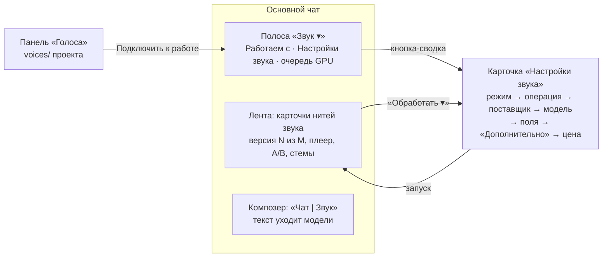

# Раздел «Звук» v1: Голос, Музыка, Обработка в чате AI Home

Макет: [audio-editor-v1.html](audio-editor-v1.html). Открывается без сети. В шапке макета можно выбрать:
- тему: светлая или тёмная;
- ширину: десктоп или телефон 360;
- чат: в проекте или личный;
- сцену: обычная, пусто, идёт задача, очередь GPU, ошибка, лимит;
- «Сначала» — сброс.

Под основным кадром собрана галерея: все виды карточек версий и все состояния по отдельности. Код продукта не менялся.

Источник состава — разбор Александра (задача `56858361`, раздел «Матрица возможностей»). Образец — редактор картинок:
[image-editor-v3-in-chat-proposal.md](image-editor-v3-in-chat-proposal.md), живая полоса
`frontend/src/features/imageEditor/strip/ImagesStrip.tsx`.

## Что решено заранее (не пересматривается)

1. Один раздел «Звук» с тремя режимами: **Голос / Музыка / Обработка**. Одна полоса в ленте, одна нить
   версий: цепочка «песня → стемы → смена голоса вокала → микс» живёт в одной нити.
2. fal: на каждую операцию **3–6 отобранных моделей** с удобными полями, редкие параметры — в панели
   **«Дополнительно»**, которая строится по схеме модели.
3. Монтаж без ИИ в v1 — **обрезка и громкость** (интервал на волне, громкость, нормализация, фейды).
   Склейки нет.
4. «Звук» есть и в **личном чате**: только облачные поставщики (fal, Higgsfield, Яндекс), «Локально»
   показано недоступным с причиной.

## Главное

Всё повторяет картинки, кроме трёх вещей, которых у картинок нет:
- **поля операции** (слова песни, длительность, реплики диалога, интервал и т. п.) живут в карточке
  «Настройки звука», а не в композере;
- **карточка версии — это плеер**: волна, время, A/B, стемы с M/S, несколько файлов;
- **библиотека «Голоса»** вместо «Персонажей».

## Полоса «Звук» над композером

Устроена так же, как полоса «Картинки», и переключается тем же заголовком «Звук ▾» (вариант B).
Высота: 48 px на десктопе, 42 px на телефоне, свёрнутая строка — 30 px.

| Элемент | Текст | Зачем |
|---|---|---|
| Заголовок-переключатель | «Звук ▾» | Меню полос: Git, Картинки, Звук; ниже ярлыки **«Голос»** и **«Музыка»** (открывают «Звук» в нужном режиме) и «Свернуть полосу в строку» |
| Чип выбора | «Работаем с: **podcast-intro.mp3 · версия 3** ✕» / пунктирный «✦ Новый звук» | К чему относится то, что я сейчас напишу. ✕ снимает выбор |
| Очередь GPU | «GPU: 2-я в очереди · старт ≈ через 3 мин», «тяжёлая · очередь пуста», «идёт: Озвучка · 40 % · ещё ≈ 12 с» | Только для локальных задач и во время запуска. Тяжёлые задачи идут по одной, очередь общая с картинками и видео |
| Кнопка-сводка | «Голос · Озвучить · Локально · Qwen3-TTS 1.7B · Аня · 2 вар. · бесплатно ▾» | Режим · операция · поставщик · модель · голос · N вар. · цена. На телефоне — «Голос · бесплатно ▾». Открывает «Настройки звука» |
| Аватар голоса | кружок «А» | Только в режиме «Голос» и только в проекте: подключённый голос уходит в каждую озвучку, прятать его нельзя. Клик открывает «Голоса» |
| Свернуть | ˄ | Строка «Звук ▾ · Работаем с: … · сводка ✕ ˅» |

Пустое состояние: «Звук ▾ · ✦ Новый звук · сводка». В свёрнутой строке: «Звук не выбран · …».
Ничего не выбрано, а поставщиков нет: «Звучать нечем: поставщиков не настроил администратор» (как у картинок).

**Ярлыки «Голос» и «Музыка»** есть в трёх местах: в меню «Звук ▾», в меню «＋» композера («Голос — озвучить
текст, сменить голос, обучить», «Музыка — песня, кавер, звуковой эффект») и кнопками в empty-state
ленты («Озвучить текст», «Сочинить музыку», «Обработать файл…»). Отдельных разделов за ними нет.

## Карточка «Настройки звука»

Ширина 470 px, всплывает над полосой. На телефоне это шторка «Настройки звука» на 88 % высоты.
Сверху вниз:

1. **Режим** — сегмент «Голос | Музыка | Обработка».
2. **Операция** — пилюли. Тяжёлые помечены значком процессора с подсказкой «Тяжёлая задача: одна за раз,
   минуты». Общая операция показана ссылкой в чужом режиме: в «Голосе» есть «В текст →», она ведёт в
   «Обработку».
3. Для операций над готовым звуком — строка «Берём текущую версию: **podcast-intro.mp3 · версия 3**».
4. **Поставщик** — карточки-опции «Локально / fal / Higgsfield / Яндекс» с подписью единицы цены. Если у
   поставщика нет операции, опция серая и пунктирная, с причиной: «У Яндекса только озвучка», «Локально
   продолжения нет — есть у fal», «Только для игрового конвейера Higgsfield — эта модель есть у fal».
   **Явный выбор не подменяется**: серую опцию выбрать нельзя, но и молча на другую её не меняем.
5. **Модель** — опции: имя, значок **RU** или «без RU», значок лицензии, «тяжёлая»; ниже единица цены и
   короткая заметка («также turbo, 2.6, 02» — родственные версии). У fal подпись «отобранные · остальные —
   по запросу».
6. **Поля операции** — только те, что понимает выбранная модель (таблица ниже). Поле, которого у модели нет,
   не рисуется, а не показывается серым.
7. **«Дополнительно ▸»** — автоформа:
   - заголовок с источником схемы: «по схеме модели `fal-ai/minimax/speech-2.8-hd`», «по каталогу
     Higgsfield» или «параметры локального движка»;
   - у каждого поля русская подпись, код параметра мелким моноширинным и умолчание;
   - типы виджетов: ползунок (число с границами), список (enum), флажок (bool), строка, файл;
   - внизу «Поле не тронуто — модель берёт своё значение по умолчанию» и «Сбросить».
8. **Полоса цены** закреплена внизу: «− N +», цена с расшифровкой, кнопка запуска («✦ Озвучить»,
   «✦ Сочинить», «✦ Разделить»…).

Форматы цены:

| Единица | Текст |
|---|---|
| за 1000 символов | «≈ $0.014 · 68 симв. по $0.1 за 1000 × 2» |
| за секунду | «≈ $0.040 · 20 с по $0.002 за с» |
| за минуту | «≈ $0.200 · 20 с по $0.6 за мин» |
| за запуск | «$0.038 · $0.038 за запуск» |
| кредиты | «0,30 кредита · 0,3 за запрос» |
| рубли | «≈ 0,16 ₽ · за запрос» |
| локально | «Бесплатно · ~15 с · очередь GPU: 0» |
| без ИИ | «Без ИИ · мгновенно · бесплатно» |

Цена пересчитывается живьём от длины текста в композере и от длительности (в макете это работает).

### Личный чат

- «Локально» показано с замком: «Локальные модели работают только в чате проекта — результат ложится в его
  папку».
- Источник голоса «Из «Голосов»» серый: «Библиотека «Голоса» живёт в проекте — в личном чате загрузите
  образец».
- Панель «Голоса» показывает пустое состояние «Голоса» живут в проекте».
- В карточке версии вместо «Сохранить в проект / Сохранить как…» одна кнопка «Скачать».

## Композер

Как у картинок: переключатель «Чат | Звук» появляется в поле ввода только при выбранном звуке. В режиме
«Звук» над полем строка «Режим «Звук» · Голос → Озвучить · текст уходит модели, не Claude», рамка
акцентная, кнопка отправки становится «✦ Озвучить · бесплатно».

Что такое текст композера в каждой операции (плейсхолдеры):

| Операция | Плейсхолдер |
|---|---|
| Озвучить | «Текст для озвучки — паузы <#0.5#> и теги (laughs) понимают MiniMax и ElevenLabs» |
| Диалог | «Тема или подводка (необязательно) — реплики заполните ниже» |
| Сменить голос, Вытащить, Очистить шум, Восстановить, В MIDI, Обрезка | «Комментарий не нужен — нажмите «…»» |
| Обучить голос | «Имя голоса для библиотеки, например «Андрей»» |
| Песня | «Стиль: жанр, настроение, инструменты, голос — по-английски модели понимают лучше» |
| Кавер | «Новый стиль: например «акустика, женский вокал»» |
| Перегенерировать кусок | «Что должно звучать в выделенном куске» |
| Продолжить | «Чем продолжить: например «плавное затухание, струнные»» |
| Дописать дорожку | «Характер новой дорожки: например «тёплый бас, пальцами»» |
| Править ноты | «Стиль исполнения (можно оставить прежний)» |
| Звуковой эффект | «Опишите звук до 450 символов: «скрип двери в пустом подъезде»» |
| Стемы | «Для SAM Audio — что выделить: «лай собаки»» |
| В текст | «Подсказка имён и терминов (необязательно)» |
| Время к тексту | «Вставьте точный текст записи — получите .srt и .lrc» |

## Карточка нити в ленте

- Заголовок: значок (♪ / микрофон), имя файла, метка «в работе», «‹ версия 3 из 3 ›».
- Строка «что сделано»: «Обработка · Обрезка и громкость · 0:02–0:18, затухание 2 с, −14 LUFS · Андрей»
  (кто запускал — Claude со звёздочкой или человек).
- **Плеер**: круглая кнопка ▶, волна (сыгранное — акцентом), «0:04.2 / 0:16.0». Клик по волне перематывает.
  У выбранной нити волну можно протянуть мышью и выделить кусок; под ней строка «Выделено 0:06.2 – 0:11.8 ·
  Обрезать · Перегенерировать кусок · Снять».
- **A/B**: сегмент «A · в1 | B · в2»; переключение не сбивает позицию воспроизведения.
- **Многофайловые версии**:
  - стемы — мини-микшер: строка на стем с M (заглушить) / S (слушать одну), волной и «скачать»; ниже
    «Сохранятся папкой `podcast-intro.stems/`» и «Свести в версию» (без ИИ, см. вопрос 3);
  - песня YuE2 — `anthem.mp3` + `anthem.score.abc` и кнопка «Править ноты»;
  - транскрипция — превью srt и строки `.txt` / `.srt` / `.lrc`;
  - RVC — `voice.pth` + `voice.index` и кнопка «Добавить в «Голоса»».
- **Значок лицензии** на версии: «CC BY-NC» (подсказка «Только некоммерческое использование»), «GPL-3.0»,
  «водяной знак», «коммерчески чистая», «лицензия не указана».
- Низ: «Локально · Qwen3-TTS 1.7B · бесплатно · 5,4 с», «Обработать ▾» (все операции «Обработки» плюс «Сменить
  голос», «Кавер · Перегенерировать кусок…»), «Сохранить в проект», «Сохранить как…».
- **Варианты запуска**: N плееров с номерами, «Взять» (взятый становится новой версией нити) — как у картинок.

## Библиотека «Голоса»

Панель в рельсе (точка «новое»), на телефоне — шторка из шапки чата. Хранится в `voices/<slug>/` проекта.

Карточка голоса: аватар-инициал, имя, вид («По образцам · 3 образца · 0:42», «Модель RVC · voice.pth ·
voice.index · 200 эпох», «По описанию · «тёплый баритон диктора радио, спокойно»»). Развёрнутая карточка:
- плеер образцов и список файлов;
- блок «Расшифровка»;
- таблица **«Где работает»**: поставщик · модель → статус «работает / клон удалён / не умеет / не создан» и
  пояснение. Пример строки: «fal · MiniMax клон — клон удалён · MiniMax удалил клон: не использовался 9 дней ·
  пересоздать за $1.5»;
- кнопки «Подключить к работе», «Переименовать», «Удалить».

Значок ⚠ на свёрнутой карточке — «У одного из поставщиков клон удалён». Тот же случай всплывает
предупреждением в настройках при выборе MiniMax: «Клон «Аня» у MiniMax удалён: не использовался 9 дней.
Пересоздать по образцам — $1.5, займёт ~20 с. [Пересоздать · $1.5]». Молча пересоздавать за деньги нельзя.

Голос, который не умеет нужную операцию, объясняет себя: «Андрей» — модель RVC: озвучивать текстом её
нельзя, только сменить голос готовой записи». Кнопка запуска серая с этой же подсказкой.

**«＋ Голос»** — форма с тремя вкладками:
- **«Из записей»**: 1–5 записей по 5–60 с, расшифровка или «Распознать сами». Голос сразу работает у
  локальных моделей и Seed-VC; у fal и Higgsfield клон создаётся при первом запуске, цену покажем заранее.
- **«По описанию»**: варианты «Только описание» (бесплатно, уходит в Qwen3-TTS при каждом запуске),
  «fal · MiniMax voice-design» ($3 один раз), «fal · Qwen3 voice-design».
- **«Обучить RVC»**: ведёт в «Голос → Обучить голос».

## Состояния

| Состояние | Где видно | Текст |
|---|---|---|
| Пусто (раздел) | лента | «Звука в этом чате ещё нет. Озвучьте текст, сочините трек или обработайте запись из проекта.» и три кнопки |
| Пусто (полоса) | полоса | «✦ Новый звук», сводка настроек; свёрнуто — «Звук не выбран · …» |
| Пусто («Голоса») | панель | «Своих голосов пока нет. Голос — это записи человека и их расшифровка. Добавьте голос один раз, и его смогут взять все поставщики, которые умеют клонировать.» |
| Идёт задача | полоса + карточка | «идёт · 40 %», полоска, скелетоны вариантов, «Отменить», «Варианты появятся здесь по мере готовности. Цена списана при приёме задачи.» |
| Очередь GPU | полоса + карточка | «в очереди GPU · 2-я», «Тяжёлая задача: идёт одна за раз. Впереди — видео (≈ 3 мин). Своя работа ≈ 8 мин. Можно закрыть чат — пришлём уведомление.», «Убрать из очереди» |
| Ошибка | карточка | «fal не ответил за 5 минут. Деньги не списаны. Можно повторить у fal или взять соседа с той же операцией — сами не переключаем.» и кнопки «Повторить у fal · ≈ $0.30», «Взять fal · MiniMax Music 3 · ≈ $0.06», «Взять Локально · ACE-Step · бесплатно» |
| Лимит | карточка | «Кредиты Higgsfield закончились (нужно 0,3, осталось 0,1)…», «Уже идут 2 ваши задачи — дождитесь одной», «Claude не запускает больше двух генераций за ход», «Очередь GPU переполнена (4 задачи) — попробуйте позже или облако» |
| Нельзя запустить | настройки | серая кнопка запуска с причиной; предупреждения «AudioSR берёт до 120 с, а версия длиннее (3:02). Обрежьте кусок или возьмите fal · DeepFilterNet 3.» |

Сосед при ошибке предлагается только с **той же операцией и тем же типом голоса**: клон MiniMax не меняется
на клон Qwen без явного выбора.

## Операции и параметры из матрицы → где в интерфейсе

Обозначения мест:
- **Н** — «Настройки звука», поле на виду;
- **Д** — «Дополнительно» (автоформа);
- **К** — композер;
- **Г** — панель «Голоса»;
- **Л** — карточка версии в ленте;
- **—v1** — не в первой версии (перечень ниже).

### Общие параметры поставщиков

| Параметр | Место |
|---|---|
| LM: аудиовход (путь в проекте или job_id) | Строка «Берём текущую версию» (Н) + «Файл проекта…» / «Версия нити…» в полях образца |
| LM: лимиты входа (90 МБ, 600 с) | Предупреждение в Н при выборе версии, кнопка запуска серая |
| LM: `prompt` ≤ 4000 | К (счётчик символов) |
| LM: `seed` | Д у каждой локальной модели |
| LM: ≤ 2 задач на владельца, ≤ 1 тяжёлая, очередь ≥ 4 → отказ | Состояния «Лимит» и «Очередь GPU» |
| LM: только серверный проект | Личный чат: «Локально» с замком и причиной |
| HF: `prompt`, `count`, `get_cost` | К; «− N +» (N запросов по одному); цена до запуска в полосе цены |
| HF: `use_unlim` | Не в интерфейсе: всегда `false`, как у картинок (трата только кредитами) |
| HF: `folder_id` | Не в интерфейсе: служебный |
| HF: `medias[{value, role}]` | Образец «Из «Голосов»» / «Образец» (role `audio_references`), «Образ» в Д (`image_references`) |
| HF: `list_voices` | Список «Готовый диктор» у Higgsfield (Н) |
| fal: цена из `/v1/models/pricing` | Подпись единицы у поставщика и модели, полоса цены |
| fal: схема `get_model_schema` | Д строится по ней |

### Голос

| Операция / параметр | Место |
|---|---|
| **Готовый диктор** | Голос → Озвучить → источник «Готовый диктор» (Н) |
| LM qwen `speaker` (9 дикторов) + `voice` как манера | Н: список + строка «Манеру можно добавить описанием» |
| HF seed_audio `voice_type=preset` + `voice_id` | Н: список дикторов Higgsfield |
| HF text2speech_v2 `variant` (elevenlabs / minimax / seed_speech / vibe_voice / cozy_voice), `voice_type`, `voice_id` | Н: поле «Движок» + список дикторов |
| HF qwen_audio_tts (preset), elevenlabs_v4 / v4_turbo | Н: модели «Qwen Audio TTS», «ElevenLabs v4» (turbo — заметка «только один голос») |
| fal MiniMax speech-2.8-hd / turbo / 2.6 / 02 | Н: модель «MiniMax Speech 2.8 HD», остальные — заметка «также …» и «по запросу» |
| fal Eleven v4 / v3 / multilingual-v2 / turbo-v2.5 | Н: «ElevenLabs v4», остальные в заметке |
| fal Gemini 3.8 Flash / Lite, 3.1 Flash, gemini-tts | Н: «Gemini 3.8 Flash TTS», остальные в заметке |
| fal Qwen3-TTS 1.7B / 0.6B | Н: «Qwen3-TTS 1.7B (fal)», 0.6B в заметке |
| fal Inworld TTS-1.5 Max | Н |
| fal Chatterbox (HD) | Н: «Chatterbox HD» со значком «водяной знак» |
| fal Kokoro, xAI tts v1, Kling TTS, Orpheus, Maya1 (+batch/stream), F5, CSM-1B, Tada 1B/3B, async tts-pro, Seed Speech v2 | —v1 (вне отбора, добавляются строкой каталога) |
| Яндекс SpeechKit: 15 голосов | Поставщик «Яндекс», «Готовый диктор» — список из 15 |
| Яндекс `role` (good / evil / friendly / whisper / strict) | Н: «Роль» (Добрый / Злой / Дружелюбный / Шёпот / Строгий) |
| Яндекс `speed` 0.1–3 | Н: «Скорость» |
| Яндекс ≤ 3000 симв., mp3, ≈ 0,16 ₽ | Подсказка в Н, полоса цены |
| **Голос по описанию** | Источник «По описанию» (Н) + «＋ Голос → По описанию» (Г) |
| LM qwen `voice` ≤ 500 (умолчание «спокойный, ясный голос диктора») | Н: textarea + подсказка |
| HF qwen_audio_tts `instruction` | Н: строка «Инструкция: эмоция, диалект, скорость» |
| fal qwen-3-tts/voice-design | Модель «Qwen3-TTS 1.7B (fal)» с источником «По описанию»; Г: вариант «fal · Qwen3 voice-design» |
| fal minimax/voice-design ($3) | Г: «fal · MiniMax voice-design · $3 один раз» |
| fal Maya1 voice design | —v1 |
| **Клон по образцу** | Источник «Образец» (разовый) и «Из «Голосов»» (Н), создание — Г |
| LM qwen `reference` ≤ 60 с + `reference_text` ≤ 2000 (без текста — распознаём, обрезка до 15 с) | Н: поле образца, строка расшифровки, подсказка «обрежем до 15 с»; Г: расшифровка + «Распознать сами» |
| LM moss, chatterbox (клон) | Модели «MOSS-TTS v1.5», «Chatterbox Multilingual» |
| HF seed_audio `audio_references` / `voice_type=element`; qwen_audio_tts element; text2speech_v2 element | Источник «Из «Голосов»»; Г: «Higgsfield · Seed Audio — элемент воркспейса» |
| fal minimax/voice-clone ($1.5): `audio_url` ≥ 10 с, `noise_reduction`, `need_volume_normalization`, `accuracy`, `text` превью, `model`, `custom_voice_id` (7 дней) | Г: создание клона при первом запуске с ценой; строка «fal · MiniMax клон» со статусом «клон удалён» и «пересоздать за $1.5». Флажки шумоподавления, нормализации, точность, текст превью, модель клона — Д в диалоге пересоздания (в макете не развёрнут, автоформа та же) |
| fal qwen-3-tts/clone-voice (эмбеддинг) | Г: «fal · Qwen3 клон — эмбеддинг сохранён» |
| fal Zonos / Zonos2, Dia voice-clone, kling-video/create-voice | —v1 (вне отбора) |
| **Параметры синтеза** | |
| `text` ≤ 5000 (LM), ≤ 10 000 (MiniMax) | К |
| `language` (qwen 10, moss 31, chatterbox 23, HF qwen 13, MiniMax `language_boost` 37 + auto) | Н: «Язык» (список под модель); MiniMax `language_boost` — Д |
| `expressiveness` 0.25–2 (chatterbox) | Н: «Выразительность» |
| seed_audio `format`, `sample_rate`, `image_references` | Д |
| seed_audio `speech_rate` −50…100, `loudness_rate` −50…100, `pitch_rate` −12…12 | Н: «Скорость», «Громкость», «Высота» |
| qwen_audio_tts `volume` 0–100, `speech_rate` и `pitch_rate` 0.5–2 | Н: «Громкость», «Скорость», «Высота» |
| qwen_audio_tts `format`, `sample_rate`, `seed` 0–65535 | Д |
| qwen_audio_tts / elevenlabs_v4 `batch_size` 1–4 | «− N +» |
| elevenlabs_v4 `stability`, `similarity_boost` | Д |
| MiniMax `voice_setting.speed`, `vol`, `pitch`, `emotion` (7) | Н: «Скорость», «Громкость», «Высота», «Эмоция» |
| MiniMax `english_normalization`, `pronunciation_dict`, `normalization_setting` {LUFS, range, peak}, `voice_modify` {pitch, intensity, timbre}, `audio_setting` {sample_rate, bitrate, format, channel} | Д |
| MiniMax паузы `<#x#>`, теги `(laughs)`; Eleven аудиотеги | К: подсказка в плейсхолдере |
| Eleven IPA, `output_format` | Д |
| `duration_ms` на выходе | Л: длительность в плеере |
| Лицензии Apache-2.0 / MIT | Заметка модели в Н |
| **Многоголосый диалог** | Голос → **Диалог** |
| HF elevenlabs_v4 `dialogue[]` (≤ 10 голосов, ≤ 10 000 симв.) | Н: «Реплики · до 10 голосов», строка «голос + реплика», «＋ Реплика» |
| fal VibeVoice 7B / 1.5B / 0.5B, Dia, eleven text-to-dialogue v3, Gemini (2 спикера) | Н: модели; у Gemini подпись «ровно 2 голоса»; 1.5B / 0.5B — заметка |
| LM — по фразам | Поставщик «Локально» серый: «Локально диалога нет — озвучьте реплики по одной» |
| **Смена голоса** | Голос → **Сменить голос** |
| LM seedvc: `reference` 1–30 с, `mode` speech / singing, `pitch_shift` −24…24; GPL-3.0 | Н: «Чей голос» (из «Голосов» или файл), «Что в записи: Речь / Пение», «Сдвиг высоты»; значок GPL; подсказка «В режиме «Речь» Seed-VC сдвиг пока не применяет» (дефект из разбора) |
| LM seedvc `diffusion_steps`, `convert_style` | Д |
| LM rvc `voice_model` .pth, `voice_index` .index | Н: «Модель голоса» из «Голосов» |
| LM rvc `index_rate`, f0 = rmvpe | Д |
| fal elevenlabs/voice-changer: `voice`, `remove_background_noise`, `seed`, `output_format` | Н: «Голос» (Rachel, Aria, Roger…), флажок «Убрать фоновый шум»; Д: seed, формат |
| **Обучение голоса (RVC)** | Голос → **Обучить голос** (тяжёлая) |
| `audios` 1–20, 2–30 мин | Н: список записей, «Добавить из проекта или нити», подсказка про музыку → «Стемы» |
| `epochs` 20–1000 (200) | Н: «Эпохи» + подсказка про время |
| `sample_rate`, `batch_size` | Д |
| Результат voice.pth + voice.index | Л: карточка с «Добавить в «Голоса»» |
| fal тренер LoRA Stable Audio 3 | —v1 |
| **Транскрипция / субтитры** | Обработка → **В текст** (ярлык «В текст →» в «Голосе») |
| LM whisper `language` | Н: «Язык» (Определить сам / …) |
| LM `beam_size`, `vad_filter` | Д |
| Результат text.txt, subtitles.srt, lyrics.lrc | Н: «Получите .txt .srt .lrc»; Л: три файла и превью |
| fal wizper: `task` transcribe / translate, `language` 99, `max_segment_len`, `merge_chunks` | Н: язык; Д: задача, длина строки, склейка |
| fal ElevenLabs Scribe v2, Cohere Transcribe, Nemotron ASR | Н: модели |
| fal elevenlabs/speech-to-text, speech-to-text (+turbo, stream) | Заметка «также speech-to-text v1»; turbo / stream — —v1 |
| Браузерный Web Speech | Не относится: голосовой ввод чата |
| **Выравнивание текста по аудио** (eleven forced-alignment $0.22) | Обработка → **Время к тексту** |
| **Анализ аудио вопросом** (audio-understanding) | —v1 |
| **Детекция конца реплики** (smart-turn, Silero VAD) | Не относится: голосовой режим чата |

### Музыка

| Операция / параметр | Место |
|---|---|
| **Песня / инструментал** | Музыка → **Песня** |
| LM `prompt` | К (стиль) |
| LM `lyrics` ≤ 5000 с [Verse] / [Chorus] / [Bridge], пусто → инструментал | Н: «Слова», переключатель «Со словами / Инструментал», кнопки вставки секций |
| LM `engine` ace / yue2 / minimax | Н: модели «ACE-Step 1.5 XL», «YuE2-3B» (CC BY-NC, «только со словами» — «Инструментал» серый с причиной), «MiniMax Music 3» («лицензия не указана») |
| LM `duration_seconds` 10–240 | Н: «Длительность» |
| LM ace `language` (51), `bpm` 40–220, `key` (34) | Н: «Язык вокала», «Темп», «Тональность» (только у ACE) |
| LM yue2 `abc` | Музыка → **Править ноты** |
| LM `seed` | Д |
| Время генерации | Подпись модели и цена «Бесплатно · ~…» |
| HF sonilo_music | Модель серая: «Только для игрового конвейера Higgsfield — эта модель есть у fal» |
| fal ElevenLabs Music v2.5 / v2 / v1: `prompt` ≤ 4100, `force_instrumental`, `music_length_ms` 3000–600 000 | К; «Инструментал»; «Длительность 3 с – 10 мин» |
| ElevenLabs `composition_plan.chunks[]`: text с секциями и `{ремарками}`, `duration_ms`, positive / negative styles, `context_adherence`, `audio_reference` {audio_url, start/end ≤ 30 с, strength} | Н: блок «План по частям» — строка на часть (текст, длительность, стили + / −), «Держаться плана», «Образец звучания · до 30 с» с силой, «＋ Часть» |
| ElevenLabs `seed` (только с планом), `output_format` (25) | Д |
| fal MiniMax Music 3; music v2.6 / 2.5 / 2 / 1.5 | Н: «MiniMax Music 3 (fal)», остальные в заметке |
| fal Lyria 3.5; 3 Pro, 3, 2 | Н: «Lyria 3.5», остальные в заметке; `negative_prompt`, `seed` — Д |
| fal Stable Audio 3 Medium; Small, base, 2.5, Open | Н: «Stable Audio 3 Medium» («коммерчески чистая»), остальные в заметке; шаги, cfg, seed — Д |
| fal ACE-Step; prompt-to-audio | Н: «ACE-Step (fal)», prompt-to-audio в заметке |
| fal Sonilo v1.1 | Н: «Sonilo v1.1» («коммерчески чистая», только инструментал) |
| fal DiffRhythm, CassetteAI music | —v1 (вне отбора) |
| glif `compose_project` audio | —v1 |
| **Кавер** | Музыка → **Кавер** |
| LM `prompt`, `strength` 0–1 (0.6), `lyrics` | К; Н: «Близость к исходнику»; «Слова (необязательно)» |
| LM yue2 cover (мелодия + новые слова, слова обязательны) | Н: модель «YuE2-3B · новые слова» |
| fal ace audio-to-audio; stable-audio-3 medium / small a2a; stable-audio-25 a2a | Н: модели; Small и 2.5 — заметка |
| **Перегенерировать кусок** | Музыка → **Перегенерировать кусок** |
| LM `start_seconds`, `end_seconds` (−1 = до конца), prompt, lyrics | Н: «Кусок» — выделение на волне + «до конца»; Л: выделение на волне карточки → «Перегенерировать кусок»; К; «Слова для куска» |
| fal ace inpaint; stable-audio-3 inpainting (несколько кусков); stable-audio-25 inpaint; mirelo inpaint | Н: модели; «＋ ещё кусок» у Stable Audio 3 |
| **Продолжить** | Музыка → **Продолжить** |
| fal ace outpaint (начало / конец); stable-audio-3 outpainting | Н: «Куда: В конец / В начало», «Добавить, с»; модели |
| fal mirelo extend-audio | Н: модель «Mirelo SFX 1.6 extend» |
| **Вытащить дорожку** (`track` из 12) | Музыка → **Вытащить дорожку** (тяжёлая): 12 пилюль дорожек; подсказка «быстрее — Обработка → Стемы» |
| **Дописать дорожку** (`track` + prompt) | Музыка → **Дописать дорожку** (тяжёлая): дорожка + К |
| **Доаранжировать** (`tracks[]`, по умолчанию drums, bass) | Музыка → **Доаранжировать** (тяжёлая): мультивыбор дорожек |
| music_edit `steps`, `guidance`, `shift` | Д у моделей ACE в кавере, куске и дорожках |
| **Ноты → MIDI** | Обработка → **В MIDI** |
| **Правка партитуры .abc** | Музыка → **Править ноты** (Н: редактор партитуры) + Л: «Править ноты» у версии с .abc |
| **Музыка под видео** (sonilo video-to-music, VibeMV, LTX a2v) | —v1 |
| **Своя модель стиля** (LoRA) | —v1 |

### Обработка

| Операция / параметр | Место |
|---|---|
| **Стемы** LM `mode` vocals / 4stems / 6stems / karaoke, `format` | Н: «Что разделить», «Формат стемов» |
| fal demucs `model` (8), `stems[]`, `segment_length`, `overlap`, `shifts`, `output_format` | Н: «Стемы» (6 флажков); Д: модель, сегмент, перекрытие, сдвиги, формат |
| fal sam-audio separate / span-separate | Н: модель «SAM Audio · выделить звук», описание — К |
| fal elevenlabs/audio-isolation | Н: модель в «Стемах» и «Очистить шум» |
| Результат стемы | Л: микшер M/S, «Сохранятся папкой …stems/» |
| **Очистить шум** LM DeepFilterNet (`atten_db`) | Н: модель; Д: «Сила подавления» |
| fal deepfilternet3, veed/clean-audio, audio-isolation; voice-changer `remove_background_noise` | Н: модели; флажок в «Сменить голос» |
| **Восстановить частоты** LM AudioSR `model` basic / speech, вход ≤ 120 с | Н: «Что в записи», предупреждение про 120 с |
| AudioSR `ddim_steps`, `guidance_scale`, `seed` | Д |
| fal deepfilternet3 (до 48 кГц) | Н: модель |
| **Мастеринг** LM Matchering + `reference` (GPL-3.0) | Н: «Образец звучания» (файл или версия нити), значок GPL |
| Нормализация громкости в TTS MiniMax | Д у MiniMax (`normalization_setting`) |
| Basic Pitch `onset_threshold`, `frame_threshold`, `min_note_ms` | Д у «В MIDI» |
| **Обрезка и громкость** (без ИИ) | Н: «Кусок», «Громкость, дБ», «Нормализовать до −14 LUFS», «Нарастание», «Затухание», «Формат», «Частота» |
| ffmpeg merge-audios (склейка) | —v1 (решение Андрея) |
| audio-compressor, impulse-response (реверберация) | —v1 |
| «Свести стемы в версию» (amix) | Л: кнопка в микшере — см. вопрос 3 |

### Звуковые эффекты

| Операция / параметр | Место |
|---|---|
| fal elevenlabs/sound-effects/v2: `text` ≤ 450, `duration_seconds` 0.5–22 / авто, `loop` | К; Н: «Длительность: Авто / Задать», «Петля» |
| `prompt_influence`, `output_format` | Д |
| Mirelo SFX 1.6 text-to-audio (петли) | Н: модель |
| Sonilo SFX, Stable Audio 3 Small SFX, CassetteAI SFX (≤ 30 с), MMAudio v2 | Н: модели; MMAudio `num_steps`, `cfg_strength` — Д |
| Stable Audio 3 SFX a2a / in- / outpaint, base | —v1 (вне отбора) |
| LTX-2.3 text-to-audio (+lora) | —v1 |
| Sonilo video-to-sfx, ControlFoley, PixVerse SFX | —v1 (звук под видео — дело раздела «Видео») |
| HF mirelo_text_to_audio | Модель серая: «Только для игрового конвейера Higgsfield — эта модель есть у fal» |

### Скрытые параметры local-media (раздел 2.6 разбора)

Все уходят в **Д** соответствующей локальной модели:
- ACE generate: timesignature, cfg_scale, temperature, top_p, steps, cfg, shift;
- music_edit: steps, guidance, shift;
- YuE2: temperature, top_k, repetition_penalty, max_abc_tokens (mode=melody — фиксированное поле);
- MiniMax Music 3: cfg, top_k, steps;
- Qwen3-TTS: язык `auto` (с пометкой «бэкенд пока не пропускает»);
- Chatterbox: cfg_weight;
- Seed-VC: diffusion_steps, convert_style;
- RVC: sample_rate, batch_size, index_rate, f0;
- DeepFilterNet: atten_db;
- AudioSR: ddim_steps, guidance_scale, seed;
- Basic Pitch: onset_threshold, frame_threshold, min_note_ms;
- Whisper: beam_size, vad_filter.

### Не в первой версии — полный перечень

1. Модели fal вне отбора:
   - TTS: Kokoro, xAI tts, Kling TTS, Orpheus, Maya1 (+batch/stream, voice design), F5, CSM-1B, Tada, async
     tts-pro, Seed Speech v2;
   - клоны: Zonos / Zonos2, Dia voice-clone, kling create-voice;
   - музыка: DiffRhythm, CassetteAI music;
   - распознавание: speech-to-text turbo / stream;
   - SFX: Stable Audio 3 SFX a2a, in- / outpaint, base; LTX-2.3 text-to-audio (+lora).

   Добавление — одна строка каталога, интерфейс не меняется.
2. Анализ аудио вопросом (`audio-understanding`).
3. Музыка и звуки под видео: Sonilo video-to-music / video-to-sfx, PixVerse VibeMV и SFX, LTX-2.5
   audio-to-video, ControlFoley. Место им — раздел «Видео».
4. Тренер LoRA Stable Audio 3.
5. Склейка (`ffmpeg-api/merge-audios`), компрессор, реверберация.
6. glif `compose_project` для звука: агентный, модель не выбрать.
7. Видео со звуком (`local_reference_to_video` и др.) — раздел «Видео».

Детекция конца реплики и браузерное распознавание к разделу не относятся (голосовой режим чата).

## Что нового (черновик)

> **Звук в чате.** В AI Home появился раздел «Звук»: озвучка текста, музыка и обработка записей прямо в
> чате. Выберите режим — Голос, Музыка или Обработка — в полосе «Звук» над полем ввода, и результат ляжет в
> ленту карточкой с плеером. Каждая правка — новая версия: можно сравнить A/B, разделить трек на стемы,
> сменить голос вокала, обрезать и сохранить в проект. Работает на своей видеокарте бесплатно, а также через
> fal, Higgsfield и Яндекс — цена видна до запуска. Свои голоса живут в панели «Голоса»: добавьте записи
> один раз, и их смогут взять все модели, которые умеют клонировать.

## Вопросы к Андрею

1. **Поля операции — в карточке «Настройки звука», а не в композере** (так в макете). Композер несёт
   только главный текст: что озвучить, стиль песни, описание звука. Слова песни, реплики диалога, интервал
   и план частей — в карточке. Альтернатива — второй переключатель в композере «Стиль | Слова». Он короче
   на одну кнопку, но длинные слова в поле ввода неудобны, и композер начинает расти. Рекомендую как в
   макете.
2. **Личная библиотека голосов.** Сейчас «Голоса» есть только в проекте, в личном чате — разовый образец.
   Нужен ли личный набор голосов (как личная область у картинок)? Если да, клоны у поставщиков будут жить
   и там.
3. **«Свести в версию» у стемов.** Это сведение звучащих дорожек в один файл без ИИ, а не склейка. Без
   него цепочка «песня → стемы → смена голоса вокала → микс» не замыкается внутри нити. В макете кнопка
   есть; оставить в v1 или отложить вместе со склейкой?
4. **Где ярлыки «Голос» и «Музыка».** В макете они в меню полосы «Звук ▾», в «＋» композера и в
   empty-state. Нужен ли ещё отдельный пункт в рельсе или навигации проекта — или трёх мест хватает?
