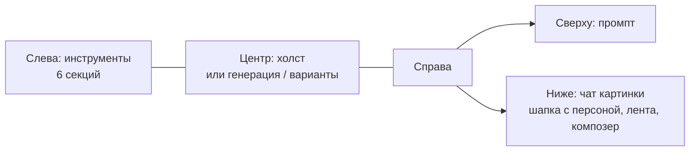

# Редактор картинок v2: инструменты слева, промпт и чат справа

Макет: [image-editor-v2.html](image-editor-v2.html). Открывается без сети. В шапке макета переключаются
тема (светлая / тёмная), ширина (десктоп / телефон 390), «Сразу к» (1–8) и «Исход генерации» (успех /
отказ сервиса). Это только макет, код продукта не менялся. Предыдущая версия —
[image-editor-v1.html](image-editor-v1.html) и [image-editor-proposal.md](image-editor-proposal.md).

## Что меняется относительно v1 и того, что сейчас в master

| Было | Стало в v2 |
|---|---|
| Узкая колонка значков слева (48 px) — только пометки | Левая панель 272 px: шесть сворачиваемых секций — «Пометки», «Образцы», «Персонажи», «Быстрые действия», «Чем рисовать», «История шагов» |
| Справа одна панель: запрос, образцы, персонажи, модель, кнопка | Справа сверху — только поле промпта: «Промпт», текст, число вариантов, цена, «Сгенерировать» |
| «Обсудить с Claude» — разовый ответ в панели и переход в чат проекта | Кнопки нет. Под промптом — полноценный чат с настоящим композером |
| Образцы в коде пропали (есть только персонажи) | Секция «Образцы»: «+ Образец» → «С компьютера» / «Из файлов проекта…», роль под миниатюрой, крестик удаляет |
| История — отдельная колонка справа, открывается кнопкой в шапке | История — секция в левой панели, шаги с миниатюрами списком |
| Телефон: всё одной лентой с прокруткой | Телефон: холст на весь экран, промпт снизу, «Инструменты» и «Чат» — шторки |

В коде master сейчас нет быстрых действий, истории шагов и образцов — они были только в макете v1.
В v2 они снова в составе, поэтому объём разработки больше, чем «переставить панели».

## Раскладка (десктоп)

- **Центр** — холст, как сейчас: масштаб, рука, рисование пометок.
- **Промпт** — многострочное поле с авторазмером: растёт вместе с текстом до 240 px, дальше
  прокручивается внутри поля, в углу подсказка «прокрутите ↓». Длинный промпт не обрезается
  (в макете — «5 · Длинный промпт», 630 символов). Если промпт написал агент, над полем метка
  «✦ написал Claude»; ручная правка текста её снимает. Крестик в заголовке очищает поле. Пока идёт
  генерация, поле только для чтения, вместо кнопки — «Рисуем 3 варианта… · Отменить».
- **Чат** — см. ниже.
- **Левая панель** — секции сворачиваются по заголовку, справа в заголовке краткий итог:
  «3 пометки», «2» образца, «подключена Аня», «fal · Авто», «2 шага». По умолчанию открыты
  «Пометки», «Образцы», «Быстрые действия», «История»; «Персонажи» и «Чем рисовать» свёрнуты.
  Состояние секций запоминается на пользователя.

## Чат картинки

Это **обычный чат проекта**, привязанный к файлу картинки:

- создаётся **после первого сообщения**, а не при открытии редактора — иначе каждое
  «посмотреть картинку» плодило бы пустые чаты. До первого сообщения в шапке: «Новый чат
  картинки · появится в списке после первого сообщения»;
- после — «Чат «hero.png · правка» · в списке чатов проекта». В списке чатов он с миниатюрой и
  меткой «картинка»; клик по нему открывает редактор с этим чатом;
- при повторном открытии картинки открывается тот же чат, тост «Открыт чат этой картинки:
  «hero.png · правка»»;
- кнопка «↗» в шапке — «Открыть в полном чате»: та же лента во вкладке «Чаты»;
- **в шапке — выбор персоны** (аватар, имя, «▾»): Claude, персоны проекта. Тот же выбор есть и
  в полосе композера, как в основном чате. Плейсхолдер — «Спросите Киру…», как в `Composer.tsx`;
- композер — наш настоящий: «+» (файл с компьютера, из файлов проекта), режим работы, персона,
  микрофон, отправка; Enter отправляет, Shift+Enter переносит строку;
- к каждому сообщению **сам прикладывается снимок холста** — чип «hero.png · 3 пометки»
  (пунктирная рамка). Крестиком его можно убрать, в меню «+» вернуть: «Снимок холста с
  пометками». Поэтому «убери вон ту лампу» работает — агент видит пометку;
- пустая лента: строка «Чат привязан к images/hero.png. Claude видит картинку, пометки, образцы и
  промпт — и может сам запустить генерацию» и две подсказки-примера.

### Промпт из чата — два режима

**А. Агент запускает сам** («Убери вон ту лампу и сделай вечер»):

1. Агент отвечает: «Вижу пометку кистью справа — это торшер у дивана. Промпт поставил в поле сверху,
   3 варианта уже рисуются».
2. Промпт появляется в поле сверху (поле коротко подсвечивается), метка «✦ написал Claude».
3. Генерация стартует с текущими настройками: число вариантов, поставщик, модель, образцы, персонаж.
4. В ленте карточка **«● Запущена генерация · ≈ $0.24 · 3 варианта»** с полосой прогресса и
   «Отменить». Дальше — «✓ Готово · … · Показать варианты» или «Генерация отменена · Деньги не
   списаны. Промпт остался в поле сверху · Запустить снова». При отказе сервиса — «Генерация не
   удалась».

**Б. Агент предлагает** («Придумай промпт для обложки блога»):

1. Агент отвечает текстом со строкой «Прочитано: docs/brand.md images/about.jpg».
2. Карточка «✦ Промпт» с текстом и двумя кнопками: **«Вставить в промпт»** (подставляет в поле,
   генерацию не запускает, кнопка становится «✓ Вставлено») и **«Сгенерировать · ≈ $0.24 ·
   3 варианта»** (подставляет и запускает, дальше как в режиме А).

Режим выбирает агент по смыслу просьбы; в макете — по слову «придумай» / «предложи».

## Варианты и «до / после» — в центре, вместо холста (как в v1)

Решение: оставить варианты там же, где в v1 и в master, — **в центральной области вместо холста**:
сверху шторка «до / после» (или переключатель «До / после»), под ней лента миниатюр вариантов,
ниже «Применить», «Взять за основу», «Ещё варианты», «Вернуться к правке».

Почему не под холстом и не поверх:

- центр — самая большая область, а сравнение «до / после» требует крупной картинки; под холстом
  места хватило бы только на миниатюры;
- поверх холста — это модалка, которая закроет чат, а в v2 чат должен оставаться живым:
  «Показать варианты» из карточки чата переключает центр, лента и промпт остаются на месте;
- во время показа вариантов пометки не нужны: «Вернуться к правке» возвращает холст с ними.

## Телефон (390)

- Холст на весь экран (≈70 % высоты), сверху подсказка инструмента, снизу слева мини-панель
  «Рука · Кисть · Стрелка · Ластик», справа масштаб.
- Под холстом две кнопки-вкладки: **«Инструменты»** и **«Чат»** (точка на «Чате», если там новое).
  Обе открывают шторку на 86 % высоты: в «Инструментах» — те же шесть секций, в «Чате» — шапка с
  персоной, лента и композер.
- Промпт — внизу экрана всегда: поле с авторазмером до 132 px, число вариантов, цена,
  «✦ Сгенерировать».
- Генерация из чата идёт с открытой шторкой: карточка видна в ленте, промпт заполняется под ней.

## Тексты

| Место | Текст |
|---|---|
| Заголовок поля | Промпт |
| Плейсхолдер промпта | Что изменить? Отметьте место на картинке или просто опишите |
| Метка автора | ✦ написал Claude / ✦ написала Кира |
| Идёт генерация (под полем) | Рисуем 3 варианта… · Отменить |
| Шапка чата до первого сообщения | Новый чат картинки · появится в списке после первого сообщения |
| Шапка чата | Чат «hero.png · правка» · в списке чатов проекта |
| Системная строка ленты | Чат привязан к images/hero.png. Claude видит картинку, пометки, образцы и промпт — и может сам запустить генерацию. |
| Авто-вложение | hero.png · 3 пометки |
| Карточка запуска | Запущена генерация · ≈ $0.24 · 3 варианта · Отменить |
| Карточка готово | Готово · ≈ $0.24 · 3 варианта · Показать варианты |
| Карточка отмены | Генерация отменена · Деньги не списаны. Промпт остался в поле сверху. · Запустить снова |
| Карточка промпта | Промпт · Вставить в промпт · Сгенерировать · ≈ $0.24 · 3 варианта |
| Секции слева | Пометки · Образцы · Персонажи · Быстрые действия · Чем рисовать · История шагов |
| Меню образца | С компьютера (PNG, JPG или WebP до 20 МБ) · Из файлов проекта… (Любая картинка этого проекта) |
| Роли образца | Персонаж — сохранить лицо · Стиль · Предмет |
| Подсказка образцов | Модель возьмёт образец за пример. Роль — под миниатюрой: лицо, стиль или предмет. Картинку можно перетащить сюда из файлов. |
| Подсказка быстрых действий | Запускаются сразу, без промпта. Число вариантов и цена — как в поле промпта. |
| Вкладки на телефоне | Инструменты · Чат |

## Что в макете кликабельно, а что статикой

Кликабельно: сворачивание секций; все инструменты пометок и рисование на холсте, размер кисти,
ластик, очистка; образцы (добавить с компьютера и из проекта, роль, удалить); персонажи
(подключить, «Новый персонаж»); быстрые действия и «Дорисовать за края» с пропорциями;
поставщик и модель с недоступными моделями; история шагов; промпт с авторазмером; число
вариантов и цена; генерация, отмена, варианты, шторка «до / после», «Взять за основу»,
сохранение; чат — персона в шапке и в композере, вложения, авто-снимок, голос (запись →
расшифровка), отправка, оба сценария агента, карточки со всеми состояниями; экран проекта со
списком чатов и повторное открытие; телефонные шторки; обе темы.

Статикой (не работает или условно): режим работы в композере (кнопка без меню); «Открыть в
полном чате» показывает только тост; ответы агента заготовлены, выбор режима — по ключевому
слову; распознавание голоса всегда даёт одну фразу; цены и модели условные; сохранение персонажа
и файла — только тост.

## Открытые вопросы к Андрею

1. **Спрашивать ли разрешение на запуск.** Агент тратит деньги сам. Предлагаю: запускать без
   вопроса до порога (например, до $0.50 или 4 кредитов за запуск), выше — карточка с
   «Запустить» вместо автостарта. Или всегда без вопроса, раз есть «Отменить»?
2. **Меняет ли агент настройки** — число вариантов, модель, образцы? В макете он берёт текущие
   из панели и меняет только промпт.
3. **Попадает ли ручная генерация в ленту.** Сейчас нет: в ленту пишет только агент. Можно
   добавлять тихую строку «Вы запустили: …», чтобы агент знал, что было сделано без него.
4. **Авто-снимок холста к каждому сообщению** — по умолчанию включён. Это лишние токены на
   каждом ходу; альтернатива — прикладывать, только если холст изменился с прошлого сообщения.
5. **Один чат на картинку или несколько.** В макете один: повторное открытие продолжает его.
   Нужна ли кнопка «Новый чат по этой картинке»?
6. **Чат при сохранении новой версии** (`hero.v2.png`): переезжает на новый файл или остаётся
   за оригиналом? Предлагаю — идёт за редактором, в шапке имя текущего файла.
7. **Ширина левой панели.** 272 px вместе с правой колонкой 384 px оставляют холсту ~650 px на
   экране 1360. Нужна ли кнопка «свернуть панель в значки» для маленьких ноутбуков?
