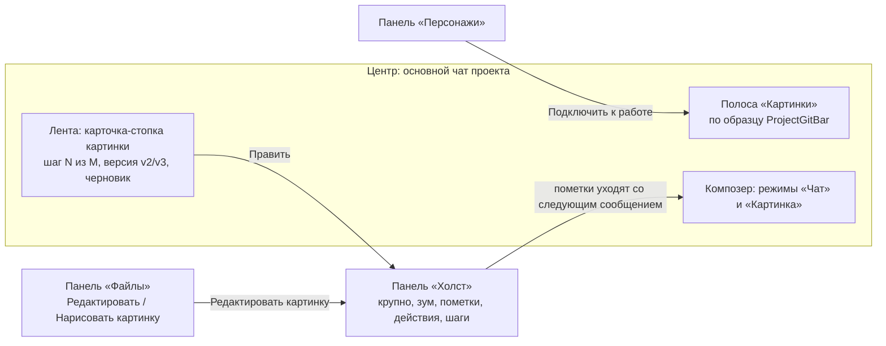

# Редактор картинок v3: вся работа с картинкой — в основном чате проекта

Макет: [image-editor-v3-in-chat.html](image-editor-v3-in-chat.html). Открывается без сети. В шапке макета —
тема (светлая / тёмная), ширина (десктоп / телефон 390) и «Сначала». Это только макет, код продукта не
менялся. Предыдущая версия — [image-editor-v2.html](image-editor-v2.html) и
[image-editor-v2-proposal.md](image-editor-v2-proposal.md).

## Главное

Отдельного окна редактора и отдельного «чата картинки» больше нет. Картинка живёт в обычном чате
проекта, и её функции разнесены по четырём местам, которые в продукте уже есть или делаются тем же
механизмом:

- **Панель «Холст»** — новая боковая панель рядом с «Файлы» и «Задачи», тем же механизмом
  (`PanelZone` / `panelCatalog.ts`): открыть значком рельсы, превью по наведению с булавкой
  «Закрепить», перетащить за шапку в другую зону, закрыть крестиком. В ней картинка в фокусе
  крупно с зумом и панорамой, инструменты пометок, быстрые действия, правки без ИИ, «до / после»,
  список шагов с откатом, «Сохранить в проект» и «Сохранить как…».
- **Панель «Персонажи»** — тот же механизм. Список персонажей проекта, создание, правка, удаление,
  «Подключить к работе».
- **Полоса «Картинки»** над композером — по образцу `ProjectGitBar`: плашка того же вида, сворачивается
  в одну строку-сводку.
- **Композер** переключается сегментом «Чат | Картинка», в режиме «Картинка» текст — это промпт модели.

## Раскладка

**Десктоп.** Слева рельса и зона (по умолчанию «Чаты»), в центре чат, справа зона с панелями и
рельса. Значки «Персонажи» и «Холст» в рельсе помечены точкой «новое». Если открыто сразу много
панелей, они ужимаются до своего минимума: «Холст» до 360 px, чат до 380 px.

**Телефон 390.**
- «Персонажи» и «Файлы» открываются шторкой на 86 % высоты (значки в шапке чата).
- «Холст» занимает весь экран поверх ленты, полоса «Картинки» и композер остаются внизу: пометки
  рисуются и тут же уходят сообщением.
- Полоса «Картинки» по умолчанию свёрнута в строку «Работаем с: hero.png · fal · FLUX Fill · 2 варианта ·
  ≈ $0.10», тап разворачивает её.

## Фокус: одна картинка «в работе»

В чате может быть несколько картинок. Режим «Картинка», быстрые действия, пометки, персонаж, образцы и
агент действуют только на **картинку в фокусе**:

- в полосе «Картинки» закреплён чип **«Работаем с: hero.png · шаг 2 ✕»**, крестик снимает фокус;
- у её карточки в ленте акцентная рамка и метка «в работе»;
- клик по любой другой картинке показывает поверх неё «Работать с этой» и «Править на холсте»;
- без фокуса в полосе стоит чип «Новая картинка». Следующая генерация рисует новую картинку, а не
  правит старую. Если вход был через «Нарисовать картинку» у папки, в чипе есть и папка:
  «Новая картинка · сохранять в images/blog/».

## Полоса «Картинки» — состав и почему такой

| Элемент | Зачем в полосе, а не где-то ещё |
|---|---|
| Чип «Работаем с: …» | Отвечает на вопрос «к чему относится то, что я сейчас напишу». Это роль метки ветки в `ProjectGitBar` |
| Поставщик ▾ и модель ▾ | Выбирается до каждого запуска, должен быть на виду. Если модель сменил агент, у кнопки акцентная рамка и «✦» |
| Число вариантов − N + | Влияет на цену, поэтому стоит рядом с ней |
| Цена: «3 варианта · ≈ $0.24» или «Бесплатно · ~120 с · очередь: 1» (локально) | Видно, сколько стоит, до нажатия |
| Персонаж: чип с аватаром и ✕ или пунктирный «Персонаж» | Подключённый персонаж уходит в каждую генерацию, поэтому его нельзя прятать. Пунктирный чип открывает панель «Персонажи» |
| Образцы: чипы «имя · роль», клик меняет роль, «+ Образец» | Образцы относятся к ближайшему запуску, как вложения |
| «Размер оригинала» (есть только при фокусе) | Флаг правки: результат вернётся в размере исходника |
| Предупреждение «FLUX Kontext не правит по маске… · Взять FLUX Fill» | Иначе кнопка запуска серая без объяснения причины |

**Не в полосе:** быстрые действия и правки без ИИ. Они относятся к картинке, поэтому живут на «Холсте».

Полоса видна, когда включён режим «Картинка» или есть картинка в фокусе. Свернуть её можно в любой
момент, и выбор запоминается. При переключении в «Картинка» на десктопе полоса раскрывается сама.

## Композер: «Чат» и «Картинка»

| | Чат | Картинка |
|---|---|---|
| Кому текст | Claude (или выбранной персоне) | Прямо в модель, без агента |
| Плейсхолдер | Спросите Claude… | Что изменить в hero.png? Отметьте место на холсте или просто опишите / Опишите новую картинку — например, «Аня в кафе» |
| Над полем | — | «Промпт модели · уходит прямо в FLUX Fill, без агента» |
| Кнопка | Отправить ↑ | «✦ Сгенерировать · ≈ $0.24» без фокуса, «✦ Изменить · ≈ $0.15» при фокусе, у локальной модели «бесплатно» |
| Рамка поля | обычная | акцентная |

- Черновики двух режимов хранятся раздельно: переключение режима не стирает текст.
- Пометки с «Холста» видны в композере чипом «hero.png · 1 пометка ✕» и уходят со следующим
  сообщением в любом режиме. Крестик означает «не прикладывать».
- Прямой запуск пишется в ленту тихой строкой «Вы запустили: «убери чашку» · hero.png · 1 пометка ·
  FLUX Fill · ≈ $0.15 · 3 варианта». Так агент знает, что делалось без него.
- **Агент в обычном режиме по-прежнему запускает генерацию сам** (решение v2 остаётся в силе: без
  вопроса, отменить можно в карточке).

## Карточка-стопка (нить картинки)

Картинка в ленте — **одна карточка на картинку**, а не по карточке на каждый шаг:

- Шапка: имя файла, версия «v1 · в проекте» или «черновик», навигация «‹ шаг 2 из 3 ›». Если шагов
  больше одного, позади карточки видны края стопки.
- Идёт генерация: внутри той же карточки строка «● Рисуем 3 варианта… · FLUX Fill · ≈ $0.15 ·
  Отменить», полоса прогресса и заглушки вариантов.
- Готово: в карточке миниатюры вариантов, «Взять вариант N», «До / после на холсте», «Не брать».
  Взятый вариант становится следующим шагом, **новая карточка не появляется**.
- Низ карточки: подпись шага, «Править», «↓ Скачать», «Сохранить в проект» / «В проекте»,
  «Сохранить как…». Существующие кнопки `MediaBlock` остаются, к ним добавляется «Править».
- Новая картинка с нуля («Аня в кафе») появляется карточкой «anya-cafe.png · новая картинка» с
  вариантами. Первый взятый вариант становится шагом 1, и картинка переходит в фокус.

## Персонажи

Управление персонажами целиком переехало в панель:

- в списке аватар, имя, «N фото», «Подключить к работе» / «Отключить» и карандаш «Изменить»;
- «Новый персонаж» и «Изменить» открывают форму прямо в панели: имя, описание, фото 3–10 (плитки с
  ✕, плитка «загрузить»), плашка про отправку фото (текст дословно из `CharacterDialog.tsx`) и галочка
  «Понимаю, у людей на фото есть согласие». Согласие не запоминается, «Сохранить» недоступна без имени,
  трёх фото и галочки, под кнопкой подсказка, чего не хватает;
- «Удалить» в форме спрашивает подтверждение: «Удалить «Аня»? Папка characters/anya/ с фото удалится
  из проекта»;
- подключённый персонаж — это **чип в полосе «Картинки»**. Он общий для проекта и действует, пока
  его не отключат.

## Вход из дерева файлов

- **«Редактировать картинку»** («⋯» у файла-картинки) открывает **последний активный чат проекта**:
  если это новый проект без чатов, создаётся новый чат. Картинка встаёт в фокус, открывается «Холст»,
  композер переходит в «Картинка». Если картинка (или её версия) в этом чате уже есть, берётся её
  карточка и в ленту падает тихая строка «Открыто из «Файлов»: images/hero.png — картинка уже есть в
  этом чате, взята в работу». Если картинки в чате нет, в ленту добавляется её карточка.
- **«Нарисовать картинку»** («⋯» у папки) открывает тот же чат: фокус снят, композер в режиме
  «Картинка», в полосе «Новая картинка · сохранять в images/blog/».

## Сохранение и версии

- **«Сохранить в проект»** сохраняет сразу, без диалога, следующей свободной версией рядом с исходником:
  `hero.png` → `hero.v2.png`, если занято — `hero.v3.png`. Новая картинка сохраняется под своим именем.
- **«Сохранить как…»** открывает диалог из v2 без изменений: имя, папка с числом файлов и меткой
  «здесь сейчас», расширение по формату. Перезаписи нет: «Такой файл уже есть: … · Взять «hero.v3.png»».
- После сохранения карточка переходит на новый файл: «v3 · в проекте». В ленту падает строка
  «Сохранено как images/generated/hero.v3.png. Карточка картинки перешла на этот файл, нить шагов —
  вместе с ней», появляется тост «Сохранено в проект: … · Показать в дереве». Исходный файл не меняется.

## Что было в редакторе v2 → куда переехало в v3

| v2 | v3 |
|---|---|
| Отдельное окно редактора | Нет. Основной чат проекта плюс панели |
| Центр: холст (масштаб, рука, пометки) | Панель «Холст» |
| Левая секция «Пометки» (кисть, стрелка, рамка, подпись, ластик, размер кисти) | Панель «Холст», строка инструментов над картинкой |
| Секция «Образцы» | Полоса «Картинки», чипы с ролями и «+ Образец» |
| Секция «Персонажи» и диалог персонажа | Панель «Персонажи» (форма внутри панели) и чип подключённого в полосе |
| Секция «Быстрые действия» и «Дорисовать за края» с пропорциями | Панель «Холст», «Быстрые действия» (пропорции раскрываются под кнопкой) |
| Секция «Чем рисовать» (поставщик, модель) | Полоса «Картинки», поставщик ▾ и модель ▾ |
| Правки без ИИ (размер, сжатие, обрезка, поворот, отражение) | Панель «Холст», «Без ИИ» |
| Секция «История шагов» | В ленте карточка-стопка «шаг N из M ‹ ›», на «Холсте» список «Шаги этой картинки» с «Откатиться» |
| Поле «Промпт» справа сверху, число вариантов, цена, «Сгенерировать» | Композер в режиме «Картинка», число и цена — в полосе, «Сгенерировать · цена» — кнопка композера |
| Метка «✦ написал Claude», «Вернуть мой текст» | Над полем композера в режиме «Картинка», плюс кнопки «Править промпт» / «Вернуть мой» в карточке запуска агентом |
| Чат картинки справа (отдельный чат «hero.png · правка») | Основной чат. Картинка — нить внутри него |
| Авто-снимок холста при изменении | Чип «hero.png · N пометок ✕» в композере, уходит со следующим сообщением |
| Варианты и «до / после» в центре вместо холста | Миниатюры в карточке-стопке, «до / после» со шторкой — на «Холсте» |
| «Взять за основу», «Применить», «Сохранить как…» | «Взять вариант N» (карточка и «Холст»), «Сохранить в проект», «Сохранить как…» (карточка и «Холст») |
| «Новый чат», «Открыть в полном чате» | Не нужны: работа и так идёт в полном чате |
| Телефон: холст плюс шторки «Инструменты» и «Чат» | «Холст» на весь экран поверх ленты, «Персонажи» шторкой, полоса свёрнута в строку |

## Что теряем и как компенсируем

| Что было в v2 | Риск при переезде в чат | Как закрыто в v3 |
|---|---|---|
| **1. Большой холст** в центре окна | Точная маска в узкой колонке ленты неудобна | Холст — отдельная боковая панель «Холст» шириной до 500 px с зумом (кнопки и колесо), панорамой («Рука»), всеми инструментами пометок и действиями. Чат остаётся в центре и живой. «Править» у картинки открывает её на «Холсте». На 390 «Холст» на весь экран поверх ленты, композер снизу. Холст крупнее 500 px — открытый вопрос 1 |
| **2. Одна картинка на окно**, всегда понятно, что правим | В общем чате несколько картинок: к какой относится промпт и просьба агенту? | Фокус: одна картинка «в работе». Чип «Работаем с: hero.png ✕» в полосе, рамка и метка «в работе» у карточки, у остальных «Работать с этой». Режим «Картинка», быстрые действия, пометки и агент работают с картинкой в фокусе, без фокуса рисуется новая |
| **3. Отдельное поле промпта** (длинный текст, «✦ написал Claude», «Вернуть мой текст») | Промпт смешается с сообщением агенту | В режиме «Картинка» композер и есть поле промпта модели: подпись «Промпт модели · уходит прямо в …, без агента», прямой запуск с ценой. В режиме «Чат» — сообщение Claude. Если агент сам поставил промпт, карточка запуска показывает его **целиком** с меткой «✦ Claude», строкой «Изменил: модель → FLUX Fill, вариантов: 2» и кнопками «Править промпт» (переносит в композер «Картинка», там метка «✦ написал Claude») и «Вернуть мой» (возвращает прежний текст человека) |
| **4. История шагов** — компактный список с откатом | Каждый шаг отдельной карточкой замусорил бы ленту, откатываться пришлось бы прокруткой | Варианты и шаги одной картинки не плодят карточки: в ленте одна карточка-стопка «шаг 3 из 5 ‹ ›». Развёрнутый список шагов с миниатюрами, версиями и «Откатиться» — на «Холсте». Откат делает шаг текущим, следующая правка пойдёт от него |
| **5. Чат картинки, который идёт за файлом** (v2→v3, черновик до сохранения) | Непонятно, где живёт разговор о картинке, если окна нет | Выбран вариант **«нить картинки внутри основного чата»**, отдельного чата на картинку нет. Карточка знает свой файл и версии, шаги до сохранения помечены «черновик», после сохранения карточка переходит на новый файл. «Редактировать картинку» из дерева открывает последний активный чат проекта (или новый) с картинкой в фокусе и «Холстом» |

**Почему нить, а не отдельный чат на картинку.** Картинки чаще всего появляются посреди обычной
работы: агент нарисовал шапку, человек приложил фото. Переход в отдельный чат рвёт контекст — агент
там не знает, зачем картинка и что обсуждали. Отдельный чат плодил бы и пустые «hero.png · правка» в
списке, из-за чего в v2 его создавали только после первого сообщения. У нити минус другой: разговоры
о разных картинках смешиваются в одной ленте. Это закрывает фокус (у каждого запуска в ленте есть имя
файла) и кнопка «Новый чат» в панели «Чаты», если человек хочет отдельную ветку.

## Тексты

| Место | Текст |
|---|---|
| Панели в рельсе | Холст · Персонажи |
| Чип фокуса | Работаем с: hero.png · шаг 2 ✕ |
| Без фокуса | Новая картинка / Новая картинка · сохранять в images/blog/ |
| Снятие фокуса (тост) | Фокус снят. Следующая генерация нарисует новую картинку |
| Поверх картинки без фокуса | Работать с этой · Править на холсте |
| Метка у карточки в фокусе | в работе |
| Сегмент композера | Чат · Картинка |
| Над полем в режиме «Картинка» | Промпт модели · уходит прямо в FLUX Fill, без агента |
| Плейсхолдеры | Спросите Claude… / Что изменить в hero.png? Отметьте место на холсте или просто опишите / Опишите новую картинку — например, «Аня в кафе» |
| Кнопка запуска | ✦ Сгенерировать · ≈ $0.24 / ✦ Изменить · ≈ $0.15 / ✦ Изменить · бесплатно |
| Цена локальной модели | Бесплатно · ~120 с · очередь: 1 |
| Чип пометок | hero.png · 1 пометка ✕ |
| Ручной запуск в ленте | Вы запустили: «убери чашку» · hero.png · 1 пометка · FLUX Fill · ≈ $0.15 · 3 варианта |
| Карточка запуска агентом | ✦ Claude запустил генерацию · hero.png · 2 варианта · ≈ $0.10 · Изменил: … · Править промпт · Вернуть мой |
| Генерация в карточке | ● Рисуем 3 варианта… · FLUX Fill · ≈ $0.15 · Отменить |
| Готово в карточке | ✓ Готово · 3 варианта · ≈ $0.15. Выберите — станет следующим шагом. · Взять вариант 1 · До / после на холсте · Не брать |
| Стопка | шаг 2 из 3 ‹ › · v1 · в проекте / черновик |
| Взят вариант (тост) | Шаг 2 — черновик. Сохраните в проект, когда понравится |
| Маска и модель | Nano Banana 2 не правит по маске — кисть на холсте она не увидит. · Взять FLUX Fill |
| Холст, секции | Быстрые действия · сразу, без промпта / Без ИИ · бесплатно, мгновенно / Шаги этой картинки · в ленте — одна карточка-стопка |
| Быстрые действия | Убрать фон · Улучшить · Убрать отмеченное · Улучшить лица · Дорисовать за края |
| Без ИИ | Размер · Сжатие · Обрезка · Поворот · Отражение |
| Откат | Откатиться · (тост) Шаг 1: следующая правка пойдёт от него… |
| Пустой холст | Картинка не выбрана. Нажмите «Править» у картинки в ленте или «Редактировать картинку» в «Файлах». |
| Персонажи | Подключить к работе · Отключить · Новый персонаж · (тост) Персонаж «Маша» подключён к работе — чип в полосе «Картинки» |
| Плашка про фото | как в `CharacterDialog.tsx`: CHARACTER_PHOTOS_NOTICE, «Понимаю, у людей на фото есть согласие» |
| Меню дерева | Редактировать картинку (В последнем активном чате, картинка в фокусе, панель «Холст») · Нарисовать картинку (Чат с композером в режиме «Картинка», сохранять сюда) |
| Сохранение | Сохранено как images/generated/hero.v3.png. Карточка картинки перешла на этот файл, нить шагов — вместе с ней · (тост) Сохранено в проект: … · Показать в дереве |

## Что в макете кликабельно, а что статикой

**Кликабельно:**
- панели: рельса, превью с булавкой, перетаскивание шапки в другую зону, закрытие;
- «Персонажи»: создание с проверками, правка, удаление с подтверждением, подключение и отключение;
- полоса: поставщик, модель, число вариантов, персонаж, образцы и роли, «Размер оригинала»,
  предупреждение про маску, сворачивание;
- композер: оба режима, отдельные черновики, Enter;
- генерация: с нуля и правкой, отмена, варианты, «Взять», стопка «‹ ›»;
- «Холст»: зум (кнопки и колесо), рука, все инструменты пометок, ластик по пометке, быстрые
  действия, правки без ИИ, «до / после» со шторкой, шаги и откат, «Сохранить в проект»,
  «Сохранить как…» с занятым именем;
- агент в режиме «Чат» со сменой модели и промпта, «Править промпт», «Вернуть мой»;
- дерево файлов: оба пункта «⋯», «Показать в дереве»;
- чаты: переключение, «Новый чат»;
- обе темы и 390.

**Статикой:** вложения, выбор персоны, голос, «Скачать», «Изменения» и «Задачи» (только тост). Ответы
агента заготовлены по ключевым словам: «чашка», «вечер». Цены и модели условные. Поворот на 90° в макете
просто уменьшает картинку, а не меняет пропорции кадра.

## Прогон

Headless Playwright (chromium), сценарий из постановки плюс дополнения штаба: 35 проверок, 35 зелёных,
ни одной JS-ошибки и ни одного сетевого запроса.

## Открытые вопросы к Андрею

1. **Ширина «Холста».** Панель до 500 px — это меньше центрального холста v2 (~650 px). Нужна ли у
   «Холста» кнопка «развернуть» на время точной маски (панель временно забирает ширину у чата, чат
   ужимается до ~380 px)?
2. **Фокус при переключении чатов.** Сейчас фокус живёт в чате: ушли в другой чат — там свой фокус или
   никакого. Так и оставить?
3. **«Редактировать картинку» из дерева** в макете открывает последний активный чат. Если этот чат
   сейчас занят ходом агента, открывать всё равно его или создавать новый?
4. **Режим «Картинка» без фокуса и с персонажем.** Подключённый персонаж уходит в каждую генерацию,
   в том числе в правку чужой картинки. Отключать его автоматически при смене фокуса?
5. **Стопка и откат.** После отката к шагу 2 и новой правки поздние шаги (3–5) в макете отбрасываются,
   как в v2. Хранить их веткой или достаточно предупреждения?
6. **Агент и фокус.** Можно ли агенту самому переводить фокус на другую картинку («поправь ту, что
   выше»), или фокус меняет только человек?
