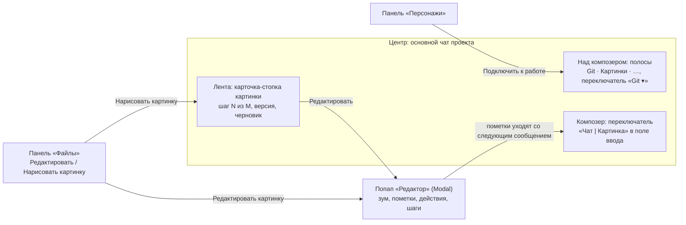

# Редактор картинок v3: вся работа с картинкой — в основном чате проекта

Макет: [image-editor-v3-in-chat.html](image-editor-v3-in-chat.html). Открывается без сети. В шапке макета —
тема (светлая / тёмная), ширина (десктоп / телефон 390), число
полос (2 сейчас / 5 с будущими) и «Сначала». Это только макет, код продукта не
менялся. Предыдущая версия — [image-editor-v2.html](image-editor-v2.html) и
[image-editor-v2-proposal.md](image-editor-v2-proposal.md).

## Главное

Отдельного окна редактора и отдельного «чата картинки» больше нет. Картинка живёт в обычном чате
проекта, и её функции разнесены по местам, которые в продукте уже есть:

- **Попап «Редактор»** — `Modal` из `components/ui/`, почти во весь экран (на 390 — на весь экран).
  Открывается кнопкой «Редактировать» у картинки в ленте или пунктом «Редактировать картинку» в
  «Файлах». В нём картинка крупно с зумом и панорамой, пометки (кисть-маска, рамка, стрелка,
  подпись, ластик), быстрые действия, правки без ИИ, «до / после», шаги с откатом, «Сохранить в
  проект» и «Сохранить как…». Открытие попапа делает картинку выбранной, закрытие (✕, «Готово»,
  Esc) выбор не снимает. Отдельной панели «Холст» больше нет.
- **Панель «Персонажи»** — боковая панель тем же механизмом (`PanelZone` / `panelCatalog.ts`):
  список персонажей проекта, создание, правка, удаление, «Подключить к работе».
- **Над композером — полосы, одна видна за раз.** По умолчанию git-полоса (`ProjectGitBar`), рядом
  полоса «Картинки», позже «Видео», «Звук», «Локальные руки». Человек переключает их сам заголовком
  полосы «Git ▾». Выбрали картинку — полоса сама переходит на «Картинки»; сняли выбор — вернулась
  прежняя. Подробно — раздел «Полосы над композером».
- **Композер без выбранной картинки не меняется вовсе.** Переключатель «Чат | Картинка» появляется
  только при выбранной картинке и встроен в поле ввода слева: две иконки в одну строку с
  плейсхолдером, композер не становится выше. В режиме «Картинка» текст — промпт модели.

## Раскладка

**Десктоп.** Слева рельса и зона (по умолчанию «Чаты»), в центре чат, справа зона с панелями и
рельса. Значок «Персонажи» в рельсе помечен точкой «новое». Попап «Редактор» ложится поверх всего
с отступом 14 px: слева холст с инструментами, справа колонка 310 px с быстрыми действиями, «Без
ИИ» и шагами, внизу подсказка про пометки и кнопки сохранения. Картинка вписывается в холст
целиком при любой высоте окна.

**Телефон 390.**
- «Персонажи» и «Файлы» открываются шторкой на 86 % высоты (значки в шапке чата).
- Попап «Редактор» занимает весь экран: холст сверху, секции ниже прокруткой, кнопки внизу.
  В продукте это отдельный вариант `Modal` — сейчас мобильный `Modal` открывается шторкой на 92 %.
- Полоса над композером по умолчанию скрыта, как git-полоса сейчас. Выбор полосы — значок в шапке чата
  или название в строке полосы, открывается шторка «Полоса над композером».
- При выборе картинки полоса «Картинки» появляется свёрнутой в строку «Работаем с: hero.png · fal ·
  FLUX Fill · 2 варианта · ≈ $0.10 ✕»: тап разворачивает, ✕ снимает выбор.

## Выбор: одна картинка «в работе»

В чате может быть несколько картинок. Режим «Картинка», быстрые действия, пометки, персонаж, образцы и
агент действуют только на **выбранную картинку**:

- выбрать картинку можно кнопкой «Редактировать» (сразу открывается попап) или кликом по картинке →
  «Работать с этой»;
- в полосе «Картинки» закреплён чип **«Работаем с: hero.png · шаг 2 ✕»**, крестик снимает выбор;
- у её карточки в ленте акцентная рамка и метка «в работе»;
- без выбора нет режима «Картинка», композер обычный. Полоса «Картинки» без выбора доступна, но
  только для настройки: поставщик, модель, варианты, персонаж и «Нарисовать новую». Снятие выбора в
  режиме «Картинка» возвращает композер в «Чат».

### Новая картинка: карточка-черновик

Режим «Картинка» требует выбранной картинки, а при рисовании с нуля картинки ещё нет. Решение —
**карточка-черновик «Новая картинка»**: «Нарисовать картинку» у папки в «Файлах» кладёт в ленту
пустую карточку с пунктирной рамкой «Новая картинка · сохранять в images/blog/», сразу выбирает её и
включает режим «Картинка». Дальше всё как с обычной картинкой: чип «Работаем с: Новая картинка ·
сохранять в images/blog/ ✕», кнопка «✦ Сгенерировать · цена», варианты появляются в этой же
карточке, первый взятый вариант становится шагом 1, карточка получает имя по промпту
(`anya-cafe.png`).

Почему так, а не «режим без картинки»:
- правило остаётся одним и без исключений: режим «Картинка» есть только у выбранной картинки;
- человек сразу видит, где появится результат и куда он сохранится;
- если передумал, ✕ на чипе убирает пустой черновик из ленты вместе с выбором, мусора не остаётся;
- в обычном режиме «Чат» можно по-прежнему попросить агента «нарисуй…» — он запустит генерацию сам.

Черновик создаётся при «Нарисовать картинку» из дерева, кнопкой «Нарисовать новую» в полосе «Картинки»
без выбора и агентом. В композере отдельной кнопки нет, чтобы не нагружать его.

## Полоса «Картинки» — состав и почему такой

| Элемент | Зачем в полосе, а не где-то ещё |
|---|---|
| Чип «Работаем с: …» | Отвечает на вопрос «к чему относится то, что я сейчас напишу». Это роль метки ветки в `ProjectGitBar` |
| Поставщик ▾ и модель ▾ | Выбирается до каждого запуска, должен быть на виду. Если модель сменил агент, у кнопки акцентная рамка и «✦» |
| Число вариантов − N + | Влияет на цену, поэтому стоит рядом с ней |
| Цена: «3 варианта · ≈ $0.24» или «Бесплатно · ~120 с · очередь: 1» (локально) | Видно, сколько стоит, до нажатия |
| Персонаж: чип с аватаром и ✕ или пунктирный «Персонаж» | Подключённый персонаж уходит в каждую генерацию, поэтому его нельзя прятать. Пунктирный чип открывает панель «Персонажи» |
| Образцы: чипы «имя · роль», клик меняет роль, «+ Образец» | Образцы относятся к ближайшему запуску, как вложения |
| «Размер оригинала» (только у картинки с шагами) | Флаг правки: результат вернётся в размере исходника |
| Предупреждение «FLUX Kontext не правит по маске… · Взять FLUX Fill» | Иначе кнопка запуска серая без объяснения причины |

**Не в полосе:** быстрые действия и правки без ИИ. Они относятся к картинке, поэтому живут в попапе
«Редактор».

Состояния полосы «Картинки»:

| | Без выбранной картинки | С выбранной |
|---|---|---|
| Первая строка | «Картинки ▾» · «Выберите картинку в ленте или нарисуйте новую» · «✦ Нарисовать новую» | «Картинки ▾» · чип «Работаем с: hero.png · шаг 2 ✕» |
| Вторая строка | поставщик, модель, варианты, цена, персонаж, образцы | то же плюс «Размер оригинала» (у картинки с шагами) |
| Свёрнутая строка | «Картинка не выбрана · fal · Авто · 3 варианта · ≈ $0.24» | «Работаем с: hero.png · fal · Авто · …» и ✕ |

Настройки без выбора не пропадают: выбранные поставщик, модель и персонаж подхватит следующая картинка.

## Полосы над композером и переключатель

Над композером живёт **одна полоса за раз** из реестра: Git, Картинки, дальше Видео, Звук, Локальные
файлы. Полоса — компонент плюс строка в реестре (`id`, название, иконка, строка состояния), поэтому
новая добавляется без правки переключателя.

### Сравнение вариантов переключателя

В макете остался только B, его согласовал Андрей. A и C здесь — для истории решения.

| Вариант | Плюсы | Минусы |
|---|---|---|
| **A · Иконки-вкладки слева на полосе** | Все полосы на виду, переключение в один клик; сразу понятно, что полос несколько | При 5 полосах съедает ~130 px ширины на каждой полосе, с 6–7 не влезает; будущие неактивные иконки шумят постоянно; на телефоне не помещаются рядом с содержимым полосы |
| **B · Заголовок полосы со списком «Git ▾»** — **выбран** | Ширина как у нынешнего заголовка при любом числе полос; в меню видно состояние каждой полосы («feat/site-header · +42 −7 · 2 к публикации», «Работаем с hero.png»); тот же приём в свёрнутой строке и на телефоне; в том же меню «Свернуть полосу в строку» | Два клика вместо одного; соседние полосы не видны |
| **C · Тонкая строка иконок у левого края композера** | Ноль высоты, один клик; полоса сама не меняется | Вторая «рельса» рядом с рельсой панелей, их легко спутать; отнимает ~30 px ширины и у полосы, и у композера; на телефоне места нет, при свёрнутой полосе висит вдоль пустоты |

**Почему B.** Андрей просил две вещи: не шуметь и не ломаться с ростом числа полос. B — единственный
вариант, у которого занимаемое место не зависит от числа полос: заголовок «Git» у полосы и так есть, к
нему добавляется только «▾». Минус «два клика» закрывает автопереключение: самый частый переход
(git → картинки) происходит сам, когда человек выбирает картинку. Второй минус, «чужие полосы не видны»,
закрывают строка состояния каждой полосы в меню и **точка на «▾»**, если картинка выбрана, а её полоса
скрыта. Высоту не отнимает ни один из трёх вариантов: полоса 36 px, свёрнутая строка 30 px, композер
не меняется (проверено в прогоне).

### Поведение

- **По умолчанию** открыта «Git». В проекте без git — первая доступная полоса, то есть «Картинки».
- **Запоминание — на проект и устройство** (`localStorage`, ключ вида `cc-composer-strip:{projectId}`),
  как сейчас `cc-gitbar-collapsed`. Не на чат: полосы описывают проект (его git, его персонажей), и
  если в соседнем чате вдруг другая полоса, это выглядит как сбой. Не на сервере: это раскладка
  экрана, на телефоне и десктопе она законно разная.
- **Выбор картинки в ленте — соглашаюсь с Софьей, с одним уточнением.** Выбрали картинку («Работать с
  этой», «Редактировать», из «Файлов», «Нарисовать новую») — полоса сама переходит на «Картинки».
  Сняли выбор — возвращается прежняя. Уточнение: **возврат только если человек сам не переключал
  полосу** за это время. Ушёл вручную на Git при выбранной картинке — Git и останется; сам открыл
  «Картинки» до выбора — после снятия выбора «Картинки» остаются. Тост говорит, что произошло:
  «Картинка больше не выбрана: режим «Чат», над композером снова полоса «Git»».
- **Режим композера «Картинка» возвращает полосу «Картинки»**, если человек успел уйти на другую.
  Причина — деньги: запуск платный, и цена, модель и число вариантов должны быть на виду до нажатия.
- **Свернуть** — шеврон «⌃» справа на полосе или пункт «Свернуть полосу в строку» в меню «Git ▾».
  Свёрнутое состояние одно на все полосы (строка 30 px), переключатель в строке остаётся: из свёрнутой
  «Git» можно перейти в свёрнутые «Картинки». Тап по строке разворачивает. На десктопе сейчас
  `ProjectGitBar` не сворачивается вовсе (только узкий планшет) — предлагаю дать шеврон везде.

### Режим «Картинка» без выбранной картинки — оставляю как было

Режим «Картинка» по-прежнему только при выбранной картинке. Без выбора модели нечего править, а
промпт «с нуля» без карточки-черновика некуда положить: непонятно, где появятся варианты и куда
сохранятся. Вместо режима без картинки в полосе «Картинки» есть кнопка **«✦ Нарисовать новую»**: она
кладёт карточку-черновик «Новая картинка · сохранять в images/» и сразу включает режим «Картинка».
Итог — один клик до рисования с нуля, а правило остаётся без исключений.

### Будущие полосы

«Видео», «Звук», «Локальные руки» в макете — неактивные пункты с пометкой «скоро» в меню «Git ▾» и в
шторке на телефоне. Демо-кнопка «Полос: 2 / 5» показывает переключатель в обоих состояниях. В
продукте неготовые полосы **не показываем вовсе**, пометка «скоро» — только ради макета.

### Телефон 390

Сейчас `ProjectGitBar` на телефоне скрыт. Сохраняем это: **по умолчанию полоса скрыта**, высоту ленты
она не отнимает. Переключение на телефоне:

- значок «Полоса» в шапке чата и название полосы в свёрнутой строке («Git ▾») открывают шторку
  «Полоса над композером»: крупные пункты с состоянием, «скоро» у будущих и пункт «Не показывать
  полосу»;
- выбранная полоса стоит над композером свёрнутой строкой 30 px, тап разворачивает;
- выбор картинки показывает строку «Картинки» даже при скрытой полосе, снятие выбора снова её прячет.

## Композер: «Чат» и «Картинка»

Без выбранной картинки композер ровно такой, как сейчас: переключателя нет. При выбранной картинке
слева в поле ввода появляется переключатель из двух иконок (💬 чат, 🖼 картинка) в одну строку с
плейсхолдером — высота композера не растёт, нижняя строка кнопок не меняется.

| | Чат | Картинка |
|---|---|---|
| Кому текст | Claude (или выбранной персоне) | Прямо в модель, без агента |
| Плейсхолдер | Спросите Claude… | Что изменить в hero.png? Отметьте место в редакторе или просто опишите / у черновика: Опишите новую картинку — например, «Аня в кафе» |
| Над полем | — | «Промпт модели · уходит прямо в FLUX Fill, без агента» |
| Кнопка | Отправить ↑ | «✦ Изменить · ≈ $0.15», у черновика «✦ Сгенерировать · ≈ $0.24», у локальной модели «бесплатно» |
| Рамка поля | обычная | акцентная |

- Черновики двух режимов хранятся раздельно: переключение режима не стирает текст.
- Пометки из редактора видны в композере чипом «hero.png · 1 пометка ✕» и уходят со следующим
  сообщением в любом режиме. Крестик означает «не прикладывать».
- Прямой запуск пишется в ленту тихой строкой «Вы запустили: «убери чашку» · hero.png · 1 пометка ·
  FLUX Fill · ≈ $0.15 · 3 варианта». Так агент знает, что делалось без него.
- **Агент в обычном режиме по-прежнему запускает генерацию сам** (решение v2 остаётся в силе: без
  вопроса, отменить можно в карточке).

## Карточка-стопка (нить картинки)

Картинка в ленте — **одна карточка на картинку**, а не по карточке на каждый шаг:

- Шапка: имя файла, версия «v1 · в проекте» или «черновик», навигация «‹ шаг 2 из 3 ›». Если шагов
  больше одного, позади карточки видны края стопки.
- Идёт генерация: внутри той же карточки строка «● Рисуем 3 варианта… · FLUX Fill · ≈ $0.15 ·
  Отменить», полоса прогресса и заглушки вариантов.
- Готово: в карточке миниатюры вариантов, «Взять вариант N», «До / после в редакторе», «Не брать».
  Взятый вариант становится следующим шагом, **новая карточка не появляется**.
- Низ карточки: подпись шага, «Редактировать», «↓ Скачать», «Сохранить в проект» / «В проекте»,
  «Сохранить как…». Существующие кнопки `MediaBlock` остаются, к ним добавляется «Редактировать».
- Новая картинка с нуля начинается с карточки-черновика (см. выше), варианты появляются в ней же.

## Персонажи

Управление персонажами целиком переехало в панель:

- в списке аватар, имя, «N фото», «Подключить к работе» / «Отключить» и карандаш «Изменить»;
- «Новый персонаж» и «Изменить» открывают форму прямо в панели: имя, описание, фото 3–10 (плитки с
  ✕, плитка «загрузить»), плашка про отправку фото (текст дословно из `CharacterDialog.tsx`) и галочка
  «Понимаю, у людей на фото есть согласие». Согласие не запоминается, «Сохранить» недоступна без имени,
  трёх фото и галочки, под кнопкой подсказка, чего не хватает;
- «Удалить» в форме спрашивает подтверждение: «Удалить «Аня»? Папка characters/anya/ с фото удалится
  из проекта»;
- подключённый персонаж — это **чип в полосе «Картинки»**. Он общий для проекта и действует, пока
  его не отключат.

## Вход из дерева файлов

- **«Редактировать картинку»** («⋯» у файла-картинки) открывает **последний активный чат проекта**:
  если это новый проект без чатов, создаётся новый чат. Чат занят ходом агента — всё равно он: сообщение уйдёт после хода. Картинка становится выбранной, открывается
  попап «Редактор», композер переходит в «Картинка». Если картинка (или её версия) в этом чате уже
  есть, берётся её карточка и в ленту падает тихая строка «Открыто из «Файлов»: images/hero.png —
  картинка уже есть в этом чате, взята в работу». Если нет, в ленту добавляется её карточка.
- **«Нарисовать картинку»** («⋯» у папки) открывает тот же чат и кладёт в ленту карточку-черновик
  «Новая картинка · сохранять в images/blog/»: она выбрана, композер в режиме «Картинка».

## Сохранение и версии

- **«Сохранить в проект»** сохраняет сразу, без диалога, следующей свободной версией рядом с исходником:
  `hero.png` → `hero.v2.png`, если занято — `hero.v3.png`. Новая картинка сохраняется под своим именем.
- **«Сохранить как…»** открывает диалог из v2 без изменений: имя, папка с числом файлов и меткой
  «здесь сейчас», расширение по формату. Перезаписи нет: «Такой файл уже есть: … · Взять «hero.v3.png»».
- После сохранения карточка переходит на новый файл: «v3 · в проекте». В ленту падает строка
  «Сохранено как images/generated/hero.v3.png. Карточка картинки перешла на этот файл, нить шагов —
  вместе с ней», появляется тост «Сохранено в проект: … · Показать в дереве». Исходный файл не меняется.

## Что было в редакторе v2 → куда переехало в v3

| v2 | v3 |
|---|---|
| Отдельное окно редактора | Нет. Основной чат проекта, попап «Редактор» и панель «Персонажи» |
| Центр: холст (масштаб, рука, пометки) | Попап «Редактор» (`Modal` почти во весь экран), открывается «Редактировать» у картинки |
| Левая секция «Пометки» (кисть, стрелка, рамка, подпись, ластик, размер кисти) | Попап «Редактор», строка инструментов над холстом |
| Секция «Образцы» | Полоса «Картинки», чипы с ролями и «+ Образец» |
| Секция «Персонажи» и диалог персонажа | Панель «Персонажи» (форма внутри панели) и чип подключённого в полосе |
| Секция «Быстрые действия» и «Дорисовать за края» с пропорциями | Попап «Редактор», правая колонка «Быстрые действия» (пропорции раскрываются под кнопкой) |
| Секция «Чем рисовать» (поставщик, модель) | Полоса «Картинки», поставщик ▾ и модель ▾ |
| Правки без ИИ (размер, сжатие, обрезка, поворот, отражение) | Попап «Редактор», «Без ИИ» |
| Секция «История шагов» | В ленте карточка-стопка «шаг N из M ‹ ›», в попапе список «Шаги этой картинки» с «Откатиться» |
| Поле «Промпт» справа сверху, число вариантов, цена, «Сгенерировать» | Композер в режиме «Картинка» (переключатель в поле ввода, только при выбранной картинке), число и цена — в полосе, «Изменить / Сгенерировать · цена» — кнопка композера |
| «Новая картинка» в редакторе | Карточка-черновик «Новая картинка» из «Нарисовать картинку» |
| Метка «✦ написал Claude», «Вернуть мой текст» | Над полем композера в режиме «Картинка», плюс кнопки «Править промпт» / «Вернуть мой» в карточке запуска агентом |
| Чат картинки справа (отдельный чат «hero.png · правка») | Основной чат. Картинка — нить внутри него |
| Авто-снимок холста при изменении | Чип «hero.png · N пометок ✕» в композере, уходит со следующим сообщением |
| Варианты и «до / после» в центре вместо холста | Миниатюры в карточке-стопке, «до / после» со шторкой — в попапе |
| «Взять за основу», «Применить», «Сохранить как…» | «Взять вариант N» (карточка и попап), «Сохранить в проект», «Сохранить как…» (карточка и попап) |
| «Новый чат», «Открыть в полном чате» | Не нужны: работа и так идёт в полном чате |
| Телефон: холст плюс шторки «Инструменты» и «Чат» | Попап «Редактор» на весь экран, «Персонажи» шторкой, полоса свёрнута в строку |

## Что теряем и как компенсируем

| Что было в v2 | Риск при переезде в чат | Как закрыто в v3 |
|---|---|---|
| **1. Большой холст** в центре окна | Точная маска в узкой колонке ленты неудобна | Холст — в попапе «Редактор» (`Modal` почти во весь экран; решение Андрея, кнопки «Развернуть» нет): холст крупнее, чем был центр v2, картинка вписывается целиком, зум (кнопки и колесо), панорама («Рука»), все инструменты пометок, быстрые действия, «Без ИИ», шаги и сохранение. «Редактировать» у картинки открывает попап и выбирает картинку; закрытие выбор не снимает, пометки уходят чипом в композер. На 390 попап на весь экран. Цена: пока попап открыт, ленту не видно — прогресс генерации показан строкой в самом попапе, а варианты можно сравнить в нём же |
| **2. Одна картинка на окно**, всегда понятно, что правим | В общем чате несколько картинок: к какой относится промпт и просьба агенту? | Выбор: одна картинка «в работе». Чип «Работаем с: hero.png ✕» в полосе, рамка и метка «в работе» у карточки, у остальных «Работать с этой». Режим «Картинка» есть только при выборе; при выборе полоса сама переходит на «Картинки», а если человек увёл её на другую — точка на «▾». Новая картинка — карточка-черновик, тоже выбранная |
| **3. Отдельное поле промпта** (длинный текст, «✦ написал Claude», «Вернуть мой текст») | Промпт смешается с сообщением агенту | В режиме «Картинка» (переключатель в поле ввода, только при выбранной картинке) композер и есть поле промпта модели: подпись «Промпт модели · уходит прямо в …, без агента», прямой запуск с ценой. В режиме «Чат» — сообщение Claude. Если агент сам поставил промпт, карточка запуска показывает его **целиком** с меткой «✦ Claude», строкой «Изменил: модель → FLUX Fill, вариантов: 2» и кнопками «Править промпт» (переносит в композер «Картинка», там метка «✦ написал Claude») и «Вернуть мой» (возвращает прежний текст человека) |
| **4. История шагов** — компактный список с откатом | Каждый шаг отдельной карточкой замусорил бы ленту, откатываться пришлось бы прокруткой | Варианты и шаги одной картинки не плодят карточки: в ленте одна карточка-стопка «шаг 3 из 5 ‹ ›». Развёрнутый список шагов с миниатюрами, версиями и «Откатиться» — в попапе «Редактор». Откат делает шаг текущим, следующая правка пойдёт от него, а поздние шаги уйдут в ленту старой стопкой |
| **5. Чат картинки, который идёт за файлом** (v2→v3, черновик до сохранения) | Непонятно, где живёт разговор о картинке, если окна нет | Выбран вариант **«нить картинки внутри основного чата»**, отдельного чата на картинку нет. Карточка знает свой файл и версии, шаги до сохранения помечены «черновик», после сохранения карточка переходит на новый файл. «Редактировать картинку» из дерева открывает последний активный чат проекта (или новый) с выбранной картинкой и открытым редактором |

**Почему нить, а не отдельный чат на картинку.** Картинки чаще всего появляются посреди обычной
работы: агент нарисовал шапку, человек приложил фото. Переход в отдельный чат рвёт контекст — агент
там не знает, зачем картинка и что обсуждали. Отдельный чат плодил бы и пустые «hero.png · правка» в
списке, из-за чего в v2 его создавали только после первого сообщения. У нити минус другой: разговоры
о разных картинках смешиваются в одной ленте. Это закрывает выбор картинки (у каждого запуска в ленте есть имя
файла) и кнопка «Новый чат» в панели «Чаты», если человек хочет отдельную ветку.

## Тексты

| Место | Текст |
|---|---|
| Панели в рельсе | Персонажи |
| Попап | Редактор · hero.png · v1 · в проекте · шаг 1 из 1 · Готово |
| Кнопка у картинки | Редактировать |
| Чип выбранной картинки | Работаем с: hero.png · шаг 2 ✕ |
| Чип черновика | Работаем с: Новая картинка · сохранять в images/blog/ ✕ |
| Карточка-черновик | Новая картинка · Опишите её в композере в режиме «Картинка» — варианты появятся здесь · сохранять в images/blog/ |
| Снятие выбора (тост) | Картинка больше не выбрана: режим «Чат», над композером снова полоса «Git» / …, полоса «Картинки» осталась — её выбрали вы |
| Переключатель полос | Git ▾ · в меню: Git (feat/site-header · +42 −7 · 2 к публикации), Картинки (Работаем с hero.png / fal · Авто · картинка не выбрана), Видео · скоро, Звук · скоро, Локальные руки · скоро, Свернуть полосу в строку |
| Полоса «Картинки» без выбора | Выберите картинку в ленте или нарисуйте новую · ✦ Нарисовать новую |
| Шторка на телефоне | Полоса над композером · Не показывать полосу (Больше места ленте. Выбранная картинка всё равно покажет свою полосу) |
| Поверх невыбранной картинки | Работать с этой · Редактировать |
| Метка у выбранной карточки | в работе |
| Переключатель в поле ввода (подсказки) | Чат — сообщение Claude · Картинка — промпт прямо в модель, без агента |
| Над полем в режиме «Картинка» | Промпт модели · уходит прямо в FLUX Fill, без агента |
| Плейсхолдеры | Спросите Claude… / Что изменить в hero.png? Отметьте место в редакторе или просто опишите / Опишите новую картинку — например, «Аня в кафе» |
| Кнопка запуска | ✦ Сгенерировать · ≈ $0.24 / ✦ Изменить · ≈ $0.15 / ✦ Изменить · бесплатно |
| Цена локальной модели | Бесплатно · ~120 с · очередь: 1 |
| Чип пометок | hero.png · 1 пометка ✕ |
| Ручной запуск в ленте | Вы запустили: «убери чашку» · hero.png · 1 пометка · FLUX Fill · ≈ $0.15 · 3 варианта |
| Карточка запуска агентом | ✦ Claude запустил генерацию · hero.png · 2 варианта · ≈ $0.10 · Изменил: … · Править промпт · Вернуть мой |
| Генерация в карточке | ● Рисуем 3 варианта… · FLUX Fill · ≈ $0.15 · Отменить |
| Готово в карточке | ✓ Готово · 3 варианта · ≈ $0.15. Выберите — станет следующим шагом. · Взять вариант 1 · До / после в редакторе · Не брать |
| Стопка | шаг 2 из 3 ‹ › · v1 · в проекте / черновик |
| Взят вариант (тост) | Шаг 2 — черновик. Сохраните в проект, когда понравится |
| Маска и модель | Nano Banana 2 не правит по маске — кисть в редакторе она не увидит. · Взять FLUX Fill |
| Редактор, секции | Быстрые действия · сразу, без промпта / Без ИИ · бесплатно, мгновенно / Шаги этой картинки · в ленте — одна карточка-стопка |
| Быстрые действия | Убрать фон · Улучшить · Убрать отмеченное · Улучшить лица · Дорисовать за края |
| Без ИИ | Размер · Сжатие · Обрезка · Поворот · Отражение |
| Откат | Откатиться · (тост) Шаг 1: следующая правка пойдёт от него… |
| Персонажи | Подключить к работе · Отключить · Новый персонаж · (тост) Персонаж «Маша» подключён к работе — чип в полосе «Картинки» |
| Плашка про фото | как в `CharacterDialog.tsx`: CHARACTER_PHOTOS_NOTICE, «Понимаю, у людей на фото есть согласие» |
| Меню дерева | Редактировать картинку (В последнем активном чате: картинка выбрана, открыт редактор) · Нарисовать картинку (В ленте карточка-черновик «Новая картинка», композер в режиме «Картинка») |
| Сохранение | Сохранено как images/generated/hero.v3.png. Карточка картинки перешла на этот файл, нить шагов — вместе с ней · (тост) Сохранено в проект: … · Показать в дереве |

## Что в макете кликабельно, а что статикой

**Кликабельно:**
- панели: рельса, превью с булавкой, перетаскивание шапки в другую зону, закрытие;
- «Персонажи»: создание с проверками, правка, удаление с подтверждением, подключение и отключение;
- переключатель полос «Git ▾» и 2 / 5 полос; ручное переключение; автопереход на
  «Картинки» при выборе и возврат прежней полосы при снятии (✕ в чипе и в свёрнутой строке); точка на
  «▾»; возврат полосы режимом «Картинка»; сворачивание git и «Картинок»; «Нарисовать новую»;
  шторка полос и «Не показывать полосу» на 390;
- полоса: поставщик, модель, число вариантов, персонаж, образцы и роли, «Размер оригинала»,
  предупреждение про маску, сворачивание;
- композер: переключатель в поле ввода только при выборе, отдельные черновики режимов, Enter;
- генерация: правкой и с нуля через карточку-черновик, отмена, варианты, «Взять», стопка «‹ ›»;
- попап «Редактор»: зум (кнопки и колесо), рука, все инструменты пометок, ластик по пометке, быстрые
  действия, правки без ИИ, «до / после» со шторкой, шаги и откат, «Сохранить в проект»,
  «Сохранить как…» с занятым именем, закрытие ✕ / «Готово» / Esc без снятия выбора;
- агент в режиме «Чат» со сменой модели и промпта, «Править промпт», «Вернуть мой»;
- дерево файлов: оба пункта «⋯», «Показать в дереве»;
- чаты: переключение с сохранением выбранной картинки у каждого чата, «Новый чат»;
- персонаж при смене выбранной картинки остаётся, чип подсвечивается;
- откат и новая правка: поздние шаги уходят в ленту старой стопкой;
- обе темы и 390.

**Статикой:** вложения, выбор персоны, голос, «Скачать», кнопки git-полосы (кроме сворачивания), «Изменения» и «Задачи»
(только тост). Ответы агента заготовлены по ключевым словам: «чашка», «вечер». Цены и модели условные.
Поворот на 90° в макете просто уменьшает картинку, а не меняет пропорции кадра.

## Прогон

Headless Playwright (chromium), сценарий постановки: «Редактировать» → попап → пометки (кисть, рамка,
ластик) и зум → закрыть → выбранная картинка в полосе → режим «Картинка» → отправка → взять вариант →
✕ снимает выбор → git-полоса вернулась; Esc; «Нарисовать картинку» → черновик → генерация; пустой
черновик убирается ✕; тёмная тема; 390 (попап на весь экран, свёрнутая полоса, без горизонтальной
прокрутки). 51 проверка, 51 зелёная, ни одной JS-ошибки и ни одного сетевого запроса.

Первый прогон переключателя полос (Node + Playwright, chromium headless), ещё с тремя вариантами: B по умолчанию, меню с 5 полосами и
«скоро», «Картинки» без выбора, автопереход и возврат, ручной выбор не перебивается, точка на «▾»,
режим «Картинка» возвращает полосу, сворачивание и переключение в строке, «Нарисовать новую», варианты
A и C, 2 / 5 полос, высота полосы 36 px и композера без изменений во всех вариантах, тёмная тема, 390
(скрыта по умолчанию, шторка, строка «Картинки» при выборе, «Не показывать полосу», без горизонтальной
прокрутки). 54 проверки, 54 зелёные, ни одной JS-ошибки и ни одного сетевого запроса. Контроль
мутацией: с отключённым автопереключением прогон краснеет на «автопереключение на «Картинки»».

После решений Андрея прогон обновлён: в макете только «Git ▾», «Локальные руки» вместо «Локальные
файлы», выбор своей картинки у каждого чата, персонаж остаётся при смене картинки с подсветкой чипа,
поздние шаги после отката — старой стопкой в ленте. 51 проверка, 51 зелёная, ни одной JS-ошибки и
ни одного сетевого запроса. Мутации: без сохранения выбора чата и без старой стопки прогон краснеет
ровно на этих двух проверках.

## Решения Андрея

1. **Холст** — попап «Редактор» почти во весь экран, на 390 на весь экран; кнопки «Развернуть» нет.
2. **Выбранная картинка своя у каждого чата.** Ушли в другой чат — там свой выбор или никакого;
   вернулись — прежняя картинка снова в работе, полоса «Картинки» открывается по общему правилу.
3. **«Редактировать картинку» из дерева всегда открывает последний активный чат проекта**, даже если
   он занят ходом агента: картинка выбирается сразу, попап открывается, а написанное сообщение уйдёт
   после хода, обычной очередью. Новый чат создаётся, только если чатов в проекте нет.
4. **Персонаж при смене выбранной картинки остаётся подключённым.** Чтобы это не было сюрпризом, его
   чип в полосе «Картинки» на мгновение подсвечивается; отключить — ✕ на чипе.
5. **Откат не теряет шаги.** После отката к шагу 2 и новой правки шаги 3–5 остаются в ленте отдельной
   старой стопкой с меткой «старая стопка» и тихой строкой «Шаги 3–5 не пропали: они остались в ленте
   старой стопкой»; основная стопка продолжается от шага 2.
6. **Переключатель полос — вариант B, заголовок «Git ▾».** В макете остался только он.
7. **Будущая полоса «Локальные файлы» называется «Локальные руки».**

## Остались открытыми

- **Агент и выбор.** Можно ли агенту самому переводить выбор на другую картинку («поправь ту, что
  выше») и создавать карточку-черновик, или выбор меняет только человек? Если можно — переключать ли от
  этого полосу (по правилу выше — да)?
- **Мелочи переключателя:** запоминать полосу на проект и устройство (предложение) или на чат; давать ли
  шеврон «Свернуть» git-полосе на десктопе, где его сейчас нет.
