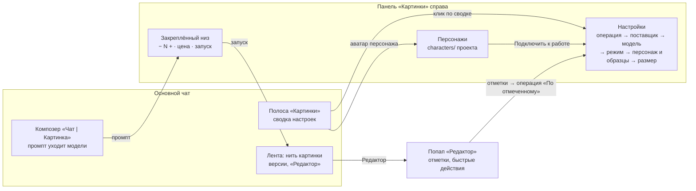
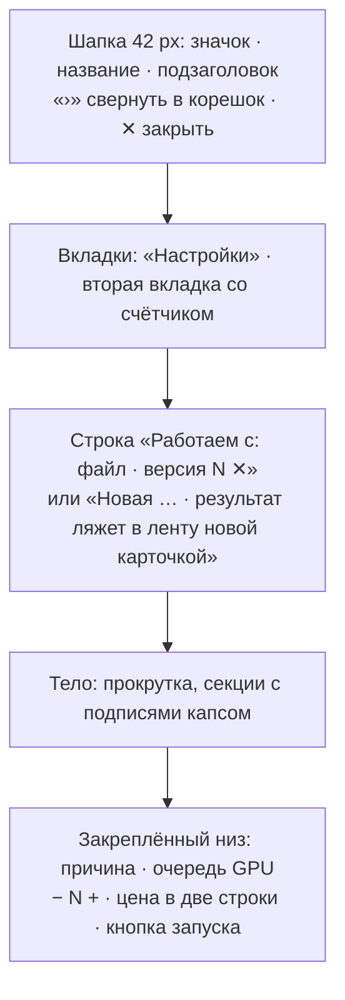

# Картинки v4: настройки в боковой панели

Макет: [image-editor-v4-panel.html](image-editor-v4-panel.html). Открывается без сети. В шапке макета можно
выбрать:
- тему: светлая или тёмная;
- ширину: десктоп, узкий 1024, окно 800, телефон 360;
- чат: в проекте или личный;
- сцену: картинка выбрана, отмечено в редакторе, не выбрана, идёт генерация, очередь GPU, fal не отвечает,
  нет персонажей;
- «Сначала» — сброс.

Под основным кадром — галерея: вкладка «Персонажи», форма нового персонажа, панель в личном чате, панель
без выбранной картинки, операция «Убрать фон», полоса пустая и свёрнутая, опущенная шторка телефона. Код
продукта не менялся.

Отправная точка — живой код `frontend/src/features/imageEditor/` (`strip/ImagesStrip.tsx`, `strip/summary.ts`,
`ProviderModelPicker.tsx`, `characters/CharactersPanel.tsx`, `composer/imageMode.tsx`) и записка
[image-editor-v3-in-chat-proposal.md](image-editor-v3-in-chat-proposal.md). Пара — раздел «Звук» v2:
[audio-editor-v2-proposal.md](audio-editor-v2-proposal.md). Обе панели собраны на одном каркасе, он описан
ниже.

## Главное

Всплывающая карточка «Настройки генерации» над полосой и отдельная панель «Персонажи» сливаются в одну
боковую панель **«Картинки»** с вкладками **«Настройки»** и **«Персонажи»**. Полоса «Картинки» над полем ввода
остаётся сводкой, клик по ней открывает панель.

## Общий каркас панели генерации

Один компонент на «Картинки» и «Звук» (и позже «Видео»). Фронтенд делает его один раз; вертикаль отдаёт
только содержимое. В макетах это функция `genPanel()` — она одинаковая в обоих файлах, побайтно.

### Части каркаса

| Часть | Что в ней | Кто наполняет |
|---|---|---|
| Шапка | Значок раздела, «Картинки» / «Звук», подзаголовок (у картинок «fal · FLUX Kontext», у звука «Музыка · Перегенерировать кусок»), «›» — свернуть в корешок, ✕ — закрыть («Закрыть панель — сводка останется в полосе») | Каркас; подзаголовок — вертикаль |
| Вкладки | «Настройки» всегда первая; вторая — библиотека раздела со счётчиком: «Персонажи 2», «Голоса 3». В личном чате счётчика нет | Каркас; список вкладок — вертикаль |
| Строка контекста | На «Настройках» — с чем работаем и ✕ «Снять выбор»; на второй вкладке — где лежит библиотека («Папка `characters/` проекта · подключённый персонаж уходит в каждую генерацию») | Вертикаль |
| Тело | Прокручиваемая колонка; секции «ОПЕРАЦИЯ», «ПОСТАВЩИК», «МОДЕЛЬ»… — общий стиль подписей и опций-карточек | Вертикаль |
| Закреплённый низ | Строка причины, если запуск невозможен; очередь GPU у локальных; «− N +»; цена: первая строка — итог («≈ $0.08»), вторая — расшифровка («2 × $0.04 за картинку»); кнопка запуска с глаголом («✦ Изменить», «✦ Перегенерировать») | Каркас рисует, данные — вертикаль: `{ reason, queue, count, maxCount, price: [итог, расшифровка], runLabel, onRun }` |

Низ виден всегда, тело прокручивается под ним. На второй вкладке низ свой: «Подключён: **Аня** · ＋
Персонаж» и «Подключён: **Аня** · ＋ Голос».

### Виды

| Вид | Где | Как выглядит |
|---|---|---|
| Колонка | Десктоп | Справа от ленты. Ширина по умолчанию 380 px, тянется за левый край от 340 до 520 px, ширина запоминается на владельца |
| Корешок | Десктоп, «›» в шапке | 44 px: значок раздела (развернуть), значки вкладок, круглая кнопка запуска с подсказкой «Изменить · ≈ $0.08» |
| Шторка | Телефон и окна уже 800 px | 88 % высоты, хват, шапка, вкладки, тело, закреплённый низ |
| Опущенная шторка | Телефон, «⌄» в шапке шторки | Шапка, сводка одной строкой и закреплённый низ; затемнения нет, лента под ней работает. «⌃» или хват поднимают её. Тап по затемнению у поднятой шторки опускает её, а не закрывает |

Ширины: ≥ 1100 px — колонка 380; 860–1100 — колонка 340, лента не уже 440; 800–860 — колонка 320, лента
420; < 800 — шторка. Справа одна панель: открыли «Картинки» — «Звук» и «Файлы» закрылись. Панель поверх
ленты отброшена: на узком окне она закрывала кнопки карточек, ради которых панель и держат открытой.

### Поведение каркаса

- Панель **не закрывается** кликом по ленте, Esc и запуском — только ✕, пунктом рельса или «⌄» на телефоне.
  Ради этого её и переносили.
- Кнопка-сводка в полосе открывает панель на «Настройках», аватар библиотеки (персонаж, голос) — на второй
  вкладке. Пока «Настройки» открыты, сводка подсвечена и подсказывает: «Настройки открыты в панели справа».
- Запуск из панели и из композера равноправны: обе кнопки берут текст из поля ввода и настройки из панели.
- Регистрируется как панель рабочей области (`workspace-panel-def`, `PanelZone` / `panelCatalog.ts`), ключи
  `images` и `sound`. Показ извне — `revealWorkspacePanel(key)`; чтобы открыть нужную вкладку, в `detail`
  события `REVEAL_PANEL_EVENT` предлагаем добавить поле `tab` (сейчас там только `key`).
- Доступность: вкладки — `role="tablist"` / `role="tab"` с `aria-selected`; низ — обычная область, без
  ловушки фокуса.

## Полоса «Картинки»

Состав прежний (вариант C прототипа полос), меняется только назначение кнопки-сводки.

| Элемент | Было | Стало |
|---|---|---|
| Заголовок-переключатель | «Картинки ▾» — меню полос | Без изменений |
| Чип выбора | «Работаем с: **hero.png · версия 2** ✕» / «✦ Нарисовать новую» | Без изменений |
| Кнопка-сводка | «fal · FLUX Kontext · 2 вар. · ≈ $0.08 ▾» — раскрывает карточку настроек | «… ›» — **открывает панель «Картинки» на «Настройках»**, подсвечена, пока они открыты. ⚠ остаётся, если запуск невозможен или поставщик не отвечает. На телефоне — «2 вар. · ≈ $0.08 ⌃» |
| Аватар персонажа | Клик — показать панель «Персонажи» (на телефоне — Modal) | Клик — вкладка «Персонажи» панели «Картинки» (на телефоне — та же вкладка шторки) |
| Свернуть | Строка 30 px со сводкой | Без изменений; клик по сводке в строке открывает панель, по остальной строке — разворачивает полосу |
| «Рисовать нечем: поставщиков не настроил администратор» | Вместо кнопки-сводки | Без изменений |

## Вкладка «Настройки»

Сверху вниз:

1. **Операция** — пилюли: «Авто», «По тексту», «Правка», «По отмеченному», «Дорисовать за края», «Убрать
   фон», «Улучшить качество», «Улучшить лица».
   - «Авто» — умолчание и **ровно нынешнее поведение**: «По тексту» без картинки, «По отмеченному» при
     отметках в редакторе, иначе «Правка». Под пилюлями строка: «Сейчас это **правка**: картинка выбрана,
     отметок нет. Так ведёт себя полоса сейчас.»
   - Недоступные операции серые с причиной: «Сначала выберите картинку в ленте или загрузите её», «Отметьте
     место кистью в редакторе картинки».
   - У операций без промпта подсказка: «Текст в поле ввода не нужен — достаточно нажать кнопку внизу».
     Плейсхолдер композера: «Текст не нужен — нажмите «Убрать фон»».
2. **Поставщик** — «Как в настройках · сейчас fal» и заведённые поставщики с подписью единицы цены.
   Лежащий поставщик выбирается как обычный, но с пометкой «не отвечает» и предупреждением: «fal сейчас не
   отвечает — запуск, скорее всего, не пройдёт. Сами на другого поставщика не переключаем: выберите его
   выше.» Явный выбор не подменяем — как сейчас.
3. **Модель · fal** — опции с ценой «$0.04 за картинку». У «Авто» подпись «подберём модель под задачу».
   Модели, которые не умеют выбранную операцию, серые с причиной: «Не умеет «Дорисовать за края»», «Только
   правит готовую картинку — сначала загрузите её», «Только «Улучшить лица»».
4. **Режим подбора** — только у модели «Авто»: «Авто | Быстро | Точно | Фотореализм» с подсказками
   («модель решает сама», «дешевле и быстрее», «точнее следует правке», «для фото людей и мест»). Это
   `EditMode` из API: сейчас он всегда `auto`, в интерфейсе его нет.
5. **Поля операции**:
   - «Дорисовать за края» — «Дорисовать до пропорций: 1:1 | 16:9 | 9:16»;
   - «По отмеченному» — строка «2 области отмечены в редакторе · модель возьмёт отметки образцом» и «Открыть
     редактор».
6. **Персонаж и образцы** — «до 4 у FLUX Kontext»:
   - подключённый персонаж строкой: аватар, «**Аня** · 6 фото уходят в каждую генерацию», «Сменить» (ведёт
     на вкладку «Персонажи»), ✕ «Отключить»; без персонажа — пунктирный чип «Персонаж»;
   - образцы чипами с миниатюрой «Стиль · palette.jpg ✕»; клик по чипу — выбор роли («Персонаж — сохранить
     лицо», «Стиль», «Предмет») прямо под чипами, а не модальным окном;
   - «＋ Образец» — «С компьютера» / «Из файлов проекта…»;
   - у модели без образцов: «Улучшить лица образцы не берёт»; у операций без промпта: «Для «Убрать фон»
     образцы не нужны».
7. **Размер** — «Вернуть в размере оригинала» и подсказка «Если пропорции результата совпадают с
   исходником». Только при выбранной картинке, как сейчас.

**Закреплённый низ**: «− N +» (до `maxCount` модели; у «Убрать фон», «Улучшить качество», «Улучшить лица» и
у FaceDetailer — ровно 1, «+» серый с подсказкой «Эта операция даёт один вариант»), цена — **«≈ $0.08»** и
«2 × $0.04 за картинку», **«4 кредита»** и «2 × 2 за картинку», **«Бесплатно»** и «~30 с · очередь GPU: 0»,
кнопка «✦ Изменить» / «✦ Сгенерировать» / «✦ Изменить отмеченное» / «✦ Дорисовать» / «✦ Убрать фон». В
очереди — «GPU: 2-я в очереди · старт ≈ через 1 мин».

## Вкладка «Персонажи»

Бывшая панель «Персонажи» (`CharactersPanel`), состав прежний:
- карточка персонажа: аватар, имя, «6 фото · characters/anya/», «Подключить к работе» / «Отключить»,
  «Изменить»;
- «＋ Новый персонаж» — форма прямо во вкладке: имя, «3–10 фото лица · с компьютера или из файлов проекта»,
  «Чем разнообразнее ракурсы и свет, тем лучше модель держит лицо», «Сохранить в characters/»;
- пусто: «**Персонажей пока нет.** Персонаж — 3–10 фото лица. Подключённый персонаж уходит в каждую
  генерацию картинки.» и «＋ Новый персонаж»;
- тост при подключении — как сейчас: «Персонаж «Аня» подключён к работе — чип в полосе «Картинки»».

### Личный чат

- «Настройки»: персонажа нет, подпись секции «Образцы», «＋ Образец» сразу открывает выбор файла с
  компьютера (как сейчас). Локальные модели в личном чате **доступны**, как и сейчас: у картинок такого
  ограничения нет, в отличие от «Звука».
- «Персонажи»: «**Персонажи живут в проекте.** Персонажи хранятся в папке `characters/` проекта. В личном
  чате лицо можно передать образцом с ролью «Лицо» на вкладке «Настройки».»
- В карточке версии «Скачать» вместо «Сохранить в проект».

## Что меняется и что пропадает

| Сейчас | В v4 | Что с полезным |
|---|---|---|
| Карточка «Настройки генерации» 380 px над полосой (`ImagesStrip` → `SettingsPanel`), закрывается кликом мимо и Esc | Вкладка «Настройки» панели «Картинки»; не закрывается сама | Всё содержимое переезжает: поставщик, модель, варианты и цена, персонаж и образцы, «Размер оригинала», предупреждение о блокировке |
| На телефоне — `Modal` «Настройки генерации» | Шторка панели с вкладками, умеет опускаться до цены | — |
| Отдельная панель рабочей области «Персонажи» (`CHARACTERS_PANEL`) и её пункт в рельсе | Вкладка «Персонажи»; в рельсе пункт «Картинки» вместо «Персонажей» | `CharactersPanel` и `CharacterForm` переезжают без изменений. `revealWorkspacePanel(CHARACTERS_PANEL)` → `revealWorkspacePanel('images', 'characters')` |
| `Modal` «Персонажи» из полосы на телефоне | Вкладка шторки | — |
| Модальное окно «Как модели использовать «…»» для роли образца | Выбор роли прямо под чипами | Те же три роли |
| «Варианты и цена» секцией в середине карточки | «− N +» и цена в закреплённом низу | Цена теперь в две строки — с расшифровкой |
| Операция выбирается сама (`pickOp`: generate / edit / inpaint), `mode` всегда `auto` | Явная «Операция» с умолчанием «Авто» (= `pickOp`) и «Режим подбора» у модели «Авто» | Без касания «Авто» всё работает как сейчас |
| «Убрать фон», «Улучшить качество», «Дорисовать за края», «Улучшить лица» — только «Быстрые действия» в попапе «Редактор» | Ещё и операции панели | В редакторе быстрые действия **остаются**: там они в один клик рядом с картинкой. «Убрать отмеченное» остаётся только в редакторе: это отметка плюс готовый промпт |
| Кнопка запуска — только в композере | Ещё и в закреплённом низу панели | Композер не меняется: «✦ Изменить · ≈ $0.08», подсказка «Промпт модели · уходит прямо в …» |
| `ProviderModelPicker` (меню «Поставщик ▾ / Модель ▾», шторка «Чем рисовать») | В полосе и панели не используется | Сам компонент в живом коде уже не рисуется нигде; из файла берут только `currentModel` (`useThreadLaunch`) и `ProviderItems` (тест). При переезде их стоит вынести, а компонент удалить |

Не теряется ничего из того, что сейчас видно в полосе, карточке настроек и панели «Персонажи». Пропадают
только три всплывающих окна: карточка настроек, Modal настроек на телефоне и Modal выбора роли образца.

## Тексты

| Где | Текст |
|---|---|
| Подсказка кнопки-сводки | «Открыть настройки в панели «Картинки»» / «Настройки открыты в панели «Картинки» справа» |
| Пункт рельса | «Картинки: настройки и персонажи» |
| ✕ в шапке панели | «Закрыть панель — сводка останется в полосе» |
| «›» в шапке | «Свернуть в корешок» |
| «⌄» в шторке | «Опустить до цены — лента станет доступна» |
| Строка контекста без картинки | «Новая картинка · результат ляжет в ленту новой карточкой» |
| «Авто» | «Сейчас это **правка**: картинка выбрана, отметок нет. Так ведёт себя полоса сейчас.» |
| Операция без промпта | «Текст в поле ввода не нужен — достаточно нажать кнопку внизу.» |
| Лежащий поставщик | «fal сейчас не отвечает — запуск, скорее всего, не пройдёт. Сами на другого поставщика не переключаем: выберите его выше.» |
| Один вариант | «Эта операция даёт один вариант» |

## Что нового (черновик)

> **Настройки картинок — в боковой панели.** Поставщик, модель, число вариантов, персонаж и образцы теперь
> в панели «Картинки» справа от ленты. Она не закрывается, пока вы смотрите версии, а цена и кнопка запуска
> всегда внизу. Персонажи переехали туда же, на соседнюю вкладку. В панели появились операция и режим: можно
> явно выбрать «Убрать фон» или «Дорисовать за края», а «Авто» работает как раньше.

## Решения Андрея по v4

1. **Панель в личном чате** — та же панель правой колонкой страницы чата: один компонент, одно поведение
   в проекте и вне его. Всплывающую карточку не оставляем. Решение общее со «Звуком».
2. **Панель открывается сама** при выборе картинки («Нарисовать новую», «Редактировать» из дерева, выбор
   версии в ленте), если человек не закрывал её в этом чате. Закрыл — дальше только по клику на сводку или
   пункт рельса. Решение общее со «Звуком».
3. **Быстрые действия — в двух местах**: «Убрать фон», «Улучшить качество», «Дорисовать за края»,
   «Улучшить лица» остаются кнопками в попапе «Редактор» и есть операциями панели.
