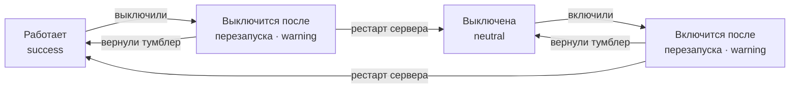

# Подсистемы в админке — макет экрана

**Раздел:** меню аватара → «Подсистемы» (только админ) · волна 1 из 4
**Связано:** отключаемая подсистема «Заметки» (`Subsystems:Notes:Enabled`), вынос контроллера
в отдельный проект с `ApplicationPart`, nullable-зависимости на бэке, гейт входа и реестр
вкладов на фронте.

Макет живёт одним файлом: HTML-версии нет намеренно — экран целиком собирается из уже
существующих примитивов (`Modal`, `Toggle`, `Badge`, `Dot`, `Button`, `EmptyState`), поэтому
ценность здесь в габаритах, состояниях и финальных текстах, а не в ещё одной вёрстке.

## Зачем экран

Подсистемы регистрируются в DI при старте процесса (`IAppSubsystem.Register` → `AddSubsystems`).
Значит выключение подсистемы — это НЕ мгновенное скрытие раздела, а изменение состава контейнера
на следующем запуске. Экран обязан показывать не «включено/выключено», а ДВА факта сразу:
что записано в настройках и что реально работает в текущем процессе. Всё остальное на этом
экране — производное от этого расхождения.

## Точка входа и контейнер

| Что | Решение |
|---|---|
| Вход | Пункт «Подсистемы» в `AvatarMenu`, рядом с «Пользователи»; рисуется только при `isAdmin` |
| Контейнер | `Modal` — как «Экспериментальные функции» (`FeatureFlagsModal`): тот же тип содержимого (список строк с тумблером), незачем разводить два габарита |
| Ширина | `MODAL_W.form` (440) |
| Заголовок | `Подсистемы` |
| Подзаголовок | `Разделы продукта, которые можно отключить. Настройка общая для всего инстанса и применяется при старте сервера.` |
| Мобила | `Modal` сам уходит в bottom-sheet (`R.sheet`, `maxHeight: 92vh`) — своей вёрстки не пишем |

Настройка — инстансная, не per-user: это отличает экран от «Экспериментальных функций», и
подзаголовок обязан это сказать первым же предложением, иначе админ решит, что выключает
раздел «у себя».

## Что экран требует от данных

Контракт эндпоинта — не мой файл (его делает соседний исполнитель волны). Макету от каждой
записи нужны шесть полей:

| Поле | Зачем в UI |
|---|---|
| `key` | якорь строки, моноширинный ключ в подписи (`notes`) |
| `title` | имя строки («Заметки») |
| `description` | вторая строка, одно предложение |
| `enabledConfigured` | положение тумблера |
| `enabledRuntime` | что реально поднято в этом процессе |
| `canToggle` | есть ли у подсистемы рубильник вообще |

`enabledConfigured ≠ enabledRuntime` — единственный источник всей «перезапускной» индикации.
Вычислять её из локального «пользователь только что кликнул» нельзя: расхождение переживает
перезагрузку вкладки и должно быть видно тому, кто зашёл на экран через час.

## Анатомия строки

```
┌────────────────────────────────────────────────────────────┐
│ Заметки  notes                                    (о──)    │   ← title + ключ + Toggle
│ Личный vault, заметки проектов, связи [[…]] и граф.        │   ← description
│ ● Работает                                                 │   ← статус
└────────────────────────────────────────────────────────────┘
```

| Элемент | Токены | Значения |
|---|---|---|
| Строка | вертикальный `padding: SP.md` (12), разделитель `1px solid ${C.borderLight}` сверху (кроме первой) | как в `FeatureFlagsModal` |
| Раскладка | `display:flex; alignItems:flex-start; gap: SP.md` (12) | текстовый блок `flex:1; minWidth:0` |
| Имя | `FS.md` (14), `fontWeight: 600`, `C.textHeading` | — |
| Ключ | `FONT.mono`, `FS.xs` (11), `C.textMuted` | рядом с именем, `gap: SP.sm` |
| Описание | `FS.sm` (12), `lineHeight: 1.45`, `C.textSecondary` | одно предложение, без «и т.д.» |
| Статус | `Badge size="xs" dot` | тон — см. таблицу состояний |
| Тумблер | `Toggle` 42×25, `focusable`, `ariaLabel` = «Подсистема Заметки» | `flexShrink:0`, `paddingTop: SP.xxs` |
| Строка без рубильника | тумблера нет вовсе, вместо него `Badge tone="neutral"` «Встроенная» | — |

Тумблер `disabled`, пока летит `PUT` по этому ключу — ровно как в `FeatureFlagsModal` (набор
`busy`). Оптимистичного применения нет: перерисовываем строку по ответу сервера, потому что
цена ошибки тут выше — расхождение с рантаймом нельзя показать наугад.

## Состояния строки

| Состояние | `configured` / `runtime` | Плашка | Тон |
|---|---|---|---|
| Работает | `on` / `on` | `Работает` | `success` |
| Выключена | `off` / `off` | `Выключена` | `neutral` |
| Ждёт включения | `on` / `off` | `Включится после перезапуска` | `warning` |
| Ждёт выключения | `off` / `on` | `Выключится после перезапуска` | `warning` |
| Без рубильника | `canToggle: false` | `Встроенная` | `neutral` |

`Встроенная` несёт `title` (нативная подсказка): `Часть ядра — отключить нельзя.` Тумблера
у такой строки нет физически: тумблер, который ничего не делает, — обычная ложь интерфейса, и
`disabled`-тумблер её не лечит, а маскирует.



Возврат тумблера в исходное положение гасит warning мгновенно и без всякого перезапуска —
расхождения больше нет. Это важное свойство: передумать бесплатно.

## Баннер «нужен перезапуск»

Появляется под подзаголовком, как только есть хотя бы одно расхождение; исчезает, когда
расхождений не осталось.

| Элемент | Токены |
|---|---|
| Плашка | `background: C.warningBg`, `border: 1px solid ${C.warning}` (альфа не нужна — цвет уже мягкий), `borderRadius: R.xl` (12), `padding: SP.md` |
| Иконка | `RotateCcw` 16, `C.warningText`, `flexShrink:0` |
| Заголовок | `FS.base` (13), `fontWeight: 600`, `C.warningText` |
| Текст | `FS.sm` (12), `lineHeight: 1.45`, `C.textPrimary` |
| Сноска | `FS.xs` (11), `C.textPrimary`, `opacity: .75` |

Тело баннера — `C.textPrimary`, а не `C.warningText`, как в warning-плашках чата
(`ChatItemView`). Это осознанное отступление от прецедента, а не забывчивость: замеренный
контраст `warningText` на `warningBg` в светлой теме — **4.44:1**, то есть на волос ниже
порога AA (4.5) для мелкого текста, а тело здесь и есть мелкий текст на 12px. `textPrimary`
на том же фоне даёт 11.0:1 в светлой и 11.8:1 в тёмной. Цвет тона остаётся на заголовке,
иконке и рамке — узнаваемость плашки от этого не страдает.

**Финальные тексты.**

Заголовок:

```
Перезапустите сервер, чтобы изменения вступили в силу
```

Тело — одно расхождение:

```
Настройка сохранена. Подсистемы поднимаются при старте, поэтому сейчас всё работает
по-прежнему: «Заметки» включены.
```

Тело — несколько расхождений (перечисление через запятую, порядок как в списке):

```
Настройки сохранены. Подсистемы поднимаются при старте, поэтому сейчас всё работает
по-прежнему: «Заметки» включены, «Видео» выключено.
```

Сноска:

```
Кнопки перезапуска здесь нет: рестарт обрывает идущие ходы и чужие сессии — выберите
момент сами.
```

Кнопки «Перезапустить» в макете нет намеренно. Технически сервер перезапускается (трей,
служба, `deploy`), но кнопка рядом с тумблером превращает безобидную настройку в разрыв всех
живых ходов одним кликом — и делает это в окне, куда заходят «просто посмотреть». Сноска
объясняет отсутствие кнопки, а не оставляет пользователя гадать.

## Подтверждение выключения

Включение — молча. Выключение — `ConfirmDialog` (`confirmVariant="danger"`), один экран:

```
Заголовок:  Выключить «Заметки»?
Текст:      После перезапуска раздел, его панели и инструменты персон исчезнут из
            интерфейса. Файлы заметок останутся на диске: включите подсистему обратно —
            всё вернётся на место.
Кнопки:     [Выключить] (danger) · [Отмена] (ghost)
```

Страх при выключении раздела с данными — обоснованный, и снимает его ровно одно предложение
про файлы на диске. Без него админ не выключит подсистему никогда, и вся работа волны
окажется бесполезной.

## Обе темы

Своих цветов экран не заводит: всё берётся из пар токенов, у которых значения уже есть в
`theme.css` для обеих тем.

| Токен | Светлая | Тёмная |
|---|---|---|
| `C.bgCard` (фон модалки) | `#FBF8F2` | `#2E2A25` |
| `C.borderLight` (разделители строк) | `#E8E1D4` | `#34302A` |
| `C.textHeading` | `#2A251F` | `#F2ECE1` |
| `C.textSecondary` (описание) | `#756B5E` | `#B3A897` |
| `C.textMuted` (ключ, «Выключена») | `#9A8F7E` | `#8A8072` |
| `C.successBg` / `C.successText` | `#E9F1E8` / `#3F7A4F` | `#232E20` / `#8FCB79` |
| `C.warningBg` / `C.warningText` / `C.warning` | `#FBEFE0` / `#8A6A28` / `#C9923E` | `#322717` / `#E7B96E` / `#E0AC5A` |
| `C.bgInset` (фон плашки «Встроенная») | `#E7E0D2` | `#1B1815` |
| `C.accent` (включённый тумблер) | `#D97757` | `#E38A6A` |
| `C.track` (выключенный тумблер) | `#D8CFBE` | `#453F37` |

Замеренный контраст пар (WCAG 2.1, значения выше):

| Пара | Светлая | Тёмная |
|---|---|---|
| `successText` на `successBg` (плашка «Работает») | 4.43:1 | 7.41:1 |
| `warningText` на `warningBg` (заголовок баннера, плашки «…после перезапуска») | 4.44:1 | 8.04:1 |
| `textPrimary` на `warningBg` (тело баннера) | 11.01:1 | 11.78:1 |
| `textSecondary` на `bgCard` (описание подсистемы) | 4.93:1 | 6.08:1 |
| `textMuted` на `bgCard` (ключ, «Выключена») | 3.00:1 | 3.67:1 |

Две пары тона в светлой теме (4.43 и 4.44) не дотягивают до AA 4.5 буквально на сотые.
Это свойство существующих токенов `success`/`warning`, на которых стоит весь `Badge`
продукта, — чинить их в рамках этого экрана нельзя (правка увела бы цвет во всех плашках
сразу). Что делает макет вместо этого: не оставляет ни одного смысла, который читается
только цветом, и уводит длинный текст баннера на `textPrimary`. `textMuted` (3.0:1) несёт
только дублирующую информацию — ключ подсистемы и слово «Выключена» рядом с положением
тумблера.

Отдельной тёмной вёрстки нет — только эти пары токенов.

Единственное место, где тёмная тема требует внимания: тумблер `off` (`C.track` `#453F37`) на
`C.bgCard` `#2E2A25` различается слабее, чем в светлой. Поэтому статус подсистемы читается
плашкой словами, а не «понятно по тумблеру» — состояние никогда не кодируется одним цветом.

## Мобильная раскладка

| Что | Решение |
|---|---|
| Контейнер | bottom-sheet `Modal` (`R.sheet` 22, `maxHeight: 92vh`), drag-handle сверху |
| Строка | тот же flex; тумблер остаётся справа — на 360 CSS имя + ключ + `Toggle` (42) помещаются |
| Описание | переносится на 2–3 строки, обрезки нет: усечённое описание подсистемы бесполезно |
| Плашка статуса | отдельной строкой под описанием (`marginTop: SP.sm`), не в ряд с именем |
| Tap-цель тумблера | 42×25 визуально, зона нажатия дотянута до 40 по высоте (`padding: 8px 0`, `margin: -8px 0`) |
| Баннер | во всю ширину, иконка + текст в столбик при ширине < 380 |
| Нижний ориентир | 360 CSS-пикселей (`docs/design/target-devices.md`) |

## Места, откуда исчезают заметки

Правило одно, и оно важнее списка: **точку входа убираем молча, объясняем только там, куда
пользователь пришёл целенаправленно или где отсутствие выглядит как потеря данных.** Пустой
экран «здесь ничего нет» на месте каждой убранной кнопки превращает выключение раздела в
десяток надгробий.

| Место | Что происходит | Текст |
|---|---|---|
| Вкладка «Заметки» в хабе (`HubTabs`/`HubHeader`) | вкладки нет | — |
| Виджет «Заметки» на главной | виджета нет, сетка смыкается | — |
| Панель «Заметки» проекта в рельсе | панели нет; сохранённый в раскладке ключ игнорируется | — |
| «Сохранить в заметки» (меню чата, карточка чата) | пункта нет | — |
| «Сохранить в заметку» у сообщения | кнопки нет | — |
| «Превратить в заметку» у записи памяти | кнопки нет | — |
| Единый поиск | группы «Заметки» нет; плейсхолдер `Заметки и задачи…` → `Задачи…` | — |
| Инструменты персоны (`notes_*`) | набор «Заметки» в пикере скрыт | — |
| **Прямой заход в раздел** (закладка, диплинк) | `EmptyState` вместо раздела | см. ниже |
| **Привязка персоны к заметкам** | строка привязки в неактивном виде | см. ниже |
| **Комментарии к документу** (`DocComments`) | панель показывает объяснение вместо списка | см. ниже |

### Тексты объясняющих состояний

**1. Прямой заход в раздел «Заметки»** — `EmptyState` (не compact), иконка `Share2` 24:

```
Заголовок:  Заметки выключены
Подпись:    Подсистема отключена в настройках инстанса. Файлы на диске целы — раздел
            вернётся, как только её включат.
Действие:   [Открыть подсистемы]  ← только админу (ghost, size sm); остальным кнопки нет
```

Кнопка ведёт в ту же модалку, что и пункт меню. Не-админу кнопку не показываем: она вела бы
в окно, которое ему всё равно не откроется.

**2. Привязка персоны с источником «Заметки»** — строка привязки остаётся видимой (её завёл
человек, тихо стирать нельзя), рисуется с `opacity: .55` и подписью `FS.xs`, `C.warningText`:

```
Подсистема «Заметки» выключена — привязка не действует
```

**3. Комментарии к документу** — `EmptyState compact`, иконка `MessageSquare` 20:

```
Заголовок:  Комментарии недоступны
Подпись:    Они хранятся как заметки, а подсистема «Заметки» выключена. Уже оставленные
            комментарии на месте и вернутся вместе с ней.
```

Во всех трёх случаях формулировка держит одну и ту же мысль — **данные не потеряны, выключен
показ**. Это и есть содержательная разница между «выключено» и «удалено», и в текстах она
проговаривается явно, а не подразумевается.

## Доступность

- Тумблер — `role="switch"` + `aria-checked` (уже в `Toggle`), `focusable` включаем: экран
  целиком клавиатурный, `ariaLabel` = `Подсистема Заметки`.
- Плашка статуса связывается со строкой через `aria-describedby`: скринридер читает
  «Подсистема Заметки, переключатель, включено, Включится после перезапуска».
- Баннер перезапуска — `role="status"` (вежливое объявление): он появляется как следствие
  действия пользователя, перебивать `alert`-ом нечего.
- Состояние нигде не кодируется только цветом — везде есть слово.

## Итерации правок

1. **(текущая)** Первый проход: контейнер и точка входа, анатомия строки, пять состояний,
   баннер перезапуска с финальными текстами, подтверждение выключения, таблица токенов обеих
   тем, мобильная раскладка, карта мест исчезновения заметок с текстами трёх объясняющих
   состояний.
