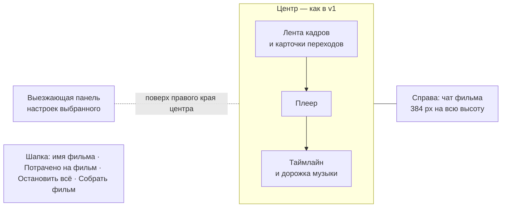

# Редактор видео v2: чат-агент делает фильм, человек правит

Макет: [video-editor-v2.html](video-editor-v2.html). Открывается без сети. В шапке макета переключаются
тема (светлая / тёмная), ширина (десктоп / телефон 390), «Сразу к» (1–12) и «Исход генерации» (успех,
сервис не ответил, не хватает денег, отказ по правилам). Это только макет, код продукта не менялся. Всё
по-прежнему за флагом `video-editor`. Прошлая версия — [video-editor-v1.html](video-editor-v1.html) и
[video-editor-proposal.md](video-editor-proposal.md); схема чата взята из редактора картинок v2
(`image-editor-v2-proposal.md`, разделы «Чат картинки» и «Промпт из чата — два режима»).

## Что поменялось относительно v1

| Было в v1 | Стало в v2 |
|---|---|
| Справа — инспектор: настройки перехода, кадра, музыки или сводка фильма | Справа на всю высоту — чат фильма (лента и настоящий композер). Настройки уехали в выезжающую панель |
| «Обсудить с Claude» — разовый ответ в панели и отдельный экран чата с «Подставить в редактор» | Кнопки и отдельного экрана нет. Агент в чате сам меняет фильм: рисует кадры, снимает переходы, собирает |
| Кадры — только картинки проекта | Агент рисует новые кадры и перерисовывает существующие моделями редактора картинок (`images/<фильм>/`) |
| Генерацию запускает человек, цена — перед кнопкой | Агент запускает генерации сам, без вопроса. Траты на виду: счётчик «Потрачено на фильм» в шапке, цена в каждой карточке, оценка у плана, «Остановить всё» |
| Прогресс — у одной карточки перехода | Живая карточка плана в чате: шаги с галочками, текущий шаг с процентом, потрачено из оценки. На ленте кадров видно, что в работе и что в очереди |
| Пустой фильм: «Выбрать картинки из проекта» | Пустой фильм: «Опишите ролик — Claude нарисует кадры и соберёт видео» с полем ввода; ручной путь «Добавить кадры из проекта» рядом |
| Ручные действия нигде не отражались | Каждое ручное действие падает в чат тихой строкой, метка «✦ Claude» с изменённого места снимается |
| Телефон: инспектор — шторка | Телефон: вкладки «Инструменты» и «Чат» (шторки на 86 %), полоса плана над вкладками |
| Цены в кредитах Higgsfield по умолчанию | «Как в настройках» сейчас fal, поэтому счётчик в долларах. Higgsfield остаётся в выборе поставщика |

Остальное из v1 на месте: четыре способа перехода (сгенерировать, склейка, готовое видео, продлить),
плеер и таймлайн с подрезкой ручками, музыка, сборка mp4 с диалогом, вход из дерева файлов, `.film`
в проекте, отмена генерации без списания, ошибки с «Повторить».

## Раскладка (десктоп)

- **Шапка.** Назад, имя фильма и путь `.film`, счётчик «Потрачено на фильм: $4.16 ▾», пока что-то идёт —
  «Остановить всё», «Собрать фильм» (во время сборки агентом — «Собираем… 40 %»).
- **Центр** — без изменений: лента кадров сверху, плеер, таймлайн. В заголовке таймлайна добавилась
  кнопка «Сводка» — список переходов и музыки (раньше это был пустой инспектор).
- **Справа** — чат фильма, 384 px, как колонка чата в редакторе картинок v2.

### Куда ушли настройки перехода — выезжающая панель

Выбрана **выезжающая панель** (360 px) поверх правого края центра, у границы с чатом. Открывается
кликом по карточке перехода, кадру, дорожке музыки, стыку на таймлайне или «Показать варианты» в
карточке чата; закрывается крестиком. В заголовке — что выбрано («Переход 3 → 4») и метка
«✦ настроил Claude», если это делал агент.

Почему не два других варианта:

- **Левая панель, как «Инструменты» в картинках.** В картинках слева живут инструменты, которые нужны
  всё время (пометки, образцы). Здесь настройки нужны только к выбранному переходу, а лента кадров —
  горизонтальная, ей важна ширина. Постоянная колонка 272 px плюс чат 384 px оставили бы ленте на
  ноутбуке 1360 около 650 px — это три кадра. С панелью по требованию лента широкая, пока всё делает
  агент, а это основной режим v2.
- **Поповер у карточки.** Форма генерации длинная (описание, камера, длительность, звук, поставщик,
  модель, варианты, цена), а варианты клипа — сетка живых миниатюр 2×2. В поповер это не влезает, и он
  закрывался бы при каждом клике мимо — например, по плееру, чтобы посмотреть результат.
- Панель **не закрывает чат**: агент меняет переход — изменения видны в открытой панели сразу, а ответ
  агента — рядом.

На телефоне та же панель — шторка «Инструменты».

## Чат фильма

Переносим один в один из редактора картинок v2:

- это **обычный чат проекта**, привязанный к файлу `.film`; создаётся **после первого сообщения**, в
  списке чатов называется «новый-фильм.film · монтаж»; при повторном открытии фильма открывается тот же
  чат;
- **шапки нет**: собеседник выбирается в композере (Claude, Кира, Софья), текущий файл назван в первой
  строке ленты: «Чат привязан к images/утро-в-горах.film. Claude видит кадры, переходы, таймлайн и
  музыку — сам рисует кадры, снимает переходы и собирает фильм. Генерации запускает без вопроса: траты —
  в шапке, цена — в каждой карточке»;
- после первого сообщения под этой строкой — «Новый чат» и «↗ Открыть в полном чате»;
- композер настоящий: «+» (файл с компьютера, из файлов проекта), режим, персона, микрофон, отправка;
  Enter отправляет, Shift+Enter переносит строку;
- **фильм прикладывается сам** чипом «утро-в-горах.film · 2 ручные правки» (или «· без изменений»):
  агент видит структуру фильма, а ручные правки с прошлого сообщения уходят ему списком. Крестиком чип
  снимается, в меню «+» возвращается;
- **ручные действия — тихие строки**: «Вы поменяли склейку 2 → 3 на затемнение», «Вы подрезали клип
  1 → 2: осталось 3,5 с из 5 с», «Вы взяли вариант 3 для перехода 3 → 4», «Вы запустили: переход
  1 → 2 · Veo 3.1 · ≈ $2.00 · 2 варианта», «Вы отменили съёмку: переход 1 → 2 — деньги не списаны».
  Повторные правки одного места схлопываются в одну строку;
- **метка «✦ Claude»** — на кадрах, которые агент нарисовал, на переходах, которые он настроил, на
  дорожке музыки. Любая ручная правка этого места метку снимает (в том числе смена камеры или модели
  до запуска).

## Что агент умеет сам

- Раскладывать, переставлять, вставлять, удалять и заменять опорные кадры.
- **Рисовать новые кадры и перерисовывать существующие** моделью редактора картинок (в макете —
  Nano Banana Pro, $0.04 за кадр). Кадры ложатся в `images/<фильм>/`. После перерисовки соседние
  снятые переходы агент переснимает сам — они снимались под старый кадр.
- Выбирать способ каждого перехода; писать промпт движения и камеры, задавать длительность и модель;
  снимать переходы и брать лучший вариант (с объяснением в плане: «взял вариант 2 из 2 — камера
  опускается ровнее») или показывать варианты человеку, когда вопрос во вкусе.
- Подрезать клипы, ставить склейки, подбирать и настраивать музыку.
- Нажимать «Собрать фильм».

### Деньги

Агент запускает генерации **без подтверждения** (как в картинках). Раз вопроса нет, траты на виду всегда:

- **Счётчик в шапке** «Потрачено на фильм: $4.16 ▾». Пока что-то идёт — точка пульсирует, рядом
  «Остановить всё». Клик раскрывает расходы по пунктам: что, кто (Claude или вы), сколько; отменённое и
  несостоявшееся — зачёркнуто, «не списано»; остаток оценки идущего плана.
- **Цена в каждой карточке**: у плана — оценка всего и цена каждого шага, у пересъёмки — «≈ $3.20 ·
  2 варианта по 8 с».
- **Оценка плана** в той же карточке: «Оценка всего плана: ≈ $4.16 · 4 кадра по $0.04 и 2 перехода по
  ≈ $2.00; склейка, музыка и сборка бесплатно».
- **«Остановить всё»** — одна кнопка, одно действие: гасит план, все генерации, рисование и сборку.
  Кнопка стоит в двух местах (карточка плана и шапка), потому что карточка уезжает вверх по ленте.
- Деньги списываются, когда генерация готова. Отменённое, остановленное и не получившееся не
  списывается.

## Сценарии

1. **Ролик с нуля.** Пустой фильм → «Сделай ролик из 4 сцен про утро в горах» (в поле пустого фильма
   или в чате) → агент отвечает замыслом и карточкой плана из 9 шагов с оценкой ≈ $4.16 → кадры
   появляются на ленте по одному (скелетон «Рисуем кадр 2…» с процентом) → между туманом и хижиной
   агент ставит наплыв (бесплатно, генерация не нужна), два других перехода снимает по 2 варианта и
   берёт лучший → музыка `music/утро.mp3`, 60 %, затухание 4 с → сборка → карточка «Фильм собран ·
   images/утро-в-горах.mp4» с «Открыть» и «Показать в файлах». Пока план идёт, на ленте переходы в
   очереди помечены «В плане Claude · снять · Veo 3.1 · очередь».
2. **Правка словами или голосом.** «Третий переход слишком резкий, сделай плавнее» (микрофон даёт эту
   же фразу) → агент: «облёт за 5 секунд и правда дёргает» → карточка «Снимаем заново · переход 3 → 4 ·
   ≈ $3.20 · 2 варианта по 8 с» со строкой «Изменил: промпт…, длительность 5 → 8 с, камера «Облёт» →
   «Наезд»» и «Отменить» → «Готово» с двумя живыми миниатюрами → «Показать варианты» открывает панель
   с сеткой → «Взять вариант 3». Старый клип остаётся в фильме, пока не возьмёте новый. Если это
   склейка — агент меняет её на наплыв 2 с бесплатно.
3. **Ручная правка.** Карточка склейки 2 → 3 → «Затемнение», ручки подрезки на таймлайне, перестановка
   кадра — в чате тихие строки, метка «✦ Claude» с этих мест снимается, чип фильма в композере
   считает правки.
4. **«Остановить всё» посреди плана.** Готовое остаётся (4 кадра, переход 1 → 2, склейка), идущая
   съёмка перехода 3 → 4 отменяется, не начатые шаги зачёркнуты «не начато · не списано». Итог
   карточки: «Потрачено $2.16 из ≈ $4.16 · не списано ≈ $2.00». Агент коротко подводит итог;
   «Продолжить план» (или «продолжай» в чате) — с того же шага.
5. **Ошибка одного перехода в плане.** Переход 3 → 4 не снялся → шаг в плане «не снялся · не
   списано», карточка на ленте «Не получилось», план «ждёт вашего решения». Агент: «Переход 3 → 4 не
   снялся: сервис видео не ответил… Деньги за него не списаны. Уже готово: … Как поступим?» и три
   выхода: «Повторить · ≈ $2.00» (при нехватке денег — «Снять 1 вариант · ≈ $1.00», при отказе по
   правилам — «Переписать описание и снять»), «Склеить наплывом · бесплатно», «Собрать без него —
   встык». Можно ответить и словами.

Ещё прокликивается: «Перерисуй кадр 2: туман гуще» (из меню кадра «Перерисовать с Claude…» или
словами) — кадр перерисовывается на месте, соседний переход переснимается; «Сними переходы, подбери
музыку и собери фильм» на фильме из картинок проекта — агент доделывает только то, что не сделано
руками.

## Экраны макета («Сразу к»)

| № | Экран | Что на нём |
|---|---|---|
| 1 | Файлы | Как в v1; после плана — папка `утро-в-горах` с кадрами, которые нарисовал Claude |
| 2 | Пустой фильм | Поле «Опишите ролик…», пример, «или вручную»: «Добавить кадры из проекта», «Загрузить с компьютера». Справа пустой чат с подсказками |
| 3 | План идёт | Сценарий 1 вживую с начала |
| 4 | Фильм собран | Итог сценария 1: план выполнен, карточка «Фильм собран», $4.16 |
| 5 | Правка словами | Сценарий 2 вживую, сообщение «голосом» |
| 6 | Ручная правка | Сценарий 3: тихие строки, открыта панель склейки 2 → 3 |
| 7 | Остановить всё | Сценарий 4: остановка во время съёмки перехода 3 → 4 |
| 8 | Ошибка в плане | Сценарий 5 (если выбран «Успех», макет подставит «Сервис не ответил») |
| 9 | Переход руками | Кадры из проекта, открыта форма генерации перехода 1 → 2 — ручной путь v1 |
| 10 | Кадры из проекта | Фильм без агента; в чате подсказка «Сними переходы, подбери музыку и собери фильм» |
| 11 | Музыка | Панель музыки с меткой «✦ настроил Claude» |
| 12 | Готовый файл | Просмотр `images/утро-в-горах.mp4` |

## Телефон (390)

- Шапка: назад, имя, счётчик «$4.16 ▾», квадрат «Остановить всё» (когда что-то идёт), «Собрать».
- Лента кадров, плеер, таймлайн — как в v1.
- Над вкладками — **полоса плана**, пока он идёт или ждёт решения: «План Claude · шаг 3 из 9 · $0.08 из
  ≈ $4.16» и «Остановить»; тап открывает чат.
- Вкладки **«Инструменты»** и **«Чат»** (точка на «Чате», если там новое) — шторки на 86 % высоты.
  Тап по карточке перехода или кадру открывает «Инструменты» с его настройками.

## Тексты

| Место | Текст |
|---|---|
| Пустой фильм | Опишите ролик — Claude нарисует кадры и соберёт видео |
| Плейсхолдер поля пустого фильма | Например: ролик из 4 сцен про утро в горах, спокойный, под тихую музыку |
| Подсказка под полем | Уйдёт в чат справа. Генерации Claude запускает сам — траты видны в шапке |
| Ручной путь | или вручную · Добавить кадры из проекта · Загрузить с компьютера |
| Первая строка чата | Чат привязан к images/утро-в-горах.film. Claude видит кадры, переходы, таймлайн и музыку — сам рисует кадры, снимает переходы и собирает фильм. Генерации запускает без вопроса: траты — в шапке, цена — в каждой карточке. |
| Счётчик | Потрачено на фильм: $4.16 |
| Расходы | Расходы фильма · Всего · Деньги списываются, когда генерация готова. Отменённое и не начатое не списывается. |
| Карточка плана | План: утро в горах · шаг 3 из 9 · Оценка всего плана: ≈ $4.16 · … · Потрачено: $0.08 из ≈ $4.16 · Остановить всё |
| Шаг плана | Переход 1 → 2 · Veo 3.1 · 2 варианта по 5 с · ≈ $2.00 → взял вариант 2 из 2 — камера опускается ровнее · $2.00 |
| Очередь на ленте | В плане Claude · снять · Veo 3.1 · очередь |
| Остановлено | План: … · остановлен · не начато · не списано · Потрачено $2.16 из ≈ $4.16 · не списано ≈ $2.00 · Продолжить план |
| Ошибка в плане | Переход 3 → 4 не снялся · не списано · Повторить · ≈ $2.00 · Склеить наплывом · бесплатно · Собрать без него — встык |
| Пересъёмка | Снимаем заново · переход 3 → 4 · ≈ $3.20 · 2 варианта по 8 с · Изменил: … · Отменить |
| Готово | Готово · Старый клип остаётся в фильме, пока вы не возьмёте новый. · Показать варианты |
| Фильм собран | Фильм собран · images/утро-в-горах.mp4 · Рядом лежит проект фильма … · Открыть · Показать в файлах |
| Метки | ✦ Claude (на карточке) · ✦ нарисовал Claude / ✦ настроил Claude (в панели) · ✦ настроила Кира |
| Тихие строки | Вы поменяли склейку 2 → 3 на затемнение · Вы подрезали клип 1 → 2: осталось 3,5 с из 5 с · Вы запустили: … · Вы остановили всё: … |
| Чип фильма | утро-в-горах.film · 2 ручные правки / · без изменений |
| Кадр, меню | Перерисовать с Claude… |
| Форма генерации | Или просто скажите в чате, что нужно · Спросить в чате |

## Что в макете кликабельно, а что статикой

Кликабельно: всё из v1 (кадры, четыре способа перехода, генерация с вариантами и ошибками, склейка,
видео, продлить, музыка, подрезка, плеер, сборка, просмотр mp4, дерево файлов); поле пустого фильма и
подсказки; чат — отправка, Enter, микрофон (запись → расшифровка), вложения, персона, «Новый чат»;
план агента целиком с живыми процентами, кадрами на ленте и очередью; «Остановить всё» и «Продолжить
план»; три выхода после ошибки; пересъёмка по словам с карточкой, отменой и вариантами; перерисовка
кадра; доделка фильма из картинок проекта; тихие строки и снятие меток; счётчик и расходы; обе темы;
телефонные шторки и полоса плана.

Статикой или условно: ответы агента заготовлены, просьба распознаётся по ключевым словам; распознавание
голоса даёт одну из трёх фраз по состоянию фильма; перерисованная картинка есть только у кадра «туман в
долине»; «Открыть в полном чате» — тост; режим работы в композере — кнопка без меню; цены и модели
условные; повтор после ошибки в плане всегда удаётся.

## Открытые вопросы

1. **Потолок трат без подтверждения.** Агент запускает всё сам, а план из 9 шагов стоит $4, из 20 — уже
   $20. Нужен ли потолок на план или на фильм («дальше $10 — спросить»), и кто его задаёт: пользователь
   в настройках или администратор? В макете потолка нет, есть только видимость и «Остановить всё».
2. **Счётчик в кредитах.** Если поставщик — Higgsfield, траты в кредитах, у fal — в долларах. Показывать
   две суммы («$4.16 + 18 кредитов», как в макете) или переводить в одну единицу AI Home?
3. **Выбор лучшего варианта агентом.** В плане агент берёт вариант сам и объясняет выбор; при правке по
   просьбе — показывает варианты человеку. Годится такое правило или всегда показывать варианты
   (тогда план будет останавливаться на каждом переходе)?
4. **Чат и ручные строки до первого сообщения.** Чат создаётся после первого сообщения, а ручные строки
   появляются раньше. В макете они видны в ленте черновика и уходят агенту вместе с первым сообщением.
   Так и оставить?
5. **Чип фильма в композере.** Прикладывать фильм к каждому сообщению (структура `.film` — это немного
   токенов) или, как снимок холста в картинках, только когда были ручные правки?
6. **Что видит агент в клипах.** Для «слишком резкий» агенту достаточно промпта и настроек, но честная
   оценка требует кадров из клипа. Отдавать агенту раскадровку клипа (3–5 кадров) — это токены на каждый
   переход.
7. **Где живут нарисованные кадры.** В макете — `images/<фильм>/`. Или рядом с `.film` в
   `<фильм>.film.assets/`, вместе со скачанными вариантами клипов (вопрос 2 из v1)?
8. **Фоновое выполнение плана.** План длится минуты. Если человек закрыл редактор — план идёт дальше на
   сервере (как сборка) и ждёт в чате, или останавливается? В макете об этом ничего не сказано.
9. **Несколько планов сразу.** В макете второй план не стартует, пока идёт первый («дождитесь или
   остановите»). Годится, или просьбы ставить в очередь?
10. **Ручная правка посреди плана.** Если человек поменял переход, который в плане ещё впереди, — агент
    пропускает этот шаг (уважает ручное) или делает по плану? В макете план шаг выполнит; «Сними
    переходы…» уже не трогает то, что сделано руками.
11. **Узкий экран.** Чат 384 px и выезжающая панель 360 px на ноутбуке 1360 закрывают больше половины
    центра. Сворачивать чат в полосу, пока открыта панель?
12. Вопросы v1 про формат `.film`, место mp4, фоновую генерацию и сборку на сервере остаются открытыми.
