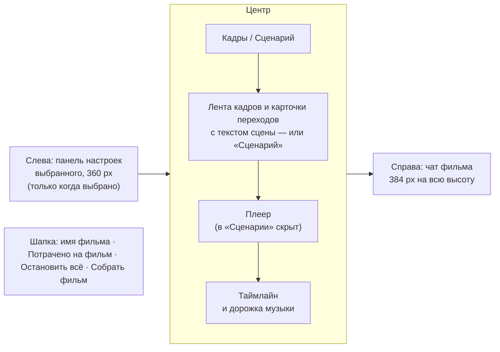

# Редактор видео v3: панель слева, текст сцены на виду

Макет: [video-editor-v3.html](video-editor-v3.html). Открывается без сети. В шапке макета переключаются
тема (светлая / тёмная), ширина (десктоп / телефон 390), «Сразу к» (1–15) и «Исход генерации» (успех,
сервис не ответил, не хватает денег, отказ по правилам). Это только макет, код продукта не менялся. Всё
по-прежнему за флагом `video-editor`. Прошлые версии: [video-editor-v2.html](video-editor-v2.html) с
[video-editor-v2-proposal.md](video-editor-v2-proposal.md) и [video-editor-v1.html](video-editor-v1.html)
с [video-editor-proposal.md](video-editor-proposal.md). Схема чата взята из редактора картинок v2
(`image-editor-v2-proposal.md`, разделы «Чат картинки» и «Промпт из чата — два режима»).

v3 — доработка v2 по двум замечаниям Андрея. Всё, что ниже не упомянуто как изменённое, осталось как в v2.

## Что поменялось относительно v2

| Было в v2 | Стало в v3 |
|---|---|
| Панель настроек выбранного выезжала поверх правого края центра, рядом с чатом: справа два блока | Панель выезжает **слева**, колонкой у левого края центра, и сдвигает центр, а не перекрывает его. Чат справа остаётся один на всю высоту |
| Выбранная карточка могла оказаться за краем суженной ленты | При выборе лента прокручивается к карточке. В «Сценарии» так же прокручивается к строке сцены |
| Что происходит в сцене, задавало поле «Описание» глубоко в форме генерации, и только у способа «Сгенерировать» | **Текст сцены** — отдельная часть перехода. 2–3 строки видны прямо на карточке между кадрами, без текста — плейсхолдер «Опишите, что происходит в сцене…» |
| Поменять описание — открыть панель, найти поле | Клик по тексту на карточке — правка на месте. В панели то же поле стоит первым, крупно, с авторазмером, при любом способе перехода и на любой фазе |
| Фильм виден только как лента кадров | Над лентой переключатель **«Кадры / Сценарий»**. В «Сценарии» фильм читается сплошным текстом по сценам (миниатюры A → B слева, текст справа) и правится как документ. Текст тот же, что на карточках |
| Агент менял промпт перехода и сразу переснимал | На **просьбу про текст** агент только переписывает его: правка подсвечена (вставки и удаления), у сцены метка «✦ переписал Claude», кнопки «Принять» и «Вернуть как было». Снимать сам не начинает |
| — | У снятой сцены с изменённым текстом появляется пометка «Текст изменён — переснять?» и кнопка «Переснять · ≈ $2.00». «Перепиши и сними» — агент снимает сразу, как в v2 |
| — | Выделил фрагмент текста сцены — появляется кнопка «Обсудить с Claude», фрагмент уходит в композер цитатой |
| План «ролик с нуля» начинался с рисования кадров (9 шагов) | Первый шаг — **«Написать сценарий»**: на ленте встают кадры-заготовки, между ними появляются тексты сцен. Потом по ним рисуются кадры и снимаются переходы (10 шагов). «Доделать фильм» дописывает тексты сценам, у которых их нет |
| Ручные правки текста не существовали | Правка текста, принятие и откат правки агента падают в чат тихой строкой, как остальные ручные действия |

## Что поменялось в v2 относительно v1

| Было в v1 | Стало в v2 |
|---|---|
| Справа — инспектор: настройки перехода, кадра, музыки или сводка фильма | Справа на всю высоту — чат фильма (лента и настоящий композер). Настройки уехали в выезжающую панель |
| «Обсудить с Claude» — разовый ответ в панели и отдельный экран чата с «Подставить в редактор» | Кнопки и отдельного экрана нет. Агент в чате сам меняет фильм: рисует кадры, снимает переходы, собирает |
| Кадры — только картинки проекта | Агент рисует новые кадры и перерисовывает существующие моделями редактора картинок (`images/<фильм>/`) |
| Генерацию запускает человек, цена — перед кнопкой | Агент запускает генерации сам, без вопроса. Траты на виду: счётчик «Потрачено на фильм» в шапке, цена в каждой карточке, оценка у плана, «Остановить всё» |
| Прогресс — у одной карточки перехода | Живая карточка плана в чате: шаги с галочками, текущий шаг с процентом, потрачено из оценки. На ленте кадров видно, что в работе и что в очереди |
| Пустой фильм: «Выбрать картинки из проекта» | Пустой фильм: «Опишите ролик — Claude нарисует кадры и соберёт видео» с полем ввода; ручной путь «Добавить кадры из проекта» рядом |
| Ручные действия нигде не отражались | Каждое ручное действие падает в чат тихой строкой, метка «✦ Claude» с изменённого места снимается |
| Телефон: инспектор — шторка | Телефон: вкладки «Инструменты» и «Чат» (шторки на 86 %), полоса плана над вкладками |
| Цены в кредитах Higgsfield по умолчанию | «Как в настройках» сейчас fal, поэтому счётчик в долларах. Higgsfield остаётся в выборе поставщика |

Остальное из v1 на месте: четыре способа перехода (сгенерировать, склейка, готовое видео, продлить),
плеер и таймлайн с подрезкой ручками, музыка, сборка mp4 с диалогом, вход из дерева файлов, `.film`
в проекте, отмена генерации без списания, ошибки с «Повторить».

## Раскладка (десктоп)

- **Шапка** — как в v2. Назад, имя фильма и путь `.film`, счётчик «Потрачено на фильм: $4.16 ▾», пока что-то идёт —
  «Остановить всё», «Собрать фильм» (во время сборки агентом — «Собираем… 40 %»).
- **Слева** — панель настроек выбранного, появляется только по клику (см. ниже).
- **Центр.** Сверху переключатель «Кадры / Сценарий» с подсказкой. В «Кадрах» — лента, плеер и таймлайн,
  как в v2, но у каждой карточки перехода внизу текст сцены. В «Сценарии» вместо ленты и плеера —
  документ по сценам, таймлайн остаётся. В заголовке таймлайна кнопка «Сводка» — список переходов и
  музыки.
- **Справа** — чат фильма, 384 px, как колонка чата в редакторе картинок v2.

### Куда ушли настройки перехода — панель слева

**Панель настроек (360 px) выезжает у левого края центра** и живёт колонкой: центр — лента, плеер,
таймлайн — сужается, а не уходит под панель. Открывается кликом по карточке перехода (по её верхней
части: клик по тексту сцены правит текст), кадру, дорожке музыки, стыку на таймлайне, «Настройки» у
сцены в «Сценарии» или «Показать варианты» в карточке чата. Закрывается крестиком. В заголовке — что
выбрано («Переход 3 → 4») и метка «✦ настроил Claude», если это делал агент.

Порядок в панели перехода: пара кадров A → B, **текст сцены** (крупно, с авторазмером, с «Спросить в
чате»), затем способ перехода и его настройки (камера, длительность, звук, поставщик, модель,
варианты, цена). Текст сцены стоит первым при любом способе и на любой фазе — и до съёмки, и когда
клип уже снят.

Почему слева и почему колонкой:

- **Справа уже чат.** В v2 панель вставала рядом с чатом: два блока настроек-и-разговора подряд, а
  центр зажат с одной стороны. Слева панель читается как «свойства того, что я выбрал в фильме», а
  чат остаётся отдельным собеседником справа.
- **Колонка, а не поверх.** Поверх центра панель закрыла бы левую треть ленты и половину плеера.
  Колонкой она сдвигает всё: выбранная карточка остаётся видна (лента сама прокручивается к ней),
  плеер виден целиком, таймлайн пересчитывает масштаб под новую ширину.
- **Ноутбук 1360.** Окно редактора около 1300 px: панель 360 + центр около 550 + чат 384. В центре
  при открытой панели — кадр и карточка перехода рядом, плеер около 500 × 285, таймлайн 13-секундного
  фильма помещается целиком. Лента рабочая: прокручивается, кадры перетаскиваются, текст сцены
  правится. Проверено в макете при ширине окна 1360.
- **Поповер у карточки** отпал ещё в v2: форма длинная, а сетка вариантов клипа 2×2 в поповер не
  влезает.
- Панель **не закрывает чат**: агент меняет переход или текст сцены — изменения видны в открытой
  панели сразу, а ответ агента рядом.

На телефоне — как в v2: та же панель в шторке «Инструменты».

## Текст сцены

**Текст сцены** — что происходит от первого кадра сцены до последнего: «Туман редеет, из него
проступает деревянная хижина. На подоконнике дымится чашка кофе». Сцена — это переход между двумя
соседними кадрами. У фильма из 4 кадров 3 сцены, «сцена 3» — это переход 3 → 4.

- **Одна сущность, три места.** Текст хранится у перехода в `.film`. Его видно на карточке (2–3
  строки), в панели (полностью, крупно) и в «Сценарии» (документом). Правка в одном месте сразу видна
  в остальных.
- **Это и есть промпт съёмки.** Для способа «Сгенерировать» модель снимает по тексту сцены, камера,
  длительность и модель — отдельно, в панели. Клип помнит текст, по которому снят. Когда текст
  разошёлся со снятым, у сцены появляется «Текст изменён — переснять?». У склейки и готового видео
  текст — описание для человека и агента, на съёмку не влияет.
- **Правка на месте.** Клик по тексту на карточке — поле ввода прямо в карточке. Клик мимо или
  Ctrl+Enter сохраняет, Esc возвращает как было. В чат падает тихая строка «Вы поправили текст
  сцены 1: «…» — клип снят по прежнему тексту», метка «✦ Claude» с перехода снимается.
- **«Сценарий».** Фильм сплошным текстом: у каждой сцены миниатюры кадров A → B, заголовок «Сцена 3 ·
  кадры 3 → 4 · Сгенерировать · 5 с», «Настройки» (открывают панель слева) и текст. Поля текста всегда
  открыты для правки, без клика «править», — как документ. Сверху — подсказки для агента: «Перепиши
  сцену 3 под закат», «Сделай сцены 2 и 3 драматичнее».
- **Без текста** на карточке — плейсхолдер «Опишите, что происходит в сцене…». Если сцену снимают без
  текста, модель снимает по описанию кадров, а агент подставляет свой текст — его видно после съёмки.

### Совместная правка с агентом

- **Агент переписывает одну сцену, несколько или все**: «перепиши сцену 3 под закат», «сделай сцены 2
  и 3 драматичнее», «перепиши сценарий под закат».
- **Правка видна в тексте**: вставки подсвечены зелёным, удалённое зачёркнуто. Рядом метка
  «✦ переписал Claude» и кнопки «Принять» и «Вернуть как было» — у каждой сцены отдельно: на карточке,
  в панели и в «Сценарии». На узкой карточке вторая кнопка называется «Вернуть», полное название — во
  всплывающей подсказке. В чате — карточка «Переписал текст · сцена 3 · бесплатно, ничего не снято» со
  статусом каждой сцены («ждёт решения», «принято · можно переснять», «вернули как было»), «Показать в
  сценарии» и «Принять всё» / «Вернуть как было» на все сцены сразу.
- **Текст — дешёвый черновик, агент не снимает сам.** После «Принять» у снятой сцены появляется
  «Текст изменён — переснять?» и «Переснять · ≈ $2.00» — цена по текущим настройкам сцены. Нажатие —
  обычный ручной запуск: тихая строка «Вы запустили по новому тексту: …», варианты, «Взять».
  Несъёмочные сцены (склейка) и ещё не снятые просто получают новый текст.
- **«Перепиши и сними»** — агент переписывает и сразу снимает, как пересъёмка в v2: без подсветки
  правки, с карточкой «Снимаем заново · сцена 3 · ≈ $2.00 · 2 варианта по 5 с · Изменил: текст сцены —
  «…»» и «Отменить».
- **Просьбы про движение** («третий переход слишком резкий, сделай плавнее») агент по-прежнему
  выполняет со съёмкой, как в v2. Меняет и текст сцены, и настройки, и это видно в строке «Изменил: …».
- **Ручная правка поверх неразобранной правки агента** считается решением человека: подсветка
  снимается, в чат уходит тихая строка о ручной правке.
- **Обсудить фрагмент.** Выделил кусок текста сцены (на карточке, в панели или в «Сценарии») — над
  выделением кнопка «Обсудить с Claude». Нажатие кладёт фрагмент в композер цитатой «Фрагмент сцены 2 ·
  «…»» (крестиком снимается), плейсхолдер меняется на «Что сделать с фрагментом? Например: сделай
  напряжённее». Цитата уходит вместе с сообщением. Просьба переписывает сцену с этим фрагментом, вопрос
  («что тут имеется в виду?») получает ответ без правки.

## Чат фильма

Переносим один в один из редактора картинок v2:

- это **обычный чат проекта**, привязанный к файлу `.film`; создаётся **после первого сообщения**, в
  списке чатов называется «новый-фильм.film · монтаж»; при повторном открытии фильма открывается тот же
  чат;
- **шапки нет**: собеседник выбирается в композере (Claude, Кира, Софья), текущий файл назван в первой
  строке ленты: «Чат привязан к images/утро-в-горах.film. Claude видит кадры, переходы, таймлайн и
  музыку — сам рисует кадры, снимает переходы и собирает фильм. Генерации запускает без вопроса: траты —
  в шапке, цена — в каждой карточке. Тексты сцен переписывает без съёмки»;
- после первого сообщения под этой строкой — «Новый чат» и «↗ Открыть в полном чате»;
- композер настоящий: «+» (файл с компьютера, из файлов проекта), режим, персона, микрофон, отправка;
  Enter отправляет, Shift+Enter переносит строку;
- **фильм прикладывается сам** чипом «утро-в-горах.film · 2 ручные правки» (или «· без изменений»):
  агент видит структуру фильма, а ручные правки с прошлого сообщения уходят ему списком. Крестиком чип
  снимается, в меню «+» возвращается;
- **ручные действия — тихие строки**: «Вы поменяли склейку 2 → 3 на затемнение», «Вы подрезали клип
  1 → 2: осталось 3,5 с из 5 с», «Вы взяли вариант 3 для перехода 3 → 4», «Вы запустили: переход
  1 → 2 · Veo 3.1 · ≈ $2.00 · 2 варианта», «Вы отменили съёмку: переход 1 → 2 — деньги не списаны»,
  «Вы поправили текст сцены 1: «…» — клип снят по прежнему тексту», «Вы приняли правку текста сцены 3»,
  «Вы вернули текст сцены 2 как было».
  Повторные правки одного места схлопываются в одну строку;
- **метка «✦ Claude»** — на кадрах, которые агент нарисовал, на переходах, которые он настроил, на
  дорожке музыки. Любая ручная правка этого места метку снимает (в том числе смена камеры или модели
  до запуска).

## Что агент умеет сам

- Писать сценарий — тексты сцен — до того, как рисовать кадры; переписывать тексты одной сцены,
  нескольких или всех. Правка текста ничего не снимает, пока не попросят «сними».
- Раскладывать, переставлять, вставлять, удалять и заменять опорные кадры.
- **Рисовать новые кадры и перерисовывать существующие** моделью редактора картинок (в макете —
  Nano Banana Pro, $0.04 за кадр). Кадры ложатся в `images/<фильм>/`. После перерисовки соседние
  снятые переходы агент переснимает сам — они снимались под старый кадр.
- Выбирать способ каждого перехода; писать текст сцены (он же промпт съёмки), выбирать камеру, задавать длительность и модель;
  снимать переходы и брать лучший вариант (с объяснением в плане: «взял вариант 2 из 2 — камера
  опускается ровнее») или показывать варианты человеку, когда вопрос во вкусе.
- Подрезать клипы, ставить склейки, подбирать и настраивать музыку.
- Нажимать «Собрать фильм».

### Деньги

Агент запускает генерации **без подтверждения** (как в картинках). Раз вопроса нет, траты на виду всегда:

- **Счётчик в шапке** «Потрачено на фильм: $4.16 ▾». Пока что-то идёт — точка пульсирует, рядом
  «Остановить всё». Клик раскрывает расходы по пунктам: что, кто (Claude или вы), сколько; отменённое и
  несостоявшееся — зачёркнуто, «не списано»; остаток оценки идущего плана.
- **Цена в каждой карточке**: у плана — оценка всего и цена каждого шага, у пересъёмки — «≈ $3.20 ·
  2 варианта по 8 с».
- **Оценка плана** в той же карточке: «Оценка всего плана: ≈ $4.16 · 4 кадра по $0.04 и 2 перехода по
  ≈ $2.00; склейка, музыка и сборка бесплатно».
- **«Остановить всё»** — одна кнопка, одно действие: гасит план, все генерации, рисование и сборку.
  Кнопка стоит в двух местах (карточка плана и шапка), потому что карточка уезжает вверх по ленте.
- Деньги списываются, когда генерация готова. Отменённое, остановленное и не получившееся не
  списывается.

## Сценарии

1. **Ролик с нуля.** Пустой фильм → «Сделай ролик из 4 сцен про утро в горах» (в поле пустого фильма
   или в чате) → агент отвечает замыслом и карточкой плана из 10 шагов с оценкой ≈ $4.16 → **первый шаг
   «Написать сценарий · 3 сцены»**: на ленте встают 4 кадра-заготовки («Кадр 2 · нарисует Claude»,
   под ними названия), между ними по одному появляются тексты сцен; их можно править, пока агент
   рисует, — съёмка возьмёт поправленный текст → кадры рисуются на месте заготовок (скелетон «Рисуем
   кадр 2…» с процентом) → между туманом и хижиной
   агент ставит наплыв (бесплатно, генерация не нужна), два других перехода снимает по 2 варианта и
   берёт лучший → музыка `music/утро.mp3`, 60 %, затухание 4 с → сборка → карточка «Фильм собран ·
   images/утро-в-горах.mp4» с «Открыть» и «Показать в файлах». Пока план идёт, на ленте переходы в
   очереди помечены «В плане Claude · снять · Veo 3.1 · очередь».
2. **Правка словами или голосом.** «Третий переход слишком резкий, сделай плавнее» (микрофон даёт эту
   же фразу) → агент: «облёт за 5 секунд и правда дёргает» → карточка «Снимаем заново · переход 3 → 4 ·
   ≈ $3.20 · 2 варианта по 8 с» со строкой «Изменил: текст сцены…, длительность 5 → 8 с, камера «Облёт» →
   «Наезд»» и «Отменить» → «Готово» с двумя живыми миниатюрами → «Показать варианты» открывает панель
   с сеткой → «Взять вариант 3». Старый клип остаётся в фильме, пока не возьмёте новый. Если это
   склейка — агент меняет её на наплыв 2 с бесплатно.
3. **Ручная правка.** Карточка склейки 2 → 3 → «Затемнение», ручки подрезки на таймлайне, перестановка
   кадра — в чате тихие строки, метка «✦ Claude» с этих мест снимается, чип фильма в композере
   считает правки.
4. **«Остановить всё» посреди плана.** Готовое остаётся (4 кадра, переход 1 → 2, склейка), идущая
   съёмка перехода 3 → 4 отменяется, не начатые шаги зачёркнуты «не начато · не списано». Итог
   карточки: «Потрачено $2.16 из ≈ $4.16 · не списано ≈ $2.00». Агент коротко подводит итог;
   «Продолжить план» (или «продолжай» в чате) — с того же шага.
5. **Ошибка одного перехода в плане.** Переход 3 → 4 не снялся → шаг в плане «не снялся · не
   списано», карточка на ленте «Не получилось», план «ждёт вашего решения». Агент: «Переход 3 → 4 не
   снялся: сервис видео не ответил… Деньги за него не списаны. Уже готово: … Как поступим?» и три
   выхода: «Повторить · ≈ $2.00» (при нехватке денег — «Снять 1 вариант · ≈ $1.00», при отказе по
   правилам — «Переписать описание и снять»), «Склеить наплывом · бесплатно», «Собрать без него —
   встык». Можно ответить и словами.

Ещё прокликивается: «Перерисуй кадр 2: туман гуще» (из меню кадра «Перерисовать с Claude…» или
словами) — кадр перерисовывается на месте, соседний переход переснимается; «Сними переходы, подбери
музыку и собери фильм» на фильме из картинок проекта — агент доделывает только то, что не сделано
руками, а сценам без текста первым шагом дописывает тексты.

Новое в v3:

6. **Панель слева.** Клик по верхней части карточки перехода (способ и модель) → панель выезжает у
   левого края центра, лента, плеер и таймлайн сдвигаются вправо, чат справа не меняется. Выбранная
   карточка прокручивается в видимую часть ленты; клик по дальней сцене прокручивает ленту к ней.
7. **Текст сцены на карточке.** Клик по тексту под переходом 1 → 2 → поле ввода в карточке →
   дописать → клик мимо или Ctrl+Enter → в чате тихая строка «Вы поправили текст сцены 1: «…» — клип
   снят по прежнему тексту» → на карточке «Текст изменён — переснять?» и «Переснять · ≈ $2.00» →
   нажатие запускает съёмку («Вы запустили по новому тексту: …»), дальше как ручная генерация v2.
   Esc возвращает текст, как было.
8. **Сценарий вместе с агентом.** Над лентой «Сценарий» → в чате «Перепиши сцену 3 под закат» (или
   чип в шапке сценария, или голосом) → агент: «Переписал сцену 3 под закат… Снимать пока не стал:
   текст — дешёвый черновик» + карточка правки → в сцене 3 подсвечены вставки и удаления, «✦ переписал
   Claude» → «Принять» → «Текст изменён — переснять?» и «Переснять · ≈ $2.00» → съёмка. Ещё: «Сделай
   сцены 2 и 3 драматичнее» (две правки, у каждой свои «Принять» / «Вернуть как было»); «Перепиши
   сценарий под закат и сними» — агент переписывает все сцены и сразу переснимает снятые.
9. **Обсудить фрагмент.** Выделить мышью кусок текста сцены (на карточке, в панели, в «Сценарии») →
   над выделением «Обсудить с Claude» → фрагмент в композере цитатой → «сделай напряжённее» → агент
   переписывает эту сцену с подсветкой правки.

## Экраны макета («Сразу к»)

| № | Экран | Что на нём |
|---|---|---|
| 1 | Файлы | Как в v1; после плана — папка `утро-в-горах` с кадрами, которые нарисовал Claude |
| 2 | Пустой фильм | Поле «Опишите ролик…», пример, «или вручную»: «Добавить кадры из проекта», «Загрузить с компьютера». Справа пустой чат с подсказками |
| 3 | План идёт | Сценарий 1 вживую с начала |
| 4 | Фильм собран | Итог сценария 1: план выполнен, карточка «Фильм собран», $4.16 |
| 5 | Правка словами | Сценарий 2 вживую, сообщение «голосом» |
| 6 | Ручная правка | Сценарий 3: тихие строки, открыта панель склейки 2 → 3 |
| 7 | Остановить всё | Сценарий 4: остановка во время съёмки перехода 3 → 4 |
| 8 | Ошибка в плане | Сценарий 5 (если выбран «Успех», макет подставит «Сервис не ответил») |
| 9 | Переход руками | Кадры из проекта, открыта форма генерации перехода 1 → 2 — ручной путь v1 |
| 10 | Кадры из проекта | Фильм без агента; в чате подсказка «Сними переходы, подбери музыку и собери фильм» |
| 11 | Музыка | Панель музыки с меткой «✦ настроил Claude» |
| 12 | Готовый файл | Просмотр `images/утро-в-горах.mp4` |
| 13 | Текст сцены изменён | Сценарий 7: текст сцены 1 поправлен руками, тихая строка, на карточке «Переснять · ≈ $2.00» |
| 14 | Сценарий | Собранный фильм в виде «Сценарий» — отсюда начинается сценарий 8 |
| 15 | Claude переписал | Сценарий 8 вживую: «Перепиши сцену 3 под закат», правка подсвечена и ждёт решения |

## Телефон (390)

- Шапка: назад, имя, счётчик «$4.16 ▾», квадрат «Остановить всё» (когда что-то идёт), «Собрать».
- Лента кадров, плеер, таймлайн — как в v1. Над лентой «Кадры / Сценарий». Карточка перехода шире
  (150 px), текст сцены — 3 строки, правка на месте (поле 16 px, чтобы телефон не увеличивал страницу).
- «Сценарий» на телефоне — сцены друг под другом: миниатюры A → B сверху, текст под ними.
- «Обсудить с Claude» у выделения открывает шторку «Чат» с цитатой в композере.
- Над вкладками — **полоса плана**, пока он идёт или ждёт решения: «План Claude · шаг 3 из 10 · $0.08 из
  ≈ $4.16» и «Остановить»; тап открывает чат.
- Вкладки **«Инструменты»** и **«Чат»** (точка на «Чате», если там новое) — шторки на 86 % высоты.
  Тап по карточке перехода или кадру открывает «Инструменты» с его настройками, текст сцены — первым.

## Тексты

| Место | Текст |
|---|---|
| Пустой фильм | Опишите ролик — Claude нарисует кадры и соберёт видео |
| Плейсхолдер поля пустого фильма | Например: ролик из 4 сцен про утро в горах, спокойный, под тихую музыку |
| Подсказка под полем | Уйдёт в чат справа. Генерации Claude запускает сам — траты видны в шапке |
| Ручной путь | или вручную · Добавить кадры из проекта · Загрузить с компьютера |
| Первая строка чата | Чат привязан к images/утро-в-горах.film. Claude видит кадры, переходы, таймлайн и музыку — сам рисует кадры, снимает переходы и собирает фильм. Генерации запускает без вопроса: траты — в шапке, цена — в каждой карточке. Тексты сцен переписывает без съёмки. |
| Счётчик | Потрачено на фильм: $4.16 |
| Расходы | Расходы фильма · Всего · Деньги списываются, когда генерация готова. Отменённое и не начатое не списывается. |
| Карточка плана | План: утро в горах · шаг 3 из 10 · Оценка всего плана: ≈ $4.16 · … · Потрачено: $0.08 из ≈ $4.16 · Остановить всё |
| Шаг плана | Переход 1 → 2 · Veo 3.1 · 2 варианта по 5 с · ≈ $2.00 → взял вариант 2 из 2 — камера опускается ровнее · $2.00 |
| Очередь на ленте | В плане Claude · снять · Veo 3.1 · очередь |
| Остановлено | План: … · остановлен · не начато · не списано · Потрачено $2.16 из ≈ $4.16 · не списано ≈ $2.00 · Продолжить план |
| Ошибка в плане | Переход 3 → 4 не снялся · не списано · Повторить · ≈ $2.00 · Склеить наплывом · бесплатно · Собрать без него — встык |
| Пересъёмка | Снимаем заново · переход 3 → 4 · ≈ $3.20 · 2 варианта по 8 с · Изменил: … · Отменить |
| Готово | Готово · Старый клип остаётся в фильме, пока вы не возьмёте новый. · Показать варианты |
| Фильм собран | Фильм собран · images/утро-в-горах.mp4 · Рядом лежит проект фильма … · Открыть · Показать в файлах |
| Метки | ✦ Claude (на карточке) · ✦ нарисовал Claude / ✦ настроил Claude (в панели) · ✦ настроила Кира |
| Тихие строки | Вы поменяли склейку 2 → 3 на затемнение · Вы подрезали клип 1 → 2: осталось 3,5 с из 5 с · Вы запустили: … · Вы остановили всё: … |
| Чип фильма | утро-в-горах.film · 2 ручные правки / · без изменений |
| Кадр, меню | Перерисовать с Claude… |
| Форма генерации | Или просто скажите в чате, что нужно · Спросить в чате |

Новые тексты v3:

| Место | Текст |
|---|---|
| Переключатель над лентой | Кадры · Сценарий |
| Подсказка у переключателя | Текст сцены — под каждым переходом, нажмите, чтобы править / 3 сцены · 42 слова · тот же текст, что на карточках |
| Карточка перехода, подпись | Сцена 1 |
| Плейсхолдер текста сцены | Опишите, что происходит в сцене… |
| Подсказка к тексту на карточке (всплывающая) | Нажмите, чтобы править. Выделите фрагмент — чтобы обсудить с Claude |
| Правка на карточке | Клик мимо или Ctrl+Enter — сохранить, Esc — отменить |
| Панель, заголовок поля | Текст сцены — что происходит от кадра 1 до кадра 2 |
| Панель, подсказка под полем | Тот же текст — на карточке и в «Сценарии». По нему модель снимет клип · Спросить в чате |
| Панель, снятый клип | Veo 3.1 · снято по тексту сцены выше / снято по прежнему тексту: «…» |
| Пометка у сцены | Текст изменён — переснять? · Переснять · ≈ $2.00 (в панели и «Сценарии» добавлено: «Клип снят по прежнему тексту.») |
| Правка агента в тексте | ✦ переписал Claude · Принять · Вернуть как было (на карточке — «Вернуть») |
| Карточка правки в чате | Переписал текст · сцена 3 · бесплатно, ничего не снято · ждёт решения / принято / принято · можно переснять / вернули как было / поправлено руками · Показать в сценарии · Принять всё · Вернуть как было |
| Ответ агента на правку текста | Переписал сцену 3 под закат. Правка подсвечена в тексте: зелёным — новое, зачёркнутым — убранное. Снимать пока не стал: текст — дешёвый черновик. Примите правку — и у сцены 3 появится «Переснять» с ценой. Или скажите «сними» — пересниму сам. |
| «Сценарий», шапка | Сценарий · утро-в-горах · Тот же текст, что на карточках между кадрами: что происходит от первого кадра сцены до последнего. Правьте как документ — или попросите Claude в чате. От правки текста ничего не снимается: у снятой сцены появится «Переснять». |
| «Сценарий», строка сцены | Сцена 3 · кадры 3 → 4 · Сгенерировать · 5 с · Настройки |
| «Сценарий», подсказки агенту | Перепиши сцену 3 под закат · Сделай сцены 2 и 3 драматичнее |
| Кнопка у выделения | Обсудить с Claude (Кирой, Софьей — по собеседнику в композере) |
| Цитата в композере | Фрагмент сцены 2 · «…» · плейсхолдер: Что сделать с фрагментом? Например: сделай напряжённее |
| Шаг плана | Написать сценарий · 3 сцены → 3 сцены — тексты на ленте между кадрами, их можно править · бесплатно |
| Кадр-заготовка | Кадр 2 · нарисует Claude / ещё не нарисован · подпись: туман в долине |
| Тихие строки | Вы поправили текст сцены 1: «…» — клип снят по прежнему тексту · Вы стёрли текст сцены 1 · Вы приняли правку текста сцены 3 · Вы вернули текст сцены 2 как было · Вы запустили по новому тексту: … |

## Что в макете кликабельно, а что статикой

Кликабельно: всё из v1 (кадры, четыре способа перехода, генерация с вариантами и ошибками, склейка,
видео, продлить, музыка, подрезка, плеер, сборка, просмотр mp4, дерево файлов); поле пустого фильма и
подсказки; чат — отправка, Enter, микрофон (запись → расшифровка), вложения, персона, «Новый чат»;
план агента целиком с живыми процентами, кадрами на ленте и очередью; «Остановить всё» и «Продолжить
план»; три выхода после ошибки; пересъёмка по словам с карточкой, отменой и вариантами; перерисовка
кадра; доделка фильма из картинок проекта; тихие строки и снятие меток; счётчик и расходы; обе темы;
телефонные шторки и полоса плана. Новое в v3: панель слева с прокруткой ленты к выбранному; текст
сцены на карточке (правка, Esc, Ctrl+Enter), в панели и в «Сценарии»; правка агента с подсветкой,
«Принять» / «Вернуть как было» по сцене и на все сразу; «Переснять · ≈ $X»; «перепиши и сними»;
выделение → «Обсудить с Claude» → цитата в композере; шаг плана «Написать сценарий» с кадрами-заготовками.

Статикой или условно: ответы агента заготовлены, просьба распознаётся по ключевым словам; распознавание
голоса даёт одну из трёх фраз по состоянию фильма; перерисованная картинка есть только у кадра «туман в
долине»; «Открыть в полном чате» — тост; режим работы в композере — кнопка без меню; цены и модели
условные; повтор после ошибки в плане всегда удаётся. Переписанные тексты заготовлены для «Утра в
горах» (закат, драма); для других фильмов агент дописывает к тексту фразу. Подсветка правки —
пословная, без учёта смысла.

## Открытые вопросы

1. **Потолок трат без подтверждения.** Агент запускает всё сам, а план из 10 шагов стоит $4, из 20 — уже
   $20. Нужен ли потолок на план или на фильм («дальше $10 — спросить»), и кто его задаёт: пользователь
   в настройках или администратор? В макете потолка нет, есть только видимость и «Остановить всё».
2. **Счётчик в кредитах.** Если поставщик — Higgsfield, траты в кредитах, у fal — в долларах. Показывать
   две суммы («$4.16 + 18 кредитов», как в макете) или переводить в одну единицу AI Home?
3. **Выбор лучшего варианта агентом.** В плане агент берёт вариант сам и объясняет выбор; при правке по
   просьбе — показывает варианты человеку. Годится такое правило или всегда показывать варианты
   (тогда план будет останавливаться на каждом переходе)?
4. **Чат и ручные строки до первого сообщения.** Чат создаётся после первого сообщения, а ручные строки
   появляются раньше. В макете они видны в ленте черновика и уходят агенту вместе с первым сообщением.
   Так и оставить?
5. **Чип фильма в композере.** Прикладывать фильм к каждому сообщению (структура `.film` — это немного
   токенов) или, как снимок холста в картинках, только когда были ручные правки?
6. **Что видит агент в клипах.** Для «слишком резкий» агенту достаточно промпта и настроек, но честная
   оценка требует кадров из клипа. Отдавать агенту раскадровку клипа (3–5 кадров) — это токены на каждый
   переход.
7. **Где живут нарисованные кадры.** В макете — `images/<фильм>/`. Или рядом с `.film` в
   `<фильм>.film.assets/`, вместе со скачанными вариантами клипов (вопрос 2 из v1)?
8. **Фоновое выполнение плана.** План длится минуты. Если человек закрыл редактор — план идёт дальше на
   сервере (как сборка) и ждёт в чате, или останавливается? В макете об этом ничего не сказано.
9. **Несколько планов сразу.** В макете второй план не стартует, пока идёт первый («дождитесь или
   остановите»). Годится, или просьбы ставить в очередь?
10. **Ручная правка посреди плана.** Если человек поменял переход, который в плане ещё впереди, — агент
    пропускает этот шаг (уважает ручное) или делает по плану? В макете план шаг выполнит; «Сними
    переходы…» уже не трогает то, что сделано руками.
11. **Узкий экран (пересмотрен под v3).** Панель теперь не перекрывает центр, а сдвигает его. На
    ноутбуке 1360 центру остаётся около 550 px — лента, плеер и таймлайн рабочие, это проверено в
    макете. Вопрос сместился на экраны уже: на 1280 центру останется около 480 px, на 1152 — около
    350 px, и плеер станет мелким. Варианты: (а) ниже ~1280 панель ложится поверх ленты, а не
    колонкой; (б) пока открыта панель, чат сворачивается в полосу 48 px с аватаром и точкой нового;
    (в) ниже ~1280 редактор переходит в телефонную раскладку со шторками. Предлагаю (б): чат сворачивается
    только на время открытой панели, агент при этом виден по точке, а раскладка остаётся та же. Как
    решим?
12. **Текст сцены и промпт модели — одно поле или два?** В макете текст сцены и есть промпт съёмки:
    что человек читает, то модель и снимает. Но модели лучше понимают технический язык (часто
    английский, с терминами камеры), а человеку нужен рассказ. Альтернатива — скрытый промпт, который
    агент строит из текста сцены и настроек, с «Показать промпт» в панели. Тогда «Текст изменён —
    переснять?» остаётся, но появляется ещё один невидимый слой. Оставить одно поле?
13. **Неразобранная правка агента.** Правка сразу ложится в текст, а «Вернуть как было» откатывает её.
    Если человек не нажал ни то ни другое — считаем правку принятой (сейчас так: съёмка возьмёт новый
    текст) или сцену нельзя снимать, пока правка не разобрана?
14. **Сколько вариантов при «Переснять».** Сейчас — сколько было у сцены (обычно 2, ≈ $2.00). Для
    мелкой правки текста может хватить одного варианта за полцены. Давать выбор на кнопке
    («Переснять · 1 вариант ≈ $1.00 ▾») или держать одну кнопку?
15. **Сценарий без кадров.** Сейчас «Сценарий» появляется, когда есть хотя бы два кадра (или
    заготовки плана). Нужен ли режим «сначала пишу историю сам, потом Claude рисует кадры по ней» —
    вставить текст целиком, агент режет его на сцены и ставит заготовки?
16. **Плеер в «Сценарии».** В режиме «Сценарий» плеер скрыт, чтобы тексту хватало высоты; таймлайн на
    месте. Нужен ли маленький плеер сбоку от сцены (превью её клипа) или хватает «Кадров»?
17. Вопросы v1 про формат `.film`, место mp4, фоновую генерацию и сборку на сервере остаются открытыми.
    Для `.film` добавляется: у перехода хранятся текст сцены, неразобранная правка агента и текст, по
    которому снят клип.
