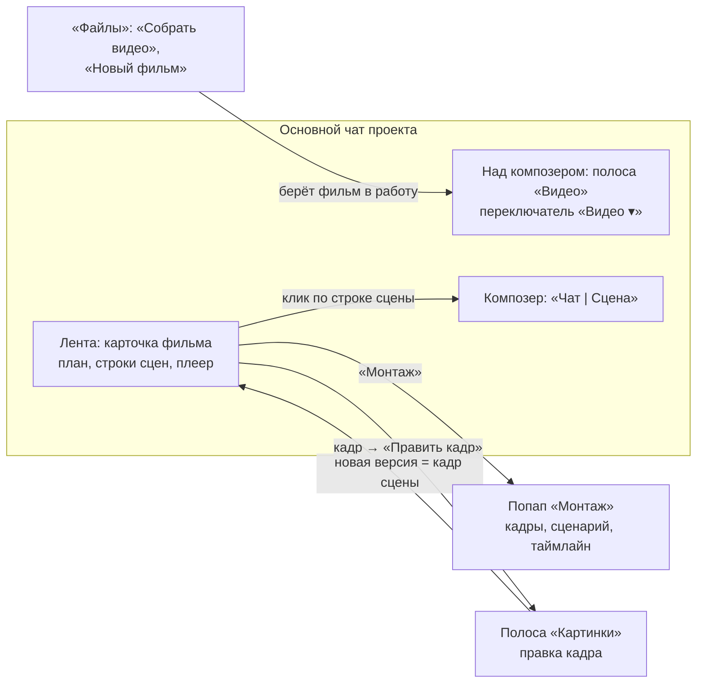

# Редактор видео v4: фильм в основном чате проекта

Макет: [video-editor-v4.html](video-editor-v4.html). Открывается без сети. В шапке макета — тема
(светлая / тёмная), ширина (1360 / 390), «Сразу к» (сценарии 1–7 и «Сначала») и «Сбой сцены 3» (да /
нет). Сценарий можно открыть адресом: `?jump=3&theme=dark&w=390`. Это только макет, код продукта не
менялся. Прошлые версии: [video-editor-v3.html](video-editor-v3.html) с
[video-editor-v3-proposal.md](video-editor-v3-proposal.md), v2 и v1 рядом.

Образец схемы — редактор картинок v3 (основное дерево, `docs/features/image-editor.md`,
`docs/mockups/image-editor-v3-in-chat-proposal.md`, `image-editor-v3-images-strip-variants.md`).
Полоса над композером собрана по варианту A из записки о полосе «Картинки» («близнец git-полосы»):
одна плашка высотой 51 px, заголовок полосы работает как переключатель.

## Главное

Отдельного окна редактора и отдельного чата «новый-фильм.film · монтаж» больше нет. Фильм живёт в
обычном чате проекта, а функции v3 разъехались по местам, которые в чате уже есть:

- **Фильм в работе — один на чат.** Режим «Сцена», полоса «Видео» и агент по умолчанию действуют
  на него. У карточки такого фильма акцентная рамка и метка «в работе».
- **Полоса «Видео»** над композером: с чем работаем, чем снимать, длительность, музыка, траты и
  «Собрать фильм». Переключается с Git и «Картинками» тем же меню.
- **Карточка фильма в ленте** — живая: план агента, строка на каждую сцену, версии клипа, пометки
  «переснять», собранный фильм с плеером.
- **Режим композера «Сцена»** — текст уходит прямо в модель видео, без агента.
- **Попап «Монтаж»** — вся ручная работа из v3: кадры и «Сценарий», таймлайн, подрезка, склейки,
  музыка, панель настроек слева.
- **Кадр — это картинка редактора картинок.** «Править кадр» открывает его полосой «Картинки», новая
  версия картинки сама становится кадром фильма.

## Раскладка

**Десктоп.** Слева рельса и «Файлы», в центре чат. Над композером одна полоса за раз: Git, Картинки
или Видео. Попап «Монтаж» ложится поверх всего окна с отступом 14 px.

**Телефон 390.** Полоса по умолчанию скрыта, как git-полоса сейчас. Взятый в работу фильм
показывает её одной строкой 32 px: «Видео ▾ · утро-в-горах · 4 сц · 0:32 · $13.00 ✕ ▾». Тап по
строке открывает шторку с настройками: чем снимать, длительность, пропорции, музыка, траты, «Монтаж»,
«Собрать фильм». Название полосы открывает шторку «Полоса над композером». В карточке строка сцены
раскладывается в два этажа: сверху кадры A → B и статус с ценой, под ними текст на всю ширину.
«Монтаж» открывается на весь экран, панель настроек выбранного уходит под таймлайн.

## Фильм в работе

Взять фильм в работу можно четырьмя способами:

| Откуда | Что происходит | Тихая строка |
|---|---|---|
| «Файлы» → выделить 2 и больше картинок → «Собрать видео · 3 картинки» | Фильм из этих картинок: кадры готовы, между ними сцены без текста | Вы взяли в работу: горы |
| «Файлы» → «⋯» у папки → «Новый фильм» | Пустой фильм, в карточке подсказка «Опишите ролик в чате…» | Вы взяли в работу: новый-фильм |
| Фраза агенту: «сделай ролик про…» | Агент заводит фильм и сразу идёт по плану | Claude взял в работу: утро-в-горах |
| «Работать с этим» в шапке старой карточки | Фильм снова в работе | Вы взяли в работу: … |

- Над композером открывается полоса «Видео». Если человек сам переключился на другую полосу, на
  «▾» горит точка.
- ✕ на чипе снимает фильм из работы: карточка остаётся в ленте с меткой «не в работе», полоса
  возвращается к прежней. Идущая съёмка при этом **не останавливается** (об этом говорит тост).
- Новый фильм, взятый в работу, снимает с работы прежний. Старая карточка остаётся в ленте.
- Как и у картинок: один фильм может жить в нескольких чатах проекта, в каждом — своя карточка.

## Полоса «Видео»

Геометрия — как у `ProjectGitBar` и полосы «Картинки» (вариант A): 51 px, `R.xxl`, фон `C.bgPanel`,
кнопки 28 px.

| Элемент | Зачем |
|---|---|
| «Видео ▾» — заголовок и переключатель полос | Меню: Git, Картинки, Видео со строкой состояния каждой полосы и «Свернуть полосу в строку» |
| Чип «Работаем с: утро-в-горах · 4 сцены · 0:32 ✕» | К чему относится то, что я сейчас напишу. При выбранной сцене — «Работаем с: утро-в-горах · сцена 3 ✕», и ✕ снимает сначала сцену, потом фильм |
| «fal · Veo 3.1 ▾» — чем снимать | fal, Higgsfield, «Локальные модели». В меню у каждого цена за вариант, у локальных — «бесплатно · снимает по первому и последнему кадру · ~5 мин на сцену 5 с · очередь: 1» |
| «8 с ▾» | Длительность сцены и пропорции по умолчанию. Пропорции видны на кнопке, только когда они не 16:9 |
| Чип музыки ♪ | Файл, «Без музыки», «Подобрать с Claude…». Имя файла — в подсказке и в «Монтаже» |
| «Потрачено на фильм: $13.00 ▾» | Расходы по пунктам: что, кто, сколько. Отменённое зачёркнуто с пометкой «не списано». Пока идёт генерация, рядом пульсирует точка |
| ■ | «Остановить всё». Появляется, только пока что-то идёт |
| «Собрать фильм» | Собрать mp4 из текущих версий сцен, бесплатно. Без снятых сцен кнопка неактивна. Во время сборки — «Собираем…», после правок собранного фильма — «Собрать заново» |

Состояния:

| | Без фильма | С фильмом |
|---|---|---|
| Полоса | «Видео ▾» · «✦ Новый фильм» · «Фильм не выбран. Выделите картинки в «Файлах» → «Собрать видео» или попросите Claude» · чем снимать · длительность | Всё из таблицы выше |
| Свёрнутая строка | «Видео ▾ · фильм не выбран» | «Видео ▾ · утро-в-горах · 4 сц · 0:32 · $13.00 ✕» |

**Переключение полос.** Всё как у картинок: фильм взяли в работу — полоса сама переходит на
«Видео»; сняли — возвращается прежняя, если человек сам ничего не переключал. Выбор сцены
возвращает «Видео» — по той же причине, что у картинок: запуск платный, цена и модель должны быть на
виду. Переход на «Картинки» при правке кадра описан ниже.

## Карточка фильма в ленте

Одна карточка на фильм. Она обновляется на месте, новых карточек по ходу работы не появляется.

- **Шапка:** имя, «4 сцены · 0:32 · 16:9», «в работе» / «не в работе», «Монтаж».
- **План агента — внутри карточки.** «План Claude · шаг 3 из 5 · идёт». Цепочка шагов «Написать
  сценарий · 4 сцены → Нарисовать кадры · 5 кадров · $0.20 → Снять сцены · 4 по 2 варианта · ≈ $12.80 →
  Собрать фильм · бесплатно → Сохранить mp4 в проект · бесплатно». Текущий шаг — со счётчиком
  («3/4») и полосой прогресса. Под цепочкой: «Потрачено $9.80 из ≈ $13.00 · оценка: 5 кадров по $0.04 и 4
  сцены по ≈ $3.20; текст, склейки и сборка бесплатно». Справа «Остановить всё», после остановки —
  «Продолжить план». Выполненный план сворачивается в строку «План Claude выполнен · 5 шагов ·
  потрачено $13.00 из ≈ $13.00».
- **Строка сцены:** миниатюры кадр A → кадр B (между ними ▶, когда клип снят), «Сцена 3 · кадры 3 → 4 ·
  8 с», 2–3 строки текста сцены, справа статус, цена и версии.
  - Клик по тексту — правка на месте, как в v3: клик мимо или Ctrl+Enter сохраняет, Esc отменяет.
  - Клик по миниатюре кадра — меню «Кадр 2 · images/утро-в-горах/кадр-2.png · версия 1»: «Править кадр»
    и «Показать в дереве».
  - Клик по остальной строке выбирает сцену: рамка, метка «в работе», композер переходит в «Сцену».
- **Статусы сцены:** ждёт текста · пишем текст · текст готов · рисуем кадр · кадры готовы · в плане ·
  снять · очередь · снимаем 2 варианта · 40 % · готово · ошибка · сервис не ответил · остановлено · не
  списано · не начато · не списано · склейка наплывом · пропущена · встык. У локальных моделей вместо
  процента — «снимаем на своей GPU».
- **Цена:** до съёмки — «≈ $3.20» (у локальных — «бесплатно · ~8 мин»), после — «потрачено $3.20»,
  у сбоя и остановки — «не списано».
- **Версии клипа** — как версии картинки: каждый снятый вариант — версия. «‹ версия 2 из 2 ›»,
  текущая идёт в сборку. Под версией агента — «✦ выбрал Claude», в подсказке — почему. Под версией
  человека — «по просьбе «сделай плавнее»». Переключение — тихая строка, у собранного фильма
  появляется «Собрать заново».
- **Пометки:** «Текст изменён — переснять · ≈ $3.20», «Кадр изменён — переснять», «Текст и кадр
  изменены — переснять». Правка агента подсвечена в тексте (зелёным новое, зачёркнутым убранное):
  «✦ переписал Claude · Принять · Вернуть как было». Всё это пришло из v3 без изменений.
- **Собранный фильм** — внизу карточки: плеер, «Фильм собран · версия 1», «0:32 · 16:9 · 4 сцены ·
  утро.mp3», «В проекте: images/утро-в-горах.mp4 · Показать в дереве». Кнопки «Сохранить в проект»
  (или неактивная «В проекте»), «Монтаж», «Скачать». Если после сборки что-то менялось — «Сцены или
  монтаж менялись после сборки — соберите заново» и «Собрать заново».

## Режим композера «Сцена»

Аналог режима «Картинка». Появляется только при выбранной сцене. Переключатель встроен в нижнюю
строку поля: «Чат | Сцена» (на 390 — только иконки).

| | Чат | Сцена |
|---|---|---|
| Кому текст | Claude | Прямо в модель видео, без агента |
| Над полем | — | Промпт модели · уходит прямо в Veo 3.1 вместе с текстом сцены 3 и кадрами 3 → 4, без агента · 2 варианта станут новыми версиями |
| Плейсхолдер | Спросите Claude… | Что изменить в сцене 3? Например: сделай плавнее |
| Кнопка | Отправить ↑ | «✦ Переснять · ≈ $3.20», у локальных — «бесплатно · ~8 мин» |
| Рамка поля | обычная | акцентная |

- В ленте остаётся тихая строка «Вы запустили: «сделай плавнее» · сцена 3 · Veo 3.1 · 2 варианта ·
  ≈ $3.20». Когда съёмка готова — «Сцена 3 переснята: версии 3 и 4 · текущая — версия 3».
- Старая версия никуда не девается, стрелки в строке переключают версии.
- Текст сцены от прямого запуска не меняется: просьба дописывается к нему как указание для модели
  (открытый вопрос 3).
- Если кадр в работе у полосы «Картинки», третьим пунктом переключателя становится «Картинка». Одновременно
  в работе либо сцена, либо кадр: выбор сцены снимает кадр, «Править кадр» снимает сцену.

## Попап «Монтаж»

`Modal` почти во весь экран (на 390 — на весь экран). Открывается «Монтажом» в шапке карточки, у
собранного фильма и в шторке полосы на телефоне.

- **Шапка:** «Монтаж · утро-в-горах · 4 сцены · 0:32 · $13.00», переключатель «Кадры | Сценарий»,
  «Собрать фильм», «Готово».
- **Слева — панель выбранного** (290 px), как в v3. У сцены это кадры A → B, текст сцены, способ,
  модель и длительность, подрезка («− 0,5 с», «+ 0,5 с») и версия клипа. У склейки — «Встык |
  Наплыв 1 с | Затемнение». У музыки — файл, громкость и затухание.
- **«Кадры»:** лента кадров с карточками сцен между ними, плеер, таймлайн. На таймлайне клипы с
  ручкой подрезки справа (отрезанное заштриховано), ромбы склеек между клипами, дорожка музыки.
- **«Сценарий»:** документ по сценам, поля всегда открыты для правки. Это тот же текст, что в
  строках карточки: правка сразу видна в ленте.
- **Внизу:** «Ручные правки уходят в ленту тихими строками — Claude их видит. Закрытие не снимает
  фильм из работы».
- Закрытие («Готово», Esc, клик мимо) фильм из работы не снимает. Тост: «Монтаж» закрыт — фильм
  остаётся в работе».

## Кадр — это картинка

Опорные кадры фильма — обычные картинки проекта (`images/утро-в-горах/кадр-2.png`), нить у них та
же, что у любой картинки в редакторе картинок v3.

1. Клик по миниатюре кадра → «Править кадр». В ленту падает тихая строка «Вы взяли в работу кадр:
   images/утро-в-горах/кадр-2.png — кадр 2 фильма «утро-в-горах»» и карточка картинки.
2. Полоса переключается на «Картинки»: «Работаем с: кадр-2.png · версия 1 ✕», мостик «🎬 кадр 2 · ↩ к
   фильму» (в подсказке — «Кадр 2 фильма «утро-в-горах», сцены 1 и 2. Новая версия картинки сама
   станет кадром фильма»), модель, варианты, цена, персонаж. На «Картинки ▾» горит точка:
   полоса «Видео» ждёт. Композер переходит в режим «Картинка».
3. «✦ Изменить · ≈ $0.04» → новая версия картинки сразу становится кадром 2. Тихая строка: «Версия 2
   кадр-2.png стала кадром 2 фильма «утро-в-горах» · у сцен 1 и 2 кадр изменён — переснять · ↩ К
   фильму». У сцен 1 и 2 появляется «Кадр изменён — переснять», у миниатюры — обводка и «v2».
4. «↩ к фильму» или ✕ на чипе картинки возвращает полосу «Видео».

Не снятые сцены просто берут новый кадр, пометка нужна только снятым. Персонажи, пометки на холсте и
попап «Редактор» — всё из картинок v3, в макете видна только кнопка «Редактор».

## Деньги

Лимита запусков за ход для видео нет: агент рисует, снимает и собирает сам (решение Андрея).
Поэтому траты видны в четырёх местах:

- **счётчик в полосе** «Потрачено на фильм: $X ▾» с расходами по пунктам;
- **оценка у плана** в карточке: сумма и из чего она сложена;
- **цена у каждой сцены** — до съёмки оценка, после неё списанное;
- **«Остановить всё»** — в плане и ■ в полосе, пока что-то идёт. Кнопка гасит план, съёмку,
  рисование и сборку. Готовое остаётся, отменённое и не начатое не списываются.

Деньги списываются, когда генерация готова. У Higgsfield траты в кредитах, счётчик показывает
«$0.20 + 64 кр». У локальных моделей денег нет, цена заменяется временем и очередью.

## Сохранение

- **Агент сохраняет mp4 сам** последним шагом плана (решение Андрея; картинки так не умеют). Тихая
  строка: «Claude сохранил фильм в проект: images/утро-в-горах.mp4 · Показать в дереве».
- **Человек** — «Сохранить в проект» у собранного фильма. Перезаписи нет: `утро-в-горах.mp4` →
  `утро-в-горах.v2.mp4`. Строка «Сохранено как: images/утро-в-горах.v2.mp4 · Показать в дереве»
  и тост с той же кнопкой.
- Эта сборка уже в проекте — кнопка неактивна и называется «В проекте». После новой сборки снова
  активна.
- «Показать в дереве» подсвечивает файл в «Файлах», на телефоне открывает шторку «Файлы».
- Кадры, которые рисует агент, сразу ложатся в `images/<фильм>/` — это картинки проекта с
  пометкой «новое» в дереве.

## Тихие строки

Все ручные действия человека в карточке и в «Монтаже» пишутся в ленту. Повторные правки одного
места схлопываются в одну строку.

| Действие | Строка |
|---|---|
| Взять / снять фильм | Вы взяли в работу: горы · Вы сняли из работы: утро-в-горах — карточка осталась в ленте |
| Прямой запуск | Вы запустили: «сделай плавнее» · сцена 3 · Veo 3.1 · 2 варианта · ≈ $3.20 |
| Пересъёмка по пометке | Вы запустили: пересъёмка сцены 1 по новому кадру · Veo 3.1 · 2 варианта · ≈ $3.20 |
| Версия | Вы переключили сцену 3 на версию 4 |
| Текст | Вы поправили текст сцены 2 в «Сценарии»: «…» — клип снят по прежнему тексту · Вы приняли правку текста сцены 3 · Вы вернули текст сцены 2 как было |
| Монтаж | Вы поменяли склейку 2 → 3 на «затемнение» · Вы подрезали сцену 1: осталось 7,5 с из 8 с |
| Настройки полосы | Вы выбрали, чем снимать: Локальные модели · MiniMax H3 — бесплатно, ~5 мин на сцену 5 с, очередь локальной GPU · Вы поставили музыку: music/утро.mp3 |
| План | Вы остановили всё: утро-в-горах · съёмка сцен 1 и 2 отменена — деньги за неё не списаны · Вы продолжили план · Вы выбрали: сцена 3 — склейка наплывом, бесплатно |
| Сборка и сохранение | Вы собрали фильм: утро-в-горах · 0:32 · бесплатно · Сохранено как: … · Показать в дереве |

## Было в v3 → стало в v4

| Было в v3 | Стало в v4 | Куда |
|---|---|---|
| Полноэкранный редактор фильма с шапкой | Нет. Фильм живёт в любом чате проекта | — |
| Отдельный «чат фильма» справа, 384 px, привязанный к `.film` | Обычный чат проекта. Агент видит фильм в работе, как картинку в v3 | чат |
| Чип фильма в композере «· 2 ручные правки» | Не нужен: ручные правки уже в ленте тихими строками | убрано |
| Имя фильма в шапке | Чип «Работаем с: утро-в-горах · 4 сцены · 0:32 ✕» | полоса |
| «Потрачено на фильм ▾» в шапке | Там же, но в полосе | полоса |
| «Собрать фильм» в шапке | «Собрать фильм» в полосе и «Собрать заново» у собранного фильма | полоса, карточка |
| «Остановить всё» в шапке и в карточке плана | ■ в полосе и «Остановить всё» в плане внутри карточки | полоса, карточка |
| Поставщик, модель, длительность — в форме перехода | Умолчания фильма в полосе: чем снимать, длительность, пропорции | полоса |
| Музыка — дорожка на таймлайне и панель | Чип в полосе. Громкость и затухание — в «Монтаже» | полоса, попап |
| Карточка плана в чате отдельно от ленты кадров | План внутри карточки фильма, отдельной карточки нет | карточка |
| Карточки «Снимаем заново», «Готово · Показать варианты», «Фильм собран» | Статус, версии и плеер прямо в строке сцены и в карточке фильма | карточка |
| Варианты клипа — сетка 2×2 в панели и «Взять вариант» | Каждый вариант — версия клипа, стрелки в строке сцены, текущая идёт в сборку | карточка |
| Текст сцены на карточке перехода | Текст в строке сцены, правка на месте | карточка |
| «Текст изменён — переснять?», подсветка правки агента | Без изменений | карточка |
| — | «Кадр изменён — переснять» | карточка |
| Правка перехода вручную — форма генерации в панели | Режим композера «Сцена»: текст прямо в модель, «Переснять · цена» | композер |
| Лента кадров, плеер, таймлайн, подрезка | Попап «Монтаж», вид «Кадры» | попап |
| «Кадры / Сценарий» над лентой | Переключатель в шапке «Монтажа». Строки сцен в карточке — сокращённый сценарий | попап, карточка |
| Панель настроек выбранного слева | Слева внутри попапа | попап |
| «Перерисовать с Claude…» в меню кадра | «Править кадр» открывает полосу «Картинки» со всеми её возможностями | полоса «Картинки» |
| Пустой фильм: большое поле «Опишите ролик…» | Фраза агенту в обычном чате. У пустого фильма в карточке — подсказка | чат, карточка |
| «Фильм собран · Открыть · Показать в файлах» | Агент сам сохраняет mp4, у человека — «Сохранить в проект», «Показать в дереве» | карточка |
| «Обсудить с Claude» у выделенного фрагмента | В макете v4 не показано. Переносится как есть: цитата уходит в обычный композер | композер |
| Полоса плана и вкладки «Инструменты» / «Чат» на телефоне | Строка полосы над композером, шторка настроек, «Монтаж» на весь экран | телефон |

## Тексты интерфейса

| Место | Текст |
|---|---|
| Полоса, заголовок | Видео ▾ |
| Меню полос | Git · feat/site-header · +42 −7 · 2 к публикации / Картинки · Работаем с кадр-2.png (картинка не выбрана) / Видео · Работаем с утро-в-горах · 4 сцены · $13.00 (фильм не выбран) / Свернуть полосу в строку |
| Полоса без фильма | ✦ Новый фильм · Фильм не выбран. Выделите картинки в «Файлах» → «Собрать видео» или попросите Claude |
| Чип | Работаем с: утро-в-горах · 4 сцены · 0:32 ✕ / Работаем с: утро-в-горах · сцена 3 ✕ |
| ✕ на чипе, подсказка | Снять фильм из работы / Снять выбор сцены — фильм останется в работе |
| Чем снимать, меню | fal · Veo 3.1 — ≈ $1.60 за вариант 8 с / Higgsfield · Kling 3.0 — 16 кредитов за вариант 8 с / Локальные модели · MiniMax H3 — бесплатно · снимает по первому и последнему кадру · ~5 мин на сцену 5 с · очередь: 1 · Цена сцены — за 2 варианта. Меняется для следующих съёмок, снятое не пересчитывается |
| Длительность, меню | Длительность сцены по умолчанию · 5 с · 8 с · 10 с · Пропорции · 16:9 · 9:16 · 1:1 |
| Музыка, меню | music/утро.mp3 · громкость 60 % · затухание 4 с · Без музыки · Подобрать с Claude… |
| Счётчик | Потрачено на фильм: $13.00 |
| Расходы | Расходы фильма «утро-в-горах» · Сцена 1 · Veo 3.1 · 2 варианта · Claude · $3.20 · … не списано · Осталось по оценке плана · Всего · Деньги списываются, когда генерация готова. Отменённое и не начатое не списывается. |
| Кнопки полосы | Собрать фильм / Собираем… / Собрать заново · ■ Остановить всё: съёмку, рисование и сборку |
| Тост при снятии | Фильм больше не в работе: режим «Чат» / Фильм больше не в работе. Идущая съёмка продолжается — «Остановить всё» в карточке |
| Карточка, шапка | утро-в-горах · 4 сцены · 0:32 · 16:9 · в работе / не в работе · Работать с этим · Монтаж |
| Пустой фильм | В фильме пока нет кадров. Опишите ролик в чате — Claude напишет сценарий, нарисует кадры и снимет сцены. Или выделите картинки в «Файлах» → «Собрать видео». |
| План | План Claude · шаг 3 из 5 · идёт / ждёт вашего решения / остановлен · Остановить всё · Продолжить план |
| Шаги плана | Написать сценарий · 4 сцены · бесплатно → Нарисовать кадры · 5 кадров · $0.20 → Снять сцены · 4 по 2 варианта · ≈ $12.80 → Собрать фильм · бесплатно → Сохранить mp4 в проект · бесплатно |
| Деньги плана | Потрачено $9.80 из ≈ $13.00 · не начато и не списано ≈ $6.40 · оценка: 5 кадров по $0.04 и 4 сцены по ≈ $3.20; текст, склейки и сборка бесплатно |
| План выполнен | План Claude выполнен · 5 шагов · потрачено $13.00 из ≈ $13.00 |
| Строка сцены | Сцена 3 · кадры 3 → 4 · 8 с (7,5 с из 8 с) · в работе |
| Статусы | см. раздел «Карточка фильма» |
| Цена в строке | ≈ $3.20 / потрачено $3.20 / не списано / бесплатно · ~8 мин |
| Версии | ‹ версия 2 из 2 › · ✦ выбрал Claude (в подсказке: Claude взял вариант 2 из 2 — камера движется ровнее) · по просьбе «сделай плавнее» |
| Пометки | Текст изменён — переснять · Кадр изменён — переснять · Текст и кадр изменены — переснять · Переснять · ≈ $3.20 · ✦ переписал Claude · Принять · Вернуть как было · Сервис видео не ответил. Деньги не списаны · Повторить · ≈ $3.20 |
| Меню кадра | Кадр 2 · images/утро-в-горах/кадр-2.png · версия 1 · Править кадр (откроется полосой «Картинки» · персонажи, пометки, версии · влияет на сцены 1 и 2) · Показать в дереве |
| Собранный фильм | Фильм собран · версия 1 · 0:32 · 16:9 · 4 сцены · утро.mp3 · В проекте: images/утро-в-горах.mp4 · Показать в дереве / Ещё не в проекте / Прошлая сборка лежит в … · Сцены или монтаж менялись после сборки — соберите заново · Сохранить в проект / В проекте · Монтаж · Скачать |
| Режим «Сцена» | Чат · Сцена · Промпт модели · уходит прямо в Veo 3.1 вместе с текстом сцены 3 и кадрами 3 → 4, без агента · 2 варианта станут новыми версиями · Что изменить в сцене 3? Например: сделай плавнее · ✦ Переснять · ≈ $3.20 |
| Полоса «Картинки» для кадра | Работаем с: кадр-2.png · версия 1 ✕ · 🎬 кадр 2 · ↩ к фильму · Промпт модели · уходит прямо в Nano Banana Pro, без агента · новая версия станет кадром 2 фильма · Что изменить в кадр-2.png? Например: туман гуще, солнце ниже · ✦ Изменить · ≈ $0.04 |
| Карточка кадра | кадр-2.png · версия 2 · в работе · Кадр 2 фильма «утро-в-горах» · сцены 1 и 2 · Версия 2 — «туман гуще» · уже стала кадром фильма · Редактор · ↩ К фильму |
| Тост кадра | Кадр открыт полосой «Картинки». Новая версия сама станет кадром фильма |
| «Монтаж» | Монтаж · утро-в-горах · Кадры · Сценарий · Собрать фильм · Готово · Таймлайн · 0:32 · клик по ромбу — склейка, ручка справа у клипа — подрезка · Ручные правки уходят в ленту тихими строками — Claude их видит. Закрытие не снимает фильм из работы. |
| «Монтаж», панель | Сцена 2 · кадры 2 → 3 · Текст сцены — что происходит от кадра 2 до кадра 3 · Тот же текст, что в карточке в ленте. По нему модель снимет клип · Способ · Модель · длительность · Подрезка · осталось 6 с из 8 с · − 0,5 с · + 0,5 с · Или тяните ручку клипа на таймлайне · Версия клипа / Склейка 2 → 3 · Как сцена 2 переходит в сцену 3 · Встык · Наплыв 1 с · Затемнение · Бесплатно, генерация не нужна. Меняет только сборку. |
| «Сценарий» | Сценарий · утро-в-горах · тот же текст, что в строках сцен в ленте. Правьте как документ — или попросите Claude в чате. От правки текста ничего не снимается: у снятой сцены появится «Переснять». |
| Закрытие «Монтажа» | «Монтаж» закрыт — фильм остаётся в работе |
| «Файлы» | Собрать видео · 3 картинки · Новый фильм (пустой фильм в images/ — в работу в последнем чате) · Выделите 2 и больше картинок — появится «Собрать видео» |
| Телефон, шторка | Полоса над композером · Видео · Картинки · Не показывать полосу / Видео · Работаем с · Чем снимать · Сцена · Музыка · Потрачено · Остановить всё · Монтаж · Собрать фильм |
| Агент, начало | Сделаю ролик «утро в горах»: 4 сцены по 8 с… Запускаю сам: оценка ниже, траты — в полосе «Видео», «Остановить всё» — в карточке. |
| Агент, конец | Готово: фильм собран и сохранён в проект — images/утро-в-горах.mp4, 0:32. Потрачено $13.00 из ≈ $13.00. Сцену можно переснять: нажмите на её строку в карточке и напишите, что поменять. Склейки и подрезка — в «Монтаже». |
| Агент, остановка | Остановил. Готово и осталось в фильме: кадров — 5 из 5, сцен — 0 из 4. Потрачено $0.20; не начатое не списано (≈ $12.80). Продолжу с того же места, когда скажете «продолжай» или нажмёте «Продолжить план». |
| Агент, сбой | Сцена 3 не снялась: сервис видео не ответил. Деньги за неё не списаны. Остальное продолжаю — сцена 4 снимается. Как поступим со сценой 3? · Повторить · ≈ $3.20 · Склеить наплывом · бесплатно · Собрать без неё — встык |

## Сценарии макета

1. **Ролик с нуля** — «Сразу к 1» или «Сначала» → подсказка «Сделай ролик из 4 сцен про утро в
   горах» → «Claude взял в работу» → полоса «Видео» → в карточке пишется сценарий, рисуются кадры,
   снимаются сцены с процентом и ценой → сборка → «Claude сохранил фильм в проект» → «Показать в
   дереве» подсвечивает файл.
2. **Сцена 3 → Переснять** — клик по строке сцены 3 → «Сцена» → «сделай плавнее» → «Переснять ·
   ≈ $3.20» → версии 3 и 4, стрелки.
3. **Править кадр 2** — миниатюра кадра 2 → «Править кадр» → полоса «Картинки» → «Изменить» → у сцен
   1 и 2 «Кадр изменён — переснять» → «↩ к фильму».
4. **Монтаж** — ромб склейки 2 → 3 → «Затемнение», ручка клипа или «− 0,5 с», «Сценарий» и правка
   текста → «Готово» → тихие строки.
5. **Остановить всё** посреди съёмки → «остановлено · не списано» и «не начато · не списано», итог
   денег в плане, «Продолжить план».
6. **Ошибка сцены** (сбой сцены 3 включается в шапке макета) → «ошибка» в строке, план «ждёт вашего
   решения», три выхода от агента и «Повторить» в самой строке.
7. **Телефон 390** — строка полосы, шторка настроек, двухэтажные строки сцен, «Монтаж» на весь экран.

Ещё прокликивается: «Собрать видео» из выделенных картинок в «Файлах», «Новый фильм» в «⋯» у
`images/`, ✕ на чипе, переключение и сворачивание полос, смена поставщика (у локальных — время
вместо цены), расходы по пунктам, правка текста сцены на месте, «перепиши сцену 2 под закат»
(подсветка, «Принять» / «Вернуть как было»), «сцена 3 слишком резкая» в обычном чате (агент
переснимает сам), «собери фильм», «Сохранить в проект» с `.v2`, плеер.

**Статикой или условно:** ответы агента заготовлены и распознаются по ключевым словам; цены и модели
условные; перерисованный кадр есть только у кадра 2; попап «Редактор» картинки, персонажи и выбор
модели в полосе «Картинки» не открываются; «Скачать» и «Подобрать с Claude» ничего не делают; плеер
листает кадры сцен вместо видео; «Обсудить с Claude» у фрагмента не показан.

## Проверка

Headless Chromium (Playwright): сценарии 1–7 проходятся кликами, ошибок в консоли нет. Проверено:
тихие строки на каждом шаге, «Показать в дереве» подсвечивает `images/утро-в-горах.mp4`, повторное
сохранение неактивно, пересъёмка даёт «версия 3 из 4», правка кадра даёт две пометки «Кадр
изменён», «Монтаж» пишет строки про склейку, подрезку и текст, остановка даёт «не начато · не
списано» и после «Продолжить план» доходит до «План Claude выполнен». При сбое в строке появляется
«ошибка», а после «Склеить наплывом» фильм собирается. На 390 нет горизонтальной прокрутки, модалка
занимает весь экран, обе темы в порядке. Полоса «Видео» на ширине колонки чата 950 px помещается в одну
строку без переполнения.

## Открытые вопросы

1. **Потолок трат.** Лимита запусков нет, всё держится на видимости и «Остановить всё». План из 4
   сцен — $13, из 12 сцен с пересъёмками легко выйдет $50. Нужен ли мягкий порог на фильм («дальше
   $20 — спросить»)? Кто его задаёт — пользователь или администратор?
2. **Съёмка после снятия фильма из работы.** В макете ✕ на чипе съёмку не останавливает (траты идут,
   карточка в ленте их показывает). Или снятие с работы должно спрашивать «Остановить всё?»
3. **Режим «Сцена» и текст сцены.** Просьба из режима «Сцена» идёт в модель вместе с текстом сцены,
   но сам текст не меняет. Переписывать текст под просьбу (тогда текст и снятое совпадают) или
   хранить просьбу у версии клипа, как в макете?
4. **Сколько вариантов у прямой пересъёмки.** В полосе числа вариантов нет, в макете всегда 2. Дать
   в полосе степпер «− 2 +», как у картинок? Он добавит ширины, а полоса и так впритык.
5. **Кадр, общий для двух фильмов.** Если одна картинка — кадр в двух фильмах, новая версия меняет
   кадр в обоих? В макете — да, раз кадр ссылается на файл. Альтернатива — фильм держит версию
   кадра, и обновление только по кнопке.
6. **Перерисовка кадра агентом в плане.** В v3 агент после перерисовки кадра сам переснимал соседние
   сцены. В v4 так же, или он только ставит «Кадр изменён — переснять» и ждёт человека?
7. **Где лежит фильм как проект.** В v3 был файл `.film`. В v4 фильм живёт в чате, а на диске —
   `images/<фильм>/` с кадрами и mp4. Нужен ли `.film` (для «Собрать видео» из дерева по второму
   разу и для других чатов) или хватает нити в чате, как у картинок?
8. **Один фильм в двух чатах.** У картинок нить копируется при ветвлении чата, а в другом чате
   картинку берут заново. Для фильма, который агент снимает минутами, это значит два плана над
   одними кадрами. Запрещать второй план, пока идёт первый?
9. **Полоса впритык.** На колонке 950 px полоса помещается, только если музыка — одна иконка, а
   пропорции видны лишь при значении не 16:9. На ширине колонки меньше 900 px чип фильма
   ужимается с многоточием. Устраивает или переходим на двухэтажную плашку (вариант B)?
10. **Вопросы v3,** которые остаются в силе: счётчик в кредитах и долларах, выбор лучшего варианта
    агентом, что агент видит в клипах, фоновое выполнение плана, текст сцены и промпт модели (одно
    поле или два), неразобранная правка агента.
