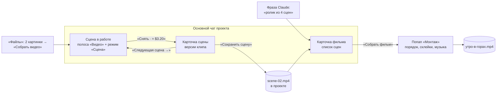

# Редактор видео v5: работа по сценам, сцена = файл

Макет: [video-editor-v5.html](video-editor-v5.html). Открывается без сети. В шапке макета — тема
(светлая / тёмная), ширина (1360 / 390) и «Сразу к» (сценарии 1–7 и «Сначала»). Сценарий открывается
и адресом: `?jump=4&theme=dark&w=390`. Это только макет, код продукта не менялся. Прошлая версия —
[video-editor-v4.html](video-editor-v4.html) с [video-editor-v4-proposal.md](video-editor-v4-proposal.md).

## Главное

В v4 фильм делался целиком одним планом агента: сценарий → все кадры → все сцены → сборка. В v5
работа идёт **мелкими кусками**: сделали сцену → посмотрели → сохранили → следующая сцена → … → в конце
собрали фильм из готовых файлов.

Решения Андрея от 2026-09-29:

1. **Сцена — один клип между двумя кадрами** (кадр A → кадр B), как и раньше. Меняется порядок работы,
   а не устройство сцены.
2. **Готовая сцена — самостоятельный файл в проекте**: `video/утро-в-горах/scene-01.mp4`. Итоговый фильм
   собирается из этих файлов. Сцену можно взять в другой фильм или выложить отдельно.



**Единица работы — сцена**, как картинка у редактора картинок v3: она «в работе», у неё своя карточка в
ленте, версии, сохранение в проект. Фильм — **лёгкий список** сохранённых сцен и готовых mp4. Попап
«Монтаж» остался только для итоговой сборки.

## Было в v4 → стало в v5

| Было в v4 | Стало в v5 |
|---|---|
| В работе — фильм целиком | В работе — **одна сцена**. Фильм — её контекст: чип «Сцена 2 · утро-в-горах ▾» раскрывает список сцен фильма |
| Одна большая карточка фильма: план, строки всех сцен, плеер | **Карточка сцены** на каждую сцену: плеер, версии, «Сохранить сцену», «Следующая сцена →». **Карточка фильма** — лёгкий список миниатюр |
| План агента из 5 шагов, агент снимает всё подряд до сборки | Агент пишет сценарий, **снимает сцену 1 и останавливается**: «Снимать вторую?». Подряд — только по явному «сними все» |
| «Остановить всё» и «Продолжить план» у плана | «Остановить» у каждой сцены (■ в полосе, кнопка в карточке); у агента — «Продолжить со сцены N» |
| Версии клипа — стрелки в строке сцены; в сборку шла текущая версия | Версии — миниатюры и стрелки в карточке сцены. В сборку идёт **сохранённый файл**, а не текущая версия |
| mp4 появлялся только у собранного фильма | У каждой сцены свой файл `scene-NN.mp4`, повторное сохранение — `scene-NN.v2.mp4` |
| Кадры фильма — общая лента на 5 кадров, сцены между ними | У сцены свои кадры A и B. «Следующая сцена» ставит кадр A = кадр B предыдущей, B пустой |
| — | «Продлить от последнего кадра»: кадр A — последний кадр снятого клипа, ложится в `кадры/` картинкой |
| Правка кадра — только у готовых кадров («Править кадр») | Кадр A/B в полосе и карточке: выбрать из проекта, нарисовать через «Картинки», отдать Claude, «Править кадр» |
| Музыка — чип в полосе | Музыка — только в «Монтаже»: это часть сборки, а не съёмки сцены. Полоса освободила место под кадры и «вариантов» |
| Числа вариантов в полосе не было (всегда 2) | Степпер «− 2 +» в полосе, 1–4 варианта (закрыт вопрос 4 из v4) |
| «Собрать фильм» в полосе, собирал сразу | «Собрать фильм» в карточке фильма и в меню чипа — открывает «Монтаж»; собирать — там |
| «Сохранить в проект» у собранного фильма, агент сохранял сам | Сборка **сразу пишет файл** `утро-в-горах.mp4` в папку фильма, пересборка — `.v2.mp4` |
| Пересъёмка сцены помечала фильм «Собрать заново» | Пересъёмка трогает только одну сцену. Фильм помечается, когда **сохранён новый файл**: «Сцена 2 обновлена — пересобрать» |
| «Монтаж»: кадры, сцены, подрезка, склейки, музыка, «Сценарий» | «Монтаж» — только сборка: порядок (перетаскивание, «Раньше / Позже»), подрезка, склейки, музыка, плеер, «Сценарий», готовый mp4 |
| — | В фильм можно добавить **готовый mp4 из проекта** — сцену другого фильма или любой клип |
| Режим композера «Сцена» — только пересъёмка | Режим «Сцена»: у неснятой сцены поле ввода — **это и есть текст сцены**, у снятой — просьба к модели («сделай плавнее») |

## Структура файлов фильма в проекте

Так человек увидит фильм в «Файлах» после сценариев 3 и 4:

```
video/
  клипы/
    водопад.mp4                    — готовое видео, можно взять в любой фильм
  утро-в-горах/                    — папка фильма
    кадры/
      кадр-1.png … кадр-5.png      — кадры, которые рисовал Claude или человек
      scene-02-последний-кадр.png  — «Продлить от последнего кадра»
    scene-01.mp4                   — сохранённые сцены
    scene-02.mp4
    scene-02.v2.mp4                — пересъёмка сцены 2, прежний файл не тронут
    scene-03.mp4
    scene-04.mp4
    утро-в-горах.film              — описание фильма: порядок, склейки, музыка (вопрос 1)
    утро-в-горах.mp4               — собранный фильм
    утро-в-горах.v2.mp4            — пересборка
```

- **Папка фильма** — `video/<имя>/`. Её заводят «Собрать видео» в «Файлах» и Claude на фразу «сделай
  ролик». Имя — по папке картинок (`горы`) или по теме (`утро-в-горах`).
- **Кадры** — обычные картинки проекта. Выбранные из проекта остаются на своих местах
  (`images/горы/гора-1.png`), нарисованные для сцены ложатся в `кадры/` сразу, без «Сохранить»: у сцены
  кадр обязан быть файлом.
- **Сцены** называются по номеру сцены, а не по месту в фильме: перестановка в «Монтаже» файлы не
  переименовывает. Плитка показывает оба номера: «2 · Сцена 3 · scene-03.mp4».
- **Перезаписи нет нигде**: ни у сцен, ни у фильма, ни у кадров.

## Сцена в работе

Одна сцена на чат. Взять её в работу можно так:

| Откуда | Что происходит | Тихая строка |
|---|---|---|
| «Файлы» → выделить 2 и больше картинок → «Собрать видео · 2 картинки» | Фильм `горы`: каждая пара соседних картинок — сцена. Сцена 1 в работе | Вы собрали видео из 2 картинок: фильм «горы» · 1 сцена · Вы взяли в работу: сцена 1 фильма «горы» |
| «Следующая сцена →» в карточке сцены | Сцена N+1 встаёт в фильм сразу за текущей, кадр A = кадр B текущей | Вы завели сцену 2: кадр A — кадр B сцены 1, стык без скачка · кадр B пока пустой |
| Плитка в карточке фильма, пункт меню чипа, свёрнутая карточка сцены | Сцена в работе, её карточка разворачивается | Вы взяли в работу: сцена 3 фильма «утро-в-горах» |
| Claude по сценарию | Агент берёт сцену сам, композер остаётся в «Чате» | Claude взял в работу: сцена 2 фильма «утро-в-горах» |

- ✕ на чипе снимает сцену, фильм остаётся (чип становится «Фильм: утро-в-горах · сцена не выбрана» с
  кнопкой «+ Сцена»). Второй ✕ снимает фильм. Идущая съёмка не останавливается.
- **Если сцену берёт агент, композер не переходит в «Сцену».** Иначе ответ человека агенту («да, и
  остальные тоже») ушёл бы в модель видео как пересъёмка. Эту ошибку поймал прогон макета.

## Полоса «Видео»

Геометрия прежняя — как у `ProjectGitBar` и полосы «Картинки»: 51 px, `R.xxl`, фон `C.bgPanel`, кнопки
28 px.

| Элемент | Зачем |
|---|---|
| «Видео ▾» | Переключатель полос: Git, Картинки, Видео, «Свернуть полосу в строку» |
| Чип «🎬 Сцена 2 · утро-в-горах ▾ ✕» | С чем работаем. Клик — меню фильма: сцены по порядку со статусом, «Новая сцена», «Готовый mp4 из проекта…», «Собрать фильм», «Показать карточку фильма» |
| Миниатюры A → B | Кадры сцены. Пустой кадр — «+ B» акцентным пунктиром. Клик — меню кадра (ниже) |
| «fal · Veo 3.1 ▾» | Чем снимать: fal, Higgsfield, «Локальные модели» (бесплатно, по первому и последнему кадру, очередь) |
| «8 с ▾» | Длительность сцены. У неснятой сцены меняет её саму, у снятой — следующие съёмки |
| «− 2 +» | Вариантов за съёмку, 1–4. Каждый вариант станет версией клипа |
| «Потрачено: $6.48 ▾» | Траты на весь фильм по пунктам. Остановленное зачёркнуто «не списано». Пока идёт съёмка — точка пульсирует |
| ■ | «Остановить сцену N»: съёмку и рисование кадров. Только пока идёт |
| «Снять · ≈ $3.20» / «Переснять · ≈ $3.20» | Съёмка сцены. Неактивна без обоих кадров. У локальных — «Снять · бесплатно · ~16 мин» |

Состояния:

| | Полоса | Свёрнутая строка и телефон |
|---|---|---|
| Ничего в работе | Сцена не выбрана. Выделите 2 картинки в «Файлах» → «Собрать видео» или попросите Claude · модель · длительность · варианты | Видео ▾ · сцена не выбрана |
| Фильм без сцены | Чип «Фильм: … · сцена не выбрана ✕» · «+ Сцена» · модель · длительность · варианты · траты | Видео ▾ · утро-в-горах · сцена не выбрана · $13.00 |
| Сцена в работе | Всё из таблицы выше | Видео ▾ · Сцена 2 · утро-в-горах · $13.00 · [Снять] ▾ |

**Меню кадра** (в полосе и в карточке сцены; на телефоне — шторкой):

- «Кадр B сцены 2 · video/горы/кадры/кадр-1.png · версия 1»;
- «Править кадр» — у готового кадра: полоса «Картинки», новая версия сама станет кадром. У снятой сцены
  появится «Кадр изменён — переснять»;
- «Нарисовать через «Картинки»» — у пустого кадра: черновик «Новая картинка · станет кадром B»;
- «Отдать Claude» — у пустого кадра: агент рисует по тексту сцены, ≈ $0.04;
- у кадра A, если предыдущая сцена снята: «Кадр B сцены 1» (стык) и «Последний кадр клипа сцены 1»
  (продлить);
- «Выбрать из проекта» — картинки проекта списком с миниатюрами;
- «Показать в дереве».

Ширина: на колонке чата 950 px полоса со всем набором помещается ровно (948 из 948 px). Для этого счётчик
подписан коротко — «Потрачено: $X», а полное «Потрачено на фильм «…»» стоит в подсказке и в заголовке
меню. Разделителя после кадров нет, чип держит минимум 172 px и обрезает имя фильма многоточием («Сцена 2
· утро-в…»).

## Режим композера «Сцена»

| | Сцена не снята | Сцена снята |
|---|---|---|
| Что в поле | **Текст сцены.** Правка в поле сразу видна в карточке, и наоборот | Просьба к модели |
| Над полем | Текст сцены 2 · от кадра A к кадру B · уходит прямо в Veo 3.1 вместе с кадрами, без агента · 2 варианта станут версиями клипа | Промпт модели · уходит в Veo 3.1 вместе с текстом сцены 2 и кадрами, без агента · 2 варианта станут новыми версиями |
| Плейсхолдер | Что происходит в сцене 2 — от кадра A к кадру B? Например: камера медленно опускается в долину | Что изменить в сцене 2? Например: сделай плавнее |
| Кнопка | ✦ Снять · ≈ $3.20 | ✦ Переснять · ≈ $3.20 |

Текст сцены от просьбы не меняется, просьба хранится у версии («по просьбе «сделай плавнее»») — как в v4.
Третий пункт переключателя «Картинка» появляется, пока кадр в работе у полосы «Картинки».

## Карточка сцены

Одна карточка на сцену, обновляется на месте. Развёрнута только у сцены в работе, остальные свёрнуты в
строку: миниатюра, «Сцена 1 · утро-в-горах», «версия 2 из 2 · scene-01.mp4 · потрачено $3.28», «Работать с
этой». Пока свёрнутая сцена снимается — «снимаем 40 %» и «Остановить».

- **Шапка:** «Сцена 2 · утро-в-горах · место 2 · 8 с · в работе», справа «≈ $3.20» до съёмки и «потрачено
  $3.24» после.
- **Плеер** текущей версии (в макете — переход от кадра A к кадру B). До съёмки — кадры A и B рядом,
  пустой кадр подписан «выберите, нарисуйте или отдайте Claude». Во время съёмки — «Снимаем 2 варианта ·
  40 %» поверх.
- **Кадры A → B** крупнее, чем в полосе, с тем же меню.
- **Текст сцены** — полностью. Клик — правка на месте (Ctrl+Enter или клик мимо — сохранить, Esc —
  отменить).
- **Прогресс съёмки:** «Снимаем 2 варианта · 40 % · Veo 3.1 · ≈ $3.20 · «сделай плавнее»», полоса и
  «Остановить».
- **Версии:** миниатюра на каждую версию, текущая в акцентной рамке, у сохранённой — зелёная галочка;
  стрелки «‹ версия 2 из 2 ›». Под ними «✦ выбрал Claude» (в подсказке — почему) или «по просьбе «…»».
- **Где файл:** «Ещё не в проекте · сохранится как video/горы/scene-02.mp4» → «✓ В проекте:
  video/горы/scene-02.mp4 · Показать в дереве» → если выбрана другая версия: «В проекте:
  …/scene-02.mp4 — версия 2; текущая новее».
- **Кнопки:** «Ещё варианты · ≈ $3.20», «Сохранить сцену» (после сохранения — неактивная «В проекте»),
  «Следующая сцена →» и «▾» с выбором «Кадр A = кадр B этой сцены · стык без скачка» / «Продлить от
  последнего кадра».
- **Пометки:** «Текст изменён — переснять», «Кадр изменён — переснять», «Текст и кадр изменены —
  переснять» с кнопкой «Переснять · ≈ $3.20»; «Съёмка остановлена — деньги не списаны».

## Карточка фильма

Небольшая, одна на фильм. Появляется в ленте, когда фильм заводят («Собрать видео», сценарий Claude).

- **Шапка:** «Фильм: утро-в-горах · 3 сцены готовы из 4 · 0:24 · 16:9», метка «сценарий Claude», «Монтаж».
- **Плитки сцен по порядку** (перетаскиваются): миниатюра с номером места, «Сцена 2», 3 строки текста,
  статус. Статусы: пишем текст · в сценарии · не снята · нет текста · нет кадра B · рисуем кадры ·
  снимаем 40 % · снята · не сохранена · ✓ scene-02.mp4 · scene-02.mp4 · есть новее · изменена — переснять ·
  остановлена · не списано. У готового mp4 — «водопад.mp4 · готовый файл · 6 с». Клик по плитке берёт
  сцену в работу.
- **Пометка «пересобрать»:** «Сцена 2 обновлена · Порядок сцен изменён — пересобрать» и «Пересобрать ·
  бесплатно» (собирает сразу, без «Монтажа»).
- **Низ:** «В сборку войдут сохранённые сцены · не сохранено: 1» или «✓ Собран: …/утро-в-горах.mp4 ·
  Показать в дереве»; «Добавить сцену ▾» (Новая сцена / Готовый mp4 из проекта…) и «Собрать фильм».

## Попап «Монтаж» — только сборка

`Modal` почти во весь экран, на 390 — на весь экран. Открывают «Собрать фильм» и «Монтаж» в карточке
фильма, меню чипа, кнопка агента «Открыть «Монтаж»».

- **Шапка:** «Монтаж · утро-в-горах · 4 сцены · 0:32 · потрачено $13.00», «Сцены | Сценарий», «Собрать
  фильм · бесплатно» (после сборки — «Собрать заново · бесплатно»), «Готово».
- **Сцены:** плитки по порядку (перетаскивание), «Готовый mp4 из проекта ▾», предупреждение «сцена 5 не
  сохранена — в сборку не войдёт», плеер, таймлайн с подрезкой ручкой, ромбами склеек и дорожкой музыки.
- **Слева — выбранное:** у сцены — файл, который идёт в сборку («video/…/scene-02.v2.mp4 — версия 3»),
  кадры, текст сцены, подрезка, «Раньше / Позже / Убрать из фильма» и «Открыть карточку сцены». У
  готового mp4 — путь и подрезка. У склейки — «Встык | Наплыв 1 с | Затемнение». У музыки — файл, «Без
  музыки», «Подобрать с Claude…», громкость и затухание.
- **Сценарий:** тексты всех сцен документом. Правка меняет текст сцены. У снятой сцены сразу появляется
  «текст изменён — переснять», в ленту уходит строка «…— клип снят по прежнему тексту, у сцены «Текст
  изменён — переснять»».
- **Сборка:** «Собираем video/утро-в-горах/утро-в-горах.mp4… 40 %» → «✓ Фильм собран:
  video/утро-в-горах/утро-в-горах.mp4 · 0:32 · Показать в дереве». «Показать в дереве» закрывает попап и
  подсвечивает файл.
- **Внизу:** «Порядок, подрезка, склейки и музыка меняют только сборку — файлы сцен не трогаются».

## Агент

На «сделай ролик из 4 сцен про утро в горах»:

1. Заводит фильм, пишет сценарий — 4 текста появляются в плитках карточки фильма.
2. Берёт сцену 1, рисует кадры A и B, снимает, выбирает версию.
3. **Останавливается:** «Сцена 1 готова · потрачено $3.28. Я выбрал версию 2 — камера движется ровнее…
   Снимать вторую?» с кнопками «Снимать вторую · ≈ $3.24» и «Сними все остальные · 3 по ≈ $3.24».
4. «Да» — сохраняет сцену 1 и снимает только сцену 2, потом снова спрашивает. «Сними все», «да, и
   остальные тоже» — идёт подряд: каждая сцена своей карточкой, сохраняет каждую сам.
5. В конце: «Все 4 сцены сняты и сохранены в video/утро-в-горах/ · потрачено $13.00. Собрать фильм?» —
   «Собери фильм» (собирает сам, бесплатно) и «Открыть «Монтаж»».

Сохранять сцену агент может (решение v4), но в пошаговом режиме сохраняет только после «да» человека:
ответ «снимай дальше» и есть согласие с этой сценой. «Остановить» у карточки сцены или ■ в полосе гасит
съёмку и цепочку: «Остановил на сцене 3: съёмка отменена — деньги не списаны. Сохранено сцен: 2 из 4…» и
«Продолжить со сцены 3». Лимита запусков за ход нет.

## Деньги

- **Счётчик в полосе** — на весь фильм, по пунктам.
- **Цена в каждой карточке сцены** — оценка до съёмки, потрачено после.
- **Цена на кнопках** — «Снять · ≈ $3.20», «Ещё варианты · ≈ $3.20», у агента «Снимать вторую · ≈ $3.24».
- Остановленное не списывается. Сборка и склейки бесплатны. У локальных моделей вместо цены — время и
  очередь, у Higgsfield — кредиты.

## Тихие строки

| Действие | Строка |
|---|---|
| Взять сцену | Вы взяли в работу: сцена 2 фильма «утро-в-горах» · Claude взял в работу: … |
| Снять | Вы запустили: сцена 1 · Veo 3.1 · 2 варианта · ≈ $3.20 → Сцена 1 снята: 2 варианта · текущая — версия 1 · «Сохранить сцену» — в карточке |
| Переснять | Вы запустили: «сделай плавнее» · сцена 2 · … → Сцена 2 переснята: версии 3–4 · текущая — версия 3 · в проекте пока прежний файл |
| Версия | Вы выбрали версию 2 сцены 1 (— в проекте другая версия, «Сохранить сцену» положит новый файл) |
| Сохранить | Сохранено как: video/горы/scene-01.mp4 · Показать в дереве · …scene-02.v2.mp4 · фильм «утро-в-горах» берёт новый файл — пересобрать |
| Следующая | Вы завели сцену 2: кадр A — кадр B сцены 1, стык без скачка · кадр B пока пустой |
| Кадр | Вы выбрали кадр B сцены 2: images/горы/гора-3.png · Картинка video/горы/кадры/кадр-1.png легла в проект и стала кадром B сцены 2 · ↩ К сцене 2 · Claude нарисовал кадр B сцены 2: … |
| Остановить | Вы остановили сцену 2 — съёмка отменена, деньги не списаны |
| Фильм | Вы добавили в фильм «горы» готовый файл: video/клипы/водопад.mp4 · 0:06 · место 2 · Вы переставили сцену 1 на место 2 · Вы убрали из фильма: … — файл остался в проекте |
| Монтаж | Вы поменяли склейку 2 → 3 на «затемнение» · Вы подрезали сцену 1: осталось 7,5 с из 8 с · Вы убрали музыку из фильма · Вы поправили текст сцены 1 в «Сценарии»: … |
| Сборка | Вы собрали фильм: video/утро-в-горах/утро-в-горах.mp4 · 4 сцены · 0:32 · бесплатно · Показать в дереве |

## Тексты интерфейса

| Место | Текст |
|---|---|
| Пустой чат | Новый чат · Видео снимается по одной сцене: сцена — клип между двумя кадрами, готовая сцена ложится в проект файлом. Выделите 2 картинки в «Файлах» → «Собрать видео» или попросите Claude. · [Сделай ролик из 4 сцен про утро в горах] |
| Полоса без сцены | Сцена не выбрана. Выделите 2 картинки в «Файлах» → «Собрать видео» или попросите Claude |
| Чип | Сцена 2 · утро-в-горах ▾ ✕ / Фильм: утро-в-горах · сцена не выбрана ▾ ✕ · + Сцена |
| ✕, подсказка | Снять сцену из работы — фильм останется / Снять фильм из работы |
| Меню фильма | Фильм: утро-в-горах · 3 сцены готовы · 0:24 · 1 · Сцена 1 · scene-01.mp4 · … · Новая сцена (кадр A — кадр B последней сцены) · Готовый mp4 из проекта… · Собрать фильм (откроется «Монтаж»: порядок, склейки, музыка) · Показать карточку фильма |
| Пустой кадр | + B · Кадр B не выбран — выбрать из проекта, нарисовать или отдать Claude |
| Кнопка съёмки | Снять · ≈ $3.20 / Переснять · ≈ $3.20 / Снимаем… · подсказка «Нужны оба кадра» |
| Тост без кадра | Нужны оба кадра: нажмите кадр B в полосе — выбрать, нарисовать или отдать Claude |
| Тост без текста | Опишите сцену в поле ввода: что происходит от кадра A к кадру B |
| Тост «Следующая» | Кадр B пустой: нажмите его в полосе — выбрать из проекта, нарисовать или отдать Claude |
| Карточка сцены, пусто | Текст сцены пишется в поле ввода в режиме «Сцена» — или нажмите здесь |
| Полоса «Картинки» для кадра | Новая картинка · станет кадром B ✕ / Работаем с: кадр-1.png · версия 1 ✕ · кадр B сцены 2 · ↩ к сцене · ✦ Нарисовать · ≈ $0.04 / ✦ Изменить · ≈ $0.04 |
| Карточка фильма, пусто | Фильм соберётся из сохранённых сцен — пока их нет |
| «Монтаж», сцена без файла | Сцена не сохранена — в сборку не войдёт. Сохраните её в карточке сцены. |
| Закрытие «Монтажа» | «Монтаж» закрыт — порядок, склейки и музыка сохранены в фильме |

## Сценарии макета

1. **Сцена из 2 картинок** — в «Файлах» выделены `гора-1.png` и `гора-2.png` → «Собрать видео» → текст
   сцены в поле → «Снять · ≈ $3.20» → 2 версии → выбрать версию → «Сохранить сцену» → «Сохранено как:
   video/горы/scene-01.mp4».
2. **Следующая сцена** — «Следующая сцена →» → кадр A подставлен, «+ B» → «Нарисовать через «Картинки»» →
   «Нарисовать» → «↩ К сцене 2» → текст → «Снять» → «Сохранить сцену». Через «▾» — «Продлить от
   последнего кадра».
3. **Агент по сценам** — просьба → сценарий в карточке фильма → сцена 1 → «Снимать вторую?» → «да, и
   остальные тоже» → сцены 2–4 подряд своими карточками → «Собери фильм».
4. **Переснять сцену 2** — «сделай плавнее» → «Переснять» → версии 3 и 4 → «Сохранить сцену» →
   `scene-02.v2.mp4` → «Сцена 2 обновлена — пересобрать» → «Пересобрать» → `утро-в-горах.v2.mp4`.
5. **Собрать фильм** — «Собрать фильм» → «Монтаж» → «Позже» или перетаскивание, ромб → «Затемнение»,
   музыка, правка в «Сценарии» → «Собрать фильм» → «Показать в дереве».
6. **Готовый mp4 как сцена** — «Добавить сцену» → «Готовый mp4 из проекта…» → `водопад.mp4`.
7. **Телефон 390** — полоса одной строкой со «Снять», шторка с кадрами, моделью, длительностью и
   вариантами, кадр — шторкой, «Монтаж» на весь экран.

**Статикой или условно:** ответы агента заготовлены и распознаются по ключевым словам; цены и модели
условные; плеер — переход от кадра A к кадру B вместо видео; «Редактор» картинки, выбор модели в полосе
«Картинки», «Персонаж», «Подобрать с Claude» и «Скачать» не открываются; сбой сервиса видео (сценарий 6
в v4) в v5 не показан — поведение прежнее, только на уровне одной сцены.

## Проверка

Headless Chromium (Playwright): 50 проверок по сценариям 1–7, ошибок в консоли нет. Проверено:
сохранение даёт `scene-01.mp4` и файл в дереве, повторное сохранение неактивно, `scene-02.v2.mp4` и
пометка «Сцена 2 обновлена — пересобрать», пересборка в `.v2.mp4`; агент останавливается после сцены 1,
на «да, и остальные тоже» сохраняет сцены 1–4 (3 карточки свёрнуты, 1 развёрнута), счётчик — $13.00;
«Остановить» останавливает агента, «Продолжить со сцены 1» доводит её; «Монтаж» меняет порядок кнопкой и
перетаскиванием, склейку, музыку, текст в «Сценарии» с пометкой «переснять», собирает и подсвечивает
файл в дереве; готовый mp4 появляется в карточке и в «Монтаже». На 390 нет горизонтальной прокрутки,
«Монтаж» во всю ширину. Полоса 51 px без переполнения в обеих темах.

## Открытые вопросы

1. **Где хранится сам фильм** — порядок сцен, склейки, подрезка, музыка. В макете это файл
   `утро-в-горах.film` в папке фильма (маленький JSON: ссылки на файлы сцен, склейки, музыка, тексты
   сцен). Плюсы: фильм переживает чат, его можно открыть из дерева в другом чате, бэкап и git — даром.
   Альтернатива — нить в чате, как у картинок: проще, но фильм, собранный в одном чате, в другом придётся
   собирать заново. Рекомендую файл.
2. **Где живут тексты сцен и версии клипа до сохранения.** Сохраняется только выбранная версия. Остальные
   версии и текст — в нити чата (как у картинок) или тоже в `.film`? От этого зависит, увидит ли другой
   чат «версия 2 из 4».
3. **Сохранённая сцена и её пересъёмка.** Сейчас фильм берёт последний сохранённый файл сцены
   (`scene-02.v2.mp4`) и помечается «пересобрать». Нужен ли выбор «оставить в фильме прежний файл»?
4. **Сцена без кадра B.** В макете «Снять» без обоих кадров неактивна. Veo и Kling умеют снимать только
   от первого кадра — разрешить, раз «Продлить» по сути так и работает?
5. **Сохранение агентом в пошаговом режиме.** Агент сохраняет сцену, когда человек говорит «снимай
   дальше». Или он должен сохранять сразу после съёмки (файл виден в дереве раньше), а «нет» — удалять?
6. **Номера файлов после перестановки.** `scene-03.mp4` может стоять в фильме на месте 1. Устраивает, или
   при сборке переименовывать по порядку (тогда ломаются ссылки из других фильмов)?
7. **Кадры, нарисованные для сцены, ложатся в проект сразу.** У картинок сохранение ручное. Для кадров
   исключение нужно, потому что сцена ссылается на файл. Ок?
8. **Потолок трат** — остаётся из v4: лимита нет, держимся на видимости. Пошаговый режим по умолчанию
   сильно снижает риск: без «сними все» агент тратит одну сцену за раз.
9. **Полоса впритык** — осталась из v4: на 950 px всё помещается только с коротким «Потрачено: $X» и
   обрезанным именем фильма. При колонке уже 900 px нужен вариант B (двухэтажная плашка) или перенос
   длительности и вариантов в меню модели.
