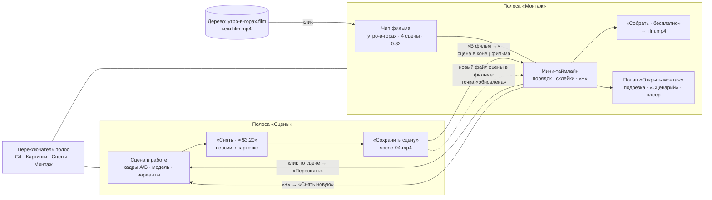

# Редактор видео v6: два режима — «Сцены» и «Монтаж»

Макеты — два файла, между ними переходят кликом:

- [video-editor-v6-scenes.html](video-editor-v6-scenes.html) — режим «Сцены»;
- [video-editor-v6-montage.html](video-editor-v6-montage.html) — режим «Монтаж».

Оба открываются без сети. В шапке каждого есть переключатель «Режим: Сцены | Монтаж», тема (светлая или
тёмная), ширина (1360 или 390) и «Сразу к». Переходы между макетами — обычные ссылки с параметрами
состояния, тема и ширина переезжают вместе с ними. Сценарий открывается и адресом, например
`video-editor-v6-montage.html?jump=5б&theme=dark&w=390`. Код продукта не менялся. Прошлая версия —
[video-editor-v5.html](video-editor-v5.html) с [video-editor-v5-proposal.md](video-editor-v5-proposal.md).

## Главное

Как снимать сцены, в v5 было понятно. Непонятно было другое: как включается сборка фильма и где искать
фильм, когда его карточка уехала в ленте далеко вверх. В v6 работа разведена на **два режима с отдельными
полосами над композером**.

Решения Андрея от 2026-09-30:

1. **Два режима — две полосы.** В переключателе полос (там же, где «Git · Картинки») вместо одной
   «Видео» теперь **«Сцены»** и **«Монтаж»**, у каждой свои контролы.
2. **Основная работа монтажа — в полосе, тонкая — в попапе.** Порядок, склейки, музыка и «Собрать»
   живут прямо в полосе, чат при этом виден. Подрезка, «Сценарий» и большой плеер — в попапе
   «Открыть монтаж».

Главный сдвиг v6: **фильм живёт в полосе, а не в ленте.** Карточки фильма в ленте больше нет. Открыл
«Монтаж» — фильм перед глазами, сколько бы сообщений ни прошло. В ленте остаётся только история тихими
строками.

## Было в v5 → стало в v6

| Было в v5 | Стало в v6 |
|---|---|
| Одна полоса «Видео»: съёмка сцены и фильм вперемешку | Две полосы: **«Сцены»** (съёмка одной сцены) и **«Монтаж»** (сборка фильма) |
| Чип «Сцена 2 · утро-в-горах ▾»: в меню сцены фильма, «Собрать фильм», «Показать карточку фильма» | Чип «Сцена 2 · в фильме утро-в-горах ▾» или «Сцена 4 · не в фильме ▾». В меню только сцены папки, «Новая сцена», «Показать папку в дереве». Всё про фильм ушло в «Монтаж» |
| Сцена принадлежала фильму с момента создания | Сцена принадлежит **папке сцен**, в фильм её ставят явно кнопкой **«В фильм →»**. Одна сцена может стоять в нескольких фильмах |
| Карточка фильма в ленте: плитки сцен, «Собрать фильм», «Пересобрать» | Карточки фильма нет. Фильм — в полосе «Монтаж», в ленте — тихие строки |
| «Собрать фильм» открывал попап «Монтаж», собирали там | «Собрать · бесплатно» — прямо в полосе, с прогрессом. Потом «✓ film.mp4 · Открыть · Показать в дереве», после правок — «Пересобрать» |
| Порядок, склейки и музыка — только в попапе | Порядок (перетаскивание), склейки (клик по стыку) и музыка (чип) — в полосе. В попапе остались подрезка, «Сценарий» и большой плеер |
| Готовый mp4 — через «Добавить сцену ▾» в карточке фильма | «+» в конце мини-таймлайна: «Сцена из проекта…», «Готовый mp4…», «Снять новую →» |
| Пересъёмка помечала карточку фильма «Сцена 2 обновлена — пересобрать» | У сцены в мини-таймлайне **точка «обновлена»**, film.mp4 зачёркнут, справа «Пересобрать». В меню сцены — «Другая версия файла», можно вернуть прежний |
| Собранный фильм — `утро-в-горах.mp4` | Собранный фильм — `film.mp4` в папке фильма, пересборка — `film.v2.mp4` |
| `.film` в дереве — просто файл (открытый вопрос 1 v5) | `.film` — **и есть фильм**. Клик по нему или по `film.mp4` в дереве открывает чат с полосой «Монтаж» |
| Агент писал сценарий в карточку фильма и сохранял сцены | Агент пишет тексты в карточки сцен. Каждую готовую сцену сам сохраняет и ставит в фильм, но **полосу человеку не переключает** |
| Счётчик «Потрачено» — на фильм | Счётчик в полосе «Сцены» — на папку сцен. Сборка бесплатна, поэтому в «Монтаже» денег нет |

## Схема режимов



Правила переходов:

- **«В фильм →»** (человек) ставит сохранённую сцену в конец фильма и переключает полосу на «Монтаж».
  Новая сцена в мини-таймлайне обведена акцентом. Главная кнопка ставит в последний фильм, «▾» открывает
  выбор фильма и «Новый фильм».
- **«Переснять»** в меню сцены «Монтажа» переключает полосу на «Сцены», и эта сцена оказывается в работе.
  Там же «Сохранить сцену». Потом кнопкой «Открыть «Монтаж» →» из карточки сцены — назад. Фильм сам берёт
  новый файл сцены и ставит у неё точку «обновлена».
- **«+» → «Снять новую»** переключает на «Сцены» с новой сценой: кадр A — это кадр B последней сцены
  фильма, кадр B пустой.
- **Агент** правит фильм, но полосу не переключает: человек может быть занят другим.
- **Полоса помнит последний режим на чат**, как полоса «Картинки». Клик по `.film` в дереве перебивает
  запомненный режим и открывает «Монтаж» с этим фильмом.

## Фильм в дереве файлов

Фильм — файл проекта. Так выглядит `video/` после сценариев макета:

```
video/
  клипы/
    водопад.mp4                  — готовое видео, можно поставить в любой фильм
  утро-в-горах/                  — папка сцен и фильма
    кадры/
      кадр-1.png … кадр-5.png
    scene-01.mp4 … scene-04.mp4  — сохранённые сцены
    scene-02.v2.mp4              — пересъёмка сцены 2, прежний файл не тронут
    утро-в-горах.film            — ФИЛЬМ: порядок, склейки, подрезка, музыка
    film.mp4                     — собранный фильм
    film.v2.mp4                  — пересборка
  осень/
    scene-01.mp4, scene-02.mp4
    осень.film
    film.mp4
  новый-фильм/
    новый-фильм.film             — фильм без своих сцен: ссылается на файлы других папок
```

`.film` — маленький JSON. Фильм ссылается на **файлы**, а не на сцены, поэтому сцена из одной папки
спокойно встаёт в фильм из другой:

```json
{
  "items": [
    { "file": "video/утро-в-горах/scene-03.mp4", "trim": 8 },
    { "file": "video/утро-в-горах/scene-02.v2.mp4", "trim": 7.5 },
    { "file": "video/клипы/водопад.mp4", "trim": 6 }
  ],
  "cuts": [ { "type": "fade", "sec": 1 }, { "type": "cut" } ],
  "music": { "file": "music/утро.mp3", "volume": 60, "fadeOut": 4 }
}
```

- Клик по `.film` или `film.mp4` в дереве открывает чат с полосой «Монтаж» и этим фильмом. В макете
  «Монтаж» у `.film` текущего фильма стоит метка «в полосе». Из макета «Сцены» клик ведёт в соседний
  макет.
- Перезаписи нет нигде: пересборка — `film.v2.mp4`, пересъёмка — `scene-02.v2.mp4`.
- Фильм сохраняется сам на каждое изменение, кнопки «Сохранить фильм» нет. Агент на «сохрани фильм»
  так и отвечает.

## Полоса «Сцены»

Геометрия прежняя: 51 px, как `ProjectGitBar`.

| Элемент | Что делает |
|---|---|
| «Сцены ▾» | Переключатель полос: Git · Картинки · Сцены · **Монтаж** (с подписью «утро-в-горах · 3 сцены · 0:24») · «Свернуть полосу в строку» |
| Чип «🎬 Сцена 2 · в фильме утро-в-горах ▾ ✕» | С чем работаем и в каком фильме стоит сцена. Меню — сцены папки со статусом и отметкой фильма, «Новая сцена», «Показать папку в дереве» |
| Кадры A → B, модель, длительность, «− 2 +» | Как в v5 |
| «Потрачено: $13.00 ▾» | Траты на сцены папки, по пунктам |
| «Снять · ≈ $3.20» / «Переснять · ≈ $3.20» | Как в v5 |
| **↻ + «В фильм → ▾»** | У сохранённой сцены, которой ещё нет в фильме. «В фильм →» — главная кнопка, пересъёмка уходит в иконку ↻ с ценой в подсказке |

Ширина: с «В фильм → ▾» полоса не влезала в 950 px (1030 px). Поэтому в этом состоянии пересъёмка
сжимается до иконки ↻, а счётчик теряет подпись «Потрачено:» и показывает только сумму. Получается ровно
948 из 948 px.

**Карточка сцены** — как в v5, плюс:

- в шапке бейдж «в фильме утро-в-горах»;
- рядом с «Следующая сцена →» — «В фильм → ▾», пока сцены нет в фильме;
- у сцены в фильме — строка «В фильме «утро-в-горах» · место 2 · Открыть «Монтаж» →». После повторного
  сохранения: «…фильм возьмёт scene-02.v2.mp4, у сцены точка «обновлена» — пересобрать».

Свёрнутые карточки показывают «в фильме утро-в-горах, место 3». Если сцена сохранена, но ещё не в фильме,
вместо «Работать с этой» стоит «В фильм →».

## Полоса «Монтаж»

Две строки, около 106 px. Первая — управление фильмом, вторая — мини-таймлайн.

| Элемент | Что делает |
|---|---|
| «Монтаж ▾» | Переключатель полос. «Сцены» ведёт в соседний режим |
| Чип «🎞 утро-в-горах · 4 сцены · 0:32 ▾» | Меню: все фильмы проекта (с отметкой «собран» и путём `.film`), «Новый фильм», «Показать в дереве» |
| Чип «♪ утро.mp3 · 60 % ▾» / «♪ Без музыки ▾» | Поповер: файл, «Без музыки», громкость (ползунок), затухание в конце (нет / 2 с / 4 с), «Подобрать с Claude…». У музыки, которую поставил агент, — «✦» |
| «✂ Открыть монтаж» | Попап на весь экран |
| «Собрать · бесплатно» | Сборка прямо в полосе: кнопка превращается в прогресс «Собираем film.mp4… 40 %» |
| «✓ film.mp4 · Открыть · Показать в дереве» | После сборки. «Открыть» — попап с плеером |
| ~~film.mp4~~ «Пересобрать · бесплатно» | После любых правок. Причины — в строке таймлайна: «Изменено после сборки: склейка 2 → 3 · музыка» |

**Мини-таймлайн** (вторая строка):

- Миниатюры сцен по порядку: номер места, «Сц. 3 · 8 с». **Ширина одинаковая, 84 px.** Почему не по
  длительности: сцены длятся 5–10 с, и разница в ширине почти ничего не говорит. Зато короткий готовый
  mp4 на 2 с превратился бы в полоску, в которую не попасть мышью, а тем более пальцем. Одинаковые
  миниатюры — это одинаковые цели для перетаскивания и клика, и число сцен, помещающихся в полосу,
  предсказуемо (до 8 на 950 px). Точное время — подпись на миниатюре и таймлайн в попапе: там ширина
  клипа по длительности, потому что там подрезают.
- **Перетаскивание** меняет порядок: акцентная черта показывает, куда встанет сцена.
- **Кружок между сценами** — склейка: «|» встык, «≈» наплыв, «■» затемнение. Клик открывает выбор из
  трёх склеек и длительность (0,5 / 1 / 2 с) для наплыва и затемнения.
- **Клик по сцене** открывает меню: «Переснять →» (в «Сцены»), «Другая версия файла» (список
  `scene-02.mp4` / `scene-02.v2.mp4`), «Подрезать…» (попап), «Раньше» / «Позже», «Показать в дереве»,
  «Убрать из фильма».
- Метки на миниатюре: **точка «обновлена»** (новый файл сцены, фильм не пересобран), **«✦ Claude»**
  (правку сделал агент), **⚠** (текст изменён — переснять). Только что добавленная сцена обведена.
- **«+»** в конце: «Сцена из проекта…» (сохранённые сцены всех папок, которых нет в фильме), «Готовый
  mp4…», «Снять новую →».
- Справа — подсказка «Перетащите сцену — порядок · клик по стыку — склейка · клик по сцене — меню» или
  причины пересборки.

**Пустой фильм:** «В фильме пока нет сцен · [+ Сцена из проекта] · [Снять новую →]», «Собрать»
неактивна.

**Телефон 390:** полоса сворачивается в строку «Монтаж ▾ · 🎞 утро-в-горах · 4 сцены · [Собрать]». Во
время сборки справа проценты, после — «✓ film.mp4». Тап по строке открывает шторку с чипами фильма и
музыки, мини-таймлайном (прокручивается вбок), «Открыть монтаж» и «Собрать». Перетаскивания на телефоне
нет: порядок — «Раньше / Позже» в меню сцены. Меню сцены, склейки, музыки и «+» открываются шторками с
«К полосе «Монтаж»». После выбора склейки шторка возвращается к полосе, и результат виден сразу. «Сцены»
на телефоне — строка «Сцены ▾ · Сцена 4 · не в фильме · $13.00 · [Снять]», после сохранения —
«[В фильм →]», в шторке — «В фильм ▾».

## Попап «Открыть монтаж»

`Modal` почти во весь экран, на 390 — на весь экран.

- **Шапка:** «Монтаж · утро-в-горах · 4 сцены · 0:31 · утро.mp3», «Монтаж | Сценарий», «Собрать ·
  бесплатно» или «Пересобрать · бесплатно», «Готово».
- **Монтаж:** слева — выбранное (сцена: файл в сборке и выбор версии, текст, подрезка ± 0,5 с,
  «Раньше / Позже / Убрать из фильма», «Переснять в «Сценах» →»; склейка; музыка). В центре — большой
  плеер и таймлайн с шириной клипа по длительности, ручкой подрезки, ромбами склеек и дорожкой музыки.
- **Сценарий:** тексты сцен по порядку фильма, как документ. Правка текста снятой сцены ставит пометку
  «текст изменён — переснять» в «Сценарии», значок ⚠ на миниатюре в полосе и тихую строку в ленте.
- **Закрытие:** тост «Монтаж» закрыт — правки в фильме, история — тихими строками в ленте». Лента
  прокручивается вниз, к новым строкам.

## Агент

**В «Сценах»** на «сделай 3 сцены про утро»:

1. Заводит папку `video/утро/` и фильм «утро», пишет тексты в карточки сцен.
2. Снимает сцену 1 и спрашивает: «Сохраню её, поставлю в фильм «утро» на место 1 и сниму вторую?» —
   «В фильм и снимать вторую · ≈ $3.24» / «Сними все остальные».
3. После каждой сцены — строка «Claude добавил сцену 1 в фильм «утро» · место 1 · 0:08». Полоса остаётся
   «Сценами».
4. В конце: «Все 3 сцены… стоят в фильме «утро» · 0:24…» и кнопка-ссылка «Открыть «Монтаж» →».
5. На «собери фильм» в «Сценах» агент отвечает, что сборка живёт в «Монтаже», и даёт ту же ссылку.

**В «Монтаже»** агент умеет то же, что человек, и видит фильм из полосы (подсказка над полем ввода).
Порядок: «поменяй местами 1 и 3». Склейки: «поставь наплыв между 1 и 2», «затемнение везде». Музыка:
«поставь музыку», «убери музыку». Сцены: «убери 2», «добавь водопад». Сборка: «собери фильм». Сохранение:
«сохрани» — фильм сохраняется сам. Каждая правка видна **меткой «✦ Claude»** на миниатюре, «✦» на стыке
или на чипе музыки, плюс тихой строкой «Claude поменял склейку 1 → 2 на «наплыв 1 с»». Когда элемент
правит человек, метка снимается.

## Тексты интерфейса

### Полоса «Сцены»

| Место | Текст |
|---|---|
| Пустой чат | Режим «Сцены»: сцена — клип между двумя кадрами, готовая сцена ложится в проект файлом. «В фильм →» ставит её в фильм и открывает «Монтаж». · [Сделай 3 сцены про утро] |
| Полоса без сцены | Сцена не выбрана. Выделите 2 картинки в «Файлах» → «Собрать видео» или попросите Claude |
| Чип | Сцена 2 · в фильме утро-в-горах ▾ ✕ / Сцена 4 · не в фильме ▾ ✕ / Сцены: утро-в-горах · сцена не выбрана |
| Пункт «Монтаж» в переключателе | Монтаж · утро-в-горах · 3 сцены · 0:24 · порядок, склейки, музыка, сборка → |
| «В фильм →», подсказка | Поставить сцену 4 в конец фильма «утро-в-горах» и открыть «Монтаж» |
| Меню «▾» | Сцена 4 встанет в конец фильма, полоса переключится на «Монтаж» · утро-в-горах — 3 сцены · 0:24 · встанет на место 4 · осень — … · Новый фильм — из этой сцены · имя поправите в «Монтаже» |
| Карточка сцены в фильме | В фильме «утро-в-горах» · место 2 · [Открыть «Монтаж» →] |
| …после пересъёмки | В фильме «утро-в-горах» · место 2 · фильм возьмёт scene-02.v2.mp4, у сцены точка «обновлена» — пересобрать |
| Агент на «собери» | Сборка, склейки и музыка живут в режиме «Монтаж» — там фильм «…» перед глазами целиком. [Открыть «Монтаж» →] |

### Полоса «Монтаж»

| Место | Текст |
|---|---|
| Нет фильма | Фильм не выбран. Откройте файл .film в дереве или заведите новый · [+ Новый фильм] |
| Пустой фильм | В фильме пока нет сцен · [+ Сцена из проекта] · [Снять новую →] |
| Чип фильма | 🎞 утро-в-горах · 4 сцены · 0:32 ▾ |
| Меню фильма | Фильмы проекта · утро-в-горах — 4 сцены · 0:32 · собран · video/утро-в-горах/утро-в-горах.film · … · Новый фильм — пустой: сцены добавите «+» или кнопкой «В фильм →» в режиме «Сцены» · Показать в дереве |
| Чип музыки | ♪ утро.mp3 · 60 % ▾ / ♪ Без музыки ▾ |
| Поповер музыки | Музыка фильма «утро-в-горах» · утро.mp3 · тишина-леса.mp3 · Без музыки — только звук сцен · Громкость · Затухание в конце: нет / 2 с / 4 с · Подобрать с Claude… |
| Поповер склейки | Склейка 2 → 3 · сцена 2 → сцена 3 · Встык — резкий переход, без длительности · Наплыв — кадры перетекают друг в друга · Затемнение — через чёрный кадр · Длительность 0,5 с / 1 с / 2 с · Бесплатно, генерация не нужна — меняет только сборку |
| Меню сцены | 2 · Сцена 2 · video/утро-в-горах/scene-02.v2.mp4 · 8 с · ● Обновлена: в фильм идёт scene-02.v2.mp4 — пересоберите · Переснять — полоса переключится на «Сцены» со сценой 2 → · Другая версия файла: scene-02.mp4 (прежняя) / scene-02.v2.mp4 (последняя · в фильме) · Подрезать… · Раньше · Позже · Показать в дереве · Убрать из фильма — файл останется в проекте |
| Меню «+» | Добавить в конец фильма · Сцена из проекта… — сохранённые сцены: N · Готовый mp4… · Снять новую — полоса переключится на «Сцены»: кадр A — кадр B последней сцены → |
| Сборка | Собрать · бесплатно → Собираем film.mp4… 40 % → ✓ film.mp4 · Открыть · Показать в дереве → ~~film.mp4~~ Пересобрать · бесплатно |
| Строка таймлайна | Перетащите сцену — порядок · клик по стыку — склейка · клик по сцене — меню / ⚠ Изменено после сборки: склейка 2 → 3 · музыка |
| Над полем ввода | Claude видит фильм «утро-в-горах» из полосы: порядок, склейки, музыку, сборку — правки видны меткой «✦ Claude» |
| Строка на телефоне | Монтаж ▾ · 🎞 утро-в-горах · 4 сцены · [Собрать] / · изменён · [Пересобрать] / ✓ film.mp4 |
| Закрытие попапа | «Монтаж» закрыт — правки в фильме, история — тихими строками в ленте |

### Тихие строки

| Действие | Строка |
|---|---|
| «В фильм →» | Вы добавили сцену 4 в фильм «утро-в-горах» · место 4 · 0:32 · полоса «Монтаж» → Сцена 4 добавлена в фильм «утро-в-горах» · место 4 · 0:32 |
| Агент ставит сцену | Claude добавил сцену 1 в фильм «утро» · место 1 · 0:08 |
| Порядок | Вы переставили сцену 3 на место 1 / Claude переставил … |
| Склейка | Вы поменяли склейку 2 → 3 на «затемнение 1 с» / Claude поменял склейку 1 → 2 на «наплыв 1 с» |
| Музыка | Вы поставили музыку: music/утро.mp3 · громкость 60 % · затухание 4 с / Вы убрали музыку из фильма |
| Состав | Сцена 3 добавлена в фильм «…» · Готовый файл video/клипы/водопад.mp4 добавлена… · Вы убрали из фильма «…»: сцена 2 — файл … остался в проекте |
| Файл сцены | Сохранено как: …/scene-02.v2.mp4 · фильм «утро-в-горах» возьмёт новый файл — в «Монтаже» у сцены точка «обновлена» · Вы выбрали для сцены 2 файл scene-02.mp4 — прежняя версия |
| Подрезка и текст | Вы подрезали сцену 1: осталось 7,5 с из 8 с · Вы поправили текст сцены 3 в «Сценарии»: «…» — клип снят по прежнему тексту, у сцены «Текст изменён — переснять» |
| Сборка | Фильм собран: video/утро-в-горах/film.mp4 · 4 сцены · 0:32 · бесплатно · Открыть монтаж · Показать в дереве / Claude собрал фильм: … |
| Полоса и фильм | Вы переключили полосу на «Монтаж» · фильм «утро-в-горах» · 4 сцены · 0:32 · Вы открыли из дерева video/осень/осень.film — полоса «Монтаж», фильм «осень» · Вы завели фильм «новый-фильм»: video/новый-фильм/новый-фильм.film |
| Из «Монтажа» в «Сцены» | Вы открыли «Переснять» у сцены 2 в «Монтаже» фильма «утро-в-горах» — полоса «Сцены» · Вы начали из «Монтажа» новую сцену 5: кадр A — кадр B сцены 4… |

## Сценарии макетов

**«Сцены»** (`video-editor-v6-scenes.html`):

1. **Сцена → в фильм** — сцена 4 в работе → «Снять» → «Сохранить сцену» → «В фильм →» (▾ — выбор
   фильма) → переход в «Монтаж», сцена 4 обведена в конце мини-таймлайна.
2. **Агент: 3 сцены** — «Сделай 3 сцены про утро» → «В фильм и снимать вторую» ×2 → «В фильм — сцена 3» →
   «Открыть «Монтаж» →».
3. **5 · Переснять из «Монтажа»** — сюда ведёт «Переснять»: сцена 2 в работе → «Переснять» →
   «Сохранить сцену» → «Открыть «Монтаж» →».
4. **n · Снять новую из «Монтажа»** — сцена 5, кадр B пустой.
5. **8 · Телефон 390.**

**«Монтаж»** (`video-editor-v6-montage.html`):

- **3 · Пустой фильм** — empty-state → «Сцена из проекта».
- **4 · Порядок, склейка, музыка, сборка** — перетащить сцену 3 на место 1 → стык 2 → 3 «Затемнение» →
  музыка → «Собрать» → film.mp4 → «Показать в дереве». Там же агент: «поставь наплыв между 1 и 2».
- **5 · Переснять сцену** → в «Сцены» → **5б · Сцена обновлена** → точка → «Пересобрать» → film.v2.mp4.
- **6 · Открыть монтаж** — подрезка кнопкой и ручкой, «Сценарий», «Готово», тихие строки.
- **7 · Длинная лента** — 80 сообщений, фильм в полосе без прокрутки.
- **8 · Телефон 390.**
- **a · Пришли из «Сцен»** и **c · Агент собрал 3 сцены** — куда ведут переходы из соседнего макета.

**Статикой или условно:** ответы агента заготовлены и распознаются по ключевым словам; плеер показывает
миниатюры сцен вместо видео; состояние между макетами передаётся параметрами адреса, поэтому «Сцены» и
«Монтаж» не делят одно состояние. Переход восстанавливает заготовку: из «Монтажа» с 4 сценами в «Сцены»
и обратно. Цены, модели и «Подобрать с Claude» условные.

## Проверка

Headless Chromium (Playwright): 112 проверок по сценариям 1–8, переходам и дереву — по 56 в светлой и
тёмной теме. Все прошли, ошибок в консоли нет. Проверено:

- «В фильм →» ведёт в «Монтаж» с `jump=added&n=4` и темой, сцена 4 последняя и обведена.
- Агент ставит 3 сцены в фильм, не переключая полосу; в «Монтаже» у всех трёх — «✦ Claude».
- Пустой фильм наполняется через «Сцена из проекта».
- Перетаскивание, затемнение 2 с, музыка, прогресс сборки, «Показать в дереве» подсвечивает film.mp4.
  Наплыв от агента ставит метку «✦» и включает «Пересобрать».
- Цикл «Переснять» → «Сцены» → scene-02.v2.mp4 → назад → точка «обновлена» → film.v2.mp4.
- Подрезка кнопкой и ручкой, правка текста в «Сценарии», значок ⚠ в полосе.
- В длинной ленте полоса на месте после прокрутки, карточки фильма нет.
- На 390 нет горизонтальной прокрутки ни в одном режиме, шторки работают, попап во всю ширину.
- Клики по `.film` в дереве и по пунктам переключателя полос.

Тест проверен мутацией: без точки «обновлена» две проверки краснеют. Полоса «Сцены» — 948 из 948 px во
всех сценариях и после сохранения, полоса «Монтаж» — 948 из 948 px, высота 106 px.

## Открытые вопросы

1. **Высота полосы «Монтаж».** Две строки, около 106 px против 51 у остальных полос: лента теряет
   примерно 55 px. Альтернатива — одна строка с миниатюрами 44×26 (как кадры A/B в «Сценах»): влезет 5–6
   сцен, но попасть по стыку станет труднее. Рекомендую две строки: полоса «Монтаж» — рабочий экран, а не
   строка статуса; плюс её можно свернуть в строку.
2. **Переключать ли полосу на «В фильм →».** Сейчас человек сразу попадает в «Монтаж» (так в постановке).
   Если снимать сцены подряд, переключение каждый раз мешает. Альтернатива — остаться в «Сценах» с тостом
   «Сцена 4 в фильме «утро-в-горах» · Открыть «Монтаж»». Может, переключать только первую сцену за сессию?
3. **Сцена в нескольких фильмах.** Фильм ссылается на файл, поэтому одна сцена может стоять в двух
   фильмах. Чип показывает один («в фильме утро-в-горах»). Нужно «в 2 фильмах ▾» со списком?
4. **Новый файл сцены — в фильм сам.** Фильм берёт последний сохранённый файл и ставит точку «обновлена»,
   вернуть прежний можно в меню сцены. Или фильм держит прежний файл, пока человек явно не выберет новый
   (вопрос 3 из v5)?
5. **Траты.** Счётчик в «Сценах» — на папку сцен. У фильма, собранного из сцен разных папок, общей суммы
   нет. Нужна ли в «Монтаже» строка «на сцены этого фильма потрачено $13.00» в меню чипа?
6. **Имя собранного файла.** `film.mp4` — одинаковое у всех фильмов. В дереве удобно, но скачанные файлы
   путаются. Альтернатива — `утро-в-горах.mp4`, как было в v5.
7. **Новый фильм без своих сцен** (`video/новый-фильм/`) — папка ради одного `.film`. Или класть `.film`
   в папку сцен первой добавленной сцены?
8. **Полоса помнит режим на чат, а клик по `.film` его перебивает.** Если человек открыл фильм из дерева
   в чате, где снимал сцену, сцена в «Сценах» остаётся в работе и ждёт возврата. Ок?
9. **Наплыв укорачивает фильм.** Наплыв в 1 с накладывает клипы, и фильм из 4 сцен по 8 с длится 0:31, а
   не 0:32. Показывать так (честно) или считать длительность по сумме сцен?
10. **Перетаскивание на телефоне.** На 390 порядок меняется только «Раньше / Позже» в меню сцены. Нужно ли
    перетаскивание долгим тапом в шторке?
