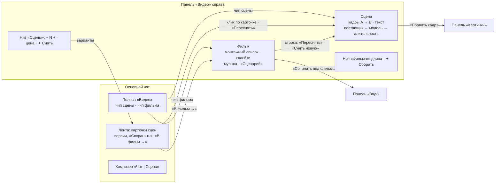

# Видео v7: сцены и фильм в боковой панели

Макет: [video-editor-v7.html](video-editor-v7.html). Открывается без сети. В шапке макета можно выбрать:
- тему: светлая или тёмная;
- ширину: десктоп, узкий 1024, окно 800, телефон 360;
- чат: в проекте или личный;
- состояние: «Сцена 5 к съёмке», «Фильм не собран», «Пустая сцена», «Пустой фильм», «Идёт съёмка», «Очередь
  GPU», «Агент снимает»;
- «Сначала» — сброс.

Под основным кадром — галерея: пустые вкладки, «Развернуть» у текста сцены, «Сценарий», подрезка и склейка
в строке, правки агента, личный чат, полоса в трёх видах, корешок, опущенная шторка. Код продукта не
менялся.

Основа — v6 ([video-editor-v6-proposal.md](video-editor-v6-proposal.md)): состав возможностей, тексты и
сценарии оттуда. Каркас панели общий с «Картинками» v4 и «Звуком» v2 и описан один раз:
[image-editor-v4-panel-proposal.md](image-editor-v4-panel-proposal.md), раздел «Общий каркас панели
генерации». `genPanel()`, токены и стили каркаса в макете — побайтная копия «Картинок» v4 (сверено `diff`).

## Главное

Решения Андрея от 2026-10-01:

1. **Одна полоса «Видео» с двумя чипами** вместо полос «Сцены» и «Монтаж» из v6. Режимы v6 стали
   **вкладками** панели.
2. **Панель «Видео»** на общем каркасе, ключ `video`. Справа одна панель: открыли «Видео» — «Картинки» и
   «Звук» закрылись.

**Фильм не теряется:** он живёт во вкладке «Фильм», а не в ленте. Сколько бы сообщений ни прошло, фильм
открывается одним кликом по чипу. В ленте только тихие строки-история, как в v6.

## Было в v6 → стало в v7

| Было в v6 | Стало в v7 |
|---|---|
| Две полосы «Сцены» и «Монтаж» в переключателе полос | Одна полоса **«Видео»**: чип сцены и чип фильма. В переключателе — Git · Картинки · Звук · Видео |
| Полоса «Сцены» 51 px: кадры A/B, модель, длительность, «− 2 +», «Снять» прямо в полосе | Полоса — **сводка**: «🎬 Сцена 5 · Veo 3.1 · 8 с · 2 вар. · ≈ $3.20 ›». Кадры, текст, модель и запуск — во вкладке «Сцена» |
| Полоса «Монтаж» в две строки, около 106 px, мини-таймлайн из миниатюр 84 px | Чип «🎞 утро-в-горах · 4 сцены · 0:32 ›». Монтаж — **вертикальный список** во вкладке «Фильм». Открытый вопрос 1 из v6 (высота полосы) снят |
| Текст сцены — в композере в режиме «Сцена» и в карточке кликом | Поле **«Текст сцены»** во вкладке: растёт по тексту, «Развернуть» — на всю высоту панели. Композер в режиме «Сцена» несёт только просьбу к съёмке |
| Попап «Открыть монтаж»: подрезка, «Сценарий», большой плеер | **Попапа нет.** Подрезка — в строке сцены, «Сценарий» — «Развернуть» на всю высоту панели, просмотр `film.mp4` — обычный просмотр файла |
| Поповеры склейки, музыки, меню сцены над полосой | То же содержимое прямо в списке: под стыком, в секции «Музыка», под строкой сцены |
| «Подобрать с Claude…» в поповере музыки | **«Сочинить под фильм…»** открывает панель «Звук» с заготовкой (длина фильма, настроение по текстам сцен) |
| «Переснять» в меню миниатюры переключает полосу на «Сцены» | Переключает **вкладку**; панель не закрывается |
| «В фильм →» переключает полосу на «Монтаж» | Переключает вкладку на «Фильм», сцена последней в списке и обведена |
| Счётчик «Потрачено» в полосе «Сцены» — на папку сцен | Счётчик **в строке контекста вкладки «Фильм»**: «$13.00», по клику — расшифровка по сценам |
| Агент полосу не переключает | Агент вкладку не переключает. Его правки в панели помечены «✦ Claude» |
| Телефон: свёрнутые строки полос и шторки на каждый поповер | Телефон: полоса одной строкой «Видео ▾ · Сц. 5 · ≈ $3.20 ⌃ · 🎞 0:32 ⌃», панель — шторка с вкладками, умеет опускаться до цены |

Без изменений из v6: файловая модель (`.film` — это и есть фильм, `film.mp4` / `film.v2.mp4`,
`scene-02.v2.mp4`, перезаписи нет), сцена принадлежит папке и ставится в фильм явно, фильм ссылается на
файлы, фильм сохраняется сам, точка «обновлена» после пересъёмки, тихие строки.

## Полоса «Видео»

Геометрия как у «Картинок» v4: 48 px на десктопе, 42 px на телефоне, свёрнутая строка — 30 px.

| Элемент | Текст | Поведение |
|---|---|---|
| Заголовок-переключатель | «Видео ▾» | Меню полос: Git, Картинки, Звук, **Видео** (подпись — сводка сцены и фильма), «Свернуть полосу в строку» |
| Чип сцены | «🎬 Сцена 5 · Veo 3.1 · 8 с · 2 вар. · ≈ $3.20 ›» / «Новая сцена · …» | Открывает панель на вкладке «Сцена», подсвечен, пока она открыта. ⚠, если снять нельзя (нет кадра, нет текста). Подсказка: «Сцена открыта в панели «Видео» справа» |
| Чип фильма | «🎞 утро-в-горах · 4 сцены · 0:32 ›» | Открывает вкладку «Фильм». Синяя точка — «Фильм изменён после сборки — пересоберите». В личном чате чипа нет |
| Ход работы | «снимаем · 40 %», «GPU: 2-я в очереди», «собираем · 60 %» | Пока идёт съёмка или сборка; то же — в закреплённом низу |
| Свернуть | ˄ | Строка «Видео ▾ · Сцена 5 · … · 🎞 утро-в-горах · 0:32 ˅». Клик по сводке сцены или фильма открывает свою вкладку, по остальной строке — разворачивает полосу |
| Телефон | «Видео ▾ · Сц. 5 · ≈ $3.20 ⌃ · 🎞 0:32 ⌃» | Одна строка, оба чипа открывают шторку на своей вкладке |

## Панель «Видео»

Каркас — общий: шапка «Видео · fal · Veo 3.1» (на «Фильме» — «утро-в-горах · 0:32»), «›» в корешок,
✕ «Закрыть панель — сводка останется в полосе»; вкладки **«Сцена»** и **«Фильм 4»** (счётчик — сцен в
фильме); строка контекста; прокручиваемое тело; закреплённый низ. Ширины, корешок, шторка и опущенная
шторка — как в общем каркасе.

### Вкладка «Сцена»

- **Строка контекста:** «Работаем со: **Сценой 2** · в фильме утро-в-горах ✕» (или «· не в фильме»).
  Без выбора — «Новая сцена · результат ляжет в ленту новой карточкой». ✕ «Снять выбор — новая сцена».
- **Тело**, сверху вниз:
  1. **Кадры A → B** крупно, 16:9, с именем файла. Клик — меню прямо под кадрами: «Править кадр» (→ панель
     «Картинки»), «Нарисовать в «Картинках»», «Отдать Claude · ≈ $0.04», «Кадр B сцены 4» (у кадра A — стык
     без скачка), «Из проекта» (миниатюры картинок проекта), «Убрать кадр». После съёмки замена кадра
     ставит «Кадр изменён после съёмки — переснимите».
  2. **Текст сцены** — растёт по тексту, «Развернуть» даёт редактор на всю высоту тела («‹ Все настройки»,
     счётчик «124 / 2000», кнопки-подсказки «Камера:», «Свет:», «Звук:», «Реплика»). Закреплённый низ
     остаётся. Под полем: «Текст уходит модели вместе с кадрами. Просьба из поля ввода добавится к нему.»
  3. **Поставщик** — fal, Higgsfield, Локальные модели.
  4. **Модель** — «$0.20 за секунду · со звуком»; у локальных — «бесплатно · ~5,5 мин на 5 с · очередь GPU:
     1». Модель, не снимающая в выбранных пропорциях, серая с причиной.
  5. **Длительность** — значения модели («Veo 3.1: 4 / 6 / 8 с»).
  6. **Пропорции** — у первой сцены фильма выбираются, у остальных закреплены: «Как у фильма «утро-в-горах»
     — 16:9. Пропорции задаёт первая сцена, иначе сборка дала бы поля.»
  7. **Звук клипа** — «Со звуком: шум, голоса и реплики из текста». У модели без звука: «Seedance 2.5 снимает
     без звука — музыку поставите во вкладке «Фильм»».
- **Закреплённый низ:** причина («Нужны оба кадра: выберите кадр B выше», «Напишите текст сцены — что
  происходит от кадра A к кадру B»), очередь GPU у локальных, «− 2 +», цена в две строки (**«≈ $3.20»** /
  «2 × $1.60 за 8 с», **«32 кредита»** / «2 × 16 кр за 8 с», **«Бесплатно»** / «~31 мин · очередь GPU: 0»),
  кнопка **«✦ Снять»** или **«✦ Переснять»**. Во время съёмки: «Сцена 5: снимаем 2 варианта · 40 % ·
  Остановить», кнопка «Снимаем…».

### Связь с лентой

- **Клик по карточке сцены** выбирает её во вкладке «Сцена» (на телефоне шторка открывается опущенной,
  лента остаётся доступна). Панель не закрывается.
- **«Переснять»** в карточке делает то же: вкладка «Сцена» с этой сценой, запуск — кнопкой в низу.
- Выбранная сцена в ленте — развёрнутая карточка с акцентной рамкой и бейджем «в панели»; остальные —
  компактные строки.
- В карточке, как в v6: плеер, версии ‹ ›, «Сохранить сцену» / «В проекте», «Следующая сцена →», «В фильм →»
  (пока сцены нет в фильме), строка «В фильме «утро-в-горах» · место 3 · Открыть «Фильм» →». После повторного
  сохранения — «фильм возьмёт scene-03.v2.mp4, у сцены точка «обновлена» — пересоберите».
- Запуск из панели и из композера равноправны: «✦ Снять · ≈ $3.20» в режиме «Сцена» композера берёт текст
  сцены, кадры и настройки из панели, а текст поля ввода добавляет как просьбу.

### Вкладка «Фильм»

- **Строка контекста:** «🎞 Фильм: **утро-в-горах** · `video/утро-в-горах/` ▾ · $13.00 · ✕». Клик по имени
  — меню фильмов проекта (с отметкой «собран» и путём `.film`), «Новый фильм», «Показать в дереве». «$13.00»
  — потрачено на сцены фильма, по клику расшифровка. ✕ — «Закрыть фильм — он сохранён в проекте».
- **Тело:**
  - «СЦЕНЫ · 4 · 0:32» и кнопка **«Сценарий»**.
  - **Монтажный список.** Строка сцены: ⋮⋮ (перетаскивание), миниатюра с номером места, имя файла,
    «Сцена 3 · ✂ 8 с», метки «● обновлена», «✦ Claude», ⚠ (текст или кадр изменён), меню «⋯»: «Переснять» →
    вкладка «Сцена», «Другая версия файла» (`scene-02.mp4` / `scene-02.v2.mp4`), «Подрезать…», «Раньше» /
    «Позже», «Показать в дереве», «Убрать из фильма — файл останется в проекте».
  - **Между строками — склейка**: «| встык», «≈ наплыв 1 с», «■ затемнение 1 с». Клик — выбор прямо под
    стыком: три склейки, длительность 0,5 / 1 / 2 с, «Бесплатно, генерация не нужна — меняет только
    сборку. Наплыв накладывает клипы и укорачивает фильм.»
  - «＋ Сцена из проекта» (сохранённые сцены вне фильма и файлы других папок), «＋ Готовый mp4», «🎬 Снять
    новую» (вкладка «Сцена»: кадр A — кадр B последней сцены).
  - **Музыка:** файл, «Сменить», ✕, громкость ползунком, затухание «нет / 2 с / 4 с». Без музыки — «Без
    музыки · в фильме только звук сцен · Файл из проекта». Ниже **«✦ Сочинить под фильм…»**: «Откроет
    «Звук» с заготовкой: длина 0:32, настроение по текстам сцен. Готовый трек встанет сюда сам.»
  - Подпись: «Фильм сохраняется сам на каждое изменение: `video/утро-в-горах/утро-в-горах.film`».
- **«Сценарий»** — «Развернуть» на всю высоту тела: «‹ Весь фильм», тексты сцен по порядку фильма полями,
  у каждой «Переснять →». Правка снятой сцены ставит «изменён — переснять» здесь, ⚠ в строке списка и тихую
  строку в ленте. Закреплённый низ остаётся.
- **Закреплённый низ:**
  - **«0:32 · бесплатно»** / «4 сцены · 0:32 · сборка без ИИ» и «✦ Собрать»;
  - сборка: «Собираем film.mp4… 40 %» с полосой прогресса и «Отменить»;
  - готово: «✓ film.mp4 · Открыть · Показать в дереве», кнопка «Собрано» неактивна;
  - после изменений: «Изменено после сборки: сцена 3 обновлена · склейка 2 → 3», ~~film.mp4~~ «устарел» и
    **«✦ Пересобрать»** → `film.v2.mp4`, прежний файл остаётся.

### Подрезка — в строке сцены, без попапа

Решение: подрезка открывается **прямо в строке** кликом по длительности («✂ 8 с») или пунктом «Подрезать…».
Строка раскрывается вниз: плёнка из восьми кадров клипа, затемнённые отрезанные края, ручки начала и конца,
«Начало − 0,5 с +», «Конец − 7,5 с +», «Шаг 0,5 с · остаётся 7 с из 8 с · файл сцены не меняется», «Готово».
После подрезки в строке — «✂ 7 с из 8 с».

Почему без попапа:
- Сцены длятся 4–10 с, а подрезают на полсекунды-секунду с краёв. Шаг 0,5 с и плёнка кадров в 300–480 px
  ширины панели это покрывают. Большая шкала нужна для точности до кадра, а её нет и в v6: там тоже были
  кнопки ± 0,5 с.
- Подрезка — одна из правок фильма, как склейка и порядок. В попапе она снова прятала бы фильм, а ради
  этого его и вынесли из ленты в панель.
- Большой плеер нужен для просмотра готового фильма. Это `film.mp4` — файл проекта, его открывает обычный
  просмотр файла («Открыть» в низу). Отдельный попап этого не добавляет.
- На телефоне строка раскрывается так же, кнопки по 24 px: долгого тапа и перетаскивания ручек не нужно.

Если позже понадобится подрезка точнее, чем на 0,5 с, или предпросмотр стыка, это будет кандидат на попап.
Сейчас без него можно.

## Агент

Как в v6: работает по сценам и после каждой спрашивает, снимать ли следующую.

1. На «Сделай 3 сцены про утро» заводит папку и фильм «утро», пишет тексты, ставит кадры.
2. После сцены 1: «Сцена 1 готова: снял 2 варианта, оставил второй… **Снимать вторую?**» — «Снимать вторую ·
   ≈ $3.20» / «Сними все остальные · ≈ $6.40» / «Хватит».
3. Каждую готовую сцену сам сохраняет и ставит в фильм. Тихая строка: «Claude добавил сцену 2 в фильм
   «утро» · место 2 · 0:16».
4. В конце: «Все 3 сцены стоят в фильме «утро» · 0:24. Потрачено $9.60. Собрать фильм?» — «Собери фильм».
5. **Вкладку не переключает**: человек может быть занят другим.

Пометки «✦ Claude» в панели: у поля «Текст сцены» и «Кадры», у «Поставщика», на строке сцены в списке, на
стыке («≈ наплыв 1 с · ✦»), у секции «Музыка», у собранного `film.mp4`. Правка человеком снимает пометку.
Траты видны в строке контекста «Фильма» и растут по мере съёмки. В режиме «Фильм» над полем ввода:
«Claude видит фильм «утро-в-горах» из панели: порядок, склейки, музыку — его правки помечены «✦ Claude»».

## Переходы в соседние панели

- **«Править кадр»** / **«Нарисовать в «Картинках»»** открывают панель «Картинки» (справа одна панель —
  «Видео» закрывается). Строка контекста: «Работаем с: **кадр-6.png · версия 1** · кадр B сцены 5» или
  «Новая картинка · станет кадром B сцены 5». Результат сам становится кадром, панель возвращается на
  «Видео → Сцена». Ссылка «↩ К сцене 5 — панель «Видео»».
- **«Сочинить под фильм…»** открывает «Звук»: «Музыка · Песня», длительность = длине фильма с учётом
  склеек, стиль по текстам сцен, «Инструментал». Строка контекста: «Новый звук · заготовка из «Видео»: под
  фильм «утро-в-горах»». Готовый трек ложится в `music/` и встаёт музыкой фильма с меткой «из «Звука»».
  Ссылка «↩ К фильму «утро-в-горах» — панель «Видео»». Звук под видео — зона раздела «Видео», это записано
  в записке «Звук v2».
- **«Показать в дереве»** открывает «Файлы» с подсвеченным файлом.

В макете обе соседние панели — заглушки перехода на том же `genPanel()`. Их состав — в макетах «Картинки v4»
и «Звук v2».

## Что видео добавляет в общий каркас

Каркас не меняется: шапка, вкладки, строка контекста, тело, низ, виды и ширины — те же. Нужны четыре
уточнения контракта.

1. **Первая вкладка не обязана называться «Настройки».** В v4 сказано: «„Настройки“ всегда первая; вторая —
   библиотека со счётчиком». У видео обе вкладки рабочие, у каждой свой запуск: «Сцена» (✦ Снять) и «Фильм»
   (✦ Собрать). Предлагаем правило: «первая вкладка — то, что запускается кнопкой-сводкой полосы». Имя и
   значок задаёт вертикаль. Счётчик на второй вкладке остаётся: «Фильм 4».
2. **Низ: `count` и `price` необязательны, добавляются `progress` и `result`.**
   `{ reason, queue, count?, maxCount?, price?: [итог, расшифровка], runLabel, onRun, progress?: { label, p,
   onCancel }, result?: { file, actions: [{ label, onClick }] }, stale?: string[] }`.
   У «Фильма» нет «− N +», в цене одна строка длины («0:32 · бесплатно» / «4 сцены · сборка без ИИ»). Во
   время сборки — `progress`, после — `result` («✓ film.mp4 · Открыть · Показать в дереве»). `stale` — список
   причин пересборки над кнопкой («Изменено после сборки: …»). Картинкам и звуку `progress` тоже пригодится:
   сейчас ход генерации живёт только в ленте и полосе.
3. **`REVEAL_PANEL_EVENT` — `target`, `preset`, `returnTo`** в дополнение к `tab` из v4:
   - `target` — что выбрать во вкладке: `revealWorkspacePanel('video', 'scene', { target: sceneId })` по клику
     на карточку, `revealWorkspacePanel('video', 'film', { target: 'video/осень/осень.film' })` по клику на
     `.film` в дереве;
   - `preset` — заготовка для чужой панели: `revealWorkspacePanel('sound', 'settings', { preset: { mode:
     'music', op: 'song', duration: 32, style: '…', bindTo: 'video/утро-в-горах/утро-в-горах.film' } })`;
     `revealWorkspacePanel('images', 'settings', { preset: { thread: 'кадр-6.png', bindTo: { scene, slot:
     'B' } } })`;
   - `returnTo` — `{ key: 'video', tab: 'film' }`: чужая панель рисует ссылку «↩ К фильму…» в строке
     контекста, а после запуска возвращает «Видео».
4. **Метка «✦ Claude» — общий элемент каркаса** (`.by2` в макете): у подписи секции и на элементе списка.
   «Звуку» и «Картинкам» она понадобится, как только агент начнёт править их поля.

Регистрация — как у соседей: `workspace-panel-def`, ключ `video`, пункт рельса «Видео: сцена и фильм».

## Личный чат

- Вкладка «Фильм» **остаётся** — с объяснением, как вкладка «Персонажи» у картинок. «**Фильмы живут в
  проекте.** Фильм — файл `.film` в папке проекта: порядок сцен, склейки, музыка. В личном чате сцены можно
  снимать и скачивать, а собрать их в фильм — в чате проекта.» Строка контекста — «Фильмы — только в
  проекте», низа нет, чипа фильма в полосе нет.
- «Сцена»: кадры — «С компьютера» вместо «Из проекта». «Локальные модели» под замком: «Локальные модели
  работают только в чате проекта — результат ложится в его папку» (local-media есть только в чатах
  проектов; у картинок локальная генерация вне проекта идёт через редактор, у видео такого пути нет).
- В карточке сцены — «Скачать» вместо «Сохранить сцену», «В фильм →» нет.

## Тексты

| Где | Текст |
|---|---|
| Подсказка чипа сцены | «Открыть сцену в панели «Видео»» / «Сцена открыта в панели «Видео» справа» |
| Подсказка чипа фильма | «Открыть фильм в панели «Видео»» / «Фильм открыт в панели «Видео» справа»; точка — «Фильм изменён после сборки — пересоберите» |
| Пункт рельса | «Видео: сцена и фильм» |
| Строка контекста «Сцены» | «Работаем со: **Сценой 2** · в фильме утро-в-горах» / «· не в фильме» / «Новая сцена · результат ляжет в ленту новой карточкой» |
| Строка контекста «Фильма» | «Фильм: **утро-в-горах** · video/утро-в-горах/ ▾ · $13.00» |
| Причины «Снять» | «Нужны оба кадра: выберите кадр A и кадр B выше» · «Напишите текст сцены — что происходит от кадра A к кадру B» · «Локальные модели работают только в чате проекта — результат ложится в его папку» |
| Причина «Собрать» | «Добавьте в фильм хотя бы одну сцену» |
| Пропорции | «Как у фильма «утро-в-горах» — 16:9. Пропорции задаёт первая сцена, иначе сборка дала бы поля.» |
| Склейка | «Бесплатно, генерация не нужна — меняет только сборку. Наплыв накладывает клипы и укорачивает фильм.» |
| Подрезка | «Шаг 0,5 с · остаётся 7 с из 8 с · файл сцены не меняется» |
| «Сочинить под фильм…» | «Откроет «Звук» с заготовкой: длина 0:32, настроение по текстам сцен. Готовый трек встанет сюда сам.» |
| Низ «Фильма» | «0:32 · бесплатно» / «4 сцены · 0:32 · сборка без ИИ» · «Собираем film.mp4… 40 %» · «✓ film.mp4 · Открыть · Показать в дереве» · «Изменено после сборки: …» · «✦ Пересобрать» |
| Спецификация трат | «Деньги списываются, когда клип готов; остановленное не списывается. Сборка фильма бесплатна.» |
| Тихие строки | как в v6, плюс «Трек сочинён: music/утро-в-горах.mp3 · 0:32 · встал музыкой фильма «утро-в-горах»» и «Новая версия кадра B: кадр-6.png · версия 2 — стал кадром B сцены 5 · клип помечен «Кадр изменён — переснять»» |

## Empty-state

| Где | Текст |
|---|---|
| Пустая сцена | «**Сцена — клип от кадра A к кадру B.** Выберите кадры и напишите, что происходит между ними. Цена видна внизу до запуска; варианты лягут в ленту карточкой, лучший сохраните в проект и поставьте в фильм.» Кадры пунктиром: «＋ Кадр A · из проекта, нарисовать или отдать Claude» |
| Пустой фильм | «**В фильме пока нет сцен.** Поставьте сохранённую сцену, готовый mp4 или снимите новую. Из ленты сцену добавляет кнопка «В фильм →» в её карточке.» + три кнопки добавления; «Собрать» неактивна с причиной |
| Фильм не выбран | «**Фильм не выбран.** Откройте файл `.film` в дереве или заведите новый.» · «＋ Новый фильм» · «Фильмы проекта» |
| Личный чат, «Фильм» | «**Фильмы живут в проекте.** …» (выше) |

## Сценарии макета

1. Чип сцены → «Сцена» → «Развернуть» у текста → «✦ Снять» → карточка с двумя вариантами → «Сохранить сцену»
   → «В фильм →» → «Фильм», сцена 5 последней и обведена, в низу «✦ Пересобрать».
2. Клик по карточке сцены 3 → «Сцена» с ней → «✦ Переснять» → «Сохранить сцену» → во «Фильме» у сцены 3
   точка «обновлена» и `scene-03.v2.mp4` → «✦ Пересобрать» → `film.v2.mp4`, точки сняты.
3. «Фильм не собран»: перетащить сцену за ⋮⋮, склейка 2 → 3 «затемнение 2 с», музыка `утро.mp3` → «✦ Собрать» →
   `film.mp4` → «Показать в дереве» (подсвечен в «Файлах»).
4. «Сочинить под фильм…» → панель «Звук» с заготовкой 0:32 → «✦ Сочинить» или «↩ К фильму».
5. Меню кадра B → «Править кадр» → панель «Картинки» → «✦ Изменить» → кадр «B · v2», вернулись к сцене.
6. «›» — корешок; круглая кнопка запуска снимает сцену (на «Фильме» — собирает); значок раздела разворачивает.
7. Телефон 360: полоса одной строкой, шторка с вкладками, «⌄» опускает её до цены без затемнения, «⌃»
   поднимает.
8. «Пустая сцена» и «Пустой фильм» — empty-state обеих вкладок; выбрать кадры и текст — запуск оживает;
   «＋ Сцена из проекта» наполняет фильм.

Плюс «Агент снимает»: «Снимать вторую» → сцена 2 в фильме с «✦ Claude», траты $3.20 → $6.40, вкладка не
переключилась.

**Статикой или условно:** ответы агента заготовлены; плеер показывает кадр вместо видео; съёмка и сборка
идут пару секунд; цены и модели условные; «Открыть» у `film.mp4` — тост вместо просмотрщика; «Картинки» и
«Звук» — заглушки перехода.

## Проверка

Headless Chromium (Playwright): 108 проверок — по 54 в светлой и тёмной теме. Все прошли, ошибок в консоли
нет. Проверены:
- сценарии 1–8 по шагам выше и агент;
- подрезка в строке и «Сценарий»;
- ширины 1024 и 800: панель 340 / 320 px, лента не уже 420 px, полоса без переполнения;
- телефон 360: полоса одной строкой, нет горизонтальной прокрутки, шторка поднимается и опускается;
- личный чат;
- галерея из 12 ячеек.

`genPanel()` и стили каркаса совпадают с `image-editor-v4-panel.html` побайтно (`diff` пустой).

## Открытые вопросы

1. **Первая вкладка — «Сцена», а не «Настройки».** Нарушает формулировку каркаса v4 («Настройки всегда
   первая»). Предлагаю правило «первая — то, что запускает чип полосы» (раздел «Что видео добавляет»). Ок?
2. **Чип фильма в полосе — всегда или только при открытом фильме?** Сейчас виден всегда, если в чате есть
   фильм. В чате, где снимают одну сцену без фильма, он не нужен: тогда чипа нет, а вкладка «Фильм» пустая.
3. **«В фильм →» переключает вкладку на «Фильм»** (вопрос 2 из v6 остаётся). Если снимать сцены подряд,
   переключение мешает. Альтернатива — остаться на «Сцене» и мигнуть счётчиком «Фильм 5».
4. **Траты — в строке контекста «Фильма».** Сумма — по сценам, которые стоят в фильме, или по всем сценам
   папки? Сейчас по всем снятым в чате. У фильма из сцен разных папок (вопрос 5 v6) общая сумма неточна.
5. **Подрезка шагом 0,5 с без попапа.** Хватит ли? Если нужна точность до кадра, вернём попап только для неё.
6. **«Сочинить под фильм…» привязывает трек к фильму сам.** Если человек сочинил 3 варианта, встаёт первый, а
   остальные — в ленте «Звука». Или спрашивать, какой ставить?
7. **Личный чат без локальных моделей видео.** У картинок локальная генерация вне проекта есть (через
   редактор), у видео — нет: local-media только в проектах. Оставить замок или заводить путь как у картинок?
8. **Перетаскивание на телефоне** (вопрос 10 v6) — сейчас только «Раньше / Позже» в меню строки.
9. Вопросы v6 о файлах — 3 (сцена в нескольких фильмах), 4 (новый файл сцены в фильм сам), 6 (`film.mp4` у
   всех фильмов), 7 (папка ради одного `.film`), 9 (наплыв укорачивает фильм — в v7 показываем честно,
   0:31) — остаются в силе: v7 их не трогает.
