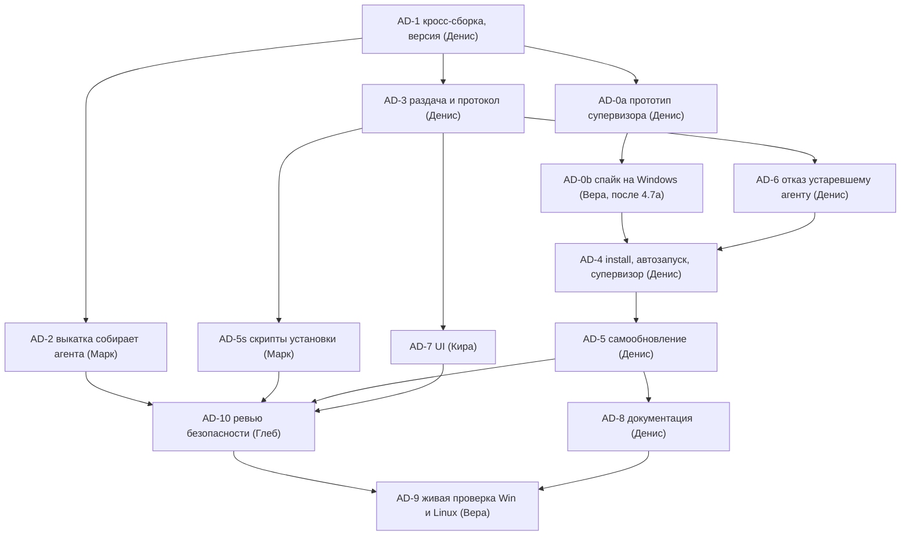

# План: установщик «одной командой» и автообновление агента устройства (ADR-016), 2026-09-26

Задача трекера — `9abd3296`. Основа — проработка Александра в постановке задачи и решения
владельца от 2026-09-26: **версии собирает сам сервер**, установка — **одна команда с кодом
сопряжения**, обновление — **само, между ходами**, платформы — **win-x64 и linux-x64**
(macOS позже). Пути и строки сверены с `master` @ `5507c5a1`. Статус: **план ждёт ревью
владельца**. Задачи заведены в трекере в todo с меткой `agent-distribution`, исполнители не
запускались.

## 1. Опоры в коде (что есть сейчас)

| Опора | Где | Что из этого следует |
|---|---|---|
| Команды агента | `AgentProgram.cs:40–46`: только `pair`, `roots`, `run`; версия — `AssemblyInformationalVersion`, фолбэк `0.0.0` (`:94–96`) | Нужны `install`, `uninstall`, `supervise`, `--version`. Версию задаёт сборка, а не код |
| Условие ConPtyBridge | `DeviceAgent.csproj:39,42` — `'$(OS)' == 'Windows_NT'`; pty-bridge собирается `cc` без `-static` (`:50–53`) | Перевести на целевой RID, тогда win-x64 соберётся на Linux. Для linux-x64 мост собирать статически, как у сервера (`publish-linux.sh`), иначе упрёмся в glibc клиента |
| Образец версионной раскладки | `ManagedCli.cs`: `staging/` → `Directory.Move` (`:273–301`), атомарный `active` через `.tmp` + `File.Move` (`:391–399`), аренды `CliLease` (`:214–226`, `:503`), сборка мусора кроме активной, требуемой и арендованных (`:420`), сверка SHA-256 и размера (`:305–345`) | Общий примитив «версионный каталог» выносится из `ManagedCli` и переиспользуется обновлятором агента (решение Р7) |
| Hello и ack | `DesktopProtocol.cs:237–244` (`DeviceHelloAck`, поля агента аддитивные), `:275–282` (`DeviceHello.AgentVersion`); сервер — `DeviceExecChannel.cs:70–102`, политика версии CLI — `DeviceHarnessPolicy.cs` (точное совпадение, живое чтение конфига) | Поля обновления агента кладутся в ack и hello тем же аддитивным способом. Хеш архива идёт по аутентифицированному каналу устройства |
| Отказы исполнения | `IDeviceExecChannel.cs`: `DeviceExecStatus.CanExec`, `DeviceExecRefusal` (7 причин), `DeviceExecRefusedException` с готовым текстом; `ProjectDeviceGate.cs` → `ProjectCapabilities.BackgroundGate` | Новая причина `AgentOutdated` ложится в эту же схему, без инлайновых `if` |
| Пининг | ADR-016 §1 пишет «HTTPS с пинингом», но в агенте проверки сертификата сервера нет: `HttpClient` в `PairAsync` (`AgentProgram.cs:112`), хаб и канал исполнения (`HubControlConnection.cs`, `AgentCoordinator.cs:193–201`) полагаются на системные CA. «Отпечаток» — это `X-Device-Fingerprint` машины, а не сертификата | Довод «подпись не нужна» остаётся верным (см. Р9), но опирается на TLS с системными CA, а не на пининг. ADR-016 поправить. Пининг — отдельный шаг, в этот план не входит |
| Хранилище токена | `DeviceTokenStores.cs`: Windows — DPAPI, Linux — Secret Service через `secret-tool`, если доступен, иначе файл 0600 | Риск для Linux: сопряжение в терминале кладёт токен в связку ключей сеанса, а `systemd --user` при загрузке с linger её не откроет. Проверяется в AD-9, решение — Р6 |
| Ручки устройств | `DevicesController.cs` (Main): `[Authorize]`, анонимный только `POST pair` (`:109`); отзыв — только с веб-JWT (`:92–98`); код сопряжения привязан к веб-сессии (`:39–50`) | Для `uninstall` нужна ручка самоотзыва под авторизацией устройства. Новый контроллер раздачи живёт рядом, в Main |
| Rate-limit | Политики в `Program.cs:1254–1320` (`auth-login`, `host-token`, `mcp-catalog`) | Новая политика `agent-download` там же |
| Выкатка | `publish-linux.sh`: `rsync -a --delete "$STAGING/" "$PUBLISH_DIR/"` (исключены только Local, `.mcp.json`, `logs/`, `data/`) | Архивы агента внутри `$PUBLISH_DIR` снесутся при провале сборки агента. Поэтому храним их **вне** каталога приложения (Р3) |
| CI | `ci.yml:101–145`: job `DeviceAgent (windows)` собирает агента и тесты с `-warnaserror` | Добавить в Linux-job кросс-публикацию `-r win-x64`: сторож, что условие по RID не регрессирует |
| UI | `DevicesModal.tsx:123,192` — тексты про «AI Home Desktop»; модалка **общая с клиентом рук ADR-008** (флаг `desktop-agent`); `components/DeviceAgentGate.tsx:27` — «Запустите агента» | Тексты про WPF-клиент не выкидываются, а разводятся по флагу `local-projects` |

## 2. Решения плана

**Р1. Версия агента = номер выкатки.** `1.<git rev-list --count HEAD>.0`, в
`InformationalVersion` через `+<sha8>`. Задаётся `-p:Version=… -p:InformationalVersion=…`
при publish, `IncludeSourceRevisionInInformationalVersion=false`. В пути каталога версий —
только `1.N.0`, это строгий semver, как у CLI. Сборка из грязного дерева даёт
`1.N.0-dirty.<yyyyMMddHHmmss>`: иначе два разных бинаря получили бы одну версию, и агент не
увидел бы обновления.

**Р2. Агент идёт ровно на ту версию, которую назвал сервер**, как с CLI
(`DeviceHarnessPolicy`, точное совпадение). Откатили сервер — откатится и агент.
`LatestAgentVersion` — версия текущей выкатки. `MinAgentVersion` — **константа в коде**
(`DeviceAgentCompatibility.MinVersion` в Core), а не настройка: совместимость — свойство
кода, её поднимают вместе с ломающей правкой протокола. Агент версии ниже минимальной
получает отказ хода (AD-6). Агент, версия которого отличается, но не ниже минимальной,
работает и обновляется между ходами.

**Р3. Архивы живут вне каталога приложения.** Каталог релизов —
`DeviceAgent:ReleasesPath` (на проде `/opt/ccs/agent-releases`, в `appsettings.Local.json`),
раскладка `{version}/{archive}` и `{version}/manifest.json`. В каталог приложения едет только
указатель `agent-release.json` (версия, по каждому RID — имя архива, размер, SHA-256).
- Сборка агента упала → скрипт копирует в staging указатель **прошлой** выкатки и пишет
  предупреждение. Сервер выкатывается, раздаёт прошлую версию агента.
- Храним последние 3 версии плюс ту, на которую указывает указатель, — хватает на откат
  сервера.
- `rsync --delete` каталог релизов не видит вообще.
- Каталог не задан или пуст (дев-стенд, docker) → раздача честно отвечает 503 «сервер не
  раздаёт агента», ack не несёт `LatestAgentVersion`, агент не обновляется.

**Р4. Кнопка админа «Собрать версию агента» не нужна.** Сборку делает выкатка. Дев-стенду
раздача не нужна, а для живой проверки Вера кладёт релиз руками тем же скриптом (AD-2
умеет собрать только агента: `AGENT_ONLY=1`).

**Р5. Раздача — в вертикали `Desktop`, отдельной вертикали нет.** Каталог релизов
(`AgentReleaseCatalog`) нужен и ack-у хаба устройств, а хаб — это `Desktop`. Новая вертикаль
дала бы ребро «вертикаль → вертикаль» или лишний шов. Контроллер `AgentDownloadsController`
лежит в Main рядом с `DevicesController`, политика rate-limit — в `Program.cs`. Сторожей
ADR-014 не трогаем: новой сборки нет. Выключенная подсистема `Desktop` → каталог `null` →
контроллер отвечает 503 с причиной (одна из трёх легальных форм).

**Р6. Автозапуск.**
- **Windows — `HKCU\Software\Microsoft\Windows\CurrentVersion\Run`.** Прав администратора не
  требует, запись значения атомарна. Задача планировщика `/sc ONLOGON` для себя обычно
  требует повышения, в 4.7 её ставили из-под админской ssh-сессии. Спайк подтверждает оба
  факта. Цена Run: агент живёт, пока пользователь вошёл в систему. Для рабочей машины это
  нормально, в UI так и пишем.
- **Linux — unit `systemd --user`** (`~/.config/systemd/user/ai-home-agent.service`,
  `Restart=on-failure`). `loginctl enable-linger` по умолчанию **не включаем**: на
  десктопе он не нужен, а на headless-машине включается флагом `install --always-on`. Для
  себя его обычно разрешает polkit, иначе выводим понятную команду. С `--always-on` агент
  хранит токен в файле 0600, а не в Secret Service: при загрузке без входа связка ключей
  закрыта (подтверждает AD-9). Нет `systemd --user` (WSL1, контейнер) → `install` ставит
  файлы, сопрягается и печатает, как запускать руками. Это не ошибка.

**Р7. Перезапуск — режим-супервизор той же сборки.** Альтернативы:
- (а) отдельный лаунчер — ещё один бинарь со своей раздачей и своим обновлением, выигрыша
  нет;
- (б) переименование работающего exe — работает только на Windows, на распакованной папке
  из сотни dll хрупко, отката нет.

Выбираем `ai-home-agent supervise`:
- Автозапуск указывает на `versions/{v}/ai-home-agent supervise`. На Windows запись Run
  переписывается атомарно, на Linux unit смотрит на симлинк `current`, который меняется
  через `rename`.
- Супервизор запускает дочерний `run` из `versions/{active}`. Код выхода **75** значит
  «переключись»: супервизор перечитывает `active` и запускает новую версию. Любой другой код
  — перезапуск с бэкоффом.
- **Откат:** новая версия за 60 с не записала маркер `healthy`, то есть не получила успешный
  ack на hello. Тогда супервизор возвращает прошлую `active` и помечает версию плохой. Её не
  пробуют повторно, пока сервер не назовёт другую версию или не пройдут 24 ч.
- **Сам супервизор обновляется лениво** — при следующем входе или перезагрузке, потому что
  автозапуск уже смотрит на новую версию. Поэтому контракт «супервизор ↔ дочерний» (код 75,
  файл `active`, маркер `healthy`, аргументы) **замораживается** и держится тестом:
  супервизор версии N обязан корректно поднимать дочерний N+k.
- Сборка мусора не трогает активную, предыдущую и ту, из которой запущен супервизор. На
  Windows удаление запущенного каталога и так не пройдёт, провал удаления — не ошибка.

**Р8. Обновление строго между работой.** В агенте появляется реестр активности. В нём
аренды ходов (канал исполнения), терминалов, процессов превью и запросов ретранслятора.
Переключение (выход с кодом 75) происходит, только когда реестр пуст. Новые ходы при этом не
блокируются. Открытый терминал может держать обновление сколько угодно: UI показывает
«обновление ждёт: открыт терминал». Если версия ниже минимальной, ходы и так отказывают
(AD-6), и активность стекает сама.

**Р9. Доставка обновления: хеш — по каналу устройства, архив — анонимной ручкой.** Сервер
кладёт в `DeviceHelloAck` поля `AgentLatestVersion`, `AgentMinVersion`,
`AgentArchiveSha256`, `AgentArchiveSize`, `AgentArchivePath` (относительный путь под
`/agent/`) под RID, который агент объявил в hello. Хаб устройства аутентифицирован токеном
устройства, поэтому хеш приходит из авторизованного канала. Сам архив агент качает той же
анонимной ручкой, что и установщик: вторая, авторизованная ручка скачивания ничего не
добавляет. **Отдельная подпись релизов не нужна**: ключ подписи лежал бы на том же сервере,
который и так исполняет код на устройстве через харнесс (остаточный риск ADR-016).
Целостность держат TLS и SHA-256 из аутентифицированного канала. В ADR-016 это
фиксируется вместе с поправкой про пининг: его в агенте нет. Authenticode и независимый
канал — отдельный шаг.

**Р10. Скрипты установки статичны и шаблоном не являются.** Адрес сервера передаётся
аргументом. Строку собирает UI из `window.location.origin`, поэтому серверу не нужно
подставлять `Host` из запроса в анонимный ответ: подделать адрес заголовком нельзя. Скрипты
лежат в `deploy/agent-install/`, в сервер встраиваются ресурсом и с диска по пути из запроса
не читаются.
- Windows: `& ([scriptblock]::Create((irm https://S/agent/install.ps1))) -Server https://S -Code КОД`.
  Scriptblock, а не `| iex`: так передаются параметры, и политику исполнения файлов это не
  задевает.
- Linux: `curl -fsSL https://S/agent/install.sh | sh -s -- --server https://S --code КОД`.

Скрипт тонкий:
1. определяет RID;
2. берёт `/agent/manifest.json`;
3. качает архив во временный файл, сверяет размер и SHA-256;
4. распаковывает в `versions/{v}` каталога данных агента;
5. вызывает `ai-home-agent install --server … --code … [--name …] [--always-on]`.

Вся логика — в `install`.

**Р11. Анонимные ручки.** Их пять: `GET /agent/install.ps1`, `/agent/install.sh`,
`/agent/manifest.json`, `/agent/{version}/{rid}/{file}`, плюс `HEAD` на те же пути.
- Явный `[AllowAnonymous]` с комментарием-обоснованием и `[EnableRateLimiting("agent-download")]`
  по IP.
- `rid` — из белого списка `{win-x64, linux-x64}`. `version` должна совпасть с одной из
  версий каталога, `file` — с именем архива в её манифесте.
- Путь к диску строится **только** из данных манифеста, строки запроса лишь сравниваются.
  `SafePath` с данными запроса не нужен: они до пути не доходят.
- `/agent/manifest.json` отдаёт указатель текущей выкатки, не каталог.

**Р12. `uninstall`.**
- Снимает автозапуск и гасит супервизор.
- Отзывает устройство новой ручкой `DELETE /api/devices/self` под авторизацией устройства
  (токен + отпечаток, как у хаба). Устройство становится надгробием, как при отзыве из веба.
- Стирает токен из хранилища.
- `--purge` удаляет и каталоги данных (копии CLI, журнал, профиль CLI с транскриптами) — с
  предупреждением.

## 3. Задачи

Нумерация `AD-*`. Исполнители — по постановке: Денис — бэкенд и агент, Кира — UI, Марк —
скрипты, Вера — живая проверка. Плюс Глеб на ревью безопасности анонимных ручек и скриптов.
Уровни — по `.claude/delegation-categories.md`.

### AD-1. Кросс-сборка агента под RID и версия выкатки — Денис, medium
- `DeviceAgent.csproj`: условия ConPtyBridge (ссылка и `CopyConPtyBridge`) — по целевому RID
  (`win-*`) или ОС при сборке без RID. `BuildPtyBridge` при publish под `linux-*` собирает
  `-static`, как `publish-linux.sh` у сервера.
- `IncludeSourceRevisionInInformationalVersion=false`. Команда `ai-home-agent --version`.
- Core: `AgentVersion` — разбор и сравнение по Р1, включая `-dirty.*`; константа
  `DeviceAgentCompatibility.MinVersion`.
- `ci.yml`: в Linux-job шаг `dotnet publish … -r win-x64 --self-contained` для агента.

**Готово, когда:**
- на Linux `dotnet publish -r win-x64 --self-contained -p:Version=1.9999.0` даёт
  `ai-home-agent.exe` и `ConPtyBridge.exe` в одном каталоге;
- `-r linux-x64` даёт `pty-bridge`, `file` показывает `statically linked`;
- `ai-home-agent --version` печатает заданную версию;
- тесты `AgentVersion` зелёные и проверены мутацией;
- `dotnet build -warnaserror` агента и тестов зелёный на Linux.

### AD-0a. Спайк: прототип супервизора — Денис, strong (выкидной)
Отдельная ветка `spike/agent-supervisor` поверх AD-1. Минимальный `supervise` по Р7 (код 75,
`active`, маркер `healthy`, откат по таймауту) и запись HKCU Run. Релизы — две фиктивные
версии, отличаются только печатью версии. Код в `master` не идёт, выводы идут в AD-4 и AD-5.

**Готово, когда:** две версии собраны на Linux под win-x64 и лежат архивами в
`/home/an/ccs-reports/agent-dist-spike/`, есть инструкция для Веры в 5–7 шагов.

### AD-0b. Спайк: механика на настоящей Windows — Вера, medium
После завершения 4.7а (`be3dfb63`): та же машина и те же правила безопасности, только
`C:\ccs-test\`, процессы по своим PID. **Адрес уточнить**: в постановке 192.168.7.213, 4.7
шла на 192.168.7.71.

Ответить фактами и логами:
1. собранный на Linux win-x64 запускается, терминал через ConPTY работает;
2. запись HKCU Run поднимает супервизор при входе **без прав администратора** и живёт без
   ssh-сессии; `schtasks /sc ONLOGON` из-под обычного пользователя — отказ или нет;
3. дочерний выходит с кодом 75 → супервизор поднимает новую версию, запись Run переписана;
4. «битая» версия (не пишет `healthy`) → откат на прошлую;
5. удалить каталог версии, из которой работает старый супервизор, нельзя, и это не ломает
   цикл;
6. размер архивов и время сборки.

**Готово, когда:** отчёт `docs/research/agent-distribution-spike-2026-09.md` с вердиктом
«схема Р6/Р7 годится / не годится, почему». Не годится → эскалация Егору и Александру,
AD-4 и AD-5 не стартуют.

### AD-2. Выкатка собирает агента — Марк, medium
`publish-linux.sh`:
- после публикации сервера, **последовательно**, публикует агента под `win-x64` (zip) и
  `linux-x64` (tar.gz, права на исполнение внутри) с версией по Р1;
- кладёт архивы и `manifest.json` в `$AGENT_RELEASES/{version}/` (по умолчанию
  `$(dirname PUBLISH_DIR)/agent-releases`), указатель — в `$STAGING/agent-release.json`;
- любая ошибка сборки агента → предупреждение, указатель прошлой выкатки копируется в
  staging, выкатка сервера продолжается;
- ротация: 3 последние версии плюс текущая;
- `AGENT_ONLY=1` — собрать только релиз агента (для дев-стенда Веры);
- `SKIP_AGENT=1` — не собирать.

**Готово, когда** прогон с `PUBLISH_DIR=/tmp/ccs-ad2/app` (не прод):
- даёт два архива, манифест и указатель, `sha256sum` совпадает с манифестом;
- прогон с намеренно сломанной сборкой агента завершается успешно, в логе предупреждение,
  указатель — прошлый;
- после четырёх прогонов в каталоге релизов 3 версии плюс текущая;
- повторный `rsync` каталога приложения не трогает релизы.

Прод-выкатку не запускать.

### AD-3. Раздача на сервере — Денис, strong
- `Desktop`: `AgentReleaseCatalog` — читает указатель и манифесты из `DeviceAgent:ReleasesPath`,
  валидирует (белый список RID, 64 hex, имена без разделителей пути), кэширует до смены
  mtime указателя.
- Main: `AgentDownloadsController` по Р11, скрипты — встроенным ресурсом из
  `deploy/agent-install/` (на время задачи — заглушки, содержимое пишет AD-5s); политика
  `agent-download` в `Program.cs`.
- Протокол: поля ack по Р9, `DeviceHello.AgentUpdate` — состояние обновления (`idle` /
  `downloading` / `waiting-idle` / `failed` + целевая версия + причина); сохранение в
  `DeviceRegistry` и в DTO устройства.
- `DELETE /api/devices/self` по Р12.

**Готово, когда** тесты (платформонезависимые) подтверждают:
- анонимный GET архива и скриптов — 200;
- `..`, `%2e%2e`, `\`, абсолютный путь, чужой RID, версия не из каталога, имя не из
  манифеста — 404, и до диска запрос не доходит (проверка фейком файловой системы или
  отсутствием вызова);
- нет каталога релизов → 503 с причиной;
- выключенный `Desktop` → 503, а не 500;
- ack несёт поля под RID устройства;
- самоотзыв работает только с токеном своего устройства;
- на контроллере стоят `[AllowAnonymous]` и `[EnableRateLimiting]` — тест по атрибутам;
- мутация: убрать сверку имени с манифестом → тест краснеет;
- `dotnet build -warnaserror`, набор `Desktop` и контроллерные тесты зелёные.

### AD-5s. Скрипты установки — Марк, medium
`deploy/agent-install/install.ps1` (PowerShell 5.1+) и `install.sh` (POSIX sh, `curl` или
`wget`) по Р10. Без админа, всё — в каталог данных агента (Windows —
`%LOCALAPPDATA%\AiHomeAgent\versions`, Linux — `$XDG_DATA_HOME/ai-home-agent/versions`).
Ошибка на любом шаге → понятный текст по-русски и ненулевой код, мусор staging убирается.
Повторный запуск поверх установленного агента не ломает его (переустановка = новое
сопряжение).

**Готово, когда:**
- `shellcheck` и PSScriptAnalyzer чистые;
- прогон против дев-стенда с релизом из `AGENT_ONLY=1` доводит до вызова `install` с
  правильными аргументами (до готовности AD-4 — фиктивный бинарь, печатающий аргументы);
- подмена байта в архиве → отказ по SHA-256.

### AD-6. Отказ хода для устаревшего агента — Денис, medium
- `DeviceExecRefusal.AgentOutdated`; `DeviceExecStatus` учитывает `AgentVersion <
  MinVersion` в `CanExec`; `ProjectCapabilities.BackgroundGate` различает «агент обновляется»
  (обновление идёт) и «обновите агента» (обновления нет или оно упало).
- Тексты для человека — в стиле `DeviceHarnessPolicy.NotReadyPrefix`.
- Ретранслятор чтения отказывает так же.

**Готово, когда:**
- тесты: старый агент → отказ с причиной `AgentOutdated` до открытия канала; агент ровно
  минимальной версии → проходит; фоновые механизмы получают «ждёт устройство», а не ошибку;
- мутация сравнения версий ловится;
- `ProjectCapabilitiesGuardTests` зелёные.

### AD-4. Агент: `install`, `uninstall`, автозапуск, супервизор — Денис, strong
После AD-0b. `IAutostart` — Windows Run и Linux `systemd --user` по Р6, фейк для тестов.
`install` делает:
1. `pair`;
2. выбирает хранилище токена с учётом `--always-on`;
3. создаёт указатель `active`;
4. прописывает автозапуск;
5. запускает супервизор отсоединённо от консоли;
6. ждёт первого успешного hello, но не дольше 30 с.

`supervise` — по Р7, без обновления (запуск, бэкофф падений, код 75, откат по `healthy`).
`uninstall [--purge]` — по Р12. Контракт супервизора заморожен тестом совместимости:
супервизор поднимает «дочерний новой версии» из фикстуры.

**Готово, когда:**
- тесты на фейках: генерация Run и unit, откат, бэкофф, код 75, `uninstall` снимает
  автозапуск и зовёт самоотзыв;
- мутация отката ловится;
- CI-job `DeviceAgent (windows)` и Linux-сборка зелёные с `-warnaserror`.

### AD-5. Самообновление агента — Денис, strong
- Из `ManagedCli` выносится примитив версионного каталога (staging → move, атомарный
  `active`, сборка мусора с исключениями), `ManagedCli` переходит на него **без правки
  своих тестов**.
- `AgentUpdater`: по ack скачивает архив своего RID, сверяет размер и SHA-256, распаковывает
  в `versions/{v}`, ждёт пустого реестра активности (Р8), переключает `active` (на Linux ещё
  симлинк `current`) и автозапуск, выходит с кодом 75.
- Реестр активности: аренды ходов, терминалов, превью, ретранслятора — точки подключения
  Денис находит в композиции агента.
- Состояние обновления уходит в hello (`AgentUpdate`). Версия, помеченная плохой, не
  пробуется повторно по Р7. Сервер назвал версию ниже текущей → откатываемся на неё так же.

**Готово, когда:**
- тесты: активный ход или открытый терминал держат переключение, после их закрытия
  переключение происходит; битый хеш → `failed`, `active` не тронут; откат сервера →
  агент идёт вниз;
- тесты `ManagedCli` зелёные без изменений;
- мутации «переключение без проверки аренды» и «без сверки хеша» ловятся.

### AD-7. UI: подключение одной командой и состояние агента — Кира, medium
Под флагом `local-projects`; без флага модалка остаётся как есть для клиента рук ADR-008.
- «Устройства»: кнопка «Подключить компьютер» → код → две вкладки (`SegmentedControl`)
  «Windows» и «Linux» со строкой по Р10 и кнопкой «Скопировать», таймер кода, ожидание
  появления устройства.
- Строка устройства: версия агента, «обновляется до X» / «обновление ждёт: открыт терминал»
  / «обновление не удалось: …».
- Сервер не раздаёт агента (503 на манифест) → вместо команды объяснение.
- `DeviceAgentGate` в состоянии `unreachable`: подсказка «Поставьте агента: Устройства →
  Подключить компьютер» с переходом.
- Мобильная раскладка.

**Готово, когда:**
- `npx tsc -b` и `npm run lint:design` зелёные;
- скриншоты светлой и тёмной темы, десктопа и 360 px в `.cc-attachments/agent-dist-ui/`;
- дизайн-ревью Майи (или агента `designer`) пройдено до коммита — по правилам проекта его
  предлагают, а не пропускают.

### AD-8. Документация — Денис, medium
- ADR-016: раздел «Раздача и обновление агента» (Р1–Р12), осознанный отказ от подписи и
  поправка про пининг (§1, Р9).
- `docs/architecture/device-agent-local-api.md` или новый
  `docs/architecture/device-agent-distribution.md`: раскладка каталогов, контракт
  супервизора, операции для админа (где лежат релизы, как откатить).
- Одна строка в разделе ADR-016 корневого `CLAUDE.md` не нужна, если хватает ссылки из ADR:
  карту не раздуваем.

**Готово, когда** `ProjectMapHygieneGuardTests` зелёные и мёртвых ссылок нет.

### AD-10. Ревью безопасности — Глеб, strong (read-only)
Дифф веток AD-2…AD-7. Фокус:
- анонимные ручки: обход пути, Host-инъекция, размер ответа, rate-limit;
- скрипты: `iex`, временные файлы, права, обработка ошибок;
- самоотзыв;
- токен не попадает в логи и аргументы процесса;
- автозапуск не пишет в чужие места.

**Готово, когда** находки по severity заведены задачами; critical и high закрыты до AD-9.

### AD-9. Живая проверка Windows и Linux — Вера, medium
Сценарий целиком, с дев-стенда с релизами (`AGENT_ONLY=1`):
1. команда из UI ставит агента без админа;
2. выход и вход (на Linux — перезагрузка) → агент поднялся сам;
3. ход работает;
4. новая версия на стенде → агент обновился **между** ходами: во время хода и при открытом
   терминале не переключается;
5. сервер назвал прошлую версию → агент откатился;
6. битая версия → откат по `healthy`;
7. агент ниже минимальной → понятный отказ хода;
8. `uninstall` снимает автозапуск, устройство отозвано на сервере.

Linux: `systemd --user`, `--always-on` с linger, токен с `--always-on` и без него при
загрузке. **Какую Linux-машину брать — решает владелец** (открытый вопрос 1).

**Готово, когда:** отчёт с «прошло / не прошло / не проверено» по каждому пункту, скриншоты
и логи в `/home/an/ccs-reports/agent-dist/`, дефекты заведены с `kind=defect` и метками
`agent-distribution`, `local-projects`.

## 4. Порядок и параллельность

**Деревья и ветки.** При запуске владелец создаёт worktree и прописывает `worktreePath` в
задачи.
- `feat/agent-distribution` — общий worktree для последовательной цепочки Дениса
  (AD-1 → AD-3 → AD-6 → AD-4 → AD-5 → AD-8) и фронта Киры (AD-7 правит только `frontend/`,
  с `dotnet` не пересекается).
- `feat/agent-distribution-ops` — ответвление после AD-1 для Марка (AD-2, AD-5s): его
  `dotnet publish` пишет в `obj/` и в общем дереве столкнулся бы со сборкой Дениса.
  Сливается в основную ветку перед AD-10.
- `spike/agent-supervisor` — выкидная ветка AD-0a.

**Правило «не больше трёх `dotnet`-сборок».** В каждом дереве `dotnet` идёт строго
последовательно, деревьев с `dotnet` максимум три, так что правило соблюдается по
построению:
- **Волна 1:** AD-1 — одна сборка.
- **Волна 2:** AD-3 (основное дерево), AD-0a (дерево спайка), AD-2 (дерево ops) — три.
  Параллельно, без `dotnet`: AD-7 у Киры (как только контракт DTO из AD-3 закоммичен) и
  AD-5s у Марка (после AD-2, в том же дереве ops).
- **Волна 3:** AD-6 (основное) и AD-0b (сборка на Windows, хосту не в счёт) — одна
  хостовая сборка.
- **Волна 4:** AD-4 → AD-5 → AD-8 последовательно; Кира доделывает AD-7.
- **Волна 5:** AD-10 (только чтение) → AD-9.

Критический путь: AD-1 → AD-0a → AD-0b → AD-4 → AD-5 → AD-10 → AD-9. Самое узкое место —
AD-0b: он ждёт 4.7а и машину владельца.

## 5. Риски и открытые вопросы

1. **Linux-машина для AD-9** не определена: прод-хост под отдельным пользователем, ВМ или
   машина владельца. Решает владелец до запуска AD-9.
2. **Адрес Windows-машины** — .213 из постановки или .71 из 4.7. Уточнить до AD-0b.
3. **Корни проектов.** Команда установки корень не добавляет: корни правит только человек на
   машине (`roots add`). Нужен ли в UI создания локального проекта готовый
   `ai-home-agent roots add <путь>` для копирования — вопрос к владельцу. В этот план не
   входит.
4. **Размер архивов** — self-contained без тримминга, ориентир 70–100 МБ на RID. Тримминг не
   делаем: композиция подсистем опирается на рефлексию. Спайк даст факт.
5. **Пининг из ADR-016 фактически отсутствует** (§1). План его не вводит: при нашем доводе
   (Р9) он защищает канал, а не раздачу. Но расхождение ADR с кодом фиксируется в AD-8, и
   решение «вводить ли пининг» — отдельная задача Александра.
6. **Windows Run живёт только при вошедшем пользователе.** Если владельцу нужен агент на
   Windows без входа — это служба и админ, отдельный шаг.
7. **Грязные сборки на проде** дают `-dirty` версии. Точное совпадение версий (Р2) делает
   их безопасными, но каждая такая выкатка — обновление у всех устройств.

## 6. Задачи в трекере

Метка у всех — `agent-distribution` (плюс `local-projects`, `adr-016`), статус todo,
исполнители не запущены.

| № | Задача | Исполнитель | id |
|---|---|---|---|
| AD-1 | Кросс-сборка агента под RID и версия выкатки | Денис | `7dbe0090` |
| AD-0a | Спайк: прототип супервизора | Денис | `f3cea2c4` |
| AD-0b | Спайк: механика на настоящей Windows | Вера | `ad9074fa` |
| AD-2 | Выкатка собирает агента | Марк | `32be286d` |
| AD-3 | Раздача на сервере и протокол обновления | Денис | `765dee37` |
| AD-5s | Скрипты установки | Марк | `ee770180` |
| AD-6 | Отказ хода для устаревшего агента | Денис | `2758b81d` |
| AD-4 | install, uninstall, автозапуск, супервизор | Денис | `04deaff0` |
| AD-5 | Самообновление агента | Денис | `aa88c82b` |
| AD-7 | UI: подключение одной командой | Кира | `c33700cd` |
| AD-8 | Документация | Денис | `0f4facd4` |
| AD-10 | Ревью безопасности | Глеб | `c9fb89e6` |
| AD-9 | Живая проверка Windows и Linux | Вера | `293765ac` |
