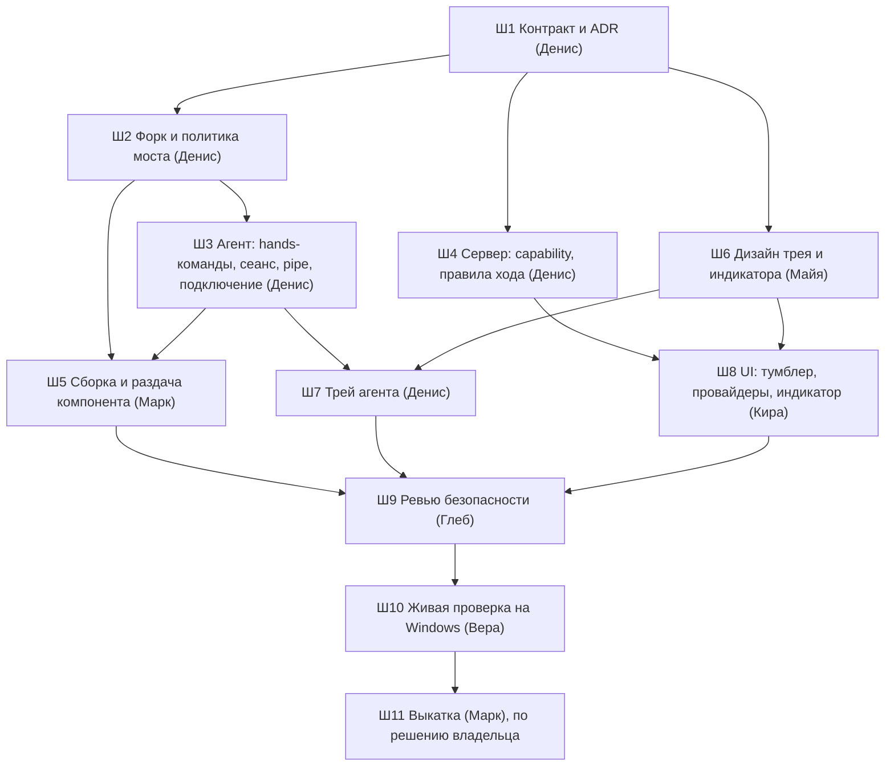

# План: руки для локальных проектов на Windows (2026-09-26)

**Что строим.** Ход локального проекта (ADR-016) на Windows-устройстве получает «руки»:
запускает разрешённую программу, кликает, вводит текст и снимает окно. Работает это через
наш форк [sbroenne/mcp-windows](https://github.com/sbroenne/mcp-windows) — `backend/HandsBridge`.
Граница проходит по дереву процессов хода. Руки действуют только внутри сеанса, который
человек включил на устройстве. Индикатор и стоп-кран живут в трее агента.

**Откуда факты.** Спайки 1 и 2: `docs/research/local-hands-spike-2026-09.md` в ветке
`spike/hands-mcp` (разделы 2, 3, 4, 6). Прототип подключения локального MCP к ходу —
`1f572a3b`, срез sbroenne 1.3.24 — `1236f0dd`. Решение архитектора (Александр) лежит в задаче
трекера «План: руки для локальных проектов…» и здесь не пересказывается, план его реализует.

**Проверено при подготовке плана.**
- **Кросс-сборка есть.** `dotnet publish backend/HandsBridge -r win-x64 --self-contained
  -p:PublishSingleFile=true` из `1236f0dd` на Linux прошла. На выходе `HandsBridge.exe`,
  59 791 266 байт, PE32+ x86-64, рядом `HandsBridge.LICENSE.txt`. Windows-раннер в CI не нужен.
- **Не проверено:** запуск этого exe на Windows. WinRT-OCR в `ui_read` и UIA собраны
  кросс-сборкой. Проверяет Марк в шаге 5 на стенде `192.168.7.213`.

## Сквозные решения плана

1. **Руки — свойство чата, а не хода.** Правило Bash и подключение MCP рук входят в сигнатуру
   запуска CLI (`BuildLaunchSignature`). Если сделать признак на уровне хода, каждое
   переключение перезапускает CLI со всеми MCP. Поэтому признак `HandsEnabled` живёт в
   `LlmSessionContext`, как `BrowserEnabled`. Включение или выключение рук у начатого чата
   означает осознанный перезапуск, как смена провайдера. Предложил Денис.
2. **Shell в ходе с руками выключен целиком, allow-list не делаем.** Запрещаем
   `Bash, PowerShell, Monitor, BashOutput, KillShell` через `_disallowedTools` в
   `ClaudeSession`, рядом с `BrowserEnabled`/`TaskExecution`. Запрет ставится **в том же
   месте и по тому же условию**, что подключение MCP рук, поэтому разойтись они не могут.
   Allow-list отвергнут: `git -c core.sshCommand=/core.pager`, хуки и алиасы с `!`,
   MSBuild-таргеты `dotnet build` исполняют произвольный код, а префиксные правила
   исторически обходились через `$()`/`;`. Ложное чувство защиты хуже честного запрета.
   Дополнительно в ходе с руками:
   - deny на `Edit`/`Write` в `.claude/**`: хуки из `settings*.json` проекта исполнятся при
     следующем запуске CLI на устройстве;
   - внешние stdio-MCP владельца не едут, это ещё один канал запуска кода;
   - `Task` закрыт, пока не доказано, что сабагент наследует `--disallowedTools`.
3. **Два замка на Bash.** Сервер ставит запрет. Агент на устройстве отклоняет ход
   `ExecRefusedException`, если в spawn есть MCP рук, а в `--disallowedTools` нет полного
   набора. Руки при этом молча не отцепляются, иначе регрессия станет невидимой. Это защита от
   нашей же ошибки, не от злонамеренного сервера. От злонамеренного сервера защищают решения
   человека на машине: белый список программ и сеанс.
4. **Руки подключает только агент.** Сервер ставит в конфиг MCP хода маркер «руки
   запрошены» (плейсхолдер по образцу `DeviceExecPlaceholders`), команд и путей сервер не
   шлёт. Агент подставляет узел `hands` → свой `HandsBridge.exe`. Подставляет только если
   компонент установлен и его SHA-256 сверен, сеанс рук на устройстве активен, а запрет shell
   полный. `RemoteProcessRunner.SanitizeMcpConfig` по-прежнему выбрасывает любые stdio-узлы
   сервера. Сторонних локальных MCP (`local-mcp.json` из спайка) в этой версии нет: руки —
   один встроенный узел.
5. **Своё окно определяет вложенный Job Object.** Мост запускает программы через `app` в
   собственный вложенный Job. hwnd считается своим, если процесс окна состоит в этом Job
   (`IsProcessInJob`), либо окно — владеемый диалог своего окна. Идея предварительная, Денис
   подтверждает или заменяет её в шаге 2. Требования: `UseShellExecute=false` (иначе рвётся
   связь с родителем), точный путь из белого списка, поиска окна по заголовку нет.
6. **Конец сеанса гасит ход.** Истечение сеанса, «Стоп» в трее и выключение рук в трее
   гасят дерево хода через `KillTree` (Job Object, по спайку 63 мс). Окна, запущенные ходом,
   закрываются вместе с ним — так и задумано, в индикаторе это сказано человеку.
7. **Модели без зрения.** Если у провайдера чата `SupportsImages=false`,
   `screenshot_control` в набор инструментов моста не попадает. Набор зависит от провайдера
   сессии, а не от хода, поэтому инвариант `tools/list` не нарушается.
8. **Dark launch.** Флаг `local-hands` (`FeatureFlagCatalog`, `Default: false`). Без флага
   тумблер рук в UI не виден, и сервер не выставляет `HandsEnabled`.

## Шаги

Ниже Ш — шаг, `dotnet` — занимает ли шаг слот сборки (не больше трёх одновременно). У каждого
исполнителя своё рабочее дерево от `origin/master`, коммиты локально в своей ветке. Мерж в
`master` делается по просьбе владельца.

Волны и занятость слотов `dotnet`:

| Волна | Шаги | Слоты `dotnet` |
|---|---|---|
| 0 | Ш1 | 1 (сборка контрактных типов) |
| 1 | Ш2, Ш4, Ш6 | 2 (Ш6 без сборки) |
| 2 | Ш3, Ш5, Ш8 | 2–3 (Ш8 — фронт, `dotnet` не занимает; Ш5 стартует после Ш3) |
| 3 | Ш7, доделки Ш8 | 1 |
| 4 | Ш9 → правки по ревью → Ш10 → Ш11 | ≤ 2 |

### Ш1. Контракт, ADR и модель угроз — Денис

Правок логики нет. Шаг закрепляет то, от чего параллельно отталкиваются все остальные.

- В ADR-016 появляется раздел «Руки»: форк вместо прокси, граница по дереву процессов хода,
  сеанс и трей, раздача отдельным компонентом, отвергнутые варианты (stdio-прокси,
  Windows-MCP CursorTouch, allow-list Bash, отдельный рабочий стол Windows — последний
  отложен до спайка совместимости).
- В `docs/architecture/device-agent-local-api.md` появляется раздел «Руки», модель угроз:
  - что видит провайдер;
  - каналы обхода: Bash, `app` как исполнитель команд, `Win+R`/«Пуск»/адресная строка
    Проводника, диалоги «Открыть» внутри разрешённой программы;
  - остаточные риски: гонка «проверка переднего плана → `SendInput`», физический клик-фолбэк
    при перекрытии окна, фокус человека;
  - что закрыто каким замком.
- Контракт в коде (типы и константы, без поведения):
  - `DeviceCapabilities.Hands` (агент объявляет, когда компонент установлен);
  - ключ `ProjectFeatures.Hands` и место в матрице `ProjectCapabilities` с текстами отказов;
  - маркер «руки запрошены» в `DeviceExecPlaceholders`;
  - формат сообщений pipe «агент ↔ трей»: статус, сеанс start/stop, «руки активны в чате X»,
    стоп хода;
  - формат файлов машины: `hands-apps.json`, состояние сеанса.

**Готово, когда:**
- в ADR-016 и `device-agent-local-api.md` есть разделы «Руки», каждый остаточный риск
  назван, у каждого канала обхода указан замок;
- контрактные типы собираются, `dotnet build backend/ClaudeHomeServer.slnx` зелёный;
- `ProjectMapHygieneGuardTests` зелёный: корневой `CLAUDE.md` меняется только выжимкой со
  ссылкой, если меняется вообще.

### Ш2. Форк HandsBridge и слой политики — Денис

- Перенести срез из `1236f0dd` в `backend/HandsBridge`. Добавить `SOURCE.md`: upstream,
  версия 1.3.24, sha коммита upstream, список удалённых классов, порядок синхронизации по
  diff. Сохранить `LICENSE` MIT.
- Один класс-гейт `HandsPolicy` вызывается перед каждым инструментом. Правки upstream-файлов
  сводятся к вызову гейта и удалению опасных веток.
  - `app`: только путь из `hands-apps.json` машины, точное совпадение нормализованного пути.
    Интерпретаторы запрещены жёстко, даже если человек их внёс: `cmd`, `powershell`, `pwsh`,
    `wscript`, `cscript`, `mshta`, `rundll32`, `regsvr32`, `python*`, `node`, `explorer`.
    `UseShellExecute=false`, запуск во вложенный Job моста. Ветки «поиск окна по заголовку»
    нет.
  - Допустимые hwnd — окна процессов своего Job плюс их владеемые диалоги.
  - Все `ui_*` и изменяющие `window_management` без своего hwnd получают отказ. `ui_snapshot`
    без hwnd — тоже отказ.
  - `screenshot_control` разрешён только с `target='window'` и своим hwnd. Цели
    `primary_screen`, `all_monitors`, `monitor`, `region` получают отказ.
  - `window_management list/find` возвращают только свои окна. `close` работает только для
    своих окон.
  - Ввод без системных сочетаний: `Win`, `Alt+Tab`, `Ctrl+Esc`, `Ctrl+Alt+…`. Инструменты
    `keyboard_control`, `mouse_control`, `process`, `clipboard`, `file_*`, `ui_batch`,
    `ui_macro` удалены из сборки, а не выключены флагом.
  - Отказ возвращается понятным модели текстом: что можно сделать вместо.
- **Логика политики живёт в отдельном `net10.0`-проекте без WinAPI**
  (`HandsBridge.Policy`), тесты к нему — в `ClaudeHomeServer.DeviceAgent.Tests` или в своём
  тестовом проекте. Причина: CI на `ubuntu-latest` тесты `net10.0-windows` не гоняет.
  WinAPI-часть (Job, `IsProcessInJob`, владелец окна) идёт за интерфейсом, в тестах —
  подделка.

**Готово, когда:**
- `dotnet build` решения зелёный на Linux: HandsBridge с `EnableWindowsTargeting`;
- тесты политики зелёные. Покрыты: каждый инструмент × «свой/чужой/нет hwnd», каждая
  запрещённая цель снимка, интерпретатор в белом списке, путь с `..` и регистром, фолбэк по
  заголовку, системные сочетания;
- проверка мутацией: отключённый вызов гейта в `ui_click` делает тест красным;
- `SOURCE.md` описывает процедуру синхронизации с upstream;
- `git diff 1236f0dd -- backend/HandsBridge` за пределами `HandsPolicy` и точек вызова
  обозрим: в отчёте исполнителя есть список правленных upstream-файлов.

### Ш3. Агент: команды рук, сеанс, pipe, подключение к ходу — Денис

Зависит от Ш1 и Ш2 (аргументы запуска моста).

- Команды машины по образцу `roots add`, с сервера недоступны:
  - `ai-home-agent hands enable`: скачать компонент по манифесту, сверить SHA-256, положить
    в `%LOCALAPPDATA%\AiHomeAgent\hands\`;
  - `hands disable`, `hands status`;
  - `hands allow-app <путь>`, `hands deny-app <путь>`, `hands apps`.
- Сеанс рук: `hands session start [--minutes 30]` в CLI и то же из трея, плюс `stop`. Потолок
  и таймаут простоя — константы. С сервера сеанс не стартует никогда: в протоколе
  устройства такой команды нет.
- Подключение к ходу: маркер «руки запрошены» в spawn → узел `hands` на свой exe. Нужны все
  условия решения 4, иначе `ExecRefusedException` с понятной причиной. Условие про неполный
  запрет shell — fail-closed из решения 3.
- Конец сеанса гасит ход `KillTree`, и агент сообщает серверу причину (решение 6).
- Hello: `DeviceCapabilities.Hands`, если компонент установлен и сверен. Сервер
  показывает это в UI.
- Pipe для трея: `NamedPipeServerStream` с ACL «только текущий пользователь», без
  localhost-API.
- Статус «руки активны в ходе X» отправляется серверу для индикатора в чате.

**Готово, когда:**
- `dotnet build` и `dotnet test --filter "FullyQualifiedName~DeviceAgent"` зелёные на Linux;
- тесты покрывают:
  - отказ подключения при каждом невыполненном условии: нет компонента, хеш не сошёлся,
    нет сеанса, неполный запрет shell;
  - истечение сеанса во время хода → `KillTree`;
  - запись и чтение `hands-apps.json`;
  - отсутствие серверной команды старта сеанса (сторож по протоколу);
- мутация: при снятой проверке «неполный запрет shell» тест краснеет;
- ACL pipe проверен тестом под Windows или описан в отчёте как проверяемый Верой в Ш10.
  На Linux ACL не воспроизводится.

### Ш4. Сервер: возможность, тумблер, провайдеры, правила хода — Денис

Зависит от Ш1. Параллельно с Ш2.

- `ProjectCapabilities`: `hands` доступен, если проект локальный, устройство объявило
  `hands`, тумблер проекта включён, флаг `local-hands` включён. Тексты отказов —
  в `ProjectCapabilities`, инлайновых `IsLocal` нет. Сторож G10 не ослаблен.
- `Project.HandsEnabled` по образцу `DesktopAgentEnabled`, REST включения. Список
  провайдеров, которым владелец разрешил руки, хранится per-owner. Пустой список означает,
  что руки выключены: разрешение явное, по умолчанию его нет.
- `LlmSessionContext.HandsEnabled` вычисляет `SessionManager` из матрицы и провайдера чата.
  `ClaudeSession` по нему:
  - дописывает набор решения 2 в `_disallowedTools`;
  - ставит маркер рук в `--mcp-config`;
  - без зрения исключает `screenshot_control` (решение 7).
- Фолбэк хода с руками режется до провайдеров из списка владельца, по образцу
  `TrimChainForDesktop`. Если в цепочке никого не осталось, ход завершается ошибкой с текстом
  «руки разрешены только для …», а не уходит стороннему вендору.
- SignalR-событие статуса рук в чате: «руки активны», «сеанса на устройстве нет», «стоп из
  трея».
- Флаг `local-hands` в `FeatureFlagCatalog` и `FLAGS` фронта.
- Бэкап: новые поля в сторе проектов и пользователей проверены по `BackupPaths`/`BackupSchema`.

**Готово, когда:**
- `dotnet build` зелёный; `dotnet test` по `ProjectCapabilities`, `ClaudeSession`,
  `McpToolsetStabilityTests`, `FallbackLlmSessionAdapter` зелёный;
- `McpToolsetStabilityTests` дополнен кейсом «руки включены → два хода → одна сигнатура»;
- тест: ход с руками содержит в `--disallowedTools` полный набор, а без рук этого набора
  нет;
- тест: фолбэк не уходит к провайдеру вне списка;
- тест: `SanitizeMcpConfig` по-прежнему выбрасывает stdio-узлы, маркер рук проходит;
- мутация на тесте набора `--disallowedTools`.

### Ш5. Сборка и раздача компонента — Марк

Зависит от Ш2 и Ш3. Контроллер и формат манифеста готовит Денис в Ш3, скрипт и релиз — Марк.

- `scripts/ops/publish-linux.sh`: публикация `HandsBridge` win-x64 single-file (параметры —
  как в проверке выше), отдельный архив `hands-{version}-win-x64.zip` с лицензией рядом с
  архивами агента. Архив агента не раздувается. Запись в `manifest.json`: путь, размер,
  SHA-256.
- `AgentDownloadsController`: компонент рук отдаётся той же узкой анонимной ручкой, путь
  берётся **только из манифеста**, произвольного имени файла нет.
- Выкатка на дев-стенд, версия релиза сверяется по хвосту `+sha` (грабля спайка 2).
- Первый запуск кросс-собранного `HandsBridge.exe` на `192.168.7.213`: `tools/list` отвечает,
  набор инструментов — ровно разрешённый.

**Готово, когда:**
- `publish-linux.sh` на Linux выпускает оба архива, в манифесте есть запись о компоненте;
- `sha256sum` архива совпадает с манифестом;
- размер архива агента без трея не вырос больше чем на 1 МБ относительно прошлого релиза
  (прирост от трея Ш7 меряется там же, порог — 10 МБ);
- тест контроллера: запрос файла не из манифеста даёт 404, `..` в пути даёт 404;
- на Windows `ai-home-agent hands enable` скачивает компонент, сверяет хеш, а
  `HandsBridge.exe` отвечает на `tools/list`. Вывод приложен к отчёту.

### Ш6. Дизайн трея и индикаторов — Майя

Зависит от Ш1. `dotnet` не занимает.

- Меню трея агента: статус устройства, «Разрешить руки на 30 минут» с выбором срока,
  «Остановить руки», пауза агента, разрешённые папки и программы (просмотр; правка — через
  CLI или диалог выбора файла, решает Майя с Денисом), обновления, выход.
- Индикатор на устройстве «ИИ управляет компьютером»: где висит, как выглядит, кнопка «Стоп»,
  строка «фокус может переключаться, окна хода закроются вместе с ним». Уведомление о начале
  рук в ходе.
- Веб:
  - тумблер рук в настройках проекта: состояние «на устройстве не установлено» и «флаг
    выключен»;
  - список провайдеров для рук с пояснением «провайдер видит снимки окон»;
  - индикатор в чате: переиспользовать `HandsBadge` из ADR-008 или обосновать отличие.
  Светлая и тёмная темы, мобильная раскладка.
- Отдельное решение: как трей агента уживается с треем десктопного клиента ADR-008
  (`AiHomeDesktop`) на одной машине. Варианты — два значка или один. Вынести на владельца,
  если нет очевидного ответа.

**Готово, когда:** макеты лежат в `docs/mockups/`, тексты интерфейса согласованы
(Софья по желанию), решение по двум треям записано в макете или вынесено владельцу.

### Ш7. Трей агента — Денис

Зависит от Ш3 (pipe) и Ш6 (макет).

- Отдельный процесс `ai-home-agent-tray`, `net10.0-windows`, в архиве агента win-x64 по
  образцу `ConPtyBridge`. `supervise` запускает его в сессии пользователя и перезапускает при
  падении. Канал — только pipe из Ш3.
- **Сначала замер размера.** Агент self-contained и собран без
  `Microsoft.WindowsDesktop.App` (спайк, 6.7). Трей на WinForms `NotifyIcon` притащит в
  архив рантайм WinForms. Если прирост архива агента больше 10 МБ, трей делается на чистом
  Win32 через P/Invoke (`Shell_NotifyIcon`, `TrackPopupMenu`) без WinForms. Замер и выбор
  приводятся в отчёте.
- Меню и индикатор — по макету Ш6. «Стоп» гасит ход через агента локально, без сервера,
  поэтому работает и при обрыве связи (окно `MaxOutage` из спайка 2.4).
- `publish-linux.sh` проверяет наличие трея в publish win-x64, как проверяет
  `ConPtyBridge`.

**Готово, когда:**
- решение собирается на Linux (`EnableWindowsTargeting`);
- логика меню, отдельная от WinForms, покрыта тестами: команды pipe, состояния
  «сеанс/нет/ход активен»;
- «Стоп» при недоступном сервере гасит ход. Проверяется в Ш10, в отчёте — сценарий
  проверки.

### Ш8. UI: тумблер, провайдеры, индикатор в чате — Кира

Зависит от Ш4 (API и событие) и Ш6 (макеты).

- Тумблер рук в настройках проекта рядом с `DeviceSection` (`EditDialog`) по матрице
  `ProjectCapabilities` через `CapabilityGate`, без инлайновых проверок `deviceId`.
- Список провайдеров для рук в настройках владельца.
- Индикатор в чате: активен, нет сеанса на устройстве, остановлено из трея, провайдер не
  разрешён. Всё за `useFeature(FLAGS.localHands)`.

**Готово, когда:**
- `npx tsc -b` и `npm run lint:design` зелёные, `npm run build` проходит;
- экраны проверены на мобиле (`useIsMobile`);
- по согласию прогнан `designer`.

### Ш9. Ревью безопасности — Глеб, обязательно до Ш10

Предмет ревью — ветки Ш2–Ш5, Ш7, Ш8. Список проверок:

- обход гейта: инструмент без вызова `HandsPolicy`, чужой hwnd через владеемый диалог,
  переиспользование hwnd после закрытия окна;
- `app`: интерпретаторы, ярлыки `.lnk`, `.bat`/`.cmd` как путь, символические ссылки и
  junction в пути белого списка, аргументы;
- каналы обхода из модели угроз Ш1: диалог «Открыть» в разрешённой программе, системные
  сочетания;
- набор `--disallowedTools` и его fail-closed на агенте, `.claude/**`, `Task`, внешние MCP;
- ACL pipe трея, отсутствие серверного старта сеанса, раздача только из манифеста;
- фолбэк не уходит к провайдеру вне списка, снимки не попадают в модель без зрения;
- инвариант «учётные данные сервера на клиент не едут»: в env моста нет токенов, env
  собирается по allow-list;
- `ProjectCapabilities` — единственная точка правды для `hands`.

**Готово, когда:** находки разложены по severity. Все critical и high закрыты правками
исполнителей и перепроверены Глебом. Остальные либо закрыты, либо заведены отдельными
задачами с меткой `hands`.

### Ш10. Живая проверка на Windows — Вера

Стенд `192.168.7.213`, **только тестовое приложение** (TestPad из спайка 2 и окно-помеха),
в белом списке только TestPad. **Перед началом попросить владельца закрыть личные документы и
окна.** Спросить через отчёт наверх и дождаться подтверждения. Модель — провайдер из
разрешённого списка.

Сценарии:
1. Позитивный: запустить TestPad, ввести текст, сохранить, прочитать метку — с помехой,
   отбирающей фокус.
2. Негативные вызовы, каждый обязан получить отказ:
   - `app` с `powershell.exe`, `cmd.exe` и программой не из списка;
   - `screenshot_control` с `primary_screen`/`all_monitors`/`region`;
   - `ui_snapshot` без hwnd;
   - `window_management list` (в ответе только свои окна);
   - `close` чужого окна;
   - Bash в ходе. Запросы задаются моделью в промпте хода.
3. Без сеанса руки в ход не подключаются, чат показывает «нет сеанса».
4. Истечение сеанса посреди хода гасит ход, окна TestPad закрываются.
5. «Стоп» в трее гасит ход. «Стоп» в трее при недоступном сервере тоже гасит ход.
6. Индикатор и уведомление видны. Строка про фокус на месте.
7. Уборка по образцу спайка 2.9: `uninstall --purge`, процессов 0, `C:\ccs-test` пуст.

**Готово, когда:** все сценарии пройдены с журналами окон TestPad и помехи. Ни одного
символа в помехе, ни одного снимка вне окна хода. Уборка подтверждена, отчёт лежит в
`docs/research/` или в итоге задачи.

### Ш11. Выкатка — Марк, только по решению владельца

Мерж веток в `master` по просьбе владельца, релиз агента и компонента, прод. Флаг
`local-hands` остаётся выключенным.

**Готово, когда:** на проде раздаётся компонент с верным SHA-256, агент обновился, флаг
выключен по умолчанию.

### После первой версии (не входит в эту волну)

- Патч форка: не активировать окно перед чисто семантическим `Invoke`, чтобы человек не терял
  фокус (решение архитектора, п. 6).
- Спайк варианта Б «отдельный рабочий стол Windows» — если Ш9 или Ш10 покажут, что каналы
  обхода через GUI (диалоги «Открыть») не закрываются политикой.

## Остаточные риски, которые план не закрывает

- **Гонка проверки фокуса и ввода.** Между проверкой «окно на переднем плане» и `SendInput`
  остаются миллисекунды. Upstream, не лечится.
- **Физический клик-фолбэк.** Проверяется передний план, но не перекрытие точки окном
  «поверх всех».
- **Диалог «Открыть» внутри разрешённой программы.** Это владеемое окно, значит своё. Из него
  можно дотянуться до файловой системы и контекстного меню Проводника. Ш1 описывает это в
  модели угроз, Ш9 проверяет. Если канал реален, нужна политика или вариант Б.
- **Фокус человека** отбирается на каждом клике. Первая версия это принимает и честно пишет в
  индикаторе.
- **Снимки окна видит провайдер.** Закрывается только списком провайдеров владельца.
