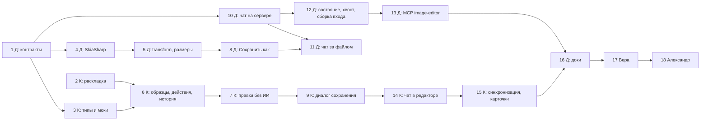

# Редактор картинок v2: план реализации по шагам

**Дата:** 2026-09-26 · **Ветка и worktree:** `feat/image-editor-v2`, `/home/an/Sources/ClaudeCodeServer-ie-v2`
**Основание:** [ADR-018](../adr/ADR-018-image-editor-v2.md) (коммит `f82aa8ab`), макет
[image-editor-v2.html](../mockups/image-editor-v2.html) и записка
[image-editor-v2-proposal.md](../mockups/image-editor-v2-proposal.md) с решениями Андрея.
**Исполнители:** Денис (бэкенд), Кира (фронт). Ревью после каждого шага — Глеб; в конце живая
проверка Веры с ключом fal и финальное ревью Александра.

## Что изменилось после ADR

1. **Растр делает SkiaSharp (MIT), а не ImageSharp** (решение Андрея от 2026-09-26). Контракт
   `IImageRaster` из ADR-018 §9 не меняется, меняется реализация и часть обещаний раздела:
   см. «Проверка SkiaSharp» ниже. Правку ADR делает шаг 1.
2. **Разрез волн — по постановке Андрея, а не по таблице ADR-018 §8.** В ADR ручки чатов,
   снос «Обсудить» и `SendImageChatMessage` стоят в волне 1. Здесь они уехали в волну 2
   вместе со всем чатом: волна 1 — раскладка, образцы, «Сохранить как», правки без ИИ,
   автоуменьшение и возврат размера; волна 2 — чат картинки, MCP-инструменты агента, снимок
   холста, удаление «Обсудить». Волна 1 показывается без чата: «Обсудить» из v1 живёт до
   волны 2.
3. **Редактор — отдельный модуль** (требование Андрея, [ADR-018 §10](../adr/ADR-018-image-editor-v2.md)):
   бэкенд — динамический модуль `ClaudeHomeServer.ImageEditor`, фронт — MF-модуль
   `frontend/modules/image-editor`. После шагов 5 и 6 вставляются шаги переноса П1 (Денис) и
   П2 (Кира); поправки к шагам 7–18 — в таблице ADR-018 §10.4, она важнее текста шагов ниже.

## Проверка SkiaSharp (сделана 2026-09-26)

Пробный консольный проект вне репозитория: `SkiaSharp` 3.119.2 плюс
`SkiaSharp.NativeAssets.Linux.NoDependencies` 3.119.2, net10.0, эта машина (Linux x64).

| Что | Итог |
|---|---|
| Ресайз 4000×3000 → 1024×768 (`SKCubicResampler.Mitchell`), кодирование PNG / JPEG / WebP с качеством | работает: 4 908 / 4 894 / 1 482 байт |
| `ldd libSkiaSharp.so` | все зависимости находятся, **fontconfig не нужен** (вариант `NoDependencies`; текст мы не рисуем) |
| `dotnet publish -c Release /p:UseAppHost=false` **без RID** | в `runtimes/` 416 МБ нативки под все платформы (win-x86/x64/arm64, osx, linux-*, linux-musl-*) |

Выводы для шагов:

- **Core без пакетов не страдает**: пакеты только в `ClaudeHomeServer.Images.csproj`.
  Новый тест «в `ClaudeHomeServer.Core.csproj` нет `PackageReference`» — в шаге 4.
- **CI на `ubuntu-latest` и тесты**: нативка берётся из `runtimes/linux-x64/native` пакета,
  отдельного `apt` не нужно. На Windows (`deploy80.ps1`) `SkiaSharp` сам тянет
  `NativeAssets.Win32`.
- **Dev-контейнер**: рантайм-образ `node:22-bookworm` (glibc, Debian), бэкенд собирается в
  `mcr.microsoft.com/dotnet/sdk:10.0`. Musl нет, fontconfig не нужен. Проверка — сборкой
  контейнера в шаге 4.
- **Грабли — размер публикации.** Все четыре точки publish идут без RID:
  `backend/ClaudeHomeServer/Dockerfile:27`, `scripts/ops/publish-linux.sh:25`,
  `deploy80.ps1:175`, `scripts/ops/deploy-agent.ps1` (staging). Без правки каждая выкладка
  станет на ~0,4 ГБ тяжелее. Лечится `-r linux-x64 --self-contained false` (Windows —
  `-r win-x64`). В шаге 4 это обязательная часть, критерий — размер `runtimes/` до и после.
- **Что в SkiaSharp иначе, чем обещал ADR-018 §9 для ImageSharp** (правка ADR — шаг 1,
  реализация и тесты — шаг 4):
  - Lanczos3 в `SKSamplingOptions` нет. Берём `SKCubicResampler.Mitchell`, а при уменьшении
    больше чем в 2 раза — ступенчатые проходы по 2×, чтобы не было алиасинга;
  - `MemoryAllocator` нет. Потолок 100 Мп проверяем по `SKCodec.Info` **до** декодирования
    (заголовок, без пикселей), а не после;
  - `AutoOrient` делаем сами по `SKCodec.EncodedOrigin`;
  - EXIF энкодеры Skia не пишут вовсе. Геометка пропадает сама, но это надо закрепить тестом,
    а не верить;
  - ICC-профиль: `SKCodec.Info.ColorSpace` переносится в `SKImageInfo` результата, энкодер
    пишет профиль. Держится тестом «фото Display P3 → профиль в результате есть»;
  - маска: `SKSamplingOptions(SKFilterMode.Nearest, SKMipmapMode.None)` — бинарность
    держится тестом из ADR.

## Общие правила для всех шагов

- **Рабочее дерево одно** — `/home/an/Sources/ClaudeCodeServer-ie-v2`. Исполнитель коммитит
  **только свои файлы** явными путями (`git add <пути>`, без `-A` и без `.`), локально, как
  только критерии шага зелёные. Пуш, PR и мерж — только по просьбе Андрея.
- **Одновременно не больше двух исполнителей**: Денис и Кира, по одному шагу каждый. Кузьму
  не назначаем. Шаги Дениса и Киры не трогают одни и те же файлы (кроме оговорённых ниже).
- **Бэкенд**: `cd backend; dotnet build`, точечно
  `dotnet test --filter "FullyQualifiedName~<Набор>"`, перед коммитом последнего шага волны —
  полный `dotnet test backend/ClaudeHomeServer.slnx`. Тесты платформонезависимые:
  `Path.GetTempPath()` + `Path.Combine`, ожидание события через `TaskCompletionSource`.
- **Фронт**: по ходу `cd frontend; npx tsc -b`, `npx vitest run <путь>`; перед коммитом
  `npm run lint:design` зелёный. UI только из `components/ui/`, цвета — токены `C.*`, каждый
  экран на телефоне 390 (`useIsMobile`). Перед коммитом заметного UI — **предложить** Андрею
  прогон субагентом `designer`, не звать молча.
- **Playwright и QA-стенд — только на временной data**: `DataPath` стенда указывает в каталог
  от `mktemp -d`, **никогда не `/srv/ccs/data`**. Стенд поднимается через `dotnet run`
  ([dev-stand-host.md](../operations/dev-stand-host.md)). Моки фронта —
  `localStorage['cc-image-editor-mock']` (`fal` | `all`), механика в `api/imageEditor.ts`.
- **Мутационная проверка** своего сторожа обязательна: сломать проверяемое поведение, тест
  краснеет, вернуть. В отчёте шага — какую мутацию делал.
- **Ревью Глеба после каждого шага**: исполнитель по готовности ставит задачу ревью на Глеба
  с диффом шага (`git show <sha>`). Следующий шаг того же исполнителя можно начинать, не
  дожидаясь ревью; находки уровня major и выше чинятся до мержа волны.
- Фич-флаг один — `image-editor`; при выключенном флаге все новые ручки отвечают 404, MCP-сервера
  в конфиге хода нет.

## Шаги

Обозначения: **Д** — Денис, **К** — Кира. «Зависит от» — что должно быть закоммичено до
начала. Контракты (шаг 1) фиксируют форму данных; фронт до готовности ручек работает на моках.

### Волна 0 — контракты

#### Шаг 1. Контракты волны 0 и правка ADR под SkiaSharp — Д

- **Зависит от:** ничего.
- **Что сделать:**
  - `Session.ImageChat` (`SessionImageChat { CurrentPath, Lineage }`, nullable, аддитивно) в
    `Core/Models/Session.cs` рядом с `DesktopChat`; сериализация через `SessionJsonConverter`
    (едет на фронт в том же `Session`). `BackupSchema.Version` не двигаем.
  - DTO в `Core/Services/ImageEditor/ImageEditDtos.cs`:
    `ImageChatCreateRequest { sourcePath, personaId? }`, `ImageChatLookupResponse { current,
    continued[] }`, `ImageChatPathRequest { path }`, `ImageChatState` (промпт + автор
    `human|agent`, поставщик, модель, режим, число, образцы с ролями, персонаж, `marks`,
    `canvasRevision`, `lastSentRevision`, текущий шаг, `matchSourceSize`, журнал событий,
    `revision`), `ImageEditSaveRequest.Mode: "next-version" | "as"` + `Folder`, `FileName`,
    `StepId`, `ChatSessionId`, `Encode?`; `SaveCheckResponse { path, taken, suggestion }`;
    `ImageTransformRequest { base: { path | stepId }, ops[], encode? }` с операциями
    `AutoOrient`, `Crop` (прямоугольник в долях), `Rotate(90|180|270)`, `Flip(h|v)`,
    `Resize(w,h | percent, lockAspect)`, `Encode(format, quality)`;
    `ImageTransformResponse { stepId, width, height, bytes }`.
  - `ImageEditJobDto` и события `image_edit_*`: `SessionId?`, `Initiator: human | agent`;
    `ImageEditJobInput.MatchSourceSize`; `ImageEditCaps.MaxInputSide`, `MaxInputMegapixels`,
    `MaxInputMb`.
  - `SpendRecord` (`Core/Models/SpendRecord.cs`): `SessionId?`, `Initiator?` (аддитивно).
  - Событие `image_chat_state { sessionId, projectId, revision, state, changedBy, changes[] }`
    в `Core/Protocol/ServerMessage.cs` / `ImageEditEvents.cs`.
  - `StoredMessage` (`Core/Protocol/StoredMessage.cs`): виды `image_launch { by, prompt,
    provider, model, count, estimate, jobId }` и `image_file_moved { from, to }`;
    `StoredUserMessage.ImageSnapshot { revision, attached }`.
  - Схемы MCP-инструментов `image_state`, `image_generate`, `image_suggest_prompt`,
    `image_cancel` — константами в `Services/Mcp/Http/ImageEditorToolset.Schemas.cs`
    (образец — `PersonasToolset.Schemas.cs`); сам тулсет — шаг 13.
  - Правка ADR-018 §9 и «Последствий»: ImageSharp → SkiaSharp, отличия из раздела «Проверка
    SkiaSharp» выше, закрыть пункт 1 «Открыто».
- **Читать:** ADR-018 целиком; `Session.cs:400-445` (`DesktopChat`, `AutoAllowTools`),
  `ImageEditDtos.cs`, `ImageEditEvents.cs`, `StoredMessage.cs`, `PersonasToolset.Schemas.cs`.
- **Образец:** `DesktopChat` для поля сессии; полиморфные записи `StoredMessage`.
- **Проверка:** `dotnet build`; `dotnet test --filter "FullyQualifiedName~Session|FullyQualifiedName~StoredMessage|FullyQualifiedName~Backup"`.
- **Готово, когда:** сборка зелёная; тест круговой сериализации `Session` с `ImageChat` и без
  (старый `sessions.json` читается, поле `null`); тест полиморфной сериализации двух новых
  `StoredMessage`; ADR-018 правлен. Поведения не меняется ни одна ручка.

### Волна 1 — раскладка, образцы, «Сохранить как», правки без ИИ, размеры

#### Шаг 2. Раскладка v2: левая панель и поле промпта — К

- **Зависит от:** ничего (новых ручек не требует). **Идёт параллельно шагу 1.**
- **Что сделать:** перенести редактор на раскладку макета: слева панель 272 px из шести
  сворачиваемых секций («Пометки», «Образцы», «Персонажи», «Быстрые действия», «Чем
  рисовать», «История шагов») с кратким итогом в заголовке и запоминанием состояния на
  пользователя (по умолчанию открыты «Пометки», «Образцы», «Быстрые действия», «История»);
  центр — холст и варианты (как в v1); справа сверху поле «Промпт» с авторазмером до 240 px
  (на телефоне до 132), крестиком очистки, числом вариантов, ценой и «Сгенерировать», режимом
  «только чтение» и «Рисуем N вариантов… · Отменить» во время генерации. Существующие блоки
  (пометки, персонажи, `ProviderModelPicker`) переезжают в секции без смены поведения.
  «Образцы», «Быстрые действия», «История шагов» — пустые секции-заглушки с текстами из
  записки (наполняют шаги 6–7). Место под чат справа — заглушка; «Обсудить» из v1 пока живёт.
  Телефон: холст на весь экран, промпт внизу всегда, шторка «Инструменты» на 86 %.
- **Читать:** записка v2 (разделы «Раскладка», «Телефон», «Тексты»), макет (ключ «Сразу к»),
  `components/imageEditor/ImageEditor.tsx`, `EditorCanvas.tsx`, `ProviderModelPicker.tsx`,
  `docs/design/guidelines.md`.
- **Образец:** сворачиваемые секции и шторки — готовые контролы из `components/ui/`.
- **Проверка:** `npx tsc -b`; `npx vitest run src/components/imageEditor`; `npm run lint:design`;
  ручной прогон на моке `cc-image-editor-mock=all` в ширинах 1360 и 390, обе темы.
- **Готово, когда:** раскладка совпадает с макетом на десктопе и телефоне; всё, что работало
  в v1 (пометки, персонажи, выбор модели, генерация, варианты, «Применить»), работает; тест
  на авторазмер поля и запоминание секций.

#### Шаг 3. Типы и моки фронта под контракты — К

- **Зависит от:** шага 1.
- **Что сделать:** в `frontend/src/api/imageEditor.ts` и `types/` — TS-зеркало всех DTO шага 1,
  клиентские функции новых ручок (`chats`, `chats/{id}/path`, `chats/{id}/state`, `save` с
  `Mode`, `save/check`, `transform` и `transform?dryRun=true`), поле `imageChat` у `Session`,
  типы событий `image_chat_state` и `SessionId`/`Initiator` у задач. Моки для каждой ручки в той
  же механике `cc-image-editor-mock` (в том числе `409 name_taken` для имени, оканчивающегося
  на `taken`, и `dryRun` с правдоподобным весом).
- **Читать:** C#-DTO из шага 1 (`git show <sha шага 1>`), `api/imageEditor.ts`.
- **Образец:** существующие моки персонажей в `api/imageEditor.ts:270-420`.
- **Проверка:** `npx tsc -b`; vitest на моки (`409`, `dryRun`).
- **Готово, когда:** имена полей один в один с C# (camelCase JSON); каждый мок покрыт тестом.

#### Шаг 4. `IImageRaster` на SkiaSharp и публикация по RID — Д

- **Зависит от:** шага 1. **Идёт параллельно шагу 3.**
- **Что сделать:**
  - `PackageReference` `SkiaSharp` и `SkiaSharp.NativeAssets.Linux.NoDependencies` (3.119.x)
    **только** в `ClaudeHomeServer.Images.csproj`.
  - `IImageRaster` в `Images/Services/ImageEditor/Raster/` (namespace
    `Services.Images.Editing.Raster`, как в ADR): `Probe` (формат, размеры, ориентация, вес —
    по `SKCodec`, без декодирования пикселей), `Apply(ops)`, `Encode(format, quality)`;
    реализация `SkiaImageRaster`. Потолки: вход больше 100 Мп → доменная ошибка → 400 «картинка
    слишком большая»; семафор на 2 операции на инстанс, сверх него 429.
  - `AutoOrient` на входе, ориентация на выходе нормальная, ICC сохраняется, EXIF не пишется.
    Ресайз — Mitchell со ступенями по 2×, маска — nearest.
  - `-r linux-x64 --self-contained false` в `Dockerfile:27` и `scripts/ops/publish-linux.sh:25`,
    `-r win-x64 --self-contained false` в `deploy80.ps1:175` и staging-публикации
    `scripts/ops/deploy-agent.ps1`.
  - Новый тест «в `ClaudeHomeServer.Core.csproj` нет `PackageReference`» рядом с
    `SubsystemBoundaryTests`.
- **Читать:** ADR-018 §9, раздел «Проверка SkiaSharp» этого плана,
  `Images/Services/ImageEditor/Marks/ImageDimensions.cs`,
  `Core/Services/ImageEditor/Versioning/ImageFormatSniffer.cs`,
  [conventions.md](../architecture/conventions.md).
- **Образец:** регистрация сервисов вертикали — `Jobs/ImageEditorRegistration.cs`.
- **Проверка:** `dotnet build`; `dotnet test --filter "FullyQualifiedName~Raster|FullyQualifiedName~SubsystemBoundary|FullyQualifiedName~CorePackage"`;
  `docker compose -f docker-compose.claude.yml build claude-server` зелёная, в контейнере
  `find /app -name libSkiaSharp.so` находит ровно один `linux-x64`; `du -sh runtimes` публикации
  до и после правки RID — в отчёт.
- **Готово, когда** зелёные сторожа ADR-018 §9: вход больше 100 Мп → 400 без исключения
  наружу; JPEG с GPS в EXIF → в результате GPS нет; фото Display P3 → профиль сохранён; EXIF
  orientation 6 → пиксели повёрнуты, метки нет; `SubsystemBoundaryTests` зелёные; тест «Core
  без пакетов» краснеет, если вписать пакет в Core (мутация). Размер публикации не вырос больше
  чем на размер одной `libSkiaSharp.so` (~10 МБ).

#### Шаг 5. Шаги истории, `transform`, автоуменьшение, возврат размера — Д

- **Зависит от:** шага 4.
- **Что сделать:**
  - Шаги истории на сервере в `data/image-editor/{ownerId}/{editId}/steps/` (рядом с рабочей
    папкой `ImageEditWorkspace`, тот же TTL, вне бэкапа): правки без ИИ и применённые
    варианты — одна лента с `parent`.
  - `POST …/image-editor/transform { base, ops[], encode? }` → `{ stepId, width, height, bytes }`;
    `?dryRun=true` кодирует в память, шаг не пишет, отдаёт `bytes`. Бесплатно, трат не пишет.
  - `InputFitter` в `ImageEditJobService` перед драйвером: исходник, образцы и размеченная
    копия ужимаются под `caps` модели, маска — nearest до размеров исходника; маска из
    телефона (до 2048 px) растягивается до исходника так же. Курируемые значения
    `MaxInput*` в `ImageEditCatalog`.
  - `MatchSourceSize` (по умолчанию `true`): после скачивания варианты приводятся к размеру
    исходника при совпадении пропорций до 2 %; иначе пометка «Размер не приведён: другие
    пропорции». Для «Дорисовать за края» и «Улучшить качество» возврата нет.
  - `ImageEditor:HeavyFileMb` (по умолчанию 5) — в ответе каталога для диалога сохранения.
- **Читать:** ADR-018 §9, `Jobs/ImageEditJobService.cs`, `Jobs/ImageEditWorkspace.cs`,
  `ImageEditCatalog.cs`, `ImageEditorController.cs` (`Start`, `save`).
- **Образец:** проверки путей — `ProjectLinkGuard.ResolveInside`; ответы ошибок — как у
  существующих ручек контроллера.
- **Проверка:** `dotnet test --filter "FullyQualifiedName~ImageEditor"`.
- **Готово, когда** зелёные сторожа: ужатие 6000×4000 под лимит 2048 → размеры маски и
  исходника равны, в маске только 0 и 255; `transform` и автоуменьшение не пишут в проект (хеш
  файла до и после равен); 1:1 → 1024², 16:9 при квадратном исходнике → свой размер плюс
  пометка; `transform` при выключенном флаге → 404; путь `base.path` через `../` и через
  символическую ссылку → 400.

#### Шаг 6. Образцы с ролями, быстрые действия, история шагов — К

- **Зависит от:** шагов 2 и 3 (на моке); на живых ручках — шаг 5.
- **Что сделать:** секция «Образцы» — «+ Образец» → «С компьютера» / «Из файлов проекта…»,
  роль под миниатюрой («Персонаж — сохранить лицо», «Стиль», «Предмет»), удаление,
  перетаскивание из дерева; быстрые действия (запуск без промпта, «Дорисовать за края» с
  пропорциями); «История шагов» списком с миниатюрами, переход на шаг, «Взять за основу».
  Образцы и шаги уходят во вход задачи.
- **Читать:** записка v2, макет (секции слева), `ImageEditor.tsx`, `ResultViews.tsx`,
  `characters/CharacterPicker.tsx`, ADR-017 (образцы в v1).
- **Образец:** `CharacterPicker` для выбора и миниатюр.
- **Проверка:** `npx tsc -b`; vitest; `npm run lint:design`; ручной прогон на моке 1360 и 390.
- **Готово, когда:** всё из списка кликается, роли уходят во вход `jobs` (тест на сборку
  входа), шаги истории переключают холст.

#### Шаг 7. Инструменты без ИИ и размеры — К

- **Зависит от:** шага 6.
- **Что сделать:** обрезка рамкой, поворот, отражение — мгновенно на экране (CSS-трансформ или
  canvas экранного разрешения) и шагом через `transform`; пока шаг в полёте, следующая
  операция встаёт в цепочку. «Размер и сжатие»: px/%, замок пропорций, пресеты (1920, 1280,
  1080, 512, 50 %), формат PNG/JPG/WebP, качество 40–100, вес «2,4 МБ → 310 КБ» через `dryRun`
  с дебаунсом 300 мс. Тумблер «Вернуть размер оригинала» в «Чем рисовать». Маска экспортируется
  в разрешении предпросмотра до 2048 px.
- **Читать:** ADR-018 §9 («Мгновенность», «Размер и сжатие», «Маска на телефоне»),
  `EditorCanvas.tsx`, `marks.tsx`.
- **Проверка:** `npx tsc -b`; vitest на очередь операций и дебаунс веса; `npm run lint:design`.
- **Готово, когда:** две операции подряд без ожидания обе фиксируются (тест цепочки); вес
  пересчитывается не чаще раза в 300 мс; на телефоне 390 все контролы доступны.

#### Шаг 8. «Сохранить как…» на сервере — Д

- **Зависит от:** шага 5 (источник `stepId`). **Идёт параллельно шагу 6 или 7.**
- **Что сделать:** `ImageEditSaveRequest.Mode`: `next-version` — прежнее поведение; `as` —
  `Folder` + `FileName`. Имя через `Path.GetFileName` обязано совпасть с вводом («a/b.png» →
  400), без ведущей точки и запрещённых символов; расширение ставит сервер по фактическому
  формату или по `Encode`, вписанное `.png` срезается. Папка — `ProjectLinkGuard.ResolveInside`
  и обязана существовать. `IImageEditSaver.SaveAs` — `FileMode.CreateNew`; занятое имя →
  `409 name_taken` с `suggestion`. `GET …/save/check?folder=&name=&format=` → `{ path, taken,
  suggestion }`, ничего не пишет. Источник — `jobId + variant` или `stepId`. После записи
  `NotifyMutated`. Поле `chatSessionId` пока принимается и игнорируется (перенос чата — шаг 11).
- **Читать:** ADR-018 §5, `Jobs/ImageEditSaver.cs`, `Versioning/VersionedImageStore.cs`,
  `ProjectLinkGuard.cs`, `ImageEditorController.cs:188-236`.
- **Образец:** `VersionedImageStore.SaveNextVersion` (`CreateNew`, подбор номера для `suggestion`).
- **Проверка:** `dotnet test --filter "FullyQualifiedName~ImageEdit|FullyQualifiedName~VersionedImageStore"`.
- **Готово, когда** зелёные сторожа: занятое имя → `409` + `suggestion`, байты существующего
  файла не изменились, мутация `CreateNew` → `Create` краснеет; `../x`, абсолютный путь,
  `a/b.png` в имени, папка-ссылка наружу → 400; `hero.png.png` не возникает; `save/check` не
  создаёт файлов; сохранение из `stepId` работает без генерации.

#### Шаг 9. Диалог «Сохранить как…» — К

- **Зависит от:** шагов 3 и 7 (на моке); на живых ручках — шаг 8.
- **Что сделать:** кнопки «Применить» / «Сохранить» (сразу, следующей версией) и «Сохранить
  как…» в вариантах и в шапке; диалог: имя (по умолчанию `имя.v2`), список папок с числом
  файлов и меткой «здесь сейчас», расширение справа по формату, проверка на лету через
  `save/check` (дебаунс 300 мс), предупреждение «Такой файл уже есть… · Взять «hero.v3.png»»,
  «Сохранить» недоступна при занятом имени; подсказка про тяжёлый файл (`HeavyFileMb`) с
  кнопкой «Сжать в WebP ≈ …». Тост «Сохранено в проект: … · Показать в дереве» с подсветкой
  файла «новый». Редактор переходит на новый файл. Заменяет v1 `SaveDialog.tsx`.
- **Читать:** записка v2 («Сохранить как…», «Тексты»), `SaveDialog.tsx`, ADR-018 §5.
- **Проверка:** `npx tsc -b`; vitest (занятое имя блокирует кнопку, `.png` не удваивается);
  `npm run lint:design`; Playwright `frontend/e2e/image-editor-v2-save.spec.ts` на моке.
- **Готово, когда:** сценарии макета «занятое имя», «Взять hero.v3.png», «Показать в дереве»
  проходят в Playwright; на телефоне диалог помещается в 390.

**Контрольная точка волны 1:** шаги 2–9 закоммичены, ревью Глеба закрыты, полный
`dotnet test backend/ClaudeHomeServer.slnx` и `npm run lint:design` зелёные. Андрею можно
показывать v2 без чата.

### Волна 2 — чат картинки, агент, снимок холста, удаление «Обсудить»

#### Шаг 10. Чат картинки на сервере — Д

- **Зависит от:** шага 1. Может начаться, пока Кира в шагах 7–9.
- **Что сделать:** `SessionManager.CreateAsync(…, imageChat)`; `POST …/image-editor/chats
  { sourcePath, personaId? }` — создаёт чат «hero.png · правка» (имя явное, авто-заголовок его
  не трогает), собеседник: `personaId` из композера, иначе руководитель проекта, иначе личный
  ассистент (правило из `ImageDiscussService`), `AutoAllowTools` =
  `mcp__image-editor__image_generate`, `…__image_suggest_prompt`; `GET …/chats?path=` →
  `current` (свежий неархивный, иначе свежий архивный) и `continued` (по `Lineage`);
  `PUT …/chats/{sessionId}/path`. Сеттер `SetImageChatPath` **не двигает `UpdatedAt`**.
  Метод хаба `SendImageChatMessage(sessionId, text, attachedPaths, mode, snapshot)` зовёт тот же
  `SendMessageAsync` и пишет `StoredUserMessage.ImageSnapshot`.
- **Читать:** ADR-018 §1, §3; `SessionManager.cs` (`CreateAsync`, `SetExpiry`, `SetArchived`,
  `SetContextAsync` — как сеттеры не двигают `UpdatedAt`), `Hubs/SessionHub`,
  `Services/ImageEditor/Discuss/ImageDiscussService.cs` (правило персоны),
  `Services/Mcp/Http/WatchToolset.cs` (`TryResolve` через `GetOwned`).
- **Образец:** `DesktopChat` — тип чата с создания.
- **Проверка:** `dotnet test --filter "FullyQualifiedName~ImageChat|FullyQualifiedName~SessionHub"`.
- **Готово, когда** зелёные сторожа: смена пути и `PUT path` не меняют `UpdatedAt` (мутация
  «двигать» краснеет); чужой `sessionId` в `PUT path` → 404, неотличимо от несуществующего;
  `PUT path` с `../` и ссылкой наружу → 400; флаг выключен → 404 на `chats`; перенесены полезные
  проверки из `ImageDiscussServiceTests` (выбор персоны).

#### Шаг 11. Чат идёт за файлом: перенос при сохранении и трекер — Д

- **Зависит от:** шагов 8 и 10.
- **Что сделать:** в `save` — `chatSessionId`: проверка «свой, этот проект, чат картинки»,
  `Lineage += CurrentPath`, новый `CurrentPath`, запись `image_file_moved` через
  `AppendStoredAsync` (она двигает `UpdatedAt` — так задумано). `ImageChatPathTracker` —
  подписчик `FileService.OnMutated` в Main: на `Rename` файла или папки (префиксом) переписывает
  `CurrentPath` и `Lineage` у чатов картинок проекта, `UpdatedAt` не трогает, в ленту не пишет;
  на `Delete` привязку оставляет.
- **Читать:** ADR-018 §1 («Чат идёт за редактором», «Переименование…»),
  `Controllers/FilesController.cs` (`Rename`), `FileService.NotifyMutated`,
  `SessionManager.AppendStoredAsync`.
- **Проверка:** `dotnet test --filter "FullyQualifiedName~ImageChat"`.
- **Готово, когда** зелёные сторожа: rename файла и папки переписывает пути и не меняет
  `UpdatedAt`; запись `image_file_moved` двигает `UpdatedAt`; чужой `chatSessionId` в `save` →
  файл сохранён, чат не тронут, ответ не выдаёт существование чужого чата.

#### Шаг 12. Состояние редактора на сервере, хвост хода, общая сборка входа — Д

- **Зависит от:** шага 10.
- **Что сделать:**
  - `ImageChatStateStore` (Main, `data/image-editor/{ownerId}/chats/{sessionId}.json`, TTL-кеш
    вне бэкапа — добавить путь в исключения бэкапа и тест на это). `PUT …/chats/{id}/state` с
    `revision` (старая → `409`), маска multipart только при смене `canvasRevision`. Запись
    состояния **не двигает `UpdatedAt`**. Рассылка `image_chat_state` через
    `ISessionBroadcaster.ToOwner`.
  - `ImageEditLaunchAssembler` (Main): вынос сборки входа из `ImageEditorController.Start`;
    ручка идёт через него. `POST …/jobs` принимает `chatSessionId` → после старта запись
    `image_launch { by: human, … }` в ленту и в журнал событий состояния. `SessionId` и
    `Initiator` у задачи и в `SpendRecord`.
  - Блок «Состояние редактора» — вкладчик `IPromptSectionContributor` (ключ
    `image-editor-state`, `stable: false`) в Main, гейт — `Session.ImageChat != null`, флаг и
    подсистема `images`. **Развилка для Александра до начала шага:** в `ClaudeSession`
    (`:2860-2900`, `:3371`) нестабильные секции уходят хвостом хода только при
    `RecallInTurnText` у провайдера; без него они попадают в системный блок, и сторож ADR
    «системный блок чата картинки не меняется между ходами» не выполним. Предложение: секция
    этого ключа идёт хвостом всегда, независимо от флага провайдера.
- **Читать:** ADR-018 §2 («Откуда агент знает состояние»), `Core/Services/Turn/IPromptSectionContributor.cs`,
  `Turn/PromptSectionContributorsRegistration.cs`, `Llm/Claude/ClaudeSession.cs:2850-2910, 3140-3160, 3365-3400`,
  `ImageEditorController.Start`, `Core/Models/SpendRecord.cs`, `BackupPaths`.
- **Образец:** `PersonaRecallContributor` (нестабильная секция), существующая сборка входа в `Start`.
- **Проверка:** `dotnet test --filter "FullyQualifiedName~ImageChat|FullyQualifiedName~ImageEdit|FullyQualifiedName~PromptSections|FullyQualifiedName~Backup"`.
- **Готово, когда** зелёные сторожа: запись со старой `revision` → `409`; `PUT state` не меняет
  `UpdatedAt`; чужой `sessionId` в `state` → 404; ручной запуск попадает в блок состояния
  следующего хода; системный блок чата картинки одинаков на двух ходах подряд с разным
  состоянием; ручка `jobs` после выноса проходит все прежние тесты `ImageEditorControllerTests`
  без правки их ожиданий.

#### Шаг 13. MCP-сервер `image-editor` для агента — Д

- **Зависит от:** шага 12.
- **Что сделать:** `ImageEditorToolset` в `Services/Mcp/Http` (хвост маршрута — `sessionId`,
  резолв через `GetOwned`), `BuildImageEditorContext` в `SessionManager` (гейт:
  `Session.ImageChat != null`, флаг `image-editor` у владельца, подсистема `images`),
  регистрация в `McpToolsetRegistry`. Инструменты `image_state`, `image_generate` (вход через
  `ImageEditLaunchAssembler`, меняет состояние, рассылает `image_chat_state` с `changedBy:
  agent` и `changes[]`, возвращает `{ jobId, quote, changes[] }`), `image_suggest_prompt`
  (ничего не запускает), `image_cancel` (только задачи этого чата). Потолок 2 запуска на ход:
  счётчик на сессию, сброс подписчиком `TurnCompleted` на шине с фильтром по `SessionId`.
  `DelegatedTurnGate.Decide` → отказ fail-closed. `ImageEditor:AgentLaunch` (по умолчанию
  `true`; при `false` в составе только `image_suggest_prompt` и `image_state` — решение
  инстанса, не хода). Отказ поставщика → `retryQuote` в результате, второго вызова драйвера нет.
- **Читать:** ADR-018 §2, §7; [ADR-012](../adr/ADR-012-mcp-over-http-transport.md);
  `WatchToolset.cs`, `HiggsfieldToolset.cs`, `McpToolsetRegistry.cs`,
  `Tests/Services/McpToolsetStabilityTests.cs`, `DesktopMcpToolsetStabilityTests.cs`,
  [mcp-servers.md](../architecture/mcp-servers.md).
- **Образец:** `WatchToolset` (хвост с сессией), `BuildDesktopContext` (сервер только в чате
  своего типа).
- **Проверка:** `dotnet test --filter "FullyQualifiedName~McpToolsetStability|FullyQualifiedName~ImageEditorToolset|FullyQualifiedName~McpHttpTransport"`.
- **Готово, когда** зелёные сторожа ADR-018 §7: `BuildImageEditorContext` в списке рубильников
  без `_currentTurn`, `ToolsFor` в проверке тел; «чат картинки — сервер есть, обычный чат — нет,
  флаг выкл — нет»; чужой `sessionId` в хвосте → пустой `tools/list`; чужой `jobId` в
  `image_cancel` → «задача не найдена»; делегированный ход → отказ, задачи нет; третий
  `image_generate` за ход → отказ с текстом, задачи нет; агент в чате владельца B запускает
  Higgsfield → одна запись траты `OwnerId = B`, `Initiator = agent`, `SessionId` чата; путь
  образца через символическую ссылку из тулсета отвергается. Мутация: добавить в
  `BuildImageEditorContext` признак хода — стабильность краснеет.

#### Шаг 14. Чат в редакторе, снимок холста, снос «Обсудить» на фронте — К

- **Зависит от:** шагов 3 и 9 (на моке), на живых ручках — шаг 10. **Идёт параллельно шагам
  11–12.**
- **Что сделать:**
  - `ChatPanel`: пропсы `hideHeader`, `leadIn` (первая строка «Чат привязан к …», «Новый чат»,
    «↗ Открыть в полном чате»), `prepareSend(text, paths) → { text, paths, snapshot }`,
    `pendingMessage: string | { text, attachedPaths }` (старые вызовы не меняются). Страница
    чата и «Стена» не меняются.
  - `ImageChatComposerStub`: `Composer` без `ChatPanel`, черновик под `image:{projectId}:{path}`,
    локальные `File`; первое «Отправить» → `POST chats` → загрузка вложений и снимка
    `POST api/chats/{id}/files/upload` → `ChatPanel` с `pendingMessage`.
  - Открытие картинки: `GET chats?path=` → `current` (тост «Открыт чат этой картинки»),
    `continued` («Разговор продолжился на …»), «Файл удалён или перемещён» + «Привязать чат к
    этому файлу» (`PUT path`).
  - Снимок: `discuss/snapshot.ts` → `chat/snapshot.ts`, ужатие до 1568 px, `canvasRevision`
    (хеш пути, шага и канонического `marks`), `lastSentRevision`; чип «hero.png · 3 пометки» /
    «без изменений», крестик и возврат через «+»; отправка через `SendImageChatMessage`;
    подпись «холст не менялся — снимок не приложен» в `ChatItemView` по `ImageSnapshot`.
  - Снос: `discuss/DiscussPanel.tsx`, `discussText.ts` и его тест, `api.discuss` и мок, разбор
    блока `image-prompt` в заборах.
  - Телефон: шторка «Чат» на 86 % с точкой «новое».
- **Читать:** ADR-018 §1, §3, §6; `components/ChatPanel.tsx` (`embedded`, `pendingMessage`
  `:1045-1110`), `Composer.tsx`, `ChatItemView`, `discuss/*`.
- **Образец:** встраивание `ChatPanel` с `embedded` на «Стене».
- **Проверка:** `npx tsc -b`; vitest (ревизия меняется от пометок и шага, не меняется от
  зума; `pendingMessage` объектом); `npm run lint:design`; Playwright
  `frontend/e2e/image-editor-v2-chat.spec.ts`: первое сообщение создаёт чат, повторное открытие
  находит его, второе сообщение без правок идёт без снимка.
- **Готово, когда:** `rg -n "discuss|image-prompt" frontend/src` пуст (кроме истории
  changelog, если есть); страница чата и «Стена» ведут себя как раньше (их тесты зелёные без
  правок); сценарии Playwright зелёные.

#### Шаг 15. Синхронизация с агентом, карточки ленты, значок в списке чатов — К

- **Зависит от:** шага 14; на живых ручках — шаги 12–13. **Идёт параллельно шагу 13.**
- **Что сделать:** `PUT state` с дебаунсом 500 мс и `revision`, на `409` перечитать;
  применение `image_chat_state`: подсветка поля промпта, «✦ написал Claude», «✦ модель сменил
  Claude», рамка у «Вариантов», ручная правка снимает метку и пишет `author = human`; текст,
  который человек печатал в момент прихода, хранится черновиком с кнопкой «Вернуть мой текст».
  Карточки в `ChatItemView`: `ImageLaunchCard` (по образцу `WidgetView`: цена, число, «Изменил:
  …», прогресс по `image_edit_*`, «Отменить», «Готово · Показать варианты», «Генерация
  отменена · Деньги не списаны…», «Генерация не удалась», догон статуса `GET jobs/{id}`, `410
  interrupted`), `ImagePromptCard` («Вставить в промпт», «Сгенерировать · ≈ …»), тихие строки
  `image_launch` и `image_file_moved`. Контекст `ImageEditorBridge`: есть — кнопки действуют
  в редакторе, нет — «Открыть в редакторе» (с промптом). `ChatCard`: значок «картинка» и
  миниатюра `CurrentPath`, клик — `openImageEditor({ path, sessionId })`; при выключенном
  флаге карточка обычная. «Открыть в редакторе» в полном чате.
- **Читать:** ADR-018 §2 («Как ход меняет открытый редактор», «Карточки в ленте»),
  `ChatItemView` (ветки `widget_show`, `tasks_create`), `ChatCard.tsx`, `useImageEditJob.ts`.
- **Образец:** `WidgetView`, `TaskCreatedView`.
- **Проверка:** `npx tsc -b`; vitest (применение `changes[]`, «Вернуть мой текст», `409` →
  перечитать); `npm run lint:design`; Playwright `image-editor-v2-agent.spec.ts` на моке событий.
- **Готово, когда:** оба сценария агента из записки (А — запуск, Б — предложение) проходят на
  моке; карточки отрисованы во всех состояниях макета в обеих темах; перед коммитом предложить
  Андрею прогон `designer`.

#### Шаг 16. Документация — Д

- **Зависит от:** шагов 13 и 15.
- **Что сделать:** `docs/features/image-editor.md` (v2: раскладка, чат картинки, агент,
  «Сохранить как», правки без ИИ, размеры, SkiaSharp и RID публикации); выжимка в `CLAUDE.md`
  в формате соседних разделов (карта держит размер — `ProjectMapHygieneGuardTests`); пометка в
  ADR-017 §6 «заменено ADR-018 §1»; статус ADR-018 → «Принято, реализовано».
- **Проверка:** `dotnet test --filter "FullyQualifiedName~ProjectMapHygieneGuard"`; ссылки
  живые.
- **Готово, когда:** сторож карты зелёный, в доках нет упоминаний ImageSharp как принятого.

### Приёмка

#### Шаг 17. Живая проверка — Вера

- **Зависит от:** шагов 1–16, закрытых ревью Глеба.
- **Стенд:** `dotnet run` бэкенда с `DataPath` во временном каталоге (`mktemp -d`), **не
  `/srv/ccs/data`**; ключ fal в `appsettings.Local.json` стенда; фронт — свежий
  `npm run build`. Флаг `image-editor` включён тестовому владельцу.
- **Сценарии:** раскладка 1360 и 390, обе темы; правки без ИИ (обрезка, поворот, сжатие в
  WebP с весом) и «Сохранить как» с занятым именем; генерация fal с пометкой кистью и
  возвратом размера; фото больше лимита модели — автоуменьшение (по логу драйвера); чат: первое
  сообщение, снимок только при изменении, режим А (агент запускает сам, «Отменить» до конца —
  деньги не списаны), режим Б (карточка промпта), тихая строка ручного запуска, агент видит её
  в следующем ответе; «Сохранить как» переносит чат; rename файла в дереве — чат находится;
  карточка в списке чатов открывает редактор; второй владелец не видит чат и не может
  отменить чужую задачу; траты агента в «Модели и расход» с пометкой «агент».
- **Готово, когда:** отчёт со скриншотами в `.cc-attachments/`, найденные дефекты заведены
  задачами-дефектами на Дениса или Киру.

#### Шаг 18. Финальное ревью — Александр

- **Зависит от:** шага 17 и исправления его дефектов.
- **Что проверить:** таблицы сторожей ADR-018 §7 и §9 — у каждой строки есть тест и он
  краснеет на мутации; правило зависимостей (`Images` не ссылается на Main, SkiaSharp только в
  `Images`, Core без пакетов); стабильность `tools/list`; развилка шага 12 по хвосту хода
  закрыта кодом; размер публикации.
- **Готово, когда:** ревью без blocker/critical, решение о мерже в `master` — за Андреем.

## Зависимости и параллельность

Пары, которые идут одновременно (в каждой один шаг Дениса и один Киры, других исполнителей в
это время нет):

| Окно | Денис | Кира | Почему не мешают |
|---|---|---|---|
| 1 | 1 — контракты | 2 — раскладка | раскладка не зовёт новых ручек |
| 2 | 4 — SkiaSharp | 3 — типы и моки | бэкенд-пакет и фронтовые типы, общих файлов нет |
| 3 | 5 — transform, размеры | 6 — образцы, действия, история | Кира на моке `transform` |
| 4 | 8 — «Сохранить как» | 7 — правки без ИИ | разные файлы; `save/check` Кире нужен только в шаге 9 |
| 5 | 10 → 11 — чат на сервере | 9 — диалог сохранения | диалог на моке, `chatSessionId` пока игнорируется |
| 6 | 12 — состояние, хвост | 14 — чат в редакторе | фронт на моке `chats`, живой `chats` уже есть после шага 10 |
| 7 | 13 — MCP | 15 — синхронизация, карточки | карточки на моке событий `image_chat_state` |
| 8 | 16 — доки | — | ждёт шагов 13 и 15 |

Общий файл у пары — только `api/imageEditor.ts` (шаг 3 правит его один раз, дальше Кира) и
`ImageEditorController.cs` (только Денис). По оценке ADR-018 §8 фронт — узкое место
(~14–16 дней Киры против ~11–12 Дениса): у Дениса после шага 13 остаётся запас на правки по
ревью Глеба и на дефекты Веры.

## Риски и открытые вопросы

1. **Хвост хода без `RecallInTurnText`** (шаг 12) — решает Александр до начала шага: без
   правки блок состояния у провайдера без флага ломает prefix cache.
2. **Размер публикации** (шаг 4) — без RID +0,4 ГБ на каждую выкладку; RID меняет четыре
   скрипта выкладки, их надо прогнать хотя бы раз до мержа (Марк).
3. **Качество ресайза без Lanczos** — Mitchell со ступенями; если Андрей увидит мыло на живой
   проверке, следующий кандидат — `SKCubicResampler.CatmullRom`.
4. **ICC в WebP-энкодере Skia** — закрепляется тестом шага 4; если профиль не пишется,
   конвертируем в sRGB перед WebP и честно пишем это в доках.
5. Ширина левой панели и «свернуть в значки» — вопрос макета (ADR-018, «Открыто» п. 3), в план
   не входит.
