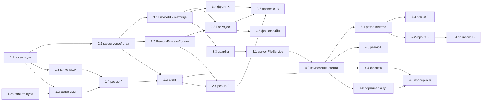

# План реализации ADR-016: этапы 1–5 локальных проектов (2026-09-24)

Исходники: [ADR-016](../adr/ADR-016-local-projects.md) (редакция коммита `d23814f9`) и
[спайк](local-projects-spike-2026-09.md) (§3 «Грабли», §5 «Что меняется»). Задача трекера —
`2b46cc52`. **Редакция 2 (2026-09-24):** учтён новый пункт ADR §2 — через шлюз ходят только
подписки на `claude setup-token` (задача 1.2а, сторож G11, правки 1.2, 1.4, 3.6). Все пути и строки ниже сверены с деревом ветки `feat/local-projects` на
2026-09-24. Статус: **план, ждёт согласования владельца**. Задачи заведены в трекере в todo
с меткой `local-projects`, исполнители не запускались.

Зафиксировано до плана и здесь не пересматривается: шлюз работает на учётных данных сервера,
включая подписки из пула `ClaudeSubscriptionPool` (тумблер `LlmGateway:AllowSubscriptions`,
учёт по `anthropic-ratelimit-unified-*` в той же точке правды пула); учётные данные сервера
на клиент не едут никогда; ось — проект (`Project.DeviceId`), один код в двух композициях,
матрица возможностей, запись файлов только с машины, чтение с других устройств через
ретранслятор и только онлайн; у агента нет долговременного состояния. Из подписок шлюз
берёт **только аккаунты на `claude setup-token`**: аккаунты на интерактивном логине
(`.credentials.json`) обновляет серверный CLI, а у локального проекта его нет; подходящего
аккаунта нет — отказ хода с причиной, а не тихий переход на API-ключ (ADR §2, коммит
`d23814f9`).

## 1. Что показала разведка по коду (опоры плана)

| Опора | Где сейчас | Что из этого следует |
|---|---|---|
| Выбор токена подписки | `ClaudeSubscriptionPool.Pick` (`Llm/ClaudeSubscriptionPool.cs:181`), зовут 8 мест | Шлюз выбирает тем же пулом (одна логика ротации), но через фильтрованный вариант выбора — см. следующую строку |
| Виды аккаунтов пула | Запись `ClaudeSubscriptions` несёт `OAuthToken` (это и есть `setup-token`, `ClaudeSubscriptionConfig.cs:14–16`) или `ApiKey` (у него приоритет над `OAuthToken`, `:18–21`). Интерактивный логин — `PrimaryKey = "claude"` при пустом пуле (`ClaudeSubscriptionPool.cs:16–20`). **`PickCore` при пустом наборе кандидатов возвращает `PrimaryKey`** (`:192`, `:213`, `:224`, `:370`) — то есть ровно интерактивный логин. `SubscriptionOAuthUsageService.cs:138–141` предпочитает access-токен из `.credentials.json` профиля подписки её `OAuthToken` | Для локального хода нужен отдельный вход выбора с фильтром «только `OAuthToken` без `ApiKey`», который на пустом наборе возвращает «нет аккаунта», а не `PrimaryKey`. Токен шлюз берёт строго из `OAuthToken` конфига, никогда из профиля. Задача 1.2а, сторож G11 |
| Учёт лимитов пула | Только `rate_limit_event` stream-json: `ClaudeSession.cs:5025` → `SessionManager.cs:8677–8727` (`_usage.Record`, `ClearAuthDead`, `MarkExhausted`); плюс опрос `/api/oauth/usage` | **Разбора HTTP-заголовков `anthropic-ratelimit-unified-*` в бэкенде нет.** Логика учёта живёт в `SessionManager` (Main), куда вертикаль ходить не может → её надо вынести в одну точку в `Llm`, и её зовут оба пути. Иначе появится второй счётчик |
| Секреты в env хода | `LlmProviderRegistry.BuildCliEnv` (`:392`, `:415–416`), `BuildOAuthCliEnv` (`:1073–1090`); `DockerProcessRunner.cs:212–216` подкладывает `CLAUDE_CODE_OAUTH_TOKEN` бэкенда | Для удалённого запуска env собирается с нуля по allow-list, а не вычисткой |
| Сервисный JWT в MCP-конфиге | `ClaudeSession.BuildTurnMcpConfig` (`:865`, заголовки `Authorization` на `:1170` и далее); JWT на 7 дней — `JwtService.cs:74` | У локального проекта конфиг MCP смотрит в сайдкар, заголовков авторизации в нём нет |
| Выбор раннера | `ILauncherFactory.ForOwner` (Core + `Execution/.../ILauncherFactory.cs:14–23`), только по `User.ExecutionEnvironment`; **14 файлов-вызывающих**, часть в контексте проекта (git, терминал, дев-серверы, сторожа, исполнитель задач, прогрев worktree) | Нужен `ForProject`; проектные вызовы `ForOwner` — обход, их ловит сторож |
| Канал устройства (ADR-008) | SignalR `/hubs/devices` с дефолтным потолком 32 КБ, крупные результаты — `POST /api/devices/calls/{id}/result` (потолок 8 МБ); `DesktopDevice` хранит только `ClientVersion`, возможности (`DeviceHello.SupportedSteps`) не сохраняются | Поток stdio через хаб не пойдёт — нужен отдельный потоковый канал; платформу и возможности устройства надо хранить |
| Клиент ADR-008 | `client/AiHomeDesktop` — WPF, только Windows, вне `slnx` | Агент локальных проектов — **новый кроссплатформенный .NET-проект** в `slnx` (иначе «тем же кодом» файловых вертикалей не выйдет, и CI на Linux его не прогонит) |
| Запрет смены среды при чатах | `UsersController.cs:77–79` (409) | Образец для запрета перепривязки проекта |
| Ключ «одна папка — один проект» | `ProjectManager.EnsureRootFree` (`:77`, вызовы `:113`, `:161`) | Ключ становится «устройство + путь» |
| Файловая группа | `FileService` (Main, 41 потребитель), `ProjectFileGateway`, `WorkspaceToolset` (`files_*`, `search_unified`), `ProjectFileSessionsIndex`; вертикали `Git`, `Terminal`, `ProjectServices`, `Skills`; вложения — `ChatsController.cs:612` | Guard ставится на входах; `FileService` до агента выносится в вертикаль (этап 4) |
| Конец хода | `TurnCompleted` (`Core/Services/Turn/TurnEvents.cs:108`) на шине ADR-013 | Отзыв токена хода — подписчик шины, без ссылки на `SessionManager` |
| Фоновые запуски ходов | `TaskSchedulerService` (автозапуск по сроку, повторяющиеся), `PersonaAutomationService` (регулярные автоматизации), `WatchdogService`/`WatchdogAlarm`, `TeamWaveService`, очередь `SessionEntry.Pending` (только в памяти) | Разбор — §5 |
| Сторожа границ | Статические конструкторы с форс-загрузкой: `SubsystemBoundaryTests.cs:59`, `SubsystemBoundaryCoverageTests.cs:26`, `IlBoundaryRegressionTests.cs:24`, `BoundaryIlScanner.cs:31`; таблица `Boundaries` — `SubsystemBoundaryTests.cs:175` | Каждая новая сборка — строка в **четырёх** местах плюс запись в `Boundaries` (дубль записи сторож не ловит — сверять число тестов) |

## 2. Архитектурные решения плана (в рамках ADR, уровнем ниже)

1. **Шлюз живёт в сборке `ClaudeHomeServer.Llm`** (папка `Gateway/`), а не отдельной
   вертикалью: ему нужны пул, реестр провайдеров и резолв модели — всё это `Llm`. Отдельная
   сборка дала бы ребро «вертикаль → вертикаль» или пачку швов без пользы. `Llm` уже
   `Microsoft.NET.Sdk.Web`, эндпоинты можно маппить оттуда.
2. **Единая точка учёта пула** — новый `SubscriptionLimitRecorder` в `Llm`: в него
   переезжает логика `SessionManager.cs:8677–8727`, `SessionManager` становится одним из двух
   вызывающих, шлюз — вторым. Парсер заголовков кладётся рядом с `ClaudeRateLimitParser` и
   отдаёт ту же структуру, что и разбор `rate_limit_event`.
3. **Фильтр аккаунтов для локального хода** — `ClaudeSubscriptionPool.PickSetupToken(model)`
   рядом с `Pick`: те же пороги, тарифы, пометки исчерпания и `AuthDead`, но набор ключей
   заранее сужен до записей с `OAuthToken` и без `ApiKey`; результат `string?`, `null` — «нет
   подходящего». Маршрут (провайдер + аккаунт) решается при **выдаче токена хода**, до
   запуска CLI на устройстве, и привязывается к токену: ход без подходящего аккаунта
   завершается `error` с причиной «для локальных проектов нужна подписка на
   `claude setup-token`», а не уходит на API-ключ и не стартует вовсе. Ротация посреди хода
   (исчерпание, `AuthDead`) идёт только внутри того же отфильтрованного набора; исчерпался
   набор — отказ хода с причиной. Обычный фолбэк по цепочке пресета (ADR-007) это не
   отменяет: следующий шаг цепочки, если он явно задан владельцем, — это не «тихий переход».
4. **Токен хода** — `TurnTokenService` в `Llm/Gateway`: в памяти (рестарт бэкенда = отзыв
   всех), привязка `ownerId + sessionId + deviceId? + turnId + провайдер/модель`, отзыв по
   `TurnCompleted`, по kill/interrupt/ошибке запуска и по потере сессии. TTL нет, есть
   страховочный потолок жизни (например, 24 ч) на случай потерянного события.
5. **Шов канала исполнения** — `IDeviceExecChannel` в Core: реализует `Desktop` (ему
   принадлежат устройства и их авторизация), потребляет `Execution` (`RemoteProcessRunner`).
   Прямой ссылки `Execution → Desktop` нет.
6. **Потоковый канал исполнения** — отдельный WebSocket устройства
   (`/api/devices/exec`, авторизация `Device {токен}` + отпечаток, как у хаба), кадры
   `[канал][длина][данные]` как в спайке, с номером кадра и подтверждениями для досылки.
   SignalR-хаб остаётся каналом управления (hello, возможности, онлайн).
7. **Сайдкар ходит к шлюзу по HTTPS сервера** на адрес `/gw/t/{turnId}/…` с двумя
   авторизациями: токен устройства (кто звонит) и `X-Turn-Token` (какой ход). Шлюз сверяет,
   что ход привязан к этому устройству.
8. **Агент — `backend/ClaudeHomeServer.DeviceAgent`** (+ `.Tests`): кроссплатформенный
   ASP.NET Core-хост на `127.0.0.1`, в `slnx`. На этапе 2 — исполнение и сайдкар, на этапе
   4 — вторая композиция `IAppSubsystem` файловых вертикалей, на этапе 5 — операции
   ретранслятора. Сопряжение — существующим `DevicePairingService`.
9. **Фич-флаг `local-projects`** (dark launch) закрывает создание локальных проектов и весь
   UI; шлюз для серверных проектов флагом не закрывается — у него свой тумблер
   `LlmGateway:Enabled` (false по умолчанию).
10. **Браузер → агент на `localhost`** (этап 4): билет доступа выдаёт сервер (короткий,
   привязан к пользователю, устройству и проекту), агент проверяет его интроспекцией через
   канал устройства и кэширует на срок билета. Своего ключа подписи у агента нет. CORS —
   только origin сервера, ответ на preflight Private Network Access, проверка заголовка
   `Host` против DNS-rebinding. Развилка с HMAC-ключом при сопряжении — в ревью Глеба.

## 3. Задачи по этапам

Обозначения: **Д** — Денис, **К** — Кира, **Г** — Глеб, **В** — Вера. Поле «Файлы» —
владение: другие задачи эти файлы в то же время не трогают. «Сторож» — тест, который обязан
краснеть на нарушении (проверяется мутацией при сдаче).

### Этап 1. LLM-шлюз

**1.1 (Д) Токен хода и его жизнь.**
Файлы: `backend/ClaudeHomeServer.Llm/Gateway/TurnTokenService.cs` (новый), подписка на
`TurnCompleted`, регистрация в `LlmSubsystem.cs`; тесты `ClaudeHomeServer.Tests/Services/Gateway/TurnToken*Tests.cs`.
Готово, когда: токен выдаётся на ход и хранится только в памяти сервера; привязка
владелец+чат+ход(+устройство); отзыв по `TurnCompleted`, kill, interrupt, ошибке запуска,
удалению чата; ход дольше старого TTL (фейковые часы, 6 ч) токен не теряет; после отзыва
шлюз отвечает 401. Проверено, что `TurnCompleted` приходит на ВСЕХ ветках конца хода — если
нет, отзыв на недостающих ветках ставится явно. Сторож G4.

**1.2а (Д) Фильтр аккаунтов пула для локального хода.** Зависимостей нет — параллельно с 1.1.
Файлы: `Llm/ClaudeSubscriptionPool.cs` (новый вход `PickSetupToken`, общая сердцевина с
`PickCore` без дублирования логики), `Core/Models/ClaudeSubscriptionConfig.cs` (вычисляемое
`IsSetupToken` = `OAuthToken` задан и `ApiKey` пуст); тесты
`ClaudeHomeServer.Tests/Services/ClaudeSubscriptionPoolSetupTokenTests.cs`.
Готово, когда: из пула «setup-token + API-ключ + пустой пул/интерактивный логин» локальный
выбор отдаёт только setup-token; при отсутствии таких — `null`, а не `PrimaryKey` и не
API-ключ; исчерпанные/`AuthDead` setup-token-аккаунты ведут себя как в `Pick`; поведение
`Pick` для серверных ходов не изменилось (существующие `ClaudeSubscriptionPoolTests`
зелёные). Сторож G11 (часть пула).
Проверка: `dotnet test --filter "FullyQualifiedName~ClaudeSubscriptionPool"`; мутация —
вернуть `PrimaryKey` на пустом наборе → красный.

**1.2 (Д) Шлюз LLM и единая точка учёта пула.** Зависит от 1.1 и 1.2а.
Файлы: `Llm/Gateway/LlmGatewayEndpoints.cs`, `LlmGatewayOptions.cs`, `UpstreamSelector.cs`
(новые); `Llm/SubscriptionLimitRecorder.cs` (новый, логика из `SessionManager.cs:8677–8727`);
`Llm/Claude/ClaudeRateLimitParser.cs` (разбор заголовков); `SessionManager.cs` — только
замена блока учёта вызовом рекордера; маппинг в `Program.cs`; секция `LlmGateway` в
`appsettings.json` (`Enabled=false`, `AllowSubscriptions=false`).
Готово, когда: шлюз выбирает провайдера **и модель** сам (подсказка `--model` от клиента не
решает; фоновый haiku у стороннего upstream переписывается); `GET /api/hello` отвечает сам;
любой HTTP-метод проходит; при токене подписки ставится `anthropic-beta: oauth-2025-04-20`;
стрим SSE идёт без буферизации (дельты доходят до клиента по мере прихода, тест с фейковым
upstream и таймкодами); заголовки `anthropic-ratelimit-unified-*` пишутся в пул через
`SubscriptionLimitRecorder` — тот же путь, что `rate_limit_event`, второго счётчика нет;
`AllowSubscriptions` читается живьём (`IOptionsMonitor`), выключение не требует рестарта;
аккаунт подписки выбирается только `PickSetupToken` при выдаче токена хода (§2 п. 3), токен
подставляется строго из `OAuthToken` конфига (никогда из `.credentials.json` профиля);
нет подходящего аккаунта — ход не стартует и завершается `error` с причиной; ротация посреди
хода — только внутри отфильтрованного набора. Прямых вызовов `Pick` в `Llm/Gateway/**` нет.
Проверка: `dotnet test --filter "FullyQualifiedName~Gateway|FullyQualifiedName~SubscriptionPool|FullyQualifiedName~RateLimit"`,
полный прогон до коммита. Сторожа G2, G9, G11.

**1.3 (Д) Шлюз MCP.** Зависит от 1.1, параллельно с 1.2.
Файлы: `Llm/Gateway/McpGatewayEndpoints.cs` (новый); тесты рядом с 1.1.
Готово, когда: `/gw/t/{turnId}/mcp/{name}[/{хвост}]` проксирует на MCP-over-HTTP бэкенда с
сервисным JWT владельца, подставленным шлюзом; `X-Caller-Session-Id` ставит шлюз по привязке
токена, клиентский заголовок отбрасывается; хвост маршрута с чужим чатом → 403; `GET` и
любые методы проходят (streamable HTTP); без токена/с выдуманным → 401. Негативные проверки
спайка (§2 последний абзац) переносятся в тесты один к одному. Состав `tools/list` не
меняется (`McpToolsetStabilityTests` зелёный).

**1.4 (Г) Ревью безопасности шлюза.** Зависит от 1.2, 1.3.
Предмет: утечки учётных данных в ответы/логи/телеметрию шлюза (редакция заголовков
`Authorization`, `x-api-key`, токена хода в OTel и `FileLog`), подмена хвоста MCP, повтор
отозванного токена, `AllowSubscriptions=false` без обходов (фолбэк, повтор, прогрев),
SSRF через выбор upstream; ни один путь шлюза не берёт аккаунт интерактивного логина или
токен из профиля CLI и не переходит молча на API-ключ, когда setup-token-аккаунтов нет. Готово: находки по severity, critical/high закрыты исполнителем
1.2/1.3 до перехода к этапу 2.

### Этап 2. Удалённый раннер и возможность исполнения

**2.1 (Д) Возможности устройства и потоковый канал.** Зависит от 1.1.
Файлы: `Core/Models/DesktopDevice.cs` (поля `Platform`, `AgentVersion`, `Capabilities`),
`Core/Protocol/DesktopProtocol.cs` (hello агента, кадры exec), `Core/Services/Execution/IDeviceExecChannel.cs`
(новый шов), `ClaudeHomeServer.Desktop/DeviceRegistry.cs`, `DeviceHub.cs`,
`Desktop/DeviceExecChannel.cs` (новый, WebSocket `/api/devices/exec`).
Готово, когда: устройство сохраняет платформу и возможности (`exec`, позже `files`,
`relay`); онлайн-статус устройства доступен через шов; кадры с номерами и подтверждением;
авторизация канала — только токен устройства + отпечаток, дефолтный JwtBearer и сервисный
JWT отвергаются (тест, как у `/api/devices/*`). Формат `devices.json` меняется аддитивно —
сверка с правилом `BackupSchema.Version` зафиксирована в описании коммита.

**2.2 (Д) Агент устройства: исполнение и сайдкар.** Зависит от 2.1 (контракт кадров),
параллельно с 2.3.
Файлы: `backend/ClaudeHomeServer.DeviceAgent/**`, `backend/ClaudeHomeServer.DeviceAgent.Tests/**`
(новые), строка в `ClaudeHomeServer.slnx`.
Готово, когда: сопряжение существующим потоком ADR-008; запуск CLI с env **по allow-list**
(`PATH`, `HOME`, `CLAUDE_CONFIG_DIR`, `ANTHROPIC_BASE_URL`=сайдкар, заглушка
`ANTHROPIC_AUTH_TOKEN`, `NO_PROXY`, `HTTPS_PROXY`=сайдкар, `DISABLE_AUTOUPDATER`, `LANG`);
файлы spec (рантайм-`--settings`, системный промпт, MCP-конфиг) материализуются во
временном каталоге хода и убираются по его концу; CLI в своей группе процессов, kill по
`TurnId` бьёт группу; уборка `sessions/<pid>.json` (+`.key`) в профиле устройства после
убийства; сайдкар на `127.0.0.1` выбрасывает авторизацию CLI и ставит токен хода, который
живёт только в памяти агента; stdout буферизуется по `TurnId` и досылается после
реконнекта без потерь и дублей (тест с обрывом посреди стрима). Юнит-тесты агента
кроссплатформенные (Linux в CI); ветки Windows/macOS отмечены в отчёте как не проверенные,
если не прогонялись. Сторож G3 (часть агента).

**2.3 (Д) `RemoteProcessRunner`.** Зависит от 2.1, параллельно с 2.2.
Файлы: `ClaudeHomeServer.Execution/Services/Execution/RemoteProcessRunner.cs` (новый),
тесты `ClaudeHomeServer.Tests/Services/RemoteProcessRunner*Tests.cs`.
Готово, когда: `RemoteProcessRunner : IProcessLauncher` отдаёт `ClaudeSession` поток,
неотличимый от `Process` (контракт `ClaudeSession` не меняется — ноль правок в нём); `Kill`
по `TurnId`; `--permission-prompt-tool stdio`, interrupt и `--resume` проходят через
фейковый канал (in-process петля агент↔раннер); spec для удалённого запуска не несёт ни
одного ключа из `BuildCliEnv`/`BuildOAuthCliEnv` и ни одного `Authorization` в MCP-конфиге
(сторож G3, серверная часть). Шов `IDeviceExecChannel` добавлен в `Boundaries`; сторожа
границ зелёные.

**2.4 (Г) Ревью канала, агента и сайдкара.** Зависит от 2.2, 2.3.
Предмет: авторизация exec-канала, подмена `TurnId` чужого устройства, allow-list env,
материализация файлов spec (права, уборка), логи агента без секретов, досылка (повтор
кадров не исполняет команду дважды). Готово: critical/high закрыты до этапа 3.

### Этап 3. Привязка проекта, матрица возможностей, guard'ы

**3.1 (Д) `Project.DeviceId` и матрица возможностей.** Зависит от 2.1.
Файлы: `Core/Models/Project.cs`, `Services/ProjectManager.cs` (`EnsureRootFree` по паре
устройство+путь), `Core/Models/ProjectCapabilities.cs` (новый — единственная точка правды),
DTO проекта и `ProjectsController` (отдача матрицы и онлайн-статуса устройства),
`Core/Models/FeatureFlag.cs` + `frontend/src/lib/featureFlags.ts` (флаг `local-projects`).
Готово, когда: локальный проект создаётся только за флагом и только на устройстве с
возможностью `exec`; одинаковый путь на сервере и устройстве — два разных проекта;
перепривязка при существующих чатах → 409 (по образцу `UsersController.cs:77`); матрица
отдаёт три группы ADR §4 и не содержит инлайновых `IsLocal` снаружи себя (сторож: grep-тест
на `IsLocal`/`DeviceId != null` вне `ProjectCapabilities` и allow-list). Ключ датасета Dify
учитывает устройство.

**3.2 (Д) `ForProject` и перевод проектных вызовов раннера.** Зависит от 2.3, 3.1.
Файлы: `Core/Services/Execution/ILauncherFactory.cs`, `Execution/.../ILauncherFactory.cs`,
вызывающие в проектном контексте (`SessionManager.cs` — только строки
`Launcher: _launchers.ForOwner(...)` `:3915`, `:5255`, `:5318`; `TaskExecutionService.cs`,
`WatchdogRunner.cs`, `WorktreeBuildWarmup.cs`; Git/Terminal/DevServer — только замена
вызова, логика отказа — в 3.3).
Готово, когда: ход локального проекта идёт через `RemoteProcessRunner`, серверного — как
раньше (регрессия local/container зелёная); устройство офлайн → ход завершается `error` с
текстом «устройство офлайн» (не штатным finished, инвариант фолбэка); сторож G8.

**3.3 (Д) Guard'ы файловой и выключенной групп.** Зависит от 3.1. Конфликтует по файлам с
4.1 — идёт **до** неё.
Файлы: `Core/Services/Composition/ProjectCapabilityGuard.cs` (новый), входы файловой группы
(контроллеры файлов/git/терминала/дев-серверов/preview/навыков/вложений, `FileService`,
`ProjectFileGateway`), сквозные (`WorkspaceToolset` `files_*` и `search_unified`, привязка
персоны «папка проекта», `ProjectFileSessionsIndex`), выключенная группа (синк Dify,
CodeGraph, досье, Docs, уборка карты, серверные one-shot действия, читающие файлы проекта).
Готово, когда: каждый вход для локального проекта отвечает явным отказом с кодом
`local_project` ДО обращения к диску; выключенная группа не стартует фоновую работу для
локальных проектов; сторож G1 (default-deny) зелёный и краснеет на новом входе без
атрибута.

**3.4 (К) Фронт: матрица, создание, «устройство офлайн».** Зависит от контракта 3.1
(DTO можно зафиксировать раньше реализации).
Файлы: `frontend/src/types/index.ts` (`Project.deviceId`, `capabilities`),
`frontend/src/lib/projectCapabilities.ts` + хук (новые), `features/projects/dialogs/EditDialog.tsx`
и диалог создания (выбор устройства), точки показа панелей (`FileExplorer.tsx`,
`GitChangesRail.tsx`, `KnowledgePanel.tsx`, `SkillsPanel.tsx`, терминал, «Сервисы»),
состояние чата/поля ввода «устройство офлайн»; e2e `frontend/e2e/local-project.spec.ts`.
Готово, когда: панели скрываются/показывают причину по матрице, а не по `deviceId` в
компонентах; офлайн-устройство видно в проекте и в чате, отправка даёт понятный отказ, чат
и задачи остаются доступны; мобильная раскладка; `npx tsc -b`, `npm run lint:design`,
vitest и e2e зелёные; перед коммитом предложен прогон `designer`.

**3.5 (Д) Фоновая автоматика при офлайн-устройстве.** Зависит от 3.2 **и решения владельца
по развилке §5**.
Файлы: `Tasks/TaskSchedulerService.cs`, `Services/TaskExecutionService.cs`,
`Services/PersonaAutomationService.cs`, `Watchdog/WatchdogService.cs` +
`Services/Watchdog/WatchdogAlarm.cs`, `Services/Team/TeamWaveService.cs`, новый
`DeviceOnlineDispatcher` (подписка на выход устройства в онлайн).
Готово, когда: поведение по §5 реализовано у всех пяти механизмов, ни один не теряет работу
молча; тесты на каждый механизм с фейковым онлайн-статусом.

**3.6 (В) Проверка сценариев этапов 2–3.** Зависит от 3.2, 3.4.
Сценарии: сопряжение агента; создание локального проекта; ход с разрешением и
interrupt; kill; обрыв сети посреди хода и досылка; устройство офлайн (чат/задачи видны,
ход — честный отказ); серверный проект того же владельца не сломан; `AllowSubscriptions`
выключен → ход на подписке отказан понятным текстом; в пуле только аккаунты на
интерактивном логине (или только API-ключ) → ход локального проекта отказан с причиной
«нужна подписка на `claude setup-token`», серверный проект того же владельца работает. Готово: отчёт с шагами и
скриншотами, дефекты заведены в трекер.

### Этап 4. Агент: композиция файловых подсистем и `localhost`-API

**4.1 (Д) Вынос `FileService` в вертикаль `ClaudeHomeServer.Files`.** Зависит от 3.3.
Может идти параллельно с 2.2/2.3, если 3.3 закончен раньше них.
Файлы: `backend/ClaudeHomeServer.Files/**` (новая), `Services/FileService.cs` (переезд),
потребители — только замена ссылок; сторожа: строки форс-загрузки в
`SubsystemBoundaryTests`, `SubsystemBoundaryCoverageTests`, `IlBoundaryRegressionTests`,
`BoundaryIlScanner` и запись в `Boundaries`.
Готово, когда: шов async с ключом «проект», событие `OnMutated` сохранено; поведение
серверных проектов не изменилось (полный прогон тестов); guard 3.3 переехал вместе с кодом
и сторож G1 зелёный; число тестов сторожей выросло ровно на ожидаемое (ловит дубль записи).

**4.2 (Д) Вторая композиция в агенте: файлы, diff/revert, git, ватчер + `localhost`-API.**
Зависит от 2.2, 4.1.
Файлы: `DeviceAgent/Composition/**`, ссылки агента на сборки `Files`, `Git`, Core
(`RecursiveDirectoryWatcher`); тесты агента.
Готово, когда: агент поднимает те же контроллеры и сервисы, что сервер (второй версии
кода нет — сторож: агент не содержит собственных реализаций файловых сервисов, только
композицию); доступ по билету §2 п. 10; пути только под корнями, разрешёнными на машине,
проверка реального пути (симлинки), потолки размера, отдача потоком (сторож G7);
события ватчера доходят до веб-морды через сервер. Ветка `FileSystemWatcher` на
Windows/macOS — в отчёте отдельной строкой.

**4.3 (Д) Терминал, дев-серверы и preview, навыки и `.claude/agents`, вложения — в агенте.**
Зависит от 4.2.
Файлы: композиция `Terminal`, `ProjectServices`, `Skills` в `DeviceAgent`; вложения —
приём на агенте вместо `ChatsController.cs:612` для локальных проектов.
Готово, когда: каждая подсистема работает для локального проекта с машины тем же кодом;
на сервере для локального проекта — отказ G1; preview отдаётся с агента.

**4.4 (К) Фронт: работа с машины через агента.** Зависит от 4.2 (контракт билета и базы
адреса).
Файлы: `frontend/src/lib/api.ts` (база адреса по проекту: сервер или агент),
`frontend/src/lib/deviceAgent.ts` (новый: обнаружение агента на `localhost`, билет),
`FileExplorer.tsx`, `GitChangesRail.tsx`, терминал, «Сервисы».
Готово, когда: на машине проекта панели файлов/git/терминала работают через агента;
агент не найден — понятное состояние, а не пустая панель; e2e на фейковом агенте.

**4.5 (Г) Ревью `localhost`-API.** Зависит от 4.2.
Предмет: билет и интроспекция (или HMAC — выбор с обоснованием), CORS/PNA/`Host`,
выход за корни, симлинки, гонки TOCTOU при чтении, потолки. Critical/high — до 4.4 в master.

**4.6 (В) Проверка сценариев на машине.** Зависит от 4.3, 4.4.
Сценарии: правка файла агентом харнеса и руками → дерево обновилось; diff/revert; git;
терминал; дев-сервер и preview; навыки; вложение; попытка выйти за корень.

### Этап 5. Ретранслятор чтения для других устройств

**5.1 (Д) Ретранслятор.** Зависит от 4.2.
Файлы: `Core/Protocol/RelayProtocol.cs` (новый — перечень операций), серверный
эндпоинт `Controllers/ProjectRelayController.cs` (новый), обработчики в `DeviceAgent/Relay/**`.
Готово, когда: операции только `list`, `read`, `stat`, `search`, git `status`/`diff`/`log`/`show`;
в протоколе нет ни одной операции записи (сторож G6); агент исполняет со своими проверками
корней и потолков и не доверяет серверу; отдача потоком; устройство офлайн → честный
отказ; поиск — на агенте.

**5.2 (К) Фронт: проект с другого устройства.** Зависит от 5.1.
Файлы: `FileExplorer.tsx` и смежные — режим «только чтение»; мобильная раскладка.
Готово, когда: с телефона видно дерево и файлы локального проекта при онлайн-устройстве,
нет ни одного контрола записи; офлайн — состояние, а не ошибка.

**5.3 (Г) Ревью ретранслятора.** Зависит от 5.1.
Предмет: отсутствие записи по построению, выход за корни, объёмы/DoS, скомпрометированный
сервер (остаточный риск ADR §5 назван в документации).

**5.4 (В) Проверка сценариев с другого устройства.** Зависит от 5.2.
Сценарии: «задача с телефона» по локальному проекту; просмотр файлов и diff; офлайн
устройства посреди просмотра.

## 4. Сторожа и guard'ы, которых требует ADR

| # | Что сторожит | Как устроен тест | Задача |
|---|---|---|---|
| G1 | Отказ файловых подсистем для локального проекта **до обращения к диску** | Default-deny по отражению: каждый контроллер/тулсет/сервис-вход с параметром проекта обязан нести атрибут группы из матрицы; без атрибута — красный. Поведенческая часть: `RootPath` локального проекта указывает в несуществующий каталог-ловушку, ответ обязан быть `local_project`, а не «не найдено»/исключение ввода-вывода — это доказывает, что отказ случился раньше диска | 3.3, переносится в 4.1 |
| G2 | `AllowSubscriptions=false` реально выключает подписки в шлюзе | Пул с живой подпиской и без API-ключа: при `false` шлюз отвечает явным отказом и **ни разу** не зовёт `Pick` для подписки (шпион на пуле); переключение через `IOptionsMonitor` действует без рестарта; мутация — убрать проверку тумблера, тест краснеет. Отдельно: фолбэк и повтор внутри шлюза тумблер не обходят | 1.2 |
| G3 | Учётные данные не попадают в env и файлы устройства | C#-порт идеи `tools/local-projects-spike/check-device.mjs`: интеграционный тест гоняет ход через `RemoteProcessRunner` ↔ агент в одном процессе с фейковым CLI, который печатает свой env и пишет файлы; затем сканирует каталог устройства, env/argv CLI и агента на точные значения фейковых секретов (токены пула, API-ключи, сервисный JWT, JWT-секрет, выданные токены хода). Плюс статический тест allow-list env удалённого spec. Мутация — подложить JWT в spec, тест краснеет | 2.2 + 2.3 |
| G4 | Токен хода живёт по ходу и отзывается по его концу | Фейковые часы: токен валиден через 6 ч живого хода; после `TurnCompleted`/kill/interrupt/ошибки запуска/удаления чата — 401; рестарт сервиса отзывает всё. Мутация — отключить подписку на `TurnCompleted`, тест краснеет | 1.1 |
| G5 | Границы подсистем (ADR-014) | Новые сборки `DeviceAgent`, `Files` — строки форс-загрузки в четырёх статических конструкторах и запись в `Boundaries`; шов `IDeviceExecChannel` в Core. Сверка числа тестов до/после | 2.x, 4.1 |
| G6 | В ретрансляторе нет записи | Перечень операций `RelayProtocol` сравнивается с замкнутым allow-list; новая операция без правки теста — красный | 5.1 |
| G7 | Агент не выходит за корни | Симлинк наружу, `..`, абсолютный путь, файл больше потолка — отказ на агенте | 4.2, 5.1 |
| G8 | Раннер в проектном контексте выбирается только через `ForProject` | IL/grep-сканер: вызов `ForOwner` вне allow-list (системные one-shot и владельческие места) — красный | 3.2 |
| G9 | Шлюз не меняет состав `tools/list` | Существующий `McpToolsetStabilityTests` | 1.3 |
| G10 | Матрица — единственная точка правды | grep-тест на `IsLocal`/`DeviceId != null` вне `ProjectCapabilities` и allow-list | 3.1 |
| G11 | Аккаунт без `setup-token` в локальный ход не выбирается; нет подходящего — отказ хода с причиной, а не тихий переход на API-ключ | Пул: только интерактивный логин (пустой пул), только API-ключ, смесь с одним setup-token, все setup-token исчерпаны/`AuthDead`. Ожидание: выбирается только setup-token; в остальных случаях ход завершается `error` с причиной, шпион на выборе upstream фиксирует, что API-ключ и `PrimaryKey` не запрошены ни разу, в заголовке upstream-запроса нет токена из `.credentials.json` профиля. Плюс IL/grep-сторож: в `Llm/Gateway/**` нет вызовов `Pick(`, только `PickSetupToken`. Мутации: вернуть `PrimaryKey` на пустом наборе; добавить фолбэк на API-ключ — оба красные | 1.2а + 1.2 |
| G12 | Туннель выхода не держит ресурсы сервера бесконечно | `EgressGatewayTests.G12_*`: туннель без байт закрывается по `InactivityTimeout`, туннель с потоком данных — по `MaxLifetime`, сверх `MaxBytesPerTunnel` — закрытие; 9-й одновременный туннель хода и 17-й устройства — 429 до соединения (потолки `LlmGateway:Egress:MaxConcurrentPerTurn`/`MaxConcurrentPerDevice`). Мутации — убрать любую из четырёх проверок, соответствующий тест краснеет | 2.9 |

## 5. Открытый вопрос ADR №2: фоновая автоматика при офлайн-устройстве

Что сейчас делают механизмы, если ход не стартовал (по коду):

| Механизм | Поведение при сбое старта |
|---|---|
| Автозапуск задачи по сроку (`TaskSchedulerService.cs:81–94`) | `LogWarning`, повтора нет; окно автозапуска 24 ч; `MarkClaudeStarted` стоит **до** отправки (`TaskExecutionService.cs:270` против `:296`) — упавший старт выглядит как начатый, и страховка молчит |
| Регулярные автоматизации (`PersonaAutomationService.cs:196–215`) | `MarkResult("error")`, сброс закреплённого чата, следующее срабатывание создаёт новый чат |
| Будильник сторожа (`WatchdogService.cs:269–288`) | Повтор с шагом интервала до `DeliveryAttempts`, потом тишина |
| Волна штаба (`TeamWaveService.cs:355–366`) | Карточка «не запустился» в ленте штаба, задача остаётся в todo |
| Очередь сообщений чата (`SessionManager.cs:160–172`) | Только в памяти, рестарт её теряет |

**Рекомендация по умолчанию: «ждёт устройство» для разовой работы, «пропуск с отметкой»
для периодической.**

- Разовая работа (исполнитель задачи, волна штаба, сообщение в очереди чата) встаёт в
  видимое состояние «ждёт устройство» и стартует сама, когда устройство выходит в онлайн
  (`DeviceOnlineDispatcher` по событию хаба). Потолок ожидания — 24 ч (то же окно, что у
  автозапуска), по истечении — `error` с уведомлением владельцу, а не тишина. Состояние
  хранится на сущности (у задачи — отметка ожидания без `ClaudeStartedAt`; у штаба — статус
  под-задачи), а не в памятной очереди, иначе рестарт его сотрёт.
- Периодическая работа (регулярные автоматизации, опросы сторожа) офлайн не копится:
  срабатывание пропускается с отметкой «пропущено: устройство офлайн», после выхода в
  онлайн догоняется **одно** последнее. Потолок жизни сторожа тикает как обычно. Опрос
  сторожа локального проекта выполняется на устройстве (через `exec`), а не в серверной
  папке, которой у локального проекта нет.

Почему не «отказывать сразу»: три из пяти механизмов сегодня не повторяют запуск вовсе, и
отказ превратился бы в молчаливую потерю работы — ровно то, что ADR запрещает формулой
«честное „устройство офлайн“». Ноутбук, закрытый на ночь, — штатный случай, а не авария:
задача на утро, поставленная с телефона, должна дождаться машины. Почему не «ждать всё»:
периодика за ночь накопила бы пачку одинаковых ходов, которые разом ударят по пулу подписок
при подключении.

Попутно план чинит порядок `MarkClaudeStarted` → отправка у исполнителя задач: без этого
«ждёт устройство» у задач не реализуется (задача 3.5).

**Развилка для владельца (решение нужно до старта 3.5):**

| Вариант | Плюс | Минус |
|---|---|---|
| **А (рекомендую).** Разовое ждёт до 24 ч, периодика пропускается и догоняет одно последнее | Работа не теряется, пул не бьётся залпом | Новое состояние «ждёт устройство» в UI и в пяти механизмах |
| Б. Всё отказывает сразу, с уведомлением | Проще: одно место отказа | Задачи «на утро» с телефона не работают без ручного перезапуска |
| В. Всё ждёт без исключений | Единообразно | Залп накопленной периодики при подключении |

## 6. Порядок и параллельность

- **Строго последовательно:** этап 1 первым (1.1 и 1.2а → 1.2, 1.1 → 1.3, затем 1.4); агент (2.2) — после
  ревью шлюза; 3.2 после 2.3 и 3.1; 3.3 → 4.1 → 4.2 (иначе конфликт по `FileService` и
  guard'ам); 4.2 → 5.1; каждое ревью Глеба закрывает этап до входа следующего в master.
- **Параллельно:** 1.1 ‖ 1.2а; 1.2 ‖ 1.3; 2.1 можно начать сразу после 1.1, не дожидаясь 1.2; 2.2 ‖ 2.3;
  3.1 ‖ 2.2/2.3 (после 2.1); 3.3 ‖ 3.4 ‖ 3.2; 4.3 ‖ 4.4 ‖ 4.5; 5.2 ‖ 5.3.
- Денис — узкое место: на нём 15 задач. Параллельные ветки для него — это отдельные
  исполнители в отдельных worktree с мержем в `feat/local-projects`, а не одновременная
  правка одного дерева. Если ведём одним worktree — последовательно по нумерации.

## 7. Вне плана и риски

- **Серверные проекты через шлюз** (ADR: «токены уходят из env») — отдельная задача после
  обкатки этапа 2 за тумблером; в этот план не входит, чтобы не менять путь всех ходов
  одновременно с появлением шлюза.
- **Этап 6 (read-only тень)** — вне плана по ADR.
- **Автообновление агента и версия протокола** — в 2.1 закладывается только версия
  протокола и отказ несовместимой версии; автообновление — отдельная задача.
- **Private Network Access в браузерах** (4.4): https-страница сервера → `http://127.0.0.1`
  требует preflight с `Access-Control-Allow-Private-Network`; поведение Safari/Firefox —
  проверить в 4.6 до того, как на него опирается UX.
- **Windows/macOS-ветки агента** (группы процессов, `FileSystemWatcher`) CI на Linux не
  покрывает — ручная проверка Верой на Windows в 3.6 и 4.6.
- **Потеря машины = потеря resume** (транскрипты только на клиенте) — текст для «Что
  нового» и справки при выпуске.

## 8. Задачи в трекере

Все в todo, метка `local-projects`, `worktreePath` — worktree `feat/local-projects`.
Исполнители не запущены до согласования плана.

| № | id | Исполнитель | № | id | Исполнитель |
|---|---|---|---|---|---|
| 1.1 | `0f12a650` | Денис | 3.4 | `a7049615` | Кира |
| 1.2а | `54a477e8` | Денис | | | |
| 1.2 | `dda0afe5` | Денис | 3.5 | `0a645b50` | Денис (ждёт решения §5) |
| 1.3 | `d6392cb5` | Денис | 3.6 | `3597cfa9` | Вера |
| 1.4 | `bf7796e7` | Глеб | 4.1 | `ba6d4c7e` | Денис |
| 2.1 | `ec83f556` | Денис | 4.2 | `495672d2` | Денис |
| 2.2 | `6d2a348c` | Денис | 4.3 | `d7579ffd` | Денис |
| 2.3 | `e1ffb665` | Денис | 4.4 | `2571d1dd` | Кира |
| 2.4 | `f9385738` | Глеб | 4.5 | `96b34efd` | Глеб |
| 3.1 | `72f57231` | Денис | 4.6 | `392e90ec` | Вера |
| 3.2 | `2173a4ea` | Денис | 5.1 | `36af61c4` | Денис |
| 3.3 | `10941e53` | Денис | 5.2 | `40f1ec36` | Кира |
| | | | 5.3 | `285ea3f3` | Глеб |
| | | | 5.4 | `736278c9` | Вера |
