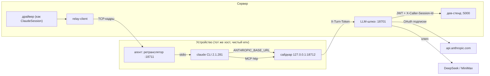

# Спайк ADR-016: CLI на «устройстве» через LLM-шлюз и сайдкар (2026-09-24)

Первый этап [ADR-016](../adr/ADR-016-local-projects.md). Вопрос спайка: пройдёт ли claude CLI,
запущенный «на устройстве», через серверный LLM-шлюз и сайдкар так, чтобы на стороне CLI не
было ни одного секрета. Код — [tools/local-projects-spike/](../../tools/local-projects-spike/)
(одноразовый, в продукт не встраивается).

**Итог одной строкой:** технически схема работает целиком, критерии 1–5 выполнены. Критерий 6
(условия Anthropic) — официальный текст прямо запрещает стороннему разработчику посредничать
токенами подписки от имени своих пользователей. Для владельца, который гоняет свою подписку на
своём сервере, однозначного ответа в тексте нет. Решение за владельцем продукта, см. §4.

## 1. Стенд

- **Устройство**: `CLAUDE_CONFIG_DIR=/tmp/ccs-spike/device/home/.claude` без логина. Env CLI
  собирается с нуля: `PATH`, `HOME`, `CLAUDE_CONFIG_DIR`, `ANTHROPIC_BASE_URL` (сайдкар),
  `ANTHROPIC_AUTH_TOKEN=device-placeholder`, `NO_PROXY`, `DISABLE_AUTOUPDATER`, `LANG`. Агент
  запущен с `env -i` (только `PATH`, `HOME`).
- **Шлюз** держит секреты в памяти, читает их из файлов на старте: access-токен личного логина
  `~/.claude/.credentials.json` (не пул прода, без refresh), ключи DeepSeek/MiniMax
  (из `appsettings.Local.json`, только чтение), JWT админа дев-стенда. Токен хода —
  `turn_<24 байта>`, выдаётся на ход и привязан к провайдеру и чату, TTL 15 мин.
- **Сайдкар** выбрасывает авторизацию CLI и ставит `X-Turn-Token`. Адрес хода
  `/t/{TurnId}/…`, токен хода знает только агент.
- **Дев-стенд** — этот worktree, `Development`, `DataPath=/tmp/ccs-spike/devdata`, `:5000`.
  Прод не трогался.
- **Ретранслятор** — кадры `[канал][длина][данные]` по TCP loopback. Kill идёт отдельным
  подключением по `TurnId`, CLI убивается группой процессов (`detached` + `kill -PGID`), по
  образцу `DockerProcessRunner`.

## 2. Критерии

| # | Критерий | Итог | Доказательство |
|---|---|---|---|
| 1 | Вход по подписке через шлюз, живой стрим, rate-limit у шлюза | **да** | Ход `c1-subscription`: `result=success`, `model=claude-sonnet-5`, exit 0. Стрим `c1-stream` (80 чисел текстом): у шлюза 75 чанков SSE за 8,1 с; дельты у драйвера приходят с 2,1 до 9,8 с, квантили p10–p90 от 6,8 до 9,4 с, то есть без склейки в конце. Шлюз видит `anthropic-ratelimit-unified-*` на каждом ответе (10 из 10): `5h-utilization`, `7d-utilization`, `*-reset`, `status`, `representative-claim`, `overage-status`, `fallback-percentage` |
| 2 | Сторонний провайдер, upstream выбирает шлюз | **да** (MiniMax), DeepSeek — **частично** | Провайдер задаёт токен хода, а не CLI. MiniMax (`MiniMax-M2.7`): `result=success`, 4 дельты, SSE 200. DeepSeek: шлюз подставил ключ, upstream ответил `402 Insufficient Balance`, а не 401: ключ принят, на счёте нет денег. Ключа GLM в `LlmProviders` нет, поэтому вторым провайдером взят MiniMax |
| 3 | MCP `tasks` и `memory` дев-стенда через сайдкар | **да** | `init.mcp_servers`: `tasks` и `memory` в статусе `connected`; 13 инструментов `mcp__tasks__*`, 5 `mcp__memory__team_memory_*` (чат без персоны отдаёт только командную память, так и задумано). `tools/call` прошли оба. Задача-маяк, созданная на дев-стенде по REST, вернулась из `tasks_list` дословно («Задача-маяк спайка»). `can_use_tool` пришёл по stdio через ретранслятор 2 раза, ответ `allow` ушёл обратно |
| 4 | `--resume`, interrupt по stdin, kill по TurnId | **да** | Resume: новый процесс с `--resume 61f82b81…` на вопрос «какое слово ты ответил?» ответил «ананас», `session_id` тот же. Interrupt: `control_request interrupt` на 8,86 с, через 43 мс `result=error_during_execution`. Второе сообщение в том же процессе дало `success` «готово», exit 0. Kill: `relay-client kill <TurnId>` → `{"killed":true}`, CLI получил `SIGKILL`, клиент ретранслятора вышел с кодом 137, `/proc/<pid>` пропал |
| 5 | Нет секретов в env и файлах устройства | **да** | `/proc/<pid>/environ` и `cmdline` живого CLI проверены в каждом ходе (9 ходов): ни одного совпадения с OAuth access/refresh, ключами DeepSeek/MiniMax, JWT, JWT-секретом стенда и токеном хода. Обыск каталога устройства после всех ходов: 19 файлов, 1,4 МБ, 15 значений (включая 9 выданных токенов хода) — 0 совпадений; env агента — только `PATH`, `HOME`. Сканер проверен мутацией: подложенный JWT найден, после удаления — 0 |
| 6 | Условия Anthropic для OAuth подписки через свой прокси | **неясно / скорее нет** | Цитаты и разбор — §4 |

Негативные проверки шлюза: без токена хода → 401; выдуманный токен → 401; валидный токен
и чужой хвост `/mcp/tasks/{другой чат}` → 403; сайдкар для неизвестного хода → 404; прямой
заход на MCP дев-стенда без JWT → 401.

## 3. Грабли

1. **CLI стучится в `GET {base}/api/hello` при старте.** У Anthropic это 200, у DeepSeek и
   MiniMax — 404 (ход не ломает). Шлюзу стоит отвечать на него самому, а не форвардить.
2. **Фоновые вызовы CLI идут на haiku** и при стороннем upstream упадут: у провайдера такой
   модели нет. Шлюз обязан переписывать `model` сам. `--model` на клиенте становится
   подсказкой, модель и провайдера окончательно определяет шлюз.
3. **`anthropic-beta: oauth-2025-04-20`.** CLI в режиме `ANTHROPIC_AUTH_TOKEN` его не шлёт.
   На 2026-09-24 OAuth-токен принимается и без него (проверено прямым запросом: 200 в обоих
   вариантах), но документация велит шлюзу его пробрасывать. Шлюз спайка добавляет его сам.
4. **TTL токена хода «минуты» (ADR-016 §2) не выживет у долгих ходов**: ходы идут часами.
   Токен нужно привязать к жизни хода и отзывать по его концу, либо сайдкар должен обновлять
   его через канал.
5. **Kill — только группой процессов.** CLI порождает детей (MCP-клиенты, Bash), поэтому
   агент запускает его в своей группе (`detached`) и бьёт `-PGID`, как docker-раннер.
6. **После `SIGKILL` в профиле остаётся `sessions/<pid>.json`** (и `.key` рядом). Агенту нужна
   уборка по убитому pid.
7. **Токен хода не нужен CLI вообще.** Он живёт в памяти агента, адрес хода несёт только
   `TurnId`. Заголовки контекста MCP (`X-Caller-Session-Id`) ставит шлюз по привязке токена,
   а не клиент. Хвост маршрута при этом сверяется с чатом токена.
8. **MCP streamable HTTP шлёт `GET` на эндпоинт** (дев-стенд отвечает 405). Сайдкар и шлюз
   обязаны пропускать любой метод, а не только `POST`.

Не проверялось (вне рамок спайка): `HTTPS_PROXY` для прочего трафика CLI и полный перечень
его исходящих адресов; буферизация stdout при обрыве канала; Windows/macOS-сторона агента;
канал ADR-008 вместо TCP loopback.

## 4. Условия Anthropic (критерий 6)

Источники прочитаны 2026-09-24.

**[Claude Code Docs — Legal and compliance](https://code.claude.com/docs/en/legal-and-compliance)**,
раздел «Authentication and credential use»:

> **OAuth authentication** is intended exclusively for purchasers of Claude Free, Pro, Max, Team,
> and Enterprise subscription plans and is designed to support ordinary use of Claude Code and
> other native Anthropic applications.

> **Developers** building products or services that interact with Claude's capabilities,
> including those using the Agent SDK, should use API key authentication through Claude Console
> or a supported cloud provider. Anthropic does not permit third-party developers to offer
> Claude.ai login into their own applications, or to route requests through Free, Pro, or Max
> plan credentials on behalf of their users. Moreover, developers may not collect, store, or
> intermediate Claude.ai credentials or session tokens — sign-in to a Claude account must
> complete through Anthropic's own flow.

> Nor does it prevent an end user from signing in to the unmodified Claude Code binary with
> their own Claude subscription, including where a platform hosts Claude Code as described under
> *Can customers offer Claude Code in their products?* above.

> Anthropic reserves the right to take measures to enforce these restrictions and may do so
> without prior notice.

Там же, раздел «Can customers offer Claude Code in their products?»:

> Customers may not pay for, resell, or intermediate Claude usage on their end users' behalf.
> Each end user must authenticate with their own Anthropic API key, Claude subscription plan
> credentials, or 3P inference provider credential […]

**[Claude Code Docs — Other LLM gateways](https://code.claude.com/docs/en/llm-gateway)**,
раздел «Subscriptions and gateways»:

> [`ANTHROPIC_BASE_URL`] is the variable that points Claude Code at the gateway. Setting only that
> variable, without a gateway credential, doesn't replace the subscription. Requests still route
> through the gateway, but a saved claude.ai login remains the active credential, so its usage
> limits and billing apply. Gateways that pass this traffic on to Anthropic must forward the
> OAuth capability in `anthropic-beta`.

**[Consumer Terms of Service](https://www.anthropic.com/legal/consumer-terms)** (действуют для
Free/Pro/Max), §2 и §3:

> You may not share your Account login information, Anthropic API key, or Account credentials
> with anyone else. You also may not make your Account available to anyone else.

> [You may not access or use …] Except when you are accessing our Services via an Anthropic API
> Key or where we otherwise explicitly permit it, to access the Services through automated or
> non-human means, whether through a bot, script, or otherwise.

Что из этого следует, без выводов сверх текста:

- **Шлюз, который хранит токен подписки и подставляет его за пользователей продукта,
  подпадает под прямой запрет** («collect, store, or intermediate … session tokens», «route
  requests through … plan credentials on behalf of their users»). Пул подписок, которым
  пользуются другие люди, упирается ещё и в запрет Consumer Terms передавать аккаунт.
- **Документированный допустимый вариант с шлюзом** — прокси только маршрутизирует, а
  активным credential остаётся **собственный логин пользователя в немодифицированном CLI на
  его машине**. Тогда токен подписки лежит на клиенте, а цель ADR-016 §2 («секреты не на
  клиенте») для подписки не выполняется.
- **Случай «владелец гоняет свою подписку через свой сервер для себя»** текст прямо не
  разбирает: запреты сформулированы для «third-party developers … on behalf of their users».
  Разрешения на него тоже нет. **Неясно**. Однозначный ответ, судя по самой странице, даёт
  только Anthropic («contact sales»).
- Для API-ключей и сторонних провайдеров схема шлюза прямо допускается («configuring an API
  key … for use by the customer's own authorized users»). У Anthropic есть и собственный
  шлюз ([Claude apps gateway](https://code.claude.com/docs/en/claude-apps-gateway), встроен
  в бинарь CLI с v2.1.195): upstream у него — API-ключ или облачный провайдер, подписок в
  списке нет.

## 5. Что меняется в ADR-016

1. **Открытый вопрос 1 разделяется.** Техническая часть закрыта спайком: подстановка
   токена подписки шлюзом работает. Юридическая часть остаётся открытой и требует решения
   владельца, варианты:
   (а) подписка для локальных проектов — только собственный логин пользователя на
   устройстве, шлюз лишь маршрутизирует (документированный путь; токен подписки на клиенте
   — осознанное исключение из §2);
   (б) локальные проекты — только API-ключи и сторонние провайдеры через шлюз;
   (в) шлюз с подпиской — только после письменного подтверждения Anthropic.
   Строку «секреты в env хода на клиенте» в «Отброшенных вариантах» при выборе (а) надо
   уточнить: отброшены ключи и JWT сервера, а не собственный логин пользователя.
2. **§2, токен хода:** TTL «минуты» меняется на «время жизни хода плюс отзыв по его концу»
   (грабля 4). Токен знает только агент, в env CLI его нет. `X-Caller-Session-Id` для MCP
   ставит шлюз по привязке токена, а хвост маршрута сверяется с чатом. Это строже нынешнего
   «заголовки контекста шлёт клиент».
3. **§2, шлюз:** модель переписывает шлюз, а не CLI (грабля 2), `/api/hello` шлюз
   обрабатывает сам (грабля 1), `anthropic-beta` с OAuth-возможностью пробрасывается.
4. **§3, раннер:** kill группой процессов и уборка `sessions/<pid>.json` в профиле
   устройства — обязанности агента (грабли 5–6). Контракт «stdio = процесс» подтверждён:
   `--permission-prompt-tool stdio`, interrupt и resume прошли через трубу без изменений в
   протоколе stream-json.
