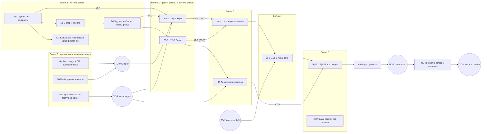

# План реализации «контекста хода»: строка, панель «Контекст», чипы действий

План собран по [ADR-023](../adr/ADR-023-turn-context.md): по черновику и дополнению 1 (Д1–Д7), таблица шагов — §Д5.
Ещё опоры: макеты [composer-context-row-v1](../mockups/composer-context-row-v1-proposal.md) и
[composer-actions-v1](../mockups/composer-actions-v1-proposal.md), заметка «Концепция строки контекста над полем
ввода» и решения Андрея из постановки (задача `2f1faa30`). Пути, имена классов, тестов и слотов я сверил с master
на `c6b78e74f` 2026-10-03. Расхождения с ADR перечислены в §6.

Шаги Александра (0в, 1б, 1ф, 2б, 2к, 2з, 3, 4) я не переставлял. Каждый разрезан на задачи по одной на заход,
граница разреза — вид объекта и секция панели (§Д5). Номер задачи состоит из номера шага и номера куска: `1б-2`,
`2к-1`.

## 0. Решения Андрея, которые план учитывает, и где они расходятся с документами

| # | Решение (постановка `2f1faa30`) | С чем расходится | Что делаем |
|---|---|---|---|
| Р1 | После «Работать с этой» выбрано **первое действие вида**. Объект от агента — выбран «Чат» | Макет `composer-actions-v1` §7 и раздел 1 («всегда „Чат“, решение Андрея 2026-10-03»); ADR §Д2.2, колонка «По умолч.» (у звука «Чат») | Правило хоста: человек → первое `run`-действие без `disabledReason`, если такого нет → «Чат»; агент → «Чат». Поле `defaultAction` из `ContextKindApi` убирается: порядок действий в каталоге и есть умолчание. **Точка подтверждения ТО-0** (ниже): два документа приписывают Андрею противоположное |
| Р2 | В режиме «Чат» строка **не показывает «Чем»** | Макет §7 («показывать — исполнитель первого действия»); ADR §Д2.1 (`ChatContextDto.executor` для строки без действия) | Чип «Чем» рисуется только при выбранном `run`-действии. В лестнице он тогда занимает 0 px. Хвост хода строку «Чем:» сохраняет: агенту она нужна для `*_generate`. Это намеренное исключение из «строка = хвост», его записывает Александр в 0а. Поле `executor` из DTO фронта убирается, `context_state` и хвост его сохраняют |
| Р3 | «Вариантов» и «Длительность» — только в панели. Текущее значение видно на кнопке запуска | Макет: на кнопке только `✦ {label} · {цена}` | Подпись кнопки строит одна точка `useActionRun.label`, формат даёт Майя в 0б (предложение: `✦ Изменить · 3 вар. · $0.12`, `✦ Снять · 8 с · $1.60`; при одном варианте число не пишется; цена не режется никогда) |
| Р4 | Порядок схлопывания строки — как в макете Майи (сначала слова «Чем» и ветки, потом референсы). Строка не зависит от открытости панели | Открытый вопрос 3 макета строки | Лестница из макета без поправок. Открытость панели в функцию лестницы не входит, входит только ширина строки. Сторож — юнит лестницы (1ф-2) |
| Р5 | Всё за флагом `composer-context-row` | — | Флаг заводит Денис в КТ-1, `FLAGS.composerContextRow` — Кира в 1ф-1 |
| Р6 | Блок 5 «Видео» не останавливаем. `feat/video-editor` вливается как есть после `959c4c02` и ревью Глеба. Переезд «Видео» — фаза 3 | — | Шаг 0в, точка ожидания ТО-1 |
| Р7 | `fix/composer-modes` вливается до фазы 1 | — | **Уже выполнено**: мерж `617ee18d6` в master, в ветке нет коммитов сверх master |
| Р8 | Мержи в master — только по слову Андрея | — | Мержи в плане — точки ожидания ТО-*, а не шаги исполнителя |

Следствие Р1, которое стоит увидеть до старта. По правилу «первое без серости» у **песни** умолчанием становятся
«Стемы»: «Перегенерировать кусок» сер, пока нет выделения. Значит, после «Работать с этой» на песне кнопка поля
сразу запускает разделение без текста. Предлагаю принять, потому что кнопка подписана `✦ Стемы · бесплатно` и
видно, что произойдёт. Если Андрей против, песня становится исключением и начинает с «Чата». Это решение ТО-0.

## 1. Волны

**Рабочее дерево фичи:** `/home/an/Sources/ClaudeCodeServer-turn-context`, ветка `feat/turn-context`. Его заводит
первая задача (1б-1).
- Если к старту 1б-1 ветка `feat/video-editor` уже влита (ТО-1), дерево заводится от свежего master.
- Если нет, дерево заводится от текущего master, а после ТО-1 исполнитель вливает master в `feat/turn-context`
  (задача М-1). Конфликтующие файлы — в §5.

**Второе дерево — только для Кузьмы:** `/home/an/Sources/ClaudeCodeServer-turn-context-k`, ветка
`feat/turn-context-k` от `feat/turn-context`. Кузьма не собирает в одном дереве с Денисом: общий `bin/obj` даёт
ложные красные. Его коммиты Денис забирает в `feat/turn-context` через `git cherry-pick`. Это локальная операция
внутри фичи, не мерж в master.

**Лимит «двое на стенде»** считается по Денису, Кире и Кузьме. Глеб (ревью), Майя и Александр (документы) и Вера на
приёмке в нём не участвуют. Вера стоит отдельной волной, когда исполнители не на стенде.



| Волна | Денис | Кира | Кузьма | Прочие | Старт |
|---|---|---|---|---|---|
| 0 | — | **0в** в `feat/video-editor` | — | **0а** Александр, **0б** Майя, ревью 0в — Глеб | сразу |
| 1 | **1б-1** (КТ-1), **1б-2**, **1б-3** | 0в, затем ждёт ТО-1 и КТ-1 | **К1**, **К2** — только пока Кира не на стенде | Глеб: КТ-1 в день коммита | 1б-1 сразу; К1/К2 — после КТ-1 и закрытия 0в |
| 2 | **2б-0** (КТ-3), **2б-1…2б-5** | **1ф-1** (КТ-4), **1ф-2**, **1ф-3**, **1ф-4** | — | Глеб после каждой задачи | 1ф-1 — после КТ-1 и ТО-0; 1ф-2 и дальше на живом API — после КТ-2; 2б-0 — после ревью 1б-3 |
| 3 | **3б-0** (КТ-5), **3б-1** | **2к-1**, **2к-2**, **2к-3** | — | — | 2к — после КТ-3 и КТ-4; 3б — после ТО-1 и 2б-5 |
| 4 | свободен: ревью-правки, М-2 | **2з-1**, **2з-2**, **2з-3** | — | — | 2з — после 2к и ТО-2 (вопрос 1) |
| 5 | — | **3ф-1**, **3ф-2**, **3ф-3** | **К3** (слот Дениса свободен) | — | 3ф — после КТ-5 и 2з |
| 6 | правки по Вере | правки по Вере | — | **4а** Вера, Софья — «Что нового» | после 3ф-3 и М-2 |
| 7 | **4в** | **4б-1**, **4б-2** | **К4** вместо части 4в, если Денис занят | Александр — финальное ревью | после ТО-3 |

Правила хода по волнам:
- Следующая задача того же исполнителя стартует после «блокеров нет» от Глеба. Замечания уровня minor
  исполнитель закрывает первым коммитом следующей задачи.
- Если Андрей не ответил на ТО-0 к старту 1ф-4, Кира делает 1ф-4 с умолчанием «Чат» и одной функцией
  `pickDefaultAction`, которую потом меняет одна строка. Каталоги действий 2к и дальше не зависят от ответа.
- Если ТО-1 откладывается дольше, чем Кира идёт до 1ф-1, она стартует на master. Тогда конфликт `panelCatalog.ts`,
  `genPanelDismissed.ts`, `registryCore.ts` и `shell-kit/index.ts` при вливании видео решает она же (задача М-1).

## 2. Контрольные точки и точки ожидания

### Контрольные точки (ревью Глеба до того, как вторая сторона строит)

- **КТ-1. Контракты бэкенда фазы 1** — первый коммит 1б-1, ревью Глеба в тот же день. Состав — в тексте 1б-1.
  Пока КТ-1 не принята, Кира не пишет TS-типы, а Кузьма не стартует.
- **КТ-2. Живой API контекста** — конец 1б-3. REST, событие `chat_context_changed`, засев из фокусов, двойная
  запись фокуса. Кира переводит `lib/chatContext` с моков на сервер.
- **КТ-3. Контракт запуска по ревизии** — первый коммит 2б (задача 2б-0). Это поле `ContextRevision` в котировках и
  запусках картинки и звука, тело `409 context_changed`, строки исполнителей в ответе `quote`, `usedBy` в DTO. На
  этом контракте Кира пишет `launch` и `executors` видов в 2к и 2з.
- **КТ-4. Контракт фронтового кита** — первый коммит 1ф-1. Это `ContextKindApi`, `ContextAction`, `LaunchParam`,
  сигнатура `useActionRun`, `ContextReturn`, предвыбор. Ревью Глеба; Александр смотрит соответствие ADR (чтение,
  полчаса). На нём строятся вклады вертикалей 2к, 2з и 3ф.
- **КТ-5. Контракт видео** — первый коммит 3б-0: провайдеры `video-scene`/`video-film`, `ContextRevision` в
  `VideoQuoteRequest`/`VideoLaunchRequest`/`films/build`.
- **КТ-6. Перед Верой** (задача М-2): влить свежий master в `feat/turn-context`, полный `dotnet test`,
  `npm run build`, `lint:design`, все e2e фичи.

### Точки ожидания (решает Андрей, исполнители не делают)

- **ТО-0. Подтвердить Р1 и Р2** против макета §7, включая следствие для песни. Нужно до 1ф-4 и до 0б.
- **ТО-1. Мерж `feat/video-editor` в master** после 0в и ревью Глеба. Нужно до 3б (жёстко) и желательно до 1ф-1.
- **ТО-2. Открытые вопросы дополнения:** (1) чипы черновика «Новый звук» — предложение «Озвучить · Песня ·
  Эффект»; (2) «Обучить голос» — кнопкой в «Голосах» или только агенту; (3) `enhanceFaces` и `EditMode` уходят
  к агенту. Без ответа на (1) **2з-1 не стартует**. По (3) 2к-1 идёт по предложению (только агенту): добавить чип
  потом дешевле, чем убрать.
- **ТО-2а. Мерж `fix/composer-memory`** (2 коммита: чистка памяти поля и полос при удалении чата и выходе). Нужно
  до 1ф-1, иначе `actionMemory` не получит ту же чистку. Если отложен, 1ф-1 переносит хук чистки к себе.
- **ТО-3. Снять флаг** после приёмки Веры — решение Андрея по её отчёту.
- **ТО-4. Мерж `feat/turn-context` в master.** Рекомендую промежуточный мерж под выключенным флагом после фазы 2
  (ТО-4а): фича трогает горячие файлы (`Composer.tsx`, `ChatPanel.tsx`, `SessionManager.cs`), а три фазы без
  мержа — это гарантированный тяжёлый конфликт.

## 3. Тексты задач

Общие правила (они уже вставлены в каждую задачу ниже, повторять не надо):
- дерево `/home/an/Sources/ClaudeCodeServer-turn-context`, ветка `feat/turn-context` (у Кузьмы — своё, указано
  в его задаче). Коммиты локальные, сразу по зелёным критериям; `git add` только своими путями, никогда `-A`;
  push не делать;
- стенд — на временной `data` и своём порту (`docs/operations/dev-stand-host.md`): Денис `:5321`, Кира `:5322`,
  Кузьма `:5323`, Вера `:5324`. Гасить стенд только по PID: `pkill -f ClaudeHomeServer.dll` однажды уронил прод;
- Conventional Commits по-русски с трейлером `Co-Authored-By`; мутация — сломать на минуту, увидеть красное,
  вернуть;
- по готовности — ревью Глеба; в итог задачи — вывод команд проверки и результат мутаций. Нет свидетельства — не
  готово.

---

### 0а. Дополнение 2 к ADR-023: решения Андрея от 2026-10-03 — Александр, сильная модель

**Что сделать:** дописать в `docs/adr/ADR-023-turn-context.md` раздел «Дополнение 2» и пометить пересмотренные
места дополнения 1 короткими врезками «Пересмотрено в Дополнении 2», по образцу врезки в §2.2. Состав:
1. **Умолчание действия.** Объект человека → первое `run`-действие без `disabledReason`, иначе «Чат». Объект агента
   → «Чат». Поле `defaultAction` удалить из `ContextKindApi` (§Д1). Колонку «По умолч.» таблицы §Д2.2 пересчитать
   по правилу: у песни это «Стемы», у звука-черновика — первое из ответа на ТО-2 (1). Правило «после запуска
   выбор остаётся, если есть действие с тем же `id`, иначе „Чат“» не меняется.
2. **«Чем» в «Чате».** Строка чип «Чем» не рисует; лестница считает его как 0. Секция «Чем» панели в «Чате» —
   пустое состояние «Исполнитель появится, когда в поле выбрано действие». Поле `executor` убрать из
   `ChatContextDto` (§2.1, §Д2.1). Хвост хода и `context_state` строку «Чем:» сохраняют — записать как намеренное
   исключение из инварианта «строка = хвост», с причиной: агенту исполнитель нужен для `*_generate`. Поправить
   строку `TurnContextParityTests` в §4: паритет — по «С чем» и «Плюс».
3. **Параметры на кнопке.** «Вариантов» и «Длительность» живут только в панели; кнопка поля и низ панели
   показывают текущее значение (формат — из макета Майи 0б). Источник подписи — `useActionRun.label`.
4. **Лестница не зависит от панели.** Закрыть открытый вопрос 3 макета строки словом «нет».
5. **Расхождения кода с ADR**, найденные при раскладке (§6 этого плана): `Composer.tsx` и `ChatPanel.tsx` лежат в
   `components/`, а не в `components/chat/`; тулсеты живут в Main `Services/Mcp/Http`, а не в Core;
   `createReleaseUndo` и `RELEASE_UNDO_MS` лежат в `components/generation/useReleaseUndo.ts`; ручка
   «сохранённые в чате файлы» (`IChatSavedFiles`) нужна фронту для `commitViaChat` — добавить её в таблицу REST.
6. В шапке статуса — «Дополнение 2 принято», ссылка на этот план.

**Читать:** ADR-023 целиком; `docs/mockups/composer-actions-v1-proposal.md` §1, §7; этот план, §0 и §6.
**Где писать:** только `docs/adr/ADR-023-turn-context.md`. **Не трогать:** код, макеты.
**Готово, когда:** в ADR нет мест, противоречащих Р1–Р4; врезки стоят у §Д1 (контракт), §Д2 (правила хоста),
§Д2.1 («Откуда „Чем“»), §Д2.2 (колонка), §4 (паритет). Проверка: `grep -n "defaultAction\|executor" docs/adr/ADR-023-turn-context.md` — каждое вхождение либо помечено пересмотром, либо в
Дополнении 2.
**Коммит:** не коммитить — ADR в основном дереве лежит неотслеживаемым; Андрей коммитит его вместе с макетами.

---

### 0б. Правка макетов под решения Андрея — Майя, сильная модель

**Что сделать** в `docs/mockups/composer-actions-v1.html` и `composer-actions-v1-proposal.md` (макет строки трогать
только в части «Чем»):
1. «Работать с этой» ставит первое действие вида (Р1), агент — «Чат». Пересчитать клики сценариев 1 и 9 (шаг
   «Чип „Изменить“» уходит) и обновить §7 таблицы решений.
2. В «Чате» чипа «Чем» в строке нет (Р2); лестница строки с этим учётом. В `composer-context-row-v1` проверить
   сценарии, где поле «Чат», и пороги §«Пороги» — пересчитать, если у типового состояния «Чат».
3. Подпись кнопки запуска с параметрами (Р3): варианты больше одного, длительность сцены. Дать формат для
   десктопа и для 360, где кнопка узкая. Цена не режется никогда.
4. Песня по умолчанию на «Стемах» (следствие Р1) — показать кадр, чтобы Андрей решил ТО-0 по картинке.

**Читать:** этот план §0; макеты и их proposal; `docs/design/guidelines.md`.
**Проверка:** прогон `.cc-attachments/composer-actions/run.mjs` и `.cc-attachments/composer-context-row/run.mjs`
зелёный, мутация `--mutate` красная; скриншоты изменённых кадров в `.cc-attachments/composer-actions/`.
**Коммит:** не коммитить (макеты в основном дереве неотслеживаемые), в итоге — список изменённых кадров.

---

### 0в. Доработка `959c4c02` и вливание `feat/video-editor` — Кира

Это существующая задача трекера `959c4c02` (чат в ручках фильма, загрузка кадра, тексты ленты) в дереве
`/home/an/Sources/ClaudeCodeServer-video-editor`. План её не переписывает. Добавляется одно условие закрытия:
зелёные `dotnet test` (из `backend/`), `npm run build`, `npm run lint:design`, `npx playwright test e2e/video-editor.spec.ts` на стенде ветки. Потом ревью Глеба по всей ветке и **ТО-1**: мерж делает Андрей или по
его слову.

---

### 1б-1. КТ-1: контракты контекста чата и дерево фичи — Денис, сильная модель

**Первое действие — завести дерево:**
```
cd /home/an/Sources/ClaudeCodeServer
git worktree add -b feat/turn-context /home/an/Sources/ClaudeCodeServer-turn-context master
```
Проверь, влита ли `feat/video-editor` (`git branch --merged master | grep video-editor`), и запиши ответ в итог: от
этого зависит задача М-1.

**Что сделать — только контракты, в первый день, до любой реализации:**
1. `backend/ClaudeHomeServer.Core/Services/ChatContext/` (namespace `ClaudeHomeServer.Services.ChatContext`):
   `ChatContextState`, `ContextItem`, `ContextActor`, `IChatContextStore`, `IContextKindProvider`, `ContextScope`,
   `ContextItemSummary`, `ContextRoleSpec`, `IChatSavedFiles` — ровно по ADR-023 §1 и §2.1. Плюс
   `ContextKindRegistrationExtensions.AddContextKindProvider<T>()` по образцу
   `Core/Services/Turn/PromptSectionContributorRegistrationExtensions.cs`.
2. Строку `ClaudeHomeServer.Services.ChatContext` в `CoreAllowedNamespaces` (`ClaudeHomeServer.Tests/Services/SubsystemBoundaryTests.cs`; там же `SubsystemBoundaryCoverageTests`).
3. `Core/Protocol`: `ChatContextDto { revision, primary, refs[] }`. Элемент: `id`, `kind`, `ref`, `role`, `by`,
   `addedAt`, `label`, `version`, `thumb`, `missing`, у референса `usedBy: string[]`. **Без `executor`** — Р2;
   если 0а ещё не принят, всё равно без него, а «Чем» вернётся котировкой (КТ-3). Плюс
   `ChatContextChangedMessage` (событие `chat_context_changed`, полный DTO).
4. Коды ошибок константами `Core/Services/ChatContext/ChatContextErrors.cs`: `context_changed` (409, тело —
   свежий DTO), `kind_unknown`, `ref_invalid`, `role_not_accepted`, `refs_limit` (больше 16),
   `project_local_unsupported`.
5. Маршруты константами и таблица REST — ADR §2.1. Добавь `GET api/chats/{sessionId}/context/saved-files` →
   `[{path, threadKind, savedAt}]` для `commitViaChat` (ADR §3.3, сосед `IChatSavedFiles`).
6. Флаг `composer-context-row` в `FeatureFlagCatalog.All` (`backend/ClaudeHomeServer.Core/Models/FeatureFlag.cs`),
   `Default: false`. Title и описание — из «Что нового» заметки-концепции §7.
7. Раздел **«Контракты (JSON)»** в конце ADR-023: пример `ChatContextDto` с объектом картинки, референсами
   `image-character` и `project-file`, серым референсом с `usedBy: []`, пример тела `409`.
8. Тест `ChatContextContractsTests` (`ClaudeHomeServer.Tests/Services/ChatContext/`): JSON-примеры из ADR
   десериализуются в контракты и сериализуются обратно без потерь (camelCase, enum `by` строкой).

**Закоммить и попроси Глеба посмотреть КТ-1 в тот же день.** После КТ-1 контракт меняется только отдельным
коммитом `refactor(chatContext): контракт …` и строкой Кире в отчёте задачи.

**Читать первым:** ADR-023 §1, §2.1, §2.4, §4 и «Дополнение 1» §Д2.1; этот план §0; `docs/adr/ADR-014-internal-subsystems.md`
(раздел про сторожей границ); `backend/ClaudeHomeServer.ImageEditor/CLAUDE.md`.
**Образцы:** форма Core-контрактов — `Core/Services/ImageEditor/`, `Core/Services/AudioEditor/`; события —
`Core/Protocol/ServerMessage`; флаг — соседние строки `FeatureFlagCatalog.All`.
**Где писать:** `Core/Services/ChatContext/**`, `Core/Protocol/*ChatContext*`, `FeatureFlag.cs`, две строки в
сторожах границ, тест контрактов, раздел в ADR-023.
**Где НЕ писать:** `frontend/**`; реализацию стора и ручек (1б-2, 1б-3); код вертикалей.
**Готово, когда:** `dotnet build ClaudeHomeServer.slnx` зелёный; тест контрактов зелёный; сторожа границ зелёные.
**Команды (из `backend/`):**
```
dotnet build ClaudeHomeServer.slnx
dotnet test ClaudeHomeServer.Tests --filter "FullyQualifiedName~ChatContextContracts|FullyQualifiedName~SubsystemBoundary|FullyQualifiedName~IlBoundaryRegression"
```
**Мутация:** переименовать поле `usedBy` в record — тест контрактов краснеет; убрать строку из
`CoreAllowedNamespaces` — `SubsystemBoundaryTests` краснеет.
**Коммиты:** `feat(chatContext): контракты контекста чата (КТ-1)`; `docs(ADR-023): контракты JSON`.
**Общие правила:** дерево `ClaudeCodeServer-turn-context`, ветка `feat/turn-context`; локальные коммиты своими
путями, без push; стенд `:5321`, гасить по PID; ревью Глеба; в итоге — вывод команд и мутаций.

---

### 1б-2. Стор контекста и реестр видов — Денис, сильная модель, после КТ-1

**Что сделать:**
- `ChatContextStore : IChatContextStore` на `JsonFileStore` (`Core/Services/JsonFileStore.cs`), файл
  `data/chat-context/{ownerId}/{sessionId}.json`. Ревизия на запись; чужая ревизия → исключение с текущим
  состоянием (контроллер сделает из него `409`); `null` у агента — без сверки.
- Правила стора из ADR §1: основной объект один поперёк вертикалей; `SetPrimary` снимает тот же объект из
  референсов; не больше 16 референсов (`refs_limit`); дубль «тот же `Kind` + `Ref` + `Role`» не добавляется;
  `Forget(match)` без ревизии.
- `ContextKindRegistry`: собирает `IEnumerable<IContextKindProvider>`, бросает исключение при сборке, если два
  провайдера объявили один `Kind`. Стор пускает только зарегистрированные виды, `Validate` зовёт провайдера.
- Рассылка изменения — через существующий канал владельцу (как `image_thread_changed`), само событие
  `ChatContextChangedMessage` из КТ-1.
- Регистрация в Main одной строкой (композиция).

**Тесты** (`ClaudeHomeServer.Tests/Services/ChatContext/`):
- `ChatContextStoreTests`: ревизия и конфликт; один основной объект; снятие референса при `SetPrimary`; потолок 16;
  дубль; `Clear`; `Forget`; файл ключуется владельцем — чужой владелец не видит чужого файла;
- **`UpdatedAt` не двигается**: `SetPrimary`/`AddRef`/`Clear` не меняют `Session.UpdatedAt` и `IsArchived`;
- `ContextKindRegistryTests`: дубль вида → исключение при сборке реестра.
Ожидание событий — через `TaskCompletionSource`, не `Task.Delay`; пути — `Path.GetTempPath()` + `Path.Combine`
(CI на Linux).

**Читать:** ADR-023 §1, §4; `docs/architecture/conventions.md` (раздел про бэкап и `UpdatedAt`).
**Образцы:** стор нитей с ревизией — `ImageEditor/Threads/ImageThreadService.cs` и его хранение;
`JsonFileStoreTests`.
**Где писать:** `Core/Services/ChatContext/ChatContextStore.cs`, `ContextKindRegistry.cs`, регистрация в Main,
тесты. **Где НЕ писать:** контроллер (1б-3), вертикали, `frontend/**`.
**Готово, когда:** все тесты выше зелёные, бэкап не трогали (каталог в `data/` попадает в архив сам, формат
аддитивный).
**Команды:**
```
dotnet build ClaudeHomeServer.slnx
dotnet test ClaudeHomeServer.Tests --filter "FullyQualifiedName~ChatContext|FullyQualifiedName~BackupPaths|FullyQualifiedName~SubsystemBoundary"
```
**Мутации:** убрать сверку ревизии — тест конфликта краснеет; писать контекст полем в `Session` — тест `UpdatedAt`
краснеет; убрать проверку дубля в реестре — `ContextKindRegistryTests` краснеет.
**Коммит:** `feat(chatContext): стор контекста чата и реестр видов`.
**Общие правила:** дерево `ClaudeCodeServer-turn-context`, ветка `feat/turn-context`; локальные коммиты своими
путями, без push; стенд `:5321`, гасить по PID; ревью Глеба; в итоге — вывод команд и мутаций.

---

### 1б-3. Ручки, событие, засев и двойная запись фокуса (КТ-2) — Денис, сильная модель, после 1б-2

**Что сделать:**
- `backend/ClaudeHomeServer/Controllers/ChatContextController.cs`, `[Authorize]`, владелец из `sub`, сессия через
  `GetOwned` (чужая → 404). Пять ручек ADR §2.1 плюс `saved-files` из КТ-1. `409 context_changed` со свежим DTO.
  Локальный проект (ADR-016) — отказ через `ProjectCapabilities`, без инлайнового `IsLocal`.
- **DTO** собирает спина: для каждого элемента — `Describe` провайдера владельца; выключенная вертикаль (нет
  провайдера) → `missing: true`, без 500.
- **Засев:** GET чата без файла возвращает производное состояние из фокусов вертикалей (картинка, если есть,
  иначе звук) и ничего не пишет. Файл появляется на первой записи.
- **Провайдеры `image` и `audio`** в вертикалях — только `Validate` и `Describe` (без `AcceptedRefs`,
  `DescribeExecutor`): `ImageEditor/ChatContext/ImageContextKind.cs`, `AudioEditor/ChatContext/AudioContextKind.cs`,
  регистрация `AddContextKindProvider<T>()` в `*Subsystem.Register`. `Validate` проверяет, что нить принадлежит
  владельцу и чату; в личном чате — без проектных путей.
- **Двойная запись фокуса:** `ImageThreadService` и `AudioJobThreads` при смене фокуса пишут своё `Focus` и при
  флаге владельца — `SetPrimary`. DTO вертикали при флаге отдаёт фокус проекцией из контекста:
  `focus = primary.kind == своё ? primary.threadId : null`. Без флага — своё поле, как сейчас. Вертикаль зовёт
  `IChatContextStore` (Core), а не другую вертикаль.
- Удаление нити → `Forget(match)` в своей вертикали.
- `ChatContextDisabledVerticalTests` (`ClaudeHomeServer.Tests/Subsystems/`): `Subsystems:AudioEditor:Enabled=false`
  при элементе `audio` в файле — GET отдаёт `missing`, ручки не 500.

**Читать:** ADR-023 §1, §2.1, §4, §5 фаза 1 (двойная запись, засев); `backend/ClaudeHomeServer.ImageEditor/CLAUDE.md`,
`backend/ClaudeHomeServer.AudioEditor/CLAUDE.md`; ADR-014, раздел «Пилот отключаемости».
**Образцы:** контроллеры нитей картинок (`ImageEditor/Controllers/`); `Subsystems/AudioEditorDisabledTests.cs`;
проверка владельца — существующие `Personal*Controller`.
**Где писать:** контроллер в Main; `ImageEditor/ChatContext/**`, `AudioEditor/ChatContext/**`; точечные правки
фокуса в `ImageThreadService.cs` и `AudioJobThreads.cs`; тесты в `ClaudeHomeServer.Tests`,
`ClaudeHomeServer.ImageEditor.Tests`, `ClaudeHomeServer.AudioEditor.Tests`.
**Где НЕ писать:** `frontend/**`; хвост хода и запуски (2б); `SessionManager.cs`.
**Готово, когда:** на стенде `:5321` с флагом: `curl` по пяти ручкам даёт ожидаемое, событие приходит в хаб;
выбор картинки в старой полосе (флаг включён) виден в GET контекста; без флага вертикали работают как раньше.
**Команды:**
```
dotnet build ClaudeHomeServer.slnx
dotnet test ClaudeHomeServer.Tests --filter "FullyQualifiedName~ChatContext|FullyQualifiedName~SubsystemBoundary|FullyQualifiedName~IlBoundaryRegression|FullyQualifiedName~AudioEditorDisabled|FullyQualifiedName~ImageEditorDisabled"
dotnet test ClaudeHomeServer.ImageEditor.Tests
dotnet test ClaudeHomeServer.AudioEditor.Tests
```
**Мутации:** временная ссылка AudioEditor на тип провайдера ImageEditor — `SubsystemBoundaryTests` краснеет;
убрать `GetOwned` — тест «чужая сессия → 404» краснеет; убрать проекцию фокуса при флаге — тест вертикали
краснеет.
**Коммиты:** `feat(chatContext): ручки контекста чата и событие`; `feat(imageEditor): вид image и двойная запись
фокуса`; `feat(audioEditor): вид audio и двойная запись фокуса`.
**Сообщи Кире в отчёте задачи:** КТ-2 готова, порт стенда, как включить флаг.
**Общие правила:** дерево `ClaudeCodeServer-turn-context`, ветка `feat/turn-context`; локальные коммиты своими
путями, без push; стенд `:5321`, гасить по PID; ревью Глеба; в итоге — вывод команд и мутаций.

---

### К1. Жизненный цикл контекста по шине — Кузьма, после КТ-1

**Что сделать:** один класс `ChatContextLifecycle` в `backend/ClaudeHomeServer.Core/Services/ChatContext/`: на
`session/deleted` удаляет файл `data/chat-context/{ownerId}/{sessionId}.json`, на `session/branched` копирует
файл источника под новый `sessionId`. Плюс тест на оба события.
**Образец целиком:** `backend/ClaudeHomeServer.ImageEditor/Threads/ImageThreadLifecycle.cs` и
`ClaudeHomeServer.AudioEditor.Tests/Threads/AudioThreadLifecycleTests.cs`. События —
`Core/Services/Turn/TurnEvents.cs:117–134`.
**Файлы:** ровно два — `ChatContextLifecycle.cs` и `ClaudeHomeServer.Tests/Services/ChatContext/ChatContextLifecycleTests.cs`.
Регистрацию одной строкой добавит Денис при cherry-pick, ты её не пишешь.
**Готово, когда:** тест зелёный; удаление стирает только файл с точным именем, не по маске.
**Команды (из `backend/`):** `dotnet test ClaudeHomeServer.Tests --filter "FullyQualifiedName~ChatContextLifecycle"`.
**Мутация:** удалять по маске `*{sessionId}*` — тест «соседний файл цел» краснеет.
**Коммит:** `feat(chatContext): жизненный цикл контекста на удалении и ветвлении чата`.
**Правила:** своё дерево `/home/an/Sources/ClaudeCodeServer-turn-context-k`, ветка `feat/turn-context-k`
(`git worktree add -b feat/turn-context-k /home/an/Sources/ClaudeCodeServer-turn-context-k feat/turn-context`); стенд не поднимать;
фоновых субагентов не запускать; ревью Глеба; в итоге — вывод теста и мутации.

### К2. Встроенный вид `project-file` — Кузьма, после К1

**Что сделать:** `ProjectFileContextKind : IContextKindProvider` в `Core/Services/ChatContext/`, вид `project-file`,
`Ref = {path}`. `Validate`: путь через `ProjectLinkGuard.ResolveInside`
(`Core/Services/Media/ProjectLinkGuard.cs`), в личном чате (`Project == null`) — отказ до `RootPath`. `Describe`:
имя файла, `missing`, если файла нет. `AcceptedRefs` и `DescribeExecutor` — пусто/`null` (вид не бывает основным).
**Файлы:** `ProjectFileContextKind.cs` и тест рядом с К1.
**Готово, когда:** тест покрывает путь внутри, `..`, символическую ссылку наружу, личный чат, пропавший файл.
**Команды:** `dotnet test ClaudeHomeServer.Tests --filter "FullyQualifiedName~ProjectFileContextKind"`.
**Мутация:** заменить `ResolveInside` на `Path.Combine` — тест `..` краснеет.
**Коммит:** `feat(chatContext): вид project-file с проверкой пути`.
**Правила:** те же, что у К1.

---

### 1ф-1. КТ-4: фронтовый кит контекста и TS-контракты — Кира, сильная модель, после КТ-1 и ТО-0

**Первый коммит — контракт кита (КТ-4)**, ревью Глеба до остальной работы:
- `frontend/src/lib/chatContext/types.ts`: `ChatContextDto` и элемент — по КТ-1; `ContextKindApi` по §Д1 с
  правками 0а (нет `mode`, `open`, `defaultAction`); `ContextAction`, `ActionKind`, `LaunchParam` (закрытое
  объединение), `ContextKindCtx`, `KindState`, `ContextReturn`, предвыбор `{actionId, prefill?, params?}`;
  сигнатура `useActionRun(sessionId)` → `{ action, label, quote, state, progress, result, run(text) }` и
  `launch(ctx, {op, text, params, contextRevision})`.
- `SLOT_CONTEXT_KIND = 'context-kind'` в `lib/subsystems/registryCore.ts`, экспорт через `lib/shell-kit/index.ts`.
- `FLAGS.composerContextRow = 'composer-context-row'` в `lib/featureFlags.ts`.

**Дальше:**
- `lib/chatContext/store.ts`: `useChatContext(sessionId)`, `setPrimary`, `attachRef`, `detachRef`, `clearContext`,
  `releasePrimary` с «Вернуть» на 4 с (`createReleaseUndo`, `RELEASE_UNDO_MS` из
  `components/generation/useReleaseUndo.ts`). Кэш `Map<sessionId, ChatContextDto>` поверх `useSyncExternalStore`;
  источник — GET, `chat_context_changed`, перечитка на `onReconnected`. `409` → подставить DTO из тела.
- `lib/chatContext/actionMemory.ts`: память выбора чипа — перенос `composerModeMemory` из `lib/composerModes.ts`
  с ключом `{sessionId}:{kind:ref}` и id действия вместо id режима; `presetAction(sessionId, objectKey, preset)`;
  `pickDefaultAction(actions, by)` по Р1 (одна функция, при неотвеченной ТО-0 — «Чат»). Чистка при удалении чата и
  выходе — тем же хуком, что `fix/composer-memory` (если ТО-2а не влит — перенести хук сюда).
- `lib/chatContext/contextReturn.ts`: `setContextReturn`, `useContextReturn`, `clearContextReturn` (§Д1).
- Фронтовый реестр видов: дубль `kind` в двух вкладах `context-kind` → исключение (зеркало
  `ContextKindRegistryTests`).
- До КТ-2 — мок API рядом с тестами; после КТ-2 — живой стенд.

**Читать:** ADR-023 §2.2, §Д1, §Д2, Дополнение 2 (0а); этот план §0; `docs/design/guidelines.md`;
`backend/ClaudeHomeServer.ImageEditor/CLAUDE.md` (фронтовая часть).
**Образцы:** стор нитей `features/imageEditor/thread/threadStore.ts` (кэш, событие, перечитка); `lib/composerModes.ts`
и его тест; `lib/genPanelFollow.ts`.
**Где писать:** `frontend/src/lib/chatContext/**`, `registryCore.ts`, `shell-kit/index.ts`, `featureFlags.ts`, тесты
рядом. **Где НЕ писать:** `backend/**`; `features/**`; `Composer.tsx` и `ChatPanel.tsx` (1ф-2, 1ф-4).
**Готово, когда:** юниты стора (событие, перечитка, `409`, «Вернуть»), памяти действия (ключ объекта, ручной
«Чат» держится, `pickDefaultAction` для человека и агента), реестра (дубль) зелёные.
**Команды (из `frontend/`):**
```
npx tsc -b
npx vitest run src/lib/chatContext src/lib/composerModes.test.ts src/lib/subsystems
npm run lint
```
**Мутации:** `pickDefaultAction` для агента возвращает первое действие — юнит краснеет; убрать перечитку на
`onReconnected` — юнит краснеет.
**Коммиты:** `feat(chatContext): контракт кита контекста хода (КТ-4)`; `feat(chatContext): стор контекста,
память действия и возврат`.
**Общие правила:** дерево `ClaudeCodeServer-turn-context`, ветка `feat/turn-context`; локальные коммиты своими
путями, без push; стенд `:5322`, гасить по PID; ревью Глеба; в итоге — вывод команд и мутаций.

---

### 1ф-2. Строка контекста `ContextRow`, git-чип и «Руки» — Кира, сильная модель, после 1ф-1 и КТ-2

**Что сделать:**
- `components/chat/ContextRow.tsx` (30 px, на телефоне 32): чипы «Где», «С чем», «Чем», «Плюс», `+N ›` со списком
  подключённого и «Очистить контекст»; серые референсы; ✦ у объекта отдельной кнопкой с подсказкой «Открыть».
  Подписи — только из DTO (`label`, `version`), своих форматтеров нет.
- **«Чем» в «Чате» не рисуется** (Р2): читает выбранное действие из `actionMemory`. В 1ф-4 действий ещё нет, поэтому
  в живом UI чип «Чем» до 2к не появится; проверка — витриной и юнитом лестницы с фикстурой выбранного действия.
- **Лестница** — чистая функция `contextRowLadder(width, facts)` по таблице макета строки (ступени 0…6+N−1 и
  прокрутка). Вход — ширина и дискретные факты; **открытость панели во вход не входит** (Р4). DOM внутри не
  меряется.
- Хук `useGitChip` вынести из `components/ProjectGitBar.tsx`; меню ветки — те же `handleCommitOwn` /
  `handleCommitAll` из `components/ChatPanel.tsx` (`commitViaChat`, `:1162–1191`). Список сохранённых в чате файлов
  в промпт поручения — из `GET …/context/saved-files` (КТ-1), если ручка пуста — как сейчас.
- `components/ChatPanel.tsx`: при флаге `ContextRow` вместо `ComposerStripHost` (`:2883`); без флага — как сейчас.
- «Руки»: `features/localHands/handsStripManifest.tsx` при флаге вкладывает пилюлю в `composer-chip` вместо
  `composer-strip`; `requestStrip`/`releaseStrip` в `applyHandsFocus` при флаге не вызываются. Иначе флаг отнимает
  руки.
- Телефон: строка прокручивается, ветка иконкой с бейджем, меню — шторками.
- Витрина `src/dev/UiKitPage.tsx`: раздел «Строка контекста», все ступени, обе темы.

**Читать:** `docs/mockups/composer-context-row-v1-proposal.md` целиком и `.html`; правки Майи 0б; ADR §2.2, §3.3;
`docs/design/guidelines.md`, `docs/design/target-devices.md`.
**Образцы:** лестница по номиналам — `docs/mockups/composer-strip-priority.md` и `lib/composerStrip.ts`; `ComposerStripHost.tsx`;
`ProjectGitBar.tsx`; `components/generation/ExecutorList.tsx` для меню «Чем».
**Где писать:** `components/chat/ContextRow*.tsx`, `lib/chatContext/ladder.ts`, хук git-чипа,
`components/ChatPanel.tsx` (ветка под флагом), `handsStripManifest.tsx`, витрина, тесты.
**Где НЕ писать:** `backend/**`; `features/imageEditor/**`, `features/audioEditor/**`; `Composer.tsx` (1ф-4).
**Готово, когда:** юнит лестницы по таблице порогов макета (707/597/523/485/401) зелёный; e2e
`frontend/e2e/context-row.spec.ts` на стенде `:5322` с флагом: строка на 1440 и 360, ✕ и «Вернуть», `+N ›` со
списком и «Очистить контекст», меню ветки, руки видны пилюлей; без флага — старые полосы на месте.
**Команды (из `frontend/`):**
```
npx tsc -b
npx vitest run src/lib/chatContext src/components/chat
npm run lint:design
PLAYWRIGHT_BASE_URL=http://127.0.0.1:5322 npx playwright test e2e/context-row.spec.ts e2e/composer-modes-follow-strip.spec.ts
```
**Мутации:** подать в лестницу «панель открыта» и дать ей влиять — юнит «строка не зависит от панели» краснеет;
вернуть «Чем» в «Чате» — юнит краснеет; импортировать форматтер вертикали в `ContextRow` — правило
`no-restricted-imports` (заводится в 1ф-3) или юнит «строка не форматирует подписи» краснеет.
**Перед коммитом** предложи прогон субагента `designer` по согласию: UI заметный.
**Коммиты:** `feat(chat): строка контекста над полем ввода`; `refactor(chat): хук git-чипа из ProjectGitBar`;
`feat(localHands): пилюля рук в губе поля при строке контекста`.
**Общие правила:** дерево `ClaudeCodeServer-turn-context`, ветка `feat/turn-context`; локальные коммиты своими
путями, без push; стенд `:5322`, гасить по PID; ревью Глеба; в итоге — вывод команд и мутаций.

---

### 1ф-3. Каркас панели «Контекст» и ключ `chatContext` — Кира, сильная модель, после 1ф-2

**Что сделать:**
- `components/generation/ContextPanel.tsx` на каркасе `GenerationPanel`: секции «Где» (`useGitChip`), «С чем»
  (рамка, `label · version`, ✕, ‹ ›, «Открыть редактор» из `editor` вида, без `preview` в этой задаче, ссылка
  `ContextReturn`), «Чем» (`ExecutorList` от `executors(ctx, actionId)`, в «Чате» — пустое состояние Р2), «Плюс»
  (пилюли с ролями, серость по `usedBy`, «Добавить из… ▾»), «Параметры запуска» (контролы **закрытого набора**
  `LaunchParam`; неизвестный `kind` не рисуется), низ (цена, кнопка, прогресс, результат через `useActionRun`).
  Пустые состояния — тексты из макета §4.
- Ключ `chatContext`, заголовок «Контекст», иконка `SlidersHorizontal` в `pages/workspace/panelCatalog.ts`
  напрямую, не через `workspace-panel-def`. **Ключ `context` не трогать** — это панель «Персона».
- При флаге: `GEN_PANEL_KEYS = ['chatContext']` в **обеих** копиях (`panelCatalog.ts:213`,
  `lib/genPanelDismissed.ts:16`), ключи `images`/`sound` вне `allowedKeys` экрана; `genPanelDismissed` с ключом
  `{session}:chatContext`; `genPanelPlacement` — для `chatContext`. Без флага — как сейчас.
- Кит: `revealContextPanel(sessionId, opts)` — обёртка над `revealWorkspacePanel('chatContext', …)`;
  `followSelection` при флаге — всегда `chatContext`.
- Сторожа §Д6: `contextPanelHost.test.ts` (при флаге в рельсе нет `images`/`sound`, `GEN_PANEL_KEYS` =
  `['chatContext']`); скан `features/**`: нет литералов ключей генерации в вызовах `revealWorkspacePanel`
  (пока — с allow-list старых вызовов под выключенным флагом, список сужается в 2к, 2з, 3ф и пустеет в 4б);
  правило ESLint `no-restricted-imports` для `ContextRow.tsx`, `ComposerActionRow.tsx`, `ContextPanel.tsx`
  (нет импорта `ops.ts`, `panelOp.ts`, форматтеров вертикалей).
- Витрина: раздел «Панель „Контекст“», все секции и пустые состояния, обе темы, 360.

**Читать:** макет `composer-actions-v1-proposal.md` §2 и `.html`; ADR §Д1 целиком, §Д6; ADR-021 §3 (каркас,
`genPanelDismissed`).
**Образцы:** `components/generation/GenerationPanel.tsx` и тест; `pages/workspace/panelCatalog.ts`
(`EXCLUSIVE_PANEL_SETS`, `migrateLegacyKey`); панель `files` как панель оболочки.
**Где писать:** `components/generation/ContextPanel*.tsx`, `panelCatalog.ts`, `genPanelDismissed.ts`,
`genPanelFollow.ts`, `registryCore.ts` (только `revealContextPanel`), `shell-kit/index.ts`, ESLint-конфиг, витрина,
тесты. **Где НЕ писать:** `backend/**`, `features/**`.
**Готово, когда:** при флаге в рельсе одна панель «Контекст», без флага — «Картинки» и «Звук» как раньше;
сохранённая раскладка не теряет место; e2e: чип объекта в строке открывает панель, повторный клик мигает «С чем».
**Команды:**
```
npx tsc -b
npx vitest run src/components/generation src/pages/workspace src/lib
npm run lint
npm run lint:design
PLAYWRIGHT_BASE_URL=http://127.0.0.1:5322 npx playwright test e2e/context-row.spec.ts
```
**Мутации:** вернуть `'images'` в `GEN_PANEL_KEYS` при флаге — `contextPanelHost.test.ts` краснеет; добавить вызов
`revealWorkspacePanel('images')` в новый файл `features/**` — скан краснеет; передать в «Параметры» неизвестный
`kind` — юнит «не рисуется» краснеет.
**Перед коммитом** — предложить `designer`.
**Коммиты:** `feat(generation): каркас панели «Контекст»`; `feat(workspace): ключ chatContext и одна панель
генерации при флаге`; `test(generation): сторожа единственного хоста панели`.
**Общие правила:** дерево `ClaudeCodeServer-turn-context`, ветка `feat/turn-context`; локальные коммиты своими
путями, без push; стенд `:5322`, гасить по PID; ревью Глеба; в итоге — вывод команд и мутаций.

---

### 1ф-4. Чипы действий: хост `ComposerActionRow`, `useActionRun` и мост — Кира, сильная модель, после 1ф-3

**Что сделать:**
- `components/chat/ComposerActionRow.tsx` внутри `components/Composer.tsx` над текстом: строка есть только при
  `primary != null` и непустых `actions` вида; первый чип «Чат» ставит хост; не больше 5 действий от вида (итого 6)
  — лишнее в dev бросает исключение, а не обрезается; радио только среди `run` и «Чата»; `editor` и `menu` выбор не
  меняют; `question` — строкой под чипами, первое значение предвыбрано; умолчание — `pickDefaultAction` (Р1);
  после запуска выбор остаётся, если есть действие с тем же `id`, иначе «Чат».
- `useActionRun(sessionId)` в `lib/chatContext/`: одна точка для кнопки поля и низа панели — `label` (с
  параметрами по формату 0б, Р3), `quote`, `state`, `progress`, `result`, `run(text)`; `409 context_changed` →
  перечитать DTO, цену пересчитать, запуск сам не повторять. Черновик текста — `genDrafts` по ключу
  `{kind:ref}:{actionId}`.
- **Мост** `composerSurfaceFor(kind)`: при флаге и вкладе `context-kind` с `actions` — `ComposerActionRow`, а
  `composer-mode` для вида не читается; без `actions` — старый «Чат | X». Без флага — только старый путь.
- В этой задаче ни у одного вида `actions` ещё нет: живьём работает мост, а `ComposerActionRow` проверяется
  тестовым вкладом в юнитах и на витрине.

**Читать:** ADR §Д2 целиком, §Д2.1, §Д6; макет `composer-actions-v1-proposal.md` §1, §4 и правки 0б.
**Образцы:** `lib/composerModes.ts` (`nextComposerMode`, `nextPrefill`); текущая разметка режима в `Composer.tsx`;
`lib/genDrafts.ts`.
**Где писать:** `components/chat/ComposerActionRow*.tsx`, `lib/chatContext/useActionRun.ts`,
`lib/chatContext/surface.ts`, `components/Composer.tsx` (ветка под флагом), витрина, тесты.
**Где НЕ писать:** `backend/**`, `features/**`.
**Готово, когда:** юниты: потолок 6 и «Чат» первым (седьмое действие → исключение), `pickDefaultAction`,
`composerSurfaceFor` (вид с `actions` / без / без флага), паритет `useActionRun` (поле и низ панели на одном
состоянии дают одну подпись, `run` идёт в один `launch`); e2e: флаг включён, объект картинки — живой старый
«Чат | Картинка» через мост на 1440 и 360; `composer-modes-follow-strip.spec.ts` без флага зелёный.
**Команды:**
```
npx tsc -b
npx vitest run src/lib/chatContext src/components/chat src/lib/composerModes.test.ts
npm run lint
npm run lint:design
PLAYWRIGHT_BASE_URL=http://127.0.0.1:5322 npx playwright test e2e/context-row.spec.ts e2e/composer-modes-follow-strip.spec.ts e2e/composer-mode-autosize.spec.ts
```
**Мутации:** обрезать седьмое действие молча вместо исключения — юнит краснеет; дать кнопке панели свою подпись мимо
`useActionRun` — юнит паритета краснеет; `composerSurfaceFor` всегда отдаёт новый путь — юнит моста краснеет.
**Коммиты:** `feat(chat): чипы действий в поле ввода и одна точка запуска`; `feat(chat): мост старых режимов поля
при строке контекста`.
**Общие правила:** дерево `ClaudeCodeServer-turn-context`, ветка `feat/turn-context`; локальные коммиты своими
путями, без push; стенд `:5322`, гасить по PID; ревью Глеба; в итоге — вывод команд и мутаций.

---

### 2б-0. КТ-3: контракт запуска по ревизии — Денис, сильная модель, после ревью 1б-3

**Что сделать — только контракт, первым коммитом фазы 2:**
- `ContextRevision` (`long?`) в `ImageEditQuoteRequest` (`ImageEditDtos.cs`), запуске `…/image-editor/jobs`,
  `AudioQuoteRequest` (`AudioEditContracts.cs`), `AudioJobInput`, `mix`, `concat` — по таблице ADR §Д2.1, включая
  «что уходит из тела» и «что остаётся».
- Тело `409 context_changed` у запусков — свежий `ChatContextDto` (то же, что у ручек контекста).
- Ответ `quote` получает строки исполнителей `ExecutorRow[]` (`id`, подпись, «Авто → сейчас: …», цена, причина
  серости) — их отныне читает «Чем» строки и панели.
- `usedBy` элемента в DTO: смысл — операции основного объекта, которые его берут.
- Пример JSON каждого изменённого тела — в разделе «Контракты (JSON)» ADR-023; тест «пример ↔ контракт».
**Закоммить, ревью Глеба в тот же день, строка Кире в отчёте.**
**Команды:** `dotnet build ClaudeHomeServer.slnx`; `dotnet test ClaudeHomeServer.Tests --filter "FullyQualifiedName~ChatContextContracts"`; `dotnet test ClaudeHomeServer.ImageEditor.Tests`; `dotnet test ClaudeHomeServer.AudioEditor.Tests`.
**Мутация:** переименовать `ContextRevision` — тест контракта краснеет.
**Коммит:** `feat(chatContext): контракт запуска по ревизии контекста (КТ-3)`.
**Общие правила:** дерево `ClaudeCodeServer-turn-context`, ветка `feat/turn-context`; локальные коммиты своими
путями, без push; стенд `:5321`, гасить по PID; ревью Глеба; в итоге — вывод команд и мутаций.

### 2б-1. Провайдеры картинки и звука целиком — Денис, сильная модель, после 2б-0

**Что сделать:** `AcceptedRefs(scope, primary, op)` и `DescribeExecutor` у `ImageContextKind` и
`AudioContextKind`; новые виды `image-character` (`{slug}`, роль `character`) и `audio-voice` (`{slug}`, роль
`voice`) — `Validate`/`Describe`; роли по таблице ADR §1 (`style`, `object`, `face`, `frame-a`, `frame-b`;
`reference`, `piece`); `usedBy` в DTO считается из `AcceptedRefs` по всем операциям основного объекта; спина
спрашивает роль у **владельца основного объекта**; без основного объекта — роль `null`.
**Тесты:** `Validate` каждого вида (чужая нить, личный чат, пропавший слаг); `usedBy` серого референса (голос при
«Стемах» → `[]`).
**Мутация:** вернуть роль из вида референса, а не из основного объекта — тест «картинка в контексте звука» краснеет.
**Команды:** `dotnet test ClaudeHomeServer.ImageEditor.Tests`, `dotnet test ClaudeHomeServer.AudioEditor.Tests`,
`dotnet test ClaudeHomeServer.Tests --filter "FullyQualifiedName~ChatContext|FullyQualifiedName~SubsystemBoundary"`.
**Коммиты:** `feat(imageEditor): роли референсов и исполнитель вида image`; `feat(audioEditor): …`.
**Общие правила:** дерево `ClaudeCodeServer-turn-context`, ветка `feat/turn-context`; локальные коммиты своими
путями, без push; стенд `:5321`, гасить по PID; ревью Глеба; в итоге — вывод команд и мутаций.

### 2б-2. Хвост хода `turn-context` и похудание блоков вертикалей — Денис, сильная модель, после 2б-1

**Что сделать:**
- `TurnContextContributor` в `backend/ClaudeHomeServer.Turn/`: ключ `turn-context`, «Контекст хода», `Order 690`,
  `Group "misc"`, `InTurnTail: true`; включён при флаге владельца и непустом контексте или проекте с git. Текст —
  ADR §3.1; «Где» без числа изменений; «Чем» есть (исключение Р2 из 0а).
- При флаге из `ImageEditorStateContributor` и `AudioEditorStateContributor` уходят строки «В работе: …» и «Выбор
  человека в полосе …»; правила приоритета `*_generate` над `local_*`, журнал и список нитей остаются. Без флага —
  как сейчас.
- Тексты «полоса „Звук“/„Картинки“» → «строка контекста» под флагом: `ChoiceText`, `FocusIsNotBindingText`,
  `LocalMediaDefaultContributor` (`ClaudeHomeServer.Images/Services/LocalMedia/`).
- `ImageProjectPrefs.CharacterSlug` при флаге не читается и не засевает новые чаты.
**Тесты:** `TurnContextParityTests` — для набора элементов хвост содержит ровно `label` из DTO по «С чем» и «Плюс»;
`ClaudeSessionPromptSectionsOrderTests` — секция `turn-context` только в хвосте при любом `RecallInTurnText`;
`ImageEditorStateContributorTests`/`AudioEditorStateContributorTests` — без флага текст байт-в-байт прежний;
`LocalMediaDefaultContributorTests`.
**Мутации:** `InTurnTail: false` — тест порядка секций краснеет; хвост форматирует подпись сам — паритет краснеет;
убрать проверку флага в похудании — тест «без флага прежний текст» краснеет.
**Команды:** `dotnet test ClaudeHomeServer.Turn.Tests`; `dotnet test ClaudeHomeServer.Tests --filter "FullyQualifiedName~ClaudeSessionPromptSectionsOrder|FullyQualifiedName~TurnContext|FullyQualifiedName~LocalMediaDefault"`; `dotnet test ClaudeHomeServer.ImageEditor.Tests`; `dotnet test ClaudeHomeServer.AudioEditor.Tests`; `dotnet test ClaudeHomeServer.Images.Tests`.
**Коммиты:** `feat(turn): хвост хода «Контекст хода»`; `refactor(imageEditor): блок хвоста без «В работе» при
строке контекста`; то же для `audioEditor`; `fix(images): тексты local-media про строку контекста`.
**Общие правила:** дерево `ClaudeCodeServer-turn-context`, ветка `feat/turn-context`; локальные коммиты своими
путями, без push; стенд `:5321`, гасить по PID; ревью Глеба; в итоге — вывод команд и мутаций.

### 2б-3. Запуск картинки по ревизии — Денис, сильная модель, после 2б-2

**Что сделать:** котировка и запуск картинки с `ContextRevision` читают входы из стора: основной объект → `ThreadId`
+ `VersionId`; `style`/`object`/`face` → `ReferencePaths` с `ReferenceRole`; `image-character` → `CharacterSlug`.
Правка — `ImageEditLaunchAssembler` (`:105–125`, `:192–209`). Поля входов в теле игнорируются; ревизия не совпала →
`409 context_changed`. Без поля — старое поведение. `quote` по `op` возвращает строки исполнителей (КТ-3).
Референс, который операция не берёт, пропускается. Загрузка образца с диска:
`POST …/image-editor/uploads` → `uploadId` в рабочую папку модуля, вид `image` с `ref: {upload}` (ADR §2.3).
Агент: `image_generate` без `references`/`character` берёт референсы контекста, явный аргумент (в том числе пустой)
их заменяет; описание инструмента статично.
**Тесты:** запуск по ревизии раскладывает элементы по входам; чужая ревизия — `409` с DTO; без ревизии тело
прежнее; агент без `references` получает контекст, с `[]` — пусто.
**Мутация:** читать входы из тела при заданной ревизии — тест краснеет; убрать сверку ревизии — `409` краснеет.
**Живой прогон:** одна правка картинки на стенде через local (бесплатно) — `curl` котировки и запуска с
ревизией, версия появилась.
**Команды:** `dotnet test ClaudeHomeServer.ImageEditor.Tests`; `dotnet test ClaudeHomeServer.Tests --filter "FullyQualifiedName~McpToolsetStability|FullyQualifiedName~ChatContext"`.
**Коммит:** `feat(imageEditor): запуск и котировка по ревизии контекста`; `feat(imageEditor): загрузка образца в
рабочую папку`.
**Общие правила:** дерево `ClaudeCodeServer-turn-context`, ветка `feat/turn-context`; локальные коммиты своими
путями, без push; стенд `:5321`, гасить по PID; ревью Глеба; в итоге — вывод команд и мутаций.

### 2б-4. Запуск звука по ревизии — Денис, сильная модель, после 2б-3

**Что сделать:** то же для звука в `AudioEditJobService` + `AudioOpInputs`: `audio-voice` → `inputs.voice`;
`reference` → `inputs.referencePath`; `piece` → `inputs.pieces` в порядке `AddedAt`; `VoiceKind` выводится из
референса. `QuoteId` фиксирует ревизию: запуск по котировке с другой ревизии → `409`. `mix` (маршрутный `t`
сверяется со стором) и `concat` (куски — референсы `piece`) — тоже с `ContextRevision`. В `Inputs` остаются
только параметры операции (`language`, `startSec`/`endSec`, `joint(s)`, `dialogue`). Агент: `audio_generate`
без `voice` берёт голос контекста.
**Тесты:** раскладка входов; `QuoteId` другой ревизии → `409`; `concat` без кусков → понятный отказ; без ревизии —
прежнее поведение.
**Мутация:** порядок кусков не по `AddedAt` — тест краснеет; убрать фиксацию ревизии котировкой — тест краснеет.
**Живой прогон:** «Стемы» на стенде через local, одна склейка двух кусков.
**Команды:** `dotnet test ClaudeHomeServer.AudioEditor.Tests`; `dotnet test ClaudeHomeServer.Tests --filter "FullyQualifiedName~McpToolsetStability|FullyQualifiedName~ChatContext"`.
**Коммит:** `feat(audioEditor): запуск, сведение и склейка по ревизии контекста`.
**Общие правила:** дерево `ClaudeCodeServer-turn-context`, ветка `feat/turn-context`; локальные коммиты своими
путями, без push; стенд `:5321`, гасить по PID; ревью Глеба; в итоге — вывод команд и мутаций.

### 2б-5. Тулсет `turn-context`, фокус агента и сохранённые файлы — Денис, сильная модель, после 2б-4

**Что сделать:**
- Тулсет `turn-context` в Main `Services/Mcp/Http/TurnContextToolset.cs`, маршрут `POST /mcp/turn-context/{sessionId}`:
  `context_state` (тем же текстом, что хвост), `context_attach {kind, ref, role?}` → `By = Agent`,
  `context_detach {itemId}`. Схема фиксированная. `context_attach`/`context_detach` — fail-closed через
  `IDelegatedTurnGate` (как `AudioEditorToolset`); `context_state` разрешён.
- Проводка во **все три** точки сборки `LlmSessionContext` в `SessionManager.cs` рядом с
  `BuildImageEditorContext`/`BuildAudioEditorContext` (`:4058`, `:5571`, `:5636`), по флагу владельца (свойство
  сессии). Разрешённые инструменты — `Core/Services/ChatContext/TurnContextAgentTools.cs` по образцу
  `Core/Services/AudioEditor/AudioEditorAgentTools.cs`.
- `image_focus` / `audio_focus` (схемы не меняются) пишут `SetPrimary(By = Agent)`; человек выбрал тот же
  элемент — `By = Human`.
- `IChatSavedFiles` у обеих вертикалей и наполнение ручки `saved-files`.
**Тесты:** `McpToolsetStabilityTests` (новый тулсет в обходе `ToolsFor`, `ToolsFor` не читает стор); три точки в
`SessionManager`; делегированный ход — отказ на `attach`/`detach`; `image_focus` → элемент с `by: agent`.
**Мутации:** состав `tools/list` зависит от контекста — `McpToolsetStabilityTests` краснеет; убрать сервер из одной
из трёх точек — тест краснеет; снять гейт с `context_attach` — тест fail-closed краснеет.
**Живой прогон:** в чате стенда агенту «подключи palette.png как образец стиля» — чип ✦ в GET контекста.
**Команды:** `dotnet build ClaudeHomeServer.slnx`; `dotnet test ClaudeHomeServer.Tests --filter "FullyQualifiedName~McpToolsetStability|FullyQualifiedName~TurnContext|FullyQualifiedName~ChatContext|FullyQualifiedName~SubsystemBoundary|FullyQualifiedName~ProjectMapHygieneGuard"`; `dotnet test ClaudeHomeServer.ImageEditor.Tests`; `dotnet test ClaudeHomeServer.AudioEditor.Tests`.
**Документы:** `docs/architecture/mcp-servers.md` — строка про `turn-context`; `docs/architecture/api.md` — ручки
контекста.
**Коммиты:** `feat(chatContext): тулсет агента turn-context`; `feat(imageEditor): фокус агента в контекст чата`;
то же `audioEditor`; `feat(chatContext): сохранённые в чате файлы для коммита`; `docs(chatContext): тулсет и ручки`.
**Общие правила:** дерево `ClaudeCodeServer-turn-context`, ветка `feat/turn-context`; локальные коммиты своими
путями, без push; стенд `:5321`, гасить по PID; ревью Глеба; в итоге — вывод команд и мутаций.

---

### 2к-1. Картинки: каталог действий, превью, редактор, «Чем» и параметры — Кира, сильная модель, после КТ-3 и КТ-4

**Что сделать** во вкладе `context-kind` в `features/imageEditor/manifest.tsx` (новый каталог
`features/imageEditor/context/`):
- `actions` по трём состояниям ADR §Д2.2 (черновик; с файлом; с отметками — `getThreadMarks(t).marks.length > 0`):
  `draw`, `edit`/«Изменить отмеченное» (`pickOp` из `format.ts:85` внутри действия), `removeBg`, `upscale`,
  `outpaint` с вопросом «Пропорции», `mark` (editor, `openEditor(…, {tool: 'brush'})`). Порядок = умолчание (Р1).
  `enhanceFaces` и `EditMode` — не чипы (ТО-2 (3)).
- `preview` (миниатюра версии), `editor` («маска и „Без ИИ“…» → `openEditor`), `executors(ctx, actionId)` из ответа
  `quote` по `op` (КТ-3; временно — `panel/executorRows.ts` как функция `(catalog, op)`), `params`
  (`variants`, `aspect` у черновика), `launch` в существующие котировку и запуск с `ContextRevision`, `op`,
  `params` и отметками (`HasMask`/`HasAnnotations`).
- `create` — «Картинка» во «＋» композера и в empty-state ленты.
- `contextActions.catalog.test.ts`: фикстуры трёх состояний — чипов ≤ 6, первый «Чат», выбран ровно один, `id`
  уникальны, `op ∈ ImageEditOp`.
**Где писать:** `features/imageEditor/context/**`, `manifest.tsx` (одна запись), тесты.
**Где НЕ писать:** `backend/**`; хосты `components/chat/**`, `components/generation/**` — нужна правка → отдельный
коммит с объяснением в итоге.
**Готово, когда:** с флагом объект-картинка даёт чипы вместо «Чат | Картинка», «Чем» строки и панели — по
выбранному действию, кнопка `✦ Изменить · …` по формату 0б.
**Команды:** `npx tsc -b`; `npx vitest run src/features/imageEditor src/lib/chatContext src/components`; `npm run lint`; `npm run lint:design`.
**Мутация:** седьмое действие у картинки — каталог-тест краснеет; `op: 'enhance'` вне каталога — краснеет.
**Коммит:** `feat(imageEditor): чипы действий и вид картинки в панели «Контекст»`.
**Общие правила:** дерево `ClaudeCodeServer-turn-context`, ветка `feat/turn-context`; локальные коммиты своими
путями, без push; стенд `:5322`, гасить по PID; ревью Глеба; в итоге — вывод команд и мутаций.

### 2к-2. Картинки: наполнение контекста из ленты, «Файлов» и «Персонажей» — Кира, сильная модель, после 2к-1

**Что сделать:**
- Карточки ленты (`ThreadCard`, `VersionCards`): «Работать с этой» (`setPrimary` + `revealContextPanel`) и
  «В контекст ▾» (роль из `AcceptedRefs` основного объекта, одна роль — без вопроса); клик по карточке —
  `setPrimary` + `followSelection` (`ifOpen`). Быстрые действия карточек при флаге не рисуются. Бейджи «В работе» /
  «В работе ✦» / «✓ В контексте · роль».
- «Файлы» (`components/FileExplorer.tsx:907`): слот `image-editor`/`opener` обобщить до `context-opener`
  (вертикаль превращает путь в `Ref`: `POST threads {file}` → `image`); «В контекст ▾» →
  `attachRef({kind: 'project-file', ref: {path}})`.
- Панель `characters` самостоятельной (`features/imageEditor/characters/CharactersPanel.tsx`), «В контекст» /
  «В контексте ✓» по `useChatContext`; «Добавить из… → из „Персонажей“» — `revealWorkspacePanel('characters')`.
- Агент: событие фокуса агента → `noteAgentPick`, без `reveal`; выбран «Чат».
- Сузить allow-list скана 1ф-3: вызовы `revealWorkspacePanel('images', …)` под флагом заменены
  `revealContextPanel`.
**Готово, когда:** e2e `frontend/e2e/context-actions-image.spec.ts` — сценарии 1, 2, 3, 6, 7 макета
`composer-actions-v1` на 1440, 1024 и 360, обе темы; клики не больше макета (после 0б).
**Команды:** `npx tsc -b`; `npx vitest run src/features/imageEditor src/components src/lib`; `npm run lint`;
`npm run lint:design`; `PLAYWRIGHT_BASE_URL=http://127.0.0.1:5322 npx playwright test e2e/context-actions-image.spec.ts e2e/image-panel-v5.spec.ts`
(второй — без флага, регрессия).
**Мутация:** заменить `noteAgentPick` на `reveal` — vitest «агент не двигает панель» краснеет; вернуть вызов
`revealWorkspacePanel('images')` — скан краснеет.
**Перед коммитом** — предложить `designer`.
**Коммиты:** `feat(imageEditor): «Работать с этой» и «В контекст» на карточках`; `feat(files): context-opener и
«В контекст» в «Файлах»`; `feat(imageEditor): панель «Персонажи» с контекстом`.
**Общие правила:** дерево `ClaudeCodeServer-turn-context`, ветка `feat/turn-context`; локальные коммиты своими
путями, без push; стенд `:5322`, гасить по PID; ревью Глеба; в итоге — вывод команд и мутаций.

### 2к-3. Картинки: образцы и персонаж — референсы, отметки — Кира, сильная модель, после 2к-2

**Что сделать:** `_samples` из памяти вкладки → загрузка `POST …/image-editor/uploads` и `attachRef({kind: 'image',
ref: {upload}})`; `CharacterSection` → референс `image-character`; «Добавить из… → С компьютера» в секции «Плюс»;
«✎ Отметить» и возврат с отметками («Изменить отмеченное», метка «Отмечено: N ✕» на десктопе); результат снимает
отметки. Без флага старые `_samples` работают.
**Готово, когда:** e2e сценарий 4 макета (отметки) на 1440 и 360; образец переживает перезагрузку страницы и виден
в `context_state` агента.
**Команды:** как в 2к-2, спека `e2e/context-actions-image.spec.ts`.
**Мутация:** вернуть образец в `_samples` при флаге — e2e «пережил перезагрузку» краснеет.
**Коммит:** `feat(imageEditor): образцы и персонаж как референсы контекста`.
**Общие правила:** дерево `ClaudeCodeServer-turn-context`, ветка `feat/turn-context`; локальные коммиты своими
путями, без push; стенд `:5322`, гасить по PID; ревью Глеба; в итоге — вывод команд и мутаций.

---

### 2з-1. Звук: каталог действий и резолв голоса — Кира, сильная модель, после 2к-3 и ТО-2 (1)

**Что сделать** во вкладе `context-kind` в `features/audioEditor/manifest.tsx` (`features/audioEditor/context/`):
- `actions` по четырём состояниям ADR §Д2.2 (черновик — по ответу ТО-2 (1); речь; песня; со стемами). Признаки —
  `thread/threadStore`: `AudioThread.settings.mode` и роли `files[].role` текущей версии; версия без `mode` —
  «песня».
- Резолв `op` «Озвучить» по референсам: `audio-voice` → `speak` с голосом; `reference` → `cloneVoice`; иначе
  `speak` диктором по умолчанию. `question` «Набор» у «Стемов»; серость «Склеить» без кусков («Добавьте куски через
  „В контекст“»), «Перегенерировать кусок» без выделения.
- `preview` (волна), `editor` («волна и кусок, монтаж без ИИ»), `executors` по `op` из `quote` (у «Свести» и
  «Склеить» — одна строка «Без ИИ · на сервере · бесплатно»), `params` (`variants`), `launch` по КТ-3 (`mix`,
  `concat` — свои ручки).
- Строки звука в `contextActions.catalog.test.ts`, `op ∈ OPS`.
**Команды:** `npx tsc -b`; `npx vitest run src/features/audioEditor src/lib/chatContext src/components`; `npm run lint`; `npm run lint:design`.
**Мутация:** седьмое действие у песни — тест краснеет; резолв `speak` при референсе `reference` — юнит краснеет.
**Коммит:** `feat(audioEditor): чипы действий и вид звука в панели «Контекст»`.
**Общие правила:** дерево `ClaudeCodeServer-turn-context`, ветка `feat/turn-context`; локальные коммиты своими
путями, без push; стенд `:5322`, гасить по PID; ревью Глеба; в итоге — вывод команд и мутаций.

### 2з-2. Редактор звука с обрезкой, затуханием и выделением куска — Кира, сильная модель, после 2з-1

**Что сделать:** новая поверхность `features/audioEditor/editor/`; вход — `openEditor(sessionId, threadId)` в
`thread/threadStore` (как у картинки `imageEditor/thread/threadStore.ts:208`). Собирается из `player/AudioWave`,
`player/selection`, поля обрезки и затухания — из `panel/OpFields`, запуск — `POST …/threads/{t}/edit` без ИИ.
Выделение куска на волне отдаёт `StartSec`/`EndSec` действию «Перегенерировать кусок» (снимает его серость).
**Готово, когда:** обрезка из редактора даёт новую версию; «Перегенерировать кусок» после выделения живой; телефон
360 — редактор во весь экран, кнопка «Готово» видна.
**Команды:** как в 2з-1 плюс `PLAYWRIGHT_BASE_URL=http://127.0.0.1:5322 npx playwright test e2e/context-actions-audio.spec.ts`.
**Мутация:** не передать выделение в действие — e2e «кусок живой» краснеет.
**Перед коммитом** — предложить `designer`.
**Коммит:** `feat(audioEditor): редактор звука с обрезкой и выделением куска`.
**Общие правила:** дерево `ClaudeCodeServer-turn-context`, ветка `feat/turn-context`; локальные коммиты своими
путями, без push; стенд `:5322`, гасить по PID; ревью Глеба; в итоге — вывод команд и мутаций.

### 2з-3. Звук: «Голоса», карточки, входы-пути — Кира, сильная модель, после 2з-2

**Что сделать:** панель `voices` (**новый ключ**) самостоятельной из `features/audioEditor/voices/VoicesTab.tsx`,
«В контекст» / «В контексте ✓», «Обучить голос» — по ответу ТО-2 (2); «Работать с этой» и «В контекст ▾» на
звуковых карточках; меню «Обработать ▾» (`thread/ThreadCard.tsx`) при флаге не рисуется; `localStorage`
`cc_audio_inputs:` для `voiceModelPath`/`clipPaths` → референсы; allow-list скана без вызовов `'sound'`.
**Готово, когда:** e2e сценарий 5 макета `composer-actions-v1` и сценарий 4 макета строки (серый голос при
«Стемах») на 1440, 1024 и 360; без флага `audio-panel-a`, `audio-mode-switch`, `audio-editor-card` зелёные.
**Команды:** `npx tsc -b`; `npx vitest run src/features/audioEditor src/components src/lib`; `npm run lint`;
`npm run lint:design`; `PLAYWRIGHT_BASE_URL=http://127.0.0.1:5322 npx playwright test e2e/context-actions-audio.spec.ts e2e/audio-panel-a.spec.ts e2e/audio-editor-card.spec.ts`.
**Мутация:** показать «Обработать ▾» при флаге — vitest карточки краснеет.
**Коммиты:** `feat(audioEditor): панель «Голоса» с контекстом`; `feat(audioEditor): карточки и входы через контекст`.
**Общие правила:** дерево `ClaudeCodeServer-turn-context`, ветка `feat/turn-context`; локальные коммиты своими
путями, без push; стенд `:5322`, гасить по PID; ревью Глеба; в итоге — вывод команд и мутаций.

---

### М-1. Влить master с «Видео» в `feat/turn-context` — исполнитель текущего фронт-шага, сразу после ТО-1

Только если дерево заведено до ТО-1. `git merge master` в дереве фичи; конфликты — §5 этого плана. Критерий: полный
`dotnet build`, `dotnet test ClaudeHomeServer.Tests --filter "FullyQualifiedName~ChatContext|FullyQualifiedName~SubsystemBoundary|FullyQualifiedName~McpToolsetStability"`, `npx tsc -b`, `npx vitest run`, `npm run build`, e2e фичи и
`video-editor.spec.ts` зелёные. Коммит — merge-коммит `merge: master с редактором «Видео» в контекст хода`.

---

### 3б-0. КТ-5 и 3б-1. Видео на бэкенде — Денис, сильная модель, после ТО-1 и 2б-5

**3б-0 (первым коммитом, ревью Глеба в тот же день):** провайдеры `video-scene` (`{sceneId}`) и `video-film`
(`{filmPath}`) — `Validate`/`Describe` («сцена 3 · утро-в-горах»), роли `frame-a`/`frame-b` (виды `image`,
`project-file`) в `AcceptedRefs` сцены; `ContextRevision` в `VideoQuoteRequest`, `VideoLaunchRequest` и
`films/build?path=` по таблице §Д2.1; примеры JSON в ADR.
**3б-1:** составной фокус `{sceneId, filmPath}` распадается — основным становится последнее выбранное; запуск сцены
по ревизии: кадры — референсы `frame-a`/`frame-b` → `FrameRef` в `VideoSceneService`, текст поля — `Params.request`;
`video_*` → `SetPrimary(By = Agent)`; похудание `VideoEditorStateContributor` при флаге; `IChatSavedFiles` у видео.
**Команды:** `dotnet test ClaudeHomeServer.VideoEditor.Tests`; `dotnet test ClaudeHomeServer.Tests --filter "FullyQualifiedName~ChatContext|FullyQualifiedName~SubsystemBoundary|FullyQualifiedName~McpToolsetStability|FullyQualifiedName~VideoEditor"`.
**Мутации:** ссылка VideoEditor на тип провайдера ImageEditor вместо `IImageFrameSource` — `SubsystemBoundaryTests`
краснеет; кадры из тела при заданной ревизии — тест краснеет.
**Живой прогон:** одна съёмка local короткой длительности с кадром A из контекста.
**Коммиты:** `feat(videoEditor): виды сцены и фильма в контексте (КТ-5)`; `feat(videoEditor): съёмка и сборка по
ревизии контекста`; `refactor(videoEditor): блок хвоста без «В работе» при строке контекста`.
**Общие правила:** дерево `ClaudeCodeServer-turn-context`, ветка `feat/turn-context`; локальные коммиты своими
путями, без push; стенд `:5321`, гасить по PID; ревью Глеба; в итоге — вывод команд и мутаций.

---

### 3ф-1. Видео: действия сцены и фильма, меню кадров — Кира, сильная модель, после КТ-5 и 2з-3

**Что сделать:** вклад `context-kind` вида `video-scene`/`video-film` вместо `composer-strip` `'video'` и
`composer-mode` `'scene'` (при флаге): действия по §Д2.2 (`shoot`/«Переснять», `frameA`/`frameB` — menu, `build`
/«Пересобрать», `montage` — editor), `params` (`duration`, `variants`), `launch` по КТ-5. Меню кадра — пункты из
`scene/actions.ts` (`drawInImages`, «Из проекта», «Кадр B прошлой сцены», «Убрать кадр»), роли — референсы.
Строки видео в `contextActions.catalog.test.ts`.
**Команды:** `npx tsc -b`; `npx vitest run src/features/videoEditor src/lib/chatContext src/components`; `npm run lint`; `npm run lint:design`.
**Мутация:** седьмое действие у сцены — тест краснеет.
**Коммит:** `feat(videoEditor): чипы сцены и фильма, меню кадров`.
**Общие правила:** дерево `ClaudeCodeServer-turn-context`, ветка `feat/turn-context`; локальные коммиты своими
путями, без push; стенд `:5322`, гасить по PID; ревью Глеба; в итоге — вывод команд и мутаций.

### 3ф-2. Видео: редакторы «Сцена» и «Монтаж» — Кира, сильная модель, после 3ф-1

**Что сделать:** редактор «Сцена» (`panel/SceneText.tsx`, `ProjectPicker.tsx`, `useScene.ts` переезжают) и редактор
«Монтаж» (перенос `film/FilmTab.tsx`, `FilmList.tsx`, `ScriptView.tsx` — меняется хост, не логика), кнопка
«Работать со сценой» в списке сцен фильма → `setPrimary(сцена)` + `ContextReturn(prev = фильм)`.
**Готово, когда:** монтаж открывается чипом и из «С чем»; возврат «К фильму «…»» работает.
**Команды:** как в 3ф-1 плюс `PLAYWRIGHT_BASE_URL=http://127.0.0.1:5322 npx playwright test e2e/context-actions-video.spec.ts`.
**Перед коммитом** — предложить `designer`.
**Коммит:** `feat(videoEditor): редакторы «Сцена» и «Монтаж» поверх панели «Контекст»`.
**Общие правила:** дерево `ClaudeCodeServer-turn-context`, ветка `feat/turn-context`; локальные коммиты своими
путями, без push; стенд `:5322`, гасить по PID; ревью Глеба; в итоге — вывод команд и мутаций.

### 3ф-3. Видео: возврат и предвыбор — Кира, сильная модель, после 3ф-2

**Что сделать:** «Нарисовать кадр в Картинках» — `createImageThread({draftFolder})` → `setPrimary(image-черновик)`
→ предвыбор `{actionId: 'draw'}` → `ContextReturn(prev = сцена)`; `bindFrame` (`imageFrames.ts`) остаётся.
«Сочинить под фильм» (`film/compose.ts`) → черновик звука → предвыбор `{actionId: 'song', prefill}` →
`ContextReturn(prev = фильм)`. `usePanelReturnTo`/`usePendingPreset`/`consumePreset` при флаге не читаются; скан
1ф-3 без вызовов `'videoEditor'`.
**Готово, когда:** e2e сценарий 8 макета `composer-actions-v1` на 1440 и 360; «Сочинить под фильм» доводит до
чипа «Песня» с предвыбором; без флага `video-editor.spec.ts` зелёный.
**Команды:** `npx tsc -b`; `npx vitest run src/features/videoEditor src/lib`; `npm run lint`; `npm run lint:design`; `PLAYWRIGHT_BASE_URL=http://127.0.0.1:5322 npx playwright test e2e/context-actions-video.spec.ts e2e/video-editor.spec.ts`.
**Мутация:** вернуть вызов `revealWorkspacePanel('videoEditor')` в `drawInImages` — скан краснеет.
**Коммит:** `feat(videoEditor): возврат к сцене и фильму через контекст`.
**Общие правила:** дерево `ClaudeCodeServer-turn-context`, ветка `feat/turn-context`; локальные коммиты своими
путями, без push; стенд `:5322`, гасить по PID; ревью Глеба; в итоге — вывод команд и мутаций.

### К3. Документы фичи — Кузьма, в волне 5 (слот Дениса свободен)

**Что сделать:** `docs/features/turn-context.md` (что видит человек, тексты интерфейса из макетов, флаг, ссылки на
ADR-023 и макеты) и выжимка-раздел в корневом `CLAUDE.md` в 4–6 строк со ссылкой — по форме соседних разделов
(«Редактор звука», «Раздел „Архитектура“»). Только два файла.
**Готово, когда:** `dotnet test ClaudeHomeServer.Tests --filter "FullyQualifiedName~ProjectMapHygieneGuard"`
зелёный (размер карты и мёртвые ссылки).
**Мутация:** мёртвая ссылка в выжимке — сторож краснеет.
**Коммит:** `docs(chatContext): описание фичи и раздел карты`.
**Правила:** своё дерево `ClaudeCodeServer-turn-context-k` (перед стартом `git -C … merge feat/turn-context`),
стенд не поднимать, фоновых субагентов не запускать; ревью Глеба.

---

### М-2. КТ-6: свежий master перед приёмкой — Денис, после 3ф-3

`git merge master` в дерево фичи; полный прогон из `backend/`: `dotnet test ClaudeHomeServer.slnx`; из `frontend/`:
`npx tsc -b`, `npx vitest run`, `npm run lint`, `npm run lint:design`, `npm run build`; все e2e фичи и регрессии
без флага (`image-panel-v5`, `audio-panel-a`, `video-editor`, `composer-modes-follow-strip`). В итоге — вывод и
порт стенда для Веры.

### 4а. Приёмка — Вера, после М-2

**Что проверить** на стенде `:5324` из дерева фичи, с флагом:
- все 9 сценариев `composer-actions-v1` и 8 сценариев `composer-context-row-v1` на 360 / 800 / 1024 / десктопе, обе
  темы; клики не больше макетов после 0б;
- строка = «С чем» панели = хвост хода по «С чем» и «Плюс» (хвост — `context_state` агента);
- Р1: «Работать с этой» ставит первое действие, объект агента — «Чат», панель от агента не двигается;
- Р2: в «Чате» чипа «Чем» нет; Р3: варианты и длительность на кнопке; Р4: открытие панели не меняет ступень
  строки при той же ширине;
- без флага — всё как в master; выключенный AudioEditor — элементы `missing`, без ошибок;
- личный чат, локальный проект (отказы с причиной);
- регрессии: руки, git-коммит «только этот чат» со списком сохранённых файлов.
Скриншоты — `.cc-attachments/turn-context-acceptance/`; отчёт — дефекты карточками `kind: defect` с шагами.

### 4б-1, 4б-2. Удаление старого фронта — Кира, после ТО-3

**4б-1:** снять флаг на фронте; удалить `lib/composerStrips.ts`, `components/chat/ComposerStripHost.tsx`, слоты
`composer-strip` и `composer-mode` с `ComposerModeApi`, `requestStrip`/`releaseStrip`/`notifyComposer`, чистку
ключей `cc-composer-strip*` на старте, полосы `ImagesStrip`/`SoundStrip`/`VideoStrip` с `summary.ts`, ключи
`images`/`sound`/`videoEditor` (алиасы → `chatContext` в `LEGACY_KEY_ALIASES`), `EXCLUSIVE_PANEL_SETS` и вторую
копию `GEN_PANEL_KEYS`; `composerModes.ts` → `composerActionMemory.ts` (только память).
**4б-2:** удалить `ImagesPanel` (с `CreateBody`, `EditBody`, `OpSection`, `BodyParts`, `panelOp.ts`, `panelOpen.ts`),
`SoundPanel` (с `SoundSheet`, `OpFields` в части панели, `opGroups.ts`, `opRequest.ts`, `panelOps`, `HIDDEN_OPS`,
`pillOf`, `SPEAK_SOURCES`), `VideoPanel` (с `SceneTab`, `FrameSlot`, `VideoSheet`), `ImageModeSwitch`,
`SoundModeSwitch`, `modeState`, `composer/imageMode.tsx`, `soundMode.tsx`, `sceneMode.tsx`, меню «Обработать ▾»,
`genPanelReturn.ts`, `preset.ts`; тесты и e2e из списка ADR §Д3. `pickOp`, `opInfo`, `OPS`, `NO_AI_OPS`,
`AudioMode` остаются. Allow-list скана пуст.
**Команды:** `npx tsc -b`; `npx vitest run`; `npm run lint`; `npm run lint:design`; `npm run build`; все
`e2e/context-*.spec.ts`. **Мутация:** вернуть ключ `images` в `PANEL_KEYS` — `contextPanelHost.test.ts` краснеет.
**Коммиты:** `refactor(chat): снять флаг строки контекста и удалить полосы`; `refactor(generation): удалить панели
«Картинки», «Звук» и «Видео»`.
**Общие правила:** дерево `ClaudeCodeServer-turn-context`, ветка `feat/turn-context`; локальные коммиты своими
путями, без push; стенд `:5322`, гасить по PID; ревью Глеба; в итоге — вывод команд и мутаций.

### 4в (или К4). Удаление старого бэкенда — Денис или Кузьма, после ТО-3

Снять флаг `composer-context-row` из каталога (ключ в `users.json` переживёт — проверить, что неизвестный ключ не
ломает чтение); старые строки хвостов вертикалей; чтение собственных `Focus` вертикалей (поле в JSON остаётся —
старые файлы обязаны читаться, тест на старый файл); запись `CharacterSlug` в префы; тулсет `turn-context` и
`TurnContextContributor` — всегда. Для Кузьмы режется на две задачи: «фокус и персонаж» (ImageEditor) и «фокус»
(AudioEditor), по одному сервису и тесту.
**Команды:** `dotnet test ClaudeHomeServer.slnx`. **Мутация:** перестать читать старое поле `Focus` в файле без
контекста — тест засева краснеет.
**Коммит:** `refactor(chatContext): снять флаг и удалить двойную запись фокуса`.

После 4б и 4в — финальное ревью Александра (дифф ветки против master: ADR-023 совпадает с кодом, инварианты §4 и
§Д6) и **ТО-4**. «Что нового» пишет Софья отдельной правкой по тексту заметки-концепции §7.

## 4. Риски

| Риск | Что делаем |
|---|---|
| **Р1 и Р2 противоречат макету §7**, который тоже ссылается на решение Андрея 03.10 | ТО-0 до 1ф-4 и 0б. До ответа — одна функция `pickDefaultAction` и один флаг рисования «Чем»: смена решения — правка двух строк, не переделка |
| Умолчание «первое действие» шлёт сообщение генератору: человек после «Работать с этой» пишет Claude, а текст уходит промптом «Изменить» | Подпись кнопки `✦ Изменить · …` видна всегда (Р3), Вера проверяет отдельным шагом. Если на приёмке это ловится — фактура Андрею |
| КТ-1 задерживается | Денис ничего не начинает до КТ-1. Кира до КТ-1 делает 0в. Если КТ-1 нет к концу 0в, Кира пишет 1ф-1 на типах из ADR §2.1 с пометкой «временно» и сводит их одной правкой |
| `feat/video-editor` не влита к 1ф-1 | 1ф стартует на master, М-1 сразу после ТО-1; список конфликтов — §5. 3б и 3ф без ТО-1 не стартуют |
| Три фазы без мержа в master — расхождение с горячими файлами | ТО-4а: промежуточный мерж под выключенным флагом после фазы 2 |
| Двойная запись фокуса расходится (полоса и строка показывают разное) | Проекция фокуса из контекста при флаге — тесты 1б-3; Вера проверяет переключение флага туда и обратно |
| Кузьма в одном дереве с Денисом ломает сборку | Своё дерево `-turn-context-k`, только мелкие куски из 1–2 файлов, без стенда; забирает Денис через cherry-pick |
| Кузьма теряет результаты фоновых субагентов и пишет итоги по памяти | В его задачах прямо: фоновых субагентов не запускать; итог — вывод теста дословно |
| Фронт растёт на фазу (каркас, три каталога, три редактора) | Шаги 1ф, 2к, 2з, 3ф уже разрезаны; срезать объём можно 2з-2 (редактор звука) — тогда обрезка остаётся у агента до отдельной задачи. Решение — Андрею, если сроки поплывут |
| Регрессии без флага | В критериях каждого фронт-шага — старые e2e без флага (`image-panel-v5`, `audio-panel-a`, `composer-modes-follow-strip`, `video-editor`) |
| Реальные траты при живых прогонах | Везде local; облако — только в 4а по одному запуску на поставщика |

## 5. Файлы, которые конфликтуют с `feat/video-editor`

Если дерево фичи заведено до ТО-1, при М-1 ждать конфликтов здесь (по `git diff --stat master...feat/video-editor`
на 2026-10-03):

| Файл | Кто трогает у нас | Что делает ветка видео |
|---|---|---|
| `backend/ClaudeHomeServer.Core/Models/FeatureFlag.cs` | 1б-1 (строка флага) | флаг `video-editor` |
| `backend/ClaudeHomeServer.ImageEditor/Threads/ImageThreadService.cs` | 1б-3 (двойная запись фокуса) | публикация `ImageVersionAdded` |
| `backend/ClaudeHomeServer/Services/SessionManager.cs` | 2б-5 (три точки) | три точки `BuildVideoEditorContext` |
| `frontend/src/pages/workspace/panelCatalog.ts` | 1ф-3 | ключ `videoEditor`, эфир → «Эфир» |
| `frontend/src/lib/genPanelDismissed.ts` | 1ф-3 | `GEN_PANEL_KEYS` с `videoEditor` |
| `frontend/src/lib/subsystems/registryCore.ts` | 1ф-1, 1ф-3 | `preset`/`returnTo` в `RevealPanelDetail` |
| `frontend/src/lib/shell-kit/index.ts` | 1ф-1, 1ф-3 | экспорт `ByClaude`, `genPanelReturn` |
| `frontend/src/components/Composer.tsx` | 1ф-4 | правка режима |

Ещё один источник конфликтов — `fix/composer-memory` (`composerModes.ts`, `composerStrips.ts`, `api.ts`,
`ChatsPage.tsx`, `SessionList.tsx`, `App.tsx`): отсюда ТО-2а.

## 6. Расхождения ADR с кодом и постановкой, найденные при раскладке

- `Composer.tsx` и `ChatPanel.tsx` лежат в `frontend/src/components/`, не в `components/chat/` (новые файлы
  `ContextRow`, `ComposerActionRow` кладём в `components/chat/`, как в ADR).
- Тулсеты продукта — в Main `backend/ClaudeHomeServer/Services/Mcp/Http/`, в Core только `IMcpToolset`. Тулсет
  `turn-context` — в Main, стор и контракты — в Core.
- `createReleaseUndo` и `RELEASE_UNDO_MS` — `components/generation/useReleaseUndo.ts`, не кит.
- `DenyOnDelegatedTurn` — атрибут фильтра контроллеров; у тулсетов то же делает `IDelegatedTurnGate`.
- Тесты Core живут в `ClaudeHomeServer.Tests` (отдельного `Core.Tests` нет).
- Предусловие «`fix/composer-modes` влить» выполнено (`617ee18d6`).
- Образец плана лежит в дереве видео: `/home/an/Sources/ClaudeCodeServer-video-editor/docs/research/video-editor-implementation-plan-2026-10.md`
  — в master его нет до ТО-1.
- Ручка `GET …/context/saved-files` в ADR не названа, а нужна фронту для `commitViaChat` — заведена в КТ-1 и 0а.

## Проверка плана

- Каждый шаг §Д5 покрыт задачами: 0в → 0в; 1б → 1б-1…1б-3, К1, К2; 1ф → 1ф-1…1ф-4; 2б → 2б-0…2б-5; 2к → 2к-1…2к-3;
  2з → 2з-1…2з-3; 3 → 3б-0, 3б-1, 3ф-1…3ф-3; 4 → М-2, 4а, 4б-1, 4б-2, 4в/К4. Сторожа §Д6 распределены: хост панели,
  скан и ESLint — 1ф-3; паритет и мост — 1ф-4; каталог действий — 2к-1, 2з-1, 3ф-1; бэкенд-сторожа §4 — 1б-2,
  1б-3, 2б-2, 2б-5.
- Лимит «двое на стенде» соблюдён в каждой волне таблицы §1: Кузьма стоит только там, где Кира или Денис не на
  стенде.
- Пути сверены с master `c6b78e74f`: `SessionManager.cs:4058/5571/5636`, `ChatPanel.tsx:1162–1191, 2883`,
  `panelCatalog.ts:213`, `genPanelDismissed.ts:16`, `FileExplorer.tsx:907`, `threadStore.ts:208`,
  `TurnEvents.cs:117–134`, `ImageThreadLifecycle.cs`, `AudioThreadLifecycleTests.cs`, `ProjectLinkGuard.cs`,
  `JsonFileStore.cs`, `McpToolsetStabilityTests`, `ClaudeSessionPromptSectionsOrderTests`, e2e-спеки из §Д3.
- Код не писал, задач в трекере не заводил, файл не коммитил.
