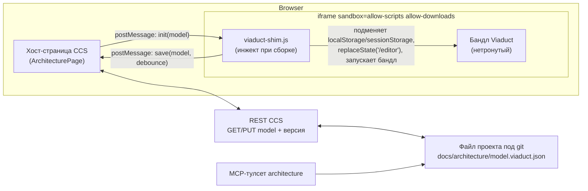

# Встраивание Viaduct Community в CCS — разведка и план серии задач

Тип: research · Статус: разведка завершена · Дата: 2026-09-25
Задача-родитель: `bf97bc02` (Viaduct 1/9), решение Григория 2026-09-25.

> Срез разведки — «так было тогда». Что реально построено: устройство раздела —
> [architecture-section.md](../features/architecture-section.md), сборка —
> [viaduct-module.md](../operations/viaduct-module.md), решение — [ADR-016](../adr/ADR-016-viaduct-architecture-section.md).
> Расхождения с планом: сборка лежит в `data/modules/viaduct/dist` (без каталога по коммиту,
> коммит — в маркере), тулсет получил пятый инструмент `arch_set_connection` и живёт без
> `DelegatedTurnGate` (правка модели — не делегирование), описание раздела — в `docs/features/`,
> а не в `features.md`.

## Вердикт: ИДЁМ ✅

Шим localStorage **реален и подтверждён экспериментально** (живой прогон в Chromium,
sandbox-iframe без `allow-same-origin`, страница с локального http-сервера):

| Проверка | Результат |
|---|---|
| Доступ к нативному `window.localStorage` в opaque origin | `SecurityError` (как и ожидалось) |
| `Object.defineProperty(window, 'localStorage', { value: shim })` | **работает**, свойство перекрывается |
| Round-trip `setItem`/`getItem` через шим | **работает** |
| `history.replaceState(null, '', '/editor')` в opaque iframe | **работает**, pathname меняется |
| Доступ к нативному `sessionStorage` | `SecurityError` → **шимить оба** |

Глубокий форк не нужен: код Viaduct не трогаем вообще, вся интеграция — пост-обработка
`dist/index.html` на этапе сборки (инжект нашего шим-скрипта) плюс хост-страница CCS.

## Факты разведки

**Закреплённый коммит:** `1af2d6e21e2ab66e8e62caf67063eac7fc1dfd57`
(master 2026-09-12, «fix: sync package-lock for Node 22 npm ci»).
Всё ниже проверено на нём.

### Стек и сборка

- Vite + React 19 + TypeScript, роутер `react-router-dom` (**BrowserRouter**, без basename),
  канва `@xyflow/react`, UI Chakra 3, Monaco (docs/sequence-редакторы), zustand 5.
- Сборка: `npm ci && npm run build` (= vendorRedoc + `tsc -b` + `vite build` + prerender).
  Node — по `.nvmrc` (22). `scripts/vendorRedoc.mjs` копирует Redoc из node_modules в
  `public/vendor/` — сети на сборке не требует.
- `vite.config.ts` захардкодил `base: '/'` — при раздаче под префиксом собирать
  `vite build --base=/modules/viaduct/` (CLI перекрывает конфиг; **проверить пути ассетов
  в dist — первый чек задачи 2**).

### Хранение модели (подтверждено)

- Стор модели живёт не в репе Viaduct, а в npm-пакете **`@archivisio/c4-modelizer-sdk@1.0.0`**
  (`dist/core/store/flatC4Store`): zustand `persist` поверх `createJSONStorage(() => localStorage)`,
  ключ **`c4modelizer_flat_store`** (подтверждён в бандле SDK).
- Формат — `FlatC4Model` (persist-обёртка zustand: `{ state: { model: FlatC4Model }, version }`):

```ts
interface FlatC4Model {
  systems: FlatSystemBlock[];       // id, name, description?, url?, position{x,y},
  containers: FlatContainerBlock[]; //   type, technology?, connections: ConnectionData[]
  components: FlatComponentBlock[]; // + systemId / containerId у вложенных уровней
  codeElements: FlatCodeBlock[];    // + codeType: class|function|interface|variable|other
  viewLevel: 'system'|'container'|'component'|'code';
  activeSystemId?; activeContainerId?; activeComponentId?;
}
```

- Docs, sequence-диаграммы и Magic flows в Community-редакции живут **внутри той же
  flat-модели** (расширенные поля элементов; `src/shared/api/docs.api.ts`: «Community: docs
  live in the flat model / localStorage», REST-заглушки — no-op). Один ключ = вся модель.
- Побочные ключи (prefs, не модель): `c4-color-mode`, `c4-tag-colors`, `c4-declared-tags`,
  `c4-canvas-prefs`, `c4-onboarding-v1`, `c4-tips-tour-v1`, сортировки списков; в
  sessionStorage — пути возврата между страницами. Шим покрывает оба стораджа целиком.

### Что могло сломать CSP/санбокс — и не ломает

- **Service worker / IndexedDB — нет вовсе** (греп по репе пуст). `manifest.webmanifest` есть,
  но без SW это просто метаданные.
- **Шрифты вендорены** (`public/fonts.css`, IBM Plex Sans + JetBrains Mono с этого же origin,
  сознательный отказ от fonts.googleapis.com). Redoc тоже вендорен.
- **Телеметрия по умолчанию мертва на этапе сборки**: продуктовые метрики —
  `__METRICS_DISABLED__ = VITE_METRICS_DISABLED ?? '1'` (выключены, если не включить явно),
  шлют на относительный `/api/metrics/event` fire-and-forget; Umami включается только при
  заданном `VITE_UMAMI_WEBSITE_ID` (по умолчанию пуст). На сборке фиксируем оба выключенными.
- **Auth Community — локальная заглушка** (`AuthContext`: «no network auth. Always anonymous,
  never calls /api/me»). `shared/api/http/client.ts` существует, но Community-обёртки над ним —
  no-op.
- Маршруты: `/` → redirect `/editor`; `/editor`, `/catalog`, `/flows` — рабочие; `/docs`,
  `/terms`, `/privacy` — публичные страницы. Шим делает `replaceState('/editor')` до старта.

### Лицензия

BUSL-1.1, Additional Use Grant: production-использование разрешено, запрещено предлагать
**конкурирующий hosted multi-tenant C4-сервис** (включая hosted MCP access как часть такого
сервиса). CCS — self-hosted личный продукт, C4-редактор третьим лицам как сервис не
предлагается → грант покрывает. Наш MCP-тулсет — собственный код CCS против нашего же
JSON-файла, производной Viaduct не является. Change License: Apache-2.0 с 2030-09-12.

## Архитектура встраивания



### Загрузочный протокол (ключевое решение)

`localStorage` синхронен, postMessage асинхронен — поэтому бандл нельзя пускать, пока модель
не приехала. Пост-обработка `dist/index.html` на сборке (скрипт наш, код Viaduct не трогаем):

1. Инжектируется `<script src="./viaduct-shim.js">` первым в `<head>`.
2. `<script type="module" src="...">` бандла заменяется на неисполняемый
   `<script type="text/x-viaduct-app" data-src="...">`.

Рантайм шима: ставит in-memory шимы обоих стораджей → шлёт родителю `ready` → ждёт `init`
с содержимым модели и prefs → наполняет шим → `history.replaceState('/editor')` → вставляет
настоящий `<script type="module">` по `data-src`. Все записи в ключ `c4modelizer_flat_store`
дебаунсятся (~1-2 с) и уезжают родителю сообщением `save`; prefs-ключи — отдельным `prefs`.

### Хранение

- **Модель:** `docs/architecture/model.viaduct.json` в корне проекта (файл под git, виден
  агентам как обычный файл). PUT — с версией (`If-Match` по SHA-256 содержимого или счётчик
  в обёртке); расхождение → **409**, хост показывает конфликт и предлагает перезагрузить
  модель. Хранится ровно persist-обёртка стора (то, что лежало бы в ключе) — редактору
  отдаётся byte-for-byte без переформатирования.
- **Prefs** (`c4-*`-ключи, sessionStorage): в файл не пишутся — хост держит их в
  localStorage родительской страницы (per-браузер, ключ с префиксом
  `viaduct-prefs:{projectId}`). В git и бэкап не попадают.
- **Статика:** `data/modules/viaduct/{commit}/dist` — вне репы; сборочный скрипт клонирует
  закреплённый коммит во временную папку, собирает и раскладывает.

## План задач 2–9

Ревью Светланы — гейт каждой кодовой задачи (2-7), не отдельная карточка.

| # | Задача | Исполнитель | Объём | Ключевые файлы |
|---|---|---|---|---|
| 2 | **Сборка и раздача статики.** Скрипт сборки на коммите `1af2d6e2` (clone → npm ci → `vite build --base=/modules/viaduct/` c `VITE_METRICS_DISABLED=1`, без Umami-id → пост-обработка: инжект шима, дезактивация module-скрипта, рерайт абсолютных `/fonts/`, `/vendor/`, favicon/manifest в `index.html` и `fonts.css`); раздача `/modules/viaduct/**` из `data/modules/viaduct` c `Access-Control-Allow-Origin: *` (ES-модули из opaque origin шлют `Origin: null`) и SPA-fallback не нужен (грузим только `index.html`). Чек: пути ассетов в dist корректны, страница открывается напрямую | Олег | M (~1 день) | `scripts/build-viaduct.ps1` (новый), раздача — вертикаль Architecture (см. 3) |
| 3 | **Вертикаль Architecture + хранилище модели.** Новый `.csproj` `ClaudeHomeServer.Architecture` + `ArchitectureSubsystem : IAppSubsystem`; REST `GET/PUT /api/projects/{id}/architecture/model` (владелец, версия, 409), путь файла только через `SafePath.Join`; регистрация в `Boundaries` обоих сторожей; фич-флаг `architecture` в `FeatureFlagCatalog` + `FLAGS` | Дмитрий | M (~1 день) | `backend/ClaudeHomeServer.Architecture/*`, `Models/FeatureFlag.cs`, `frontend/src/lib/featureFlags.ts` |
| 4 | **Шим и postMessage-мост.** `viaduct-shim.js` (vanilla, без сборки; протокол `ready`/`init`/`save`/`prefs`, дебаунс, версия протокола в сообщениях) + хост-компонент фронта (iframe `sandbox="allow-scripts allow-downloads"`, origin-check сообщений, PUT c 409-конфликтом и плашкой) | Дмитрий | M-L (~1.5 дня) | `frontend/src/components/ViaductFrame/*` (новый), шим кладётся рядом со статикой |
| 5 | **UI раздела «Архитектура».** Кнопка в проекте рядом с «Документацией» (за флагом), страница с iframe и empty state «модель ещё не сгенерирована» + кнопка генерации; ссылки на раздел из задачи и чата. По гайду дизайн-системы, эталон — KnowledgePage | Вера | M (~1 день) | `frontend/src/pages/ArchitecturePage.tsx` (новый), точки входа в проекте |
| 6 | **Генератор стартовой модели.** Server-side: codegraph (типы/связность) + `.csproj`-графа (вертикали, направления ссылок) + `Boundaries` сторожей → `FlatC4Model`: system = CCS, containers = Main/Core/вертикали/frontend, components = хабы codegraph по вертикалям; позиции — простая сетка. `POST /api/projects/{id}/architecture/generate`. Потолок элементов (~стартово контейнерный уровень + топ-компоненты), чтобы канва жила | Дмитрий | L (~2 дня) | вертикаль Architecture, читает выдачу CodeGraph через шов |
| 7 | **MCP-тулсет `architecture`.** Http-тулсет по образцу волны 2-3 (хвост-сессия, `DelegatedTurnGate` fail-closed): `arch_context` (сводка модели), `arch_search`, `arch_get_element`, `arch_update_element` (та же версия/409). Состав tools/list от хода не зависит (сторож — `McpToolsetStabilityTests`); счётчики в `GET /api/mcp/calls` — по ним меряется пилот | Дмитрий | M (~1 день) | `Services/Mcp/Http` + вертикаль Architecture |
| 8 | **Прогоны и тесты.** Юниты: REST-хранилище (версия/409/SafePath), протокол пост-обработки index.html (инжект/дезактивация), генератор (детерминизм, потолок); e2e руками: полный круг «сгенерировать → открыть → подвинуть элемент → сохранение → git diff файла модели → правка через MCP → перезагрузка iframe». Платформонезависимость (CI — Linux) | Кира | M (~1 день) | `backend/ClaudeHomeServer.Tests/*` |
| 9 | **Доки и запуск пилота.** Раздел в `docs/architecture/features.md`, выжимка в CLAUDE.md (по правилу компактности), ADR при необходимости; включение флага Григорию, фиксация даты старта пилота и метрик стоп-условий | Анна | S (~0.5 дня) | `docs/architecture/features.md`, `CLAUDE.md` |

Задачи 2-4 — критический путь (2 → 3 → 4), 5 и 6 параллелятся после 3, 7 — после 3.

## Инварианты (обязательные к соблюдению)

- **SafePath**: путь файла модели и всё под `data/modules/viaduct` — только через
  `SafePath.Join`; `projectId`/пути из запросов не склеивать руками.
- **Бэкап**: `data/modules/viaduct` — воспроизводимый кеш сборки → в исключения бэкапа.
  Файл модели живёт в репе проекта (git — его бэкап), сторов в `data/` вертикаль не заводит;
  если появятся — сверка с `BackupValidation`/`BackupSchema.Version` по чек-листу конвенций.
- **Границы вертикалей**: Architecture не ссылается на другие вертикали; связь с CodeGraph —
  через явный шов или спину; записи в `Boundaries` обоих сторожей + строка в
  `SubsystemBoundaryCoverageTests` (помнить про молчаливый схлоп дублей — сверять число тестов).
- **Отключаемость**: флаг + `SubsystemGate.IsEnabled`; обязательных конструкторных
  зависимостей от вертикали вне её — не заводить (формы деградации: `?.`, ранний выход, 502/503).
- **Стабильность MCP**: состав tools/list зависит максимум от свойств сессии, не хода;
  ограничения по ходу — `DelegatedTurnGate` на бэкенде.
- **Дизайн-система**: страница и кнопки — токены `C.*`, контролы из `components/ui`,
  `npm run lint:design` перед коммитом; мобильная вёрстка (iframe-канва на 360 CSS px —
  честно проверить, возможно мобильный режим read-only).
- **Код Viaduct в репу CCS не попадает** — только скрипт сборки, шим и хост-код.

## Риски

1. **`vite build --base` против захардкоженного `base: '/'`** — CLI должен перекрыть конфиг;
   если нет (минорный риск), fallback — `sed` конфига во временном клоне (репу не трогаем,
   клон одноразовый). Проверяется первым шагом задачи 2.
2. **Абсолютные пути в `public/`** (`/fonts/`, `/vendor/`) Vite не переписывает — закрыто
   рерайтом в пост-обработке (задача 2); после сборки грепнуть dist на корневые `url(/`.
3. **`replaceState` и роутер**: примитив проверен в живом Chromium; полный прогон с реальным
   бандлом — smoke задачи 2/4. Возврат хоста к iframe после навигации внутри SPA
   (`/editor` → `/flows`) ничего не требует — история живёт внутри iframe.
4. **Размер модели vs канва**: генератор без потолка способен выдать сотни узлов (у codegraph
   только хабов десяток, файлов — сотни). Потолок и уровневая детализация — в задаче 6.
5. **Конфликт двух окон** (два браузера правят одну модель): версия + 409 защищает файл, но
   UX — «последний проигрывает с плашкой». Для пилота достаточно, реалтайм-мержа не делаем.
6. **Синк Знаний**: `docs/architecture/model.viaduct.json` попадёт в синк проекта в Dify —
   большой JSON в индексе бесполезен. Проверить в задаче 3, при необходимости — исключение
   по маске в синке (решение согласовать, не молча).
7. **Обновление Viaduct**: коммит закреплён; апгрейд = осознанная смена пина + повторный
   прогон пост-обработки (структура index.html может поменяться — скрипт должен падать
   громко, если не нашёл module-скрипт).

## Стоп-условия пилота (2 недели, из постановки)

- К модели ни разу не обратились по делу (`GET /api/mcp/calls`, инструменты `arch_*`).
- Модель потребовала ручной подгонки.
- Интеграция вылезла за оценку.

---

## Вынос как Notes (Viaduct 10)

Дата: 2026-09-26 · **Статус: исполнено** (10.1–10.5, регресс 10.4 зелёный, хвосты 10.4a закрыты). Решение Григория: новый крупный функционал — отдельными проектами; раздел «Архитектура» доведён до уровня Notes **полностью** (бэк и фронт). Итог — дополнение в [ADR-016](../adr/ADR-016-viaduct-architecture-section.md).

### Целевое состояние («уровень Notes»)

Notes сегодня — это ДВА выноса сразу, и оба берём за образец:

- **Бэк — динамический модуль (сценарий Б)**: сборка `ClaudeHomeServer.Notes.dll` грузится
  `ModuleLoader`'ом по `Backend.AssemblyPath` из секции `DynamicModules` (не через
  `ProjectReference`), контроллер живёт в вертикали и подключается `AssemblyPart`'ом,
  сервисы регистрирует `IAppSubsystem.Register` из загруженной сборки, Main не видит типы
  вертикали на компиляции (`ReferenceOutputAssembly="false"` + Copy-target
  `Build;Publish`). Коммиты `fbfcfc4c`, `0b8c0b9b`, `827c1f75`.
- **Фронт — Module Federation remote**: MF-entry в `frontend/modules/notes` экспортирует
  `./subsystem` (промис `SubsystemManifest`), хост грузит его в рантайме по списку из
  `GET /api/subsystem-modules` (`registerRemotes` + `loadRemote`), оболочка не импортирует
  фичу статически — все точки касания идут через слоты `registryCore`; общий код фича
  берёт из runtime-кита `aihome_shell/kit`. Коммиты `fbfcfc4c`, `75c835eb`, `c44d51d6`.
  Важно: **исходники фичи остаются в `src/features/notes`** — в `modules/notes` живёт
  только тонкий MF-entry с async-границей; «вынос» = разрыв статических импортов из
  оболочки, а не переезд папки.

### Текущий остаток Архитектуры вне вертикали (что выносим)

Бэк (Main): `Controllers/ArchitectureController.cs` (166 строк, склейка CodeGraph +
ProjectManager + UserStore), `Services/ViaductStaticHosting.cs` (155 строк, ветка
`/modules/viaduct/**`), `Program.cs` — регистрация `new ArchitectureSubsystem()` в
`AddSubsystems` (:722–724) и `app.UseViaductStatic(...)` (:1739–1741),
`SessionManager` — `BuildArchitectureContext` + compile-ссылка на константу
`ArchitectureSubsystem.SubsystemKey` (:1045).

Фронт (оболочка): статические импорты `ArchitectureDocument`/`ArchitecturePanel` в
`WorkspacePage.tsx` (состояние `centerDoc`, пункт в меню проекта `projectOverflowItems`,
запись в `panels`),
`panelCatalog.ts` (ключ `arch`), `api.ts` (методы `architecture*`), `featureFlags.ts`
(флаг), `sw.ts` (denylist `/modules/viaduct`), `ui/index.ts` (`MetaChip`).

### Бэк: шаги

1. **Шов CodeGraph в Core.** Контроллер в Main существовал ровно из-за связки
   «вертикаль → вертикаль» (Architecture нельзя ссылаться на CodeGraph). Прецедент разреза
   уже есть — `Core/Services/CodeGraph/ICodeGraphInspector.cs` (шов Dossiers↔CodeGraph,
   «контракт одного намерения»). Заводим рядом второй узкий шов (рабочее имя
   `IArchitectureCodeSource` или расширение файла вторым интерфейсом): снимок с рёбрами
   (`Id/Label/SourceFile/Kind` узлов + `Source/Target/Relation` рёбер + `BuiltAt`) и
   **блокирующее** перестроение (кнопка «Собрать из кода» строит граф в том же запросе —
   `StartRebuildIfIdle` инспектора не годится). Реализация — тонкий форвардер на
   `CodeGraphService` в Main рядом с `CodeGraphInspector`. В контроллере шов —
   **опциональная** зависимость (`? = null` → 503 `graph_unavailable`): CodeGraph —
   отключаемая подсистема, обязательный конструкторный параметр от неё — дефект по
   правилу отключаемости (CLAUDE.md). Конвертация снимка в нейтральный
   `CodeSnapshotInput` (`ArchitectureController.ToInput`) переезжает внутрь вертикали;
   `ArchitectureInputs.cs` остаётся входом генератора.
2. **Перенос контроллера** в `backend/ClaudeHomeServer.Architecture/Controllers/` (образец —
   `NotesController`). Namespace — под корнем `ClaudeHomeServer.Services.Architecture`
   (не `ClaudeHomeServer.Architecture.Controllers`): запись Architecture в `Boundaries`
   сторожа границ сторожит именно этот префикс, контроллер в другом namespace выпал бы
   из-под сторожа; заодно поправить устаревший комментарий записи («контроллер в Main»).
   Зависимости: `IProjectManager` — Core-шов уже есть (им же пользуется
   `ArchitectureToolset`); CodeGraph — шов из шага 1; имя автора для `PUT model` —
   готовый Core-шов `IUserStore.GetById` (возвращает `User` с `DisplayName`).
3. **`ViaductStaticHosting` → вертикаль через Core-шов вклада статики.**
   `IAppPhaseSubsystem.ConfigureApp` для этого НЕ годится: у динамического модуля его
   никто не вызовет (`ModuleLoader` зовёт только `Register` и не кладёт инстанс под
   `IAppSubsystem` в DI — `UseSubsystems` его не увидит; у Notes путь не проверялся,
   фазовых подсистем у него нет), а `UseSubsystems()` стоит на `Program.cs:1190` — ДО
   защитных middleware (`UseForwardedHeaders` :1338, HTTPS-редирект боевого домена :1347,
   перехватчик превью-хоста :1382), и ветка, поставленная там, ускользнула бы из-под них
   (Viaduct стал бы доступен с превью-домена и по голому http). Поэтому: Core-шов
   «вклад статической ветки» (рабочее имя `IStaticBranchContributor`, метод
   `Configure(IApplicationBuilder)`), вертикаль регистрирует реализацию в
   `Register()`, а Main на ТЕКУЩЕМ месте (:1741) резолвит
   `IEnumerable<IStaticBranchContributor>` одним генерическим циклом — позиция ветки в
   конвейере не меняется. Весь класс (CSP, `LazyPhysicalFileProvider`, заголовки) уезжает
   в вертикаль. Смоук: редактор открывается напрямую и в iframe, HTTPS-редирект и
   превью-хост на `/modules/viaduct` ведут себя как до выноса.
4. **Перевод на динамический модуль** (полная симметрия с Notes):
   - `ClaudeHomeServer.csproj`: убрать прямой `ProjectReference` Architecture; добавить
     `ReferenceOutputAssembly="false"` + Copy-target `CopyArchitectureModule`
     (**обязательно `AfterTargets="Build;Publish"`** — Notes на публикации терял dll,
     и хост падал на старте);
   - `appsettings.json`: запись в `DynamicModules` (`Key: architecture`,
     `Backend.AssemblyPath: modules/architecture/ClaudeHomeServer.Architecture.dll`,
     `Frontend.RemoteUrl: /architecture-remote/remoteEntry.js`);
   - `Program.cs`: убрать `new ArchitectureSubsystem()` из `AddSubsystems` — регистрацию,
     `ApplicationPart` и запись в `SubsystemStateStore` делает `ModuleLoader`;
   - `SessionManager.cs:1045`: compile-ссылку `Architecture.ArchitectureSubsystem.SubsystemKey`
     заменить на Core-константу (`McpEndpoints.ArchitectureName` — та же строка
     `"architecture"`), иначе Main не соберётся без референса. Дополнительно гейтить
     `BuildArchitectureContext` **фактом загрузки модуля** (`SubsystemStateStore.ActiveKeys`),
     а не только `SubsystemGate`: без dll ход объявил бы CLI мёртвый сервер (тот же урок,
     что у форвардера Knowledge для Notes). `SubsystemStateStore` — новый параметр
     конструктора `SessionManager` (правка ручных конструкторов в тестах — учесть в
     объёме). Семантика рубильников — как у Notes: главный — `DynamicModules.architecture.
     Enabled` (не загрузилась dll = раздела нет), `Subsystems:architecture:Enabled`
     остаётся вторым замком для Main-side-гейта в `BuildArchitectureContext` — не снимать;
5. **Обобщить раздачу remote-статики**: сейчас `/notes-remote/**` захардкожен в
   `Program.cs` (:1786–1796); вместо второго блока-близнеца — один цикл по
   `DynamicModules` с `Frontend.RemoteUrl`, раздающий `wwwroot/{key}-remote` для каждого.
   Убирает правку Main на каждый будущий модуль.

### Что остаётся в ядре — явный список с обоснованием

| Место | Что | Почему остаётся |
|---|---|---|
| `SessionManager` | `BuildArchitectureContext` (+ DI-параметр `SubsystemStateStore`), параметр в `HttpMcpActive`, вызовы в двух точках сборки `LlmSessionContext` | Ядро сессий решает состав MCP хода для ВСЕХ тулсетов из свойств владельца/сессии (флаги, привязки, персона живут в ядре); у notes/codegraph/dify/watch проводка точно такая же — у Notes после выноса `BuildNotesContext` тоже остался |
| `Core` + Main-форвардеры | шов снимка CodeGraph (шаг 1) и шов вклада статики (шаг 3); их регистрации в `Program.cs` | Контракты живут в спине, чтобы вертикаль-потребитель не получала связь «вертикаль → вертикаль» (прецедент — `ICodeGraphInspector`); форвардер на `CodeGraphService` может жить только в Main |
| `ClaudeHomeServer.Llm` | `ArchitectureMcpContext`, поле и ветка в `ClaudeSession.BuildTurnMcpConfig` | Llm-вертикаль собирает MCP-конфиг CLI на каждый ход; по ветке на каждый http-тулсет — так у всех девяти серверов ADR-012 |
| `Core/McpEndpoints` | `ArchitectureName` | Спинная константа имён MCP-серверов, общая для SessionManager/Llm/тулсета |
| `Core/FeatureFlagCatalog` | флаг `architecture` | Единый реестр dark-launch-флагов — источник правды тумблеров |
| `McpRegistry` | `"architecture"` в `ReservedKeys` | Реестр зарезервированных имён личных MCP-серверов живёт в Main |
| `PersonaAccessPolicy`, `PersonaBindingsService` | запреты `arch_update_element`/`arch_set_connection` для read-only, каталожная запись привязки `architecture` | Статические каталоги инструментов/привязок персон — Main/Personas; записи notes/wsp там же |
| `Backup/BackupPaths` | исключение `modules/viaduct/**` | Бэкап — инфраструктурный срез поперёк всех, из выноса вычеркнут (ADR-014) |
| `Program.cs` | генерические циклы: раздача `wwwroot/{key}-remote` (шаг 5) и резолв вкладов статики (шаг 3); регистрация Main-форвардера шва CodeGraph | Публикация MF-remote и позиция веток в конвейере — обязанность хоста-оболочки; все строки генерические, per-module строк нет |
| Фронт-оболочка | запись `arch` в `panelCatalog` (ключ/иконка/заголовок), `FLAGS.architecture` + `SUBSYSTEMS.architecture`, методы `architecture*` в `api.ts`, denylist в `sw.ts`, `MetaChip` в `components/ui` | Каталог рельсы и реестры — статические словари каркаса (у notes так же); `api` раздаётся китом и живёт в оболочке; service worker один на приложение; `MetaChip` — примитив дизайн-системы |
| `WorkspacePage` | состояние `centerDoc`, пункт в меню проекта `projectOverflowItems`, рендер вкладов слотов | Каркас владеет раскладкой центра и меню; контент приходит вкладами слотов, видимость — по наличию вклада + флагу |

Итог по `Program.cs`: **ноль per-модульных строк про Архитектуру** (после шагов 4–5
остаются только генерические циклы и регистрация Core-форвардера шва CodeGraph); по
`SessionManager` — только `BuildArchitectureContext` без compile-ссылок на вертикаль.

### Фронт: шаги

1. **`src/features/architecture/manifest.tsx`** — `SubsystemManifest` `key: 'architecture'`
   без `tab` (раздел — не вкладка хаба, а панель+документ воркспейса), вклады:
   - слот `workspace-panel`, name `architecture` → `ArchitecturePanel`
     (ctx: `projectId`, `archOpen`, `onEnsureOpen`, `onCollapse`);
   - **новый слот** `workspace-center-doc`, name `arch` → `ArchitectureDocument`
     (ctx: `projectId`, `projectName`, `isMobile`, `onClose`, `onShowFile`) — контексты
     объявить в `registryCore.ts`, как `WorkspacePanelNotesCtx`.
2. **`WorkspacePage` на слоты**: убрать оба статических импорта. Кнопка рельсы `arch`
   гейтится наличием вклада `workspace-panel` (запись в `panels` появляется только при
   вкладе + `useFeature(FLAGS.architecture)`), пункт «Архитектура» в
   `projectOverflowItems` (меню проекта, не аватара) и рендер документа — наличием вклада
   `workspace-center-doc` + тем же флагом; гейтить надо ОБА слота, а не только центр-док.
   Состояние `centerDoc: 'graph' | 'arch' | null` остаётся как есть. Гейт
   `isSubsystemEnabled('architecture')` внутри `getSlotContributions` заработает сам:
   `ModuleLoader.RecordActive` кладёт ключ в `ActiveKeys` → `/api/auth/me` → стор
   подсистем (добавить ключ в `SUBSYSTEMS`).
3. **`frontend/modules/architecture`** по образцу notes: `package.json`, `tsconfig.json`,
   `vite.config.ts` (`name: 'aihome_architecture'`, expose `./subsystem`, remote
   `aihome_shell → /remoteEntry.js`, shared react/react-dom singleton, dev-порт 5175 +
   прокси `/architecture-remote/**` в dev-конфиге хоста), `subsystem.tsx` —
   **обязательно async-граница** (`await import('aihome_shell/kit')` до импорта
   манифеста — урок `c44d51d6`, без неё раздел молча исчезает). Скрипты:
   `build:architecture` (сборка + публикация в `dist/architecture-remote`) в цепочке
   `build`/`build:quiet`, `dev:architecture`.
4. **Кит** (`lib/shell-kit/index.ts`): дополнить по фактическим импортам фичи
   (`ArchitectureDocument.tsx`, `ArchitecturePanel.tsx`, `ViaductFrame.tsx`,
   `architectureStore.ts`): `Button`, `BackButton`, `EmptyState`, `WaitingIndicator`,
   `MetaChip` из `components/ui`; `Toolbar`/`ToolbarIconButton`,
   `ToolbarOverflowMenu` + тип `OverflowItem`; `ui/icons` (`ICON_SIZE`, `ICON_STROKE`);
   `themeMode` (`getEffectiveTheme`, `useThemeMode`); `gitFormat.relTime` —
   ⚠️ конфликт имён: кит уже экспортирует `relTime` из `features/home/WidgetCard`
   (`index.ts:125`) — экспортировать под алиасом либо свести к одной реализации,
   решить на ревью. Фичу перевести на `aihome_shell/kit` (как перевели notes в
   `75c835eb`). Локальный алиас на кит в сборке remote НЕ ставить — вернёт копию
   модульного состояния. Флаг `useFeature(FLAGS.architecture)` фича не импортирует —
   его читает оболочка на рендере вкладов, в кит не тащить.
5. **Мобила**: `ArchitectureDocument` уже умеет `isMobile` (оверлей поверх чата) — при
   переходе на слот поведение не меняется; контрольная точка Киры — 360 CSS px,
   read-only-ограничения канвы как решено в задаче 5 серии.
6. **iframe и SW не меняются**: `/modules/viaduct/**` — бэкенд-статика, MF её не касается;
   denylist в `sw.ts` остаётся. `.mf/diagnostics` модуля уже в `.gitignore` (`2dfc86f8`).

### Риски (свежие грабли пилота MF — все уже ловлены на notes)

1. **Async-граница remote** (`c44d51d6`): статический импорт кита в коде фичи →
   синхронная деструктуризация remote-прокси бросает промис, хост молча не регистрирует
   подсистему. Симптом — раздел исчезает без ошибки; диагностика — только `console.warn`
   из `loadSubsystemRemotes`. Копировать паттерн `modules/notes/subsystem.tsx` дословно.
2. **Гонка старта**: remotes ждутся до `SUBSYSTEM_REMOTES_WAIT_MS = 2 с` — при холодном
   старте кнопка рельсы/пункт меню появятся с задержкой. Для арха деплинков нет
   (не hub-tab), поэтому диплинк-догон notes не нужен; но e2e не должен ассертить кнопку
   до завершения загрузки remotes.
3. **Публикация теряет артефакты** (инцидент Notes): dll — Copy-target без `Publish`,
   remote — `wwwroot/architecture-remote` не доехал. Чек в задаче Киры: после
   `dotnet publish` + фронт-сборки в выкатке есть и dll, и `remoteEntry.js`.
4. **Копия кита через алиас** (`75c835eb`): алиас `aihome_shell/kit` на локальный путь в
   сборке remote возвращает вторую копию сторов — состояние расходится. В
   `vite.config.ts` модуля алиас не заводить.
5. **`ConfigureApp` динамического модуля — мёртвый путь**: `ModuleLoader` не регистрирует
   подсистему под `IAppSubsystem`, поэтому `UseSubsystems` фазовые хуки динамических
   модулей не видит; а сам `UseSubsystems()` стоит на :1190 — до защитных middleware,
   ветка там ускользнула бы из-под HTTPS-редиректа и перехватчика превью-хоста. Закрыто
   выбором шва вклада статики с вызовом на текущем месте конвейера (шаг 3 бэка); смоук —
   там же. Симптом, если проглядеть: после 10.2 редактор молча отдаёт SPA-фолбэк/404,
   сборка это не ловит.
6. **Сторожа границ**: `Boundaries`-запись Architecture уже есть; при превращении в
   динамический модуль сборка перестаёт грузиться через ссылку Main — статические
   конструкторы сторожей обязаны форсить её загрузку явно (у Tests остаётся прямой
   `ProjectReference`, как у Notes), иначе вакуумный проход. Помнить про молчаливый схлоп
   дублей в `SubsystemBoundaryCoverageTests` — сверять число тестов до/после.
7. **`McpToolsetStabilityTests`**: состав tools/list не должен зависеть от хода — уже
   покрыто (тулсет в реестре только при загруженном модуле, это свойство процесса, не хода);
   прогнать после смены способа регистрации.

### Тесты, бэкап

- **Юниты бэка**: Tests ссылается на вертикаль напрямую (уже в `.csproj`), но правки
  будут: `ArchitectureModelStoreTests` конструирует `ArchitectureController` с конкретными
  `CodeGraphService`/`ProjectManager`/`UserStore` — после перехода на швы сигнатуру и
  namespace переписать; в `Tests.csproj` добавить `CopyArchitectureModuleForTests` по
  образцу `CopyNotesModuleForTests` (без него `WebApplicationFactory`-хосты не найдут
  dll — раздел неактивен, тулсет выпадает из реестра, `McpToolsetStabilityTests` и тесты
  контроллера падают или проходят на пустом наборе); проверить override `DynamicModules`
  в `appsettings.Testing.json` (секция переопределяется по индексу). Добавить кейс
  `ModuleLoaderTests`/`StubModuleEndpointTests`-образца на запись architecture в
  `DynamicModules` (контроллер отвечает при загрузке через `AssemblyPart`).
- **Vitest**: `src/features/architecture/__tests__/architectureStore.test.ts` остаётся под
  `include: ['src/**/*.test.ts']` (исходники не переезжают), но после перевода стора на
  `aihome_shell/kit` тест потянет граф кита и упадёт на точечном `vi.mock('react', ...)`
  — мокать `aihome_shell/kit` вместо `../../../lib/api` (правится в 10.3 вместе с
  переводом).
- **E2E**: новый `frontend/e2e/architecture-module.spec.ts` по образцу
  `notes-module.spec.ts` (живой стенд, сбор console.warn — иначе молчаливый провал remote
  не виден): кнопка рельсы появляется, документ открывается, empty state/канва рендерится.
  Предусловие стенда — собранный Viaduct (`scripts/build-viaduct.ps1`, иначе вместо канвы
  честный `viaduct_not_installed`); ассерты кнопки — только после завершения загрузки
  remotes (гонка старта, риск 2).
- **Регресс сценариев задачи 8** (полный круг: сгенерировать → открыть → подвинуть →
  сохранение → git diff файла модели → правка через MCP → перезагрузка iframe) — руками
  после выноса, плюс мобила 360 px.
- **Бэкап**: не меняется — `modules/viaduct` уже в исключениях (`BackupPaths`), файл
  модели живёт в репе проекта, `wwwroot/architecture-remote` — артефакт сборки, новых
  сторов в `data/` вынос не заводит.

### Разбивка задач и оценка

Ревью Светланы — гейт каждой кодовой задачи (10.1–10.3), как в серии 2–9, не отдельная
карточка. Коммит серии Viaduct 1–10 — после зелёного 10.4, по явной команде Григория.

| # | Задача | Исполнитель | Оценка | Ключевые файлы |
|---|---|---|---|---|
| 10.1 | **Бэк: контроллер и статика в вертикаль.** Core-шов снимка CodeGraph (опциональный в контроллере) + Main-форвардер; перенос `ArchitectureController` (namespace под корнем `Services.Architecture`, швы `IProjectManager`/`IUserStore`); `ViaductStaticHosting` → вертикаль через Core-шов вклада статики (вызов на текущем месте конвейера) со смоуком (напрямую, iframe, HTTPS-редирект, превью-хост); переписать конструирование контроллера в `ArchitectureModelStoreTests` | Дмитрий | M (~1 день) | `Core/Services/CodeGraph/*`, `Core/Services/Composition/*`, `ClaudeHomeServer.Architecture/*`, `Program.cs` |
| 10.2 | **Бэк: динамический модуль.** csproj (`ReferenceOutputAssembly=false` + Copy-target Build+Publish), запись `DynamicModules`, чистка `Program.cs`, `SessionManager` → Core-константа + DI `SubsystemStateStore` + гейт по факту загрузки, общий цикл раздачи `{key}-remote`, `CopyArchitectureModuleForTests` + `appsettings.Testing.json`, правки сторожей/`ModuleLoaderTests` | Дмитрий | M (~1–1.5 дня) | `ClaudeHomeServer.csproj`, `Tests.csproj`, `appsettings*.json`, `Program.cs`, `SessionManager.cs`, тесты границ |
| 10.3 | **Фронт: MF-remote.** `manifest.tsx` + слот `workspace-center-doc`, `WorkspacePage` на слоты (ноль статических импортов фичи, гейт обоих слотов), `modules/architecture` с async-границей, скрипты сборки, дополнение кита (+ конфликт `relTime`), перевод фичи на `aihome_shell/kit`, правка мока в `architectureStore.test.ts` | Дмитрий | M–L (~1–1.5 дня) | `frontend/modules/architecture/*`, `src/features/architecture/*`, `WorkspacePage.tsx`, `lib/shell-kit`, `lib/subsystems*` |
| 10.4 | **Регресс и e2e.** `architecture-module.spec.ts` по образцу notes (предусловие — собранный Viaduct); регресс-прогон сценариев задачи 8 руками + мобила 360; **регресс notes-remote** (цикл `{key}-remote` из 10.2 меняет и его раздачу); полный `dotnet test` и vitest; чек публикации (dll + `architecture-remote` в выкатке) | Кира | M (~1 день) | `frontend/e2e/*`, чек-лист задачи 8 |
| 10.5 | **Доки.** Обновить `docs/features/architecture-section.md`, ADR-016 (дополнение «вынос как Notes»), выжимку в CLAUDE.md; пометить этот раздел исполненным | Анна | S (~0.5 дня) | `docs/*`, `CLAUDE.md` |

Критический путь: 10.1 → 10.2 → 10.4; 10.3 стартует параллельно 10.2, но прод-проверка
10.3 зависит от цикла `{key}-remote` и записи `DynamicModules` из 10.2. Суммарно ~4 дня
разработки + день регресса; ревью Светланы — сверх этого, по факту на каждой задаче.
