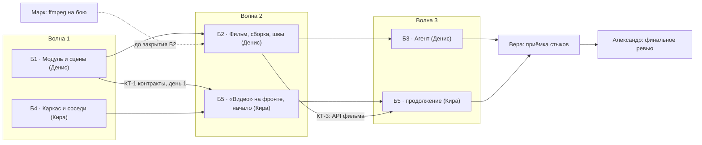

# План реализации редактора «Видео»: 5 блоков, 3 волны

План опирается на разрез Александра (черновик ADR-022, итог задачи `36c085f0`) и на решения Андрея от 2026-10-02. Пути, имена тестов-сторожей, скрипты сборки и `slnx` я сверил в worktree `feat/video-editor`. Пять блоков Александра оставил как есть: ни один не дробил. Что изменилось относительно разреза:
- **§5.3 удалён.** В блоке 3 нет потолка трат за ход, `AgentTurnCeiling` и `agent_budget_exhausted`.
- **§9 закрыт** решениями Андрея. Их нужно внести в ADR-022 при его заведении (это первый коммит блока 1).
- **Переименование эфира в «Эфир»** — отдельный коммит подписи в блоке 4.

## 1. Волны

**Главное решение по второму бэкенд-исполнителю: блок 2 делает Денис, после блока 1.** Кузьму параллельно не ставим. Причины:
1. **Один worktree.** Два бэкенд-исполнителя в одном дереве собирают одни и те же `bin/obj`, `dotnet build` и `dotnet test` мешают друг другу и дают ложные красные. Бэкенд и фронтенд в одном дереве уживаются: у них разные инструменты и разные каталоги.
2. **Потолок «двое на стенде».** Кира занята весь путь: блок 4, потом блок 5. Значит, второй бэкенд-слот появился бы только третьим исполнителем.
3. **Блок 2 самый рискованный.** Он пересекает три вертикали (ImageEditor, AudioEditor, Images), тяжёлый слот, cgroup и атомарную запись под ревизией. По памяти команды, локальная модель теряет результаты фоновых субагентов и пишет агрегаты по памяти. На таком блоке это дорогая ошибка.

Бэкенд идёт цепочкой 1 → 2 → 3, фронтенд — 4 → 5. На стенде всегда ровно два исполнителя: Денис и Кира.



| Волна | Денис (бэкенд) | Кира (фронтенд) | Старт |
|---|---|---|---|
| 1 | **Б1** Модуль и сцены | **Б4** Каркас и соседи | сразу |
| 2 | **Б2** Фильм, сборка, швы | **Б5**: вкладка «Сцена», полоса, карточка | Б2 — после ревью Б1 Глебом. Б5 — после Б4 и КТ-1 |
| 3 | **Б3** Агент | **Б5**: вкладка «Фильм», «Сценарий», личный чат, мобила | Б3 — после ревью Б2. Вкладка «Фильм» на живом API — после КТ-3 |
| финал | — | — | приёмка Веры → правки → финальное ревью Александра |

- **Глеб** ревьюит каждый блок по готовности. Это чтение плюс точечный `dotnet test --filter`, исполнителем стенда ревью не считаю.
- Следующий блок того же исполнителя стартует только после «блокеров нет» от Глеба. Замечания уровня minor исполнитель доделывает в начале следующего блока, отдельным коммитом.
- **Марк** проверяет боевой сервер, а не стенд, поэтому в лимит не входит. Ставить сразу: ответ нужен до закрытия Б2.
- **«Что нового»** пишется после приёмки Веры отдельной мелкой правкой. Это тексты продукта, исполнители блоков их не пишут.

## 2. Контрольные точки

### КТ-1. Контракты дня 1: первый коммит блока 1, ревью Глеба в тот же день

Пока КТ-1 не закоммичена, Денис не начинает ничего другого в блоке 1. Точный состав:

1. **`docs/adr/ADR-022-video-editor.md`** — текст разреза Александра с поправками Андрея:
   - §5.3 удалён целиком;
   - §9 переписан в «Решения» (пять пунктов из постановки);
   - в §5.2 вместо потолка — правило блока хвоста хода, `Initiator = Agent` и счётчик «Потрачено на фильм» как отображение;
   - запись в проект — только `video/**` и `music/**`;
   - в таблицу §7 добавлено «пункт рельса эфира — «Эфир», редактор — «Видео», ключ `videoEditor`»;
   - новый раздел **«Контракты»**: JSON-пример каждого DTO и события. По этому разделу Кира пишет TS-типы.
2. **Скелет проекта, который собирается:**
   - `backend/ClaudeHomeServer.VideoEditor/ClaudeHomeServer.VideoEditor.csproj`, ссылка только на Core;
   - пустой `VideoEditorSubsystem` (Key `videoeditor`);
   - `ClaudeHomeServer.VideoEditor.Tests`;
   - обе строки в `backend/ClaudeHomeServer.slnx`.
3. **`backend/ClaudeHomeServer.VideoEditor/Contracts/`** — record-типы:
   - **сцена:** `VideoSceneDto`, `VideoSceneSettingsDto`, `FrameRef` (размеченное объединение `image{threadId, versionId, follow}` | `file{path}`), `VideoClipVersionDto` (файл, поставщик, модель, длительность, размер, `hasSound`, лицензия, цена `usd|credits|0`, `initiator`, снимок входов), `VideoLaunchDto` (статусы, включая `interrupted`), `VideoSceneStaleDto` (`frameChanged` / `textChanged` по слотам);
   - **фокус и выбор:** `VideoFocusDto` (сцена и открытый фильм), `VideoPrefsDto`;
   - **каталог и запуск:** `VideoCatalogDto` (поставщики, модели, caps: `firstFrame`, `lastFrame`, длительности, пропорции, `sound`, лицензия, `available` с причиной), `VideoQuoteRequest/Response`, `VideoLaunchRequest/Result`, `RetryQuote`;
   - **сохранение:** `SaveSceneRequest/Result` (файл сцены и файлы кадров группой);
   - **фильм:** `FilmDocument` — формат `.film` `schema: 1` ровно как в §2 разреза (`aspect`, `items[{file, trim, scene{text, frameA, frameB, provider, model, durationSec}}]`, `cuts[{type: cut|fade|black, sec}]`, `music{file, volume, fadeOut}`, `builds[{file, sourceHash, at}]`);
   - **состояние фильма:** `FilmSummaryDto`, `FilmStateDto` (ревизия, строки со статусами «устарел» и «● обновлена», «✦ Claude», «Потрачено на фильм» по валютам, ожидаемая музыка);
   - **правка и сборка фильма:** `FilmPatch` с операциями `add`, `remove`, `move`, `cut`, `trim`, `music`, `expectedRevision`; `FilmBuildStatusDto` (`waitingSlot`, `progress`, `done`, `failed` с причиной).
4. **Коды ошибок** — константы в `Contracts/VideoEditorErrors.cs`:
   - `name_taken`, `revision_conflict`, `dsp_unavailable`;
   - `personal_scope_no_films`, `local_unavailable_personal`, `project_local_unsupported`;
   - `outside_allowed_folders`, `film_invalid`, `film_schema_unsupported`.
5. **Маршруты** — константы и таблица в ADR:
   - проектные `api/projects/{id}/video-editor/*` и личные `api/video-editor/chats/{sessionId}/*`;
   - сцены: состояние, фокус, `new`, `settings`, `quote`, `launch`, `cancel`, `save`;
   - фильмы: список, чтение, `patch`, `build`, статус сборки;
   - каталог, префы, загрузка кадра «С компьютера».
6. **События SignalR и записи ленты:**
   - события `video_thread_changed`, `video_film_changed`;
   - `recordType` для `module_record` с `module: "videoeditor"`: `video_scene`, `video_launch_versions`, `video_saved`, `video_film_built` и тихие строки. Константы в `VideoThreadRecordTypes` с комментарием «не удалять никогда».
7. **Флаг `video-editor`** в `FeatureFlagCatalog.All` (`Default: false`). `FLAGS.videoEditor` в TS добавляет Кира в Б4.
8. **Тест:** JSON-примеры `.film` и `VideoSceneDto` из ADR десериализуются в контракты и сериализуются обратно без потерь. Мутация: переименовать поле в record — тест краснеет.

После КТ-1 правка контракта идёт отдельным коммитом `refactor(videoEditor): контракт …`, а Денис пишет Кире одну строку через отчёт задачи. Молча контракт не меняют.

### Остальные контрольные точки

- **КТ-2. Конец Б1:** API сцен живой на стенде. Кира переводит вкладку «Сцена» с моков на сервер. Ревью Глеба.
- **КТ-3. Конец Б2:** API фильма и сборка живые; есть ответ Марка по ffmpeg. Кира переводит вкладку «Фильм» на сервер. Ревью Глеба.
- **КТ-4. Конец Б3 и Б5:** влить свежий master в `feat/video-editor`, полный `dotnet test` и `npm run build`. Дальше приёмка Веры, затем финальное ревью Александра.

## 3. Тексты задач

---

### Блок 1. Модуль «Видео» и сцены (бэкенд) — Денис, сильная модель

**Что сделать.** Завести новую вертикаль `ClaudeHomeServer.VideoEditor` — динамический модуль по форме AudioEditor. В неё входят сцены (нить сцены, версии клипа, фокус, жизненный цикл, восстановление после рестарта, префы), котировка и запуск съёмки, драйверы `local`, `fal` и `higgsfield`, ручки проекта и личного чата, карточки ленты и SignalR. Фильм, сборка, швы к «Картинкам» и «Звуку» и агент — **не здесь** (блоки 2 и 3).

**Первый коммит — контракты дня 1, в первый же день, до любой другой работы.** Его состав:
- `docs/adr/ADR-022-video-editor.md` по черновику Александра (`tasks_get 36c085f0-0eaf-4038-bc07-df779a5fb68d`) с поправками Андрея (ниже) и разделом «Контракты» с JSON-примерами;
- скелет `.csproj` и тестового проекта плюс обе строки в `backend/ClaudeHomeServer.slnx`;
- `Contracts/` — все DTO сцены и фильма, включая `FilmDocument` формата `.film` `schema: 1` из §2 разреза; коды ошибок; маршруты; события `video_thread_changed` и `video_film_changed`; `recordType` ленты;
- флаг `video-editor` в `FeatureFlagCatalog.All`;
- тест «пример из ADR ↔ контракт» туда и обратно, с мутацией.

Закоммить, попроси Глеба посмотреть контракты и сообщи в отчёте задачи. Фронтенд (Кира) начинает блок 5 на этих контрактах.

**Решения Андрея, которые обязательно попадают в ADR-022:**
1. Редактор называется «Видео», ключ панели `videoEditor`; панель эфира — «Эфир». Namespace `ClaudeHomeServer.Services.VideoEditor`.
2. Потолка трат агента НЕТ: §5.3 разреза удалить, `AgentTurnCeiling` и `agent_budget_exhausted` не упоминать. Остаются правило «после сцены — спроси, подряд — только по „сними все“» в блоке хвоста хода, `Initiator = Agent` у трат и счётчик «Потрачено на фильм» как отображение.
3. Модуль пишет в проект только в `video/**` и `music/**`, включая кадры из «Картинок» (`video/<фильм>/кадры/`) и сочинённый трек (`music/`). Перезаписи нет, кроме `.film` под ревизией.
4. `.film` хранит снимок сцен (текст, кадры, модель) в формате §2.
5. Новый файл сцены сам встаёт в фильм с точкой «обновлена». Музыкой фильма становится первый готовый вариант. local в личном чате в v1 закрыт.

**Состав блока после контрактов:**
- **Модуль.** Ссылка Main с `ReferenceOutputAssembly="false"`, две цели копирования (`Build` и `Publish`) в `modules/video-editor/`, запись `DynamicModules[videoeditor]` в `appsettings.json`. Своих пакетов нет.
- **Хранение и бэкап.** `VideoEditScope.Of` — единственное сопоставление «чат ↔ область»: у личной области `Project == null`, отказ до `RootPath`. `Core/Services/VideoEditor/VideoEditorPaths.cs` (рабочая папка `data/video-editor`) и исключение рабочей папки в `BackupPaths` с тестом. `BackupSchema.Version` остаётся 9.
- **Нити сцен** `data/video-threads/{owner}/{session}.json`: ревизия на запись, `409` со свежим состоянием. Фокус. `VideoThreadLifecycle` на `session/deleted` и `session/branched`. `VideoThreadRecovery`: бегущие запуски после рестарта становятся `interrupted`, готовые версии сохраняются.
- **Префы** `data/video-editor-prefs/{owner}/{scope}.json`.
- **Каталог и «Авто».** Порядок «Авто» задаёт одна точка `AutoCandidates`, local первым при `local-media-default`.
- **Драйвер local.** Новый шов Core `Services/Media/ILocalVideoMedia.cs`. Реализация `Images/…/LocalMedia/LocalVideoMediaAdapter.cs` идёт напрямую в `ComfyClient` с шаблоном `ImageToVideo` (`last_frame`), **мимо `LocalMediaCollector`**. Белые списки, лимиты и ETA берутся из `LocalMediaService` статикой, не копируются. В личном чате local закрыт.
- **Драйвер fal.** `FalVideoEngine`: `queue.fal.run`, `FalQueueUrls`, цена `models/pricing` с единицей «секунда», своя граница задачи ~20 мин. Скачивание через `SafeMediaDownloader` с новой константой `VideoMaxBytes` (~300 МБ).
- **Драйвер Higgsfield.** `HiggsfieldVideoEngine` поверх Core `HiggsfieldMcpClient` и `IHiggsfieldAccess`: `get_cost` → `generate_video` (`params`, `use_unlim: false`, `medias` с ролями `start_image` / `end_image`) → `jobs_wait`. Каталог — живой `models_explore type:video`, кеш 30 мин, отбор по двум ролям. Повтор — только до создания задания.
- **Трата.** Пишется при принятии задачи поставщиком, на владельца, в своей валюте (`CostUsd` у fal, `CostCredits` у Higgsfield, 0 у local) с `Initiator`. Сбой после принятия — минус, остановленное до принятия не списывается. Тихого перехода на другого поставщика нет: отказ возвращает `RetryQuote`.
- **Ручки.** Проектные и личные, общее тело `VideoEditorEndpoints`, гейт `VideoEditScopeGate`. Локальный проект (ADR-016) отказывает через `ProjectCapabilities`, без инлайнового `IsLocal`. Карточки ленты `module_record`, событие `video_thread_changed`.
- **Документы.** `backend/ClaudeHomeServer.VideoEditor/CLAUDE.md` по форме AudioEditor и короткая выжимка-раздел в корневой `CLAUDE.md` со ссылкой (размер карты держит `ProjectMapHygieneGuardTests`).

**Читать первым:**
1. Разрез Александра — `tasks_get 36c085f0-0eaf-4038-bc07-df779a5fb68d`, §0–§4, §6, §8.
2. `docs/adr/ADR-021-audio-editor-and-generation-panel.md`, `backend/ClaudeHomeServer.AudioEditor/CLAUDE.md`, `docs/features/audio-editor.md`.
3. `backend/ClaudeHomeServer.ImageEditor/CLAUDE.md`, `docs/adr/ADR-014-internal-subsystems.md` (раздел про сторожей границ и отключаемость).
4. `docs/features/local-media.md`, `docs/architecture/sandbox.md` (`ProcessSpec`, `Heavy`).
5. Макет: `docs/mockups/video-editor-v7.html` и `docs/mockups/video-editor-v7-proposal.md` — сценарии сцены.

**Образцы:**
- форма модуля целиком — `ClaudeHomeServer.AudioEditor` (`AudioEditScope.cs`, `AudioEditorSubsystem.cs`, `Threads/`, `Jobs/`, `Engines/`, `Catalog/`, `Prefs/`, `Controllers/`, `Contracts/`);
- драйверы — `FalAudioEngine`, `HiggsfieldAudioEngine`;
- шов к local — `ILocalAudioMedia` и его адаптер;
- пути и бэкап — `Core/Services/AudioEditor/AudioEditorPaths.cs`;
- отключаемость — `backend/ClaudeHomeServer.Tests/Subsystems/AudioEditorDisabledTests.cs`.

**Где писать:**
- `backend/ClaudeHomeServer.VideoEditor/**` и `backend/ClaudeHomeServer.VideoEditor.Tests/**`;
- Core: `Services/Media/ILocalVideoMedia.cs`, `Services/VideoEditor/VideoEditorPaths.cs`, константа в `SafeMediaDownloader.cs`;
- Images: `LocalMedia/LocalVideoMediaAdapter.cs` плюс его регистрация;
- Main: `ClaudeHomeServer.csproj`, `appsettings.json`, `BackupPaths`, `FeatureFlagCatalog`;
- тесты в `ClaudeHomeServer.Tests`: `Subsystems/VideoEditorDisabledTests.cs`, строка в `Boundaries`, форс-загрузка сборки в трёх сторожах, ручки;
- `backend/ClaudeHomeServer.slnx`, `docs/adr/ADR-022-video-editor.md`, `backend/ClaudeHomeServer.VideoEditor/CLAUDE.md`, раздел в корневой `CLAUDE.md`.

**Где НЕ писать:**
- `frontend/**` — это Кира;
- `VideoEditor/Films/` и `VideoEditor/Assembly/`, `IVideoDsp`, `IMediaEvents`, `IImageFrameSource`, `IAudioTrackSource` — это блок 2;
- `VideoEditor/Mcp/`, `VideoEditor/Chats/`, `SessionManager.cs` — это блок 3;
- код ImageEditor и AudioEditor.

**Готово, когда:**
- сцена снимается тремя поставщиками и даёт версии;
- котировка и цена — в своей валюте, трата с `Initiator`;
- после рестарта бегущий запуск становится `interrupted`, готовые версии на месте;
- в личном чате local закрыт, проектных путей нет;
- модуль выключается без 500 — и `DynamicModules[videoeditor].Enabled=false`, и `Subsystems:VideoEditor:Enabled=false` дают 404;
- сторожа зелёные, мутация доказана.

**Команды проверки (из `backend/`):**
```
dotnet build ClaudeHomeServer.slnx
dotnet test ClaudeHomeServer.VideoEditor.Tests
dotnet test ClaudeHomeServer.Tests --filter "FullyQualifiedName~SubsystemBoundary|FullyQualifiedName~IlBoundaryRegression|FullyQualifiedName~DynamicModulePackagesGuard|FullyQualifiedName~VideoEditorDisabled|FullyQualifiedName~BackupPaths|FullyQualifiedName~ProjectMapHygieneGuard|FullyQualifiedName~VideoEditor"
dotnet test ClaudeHomeServer.AudioEditor.Tests
dotnet test ClaudeHomeServer.Images.Tests
```

**Обязательные проверки:**
- **Мутации:**
  - временная ссылка на тип из сборки ImageEditor в модуле — `SubsystemBoundaryTests` обязан покраснеть;
  - убрать `typeof(VideoEditorSubsystem).Assembly` из статического конструктора сторожа — тест должен это поймать;
  - `PackageReference` в `.csproj` модуля — `DynamicModulePackagesGuardTests` краснеет.
- **Число тестов** `SubsystemBoundary*` до и после добавления строки в `Boundaries`: оно должно вырасти. Дубль записи сторож не ловит.
- **Живой прогон на стенде** — по одному запуску на поставщика, самая дешёвая модель и короткая длительность. Покажи цену и трату в «Расходе». Деньги реальные — больше одного запуска на поставщика не делай.

**Что закоммитить:** локально, атомарно, Conventional Commits по-русски с трейлером `Co-Authored-By`. Примерная разбивка:
- `docs(ADR-022): …` + `feat(videoEditor): контракты дня 1` — первый день;
- `feat(videoEditor): скелет модуля и сторожа границ`;
- `feat(videoEditor): нити сцен, фокус и восстановление`;
- `feat(videoEditor): драйверы local, fal и Higgsfield`;
- `docs(videoEditor): карта модуля`.

`git add` — только своими путями, никогда `-A`: в этом же дереве работает Кира. Push не делать.

**Общие правила:**
- работа в worktree `/home/an/Sources/ClaudeCodeServer-video-editor`, ветка `feat/video-editor`;
- на стенде одновременно работают двое (ты и Кира), чужие файлы не трогай;
- по готовности — ревью Глеба, следующий блок стартует после его «блокеров нет»;
- в итоге задачи — вывод команд проверки и результат мутаций; нет свидетельства — не готово.

---

### Блок 2. Фильм, сборка и швы между вертикалями (бэкенд) — Денис, сильная модель, после ревью блока 1

**Что сделать:** всё про фильм и связи «Видео» с «Картинками» и «Звуком». Контракты (`FilmDocument`, `FilmPatch`, `FilmStateDto`, `FilmBuildStatusDto`, коды ошибок) уже лежат в `ClaudeHomeServer.VideoEditor/Contracts/`. Если меняешь их — отдельным коммитом и строкой Кире в отчёте задачи.

**Формат `.film`:**
- чтение и валидация: длина `cuts` = длина `items` − 1, иначе `film_invalid`; неизвестная `schema` — только чтение с причиной;
- атомарная запись: temp + rename со сверкой ревизии, чужая правка между чтением и записью — `409 revision_conflict`;
- признаки «устарел» и «● обновлена» **вычисляются** из `builds[].sourceHash`, отдельно не хранятся.

**Сохранение и правка фильма:**
- «Сохранить сцену»: версия клипа → `video/<фильм>/scene-NN.mp4`, повтор → `.v2.mp4`, только `CreateNew`. Кадры-нити ложатся той же группой в `video/<фильм>/кадры/`. `409 name_taken`.
- «В фильм →» и операции патча `add`, `remove`, `move`, `cut`, `trim`, `music`. Новый файл сцены сам встаёт в фильм с точкой «обновлена».
- Писать можно только в `video/**` и `music/**` через `ProjectLinkGuard.ResolveInside`, иначе `outside_allowed_folders`.

**Состояние фильма вне файла:** `data/video-films/{owner}/{projectId}/{filmKey}.json` (`filmKey` — хеш пути). Там траты по сценам, включая отброшенные варианты, — это «Потрачено на фильм» как отображение, без лимита. Там же пометки «✦ Claude».

**Сборка:**
- Шов Core `Services/Media/IVideoDsp.cs` — **файловый, не `byte[]`**: `ProbeAsync`, `FilmstripAsync`, `LastFrameAsync`, `AssembleAsync(FilmPlan, outPath, IProgress, ct)`. Реализация — `Images/…/LocalMedia/FfmpegVideoDsp.cs` рядом с `FfmpegAudioDsp`, общий `Detect`.
- `FilmPlan` по §4 разреза: `trim`, `scale+pad`, fps, `anullsrc`, `xfade` / `acrossfade` / `fade`, `amix` + `afade`, `libx264 -preset veryfast`, `aac`, `+faststart`. Запись во временный файл, итог — `film.mp4`, повтор → `film.v2.mp4`.
- Прогресс — по `-progress`.
- Сборка идёт как `ProcessSpec { Heavy = true }` через `ILauncherFactory` системным local-запуском и берёт слот **того же** `BuildConcurrencyGate` до старта. Второй семафор не заводить. Поверх — потолок модуля: 1 сборка на владельца, 2 на инстанс.
- Отмена убивает дерево процессов и удаляет временный файл.
- Нет ffmpeg или выключены Images — `503 dsp_unavailable`.
- Сборка пишет трату с нулём (`Label` = «сборка фильма»).
- Потолки: до 50 сцен, клип до 300 МБ, `VideoEditor:AssembleTimeoutMinutes` = 20.

**ПЕРВЫЙ ШАГ блока, до кода сборки:** проверь на стенде, что системный local-запуск через `ILauncherFactory` действительно уходит в scope `ccs-agents.slice` (`systemctl status` или `/proc/<pid>/cgroup` у порождённого процесса). Если нет — `Process.Start` плюс тот же `BuildConcurrencyGate.AcquireAsync` и `MemoryMax` на scope тем же механизмом, что у ходов. Результат проверки — в итог задачи и в ADR-022. `MemoryHigh` не ставить (корневая карта, разбор 2026-09-22).

**Швы к соседям — Core `Services/Media/`:**
- `IMediaEvents` — хаб в Core: in-memory pub/sub, падение подписчика гасится и логируется, регистрирует Main. События `ImageVersionAdded(owner, session, projectId, threadId, versionId, initiator)` и `AudioVersionAdded(…)`.
- `IImageFrameSource` (`GetAsync`, `CreateDraftAsync`), реализация `ImageEditor/…/Threads/ImageFrameSource.cs`. Публикация `ImageVersionAdded` — из `ImageThreadService` **после** записи версии, не внутри синхронного `Report`. **В ImageEditor не должно появиться ни одного знания о видео.**
- `IAudioTrackSource` (`CreateDraftAsync(mode: music)`, `GetMainFileAsync`), реализация `AudioEditor/…/Threads/AudioTrackSource.cs`, публикация `AudioVersionAdded`.
- Видео подписывается на события:
  - новая версия нити кадра с `follow` → кадр сцены переходит на неё; если клип уже снят — «Кадр изменён — переснять» и тихая строка через `IChatFeed`;
  - «Сочинить под фильм…» → нить звука запоминается у фильма как ожидаемая музыка; первая готовая версия сама ложится в `music/<фильм>.mp3` (`CreateNew`) и становится музыкой фильма.
- Параметры конструкторов модуля от отключаемых вертикалей — только nullable. **Видео никогда не читает `data/image-threads` и `data/audio-threads` напрямую.**

**Читать первым:**
1. `docs/adr/ADR-022-video-editor.md` (§2–§4, §6).
2. `backend/ClaudeHomeServer.VideoEditor/CLAUDE.md`.
3. `docs/adr/ADR-014-internal-subsystems.md` — правило «только событие или явный шов».
4. `docs/architecture/sandbox.md` — `ProcessSpec.Heavy`, scope, `BuildConcurrencyGate`.
5. `deploy/systemd/README.md`.
6. `backend/ClaudeHomeServer.ImageEditor/CLAUDE.md`, `backend/ClaudeHomeServer.AudioEditor/CLAUDE.md`.

**Образцы:** `FfmpegAudioDsp` (обнаружение ffmpeg, запуск); `ILocalAudioMedia` (форма шва в Core); атомарная запись с ревизией у стора нитей звука; сохранение группой `CreateNew` у `AudioEditor` / `ImageEditor`.

**Где писать:**
- `backend/ClaudeHomeServer.VideoEditor/Films/**` и `Assembly/**`. Ручки — отдельным файлом контроллера, регистрация — своим `FilmRegistration`, одна строка в `VideoEditorSubsystem`;
- тесты в `ClaudeHomeServer.VideoEditor.Tests/Films/**`;
- Core: `Services/Media/{IVideoDsp,IMediaEvents,IImageFrameSource,IAudioTrackSource}.cs` и реализация хаба;
- Images: `LocalMedia/FfmpegVideoDsp.cs` плюс регистрация;
- ImageEditor: `Threads/ImageFrameSource.cs` и публикация в `ImageThreadService`;
- AudioEditor: `Threads/AudioTrackSource.cs` и публикация;
- Main — регистрация хаба;
- дополнения в ADR-022 и `VideoEditor/CLAUDE.md`.

**Где НЕ писать:** `frontend/**`; `VideoEditor/Mcp/`, `VideoEditor/Chats/`, `SessionManager.cs` (блок 3); логика панелей и правок ImageEditor и AudioEditor сверх публикации событий и реализации швов.

**Готово, когда:**
- `film.mp4` собирается из трёх клипов разного размера (один без звука) с наплывом, затемнением и музыкой; пересборка даёт `film.v2.mp4`;
- `.film` с чужой правкой — `409`; запись агента или человека вне `video/**` и `music/**` — отказ; символическая ссылка наружу — отказ;
- новая версия кадра в «Картинках» сменила кадр сцены и поставила «переснять»;
- «Сочинить под фильм» положило трек в `music/` и в `.film`;
- сборка шла под слотом и в slice (свидетельство в итоге);
- тесты ImageEditor и AudioEditor зелёные;
- Марк ответил про ffmpeg на бою (если «нет» — блок закрывается, а риск записан в ADR-022 и в итог).

**Команды проверки (из `backend/`):**
```
dotnet build ClaudeHomeServer.slnx
dotnet test ClaudeHomeServer.VideoEditor.Tests
dotnet test ClaudeHomeServer.ImageEditor.Tests
dotnet test ClaudeHomeServer.AudioEditor.Tests
dotnet test ClaudeHomeServer.Images.Tests
dotnet test ClaudeHomeServer.Tests --filter "FullyQualifiedName~SubsystemBoundary|FullyQualifiedName~IlBoundaryRegression|FullyQualifiedName~VideoEditorDisabled|FullyQualifiedName~ImageEditorDisabled|FullyQualifiedName~AudioEditorDisabled|FullyQualifiedName~VideoEditor"
```

**Мутации:**
- убрать сверку ревизии `.film` — тест `409` краснеет;
- убрать `Heavy` у спеки сборки — тест «спека тяжёлая, слот берётся до старта» краснеет;
- временно прочитать `data/image-threads` из модуля видео — сторож границ краснеет;
- публикацию события перенести внутрь `Report` до записи версии — тест порядка краснеет.

**Что закоммитить** (локально, по-русски, `git add` своими путями):
- `feat(videoEditor): формат .film и сохранение сцены`;
- `feat(videoEditor): сборка фильма через ffmpeg под тяжёлым слотом`;
- `feat(media): швы кадров и музыки для видео`;
- отдельные коммиты `feat(imageEditor): публикация новой версии в IMediaEvents` и `feat(audioEditor): …`.

**Общие правила:** те же, что в блоке 1 — worktree `feat/video-editor`, на стенде двое, ревью Глеба по готовности, в итоге вывод проверок и мутаций.

---

### Блок 3. Агент «Видео» (бэкенд) — Денис, сильная модель, после ревью блока 2

**Что сделать:** тулсет агента `video-editor` по §5 ADR-022. **Потолка трат за ход НЕТ** (решение Андрея): никакого `AgentTurnCeiling`, резервов и `agent_budget_exhausted`, и лимита запусков за ход для видео тоже нет.

**Маршрут и контекст:**
- маршрут `POST /mcp/video-editor/{sessionId}`;
- `BuildVideoEditorContext` собирают **все три** точки сборки `LlmSessionContext` в `SessionManager`;
- сервер едет в любой чат владельца по флагу;
- автоматически разрешённые инструменты — `Core/Services/VideoEditor/VideoEditorAgentTools.cs`.

**Инструменты:**
- **доступны всегда:** `video_state` (сцены, версии, кадры, фокус, фильмы проекта кратко, открытый фильм, «Потрачено на фильм», поставщики и caps), `video_focus` (на фронте это `agentPick`, панель не двигается), `video_new`, `video_scene_set`, `video_suggest_prompt`;
- **только при `VideoEditor:AgentLaunch`:** `video_shoot` (`sceneId` обязателен, котировка внутри), `video_cancel`, `video_save_scene`, `video_film_edit`, `video_film_build`.

Схемы фиксированные: частные параметры — в `params` по схеме модели, неизвестный ключ — отказ с именем поля. В личном чате фильмовые инструменты есть, но отвечают «Фильмы — только в чате проекта».

**Правила:**
- **Стабильность `tools/list`.** Состав зависит только от сессии, флага владельца и `VideoEditor:AgentLaunch` — не от хода, фокуса, поставщика и вида чата.
- **Делегированный и реакционный ход** — fail-closed через `IDelegatedTurnGate` для `shoot`, `save_scene`, `film_edit`, `film_build`, `cancel`. Нет сессии-вызывателя — отказ.
- **Сохранение агентом** — новое право. Писать можно только в `video/**` и `music/**`, только `CreateNew`, `.film` — только под ревизией. Каждое сохранение и правка фильма агентом — тихая строка в ленте и пометка «✦ Claude».
- **Трата агента** — `Initiator = Agent`, в `Label` эндпоинт и «N с».
- **Блок хвоста хода `video-editor-state`** (`InTurnTail`, Order ~707). Содержание:
  - состояние: сцена в работе, фильм, «Потрачено на фильм»;
  - правило «после каждой сцены спроси „Снимать следующую?“; подряд — только по явному „сними все“»;
  - правило приоритета: при сервере `video-editor` видео идёт только через `video_*`, а прямые `local_image_to_video`, `generate_video` Higgsfield и fal — только по прямой просьбе.
- **Инструменты local-media не скрываем.** Парную фразу правит `LocalMediaDefaultContributor`.
- **Документы:** `docs/features/video-editor.md` (бэкенд-часть и агент) и раздел в `docs/architecture/api.md`.

**Читать первым:**
1. `docs/adr/ADR-022-video-editor.md` §5–§6.
2. `docs/architecture/mcp-servers.md` — правило «состав `tools/list` не зависит от ХОДА».
3. `docs/adr/ADR-021-audio-editor-and-generation-panel.md` §5.
4. `backend/ClaudeHomeServer.AudioEditor/CLAUDE.md`.
5. `docs/architecture/llm-providers.md` — `RecallInTurnText`, хвост хода.

**Образцы:** `AudioEditor/Mcp/AudioEditorToolset.cs` и его тесты `ClaudeHomeServer.AudioEditor.Tests/Mcp/AudioEditorToolsetTests.cs` (лимит запусков у видео НЕ переносить); `AudioEditor/Chats/` и `AudioEditorStateContributorTests.cs`; `Core/Services/AudioEditor/AudioEditorAgentTools.cs`; три точки в `SessionManager` с `BuildAudioEditorContext`.

**Где писать:**
- `backend/ClaudeHomeServer.VideoEditor/Mcp/**`, `Chats/**` и их тесты;
- `backend/ClaudeHomeServer/Services/SessionManager.cs` — только три точки сборки контекста;
- `Core/Services/VideoEditor/VideoEditorAgentTools.cs`;
- Images: `LocalMediaDefaultContributor`;
- `ClaudeHomeServer.Tests/Services/McpToolsetStabilityTests.cs`;
- `docs/features/video-editor.md`, `docs/architecture/api.md`, дополнения в ADR-022.

**Где НЕ писать:** `frontend/**`; логика `Films/`, `Assembly/` и сцен — только вызовы. Нашёл дефект там — исправь отдельным коммитом и опиши в итоге.

**Готово, когда:**
- `McpToolsetStabilityTests` зелёный, сервер есть во всех трёх точках;
- делегированный ход получает отказ на всех пишущих и тратящих инструментах;
- запись агента вне `video/**` и `music/**` — отказ;
- траты агента идут с `Initiator = Agent`;
- живой прогон на стенде в чате проекта: «сделай 3 сцены» → агент снимает первую и спрашивает; «сними все» → снимает остальные, сохраняет сцены и собирает фильм; в ленте тихие строки и «✦ Claude».

Модели дешёвые, длительность короткая; лучше local, если GPU свободна. Траты реальные — один прогон.

**Команды проверки (из `backend/`):**
```
dotnet build ClaudeHomeServer.slnx
dotnet test ClaudeHomeServer.VideoEditor.Tests
dotnet test ClaudeHomeServer.Tests --filter "FullyQualifiedName~McpToolsetStability|FullyQualifiedName~VideoEditor|FullyQualifiedName~SubsystemBoundary|FullyQualifiedName~ProjectMapHygieneGuard"
dotnet test ClaudeHomeServer.Images.Tests
```

**Мутации:**
- сделать состав `tools/list` зависимым от фокуса — `McpToolsetStabilityTests` краснеет;
- убрать гейт `IDelegatedTurnGate` у `video_save_scene` — тест fail-closed краснеет;
- убрать сервер из одной из трёх точек `SessionManager` — тест краснеет.

**Что закоммитить** (локально, по-русски, `git add` своими путями):
- `feat(videoEditor): тулсет агента video-editor`;
- `feat(videoEditor): блок хвоста хода и правило «после сцены — спроси»`;
- `docs(videoEditor): описание фичи и API`.

**Общие правила:** те же, что в блоке 1 — worktree `feat/video-editor`, на стенде двое, ревью Глеба по готовности, в итоге вывод проверок и мутаций.

---

### Блок 4. Каркас панели генерации и соседи (фронтенд) — Кира, сильная модель

**Что сделать:** подготовить общий каркас и соседние панели так, чтобы «Видео» встало на них, не ломая «Картинки» и «Звук». Сама фича «Видео» — в блоке 5.

1. **Ключ панели `videoEditor`.** Добавить в `pages/workspace/panelCatalog.ts`, `GEN_PANEL_KEYS`, `EXCLUSIVE_PANEL_SETS`, `CHAT_RIGHT_KEYS`, `WORKSPACE_KEYS`. Подпись «Видео». Добавить `FLAGS.videoEditor` в `lib/featureFlags.ts` (ключ `video-editor`; C#-строку уже добавил Денис в КТ-1).
2. **Переименование эфира — отдельным коммитом:** подпись пункта рельса панели `video` → «Эфир». Ключ `video`, namespace и тексты внутри кода эфира (`features/video`) не трогать.
3. **`GenerationFoot`** в `components/generation/GenerationPanel.tsx` — размеченное объединение. Состояния `progress` / `result` / `stale`; `count` и `price` становятся необязательными. «Картинки» и «Звук» не меняются, их тесты зелёные.
4. **`RevealPanelDetail`** (`lib/subsystems/registryCore.ts`, экспорт через `lib/shell-kit/index.ts`): добавить прозрачные объекты `preset` и `returnTo`. В панелях «Картинки» и «Звук»:
   - кнопка «↩ К сцене / К фильму» по `returnTo`;
   - приём заготовки: у «Звука» — режим `music`, операция, длительность, стиль, «Инструментал». Сервер звука о видео не знает — заготовка целиком фронтовая.
5. **Компонент `ByClaude`** («✦ Claude») в `components/generation/` и в кит.
6. **Витрина `#/ui-kit`:** низ в четырёх состояниях и `ByClaude`, обе темы.
7. **Скелет MF-remote `frontend/modules/video-editor`:**
   - имя `aihome_video_editor`, база `/video-editor-remote/`, dev-порт **5179**;
   - скрипты `build:video-editor` и `dev:video-editor` в `frontend/package.json` и в цепочку `build` и `build:quiet`;
   - прокси в `frontend/vite.config.ts`;
   - пустой `subsystem.tsx`, который регистрирует заглушку панели за флагом.
8. **Правило каркаса** «первая вкладка — то, что запускает чип полосы; видео всегда передаёт `tab` явно» — абзацем в `docs/adr/ADR-021-audio-editor-and-generation-panel.md` §3.

**Читать первым:**
1. `docs/adr/ADR-022-video-editor.md` (§7 — расхождения v7 с каркасом; появится в первый день у Дениса; до этого — `tasks_get 36c085f0-0eaf-4038-bc07-df779a5fb68d`).
2. `docs/adr/ADR-021-audio-editor-and-generation-panel.md` §3.
3. `docs/design/guidelines.md`, `docs/design/target-devices.md`.
4. `backend/ClaudeHomeServer.AudioEditor/CLAUDE.md` — фронтовая часть.
5. Макет `docs/mockups/video-editor-v7.html` и `docs/mockups/video-editor-v7-proposal.md` — низ панели, «↩ К сцене», «✦ Claude».

**Образцы:**
- remote — `frontend/modules/audio-editor` (`vite.config.ts`, `subsystem.tsx`, `package.json`);
- каркас — `components/generation/` (`GenerationPanel.tsx`, `ExecutorList.tsx`, `GenerationPickMenu.tsx`, `ReleaseNotice.tsx`, `useReleaseUndo.ts`), `lib/genPanelFollow.ts`, `lib/genDrafts.ts`.

**Где писать:**
- `frontend/src/components/generation/**`, при необходимости `components/ui/**`;
- `frontend/src/lib/subsystems/registryCore.ts`, `lib/shell-kit/index.ts`, `lib/genPanel*.ts`, `lib/featureFlags.ts`;
- `pages/workspace/panelCatalog.ts`, `WorkspacePage.tsx`, `ChatsPage.tsx`;
- `features/imageEditor/panel/**` и `features/audioEditor/panel/**` — **только** приём `preset` и `returnTo`;
- витрина UI-кита;
- `frontend/modules/video-editor/**`, `frontend/package.json`, `frontend/vite.config.ts`;
- абзац в ADR-021.

**Где НЕ писать:** `backend/**`; `frontend/src/features/videoEditor/**` (блок 5; можно только пустой каталог для remote); код эфира `features/video/**`; логика панелей «Картинки» и «Звук» сверх `preset` и `returnTo`.

**Готово, когда:**
- витрина показывает низ в четырёх состояниях в светлой и тёмной теме;
- «Картинки» и «Звук» выглядят и работают как раньше;
- событие с `preset` открывает «Звук» с заготовкой, а «↩ К фильму» возвращает;
- рельс показывает «Эфир» и, при флаге, «Видео»;
- `npm run build` собирает и `video-editor-remote`.

**Команды проверки (из `frontend/`):**
```
npx tsc -b
npx vitest run src/components/generation src/lib src/features/imageEditor src/features/audioEditor
npm run lint:design
npm run build
```
Скриншоты витрины и панели «Звук» с заготовкой на 360 и 1024, обе темы — в `.cc-attachments/` и ссылками в итог.

**Мутация:** вернуть `count` в `GenerationFoot` обязательным — тест типов или vitest нового состояния краснеет; сломать передачу `preset` — тест приёма заготовки у «Звука» краснеет.

**Перед коммитом** предложи прогон через субагента `designer` по согласию: UI заметный.

**Что закоммитить** (локально, по-русски, `git add` своими путями):
- `feat(generation): низ панели с прогрессом, результатом и «устарел»`;
- `feat(shell-kit): preset и returnTo в открытии панели`;
- `feat(audioEditor): приём заготовки и возврат к вызвавшей панели` (и то же для `imageEditor`);
- `feat(videoEditor): скелет MF-remote и ключ панели`;
- **отдельно** `fix(workspace): переименовать пункт рельса эфира в «Эфир»`.

**Общие правила:** worktree `/home/an/Sources/ClaudeCodeServer-video-editor`, ветка `feat/video-editor`. На стенде двое (ты и Денис), чужие файлы не трогай. По готовности — ревью Глеба, следующий блок стартует после его «блокеров нет». В итоге задачи — вывод проверок; нет свидетельства — не готово.

---

### Блок 5. Фича «Видео» на фронте — Кира, сильная модель, после блока 4 и контрактов дня 1

**Что сделать:** фича `frontend/src/features/videoEditor` за флагом `video-editor`. Все сценарии 1–9 макета v7, мобильная раскладка обязательна.

**Состав:**
- **Типы и API.** TS-типы и клиент по `Contracts/` и разделу «Контракты» ADR-022 — одним файлом `api.ts` и типами рядом. Пока бэкенд-блоки не закрыты, работай на моках, которые лежат рядом с тестами. Сцена переходит на живой API после закрытия блока 1, фильм — после блока 2.
- **Полоса «Видео».** Два чипа «Сцена» и «Фильм», свёрнутая строка, на телефоне — одна строка. Меню сцен чата — `GenerationPickMenu`.
- **Вкладка «Сцена».** Кадры A и B с меню:
  - «Нарисовать в «Картинках»» — сервер заводит черновик картинки, панель «Картинки» открывается с `returnTo`;
  - «Править кадр» — панель «Картинки» на этой нити;
  - файл проекта;
  - «С компьютера»;
  - кадр B прошлой сцены.

  Дальше — текст с «Развернуть», `ExecutorList`, длительность, пропорции, звук и низ из блока 4: цена, число, прогресс, результат, «Кадр изменён — переснять». Черновик текста — `genDrafts` с ключом `videoEditor:{sceneId}`. ✕ «Снять выбор — новая сцена» — `ReleaseNotice` / `useReleaseUndo`.
- **Вкладка «Фильм»:**
  - монтажный список с перетаскиванием и «Раньше / Позже»;
  - склейки под стыком (встык / наплыв / затемнение);
  - подрезка в строке по ленте кадров;
  - музыка: файл проекта или «Сочинить под фильм…» → панель «Звук» с `preset` и `returnTo`; первый готовый вариант становится музыкой сам, «Сменить» — для остальных;
  - «Сценарий»;
  - «Потрачено на фильм» — отображение;
  - «✦ Claude» (`ByClaude`);
  - низ сборки: ждём очереди, прогресс, готово, `503 dsp_unavailable` — «Собрать» серое с причиной;
  - `409 revision_conflict` — перечитать и показать.
- **Лента и выбор:**
  - карточка сцены в ленте (`module_record` `video_scene` и остальные `recordType`);
  - клик по карточке — `followSelection('videoEditor','scene',…)`, только при открытой панели;
  - событие фокуса агента — `noteAgentPick` без `reveal`;
  - явный `tab` всегда.
- **Композер «Чат | Сцена».**
- **Клик по `.film` в дереве файлов** открывает «Фильм». Проверить, играет ли просмотрщик файлов mp4 (`film.mp4`); если нет — `<video>` в просмотрщике в этом же блоке.
- **Личный чат:** нет фильмов, нет local, причины видны.
- **Мобильная шторка.**

**Читать первым:**
1. `docs/adr/ADR-022-video-editor.md` целиком.
2. Макет `docs/mockups/video-editor-v7.html` и `docs/mockups/video-editor-v7-proposal.md` — сценарии 1–9, «Связь с лентой».
3. `docs/adr/ADR-021-audio-editor-and-generation-panel.md` §3.
4. `docs/design/guidelines.md`, `docs/design/target-devices.md`.
5. `backend/ClaudeHomeServer.AudioEditor/CLAUDE.md` и `backend/ClaudeHomeServer.VideoEditor/CLAUDE.md` — фронтовые части.

**Образцы:** `frontend/src/features/audioEditor/**` (`manifest.tsx`, `api.ts`, `scope.ts`, `strip/`, `panel/`, `feed/`, `composer/`, `thread/`); `features/imageEditor/**` для меню кадра и «Править»; каркас `components/generation/**`.

**Где писать:** `frontend/src/features/videoEditor/**`, манифест и `subsystem.tsx` remote `frontend/modules/video-editor/**`, e2e-спеки `frontend/e2e/video-*.spec.ts`. Просмотрщик файлов — только если mp4 не играет, точечно.

**Где НЕ писать:** `backend/**`; `components/generation/**` и `lib/subsystems/**` — нужна правка каркаса → отдельный коммит с объяснением в итоге, тесты «Картинок» и «Звука» зелёные; код эфира `features/video/**`. Ядро — только через `aihome_shell/kit`, границу держит eslint.

**Готово, когда:**
- сценарии 1–9 макета v7 проходят на живом бэкенде на 360 / 800 / 1024 / десктопе, в обеих темах;
- личный чат работает с видимыми причинами отказов;
- стыки работают в обе стороны: кадр ↔ «Картинки» (правка кадра ставит «переснять»), музыка ↔ «Звук», сцена ↔ фильм (новый файл сцены — точка «обновлена»);
- агент берёт сцену — панель не двигается;
- `film.mp4` проигрывается.

**Команды проверки (из `frontend/`):**
```
npx tsc -b
npx vitest run src/features/videoEditor src/components/generation src/features/imageEditor src/features/audioEditor
npm run lint:design
npm run lint
npm run build
```
Скриншоты сценариев 1–9 на 360 и десктопе, обе темы — в `.cc-attachments/` и ссылками в итог.

**Мутация:** заменить `noteAgentPick` на `reveal` — vitest «агент не двигает панель» краснеет; убрать явный `tab` — тест на `followSelection` с вкладкой `scene` краснеет.

**Перед коммитом** предложи прогон через субагента `designer` по согласию.

**Что закоммитить** (локально, по-русски, `git add` своими путями):
- `feat(videoEditor): полоса и вкладка «Сцена»`;
- `feat(videoEditor): вкладка «Фильм» и сборка`;
- `feat(videoEditor): карточка сцены в ленте и следование за выбором`;
- `feat(videoEditor): личный чат и мобильная шторка`.

**Общие правила:** те же, что в блоке 4 — worktree `feat/video-editor`, на стенде двое, ревью Глеба по готовности, в итоге вывод проверок.

---

### После всех блоков

**Вера — приёмка.** Сценарии 1–9 макета v7 на 360 / 1024 / десктопе, обе темы. Отдельно стыки:
- правка кадра в «Картинках» → «Кадр изменён — переснять» в сцене;
- «Сочинить под фильм…» → трек в `music/` и в фильме, «↩ К фильму»;
- «Сохранить сцену» → файл и кадры в `video/<фильм>/`, точка «обновлена» в фильме, `.v2` при повторе;
- агент: «3 сцены» — спрашивает после первой; «сними все» — снимает, сохраняет, собирает; панель не прыгает;
- выключенный флаг и выключенный модуль — без ошибок;
- личный чат.

**Александр — финальное ревью** диффа ветки против master: ADR-022 совпадает с кодом, границы вертикалей, инварианты §6.

## 4. Задача для Марка

> **Проверить ffmpeg с libx264 на боевом Linux.** Редактор «Видео» собирает фильм ffmpeg-ом на хосте бэкенда (кодек `libx264`, аудио `aac`, фильтры `xfade`, `acrossfade`, `amix`). На боевой машине выполни:
> - `ffmpeg -hide_banner -version`;
> - `ffmpeg -hide_banner -encoders | grep -E "libx264|aac"`;
> - `ffmpeg -hide_banner -filters | grep -E "xfade|acrossfade|amix"`;
> - пробное кодирование: `ffmpeg -f lavfi -i testsrc=d=2 -c:v libx264 -preset veryfast /tmp/t.mp4`.
>
> Проверь, ставит ли ffmpeg `deploy/publish-linux.sh` или процедура выкатки. Сейчас, по разрезу, не ставит, а `deploy-agent.ps1` только предупреждает.
>
> Если ffmpeg нет или в нём нет `libx264`, предложи, как ставить (пакет дистрибутива и проверка в relcheck). Скрипты деплоя без согласования не меняй.
>
> Ответ — в итог задачи с выводом команд. Срок — до закрытия блока 2.

## 5. Риски и что делать

| Риск | Что делаем |
|---|---|
| **Блок 1 задерживает контракты** (КТ-1 не готова к концу дня 1) | 1) Денис ничего не начинает до КТ-1 — это прямо в тексте задачи. 2) Блок 4 у Киры от бэкенда не зависит, поэтому время Киры не теряется дня два-три. 3) Если КТ-1 нет к концу Б4, Кира начинает Б5 на черновике разреза (§2 и §5) с TS-типами в одном файле `features/videoEditor/api.ts`, помеченными «временно», а затем сводит их с C# одной правкой. 4) Если задержка больше двух дней, эскалация Андрею: контракты пишет отдельной короткой задачей Александр — это его текст, — а Денис продолжает внутренности |
| Бэкенд-цепочка 1 → 2 → 3 длиннее фронта: Кира может простаивать в конце | Вкладку «Фильм» Кира делает на моках по КТ-1. Если она закончит раньше Б3 — e2e-спеки и мобильные доводки, а не новый объём |
| Два исполнителя в одном дереве: чужие файлы в коммите, конфликт `package.json` / `csproj` | Пути владения разведены по блокам. `git add` только своими путями. Общих файлов у бэкенда и фронтенда нет: `FeatureFlagCatalog` пишет Денис, `featureFlags.ts` — Кира |
| Нет ffmpeg с `libx264` на бою | Задача Марку сразу. Модуль отвечает `503 dsp_unavailable` и не падает. Если ответ «нет», без установки на бою фичу не включать |
| Системный local-запуск не уходит в `ccs-agents.slice` | Первый шаг Б2 — проверка, запасной путь описан в задаче. Ни в коем случае не второй семафор и не `MemoryHigh` |
| Реальные траты при живых проверках (fal, Higgsfield) | В каждом блоке — по одному запуску на поставщика, дешёвая модель, короткая длительность; где можно — local |
| Регрессии «Картинок» и «Звука» от швов (Б2) и `preset`/`returnTo` (Б4) | Их тестовые наборы входят в критерии обоих блоков; Вера проверяет стыки в обе стороны |
| Ветка отстаёт от master к концу | На КТ-4 влить master, прогнать полный `dotnet test` и `npm run build` перед Верой |
| Агент нарушает правило «после сцены — спроси» (правило только в промпте, потолка по решению Андрея нет) | Принятый риск. Траты видны в «Расходе» и счётчике фильма. Если прогон Б3 или Вера покажут петлю — вернуться к Андрею с фактурой; механика потолка в черновике Александра есть |

## Проверка плана

Сверил с разрезом и с кодом worktree:
- состав блоков = §8 разреза; §5.3 и §9 сведены по решениям Андрея;
- пути и имена существуют: `backend/ClaudeHomeServer.slnx`, тестовые проекты `ClaudeHomeServer.{AudioEditor,ImageEditor,Images}.Tests`, сторожа `SubsystemBoundaryTests`, `SubsystemBoundaryCoverageTests`, `IlBoundaryRegressionTests`, `DynamicModulePackagesGuardTests`, `McpToolsetStabilityTests`, `ProjectMapHygieneGuardTests`, `BackupPathsTests`;
- образцы на месте: `Subsystems/AudioEditorDisabledTests.cs`, `Core/Services/AudioEditor/{AudioEditorPaths,AudioEditorAgentTools}.cs`, `frontend/modules/audio-editor`, скрипты `build:audio-editor` / `dev:audio-editor`, `components/generation/{ExecutorList,GenerationPickMenu,ReleaseNotice,useReleaseUndo}`;
- ключ `video` в `panelCatalog.ts` действительно занят эфиром.

Код не писал, файлов в worktree не менял — коммитить нечего. Задачи в трекере не заводил.